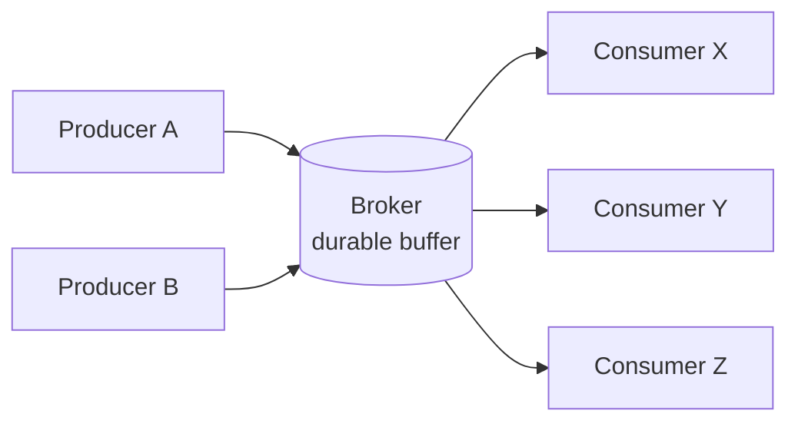
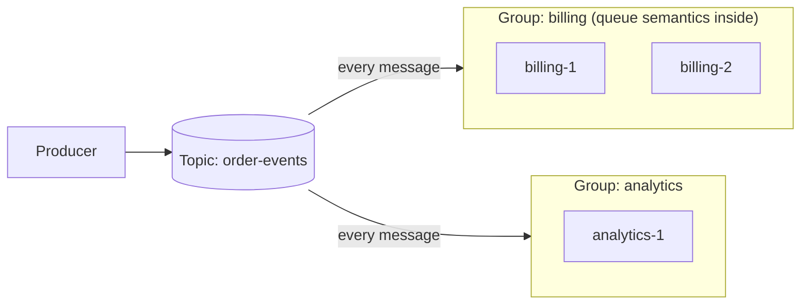
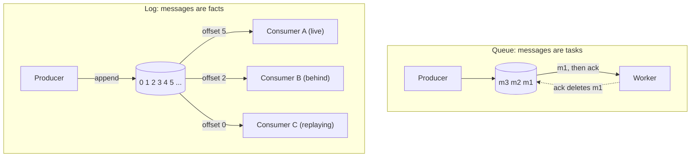
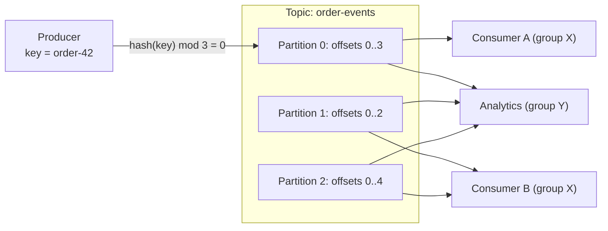
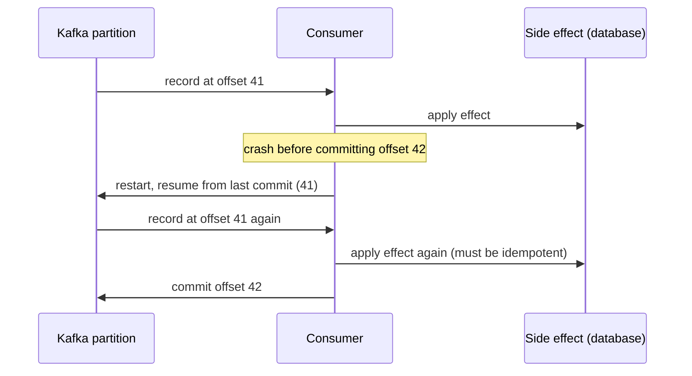
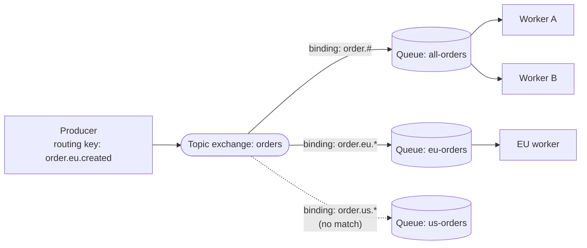
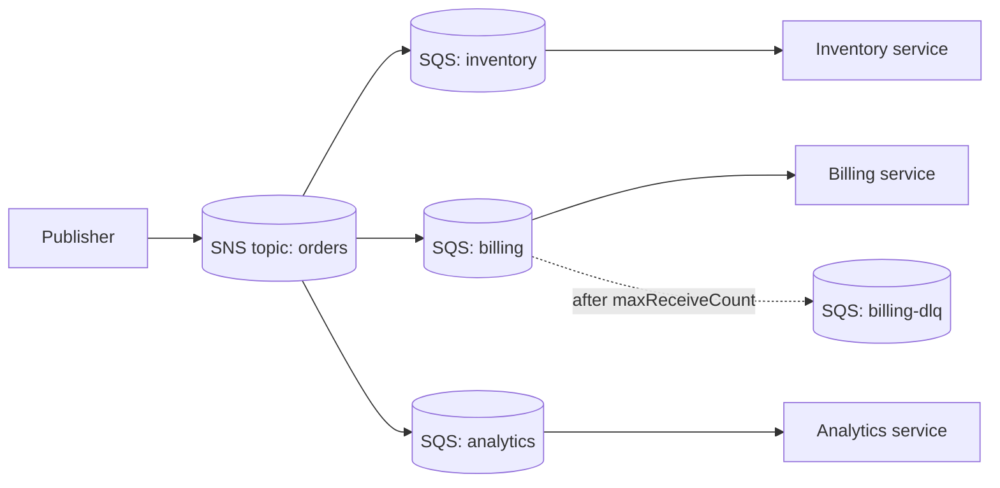
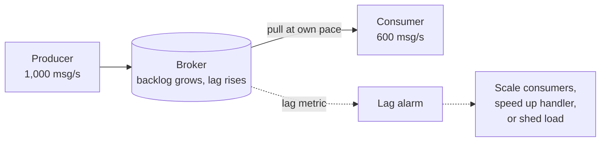
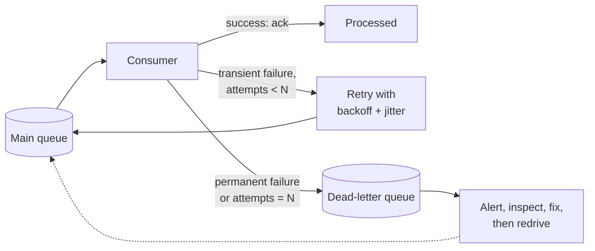

[Event-Driven](./) &raquo; Message Brokers &amp; Streaming

A **message broker** is infrastructure that lets one component publish a message and move on while another consumes it later. It decouples producers from consumers in time, in availability, and in throughput, which is the foundation of [event-driven architecture](./). Brokers differ in whether a message is a transient task or a durable fact, how they distribute work, what ordering they promise, and what happens when a consumer falls behind or a message can never be processed. This page covers the two storage models (queue and log), the major open-source brokers (Apache Kafka, RabbitMQ, NATS JetStream, Apache Pulsar), the managed cloud services, and the concerns every deployment meets: delivery semantics, ordering, exactly-once processing, backpressure, and dead-letter queues. Versions and features are current as of September 2026.

Four ideas recur throughout:

- **Queue vs. log is the first design fork.** A queue hands each task to one worker and deletes it once acknowledged; a log retains an ordered, replayable history that many consumers read independently.
- **Ordering is per key, not global.** Brokers order messages within a partition, shard, queue, or message group. Route all events for one entity through the same one by keying on a stable ID.
- **At-least-once is the practical default.** Under crashes and retries, duplicates are normal. Exactly-once *effects* come from idempotent consumers or transactions, not from the network.
- **Consumer lag is the health signal.** A broker absorbs bursts but cannot make a slow consumer fast. Growing lag is the early warning that consumption is losing.

## Table of contents
{: .no_toc .text-delta }

1. TOC
{:toc}

---

## What a Message Broker Does

A broker is a server or cluster between **producers**, which emit messages, and **consumers**, which process them. Instead of calling a consumer directly, a producer hands the message to the broker, which stores it durably and delivers it to the right consumers. The indirection provides three kinds of decoupling that a synchronous call cannot:

| Decoupling | Meaning |
|------------|---------|
| **Temporal** | The consumer need not be running when the message is produced; the broker holds it until a consumer is ready. |
| **Availability** | Producers keep working while a consumer is down, redeploying, or restarting. |
| **Throughput** | A burst of production does not overwhelm a slow consumer; the broker buffers it and the consumer drains at its own rate. |



Brokers also provide **fan-out** (one message reaching many independent consumers) and **load leveling** (smoothing spiky input into steady processing). The cost is a stateful distributed system in the middle of the architecture that must be operated and monitored, and results that are eventually rather than immediately consistent.

### Vocabulary

| Term | Meaning |
|------|---------|
| **Producer / publisher** | Sends messages to the broker. |
| **Consumer / subscriber** | Receives and processes messages. |
| **Message / event / record** | A unit of data: a *task* to perform (command) or a *fact* that happened (event). |
| **Topic / queue / stream / subject** | The named destination producers write to and consumers read from. |
| **Acknowledgement (ack)** | A consumer's signal that it handled a message. |
| **Offset / cursor / sequence** | A consumer's position in an ordered stream. |
| **Partition / shard** | An independently ordered slice of a topic or stream, the unit of parallelism. |
| **Consumer lag** | How far a consumer's position trails the newest message. |

## Delivery Shapes: Queues and Publish/Subscribe

Two delivery shapes determine how many consumers see each message. Most brokers support both.

In the **point-to-point queue**, each message goes to exactly one consumer from a pool of **competing consumers**. Adding workers drains the queue faster. This suits work distribution: resizing images, sending emails, running fulfillment jobs.

In **publish/subscribe**, each message goes to every subscriber. The publisher writes to a topic and each subscriber receives its own copy. This suits event broadcasting: an `OrderPlaced` event that inventory, billing, analytics, and notifications each react to.

Real systems want both at once: every *service* should see every event, but the replicas *within* a service should split the work. Brokers express this composite with **consumer groups** (Kafka), **subscriptions** (Google Pub/Sub, Pulsar), per-service queues bound to an exchange (RabbitMQ), or SNS topics fanning out to per-service SQS queues. Each group receives the full stream; members of a group share it.



| | Point-to-point queue | Publish/subscribe |
|---|---|---|
| Consumers per message | One, from a competing pool | Every subscriber |
| Adding a consumer | Increases throughput | Adds another independent recipient |
| Typical use | Work distribution | Event notification and fan-out |
| Composite model | Members of one consumer group | Separate consumer groups |

## Storage Models: Queues and Logs

Classifying brokers by how they store and retire messages gives the more consequential distinction.

A **message queue** (RabbitMQ classic and quorum queues, Amazon SQS, ActiveMQ) treats a message as a *task*. It is delivered, acknowledged, and **removed**. The broker tracks which messages are outstanding; once work completes, the message is gone and cannot be re-read.

A **log** (Apache Kafka, Amazon Kinesis, Apache Pulsar, Redpanda, RabbitMQ Streams, NATS JetStream) treats a message as an immutable *fact* appended to an ordered, durable sequence. Consuming does **not** delete it. Records are retained by time, size, or indefinitely, and each consumer tracks its own position, so many consumers read the same data at their own pace and a new consumer can replay from the beginning. Jay Kreps described the log as the unifying abstraction behind databases and streaming: an ordered changelog from which any number of views can be derived.



| | Message queue | Log |
|---|---|---|
| Message model | Transient task | Durable, ordered fact |
| After consumption | Removed | Retained until retention expires |
| Consumers per message | One (competing consumers) | Many (independent groups) |
| Ordering | Per queue; weakens with competing consumers and redelivery | Strict per partition |
| Re-reading history | Not possible | Seek to an offset or timestamp |
| Who tracks progress | Broker tracks each message's state | Consumer tracks one offset per partition |
| Best for | Work distribution, job queues, request/reply | Event streaming, event sourcing, analytics, change data capture |

Retention drives everything else. Because a log keeps history, it supports replay, [event sourcing](patterns.html#event-sourcing), and adding consumers after the fact. Because a queue discards consumed messages, it stays small and simple but cannot rebuild a downstream view from the past. The line has blurred: RabbitMQ has offered log-structured Streams since 3.9, and Kafka added queue-style **share groups** in the 4.x series. The distinction is still the right first question: is this message a one-shot job, or a fact that others may want to read and re-read?

## Apache Kafka

Kafka is the dominant log-based streaming platform, and its concepts reappear, sometimes renamed, in Kinesis, Pulsar, Redpanda, and Google Pub/Sub.

### Kafka 4.x

The 4.x series is the largest architectural change in Kafka's history:

| Release | Date | Highlights |
|---------|------|------------|
| **4.0** | March 2025 | First release that runs entirely without ZooKeeper; metadata is managed by the built-in Raft-based **KRaft** controller quorum. The new consumer group rebalance protocol (KIP-848) became generally available. Share groups (KIP-932) arrived in early access. Brokers require Java 17; clients require Java 11. |
| **4.1** | September 2025 | Share groups in preview. |
| **4.2** | February 2026 | **Share groups (Queues for Kafka) production-ready**; the server-side rebalance protocol for Kafka Streams reached GA. |
| **4.3** | May 2026 | Current feature release at the time of writing. |

Clusters still on ZooKeeper must migrate to KRaft on a 3.x release (3.9 is the bridge release) before upgrading to 4.x. Separately, **tiered storage** (KIP-405), which offloads older log segments to object storage, became production-ready in 3.9, and the accepted **Diskless Topics** proposal (KIP-1150) goes further by writing active segments directly to object storage to avoid cross-availability-zone replication costs.

### Topics, Partitions, and Offsets

- A **topic** is a named stream of records, such as `order-events`.
- A topic is divided into **partitions**, each an independent, totally ordered, append-only log. Partitions are spread across brokers and consumed in parallel; they are Kafka's unit of scaling.
- Each record has an **offset**, its position within its partition. Offsets are per partition, not global. Consumers **commit** offsets to record progress.
- The producer chooses the partition. A record with a **key** is placed by hashing the key, so all records with the same key land in the same partition and stay in order. Records without a key are spread across partitions (the default partitioner batches them to one partition at a time for efficiency).



The partition count caps parallelism within a consumer group: a topic with 12 partitions can be consumed by at most 12 active members of one group, and a 13th sits idle. It is therefore a capacity-planning decision. Too few partitions limit throughput; too many add per-partition overhead on brokers and clients. Partitions can be added but never removed, and adding them changes the key-to-partition mapping, so per-key ordering is not preserved across the change. Share groups (below) remove the partition-count ceiling for workloads that do not need ordering.

### Consumer Groups and Rebalancing

A **consumer group** is a set of consumers sharing a `group.id`. Kafka assigns each partition to exactly one member, so a partition's records are processed in order by one consumer while different partitions are processed in parallel. Different groups each receive the full topic independently.

When members join or leave because of a deploy, crash, or scale-out, partitions are **rebalanced** across the remaining members. Under the classic protocol the group coordinated this on the client side, and rebalances paused consumption across the group ("stop-the-world"); cooperative incremental assignment reduced but did not remove the disruption. The **consumer rebalance protocol** of KIP-848, GA in Kafka 4.0 and enabled with `group.protocol=consumer`, moves assignment to the broker-side group coordinator and reconciles each member incrementally, so a membership change no longer stops the whole group.

### Share Groups: Queues for Kafka

A **share group** (KIP-932) gives Kafka queue semantics. Members of a share group consume the same partitions cooperatively, so more consumers than partitions can work at once, and each record is acknowledged individually rather than by advancing an offset. A record is delivered with a time-limited acquisition lock; the consumer acknowledges it as accepted, releases it for redelivery, or rejects it, and a record that is delivered too many times is archived rather than retried forever. Share groups trade per-partition ordering for elastic, per-message work distribution, which previously required a separate queueing system next to Kafka.

| | Consumer group | Share group |
|---|---|---|
| Partition assignment | Exclusive: one member per partition | Shared: many members per partition |
| Max useful consumers | Number of partitions | Not limited by partitions |
| Progress tracking | Committed offset per partition | Per-record acknowledgement |
| Ordering | Preserved within a partition | Not guaranteed |
| Typical use | Ordered stream processing | Job queues, elastic worker pools |

### Replication and Durability

Each partition is replicated to `replication.factor` brokers. One replica is the **leader**, which serves writes and by default reads; the others are **followers** that copy its log. Followers that are caught up form the **in-sync replica set (ISR)**. The producer's `acks` setting trades durability for latency:

| `acks` | Acknowledged when | Risk |
|--------|-------------------|------|
| `0` | Sent, without waiting | Any failure can lose the record |
| `1` | The leader has written it | Lost if the leader fails before followers copy it |
| `all` (default since 3.0) | All in-sync replicas have it | Survives leader failure when combined with `min.insync.replicas` of at least 2 |

A common durable configuration is `replication.factor=3`, `min.insync.replicas=2`, `acks=all`: a write succeeds only if at least two replicas hold it, and the partition stays writable with one broker down.

### Delivery Semantics and Transactions

Kafka's default end-to-end behavior is **at-least-once**. A consumer that processes a record and crashes before committing its offset will re-read the record after restart:



Committing *before* processing gives at-most-once (a crash loses the record); committing *after* gives at-least-once (a crash repeats it). Kafka offers exactly-once *processing* for pipelines that read from and write to Kafka:

- The **idempotent producer** (on by default since 3.0) attaches a producer ID and sequence number so that retried sends are not written twice.
- **Transactions** atomically write output records *and* the consumer's offset advance. Downstream consumers set `isolation.level=read_committed` to skip records from aborted transactions.

This guarantee ends at Kafka's boundary: an email sent or a row written to an external database during processing is not rolled back with the transaction. The Jepsen analysis of Bufstream (2024) also showed that the transaction protocol itself could produce "torn" transactions when messages on different client connections arrived out of order; the transaction server-side defense work of KIP-890, which shipped in Kafka 4.0, targets this class of problem, so keep clients and brokers current. See [Ordering, Delivery Semantics & Exactly-Once](#ordering-delivery-semantics--exactly-once) for the general approach.

### Log Compaction

By default Kafka deletes records older than the retention period (`cleanup.policy=delete`). With `cleanup.policy=compact`, it keeps at least the **latest record for each key** and discards older ones. A compacted topic is a durable, replayable snapshot of current state, such as the latest profile per user or the latest configuration per service. A record with a `null` value is a **tombstone** that marks the key deleted and is itself removed after a grace period. Compaction lets a topic back a table (Kafka Streams' `KTable`) and carry change-data-capture streams from tools such as Debezium.

### Client Example

A producer should be long-lived and shared, not created per message. The example below uses Python's `aiokafka`:

```python
import json

from aiokafka import AIOKafkaConsumer, AIOKafkaProducer

producer = AIOKafkaProducer(
    bootstrap_servers="localhost:9092",
    value_serializer=lambda v: json.dumps(v).encode(),
    acks="all",                 # wait for all in-sync replicas
    enable_idempotence=True,    # retries cannot create duplicates in the log
)
# At startup: await producer.start(); at shutdown: await producer.stop()


async def publish_order_created(order):
    await producer.send_and_wait(
        "order-events",
        {"order_id": order["id"], "status": "created"},
        key=str(order["id"]).encode(),   # same order -> same partition -> ordered
    )


async def consume_orders():
    consumer = AIOKafkaConsumer(
        "order-events",
        bootstrap_servers="localhost:9092",
        group_id="order-processor",      # members share the partitions
        enable_auto_commit=False,        # commit only after processing
        auto_offset_reset="earliest",
    )
    await consumer.start()
    try:
        async for msg in consumer:
            await handle_order(json.loads(msg.value))   # must be idempotent
            await consumer.commit()                     # after success: at-least-once
    finally:
        await consumer.stop()
```

Committing after every record is simple but slow; production consumers usually process a batch from `getmany()` and commit once per batch, which widens the duplicate window but not the guarantee.

## RabbitMQ

RabbitMQ is the most widely deployed traditional message broker. Where Kafka is a partitioned log, RabbitMQ is a flexible **routing fabric** of exchanges, queues, and bindings. It speaks AMQP 0-9-1 and, since 4.0, AMQP 1.0 as a core protocol, plus MQTT and STOMP through plugins.

### The 4.x Series

| Release | Date | Highlights |
|---------|------|------------|
| **4.0** | 2024 | **Classic queue mirroring removed**: quorum queues and streams are the only replicated types. AMQP 1.0 became a core protocol. Quorum queues default to a delivery limit of 20. |
| **4.1** | April 2025 | Quorum queue performance and feature-parity improvements; AMQP 1.0 over WebSocket. |
| **4.2** | October 2025 | Long-term support series. Broker-side SQL filter expressions for streams. Continued move to **Khepri**, a Raft-based metadata store replacing Mnesia. |
| **4.3** | April 2026 | Current feature series at the time of writing. |

Clusters that relied on mirrored classic queues must migrate them to quorum queues before upgrading to 4.x.

### Exchanges, Queues, and Bindings

A producer publishes to an **exchange** with a **routing key**, never directly to a queue. The exchange copies the message into zero or more **queues** according to its type and **bindings**, the rules connecting it to queues. Consumers read from queues.



| Exchange type | Routing rule | Typical use |
|---------------|--------------|-------------|
| **Direct** | Binding key equals the routing key | Routing by a discrete category (region, severity) |
| **Topic** | Pattern match on dot-separated words: `*` matches exactly one word, `#` zero or more | Hierarchical routing (`order.eu.created`) |
| **Fanout** | Ignores the routing key; copies to every bound queue | Broadcast |
| **Headers** | Matches message header attributes | Routing on structured metadata |

Routing topologies (pub/sub, point-to-point, content-based) are built from exchange types and bindings, with no routing logic in producers.

### Queue Types

| Type | Replication | Use |
|------|-------------|-----|
| **Quorum queue** | Raft consensus across nodes | Default choice for any queue that must survive node failure; supports poison-message handling via a delivery limit. |
| **Classic queue** | None (single node) since 4.0 | Transient or easily recreated data where replication is not needed. |
| **Stream** | Raft-replicated append-only log | Replay, large fan-out, and very long backlogs: Kafka-style log semantics inside RabbitMQ, with filtering on the broker. |

The Raft mechanics behind quorum queues and streams are covered in [Consensus & Coordination](../distributed-systems/consensus-and-coordination.html#raft).

### Acknowledgements, Prefetch, and Confirms

RabbitMQ pushes messages to consumers and waits for an **ack**. An unacknowledged message is **redelivered** if its consumer's channel or connection closes, which gives at-least-once delivery. The **prefetch** count (`basic.qos`) caps unacknowledged messages per consumer, providing per-consumer backpressure and fair dispatch so that a slow worker is not handed a large backlog. For durability, declare queues durable (quorum queues always are), publish persistent messages, and use **publisher confirms** so the producer learns when the broker has safely stored each message.

```python
# Publisher: topic exchange, persistent message, publisher confirms (pika)
import json

import pika

conn = pika.BlockingConnection(pika.ConnectionParameters("localhost"))
ch = conn.channel()
ch.confirm_delivery()   # basic_publish now raises if the broker does not confirm
ch.exchange_declare(exchange="orders", exchange_type="topic", durable=True)

ch.basic_publish(
    exchange="orders",
    routing_key="order.eu.created",
    body=json.dumps({"order_id": 42, "region": "eu"}),
    properties=pika.BasicProperties(delivery_mode=pika.DeliveryMode.Persistent),
    mandatory=True,     # fail if no queue is bound for this routing key
)
conn.close()
```

```python
# Consumer: quorum queue, manual ack, prefetch for backpressure
import json

import pika

conn = pika.BlockingConnection(pika.ConnectionParameters("localhost"))
ch = conn.channel()
ch.exchange_declare(exchange="orders", exchange_type="topic", durable=True)
ch.queue_declare(
    queue="eu-orders",
    durable=True,
    arguments={"x-queue-type": "quorum", "x-delivery-limit": 5},
)
ch.queue_bind(exchange="orders", queue="eu-orders", routing_key="order.eu.*")
ch.basic_qos(prefetch_count=10)   # at most 10 unacked messages per consumer


def on_message(channel, method, properties, body):
    try:
        handle_order(json.loads(body))                   # must be idempotent
        channel.basic_ack(delivery_tag=method.delivery_tag)
    except Exception:
        # Return to the queue; after x-delivery-limit attempts the quorum
        # queue dead-letters (if configured) or drops the message.
        channel.basic_nack(delivery_tag=method.delivery_tag, requeue=True)


ch.basic_consume(queue="eu-orders", on_message_callback=on_message)
ch.start_consuming()
```

### Kafka vs. RabbitMQ

| | RabbitMQ | Kafka |
|---|---|---|
| Core model | Routed queues (plus streams) | Partitioned, retained log (plus share groups) |
| Routing | Rich: exchanges, bindings, patterns, headers | By partition key only; routing happens in consumers or stream processors |
| Ordering | Per queue, single active consumer for strict order | Per partition |
| Replay | Streams only; queues delete on ack | Any topic, by offset or timestamp |
| Delivery to consumers | Push with prefetch | Pull (poll) |
| Replication | Raft (quorum queues, streams) | Leader/ISR replication; KRaft for metadata |
| Sweet spot | Task queues, complex routing, request/reply, per-message acks | High-volume event streams, event sourcing, CDC, stream processing |

## Other Open-Source Brokers

| Broker | Model | Notes |
|--------|-------|-------|
| **NATS / JetStream** | Subject-based pub/sub; JetStream adds persisted streams | Lightweight core with at-most-once pub/sub and request/reply. JetStream adds durable streams, pull and push consumers with acks and redelivery, Raft replication, and key-value and object stores built on streams. |
| **Apache Pulsar** | Log with separated storage (Apache BookKeeper) | Compute (brokers) and storage (bookies) scale independently; built-in multi-tenancy and geo-replication; subscription types (exclusive, failover, shared, key-shared) cover both stream and queue use. |
| **Redpanda** | Kafka-compatible log | Single C++ binary with Raft per partition and no JVM; implements the Kafka protocol. |
| **Redis Streams** | Append-only log in Redis | Consumer groups with pending-entry lists; convenient when Redis is already present, bounded by memory. |

Kafka's protocol has become a de facto standard, and several systems implement it over object storage (WarpStream, AutoMQ, Bufstream) to reduce the cost of cross-zone replication, the same motivation as KIP-1150.

Durability defaults deserve scrutiny. Jepsen's analysis of NATS 2.12.1 (December 2025) found that JetStream acknowledged writes before `fsync` and by default flushed to disk only every two minutes, so a power loss or kernel crash across nodes could lose acknowledged messages. Brokers differ on whether "acknowledged" means "in memory on a quorum" or "on disk on a quorum"; know which one your configuration provides.

## Cloud-Managed Brokers

Managed services trade some control and portability for not operating a stateful cluster.

### AWS: SQS, SNS, and EventBridge

**Amazon SQS** is a managed queue.

- **Standard queues** offer nearly unlimited throughput, at-least-once delivery, and best-effort ordering: messages can occasionally arrive out of order or twice. Setting a `MessageGroupId` on a standard queue enables **fair queues**, which limit the effect of one noisy tenant's backlog on the others without imposing ordering.
- **FIFO queues** preserve order within a **message group** (`MessageGroupId`, SQS's partition-key analogue) and deduplicate messages with the same deduplication ID within a five-minute window. Throughput is 300 API calls per second per action, or far higher in high-throughput mode.

SQS uses a **visibility timeout** instead of per-message locks: a received message is hidden from other consumers for a window (30 seconds by default, up to 12 hours), and the consumer must delete it before the window expires or it becomes visible again for redelivery. Messages can be up to 1 MiB and are retained for 4 days by default, up to 14 days.

**Amazon SNS** is managed pub/sub. A topic fans out to HTTP endpoints, Lambda functions, email, and, most usefully, SQS queues. The canonical AWS pattern is **SNS-to-SQS fan-out**: publish once to a topic and give each consuming service its own subscribed queue, which it drains independently. SNS FIFO topics pair with SQS FIFO queues when ordering matters.



**Amazon EventBridge** is a serverless event bus. Instead of topics, **rules** match on the content of events (source, type, and fields in the JSON body) and route them to targets, including other AWS services and SaaS integrations. It suits routing many event types across accounts and services where SNS's topic-per-stream model would be unwieldy, and supports archiving and replaying events.

### AWS: Kinesis Data Streams

**Kinesis Data Streams** is AWS's managed log. A stream is split into **shards** (partitions); each record has a **partition key**, hashed to a shard, and a **sequence number** (offset). A shard accepts up to 1 MB/s or 1,000 records/s of writes. Retention is 24 hours by default and can be extended up to 365 days. Streams run in provisioned mode (you manage shard count) or on-demand mode (AWS scales shards). **Enhanced fan-out** gives each registered consumer dedicated read throughput per shard. Amazon MSK is the managed option when Kafka API compatibility is required.

### Google Cloud Pub/Sub

**Google Cloud Pub/Sub** combines the models. Each **subscription** on a topic receives every message (pub/sub across subscriptions) and delivers each message to one of its subscribers (queue within a subscription). It is global and autoscaling, at-least-once by default, with optional **exactly-once delivery** on pull subscriptions and optional **ordering keys** for per-key order. Subscriptions can be pull, push (HTTP POST to an endpoint), or export subscriptions that write directly to BigQuery or Cloud Storage. Retained messages can be replayed with **seek** to a timestamp or snapshot. Google also offers Managed Service for Apache Kafka.

### Cloud Broker Comparison

| Service | Model | Ordering | Delivery | Replay | Partition-key analogue |
|---------|-------|----------|----------|--------|------------------------|
| **SQS standard** | Queue | Best effort | At-least-once | No | `MessageGroupId` (fairness only) |
| **SQS FIFO** | Queue | Per message group | At-least-once with 5-minute deduplication | No | `MessageGroupId` |
| **SNS** | Pub/sub | FIFO topics only | At-least-once | No (FIFO topics: archive and replay) | Message group (FIFO) |
| **EventBridge** | Event bus with content routing | None | At-least-once | Archive and replay | None |
| **Kinesis Data Streams** | Log | Per shard | At-least-once | Yes, within retention | Partition key |
| **Google Pub/Sub** | Hybrid | Per ordering key (opt-in) | At-least-once; exactly-once opt-in | Yes (seek) | Ordering key |
| **Kafka (MSK, Confluent Cloud, self-hosted)** | Log | Per partition | At-least-once; exactly-once within Kafka | Yes | Record key |

## Ordering, Delivery Semantics & Exactly-Once

These three concerns are entangled. Getting them right, or knowing exactly what is being given up, is the core skill of using a broker.

### Ordering Is Per Key

No broker offers cheap global ordering across a whole topic at scale, because total order requires a single serialization point and removes parallelism. Brokers instead order within a **partition** (Kafka, Pulsar), a **shard** (Kinesis), a **queue** (RabbitMQ), a **message group** (SQS FIFO), or an **ordering key** (Pub/Sub). The universal technique is to **key by a stable entity ID** (order ID, account ID, device ID) so all events for one entity share a partition and are delivered in the order produced. Events for different keys interleave arbitrarily, and designs must not assume otherwise.

Ordering is also fragile in ways that are easy to miss:

- **Retries can reorder.** A producer with several in-flight requests can see an early batch fail and be retried after a later one succeeds. Kafka's idempotent producer preserves order for up to five in-flight requests per connection; other clients may need `max.in.flight=1`.
- **Competing consumers reorder.** Two workers on the same queue finish in unpredictable order. Strict order needs one active consumer per key (Kafka partitions, RabbitMQ single active consumer, SQS FIFO groups).
- **Redelivery reorders.** A message that is nacked and redelivered arrives after its successors.

Coarser keys give more ordering but less parallelism; finer keys give more parallelism but order only within each key. A hot key, one entity producing a large share of traffic, overloads a single partition, and no partition count fixes it.

### The Three Delivery Semantics

| Semantic | Guarantee | How it is obtained | Cost |
|----------|-----------|--------------------|------|
| **At-most-once** | Delivered zero or one time | Ack or commit *before* processing | Loses messages on failure |
| **At-least-once** | Delivered one or more times | Ack or commit *after* processing | Duplicates on failure and retry |
| **Exactly-once effect** | Each message's effect applied once | At-least-once plus idempotency or transactions | Complexity and some throughput |

With unreliable networks and crashing processes, **at-least-once is the honest default**. The choice is between losing messages and occasionally duplicating them, and for nearly all business workloads duplication is the lesser problem: duplicates can be detected and discarded, but a lost event cannot be recovered.

### Achieving Exactly-Once Effects

Exactly-once *delivery* across an unreliable network is not achievable in general: a sender that gets no acknowledgement cannot tell whether the message or the acknowledgement was lost. What systems actually provide is an exactly-once **effect**, reached in two ways:

1. **Idempotent consumers.** Make processing a message twice equivalent to processing it once. Record processed message IDs in the same transaction as the effect; use upserts keyed on a natural key instead of blind inserts; prefer absolute updates (`status = 'paid'`) over relative ones (`balance += amount`). This works with any broker and is what makes at-least-once safe. See [Idempotent Consumers](patterns.html#idempotent-consumers).
2. **Transactions.** When input, processing, and output live in one system, a transaction can make the side effect and the progress marker atomic: Kafka transactions for read-process-write within Kafka, or the **transactional outbox** when the effect is a database write that must also publish an event (see [The Outbox & Inbox Patterns](patterns.html#the-outbox--inbox-patterns)).

```python
# Idempotent consumer: dedup record and business effect commit together
def handle(event):
    with db.transaction() as tx:
        inserted = tx.execute(
            "INSERT INTO processed_events (event_id) VALUES (%s) "
            "ON CONFLICT (event_id) DO NOTHING",
            (event["id"],),
        ).rowcount
        if inserted == 0:
            return                      # duplicate: already applied
        apply_business_effect(tx, event)
```

Inserting the ID first, inside the same transaction as the effect, avoids the race in a separate "check, then act, then mark" sequence, where two concurrent deliveries of the same message can both pass the check.

## Backpressure & Dead-Letter Queues

A broker decouples production rate from consumption rate but cannot make a slow consumer fast. Two mechanisms keep the system healthy when consumers fall behind or a message cannot be processed at all.

### Backpressure

**Backpressure** stops a fast producer or deep backlog from overwhelming a consumer or exhausting the broker:

- **Pull-based consumers** (Kafka, Kinesis, Pub/Sub pull, JetStream pull) have backpressure built in: a consumer fetches only what it asks for. A slow consumer simply falls behind, and its **consumer lag** grows.
- **Push-based delivery** (RabbitMQ, Pub/Sub push) relies on **prefetch** or flow-control limits that stop delivery once a consumer's window of unacknowledged messages is full.
- **Bounded queues** make the trade-off explicit: when full, the broker blocks or throttles publishers (RabbitMQ's memory and disk alarms), or rejects or drops messages (`x-max-length` with `reject-publish` or `drop-head`).



When production durably exceeds consumption, the only real fixes are to **add consumers** (up to the partition count, or beyond it with share groups or queues), **process faster** (batching, fewer round trips), or **shed load**. Backpressure prevents collapse; it does not add capacity. Alert on lag measured in *time* (age of the oldest unprocessed message) rather than message count, since the same count can mean seconds or hours depending on throughput.

### Dead-Letter Queues

Some messages can never be processed: malformed payloads, references to deleted entities, or inputs that trigger a handler bug. Under at-least-once delivery such a **poison message** is redelivered indefinitely, blocking its partition or queue and consuming resources. A **dead-letter queue (DLQ)** breaks the loop: after a bounded number of attempts, the message moves to a separate queue or topic for inspection and the consumer moves on.



| Broker | DLQ mechanism |
|--------|---------------|
| **SQS** | Redrive policy: after `maxReceiveCount` receives, move to a DLQ; DLQ redrive moves messages back to the source queue. |
| **RabbitMQ** | Dead-letter exchange (`x-dead-letter-exchange`) receives rejected, expired, and over-length messages; quorum queues dead-letter after the delivery limit. |
| **Kafka** | Implemented by the application or framework: a separate DLQ topic (Kafka Connect's `errors.deadletterqueue.topic.name`; Kafka Streams exception handlers can write DLQ records as of 4.2). Share groups archive records after a maximum delivery count. |
| **Google Pub/Sub** | Dead-letter topic on a subscription after a maximum number of delivery attempts. |

Distinguish transient failures (a timeout, a throttled dependency), which should be retried with **exponential backoff and jitter**, from permanent ones (a validation error), which should go to the DLQ immediately rather than burn retries. Record *why* each message failed (exception, attempt count, original topic and offset), **alert when the DLQ is non-empty** since it holds unprocessed business events, and provide tooling to replay messages once the cause is fixed. In an ordered stream, decide explicitly whether a dead-lettered message should block later messages for the same key; skipping it can apply later events on top of a missing one.

## Choosing a Broker

| Need | Good fits |
|------|-----------|
| Task queues, complex routing, request/reply, per-message acknowledgement | RabbitMQ; SQS; Kafka share groups if Kafka is already the platform |
| Replay, event sourcing, change data capture, high-volume streams, many independent readers | Kafka (self-hosted, MSK, Confluent Cloud, or Kafka-compatible), Pulsar, Kinesis |
| Zero operations inside one cloud | SQS and SNS, EventBridge, Kinesis, or Google Pub/Sub |
| Cross-service fan-out with independent draining | SNS to SQS, Pub/Sub subscriptions, Kafka consumer groups, RabbitMQ fanout or topic exchanges |
| Lightweight messaging, edge and IoT, request/reply with optional persistence | NATS with JetStream |

Whatever the choice, the same disciplines apply: **key by a stable ID** for the ordering you need, assume **at-least-once** and make consumers **idempotent**, confirm what "acknowledged" means for durability in your configuration, monitor **consumer lag** in time units, and wire a **DLQ** with alerting and replay.

## See Also

- **[Event-Driven Hub](./)**: events vs. commands, choreography vs. orchestration, and asynchronous decoupling
- **[Event-Driven Patterns](patterns.html)**: event sourcing, CQRS, sagas, the outbox and inbox, idempotent consumers, and schema evolution
- **[Microservices & Event-Driven Architecture](../distributed-systems/microservices-and-event-driven.html)**: where brokers fit in a service architecture, including the [outbox pattern](../distributed-systems/microservices-and-event-driven.html#the-dual-write-problem-and-the-outbox-pattern)
- **[Async & Event-Driven APIs](../api-design/async-and-events.html)**: webhooks, SSE, CloudEvents, and AsyncAPI at the API boundary
- **[Consensus & Coordination](../distributed-systems/consensus-and-coordination.html)**: the Raft machinery behind KRaft, quorum queues, and JetStream
- **[Resilience Patterns](../distributed-systems/resilience-patterns.html)**: retries, backoff, circuit breakers, and idempotency
- **[Testing Distributed Systems](../distributed-systems/testing-distributed-systems.html)**: Jepsen-style testing of broker durability and ordering claims
- **[Database Design](../technology/database-design/)**: the data stores behind deduplication tables, outboxes, and read models
