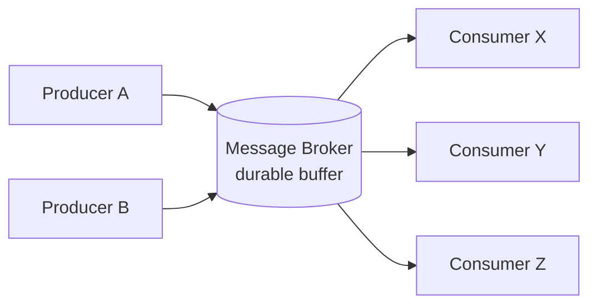
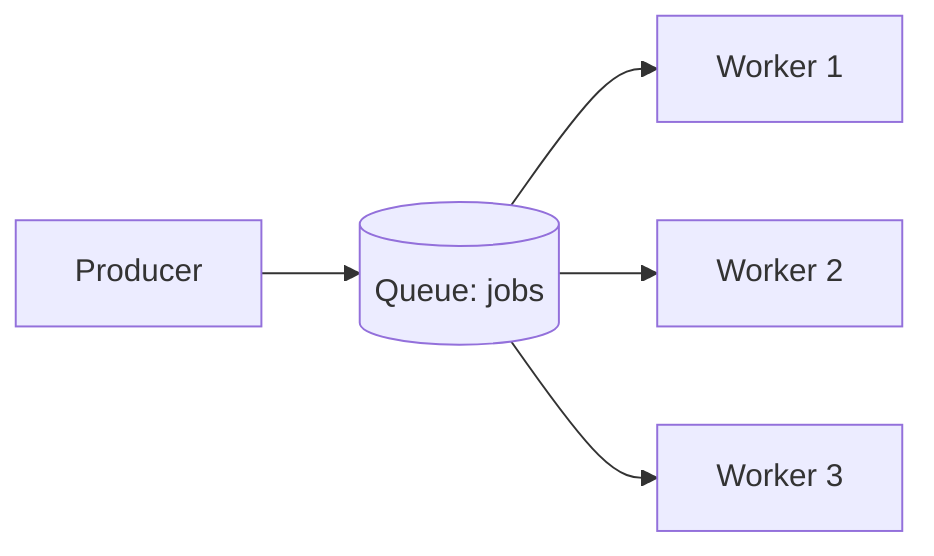
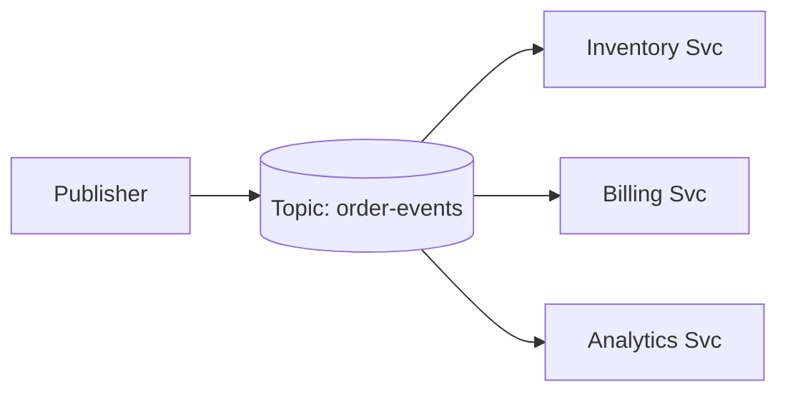
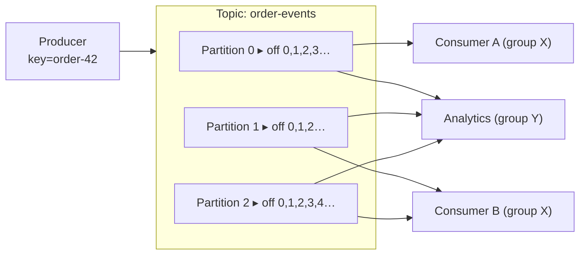
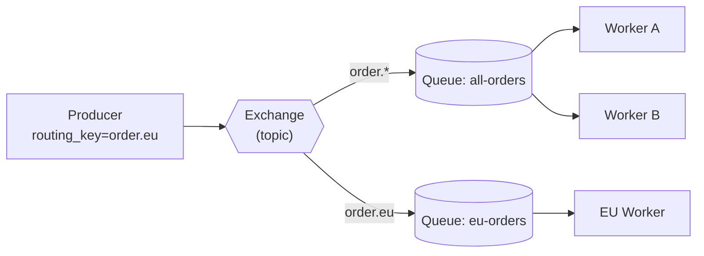
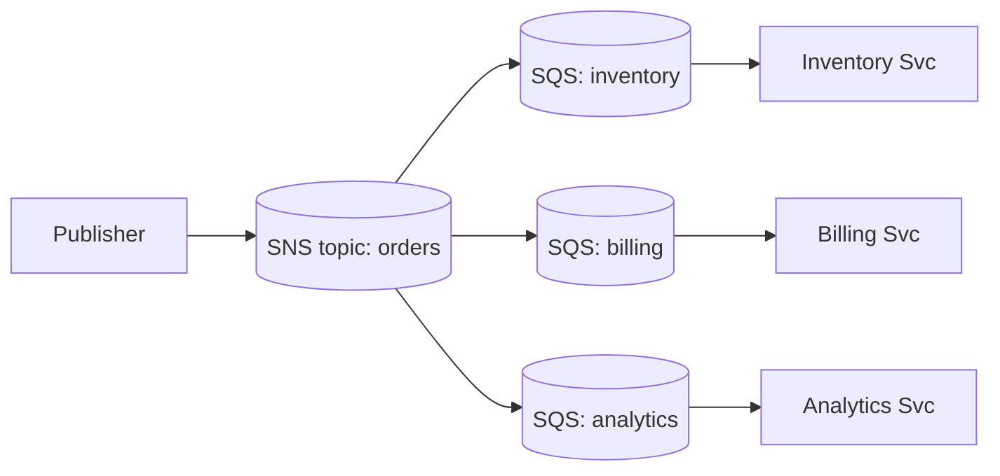
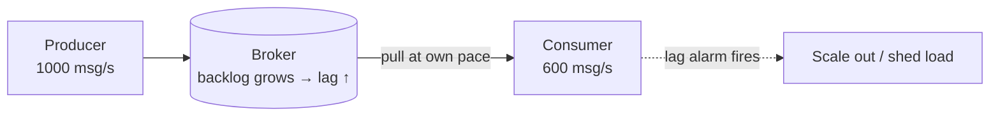
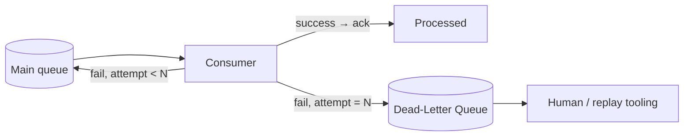

<div class="hero-section" style="background: linear-gradient(135deg, #667eea 0%, #764ba2 100%); color: white; padding: 3rem 2rem; margin: -2rem -3rem 2rem -3rem; text-align: center;">
  <h1 style="color: white; margin: 0; font-size: 2.5rem;">Message Brokers &amp; Streaming</h1>
  <p style="font-size: 1.25rem; margin-top: 1rem; opacity: 0.9;">The asynchronous backbone of event-driven systems — queues vs. logs, Kafka and RabbitMQ internals, cloud brokers, and the hard problems of ordering, exactly-once, and backpressure.</p>
</div>

[Event-Driven](./) &raquo; Message Brokers &amp; Streaming

<div class="intro-card">
  <p class="lead-text">A message broker is the piece of infrastructure that lets one component publish a message and walk away while another consumes it later — decoupling producers and consumers <em>in time</em>, in <em>availability</em>, and in <em>throughput</em>. That decoupling is the whole point of event-driven architecture, and it is also where the subtlety lives: brokers differ on whether a message is a transient task or a durable fact, on how they distribute work, on what ordering they promise, and on what happens when a consumer falls behind or a message can never be processed. This page builds up the broker's role from first principles, then dissects the two dominant open-source brokers (Apache Kafka's partitioned log and RabbitMQ's exchange/queue routing), surveys the managed cloud options (SQS/SNS, Google Pub/Sub, Kinesis), and tackles the cross-cutting concerns every real deployment hits: delivery semantics, ordering, exactly-once, backpressure, and dead-letter queues.</p>
</div>

<div class="key-insights">
  <div class="insight-card">
    <i class="fas fa-clock"></i>
    <h4>Brokers decouple in time</h4>
    <p>A producer and consumer need not be up at the same moment — the broker buffers the difference, absorbing bursts and tolerating downtime.</p>
  </div>
  <div class="insight-card">
    <i class="fas fa-stream"></i>
    <h4>Queue vs. log is the first fork</h4>
    <p>A queue hands a task to one worker and deletes it; a log retains an ordered, replayable history many consumers read independently.</p>
  </div>
  <div class="insight-card">
    <i class="fas fa-sort-amount-down"></i>
    <h4>Ordering is local, not global</h4>
    <p>Strict ordering exists only within a partition or a single queue — partition by a stable key to keep one entity's events in order.</p>
  </div>
  <div class="insight-card">
    <i class="fas fa-redo"></i>
    <h4>At-least-once is the default; idempotency is the cure</h4>
    <p>Duplicates are normal under failure. "Exactly-once" is achieved by making consumers idempotent, not by trusting the wire.</p>
  </div>
</div>

## Table of contents
{: .no_toc .text-delta }

1. TOC
{:toc}

---

## What a Message Broker Is

A **message broker** is a server (or cluster) that sits between **producers** that emit messages and **consumers** that process them. Instead of calling a consumer directly, a producer hands a message to the broker, which stores it durably and delivers it to the appropriate consumer(s). This indirection buys three forms of decoupling that a direct synchronous call cannot:

- **Temporal decoupling** — the consumer need not be running when the message is produced. The broker holds the message until a consumer is ready.
- **Availability decoupling** — a producer can keep emitting while a consumer is down, redeploying, or restarting; the broker absorbs the gap.
- **Throughput decoupling** — a sudden burst of production does not overwhelm a slow consumer; the broker buffers, and the consumer drains at its own pace (the basis of *backpressure*, below).



A broker also enables **fan-out** (one message reaching many independent consumers) and **load leveling** (smoothing a spiky workload into a steady one). The cost is real: you now run, monitor, and reason about a stateful distributed system in the middle of your architecture, and the result of a published message is *eventually* consistent rather than immediate.

### Core Vocabulary

| Term | Meaning |
|------|---------|
| **Producer / Publisher** | Emits messages to the broker |
| **Consumer / Subscriber** | Reads and processes messages from the broker |
| **Message / Event** | A unit of data; a *task* to do (command) or a *fact* that happened (event) |
| **Topic / Queue / Channel** | The named destination a producer writes to and consumers read from |
| **Acknowledgement (ack)** | A consumer's signal that a message was successfully handled |
| **Offset / Cursor** | A consumer's recorded position in an ordered stream |
| **Broker** | A single node of the messaging cluster |

## Queues vs. Publish/Subscribe

There are two fundamental *delivery shapes*, and most brokers support both (sometimes blended). The distinction governs how many consumers see each message.

### Point-to-Point Queues

In the **queue** (point-to-point) model a message goes to **exactly one** consumer out of a pool of competing consumers. This is the **competing-consumers** pattern: attach more workers to the same queue and the broker spreads messages across them, so the queue drains faster. Once a worker acknowledges a message it is removed. Queues are ideal for **work distribution** — image resizing, email sending, order fulfillment jobs — where each task should be done once by whichever worker is free.



### Publish/Subscribe

In the **publish/subscribe** model a message goes to **every** interested subscriber. The publisher emits to a topic; each subscriber gets its own copy. Pub/sub is ideal for **event broadcasting** — an `OrderPlaced` event that inventory, billing, analytics, and notifications all need to react to, each independently.



### Reconciling the Two with Consumer Groups

Real systems want both at once: each *kind* of consumer should see every message (pub/sub across services), but within one kind the work should be split (queue among that service's replicas). Brokers solve this with **consumer groups** (Kafka's term) or per-subscription queues (RabbitMQ, SNS+SQS): each group/subscription receives the full stream (pub/sub), while members *within* a group share the messages (queue). This composite model is what makes a single Kafka topic or an SNS→SQS fan-out serve a whole microservice fleet.

| | Queue (point-to-point) | Pub/Sub (broadcast) |
|---|---|---|
| Consumers per message | One (of a competing pool) | All subscribers |
| Adding consumers | Increases throughput | Adds another independent recipient |
| Use case | Work distribution | Event notification / fan-out |
| Composite | One consumer group | Many consumer groups |

## Queues vs. Logs

Cutting the broker landscape a *different* way — by how a message is stored and retired — gives the most consequential design distinction of all: the **transient queue** versus the **durable log**.

A **message queue** (RabbitMQ, Amazon SQS, ActiveMQ) treats a message as a *task*. It is delivered to one consumer, acknowledged, and then **removed**. The broker's job is to track which messages are outstanding; once done, they are gone. There is no concept of "re-reading" — the queue is a to-do list that shrinks as work completes.

A **log-structured stream** (Apache Kafka, AWS Kinesis, Apache Pulsar, Redpanda) treats a message as an *immutable fact* appended to an ordered, durable log. Messages are **not** deleted on consumption — they are retained for a configured time (hours, days, or forever) and each consumer tracks its own **offset**. Many independent consumer groups read the same log at their own pace, and a brand-new consumer can replay history from offset zero. The log is, in Jay Kreps's phrase, "a database turned inside out": an ordered changelog from which any number of read views can be materialized.

| | Message Queue (RabbitMQ, SQS) | Log Stream (Kafka, Kinesis) |
|---|---|---|
| Message model | Transient task | Durable, ordered fact |
| After consumption | Removed | Retained (replayable) |
| Consumers per message | One (competing consumers) | Many (independent groups) |
| Ordering | Per-queue, fragile under scale | Strict per-partition |
| Re-read history | No | Yes (seek to offset) |
| Throughput model | Per-message acks, broker tracks state | Sequential reads, consumer tracks offset |
| Best for | Work distribution, RPC-style jobs | Event streaming, sourcing, analytics, replay |

The retention difference cascades into everything else. Because a log keeps history, it supports replay, event sourcing, and adding new consumers retroactively. Because a queue discards consumed messages, it stays small and simple but cannot rebuild a downstream view from the past. Choose a queue when a message is a one-shot job; choose a log when a message is a fact others may want to consume, re-consume, or re-derive views from.

## Apache Kafka

Kafka is the dominant log-structured streaming platform, so its primitives are worth understanding precisely — they reappear (often renamed) in Kinesis, Pulsar, and Pub/Sub.

### Topics, Partitions, and Offsets

- A **topic** is a named stream of events (e.g. `order-events`).
- A topic is split into **partitions**, each an independent, totally-ordered, append-only log. Partitioning is how Kafka scales horizontally: the partitions of a topic spread across brokers and are consumed in parallel.
- Each record carries an **offset** — its monotonically increasing position within its partition. Offsets are per-partition, not global. Consumers **commit** offsets to record how far they have progressed.
- A **producer** chooses a record's partition. If the record has a **key**, Kafka hashes the key to pick a partition, so all records with the same key land in the same partition (and thus stay ordered). Keyless records are spread round-robin.



The number of partitions is the unit of parallelism. A topic with 12 partitions can be drained by up to 12 consumers in one group working in parallel; a 13th sits idle. Partition count is therefore a capacity-planning decision: too few caps throughput, too many wastes broker resources and open file handles, and *reducing* partitions later is not supported (you can only add, which reshuffles key→partition mapping and breaks ordering across the change).

### Consumer Groups and Rebalancing

A **consumer group** is a set of cooperating consumers identified by a shared `group.id`. Kafka assigns each partition to **exactly one** consumer in the group, guaranteeing that a partition's records are processed in order by a single worker while still parallelizing across partitions. Different groups consuming the same topic each receive the **full** stream independently — that is the pub/sub axis layered on top of the queue axis.

When a consumer joins or leaves (deploy, crash, scale-up), Kafka triggers a **rebalance**: partitions are reassigned across the surviving members. Rebalances briefly pause consumption ("stop-the-world"), so high-churn deployments tune `session.timeout.ms` and use cooperative/incremental rebalancing to minimize the disruption.

### Replication, Leaders, and Durability

Each partition is replicated across `replication.factor` brokers. One replica is the **leader** (handles all reads and writes for that partition); the rest are **followers** that replicate the leader's log. The **in-sync replicas (ISR)** are the followers caught up to the leader. The producer's `acks` setting controls the durability/latency trade:

- `acks=0` — fire-and-forget; fastest, can lose data.
- `acks=1` — leader-acknowledged; lost if the leader dies before a follower replicates.
- `acks=all` — acknowledged only once all ISR have the record; survives leader failure (paired with `min.insync.replicas`).

### Delivery Semantics

Kafka's default end-to-end semantics are **at-least-once**: a consumer can see a record twice if it processes the record but crashes before committing the offset, so on restart it re-reads from the last committed offset. The three regimes:

- **At-most-once** — commit the offset *before* processing. A crash mid-processing loses the message. Rarely what you want.
- **At-least-once** — process, then commit. A crash between the two redelivers the message. The pragmatic default; pair it with idempotent consumers.
- **Exactly-once** — Kafka's **idempotent producer** (deduplicates retried writes via a producer ID + sequence number) plus **transactions** (atomically commit produced records *and* consumed-offset advances) give exactly-once *processing* for read-process-write pipelines inside Kafka. It does not magically extend to external side effects (see [Exactly-Once](#ordering-delivery-semantics--exactly-once) below).

### Log Compaction

By default Kafka deletes records older than a retention window (`cleanup.policy=delete`). With `cleanup.policy=compact`, Kafka instead retains the **latest value per key** and garbage-collects superseded values. A compacted topic becomes a durable, replayable *snapshot of current state* keyed by entity — ideal for a "current account balance per user" or "latest config per service" topic that doubles as a changelog. A `null` value for a key is a **tombstone** that marks the key deleted and is itself eventually compacted away. Compaction is what lets a Kafka topic back a materialized table (the basis of Kafka Streams' `KTable` and Debezium change-data-capture).

### Kafka Client Example

The producer/consumer pair below shows the basic flow with Python's `aiokafka` — a producer publishing an order event keyed for ordering, and a consumer group draining it:

```python
# Producer
import json
from aiokafka import AIOKafkaProducer

async def send_order_event(order):
    producer = AIOKafkaProducer(
        bootstrap_servers="localhost:9092",
        value_serializer=lambda v: json.dumps(v).encode(),
        acks="all",            # wait for all in-sync replicas — durable
        enable_idempotence=True,  # dedupe retried writes
    )
    await producer.start()
    try:
        await producer.send_and_wait(
            "order-events",
            {"order_id": order["id"], "status": "created"},
            # partition by order id so all events for an order stay ordered
            key=str(order["id"]).encode(),
        )
    finally:
        await producer.stop()


# Consumer
from aiokafka import AIOKafkaConsumer

async def process_orders():
    consumer = AIOKafkaConsumer(
        "order-events",
        bootstrap_servers="localhost:9092",
        group_id="order-processor",   # members of this group share the partitions
        enable_auto_commit=False,     # commit manually, after processing
    )
    await consumer.start()
    try:
        async for msg in consumer:
            order = json.loads(msg.value)
            await handle_order(order)        # MUST be idempotent
            await consumer.commit()          # commit AFTER success → at-least-once
    finally:
        await consumer.stop()
```

Committing *after* `handle_order` yields at-least-once delivery; the duplicate window is "processed but not yet committed," which is why `handle_order` must be idempotent.

## RabbitMQ

RabbitMQ is the most widely deployed traditional message queue. Where Kafka's model is a partitioned log, RabbitMQ's is a flexible **routing fabric** built from exchanges, queues, and bindings, implementing the AMQP 0-9-1 protocol.

### Exchanges, Queues, and Bindings

A producer never publishes directly to a queue. It publishes to an **exchange** with a **routing key**. The exchange examines the routing key (and message headers) and, according to its type and its **bindings**, copies the message into zero or more **queues**. Consumers read from queues. The binding — a rule connecting an exchange to a queue — is where routing logic lives.



### Exchange Types

| Exchange type | Routing rule | Typical use |
|---------------|--------------|-------------|
| **Direct** | Deliver to queues whose binding key *equals* the routing key | Routing by a discrete category (log level, region) |
| **Topic** | Match routing key against binding patterns with `*` (one word) and `#` (zero+ words) | Hierarchical routing (`order.eu.created`) |
| **Fanout** | Ignore routing key; copy to *every* bound queue | Pub/sub broadcast |
| **Headers** | Match on message header attributes instead of routing key | Routing by structured metadata |

This routing flexibility is RabbitMQ's signature strength: complex pub/sub, point-to-point, and content-based routing topologies are all expressed by choosing exchange types and bindings, with no logic in the producer.

### Acknowledgements, Prefetch, and Delivery

RabbitMQ delivers a message to a consumer and waits for an **ack**. Until acked (or the channel closes), the message is *unacknowledged* and will be **redelivered** to another consumer if the original dies — giving at-least-once delivery. The **prefetch** count (`basic.qos`) caps how many unacked messages a consumer may hold, which implements per-consumer backpressure and fair work distribution (a slow worker is not handed a huge backlog). For durability, both the queue and the messages must be marked **durable** and the publisher should use **publisher confirms** so it knows the broker persisted the message.

### RabbitMQ Client Example

```python
# Publisher with a topic exchange (using pika)
import json, pika

conn = pika.BlockingConnection(pika.ConnectionParameters("localhost"))
ch = conn.channel()
ch.exchange_declare(exchange="orders", exchange_type="topic", durable=True)

ch.basic_publish(
    exchange="orders",
    routing_key="order.eu.created",
    body=json.dumps({"order_id": 42, "region": "eu"}),
    properties=pika.BasicProperties(delivery_mode=2),  # persistent message
)
conn.close()
```

```python
# Consumer with manual ack and prefetch (backpressure)
import json, pika

conn = pika.BlockingConnection(pika.ConnectionParameters("localhost"))
ch = conn.channel()
ch.exchange_declare(exchange="orders", exchange_type="topic", durable=True)
q = ch.queue_declare(queue="eu-orders", durable=True).method.queue
ch.queue_bind(exchange="orders", queue=q, routing_key="order.eu.*")

ch.basic_qos(prefetch_count=10)  # at most 10 unacked in flight per consumer

def on_message(channel, method, properties, body):
    order = json.loads(body)
    handle_order(order)                                  # must be idempotent
    channel.basic_ack(delivery_tag=method.delivery_tag)  # ack AFTER success

ch.basic_consume(queue=q, on_message_callback=on_message)
ch.start_consuming()
```

> **Quorum queues.** Classic mirrored queues had subtle failure modes under network partition. Modern RabbitMQ (3.8+) offers **quorum queues**, which replicate via the Raft consensus algorithm for predictable, safe failover — the recommended choice for any queue that must survive broker failure. The Raft mechanics behind them are covered in [Consensus & Coordination](../distributed-systems/consensus-and-coordination.html).

### Kafka vs. RabbitMQ at a Glance

| | RabbitMQ | Kafka |
|---|---|---|
| Storage model | Queues; messages removed on ack | Partitioned, retained log |
| Routing | Rich (exchanges, bindings, patterns) | By partition key only |
| Ordering | Per-queue | Per-partition |
| Replay | No (gone once acked) | Yes (seek to offset) |
| Throughput | High, message-by-message | Very high, sequential batches |
| Consumer model | Push, with prefetch | Pull, with offset commits |
| Sweet spot | Complex routing, task queues, RPC | Event streaming, sourcing, high-volume pipelines |

## Cloud-Managed Brokers

Running Kafka or RabbitMQ yourself means operating a stateful cluster. The major clouds offer managed brokers that trade some control for zero operational burden.

### AWS: SQS and SNS

**Amazon SQS** is a managed message *queue*. Two flavors:

- **Standard queues** — nearly unlimited throughput, **at-least-once** delivery, **best-effort ordering** (occasionally out of order, occasionally duplicated).
- **FIFO queues** — **exactly-once** processing and strict ordering *within a message group* (`MessageGroupId`), at lower throughput. The group id is SQS's analogue of Kafka's partition key.

SQS uses **visibility timeout** instead of explicit per-message locking: when a consumer receives a message it becomes invisible to others for a configured window; the consumer must **delete** it before the window expires or it reappears for redelivery. This is how SQS achieves at-least-once without holding a connection.

**Amazon SNS** is a managed *pub/sub* topic. Publishers send to a topic; SNS fans out to subscribers — HTTP endpoints, Lambda, email, or (most usefully) **SQS queues**. The canonical AWS event-driven pattern is **SNS → SQS fan-out**: publish once to an SNS topic, have each consuming service own an SQS queue subscribed to it. Each service gets its own durable, independently-drained copy — pub/sub across services, queue within each service, exactly the composite model from earlier.



### AWS: Kinesis

**Amazon Kinesis Data Streams** is AWS's log-structured stream — the managed analogue of Kafka. A stream is divided into **shards** (Kafka partitions); each record has a **partition key** (hashed to a shard) and a **sequence number** (the offset). Records are retained (default 24 hours, up to 365 days) and read by **shard iterators**; multiple consumers read the same shard independently, and **enhanced fan-out** gives each consumer dedicated throughput. Reach for Kinesis over SQS/SNS when you need replay, ordered high-volume streaming, or multiple independent readers of the same data — the same reasons you would reach for Kafka over RabbitMQ.

### Google Cloud Pub/Sub

**Google Cloud Pub/Sub** blends the models: publishers send to a **topic**, and each **subscription** receives the full stream (pub/sub across subscriptions) while delivering each message to one consumer of that subscription (queue within it). It is globally distributed, autoscaling, **at-least-once** by default, with an **exactly-once** delivery option and optional **ordering keys** (the partition-key analogue) for per-key ordering. Subscriptions can be **pull** (consumer requests messages) or **push** (Pub/Sub POSTs to an endpoint). It occupies a middle ground: more elastic and operations-free than self-hosted Kafka, with built-in fan-out like SNS but with subscription-level retention and replay (via **seek** to a timestamp/snapshot).

### Cloud Broker Comparison

| Service | Model | Ordering | Delivery | Replay | Partition-key analogue |
|---------|-------|----------|----------|--------|------------------------|
| **SQS (standard)** | Queue | Best-effort | At-least-once | No | — |
| **SQS (FIFO)** | Queue | Per group | Exactly-once | No | `MessageGroupId` |
| **SNS** | Pub/Sub | — | At-least-once | No | — |
| **Kinesis** | Log | Per shard | At-least-once | Yes | Partition key → shard |
| **Pub/Sub** | Hybrid | Per ordering key (opt-in) | At-least-once (exactly-once opt-in) | Yes (seek) | Ordering key |
| **Kafka (MSK / self-host)** | Log | Per partition | At-least / exactly-once | Yes | Record key → partition |

## Ordering, Delivery Semantics & Exactly-Once

These three concerns are entangled, and getting them right (or knowing what you are giving up) is the core skill of using a broker.

### Ordering Is Local

No broker offers cheap *global* ordering across an entire topic at scale — total order requires a single serialization point, which destroys parallelism. Instead, brokers offer **ordering within a partition** (Kafka), **within a shard** (Kinesis), **within a queue** or **message group** (RabbitMQ, SQS FIFO), or **within an ordering key** (Pub/Sub). The universal technique is to **partition by a stable key** — the order ID, the user ID, the account number — so that all events for one entity share a partition and are therefore delivered in produced order. Events for *different* keys may interleave arbitrarily, and your design must not assume otherwise. The trade-off is concrete: coarser keys (fewer partitions) give more ordering but less parallelism; finer keys give more parallelism but order only within each tiny key.

### The Three Delivery Semantics

| Semantic | What it means | How you get it | Cost |
|----------|---------------|----------------|------|
| **At-most-once** | Each message delivered 0 or 1 times | Ack/commit *before* processing | Can lose messages |
| **At-least-once** | Each message delivered 1+ times | Ack/commit *after* processing | Duplicates on retry |
| **Exactly-once** | Each message's *effect* applied once | Idempotency or transactions | Complexity / throughput |

In a system where networks drop packets and processes crash, **at-least-once is the honest default**. The choice is between losing messages (at-most-once) and occasionally duplicating them (at-least-once), and for almost all business workloads duplication is the lesser evil — you can defend against it, but you cannot recover a lost event.

### Achieving Exactly-Once

True end-to-end exactly-once *delivery* over a network is impossible in the general case (it reduces to consensus under failure). What is achievable — and what "exactly-once" always really means in practice — is exactly-once **effect**, reached two ways:

1. **Idempotent consumers.** Make processing the same message twice equivalent to processing it once. Techniques: dedupe on a unique message/event ID kept in a `processed_ids` store; use database **upserts** keyed by the event's natural key instead of blind inserts; design operations to be naturally idempotent (`set status = 'paid'` rather than `balance += amount`). This is the most robust, broker-agnostic approach and is what lets you safely run at-least-once delivery.

2. **Transactional processing.** When the read, the process, and the write all live in the same system, a transaction can make the offset-commit and the side effect atomic. Kafka transactions do this for read-process-write *within Kafka*; the **transactional outbox** does it when the side effect is a database write plus a publish (covered in [Microservices & Event-Driven](../distributed-systems/microservices-and-event-driven.html#the-dual-write-problem-and-the-outbox-pattern)).

```python
# Idempotent consumer via a dedup store — the broker-agnostic exactly-once recipe
def handle(event):
    event_id = event["id"]
    if dedup_store.seen(event_id):      # already processed → skip
        return
    with db.transaction():
        apply_business_effect(event)    # the actual work
        dedup_store.mark_seen(event_id) # commit dedup + effect atomically
```

The decisive idea: do not ask the broker for exactly-once delivery. Accept at-least-once and make the *consumer* idempotent, so duplicates are harmless.

## Backpressure & Dead-Letter Queues

A broker decouples production rate from consumption rate, but it cannot make a slow consumer fast. Two mechanisms keep the system healthy when consumers fall behind or when a message simply cannot be processed.

### Backpressure

**Backpressure** is the feedback that prevents a fast producer (or a deep backlog) from overwhelming a consumer or exhausting the broker. The mechanism differs by broker but the goal is the same — let the consumer's capacity govern the flow:

- **Pull-based brokers (Kafka, Kinesis, Pub/Sub pull)** have backpressure built in: the consumer *asks* for the next batch, so it can never be handed more than it requested. A slow consumer simply polls less often; its **consumer lag** (offset distance behind the log head) grows, which is the key metric to alarm on.
- **Push-based brokers (RabbitMQ)** use **prefetch limits** (`basic.qos`) to cap unacked in-flight messages per consumer, so the broker stops pushing once a consumer's window is full.
- **Bounded queues** make backpressure explicit: when the queue fills, the producer is slowed (blocked), or messages are shed (dropped/rejected) — an intentional choice between latency and loss.

When production durably exceeds consumption, the only real fixes are to **scale consumers** (add partitions/shards and group members), **speed up processing**, or **shed load**. Backpressure buys time and prevents collapse; it does not create capacity. **Monitor consumer lag** as the early-warning signal — rising lag means consumption is losing the race before any user notices.



### Dead-Letter Queues

Some messages can *never* be processed successfully — malformed payloads, references to deleted entities, bugs in the handler. These **poison messages** must not be retried forever, because under at-least-once delivery a message that always fails is redelivered endlessly, blocking its partition or queue and burning resources ("poison-pill loop"). The remedy is the **dead-letter queue (DLQ)**: after N failed attempts, the broker routes the message to a separate queue/topic for inspection and out-of-band handling, and the consumer moves on to the next message.



DLQs are first-class in most brokers: SQS has a **redrive policy** (`maxReceiveCount` → DLQ) and a redrive-from-DLQ action; RabbitMQ routes rejected/expired messages to a **dead-letter exchange**; Kafka pipelines typically implement a DLQ topic in the consumer (e.g. Kafka Connect's `errors.deadletterqueue.topic.name`). Good DLQ hygiene includes recording *why* a message failed (the exception, the attempt count), **alerting** when the DLQ is non-empty (it represents lost business events until handled), and providing **replay tooling** to re-inject fixed messages once the underlying bug is resolved. Retries before the DLQ should use **exponential backoff with jitter** so a transient downstream outage is not hammered by synchronized retries.

## Choosing a Broker

There is no universally best broker — the choice follows the shape of the workload:

- **Need rich routing, task queues, or RPC-style request/reply?** RabbitMQ (or SQS for a managed queue). Messages are tasks; complex routing topologies are first-class.
- **Need replay, event sourcing, high-volume streaming, or multiple independent readers of the same data?** Kafka (self-hosted/MSK), Kinesis, or Pulsar. The retained log is the differentiator.
- **Want zero operations and live in one cloud?** SQS/SNS (queue + fan-out), Kinesis (streaming), or Pub/Sub (hybrid). You give up some control and portability for no cluster to run.
- **Need cross-service fan-out where each service drains independently?** SNS→SQS, Pub/Sub subscriptions, or Kafka consumer groups — the composite pub/sub-plus-queue model.

Whatever the choice, the cross-cutting disciplines are constant: **partition by a stable key** for the ordering you need, assume **at-least-once** and make consumers **idempotent**, monitor **consumer lag** for backpressure, and wire a **DLQ** with alerting and replay for the messages that cannot be processed.

## See Also

- **[Event-Driven Hub](./)** — section overview tying brokers together with event-driven architecture, sourcing, and streaming patterns
- **[Microservices & Event-Driven Architecture](../distributed-systems/microservices-and-event-driven.html)** — where these brokers fit: choreography vs. orchestration, sagas, the outbox pattern, event sourcing, and CQRS
- **[Consensus & Coordination](../distributed-systems/consensus-and-coordination.html)** — the Raft/Paxos machinery behind quorum queues and replicated partitions
- **[Resilience Patterns](../distributed-systems/resilience-patterns.html)** — retries, backoff, circuit breakers, and idempotency that consumers rely on
- **[Distributed Systems Hub](../distributed-systems/)** — CAP/FLP, consistency models, and the broader system context
- **[Database Design](../technology/database-design/)** — the data stores behind dedup tables, outboxes, and CQRS read models
