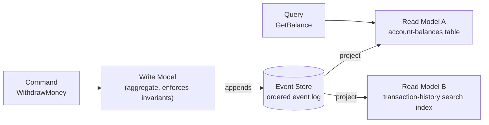
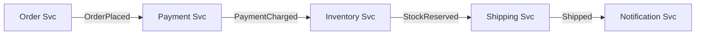
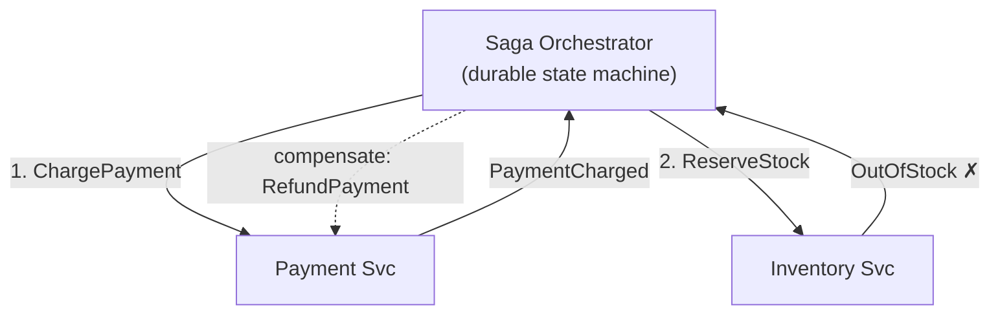
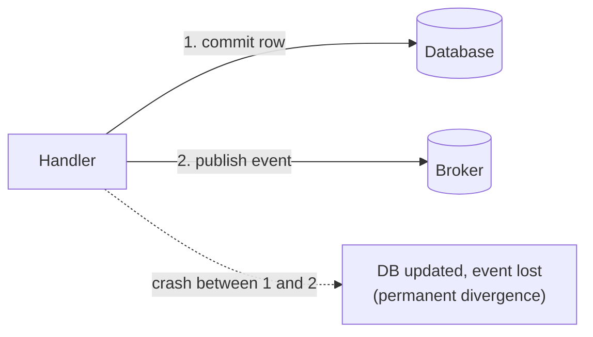
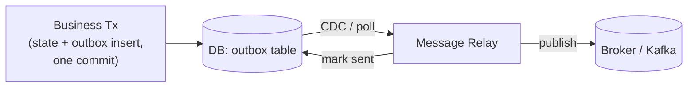

<div class="hero-section" style="background: linear-gradient(135deg, #667eea 0%, #764ba2 100%); color: white; padding: 3rem 2rem; margin: -2rem -3rem 2rem -3rem; text-align: center;">
  <h1 style="color: white; margin: 0; font-size: 2.5rem;">Event-Driven Patterns</h1>
  <p style="font-size: 1.25rem; margin-top: 1rem; opacity: 0.9;">Event sourcing, CQRS, sagas, outbox/inbox, schema evolution, and idempotent consumers — the building blocks of systems that treat events as the source of truth.</p>
</div>

[Event-Driven](./) &raquo; Patterns

<div class="intro-card">
  <p class="lead-text">Once services communicate by publishing facts rather than calling each other, a recurring set of problems appears: how do you persist state as events, serve fast queries over them, coordinate a multi-service transaction without a distributed lock, reliably publish an event in the same breath as a database write, evolve an event's schema for a decade without breaking old consumers, and survive the duplicate deliveries that any real broker will hand you? This page catalogs the standard answers — event sourcing, CQRS, the saga pattern, the transactional outbox and consumer-side inbox, event versioning with a schema registry, idempotent consumers, eventual consistency, and projections/read models — with the trade-offs that decide when each earns its keep.</p>
</div>

<div class="key-insights">
  <div class="insight-card">
    <i class="fas fa-history"></i>
    <h4>Events can be the source of truth</h4>
    <p>Event sourcing persists <em>what happened</em>, not just current state — giving you audit, time-travel, and rebuildable read models for free.</p>
  </div>
  <div class="insight-card">
    <i class="fas fa-code-branch"></i>
    <h4>Separate the write and read shapes</h4>
    <p>CQRS lets a normalized, invariant-enforcing write model coexist with denormalized read models tuned per query.</p>
  </div>
  <div class="insight-card">
    <i class="fas fa-exchange-alt"></i>
    <h4>The outbox kills the dual-write bug</h4>
    <p>Insert the event in the same transaction as the state change; a relay publishes it. The DB and the log never diverge.</p>
  </div>
  <div class="insight-card">
    <i class="fas fa-redo"></i>
    <h4>Consumers must be idempotent</h4>
    <p>At-least-once delivery is the norm. Processing an event twice must equal processing it once, or correctness is a coin flip.</p>
  </div>
</div>

## Table of contents
{: .no_toc .text-delta }

1. TOC
{:toc}

---

## Event Sourcing

In a conventional system you store *current state* and overwrite it on every change; the history of how you got there is lost. **Event sourcing** instead persists the full, append-only sequence of **events** that changed an entity. Current state is not stored at all — it is *derived* by replaying the events from the beginning (a `fold` over the event stream).

For a bank account, you do not store `balance = 80`; you store:

```
AccountOpened(balance=0)
Deposited(amount=100)
Withdrawn(amount=20)
```

and compute `balance = 80` by folding these events. Formally, current state is a left fold of a pure `apply` function over the ordered event history:

$$ s_n = \mathrm{apply}(s_{n-1}, e_n), \qquad s_0 = \mathrm{init} $$

so that the state after $n$ events is $s_n = \mathrm{apply}(\dots \mathrm{apply}(\mathrm{apply}(s_0, e_1), e_2) \dots, e_n)$. Because `apply` is a pure function and the event log is immutable, replaying the same events always reproduces the same state — the property that makes rebuilds, audits, and time-travel sound.

### Why Event Sourcing

The benefits are substantial:

- **Complete audit log** — every change is a first-class, immutable record of *why* state is what it is. This is often a regulatory requirement (finance, healthcare) you get for free.
- **Temporal queries** — reconstruct the state of any entity *as of any past moment* by replaying up to that point.
- **Replay and rebuild** — derive entirely new read models from history, fix a bug in a projection and re-run it over all events, or debug by replaying a problematic sequence.

The costs are real too: querying ("which accounts are overdrawn?") is awkward when state is a stream of events — which is exactly what [CQRS](#cqrs-command-query-responsibility-segregation) read models solve; the event schema must be [versioned and evolved](#event-versioning--schema-registry) carefully (old events are immutable and must remain replayable forever); and replaying long histories is slow.

### The Aggregate

Writes go through an **aggregate**: a consistency boundary that loads its event history, enforces invariants, and emits new events. A command never mutates state directly — it validates against the *current* folded state and, if valid, produces one or more events that are appended to the log.

```python
# A minimal event-sourced aggregate
class Account:
    def __init__(self):
        self.balance = 0
        self.version = 0

    def apply(self, event):
        """Fold one event into current state. Pure — no validation, no I/O."""
        if event["type"] == "AccountOpened":
            self.balance = event["balance"]
        elif event["type"] == "Deposited":
            self.balance += event["amount"]
        elif event["type"] == "Withdrawn":
            self.balance -= event["amount"]
        self.version += 1

    @classmethod
    def rehydrate(cls, events):
        """Rebuild current state by replaying the event stream."""
        account = cls()
        for event in events:
            account.apply(event)
        return account

# A command produces new events (after validating against current state)
def withdraw(account, amount):
    if amount > account.balance:
        raise ValueError("Insufficient funds")  # invariant enforced on write
    return {"type": "Withdrawn", "amount": amount}
```

### Snapshots

Replaying a long history is slow — an account with 50,000 events should not fold all of them on every load. A **snapshot** periodically persists the folded state (plus the version it reflects) so a rehydrate can start from the latest snapshot and replay only the events after it:

```python
def load(account_id, store):
    snapshot = store.latest_snapshot(account_id)        # may be None
    account = Account.from_snapshot(snapshot) if snapshot else Account()
    events = store.events_after(account_id, account.version)
    for event in events:
        account.apply(event)
    return account
```

Snapshots are a pure optimization: they are *derived* from events and can always be discarded and regenerated. They never become the source of truth.

### Optimistic Concurrency

Two commands loading the same aggregate at version `N` and both appending would corrupt the stream. Event stores enforce **optimistic concurrency**: an append is conditional on the expected version. The first writer commits at version `N+1`; the second's append fails because the store is no longer at `N`, and the command retries against the fresh state.

```python
def append_events(store, account_id, expected_version, new_events):
    # Atomic, conditional append: fails if another writer advanced the version.
    if not store.compare_and_append(account_id, expected_version, new_events):
        raise ConcurrencyConflict(account_id, expected_version)
```

This is the event-sourced equivalent of a database's `WHERE version = ?` update — the single point where the "one writer per aggregate" invariant is enforced.

## CQRS (Command Query Responsibility Segregation)

**CQRS** separates the model used to *change* state (the **write model**, handling commands) from the model used to *read* state (one or more **read models**, serving queries). The two no longer share a schema: writes go through a normalized, invariant-enforcing aggregate; reads are served by denormalized projections shaped exactly for each query.

CQRS and event sourcing are independent but combine naturally: the write model emits events (event sourcing), and each read model is a **projection** built by subscribing to those events and updating a query-optimized store (a relational view, a search index, a cache). Because read models are derived, you can add a new one at any time by replaying the event stream, and scale reads independently of writes.



The trade-off is that read models are **eventually consistent** with the write model — there is a small lag between a command committing and the projection updating (see [Eventual Consistency](#eventual-consistency) below).

CQRS adds significant complexity (two models, projection plumbing, eventual consistency) and is **not** a default. It earns its keep when read and write workloads have very different shapes or scaling needs, when the domain demands a rich audit trail, or when many divergent read views must be served from the same writes. For ordinary CRUD, a single model is simpler and correct.

> **Lightweight CQRS without event sourcing.** You can apply CQRS to a plain CRUD database — separate command handlers that write a normalized schema from query handlers that read materialized views — without sourcing state from events. The two patterns are orthogonal; reach for the simpler one your problem actually needs.

## Projections & Read Models

A **projection** is the process that consumes the event stream and maintains a **read model** — a derived, query-shaped store. It is just the same `fold` as event sourcing, but the accumulator is a *query database* instead of an in-memory aggregate, and it processes the *global* stream rather than one entity's history.

```python
# A projection that maintains an "account balances" read model.
class BalanceProjection:
    def __init__(self, db):
        self.db = db  # the read store (e.g. a SQL table account_id -> balance)

    def handle(self, event):
        if event["type"] == "AccountOpened":
            self.db.upsert(event["account_id"], balance=event["balance"])
        elif event["type"] == "Deposited":
            self.db.increment(event["account_id"], event["amount"])
        elif event["type"] == "Withdrawn":
            self.db.increment(event["account_id"], -event["amount"])
        # persist the offset/position we have processed up to (see checkpointing)
        self.db.save_checkpoint(event["position"])
```

Key properties of well-built projections:

- **Derived and disposable.** A read model holds no authoritative state. To fix a projection bug, correct the code, *reset* the read store, and replay the event log from the beginning. This rebuildability is the headline benefit of deriving reads from an immutable log.
- **Checkpointed.** A projection records the position (offset) it has processed so it resumes from where it left off after a restart rather than reprocessing everything — and so it can run at its own pace, independent of the writers.
- **Idempotent.** Replays and at-least-once delivery mean a projection may see an event more than once; the update must be safe to repeat (use upserts, or skip events at or below the saved checkpoint). This is the projection-specific case of the [idempotent consumer](#idempotent-consumers) below.
- **Independently scalable.** Each query shape gets its own read model — a SQL table for `GetBalance`, a search index for full-text transaction search, a cache for a hot dashboard — all fed from the same events.

A projection can be **online** (subscribed live to the stream, kept continuously up to date) or **catch-up** (replaying history to build a brand-new read model, then switching to live). Adding a new read model is exactly a catch-up projection over the full log.

## The Saga Pattern

Because each service owns its own database, you cannot wrap "create order, charge payment, reserve inventory" in a single ACID transaction. A **saga** replaces the distributed transaction with a sequence of *local* transactions, each publishing an event that triggers the next — and a matching **compensating** action that semantically undoes a step if a later one fails. Sagas give up atomicity and isolation in exchange for availability; the system passes through intermediate states and converges to either "all committed" or "all compensated."

A saga is **not** a rollback. There is no global undo log; instead, each forward step `T_i` is paired with a compensation `C_i` that *semantically* reverses its effect. If the saga fails after step `T_k`, the compensations run in reverse: `C_k, C_{k-1}, …, C_1`. A compensation is a new business action ("refund the charge"), not a database rollback ("pretend the charge never happened") — the original charge really did occur and is part of the permanent record.

```
forward:      T1 → T2 → T3 → T4   (commit)
on failure:   T1 → T2 → T3 ✗
compensate:   C3 ← C2 ← C1        (semantic undo, reverse order)
```

### Choreography vs. Orchestration

There are two ways to coordinate the steps of a saga.

**Choreography** — each service reacts to events and emits its own, with no central coordinator. The workflow emerges from the chain of reactions.



Choreography is maximally decoupled and adds no new component, but the end-to-end flow is *implicit* — no single place tells you "what happens when an order is placed," compensation chains are scattered across services, and cyclic event dependencies are easy to create by accident. It shines for simple, stable, two-or-three-step flows.

**Orchestration** — a central coordinator (an orchestrator or workflow engine) explicitly invokes each step and decides what comes next, including which compensations to run on failure. The flow is *explicit and centralized*, easier to reason about, test, and modify, at the cost of a coordinator that becomes a focal point of coupling and must itself be made durable (typically persisted as its own event-sourced state machine so it survives crashes mid-saga).



The rule of thumb: prefer **choreography** for simple, stable flows; prefer **orchestration** once a process has many steps, branches, or compensation logic. Production systems often use a workflow engine (Temporal, Camunda, AWS Step Functions, or a homegrown orchestrator) for orchestrated sagas so the coordinator's durability and retries are handled for you.

### An Orchestrated Saga

The orchestrator below runs the forward steps in order and, on any failure, replays the compensations in reverse — refunding a payment, restoring inventory — to unwind the partial transaction:

```python
class SagaOrchestrator:
    def __init__(self):
        self.steps = []
        self.compensations = []

    def add_step(self, action, compensation):
        self.steps.append(action)
        self.compensations.append(compensation)

    async def execute(self):
        completed_steps = []

        try:
            # Execute all steps in order
            for i, step in enumerate(self.steps):
                await step()
                completed_steps.append(i)

        except Exception as e:
            # Compensate in reverse order
            for i in reversed(completed_steps):
                try:
                    await self.compensations[i]()
                except Exception as comp_error:
                    # Compensation failure: must be retried and alerted on
                    print(f"Compensation {i} failed: {comp_error}")
            raise e

# Usage example
saga = SagaOrchestrator()

saga.add_step(
    lambda: create_order(order_data),
    lambda: cancel_order(order_id)
)

saga.add_step(
    lambda: charge_payment(payment_data),
    lambda: refund_payment(payment_id)
)

saga.add_step(
    lambda: update_inventory(items),
    lambda: restore_inventory(items)
)

await saga.execute()
```

Two practical caveats. Compensations must themselves be reliable and idempotent — a compensation that fails leaves the system in a bad state, so compensation failures are typically retried and alerted on. And because there is no isolation, other transactions can observe intermediate states; guard against this with **semantic locks** (e.g. an order status of `PENDING`) so downstream readers know the data is not yet final. Some steps are not compensatable at all (an email cannot be unsent); order the saga so that *pivot* and irreversible steps come after everything that might fail, leaving only retriable forward steps afterward.

## The Outbox & Inbox Patterns

### The Dual-Write Problem

A subtle trap lurks in every event-driven service: a handler that must both **write to its database** and **publish an event** is performing a *dual write* across two systems with no shared transaction. If it commits the DB row but crashes before publishing — or publishes but the DB commit then fails — the database and the event stream diverge, silently and permanently. You cannot fix this by reordering the two writes; whichever happens first can succeed while the second is lost to a crash.



### The Transactional Outbox

The fix is the **transactional outbox**: within the *same* local DB transaction that changes business state, insert the event into an `outbox` table. Because the business write and the outbox insert commit atomically, either both happen or neither does — there is no window in which state changed but the event was lost.

```sql
BEGIN;
  UPDATE accounts SET balance = balance - 20 WHERE id = 42;
  INSERT INTO outbox (id, aggregate_id, type, payload, created_at)
       VALUES (gen_random_uuid(), 42, 'Withdrawn',
               '{"account_id":42,"amount":20}', now());
COMMIT;
```

A separate **relay** (message relay / publisher) then reads unpublished outbox rows and pushes them to the broker, marking them sent. The relay can work two ways:

- **Polling publisher** — a background loop selects unsent rows, publishes them, and marks them sent. Simple, but adds polling load and latency.
- **Change Data Capture (CDC)** — a tool like Debezium tails the database's write-ahead log and streams new outbox rows to the broker with near-zero lag and no polling. This is the dominant production approach.



The crucial property: the relay guarantees **at-least-once** delivery (it republishes anything it is unsure it sent), so the same event may reach the broker more than once. The outbox solves *don't lose events*; it does **not** solve *don't duplicate events*. That is the inbox's and the idempotent consumer's job.

### The Inbox Pattern

The mirror image on the consumer side is the **inbox** (also called the *idempotent receiver*): a table of already-processed message IDs. When an event arrives, the consumer — within the *same* transaction that applies the event's effects — inserts its message ID into the `inbox` table under a unique constraint. A duplicate delivery violates the constraint, the transaction is skipped, and the side effects are applied exactly once.

```python
def handle(event, db):
    with db.transaction() as tx:
        try:
            tx.execute(
                "INSERT INTO inbox (message_id, processed_at) VALUES (%s, now())",
                (event["id"],),
            )
        except UniqueViolation:
            tx.rollback()
            return  # already processed; safe to ack and drop

        apply_business_effect(tx, event)  # commits atomically with the inbox row
```

Outbox and inbox compose into reliable end-to-end messaging without distributed transactions: the **outbox** guarantees the producer never *loses* an event, and the **inbox** guarantees the consumer never *applies* one twice. Together they turn a broker's at-least-once delivery into effective exactly-once *processing*.

## Idempotent Consumers

Almost every real broker delivers **at-least-once**: a consumer that crashes after processing a message but before committing its offset/ack will see that message again on restart. (Exactly-once delivery is essentially impossible over an unreliable network — the famous Two Generals result — so systems engineer for at-least-once delivery plus idempotent processing instead.) A consumer is **idempotent** when processing the same event twice produces the same result as processing it once:

$$ f(f(s, e)) = f(s, e) $$

There are several standard techniques, in rough order of preference:

- **Deduplicate on event ID** — the inbox pattern above; the most general solution, works for any side effect.
- **Natural idempotency via upserts** — `SET balance = 80` is idempotent; `balance = balance - 20` is not. Where you can phrase the effect as setting an absolute value keyed by entity, duplicates are harmless for free.
- **Conditional updates / versioning** — `UPDATE … WHERE version = expected` (optimistic concurrency); a replayed event finds the version already advanced and no-ops.
- **Idempotency keys for external calls** — when the side effect is a call to a third party (charge a card), pass a stable idempotency key so the *provider* dedupes; most payment APIs support exactly this.

```python
# Dedupe-on-ID with a sequence guard, combining an inbox check with ordering.
def process(event, store):
    last = store.last_sequence(event["aggregate_id"])
    if event["sequence"] <= last:
        return            # already applied (duplicate or out-of-order replay)
    apply(event)          # the actual side effect
    store.set_last_sequence(event["aggregate_id"], event["sequence"])
```

> **Ordering caveat.** Idempotency handles *duplicates*; it does not by itself handle *reordering*. If your effects are not commutative, you also need ordering — partition by entity key so all events for one entity are delivered in order (the per-partition ordering guarantee of a log), or carry a sequence number and reject out-of-order arrivals as the snippet above does.

A message that *repeatedly* fails — a **poison message** — must not block the partition forever. After N attempts, route it to a **dead-letter queue (DLQ)** for out-of-band inspection and let the consumer advance, so one bad message cannot halt the whole stream.

## Event Versioning & Schema Registry

Events are immutable and long-lived: an event written today may be replayed years from now to rebuild a read model, and old events can **never** be rewritten. The schema of an event must therefore evolve in a way that keeps every historical event readable forever, and keeps producers and consumers that deploy independently from breaking each other.

### Compatibility Modes

A **schema registry** (Confluent Schema Registry for Avro/Protobuf/JSON Schema, AWS Glue Schema Registry, Apicurio) stores versioned schemas per topic and *enforces a compatibility rule* on every new schema before producers may use it. The standard modes:

| Mode | New schema can be used to read… | Safe to evolve first |
|------|----------------------------------|------------------------|
| **Backward** | data written with the *old* schema | upgrade **consumers** first |
| **Forward** | data written with the *new* schema by *old* readers | upgrade **producers** first |
| **Full** | both directions | either order |
| **None** | (no check) | — avoid in production — |

**Backward compatibility** is the most common default for event streams: new consumers can still read the entire historical log. The rules that preserve it are mechanical — *add only optional fields with defaults; never remove a required field; never change a field's type or rename it; never repurpose a tag/field number*. Removing a field or making it required breaks backward compatibility because old events lack the new constraint.

### Schema-Evolution Tactics

- **Tolerant reader** — consumers ignore unknown fields and supply defaults for missing ones, so a producer can add fields without coordinating a deploy. (Avro and Protobuf give this to you when you follow the rules above.)
- **Upcasting** — on read, transform an old event version into the current shape *in memory* before the domain logic sees it. The stored event is never mutated; the upcaster is a pure function `v1 → v2 → … → vN` applied during rehydration, keeping the rest of the code aware of only the latest version.
- **Versioned event types** — when a change is genuinely breaking, introduce a new event type (`OrderShipped_v2`) and keep handling the old one. Existing history stays valid; new events use the new type.
- **Explicit version field** — every event carries `type` and `version`, so the deserializer can pick the right schema and upcaster chain.

```python
# Upcasting an old event into the current shape on read.
def upcast(event):
    v = event.get("version", 1)
    if v == 1:
        # v1 had a single 'name'; v2 splits it into first/last.
        first, _, last = event.get("name", "").partition(" ")
        event = {**event, "first_name": first, "last_name": last, "version": 2}
    if event["version"] == 2:
        # v3 added 'currency', defaulting to USD for historical events.
        event = {**event, "currency": event.get("currency", "USD"), "version": 3}
    return event  # domain code only ever sees v3
```

Binary formats with a registry (Avro, Protobuf) are preferred for high-volume streams: they are compact, the registry guarantees compatibility *at publish time* (a bad schema is rejected before it can corrupt the log), and the schema ID travels with each message so consumers fetch the exact writer schema. JSON Schema in a registry offers the same compatibility checks with human-readable payloads at a size cost.

## Eventual Consistency

Asynchronous, event-driven systems are **eventually consistent**: after a write, there is a window during which different parts of the system disagree, after which — *if no new writes arrive* — all replicas and read models converge to the same value. A CQRS read model lags its write model by the projection delay; a downstream service's view lags the producer by broker and processing latency. This is not a bug to be eliminated but a property to be designed for, and it is the price of the availability and decoupling that asynchrony buys ([CAP](../distributed-systems/) makes the trade unavoidable when partitions are possible).

The hazards and their standard mitigations:

- **Read-your-writes** — a user who issues a command and immediately re-queries may not see their own change because the projection has not caught up. Mitigate with optimistic UI updates, by returning the new state directly from the command, or by pinning that user's reads to a session/version token until the projection has advanced past their write.
- **Monotonic reads** — a client must not see state go *backwards* (read version 5, then version 3 from a lagging replica). Route a session's reads consistently or carry a minimum-version watermark.
- **Stale-read tolerance** — most reads tolerate small lag (a transaction list 50 ms stale is fine). Decide per query how much staleness is acceptable and surface it (e.g. "as of HH:MM:SS") rather than pretending the data is live.
- **Convergence requires effort** — "eventual" only holds if every event is eventually delivered and applied. The [outbox](#the-outbox--inbox-patterns) (no lost events), [idempotent consumers](#idempotent-consumers) (no double-applied events), and projection checkpointing are what *make* the system converge; without them, "eventual consistency" degrades into "permanent inconsistency."

## Putting It Together

A mature event-driven system layers these patterns so that each covers a specific failure mode of the others:

```mermaid
flowchart TD
    Client --> Cmd["Command<br/>WithdrawMoney"]
    Cmd --> Agg["Aggregate (write model)<br/>load → enforce invariants → emit events<br/>(event sourcing + optimistic concurrency)"]
    Agg -->|"same tx: events + outbox row"| DB[("Event Store + Outbox")]
    DB -->|CDC relay (at-least-once)| Kafka[("Kafka<br/>per-entity partitioning")]
    Kafka --> Saga["Saga Orchestrator<br/>(durable, compensations)"]
    Kafka --> Proj["Projection → Read Model<br/>(idempotent, checkpointed)"]
    Kafka --> Inbox["Downstream Svc<br/>(inbox dedupe)"]
    Query["Query<br/>GetBalance"] --> Proj
    Reg["Schema Registry<br/>(backward compat enforced)"] -. validates .-> Kafka
```

Event sourcing makes the log the source of truth; the **outbox** bridges state change and publication without a dual-write bug; the **CDC relay** gives at-least-once delivery, which **idempotent consumers** and the **inbox** make safe; **projections** turn the log into the query-shaped **read models** CQRS serves; the **schema registry** keeps that immutable log readable as schemas evolve; **sagas** coordinate multi-service transactions with compensations; and **eventual consistency** is the explicit, designed-for contract that ties it all together. Adopt each pattern as the specific pain it solves actually appears — none of them is free, and a well-structured monolith or plain CRUD is the right starting point until the scale, audit, or decoupling pressure justifies the move.

## See Also

- **[Event-Driven Hub](./)** — section overview tying these patterns to brokers, streaming, and delivery semantics
- **[Microservices & Event-Driven Architecture](../distributed-systems/microservices-and-event-driven.html)** — service decomposition, API gateways, sync vs async, Kafka's topic/partition/offset model, and where these patterns sit in a microservice system
- **[Distributed Systems Hub](../distributed-systems/)** — CAP/FLP, consistency models, and the resilience patterns (circuit breakers, leader election) behind reliable event delivery
- **[Distributed Systems Theory](../advanced/distributed-systems-theory/)** — formal foundations: consensus, the happens-before relation, and consistency-model definitions
- **[Database Design](../technology/database-design/)** — the event stores, outbox tables, and read-model databases these patterns persist to
- **[API Design](../api-design/)** — the synchronous contracts at the edge of an event-driven system
