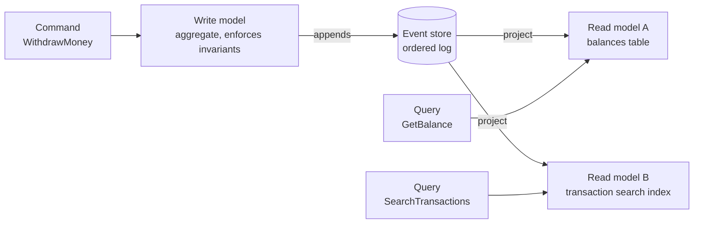
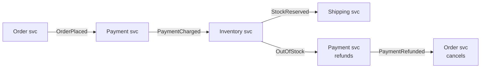
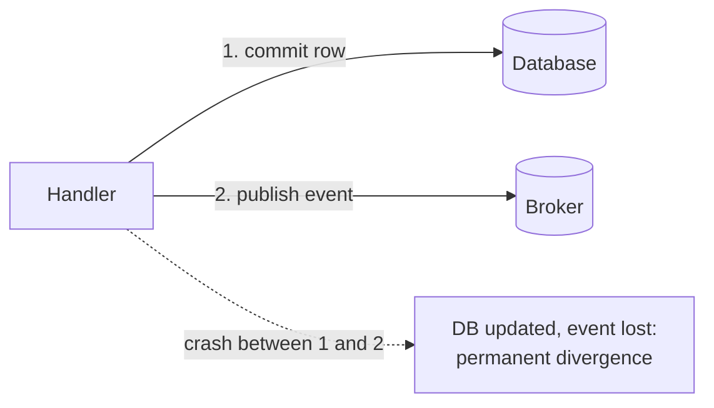
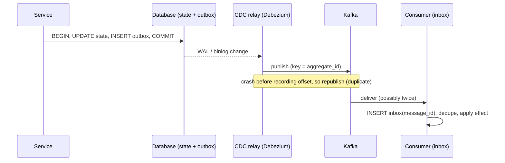
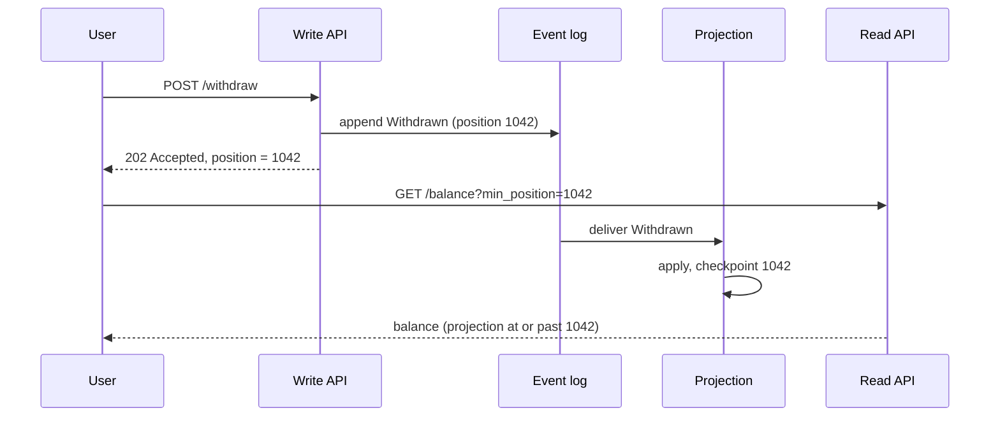
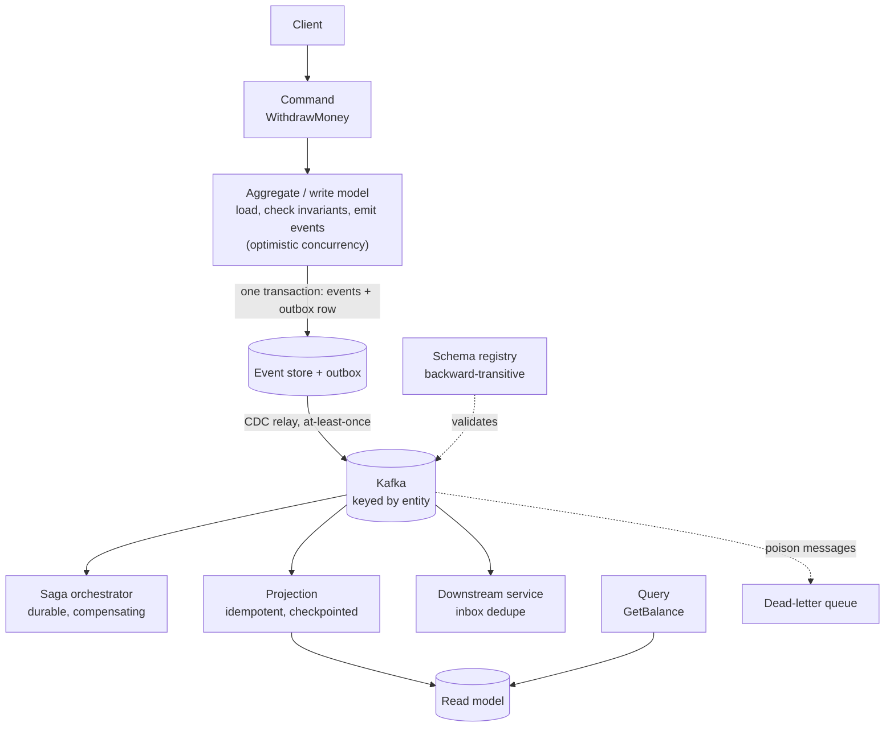

[Event-Driven](./) &raquo; Patterns

When services communicate by publishing facts instead of calling each other, the same problems keep coming up. You need a way to store state as events, answer queries quickly, coordinate a business transaction across services without a distributed lock, publish an event reliably together with a database write, change an event's schema without breaking old consumers, and cope with the duplicate deliveries that every real broker produces. This page describes the standard patterns for each problem and the trade-offs that decide when a pattern is worth its cost. The broker side (Kafka, RabbitMQ, cloud queues, delivery semantics) is covered in [Message Brokers](message-brokers.html).

## Table of contents
{: .no_toc .text-delta }

1. TOC
{:toc}

---

## The Patterns at a Glance

| Pattern | Problem it solves | Main cost |
|---------|-------------------|-----------|
| [Event sourcing](#event-sourcing) | Keeping the full history of changes as the source of truth | Queries need projections; events can never change; replay time |
| [CQRS](#cqrs-command-query-responsibility-segregation) | Read and write workloads that need different models | Two models to maintain; reads lag behind writes |
| [Projections](#projections--read-models) | Building query-shaped views from the event stream | Checkpointing, rebuilds, and idempotency |
| [Saga](#the-saga-pattern) | A business transaction that spans services with separate databases | No isolation; every step needs a compensating action |
| [Outbox / inbox](#the-outbox--inbox-patterns) | Updating the database and publishing an event atomically | An extra table and a relay process; delivery is at-least-once |
| [Idempotent consumer](#idempotent-consumers) | Duplicate deliveries | A deduplication store, or effects designed to be idempotent |
| [Schema registry and versioning](#event-versioning--schema-registry) | Evolving events that must stay readable forever | Governance, and a registry to operate |
| [Designing for eventual consistency](#eventual-consistency) | Reads that lag behind writes | UX and API design work |

Most of these patterns address a failure mode introduced by one of the others, as the [final section](#putting-it-together) shows. Adopt each one only when you actually have the problem it solves.

## What Goes in an Event

Before choosing patterns, decide what your events carry. Martin Fowler's often-cited taxonomy separates several distinct uses of "event":

| Style | Payload | Consumer behavior | Trade-off |
|-------|---------|-------------------|-----------|
| **Event notification** | Minimal: `OrderPlaced{orderId}` | Calls back to the producer for details if it needs them | Small events and loose schema coupling, but callbacks add runtime coupling and load |
| **Event-carried state transfer** | The full relevant state: `OrderPlaced{orderId, items, total, customer}` | Keeps its own local copy and never calls back | Consumers keep working when the producer is down, but events are larger and data is duplicated |
| **Event sourcing** | A fine-grained domain change that is stored as the record of truth | Replays events to rebuild state | Complete history, at the cost of the complexity described below |

A related distinction is between **domain events** and **integration events**. Domain events are internal to a service or bounded context and fine-grained, and they can change freely along with the code. Integration events are the published contract with other teams: coarser, versioned, and changed carefully. Exposing an event-sourced service's internal events directly to other teams ties every consumer to that service's internal model. Translate them into integration events at the boundary.

Every event should also carry a standard **envelope**: a unique ID (used for deduplication), type, source, time, schema version, and a correlation or causation ID for tracing. The CNCF **CloudEvents** specification standardizes these attributes (`id`, `source`, `type`, `specversion`, `time`, `datacontenttype`, `dataschema`, `subject`) and defines bindings for HTTP, Kafka, AMQP, and MQTT. It is a good default instead of a home-grown envelope.

## Event Sourcing

A conventional system stores *current state* and overwrites it on every change, so the history of how it got there is lost. **Event sourcing** instead persists the full, append-only sequence of **events** that changed an entity. Current state is not stored at all. It is *derived* by replaying the events from the beginning.

For a bank account, you do not store `balance = 80`. You store:

```
AccountOpened(balance=0)
Deposited(amount=100)
Withdrawn(amount=20)
```

and compute `balance = 80` from them. Formally, current state is a left fold of a pure `apply` function over the ordered history:

$$ s_n = \mathrm{apply}(s_{n-1}, e_n), \qquad s_0 = \mathrm{init} $$

Because `apply` is pure and the log is immutable, replaying the same events always gives the same state. That property is what makes rebuilds, audits, and time travel reliable.

### Benefits and costs

| Benefits | Costs |
|----------|-------|
| **Complete audit trail.** Every change is an immutable record of what happened, which is often a regulatory requirement in finance or healthcare | **Querying is awkward.** A question like "which accounts are overdrawn?" needs a [read model](#projections--read-models) |
| **Temporal queries.** You can reconstruct any entity as it was at any past moment | **Events can never change.** Schemas need a [versioning discipline](#event-versioning--schema-registry) |
| **Replay.** You can build new read models from old history, fix a projection bug and rerun it, or reproduce an incident | **Long histories are slow to load** without [snapshots](#snapshots) |
| **Natural event publication.** The events already exist for other services to consume | **Deleting personal data is harder,** because the log is append-only (see [below](#event-stores-and-personal-data)) |

### The aggregate

Writes go through an **aggregate**, a consistency boundary that loads its event stream, enforces invariants, and emits new events. A command never changes state directly. It checks the request against the current folded state and, if the request is valid, returns events to append.

```python
from dataclasses import dataclass, field

@dataclass
class Account:
    balance: int = 0
    version: int = 0          # number of events applied; used for concurrency checks

    def apply(self, event: dict) -> None:
        """Fold one event into state. Pure: no validation, no I/O."""
        match event["type"]:
            case "AccountOpened": self.balance = event["balance"]
            case "Deposited":     self.balance += event["amount"]
            case "Withdrawn":     self.balance -= event["amount"]
        self.version += 1

    @classmethod
    def rehydrate(cls, events) -> "Account":
        account = cls()
        for e in events:
            account.apply(e)
        return account

# Command handler: validate against current state, then return new events.
def withdraw(account: Account, amount: int) -> list[dict]:
    if amount > account.balance:
        raise ValueError("insufficient funds")      # invariant enforced on write
    return [{"type": "Withdrawn", "amount": amount}]
```

### Snapshots

Folding 50,000 events on every load is too slow. A **snapshot** periodically saves the folded state together with the version it reflects. Loading then starts from the latest snapshot and replays only the newer events:

```python
def load(account_id, store) -> Account:
    snap = store.latest_snapshot(account_id)          # may be None
    account = Account(**snap.state) if snap else Account()
    for e in store.events_after(account_id, account.version):
        account.apply(e)
    return account
```

Snapshots are only an optimization. They are derived from events, can be deleted and regenerated at any time, and never become the source of truth. Well-designed aggregates often have short streams, for example by modelling an account statement *period* rather than the account's whole lifetime, and then don't need snapshots at all.

### Optimistic concurrency

If two commands load the same aggregate at version $N$ and both append, the stream is corrupted. Event stores therefore make an append **conditional on the expected version**. The first writer commits version $N+1$. The second writer's append fails, and it retries against the new state.

```python
def handle(store, account_id, amount):
    for attempt in range(3):
        account = load(account_id, store)
        new_events = withdraw(account, amount)
        if store.append(account_id, new_events, expected_version=account.version):
            return
        # someone else appended first: reload and re-validate
    raise ConcurrencyConflict(account_id)
```

This is the event-sourced counterpart of `UPDATE ... WHERE version = ?`, and it is the one place where "one writer per aggregate at a time" is enforced.

### Event stores and personal data

An event store needs to support ordered append-only streams, conditional appends, reading one stream, and subscribing to all events in global order. Common choices:

- **Purpose-built stores**, such as KurrentDB (formerly EventStoreDB) and Axon Server.
- **Relational databases**, such as a PostgreSQL `events` table with a unique `(stream_id, version)` constraint, either hand-built or through libraries such as Marten (.NET) or Eventuous. This setup is common and works well to fairly large scale.
- **Kafka as a store.** Kafka is a good event *bus* but a weak event *store* for aggregates. It has no conditional append per key, and reading a single entity's history means scanning a partition. Many systems keep the source of truth in a database and publish to Kafka through an [outbox](#the-outbox--inbox-patterns).

An immutable log conflicts with privacy rights such as GDPR's right to erasure. The standard answer is **crypto-shredding**: encrypt personal fields with a per-subject key stored outside the log, and delete the key to make those fields permanently unreadable. The alternative is to keep personal data out of events and reference it by ID.

A more recent variation is the **Dynamic Consistency Boundary (DCB)**, proposed by Sara Pellegrini in "Killing the Aggregate" and now specified at dcb.events. It drops fixed per-aggregate streams. Events carry tags, a decision reads the events that match a query, and the append is conditional on no new matching events having arrived since that read. This allows a single consistency check to span what would otherwise be several aggregates, such as "course capacity" and "student enrollment limit", without a saga.

## CQRS (Command Query Responsibility Segregation)

**CQRS** separates the model that *changes* state (the **write model**, which handles commands) from the models that *read* it (one or more **read models**, which serve queries). The two no longer share a schema. Writes go through a normalized aggregate that enforces invariants, and reads are served from denormalized views shaped for each query.

CQRS and event sourcing are independent patterns but fit together well. The write model emits events, and each read model is a **projection** that subscribes to those events and updates a query-optimized store such as a relational view, a search index, or a cache. Read models are derived, so you can add one at any time by replaying the event stream, and you can scale reads separately from writes.



Read models are **eventually consistent** with the write model: after a command commits, there is a short lag before the projection reflects it (see [Eventual Consistency](#eventual-consistency)).

CQRS adds real complexity and should not be the default. It is worth it when reads and writes have very different shapes or scaling needs, when many different views are needed from the same writes, or when the domain needs a rich audit trail. For ordinary CRUD, one model is simpler and correct.

CQRS also works without event sourcing. Command handlers can write a normalized schema while query handlers read materialized views, replicas, or a search index fed by [CDC](#the-transactional-outbox). Use whichever of the two patterns your problem actually needs.

## Projections & Read Models

A **projection** consumes the event stream and maintains a **read model**, a derived store shaped for queries. It is the same fold as in event sourcing, but it folds into a database instead of an in-memory object, and it usually processes the *global* stream rather than one entity's history.

```python
class BalanceProjection:
    """Maintains account_id -> balance in a SQL read store."""

    def __init__(self, db):
        self.db = db

    def handle(self, event):
        with self.db.transaction() as tx:
            if event["position"] <= tx.checkpoint("balances"):
                return                                   # already applied (replay/duplicate)
            match event["type"]:
                case "AccountOpened":
                    tx.upsert(event["account_id"], balance=event["balance"])
                case "Deposited":
                    tx.increment(event["account_id"], event["amount"])
                case "Withdrawn":
                    tx.increment(event["account_id"], -event["amount"])
            tx.save_checkpoint("balances", event["position"])   # same transaction as the update
```

Well-built projections share four properties:

- **Derived and disposable.** A read model holds no authoritative state. To fix a projection bug, fix the code, reset the read store, and replay from the beginning.
- **Checkpointed atomically.** The projection records the stream position it has processed, *in the same transaction* as the read-model update, so that it resumes exactly where it stopped after a crash.
- **Idempotent.** Replays and at-least-once delivery mean the projection will see some events twice. The checkpoint guard above, or upsert-style writes, make that safe. This is a special case of the [idempotent consumer](#idempotent-consumers).
- **One per query shape.** A SQL table for `GetBalance`, a search index for full-text search, and a cache for a hot dashboard can all be fed from the same events.

A projection is either **live** (subscribed to the stream and continuously updated) or **catch-up** (replaying history to build a new read model, then switching to live). To change a read model's schema without downtime, use a **blue/green rebuild**: build the new version alongside the old one, let it catch up, switch queries to it, then drop the old one.

## The Saga Pattern

When each service owns its own database, you cannot wrap "create order, charge payment, reserve inventory" in a single ACID transaction. Two-phase commit across services and brokers is fragile and rarely available. A **saga** replaces the distributed transaction with a sequence of *local* transactions. Each step publishes an event or reply that triggers the next step, and each step has a **compensating** action that undoes it in business terms if a later step fails. Sagas give up isolation (and atomicity in the strict sense) in exchange for availability. The system passes through visible intermediate states and ends up either fully committed or fully compensated.

A saga does not roll back. Each forward step $T_i$ is paired with a compensation $C_i$ that reverses its effect in business terms. If step $T_{k+1}$ fails, the compensations for the completed steps run in reverse order, $C_k, C_{k-1}, \dots, C_1$. A compensation is a new business action, such as "refund the charge". It is not a database rollback that pretends the charge never happened. The charge did happen and stays in the record.

### Choreography vs. orchestration

**Choreography** has no coordinator. Each service reacts to events and emits its own, and the workflow emerges from the chain of reactions.



**Orchestration** puts a central coordinator in charge. It sends commands to each service, waits for the replies, and decides the next step, including which compensations to run.

```mermaid
sequenceDiagram
    participant O as Saga orchestrator
    participant Pay as Payment svc
    participant Inv as Inventory svc
    participant Ord as Order svc
    O->>Ord: CreateOrder (status PENDING)
    Ord-->>O: OrderCreated
    O->>Pay: ChargePayment
    Pay-->>O: PaymentCharged
    O->>Inv: ReserveStock
    Inv-->>O: OutOfStock
    Note over O: step 3 failed, compensate 2 then 1
    O->>Pay: RefundPayment
    Pay-->>O: PaymentRefunded
    O->>Ord: CancelOrder
    Ord-->>O: OrderCancelled
```



| | Choreography | Orchestration |
|--|--------------|---------------|
| Flow definition | Implicit, spread across subscribers | Explicit, in one place |
| Coupling | Lowest; no service knows the whole flow | Coordinator depends on every participant |
| Compensation logic | Spread across services | Central and testable |
| Observability | Needs distributed tracing to reconstruct | The coordinator's state is the progress record |
| Risk | Cyclic event dependencies, and a process nobody fully understands | The coordinator becomes a bottleneck or accumulates too much logic |
| Good fit | Two or three stable steps, and loosely related reactions | Many steps, branches, timeouts, human approvals |

A reasonable rule is to choreograph simple flows and orchestrate complex ones. The orchestrator must be **durable**, because it can crash partway through a saga and must resume from where it stopped. Production systems therefore usually run orchestrated sagas on a **durable-execution / workflow engine** such as Temporal, Restate, Camunda, AWS Step Functions, or Azure Durable Functions. These engines persist every step's result, retry with backoff, and replay the workflow code deterministically after a failure, so you don't have to write the state machine and retry logic yourself.

### An orchestrated saga

The minimal in-process orchestrator below shows the control flow. Each step returns the context that its compensation needs, and compensations run in reverse order on failure. A production version would also persist progress after every step so that it survives a crash.

```python
import asyncio
from dataclasses import dataclass
from typing import Awaitable, Callable

Step = Callable[[dict], Awaitable[dict]]         # takes context, returns updates to it

@dataclass
class SagaStep:
    name: str
    action: Step
    compensate: Step

async def run_saga(steps: list[SagaStep], ctx: dict) -> dict:
    done: list[SagaStep] = []
    try:
        for step in steps:
            ctx |= await step.action(ctx)        # e.g. adds payment_id to ctx
            done.append(step)
        return ctx
    except Exception:
        for step in reversed(done):              # semantic undo, reverse order
            await retry_forever(step.compensate, ctx)   # compensations must eventually succeed
        raise

async def retry_forever(fn: Step, ctx: dict, delay: float = 1.0):
    while True:
        try:
            return await fn(ctx)
        except Exception as err:
            alert(f"compensation {fn.__name__} failed: {err}")
            await asyncio.sleep(delay := min(delay * 2, 60))

order_saga = [
    SagaStep("create order",  create_order,   cancel_order),       # ctx["order_id"]
    SagaStep("charge card",   charge_payment, refund_payment),     # ctx["payment_id"]
    SagaStep("reserve stock", reserve_stock,  release_stock),      # ctx["reservation_id"]
]

# inside an async handler:
#   result = await run_saga(order_saga, {"customer_id": 7, "items": items})
```

### Practical rules

- **Compensations must be idempotent and must eventually succeed.** A compensation that fails leaves the system inconsistent, so retry it (as above) and alert on repeated failures.
- **Guard against the lack of isolation.** Other transactions can see intermediate states. Use **semantic locks**, such as an order status of `PENDING`, so that readers know the data isn't final. Use **commutative updates** or **re-reading values** where two sagas can interleave.
- **Order steps around the pivot.** Some actions can't be compensated: an email can't be unsent and a shipped parcel can't be un-shipped. Put *compensatable* steps first, then the **pivot** step (the point of no return), then only *retriable* steps that are guaranteed to succeed eventually.
- **Give every step a timeout.** A participant that never replies must eventually be treated as failed, which triggers compensation.

## The Outbox & Inbox Patterns

### The dual-write problem

A handler that must both **write to its database** and **publish an event** is writing to two systems that share no transaction. If it commits the database row and then crashes before publishing, or publishes and then the commit fails, the database and the event stream disagree, silently and permanently. Reordering the two writes doesn't help, because whichever one runs first can succeed while the second is lost.



### The transactional outbox

The fix is the **transactional outbox**. In the *same* local transaction that changes business state, insert the event into an `outbox` table. The business write and the outbox insert commit together or not at all, so there is no window in which state has changed but the event is lost.

```sql
BEGIN;
  UPDATE accounts SET balance = balance - 20 WHERE id = 42;
  INSERT INTO outbox (id, aggregate_type, aggregate_id, type, payload, created_at)
       VALUES (gen_random_uuid(), 'account', '42', 'Withdrawn',
               '{"account_id":42,"amount":20}', now());
COMMIT;
```

A separate **relay** moves outbox rows to the broker. It works in one of two ways:

- **Polling publisher.** A loop claims unsent rows, publishes them, and marks them sent. In PostgreSQL, `SELECT ... ORDER BY id LIMIT 100 FOR UPDATE SKIP LOCKED` lets several relay workers share the table without blocking each other. This approach is simple and portable, but adds query load and latency equal to the polling interval.
- **Change data capture (CDC).** A tool such as **Debezium** tails the database's replication log (the PostgreSQL WAL through logical decoding, or the MySQL binlog) and streams new outbox rows to Kafka with low latency and no polling. Debezium's *Outbox Event Router* transform routes each row to a topic based on `aggregate_type` and uses `aggregate_id` as the message key, which preserves per-entity order. PostgreSQL users can also skip the table and write the event straight into the WAL with `pg_logical_emit_message`, which CDC then picks up.



The relay guarantees **at-least-once** delivery. It republishes anything it isn't sure it sent, so the same event can reach the broker more than once. The outbox ensures events are not *lost*. It does **not** prevent *duplicates*; the inbox and idempotent consumers handle that. Two operational details: publish in `id` order per aggregate so that consumers see events in order, and delete or partition old outbox rows so the table doesn't grow without limit.

### The inbox

The consumer-side counterpart is the **inbox** (also called the *idempotent receiver*): a table of message IDs that have already been processed. In the *same* transaction that applies an event's effects, the consumer inserts the event's ID into `inbox` under a unique constraint. A duplicate delivery conflicts with the constraint and is skipped, so the effects are applied once.

```python
def handle(event, db):
    with db.transaction() as tx:
        inserted = tx.execute(
            "INSERT INTO inbox (message_id, processed_at) VALUES (%s, now()) "
            "ON CONFLICT (message_id) DO NOTHING",
            (event["id"],),
        ).rowcount
        if inserted == 0:
            return                       # duplicate: already processed, just ack
        apply_business_effect(tx, event) # commits atomically with the inbox row
```

Together, the **outbox** ensures the producer never *loses* an event, and the **inbox** ensures the consumer never *applies* one twice. Combined, they turn a broker's at-least-once delivery into effectively-once *processing*, without distributed transactions.

## Idempotent Consumers

Nearly every broker delivers **at-least-once**. A consumer that crashes after processing a message but before acknowledging it or committing its offset will receive the message again. Exactly-once *delivery* across an unreliable network to an arbitrary side effect is not achievable in general, so systems combine at-least-once delivery with idempotent *processing*. A handler $f$ is **idempotent** when applying the same event again leaves the state unchanged:

$$ f(f(s, e), e) = f(s, e) $$

The standard techniques, roughly in order of generality:

| Technique | How it works | Suits |
|-----------|--------------|-------|
| **Deduplicate on event ID** | The [inbox](#the-inbox) above | Any side effect inside your own database |
| **Naturally idempotent writes** | Set absolute values keyed by entity: `SET status = 'SHIPPED'` or an upsert, instead of `balance = balance - 20` | State replication, projections |
| **Version or sequence guards** | Apply only if `event.seq > last_seq` for the entity; stale or duplicate events do nothing | Ordered per-entity streams |
| **Idempotency keys on external calls** | Pass a stable key (for example the event ID) so the *provider* deduplicates | Payment APIs, email and SMS gateways |
| **Broker transactions** | Kafka's transactional producer commits output records *and* consumer offsets atomically, and downstream readers use `isolation.level=read_committed` | Read-process-write pipelines that stay entirely within Kafka (Kafka Streams `exactly_once_v2`) |

```python
# Sequence guard: drops duplicates and stale replays for per-entity ordered streams.
def process(event, store):
    with store.transaction() as tx:
        last = tx.last_sequence(event["aggregate_id"])
        if event["sequence"] <= last:
            return                                   # duplicate or already superseded
        apply_effect(tx, event)
        tx.set_last_sequence(event["aggregate_id"], event["sequence"])
```

Kafka's exactly-once semantics apply only *inside Kafka*. Once a consumer writes to a database or calls an external API, you need one of the other techniques again.

**Ordering.** Idempotency handles *duplicates*, not *reordering*. If effects don't commute, you also need ordering. Partition by entity key so that all events for one entity arrive in order (the per-partition ordering guarantee of a log), or carry a sequence number and reject or buffer out-of-order arrivals.

**Poison messages.** A message that fails every time must not block its partition forever. After a bounded number of retries with backoff, send it to a **dead-letter queue (DLQ)** with the error attached, alert on it, and let the consumer move on. Provide a way to replay messages from the DLQ after a fix. For strictly ordered streams, a message parked in the DLQ breaks the ordering of its key, so some systems pause that key rather than skipping ahead.

## Event Versioning & Schema Registry

Events are immutable and long-lived. An event written today may be replayed years from now to rebuild a read model, and old events can never be rewritten. Event schemas must therefore change in ways that keep every historical event readable, and that let producers and consumers deploy independently without breaking each other.

### Compatibility modes

A **schema registry** (Confluent Schema Registry, Apicurio Registry, AWS Glue Schema Registry, Azure Schema Registry) stores versioned schemas per subject and checks each new schema against a **compatibility rule** before producers can use it:

| Mode | Guarantee | Deploy order |
|------|-----------|--------------|
| **Backward** | Consumers on the *new* schema can read data written with the *previous* schema | Upgrade **consumers** first |
| **Forward** | Consumers on the *previous* schema can read data written with the *new* schema | Upgrade **producers** first |
| **Full** | Both directions | Either order |
| **\*\_TRANSITIVE** | The same rule, checked against *all* earlier versions, not just the latest | Required when old data must stay readable indefinitely |
| **None** | No check | Avoid in production |

For event-sourced or long-retention topics, use **backward transitive** (or full transitive) compatibility, because a replay can reach events written under any earlier version. The rules that keep backward compatibility are mechanical:

- Add only fields that have defaults.
- Don't remove a field unless it had a default.
- Don't change a field's type or rename it; use an alias where the format supports one.
- Never reuse a field number or tag, especially in Protobuf.

### Evolution tactics

- **Tolerant reader.** Consumers ignore unknown fields and use defaults for missing ones, so producers can add fields without a coordinated deploy. Avro and Protobuf behave this way when the rules above are followed.
- **Upcasting.** When reading, transform an old event version into the current shape in memory before domain code sees it. The stored event never changes. The upcaster is a chain of pure functions, v1 to v2 to v3, applied during rehydration.
- **New event types for breaking changes.** When a change really is breaking, introduce a new type (for example `OrderShipped.v2`), keep handling the old one, and publish both during a migration window if external consumers need time.
- **Explicit version in the envelope.** Every event carries its type and version (for example the CloudEvents `dataschema` attribute), so the deserializer can pick the right schema and upcaster chain.
- **Copy-and-transform migrations.** As a last resort, write a transformed copy of the whole stream into a new store and switch over. Never edit events in place.

```python
# Upcasting chain: domain code only ever sees the latest version (v3).
def upcast(event: dict) -> dict:
    if event.get("version", 1) == 1:
        # v1 had a single 'name'; v2 splits it into first/last.
        first, _, last = event.get("name", "").partition(" ")
        event = {**event, "first_name": first, "last_name": last, "version": 2}
    if event["version"] == 2:
        # v3 added 'currency'; historical events were all USD.
        event = {**event, "currency": event.get("currency", "USD"), "version": 3}
    return event
```

Binary formats with a registry (Avro, Protobuf) are the usual choice for high-volume streams. They are compact, the registry rejects an incompatible schema *at publish time* before it can reach the log, and each message carries a schema ID so that consumers fetch the exact writer schema. JSON Schema in a registry gives the same checks with human-readable payloads, at a size cost. For documenting asynchronous APIs across teams, **AsyncAPI** describes channels, messages, and schemas in the way OpenAPI describes HTTP endpoints.

## Eventual Consistency

Asynchronous, event-driven systems are **eventually consistent**. After a write there is a period when different parts of the system disagree. If no new writes arrive, all replicas and read models then converge on the same value. A CQRS read model lags its write model by the projection delay, and a downstream service lags the producer by broker and processing latency. This is a property to design for, not a bug to remove. It is the price of the availability and decoupling that asynchrony provides, and when network partitions are possible the trade-off is unavoidable (see [CAP](../distributed-systems/)).



The main hazards and their standard mitigations:

- **Read-your-writes.** A user who issues a command and then immediately queries may not see their own change. Options: update the UI optimistically; return the new state from the command itself; or return a **position token** (as in the diagram) and have the read side wait or redirect until the projection has passed it.
- **Monotonic reads.** A client must never see state go backwards, for example version 5 and then version 3 from a lagging replica. Route a session's reads to one replica consistently, or send a minimum-version watermark with each read.
- **Stale-read tolerance.** Most reads tolerate some lag; a transaction list that is 50 ms stale is fine. Decide for each query how much staleness is acceptable, monitor **projection lag** (consumer lag in time, not only in messages), and show "as of" timestamps where it matters.
- **Convergence takes work.** Consistency is only "eventual" if every event is eventually delivered and applied. The [outbox](#the-outbox--inbox-patterns) (no lost events), [idempotent consumers](#idempotent-consumers) (no events applied twice), and atomic projection checkpoints are what make the system converge. Without them, eventual consistency becomes permanent inconsistency.

## Putting It Together

In a mature event-driven system these patterns are layered so that each one covers a failure mode of the others:



Event sourcing makes the log the source of truth. The **outbox** links a state change to its publication without the dual-write problem. The **CDC relay** delivers at-least-once, which **idempotent consumers** and the **inbox** make safe. **Projections** turn the log into the **read models** that CQRS queries. The **schema registry** keeps the immutable log readable as schemas change. **Sagas** coordinate multi-service transactions through compensation. **Eventual consistency** is the explicit contract that the other patterns uphold.

None of these patterns is free. A well-structured monolith or plain CRUD service is the right place to start. Add each pattern when the problem it solves actually appears: scale, audit requirements, or the need to decouple teams.

## See Also

- **[Event-Driven Hub](./)**: overview of events versus commands, choreography versus orchestration, and temporal decoupling
- **[Message Brokers](message-brokers.html)**: Kafka, RabbitMQ, and cloud brokers, plus delivery semantics, ordering, backpressure, and DLQs
- **[Microservices & Event-Driven Architecture](../distributed-systems/microservices-and-event-driven.html)**: service decomposition, sync versus async, and where these patterns sit in a microservice system
- **[Distributed Systems Hub](../distributed-systems/)**: CAP/FLP, consistency models, and resilience patterns
- **[Distributed Systems Theory](../advanced/distributed-systems-theory/)**: consensus, happens-before, and formal consistency-model definitions
- **[Database Design](../technology/database-design/)**: the event stores, outbox tables, and read-model databases these patterns write to
- **[API Design](../api-design/)**: the synchronous contracts at the edge of an event-driven system
