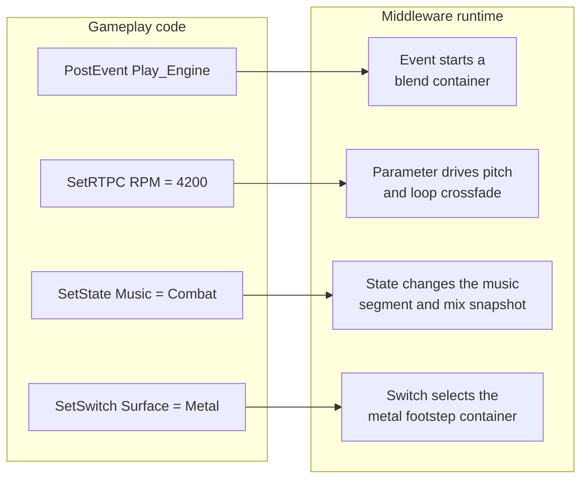
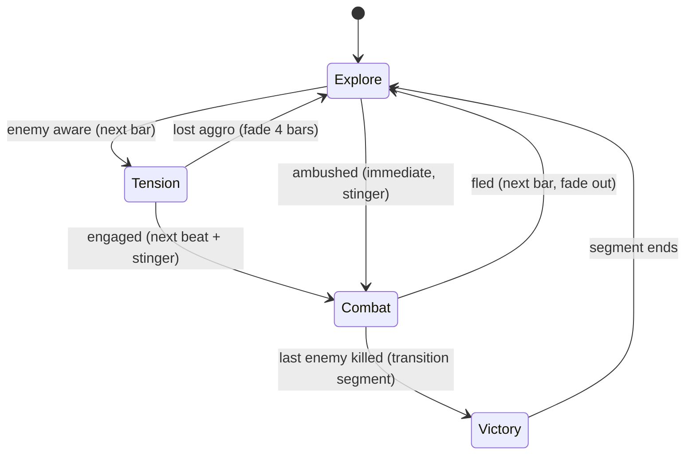
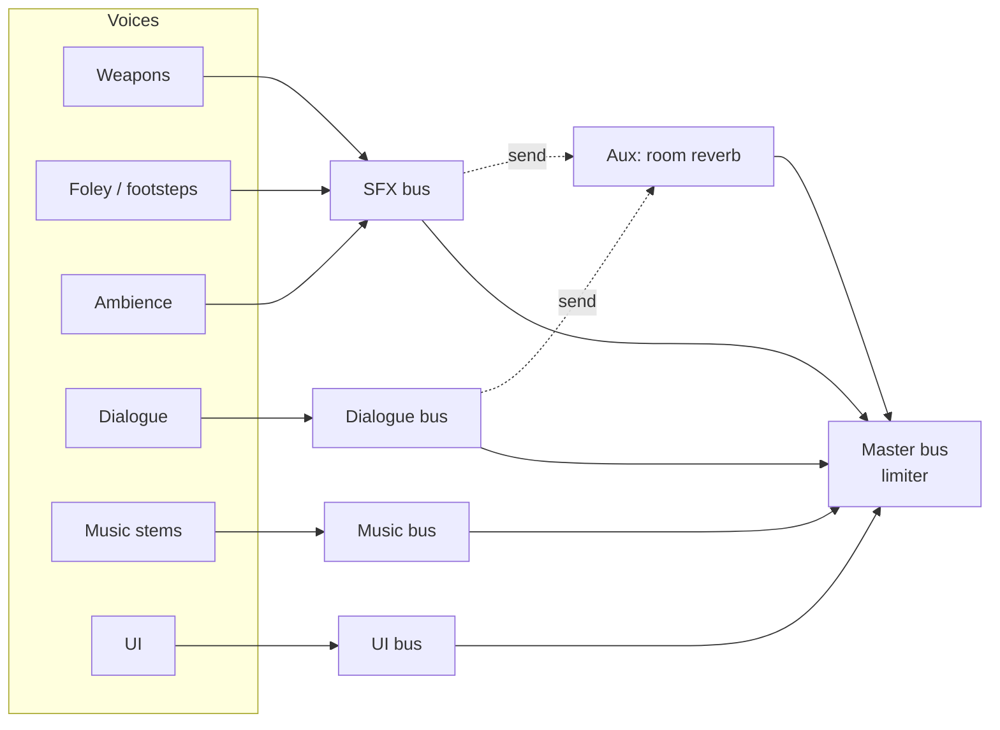

# Audio Design & Implementation

[Game Development](./) &raquo; Audio Design &amp; Implementation

**Interactive audio** is sound that is generated, positioned, and mixed at runtime in response to gameplay, rather than played back as a fixed track. A footstep has to pick a surface, a gunshot has to sound different through a wall, and the music has to change when combat starts without an audible seam. This page covers what an audio programmer or technical sound designer works with: the voice-and-bus runtime model, audio middleware (Wwise and FMOD) and engine-native alternatives, 3D spatialization and sound propagation, adaptive music, mixing and loudness standards, the DSP primitives underneath effects, and the voice, CPU, and memory budgets that keep audio inside the frame.

## Fundamentals

### The runtime signal chain

Every engine and middleware package follows the same basic path from asset to speaker:


| Term | Meaning |
|------|---------|
| **Sound / asset** | Source audio data: a `.wav` during authoring, shipped as PCM, ADPCM, Vorbis, Opus, or a platform codec. |
| **Voice** | One *playing instance* of a sound, with its own pitch, volume, playhead, and envelope. Voices are the scarce runtime resource (see [voice management](#voice-management-and-limiting)). |
| **Emitter / game object** | The world entity a voice is attached to, which supplies position, orientation, and velocity. |
| **Listener** | The ear position, usually the camera or the player's head. Split-screen games have more than one. |
| **Bus** | A mixing node (also called a submix or group). Voices route into buses, which apply shared volume and effects and feed other buses, ending at the master. |

The audio engine runs on its own thread. Game code only sends commands such as "play", "set parameter", or "move emitter", and the audio thread renders fixed-size buffers ahead of the hardware. Buffer size sets the latency floor: a buffer of $N$ samples at sample rate $f_s$ adds $N / f_s$ seconds, so 512 samples at 48 kHz is about 10.7 ms. Double or triple buffering adds to that. Smaller buffers respond faster but raise the risk of dropouts when the audio thread misses a deadline.

### Sample rate and bit depth

By the Nyquist–Shannon theorem, a signal with bandwidth $f_{max}$ can be sampled without aliasing only if

$$
f_s \ge 2 f_{max}
$$

Human hearing tops out near 20 kHz. **48 kHz** is the game and video standard because it leaves room above 20 kHz for the anti-aliasing filter's transition band. 44.1 kHz is the legacy CD rate. Bit depth sets the quantization noise floor. For ideal $n$-bit linear PCM, the signal-to-quantization-noise ratio for a full-scale sine is

$$
\mathrm{SQNR}_{\mathrm{dB}} \approx 6.02\, n + 1.76
$$

That gives about 98 dB for 16-bit, which is enough for shipped assets. Authoring uses 24-bit, and mix engines work internally in 32-bit float so that summing many voices cannot clip until the final limiter.

### Decibels and loudness

Level is expressed as a logarithmic amplitude ratio:

$$
G_{\mathrm{dB}} = 20 \log_{10}\!\left(\frac{A}{A_{\mathrm{ref}}}\right)
$$

A +6 dB change doubles amplitude. A change of about +10 dB is heard as roughly twice as loud. Peak level says little about perceived loudness, so games measure **integrated loudness** in LUFS (ITU-R BS.1770 K-weighting, as in EBU R128). Integrated loudness is averaged over a representative play session. The Audio Standards Working Group's recommendation (ASWG-R001) is about **−24 LUFS for console and PC** and **−18 LUFS for mobile**, with true peak kept below about −1 dBTP. Platform holders publish their own guidance, which is broadly similar. Dialogue is usually the anchor for the mix, and everything else is balanced against it.

## Middleware and Engine Audio

Most studios license **audio middleware** instead of writing a mixer. Middleware is a standalone authoring application plus a runtime library that the engine drives through an API. The two dominant packages are **Audiokinetic Wwise** (Audiokinetic has been owned by Sony Interactive Entertainment since 2019, but Wwise remains multi-platform) and **FMOD Studio** (Firelight Technologies). Both are free below a budget or revenue threshold and licensed above it. Check current terms before committing.

### Why use middleware

- **Designers own the behavior.** Randomization, layering, attenuation curves, mixing, and music logic are authored in a tool and hot-reloaded into a running game, with no recompile.
- **Events are separated from assets.** Code posts `Play_Footstep` and sets a `Surface` parameter. The designer decides that this picks one of nine grass samples at random, varies pitch by ±3%, and routes to the Foley bus. The code stays the same when the sound design changes.
- **Live profiling.** The authoring tool connects to a running build, including a console devkit, and shows active and virtual voices, bus meters, CPU per plugin, and memory per bank.
- **Per-platform builds.** A single project produces banks with platform-specific codecs, sample rates, and spatializers.

### The event and parameter model



| Concept | Wwise | FMOD Studio | Role |
|---------|-------|-------------|------|
| Triggerable behavior | Event | Event | What code posts to start, stop, or modify sound |
| Continuous game value | RTPC (Game Parameter) | Parameter (local or global) | Maps a number such as RPM, health, or speed onto volume, pitch, filters, or layer blends |
| Global discrete mode | State | Global labeled parameter | Game phase (explore or combat), which drives music and mix |
| Per-object discrete choice | Switch | Local labeled parameter | Per-emitter variation, such as footstep surface |
| Mix node | Audio Bus, Auxiliary Bus | Group Bus, Return Bus | Routing, effects, and sends |
| Mix preset | States on buses, Mixer plug-ins | Snapshot | Context-driven mix changes |
| Shipped data | SoundBank | Bank | What ships and loads at runtime |
| Variation logic | Random, Sequence, Switch, Blend containers | Multi, Scatterer, and nested-event instruments | Authored playback behavior |

### Integration sketch

The engine side posts events, feeds parameters, and pushes transforms every frame. In Wwise:

```cpp
// Register once per emitter; the ID is any stable 64-bit value.
AK::SoundEngine::RegisterGameObj(carId, "Car");

// One-shot at an emitter
AK::SoundEngine::PostEvent("Play_Explosion", explosionId);

// Continuous parameter, updated each frame
AK::SoundEngine::SetRTPCValue("RPM", car.rpm, carId);

// Discrete per-object choice from a ground raycast
AK::SoundEngine::SetSwitch("Surface", "Metal", playerId);

// Global music/mix state
AK::SoundEngine::SetState("Music", "Combat");

// Each frame: move emitters and the listener, then render
AkSoundPosition pos;
pos.SetPosition(carPos.x, carPos.y, carPos.z);
pos.SetOrientation(carFwd.x, carFwd.y, carFwd.z, carUp.x, carUp.y, carUp.z);
AK::SoundEngine::SetPosition(carId, pos);
AK::SoundEngine::RenderAudio();   // submit this frame's commands to the audio thread
```

In FMOD Studio the equivalent is to create an `FMOD::Studio::EventInstance`, then call `setParameterByName`, `set3DAttributes` on each instance, and `setListenerAttributes` on the system, and call `Studio::System::update()` once per frame. Neither API blocks the game thread. The rule is the same in both: update listener and emitter transforms every frame, and set velocities as well, or Doppler will be wrong. Then flush once per frame.

### Engine-native audio

Built-in engine audio is a reasonable choice for many projects, especially small teams that don't need middleware's authoring workflow:

| Engine | Native audio stack | Notes |
|--------|--------------------|-------|
| **Unreal Engine 5** | MetaSounds (node-based procedural sound graphs, with sample-accurate triggering), Sound Classes and Submixes, Attenuation assets, Audio Modulation (control buses and parameter patches), Quartz (sample-accurate musical clock) | MetaSounds replaces Sound Cues for new work. See [Unreal Engine: Audio](../technology/unreal.html#audio-metasounds). |
| **Unity 6** | AudioSource/AudioListener, AudioMixer with snapshots, exposed parameters, and ducking via Send/Duck Volume effects | Wwise and FMOD both ship Unity integrations and are common for music-heavy games. |
| **Godot 4** | `AudioStreamPlayer`/`2D`/`3D`, bus layout with built-in effects, `AudioStreamInteractive`/`Synchronized`/`Playlist` for adaptive music | Interactive music streams were added in Godot 4.3. |

The concepts on the rest of this page apply to all of these. Only the names change.

## Spatial and 3D Audio

3D audio positions a sound in the world and reproduces the cues the brain uses to localize it: level and time differences between the ears, spectral shaping by the head and outer ear, distance cues, and the acoustics of the space between the source and the listener.

### Distance attenuation

In a free field, intensity falls with the inverse square of distance, which is a **6 dB drop per doubling of distance**:

$$
L(r) = L_{\mathrm{ref}} - 20 \log_{10}\!\left(\frac{r}{r_{\mathrm{ref}}}\right)
$$

Games seldom use pure inverse-square falloff because it makes sounds too quiet too quickly for gameplay. Designers author an **attenuation curve** instead: full level out to $r_{min}$, a shaped falloff, and silence (or a floor) beyond $r_{max}$. One common shape is

$$
g(r) =
\begin{cases}
1 & r \le r_{min} \\[4pt]
\left(\dfrac{r_{max} - r}{r_{max} - r_{min}}\right)^{p} & r_{min} < r < r_{max} \\[4pt]
0 & r \ge r_{max}
\end{cases}
$$

where the exponent $p$ controls how quickly the level falls. Distance also drives other curves: a low-pass filter for air absorption, the wet/dry ratio (distant sources sound more reverberant), and the **spread** (a nearby waterfall surrounds the listener, while a distant one is a point). $r_{max}$ matters for performance too. A voice beyond it should be virtualized or never started (see [budgets](#performance-budgets)).

### Panning

Positioning a source across speakers distributes its energy among them. Linear panning ($L = 1-x$, $R = x$) sounds about 3 dB quieter at the center because acoustic power, not amplitude, is what adds up. **Constant-power panning** keeps $L^2 + R^2 = 1$:

$$
L = \cos\!\left(\frac{\pi}{4}(1+\theta)\right), \qquad
R = \sin\!\left(\frac{\pi}{4}(1+\theta)\right), \qquad \theta \in [-1, 1]
$$

Multichannel layouts generalize this to **vector-base amplitude panning (VBAP)** between the nearest speaker pair or triplet. Many engines instead encode sources into **Ambisonics**, a speaker-independent spherical-harmonic sound field, and decode that to whatever the output is: speakers, binaural, or a head-tracked VR mix.

### HRTF and binaural rendering

On headphones, convincing elevation and front/back localization comes from the **head-related transfer function (HRTF)**, which is the direction-dependent filtering applied by the head, torso, and pinnae. The renderer convolves the dry source with the left and right head-related impulse responses (HRIRs) for the source direction $(\theta, \phi)$:

$$
y_{L}(t) = (x * h_{L,\theta,\phi})(t), \qquad
y_{R}(t) = (x * h_{R,\theta,\phi})(t)
$$

An HRTF combines two interaural cues. The **interaural time difference (ITD)**, up to about 0.7 ms, dominates below about 1.5 kHz. The **interaural level difference (ILD)**, caused by head shadowing, dominates at higher frequencies. The pinna adds spectral notches that encode elevation. Generic HRTFs work for most listeners. Personalized ones reduce front/back confusion further. Platform object renderers (Windows Sonic, Dolby Atmos for Headphones, PlayStation 5 Tempest 3D AudioTech, Apple spatial audio) and plugins (Steam Audio, Meta XR Audio SDK, and the built-in Wwise and FMOD spatializers) provide HRTF rendering. Head-tracked binaural audio is required in VR; see [VR/AR Development](../vr-ar/).

### Occlusion, obstruction, and propagation

The geometry between a source and the listener changes what reaches the ear:

| Effect | Geometry | Treatment |
|--------|----------|-----------|
| **Occlusion** | Source is fully enclosed, such as behind a closed door or wall | Low-pass and attenuate both the direct and reverberant signals |
| **Obstruction** | Direct path is blocked, but the room path is open, such as around a pillar | Filter the dry signal and leave the reverb send unchanged |
| **Exclusion** | Direct path is open but the rooms are acoustically separate, such as through an open doorway | Leave the dry signal and reduce the send into the listener's room reverb |
| **Diffraction / portals** | Sound bends around edges and passes through openings | Re-position the virtual source at the portal or edge, and attenuate by the bend angle |

The simplest approach casts a few rays from listener to emitter, spread across frames, and maps the fraction blocked onto a cutoff frequency and gain. Modern games increasingly use geometry-aware **propagation** systems:

- **Room and portal graphs.** Designers mark rooms and portals (doors, windows). Sound travels along the shortest path through open portals and is diffracted at edges. Wwise Spatial Audio (Rooms and Portals, geometric diffraction and reflection) and Unreal's Audio Gameplay Volumes work this way.
- **Ray- or path-traced propagation at runtime.** Steam Audio (open source under Apache 2.0 since 2024) traces reflections and pathing against scene geometry and can produce per-source reverb.
- **Baked wave simulation.** Tools such as Microsoft Project Acoustics precompute wave-based propagation offline and look up the results at runtime. This gives accurate diffraction at very low runtime cost, but only for static geometry.

**Reverb** gives a sense of the space. **Convolution reverb** convolves the signal with a measured or simulated impulse response and sounds realistic but costs more. **Algorithmic reverb** uses feedback delay networks (FDNs), which are cheap and tunable. Games typically place one reverb per acoustic zone on an auxiliary bus and send voices to it based on the rooms they occupy.

## Adaptive and Interactive Music

Adaptive music responds to game state without audible seams. Two techniques dominate, and most scores use both.

### Horizontal re-sequencing

The score is cut into segments, and a state machine moves between them. Transitions are **quantized** to musical boundaries (the next beat, the next bar, or a custom cue) so that a change requested mid-phrase still lands on the music's grid:



**Transition segments** are short bridging clips placed between sections whose key or tempo would otherwise clash. **Entry and exit cues** mark the points within a segment where a transition may start or end.

### Vertical layering

A looping passage is built from synchronized **stems** (for example percussion, bass, strings, and lead). The stems are faded in and out in real time according to an intensity value $I(t)$ derived from gameplay (enemy count, proximity, or health). Each layer $i$ has its own fade window $[I_i^{\mathrm{on}}, I_i^{\mathrm{full}}]$:

$$
g_{i}(t) = \mathrm{clamp}\!\left(\frac{I(t) - I_{i}^{\mathrm{on}}}{I_{i}^{\mathrm{full}} - I_{i}^{\mathrm{on}}},\, 0,\, 1\right)
$$

All stems share tempo, key, and playhead, so a layer can enter or leave at any moment without re-sequencing. The intensity value is usually smoothed or given hysteresis so that the music doesn't jump back and forth when gameplay does.

### Stingers, parameters, and generative music

- **Stingers** are short one-shot phrases (a flourish on level-up, a hit on discovery) played over the running score and aligned to the next beat.
- **Parameter mapping** applies the RTPC/parameter mechanism used for engine pitch to the music. `Tension`, `PlayerHealth`, or `EnemyProximity` can drive layer gains, filter cutoffs, or a tempo change at a phrase boundary.
- **Generative and procedural music** assembles phrases at runtime from rules or small motifs, in MetaSounds, Wwise's Interactive Music hierarchy, or custom sequencers. It suits open-ended play where authored transitions can't cover every state.

A typical combination: combat intensity is handled **vertically**, phase changes (explore, combat, victory) are handled **horizontally**, and stingers mark discrete events.

## Mixing

The mix decides what the player hears when dozens of voices compete for attention. It is built as a **bus graph**. Voices route into category buses, category buses route into higher-level buses and the master, and effects and automation sit on the buses.

### Bus hierarchy



Each bus has one fader and one effects chain for a whole category. The player's "Music / SFX / Dialogue" sliders are bus volumes, and a single EQ on the dialogue bus affects every line. Reverb lives on an **auxiliary (send/return) bus** that many voices share. UI and music are usually kept dry and non-spatialized.

### Ducking and sidechain compression

The core mixing problem in games is keeping dialogue intelligible over music and effects. **Ducking** lowers one bus while another is active, for example music by 8 dB and SFX by 5 dB while dialogue plays, with attack and release times so the change isn't noticed. **Sidechain compression** is the signal-driven version: the music compressor's detector listens to the dialogue bus level, so louder speech ducks the music more. Above a threshold $T$, a compressor with ratio $R$ applies gain

$$
G_{\mathrm{dB}} =
\begin{cases}
0 & L_{\mathrm{in}} \le T \\
-\left(1 - \dfrac{1}{R}\right)(L_{\mathrm{in}} - T) & L_{\mathrm{in}} > T
\end{cases}
$$

with attack and release times controlling how fast the gain reduction engages and recovers.

**HDR audio** (used in DICE's Frostbite games and available in Wwise) extends this idea to the whole mix. Every sound is authored at a physically motivated loudness, and a sliding window of fixed size follows the loudest active sounds. When an explosion goes off nearby, quiet ambience drops below the window and is culled, which frees voices and imitates the ear adapting to loud sounds.

### Snapshots and mix states

Context changes such as a cutscene, the pause menu, going underwater, or low health are handled with **snapshots** (FMOD) or **states applied to buses** (Wwise). A snapshot is a stored set of bus volumes and effect parameters that the mixer interpolates toward over a fade time. An underwater snapshot might low-pass the SFX bus and add a heavy reverb send. A pause snapshot might duck everything except UI.

### Accessibility

Audio carries gameplay information that some players can't hear, and the mix should allow for this:

- **Separate volume sliders** for dialogue, music, SFX, and UI, plus a **dynamic range** option ("night mode" or "TV speakers") that compresses the master bus.
- A **mono downmix** option for players with single-sided hearing loss. Without it, hard-panned cues are lost.
- **Subtitles and captions** that include speaker names and important non-speech sounds, with size and background options.
- **Visualized sound cues**: on-screen direction indicators for footsteps, gunfire, and similar sounds, driven by the same emitter data the spatializer uses. Fortnite's sound visualization is a well-known example.

## DSP Basics

**Digital signal processing (DSP)** is the per-sample math applied on voices and buses. A few primitives account for most game audio effects.

### Gain, mixing, and resampling

- **Gain** is a per-sample multiply: $y[n] = g\,x[n]$.
- **Mixing** is summation: $y[n] = \sum_i g_i\,x_i[n]$. Summation is why float headroom and a master limiter matter.
- **Resampling / pitch shift** reads the source at a fractional rate $\rho$ with interpolation: $y[n] = x(n\rho)$. A rate of 2 plays an octave higher and twice as fast.

**Doppler shift** is resampling driven by relative motion. With speed of sound $c$, listener speed $v_l$ toward the source, and source speed $v_s$ toward the listener:

$$
\rho = \frac{c + v_l}{c - v_s}
$$

Games usually scale or clamp the effect, because physically correct Doppler at vehicle speeds sounds exaggerated. Velocities should come from smoothed positions so that teleports and frame hitches don't cause pitch spikes.

### Filters

The **biquad**, a second-order IIR filter, does most of the filtering work: low-pass for occlusion and distance, high-pass to remove rumble, and peaking and shelving EQ on buses:

$$
y[n] = b_0 x[n] + b_1 x[n-1] + b_2 x[n-2] - a_1 y[n-1] - a_2 y[n-2]
$$

The coefficients are computed from a cutoff (or center) frequency, $Q$, and gain, usually with the RBJ "Audio EQ Cookbook" formulas. Moving an occlusion low-pass from 20 kHz down to about 1 kHz is what makes a sound seem to come from behind a wall. When a cutoff is modulated every frame, interpolate the coefficients or use a state-variable filter to avoid zipper noise.

### Delay-based effects

A **delay line** is a ring buffer read $D$ samples behind its write head. It is the basis of echo, chorus, flanging, and algorithmic reverb:

$$
y[n] = x[n] + g\,y[n - D], \qquad |g| < 1
$$

Feedback produces a decaying echo. A **feedback delay network** of several mutually coupled delay lines produces a dense reverb tail. Convolution reverb computes $y = x * h$ against an impulse response, using partitioned FFT convolution so that long tails stay affordable in real time.

### Where effects go

Per-voice DSP, such as an occlusion filter on every source, scales with voice count. Per-bus DSP, such as one reverb or one compressor, costs the same no matter how many voices feed it. So **put expensive effects on buses, not voices**: use one shared reverb send per acoustic zone instead of a reverb on every voice.

## Performance Budgets

Audio shares the machine with everything else. It usually gets one dedicated thread (sometimes plus worker jobs for decoding and convolution), a CPU budget of a few percent of a core per frame, and a fixed memory pool. The audio thread must never block on the game or render thread. Budgets are set for three resources: **voices, CPU, and memory**.

### Voice management and limiting

Each active voice costs decoding, DSP, and mixing. Engines cap the number of physical voices (typically a few dozen on mobile and a few hundred on current consoles and PC) and handle the rest as follows:

- **Priority.** Every sound has a priority, often adjusted by distance. When the cap is reached, the lowest-priority voices are stolen or virtualized first. Player gunfire outranks a distant bird.
- **Virtual voices.** Inaudible or over-budget sounds keep advancing their playhead (or restart, or pause, depending on the chosen behavior) but render nothing until they become audible again.
- **Audibility culling.** Voices beyond the attenuation $r_{max}$, or below an audibility threshold under the current mix or HDR window, are not rendered. The cheapest voice is one that is never started.
- **Instance limits.** Rules such as "at most 4 footsteps" or "one of this UI ping", with a steal policy (oldest, quietest, or farthest), stop a swarm of identical sounds from smearing together and using up voices.

### CPU

| Cost center | Scales with | Main levers |
|-------------|-------------|-------------|
| Decoding | Number of compressed voices and codec cost | Stream long assets, use cheap-to-decode formats (ADPCM, PCM) for short frequent SFX, use hardware decoders where the platform has them |
| Per-voice DSP | Active voices × effects per voice | Virtualize aggressively; move effects to buses |
| Per-bus DSP | Number of buses and their effects | Share reverbs through sends; limit effect chains |
| Spatialization | Emitters × HRTF, rays, or paths | Spread occlusion rays over several frames; use HRTF only for near or important sources and cheaper panning for the rest |
| Mixing | Total active voices | The voice cap is effectively the mixing budget |

Profile on the target hardware with the middleware profiler connected (Wwise Profiler, FMOD Studio Profiler, or Unreal Insights), not on a development PC. Decode and DSP costs on consoles and mobile devices differ a lot from desktop costs. See [CPU Optimization](../optimization/cpu-optimization.html).

### Memory

- **Resident versus streamed.** Short, frequent, latency-sensitive sounds (footsteps, weapons, UI) are kept fully in memory in loaded banks. Long assets (music, ambience beds, dialogue) are streamed from disk in chunks. For streamed sounds that must start instantly, keep a small **prefetch** of the start of the file in memory.
- **Bank strategy.** Group assets into banks by level, region, or feature, and load or unload them with the content. Wwise's auto-defined SoundBanks (one bank per event, loaded on demand) avoid hand-maintaining large monolithic banks. This is the audio counterpart of texture and mesh streaming; see [Memory Optimization](../optimization/memory-optimization.html).
- **Codecs.** Choose a codec per asset based on how often it plays and how long it is. Vorbis and Opus give high compression at a higher decode cost. ADPCM gives about 4:1 compression with very cheap decoding. PCM is the reverse of Vorbis and Opus.
- **Localization.** Dialogue is often the largest audio asset set. Ship it in per-language packs and load only the selected language.

### Platform specifics

Mobile adds **battery and thermal** limits (audio is a constant CPU load), smaller voice and memory budgets, and OS audio-session rules such as interruptions, the silent switch, and routing to Bluetooth devices (which adds a lot of latency). Consoles impose **certification requirements**: correct behavior on suspend and resume, handling of output-device changes, and support for the platform's 3D audio path. Plan budgets for each target platform from the start, as you would for rendering; see [Platform Tuning](../optimization/platform-tuning.html).

## See Also

- [Game Development](./): engines, core systems, and the overall game-development pipeline
- [Unreal Engine: Audio](../technology/unreal.html#audio-metasounds): MetaSounds, submixes, and Unreal's spatialization
- [VR/AR Development](../vr-ar/): head-tracked binaural audio and spatial tracking
- [Game AI](../ai-ml/game-ai.html): the gameplay state (combat, awareness, proximity) that drives adaptive audio
- [CPU Optimization](../optimization/cpu-optimization.html): profiling and budgeting the audio thread
- [Memory Optimization](../optimization/memory-optimization.html): bank residency and streaming
- [Platform Tuning](../optimization/platform-tuning.html): console and mobile audio constraints and certification
