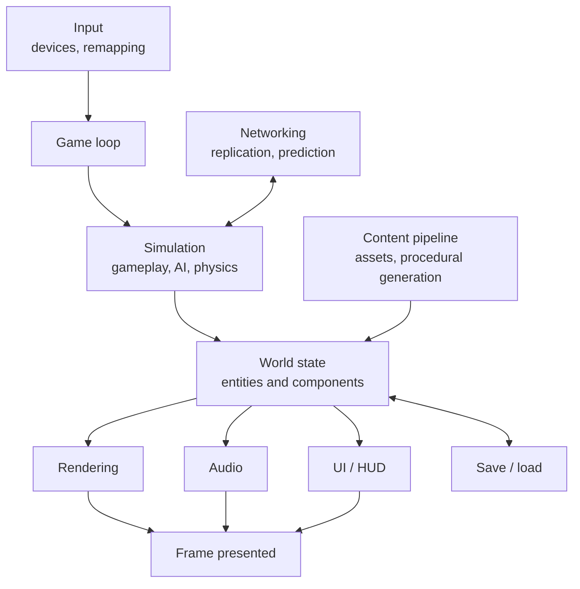
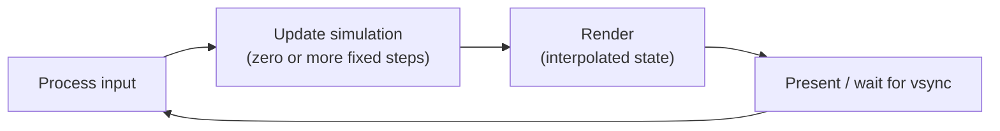
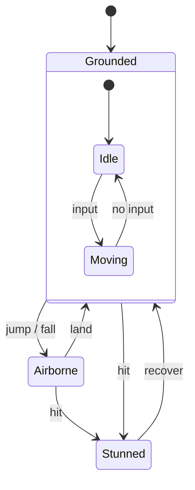
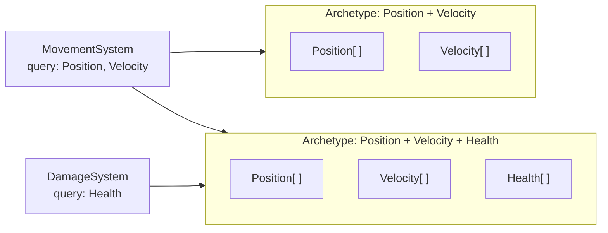

<div class="hero-section" style="background: linear-gradient(135deg, #f093fb 0%, #f5576c 100%); color: white; padding: 3rem 2rem; margin: -2rem -3rem 2rem -3rem; text-align: center;">
  <h1 style="color: white; margin: 0; font-size: 2.5rem;">Game Development</h1>
  <p style="font-size: 1.25rem; margin-top: 1rem; opacity: 0.9;">Engines, systems, and principles for creating interactive entertainment experiences</p>
</div>

**Game development** is the engineering and craft of building interactive real-time software. A game is a soft real-time simulation: it reads input, advances a model of the world, and presents the result as images and sound, repeating that 30 to 240 times a second on hardware that ranges from phones to consoles to high-end PCs. This hub covers the architecture every game shares (the engine, the game loop, and how game objects are composed) and links to the focused pages on gameplay systems, audio, multiplayer, and production.

## Topics in This Section

The pages are grouped by the layer of a game they cover.

| Area | Page | Covers |
|------|------|--------|
| **Core architecture** | [Engines](#engines) | Choosing between Unreal, Unity, Godot, and custom engines |
| | [Game Loop Architecture](#game-loop-architecture) | Input, update, render; fixed versus variable timestep; state machines |
| | [Entity Component System](#entity-component-system-ecs) | Composition over inheritance; archetype and sparse-set storage |
| | [Unreal Engine](../technology/unreal.html) | Nanite, Lumen, World Partition, Blueprints, MetaSounds |
| **Gameplay systems** | [Procedural Generation](procedural-generation.html) | Noise, wave function collapse, dungeons and terrain, seeded worlds |
| | [Save Systems &amp; Persistence](save-systems.html) | Serialization, versioned migration, cloud saves, atomic writes |
| | [UI/UX &amp; Menu Architecture](ui-design.html) | HUDs, menu state machines, input remapping, accessibility |
| | [Game AI](../ai-ml/game-ai.html) | Behavior trees, pathfinding, steering, utility AI, learned agents |
| **Presentation** | [3D Rendering](../graphics/3d-rendering.html) | The rendering pipeline, lighting, and real-time techniques |
| | [Shader Programming](../graphics/shaders.html) | Vertex, fragment, and compute shaders on the GPU |
| | [Audio Design](audio-design.html) | Middleware, spatial audio, adaptive music, mixing, budgets |
| | [VR &amp; AR Development](../vr-ar/) | Tracking, comfort and locomotion, XR rendering constraints |
| **Networking** | [Multiplayer Networking](multiplayer-networking.html) | Authoritative servers, prediction and reconciliation, lag compensation, rollback |
| **Production** | [Testing &amp; QA](testing-qa.html) | Playtesting, automated and soak tests, bug triage, certification, telemetry |
| | [Monetization &amp; Business Models](monetization.html) | Premium, free-to-play, battle passes, and ethical design |
| | [Performance Optimization](../optimization/) | Profiling, CPU/GPU/memory budgets, platform tuning |

### Suggested reading order

- **New to game programming:** [Game Loop](#game-loop-architecture), then [ECS](#entity-component-system-ecs), then [core loop design](#design-physics-and-platforms), then [save systems](save-systems.html) and [UI](ui-design.html).
- **Solo or small-team developers:** [Engines](#engines), [procedural generation](procedural-generation.html) to stretch a small content budget, [monetization](monetization.html), and [testing](testing-qa.html) early rather than late.
- **Large productions:** [Unreal Engine](../technology/unreal.html), [multiplayer networking](multiplayer-networking.html), [performance optimization](../optimization/), and [certification](testing-qa.html).
- **Specialists:** technical art ([rendering](../graphics/3d-rendering.html) and [shaders](../graphics/shaders.html)), XR ([VR/AR](../vr-ar/) and [spatial audio](audio-design.html)), and networking ([multiplayer](multiplayer-networking.html) and [network fundamentals](../technology/networking/)).

### How the pieces fit together



The engine owns the loop and the subsystems. Game code lives mostly in the simulation, and every other system reads from or writes to the shared world state.

## Engines

An **engine** provides the loop, rendering, audio, physics, input, asset pipeline, and editor, so that a team spends its time on the game rather than on infrastructure. The choice of engine shapes the language the team works in, the platforms it can reach, and the costs it pays.

| Engine | Languages | Strengths | Licensing (verify current terms) |
|--------|-----------|-----------|----------------------------------|
| **Unreal Engine 5** | C++, Blueprints (Verse in UEFN) | High-fidelity 3D: Nanite geometry, Lumen GI, World Partition streaming, strong console tooling | Free to use. 5% royalty on gross revenue above US$1M per product; revenue from the Epic Games Store is exempt |
| **Unity 6** | C# | Mobile and cross-platform reach, large asset and plugin ecosystem, 2D and 3D, DOTS for data-oriented code | Free Personal tier below a revenue threshold, then paid subscriptions. The 2023 per-install Runtime Fee was cancelled in September 2024 |
| **Godot 4** | GDScript, C#, C++ (GDExtension) | Lightweight, fast iteration, strong 2D, node/scene workflow, fully open source | MIT license: no fees or royalties |
| **Others** | Various | GameMaker (2D), Defold (mobile/web 2D), O3DE (open-source 3D), Bevy (Rust, ECS-first, pre-1.0) | Varies |
| **Proprietary** (id Tech, Frostbite, Decima, RE Engine, Snowdrop) | C++ | Tuned for one studio's genres and platforms | Internal only |

When choosing, weigh the **target platforms** (console support and certification tooling), the **team's language skills**, how much **engine source access** you need (Unreal and Godot ship source; Unity source access is an enterprise add-on), the **genre** (2D, open world, competitive multiplayer), and the **total cost** over the product's lifetime. Engine migrations mid-project are expensive, so prototype the riskiest system in the candidate engine before committing.

## Game Loop Architecture

Every game runs a loop that repeats once per frame:



### Fixed and variable timesteps

The central design decision is how simulation time relates to wall-clock time.

| Approach | Behavior | Problem |
|----------|----------|---------|
| **Variable timestep** (`update(dt)`) | Simulation advances by the real frame time | Physics and gameplay become frame-rate dependent. Large `dt` spikes cause tunneling and instability, and replays and networking are non-deterministic |
| **Fixed timestep, locked frame rate** | One update per frame at a constant `dt` | Slows down if a frame is late, and wastes high-refresh displays |
| **Fixed simulation, variable rendering** (standard) | Simulation runs in fixed steps from a time accumulator, and rendering interpolates between the last two states | Adds up to one step of visual latency, and requires keeping the previous state |

The standard approach, popularized by Glenn Fiedler's "Fix Your Timestep!", decouples the two clocks:

```cpp
const double dt = 1.0 / 60.0;          // simulation step (e.g. 60 Hz)
double accumulator = 0.0;
double previous = now();

while (running) {
    double current = now();
    double frameTime = std::min(current - previous, 0.25);  // clamp to avoid the "spiral of death"
    previous = current;
    accumulator += frameTime;

    pollInput();
    while (accumulator >= dt) {        // catch up in whole fixed steps
        prevState = state;
        simulate(state, dt);           // physics, gameplay, AI: deterministic step
        accumulator -= dt;
    }

    double alpha = accumulator / dt;   // fraction of the next step already elapsed
    render(lerp(prevState, state, alpha));
}
```

Engines expose this directly. Unity has `FixedUpdate` (physics) and `Update` (per frame). Unreal ticks per frame by default, with optional physics substepping and async physics. Godot has `_physics_process` and `_process`. Networked games that use lockstep or rollback netcode need a fixed, **deterministic** step so that every peer computes the same result; see [Multiplayer Networking](multiplayer-networking.html#rollback-netcode).

Two other frame-level concerns are worth knowing:

- **Frame pacing.** Consistent frame times matter more than average FPS. A game averaging 60 FPS with alternating 10 ms and 23 ms frames looks worse than a steady 50 FPS.
- **Parallelism.** Modern engines split each frame into jobs on a worker pool and pipeline simulation and rendering, so the render thread draws frame *N* while the game thread simulates frame *N*+1. This adds a frame of latency in exchange for throughput.

### State machines

Game logic above the loop is usually organized as **finite state machines**: a character is in exactly one of Idle, Moving, Jumping, Attacking, or Stunned, with explicit transitions between them.



**Hierarchical state machines** (as in the `Grounded` superstate above) let shared transitions, such as "hit leads to Stunned", be defined once on the parent instead of on every sub-state, which avoids a combinatorial explosion of transitions. The same structure drives menus (see [UI Design](ui-design.html)), game flow (boot, menu, loading, playing, paused), and animation graphs. For AI decision making, behavior trees and utility systems usually scale better than raw FSMs; see [Game AI](../ai-ml/game-ai.html).

## Entity Component System (ECS)

A classic object-oriented game hierarchy (`Actor`, then `Pawn`, then `Character`, then `FlyingCharacter`) becomes rigid as designers ask for new combinations. **Component-based design** replaces inheritance with composition: an object is the set of components it has. **Entity Component System (ECS)** takes this further and separates data from behavior entirely:

| Part | What it is |
|------|------------|
| **Entity** | A bare identifier, usually an integer index plus a generation counter |
| **Component** | Plain data with no behavior, such as `Position`, `Velocity`, `Health`, or `MeshRef` |
| **System** | A function that runs over every entity with a given set of components, such as a movement system that queries for `Position` and `Velocity` |



Because each component type is stored in tightly packed arrays, a system reads memory sequentially. This is cache-friendly, easy to vectorize, and easy to parallelize, since systems that touch disjoint components can run at the same time. The two common storage designs are:

- **Archetype (table) storage.** Entities with the same component set share a table of column arrays. Iteration is very fast, but adding or removing a component moves the entity to a different table. Unity Entities (DOTS), Unreal Mass, Bevy, and flecs use this design.
- **Sparse-set storage.** Each component type has its own sparse set indexed by entity. Adding and removing components is cheap, and iteration over several components is somewhat slower. EnTT uses this design, and Bevy offers it as an option per component.

ECS pays off with large numbers of similar entities (crowds, projectiles, particles, RTS units) and with simulation that has to be parallel or deterministic. For a few hundred unique, script-heavy objects, a conventional component model such as Unity GameObjects, Unreal Actors and Components, or Godot nodes is usually simpler to work with. Many engines combine the two: they use objects for authoring and ECS for hot loops.

## Design, Physics and Platforms

A few cross-cutting fundamentals come up in every project:

- **Core loop design.** The repeated activity that drives engagement (for example fight, loot, upgrade, fight harder) is tuned to player motivations (mastery, exploration, social play, expression) and paced with a difficulty curve. Accessibility and assist options widen the audience without removing challenge for others.
- **Physics and collision.** Engines ship physics middleware or their own solvers: Unreal uses Chaos, Unity uses PhysX (with Havok as an option for DOTS), Godot 4.4 and later can use Jolt as a built-in option, and Havok and Jolt are also licensed standalone. Collision detection runs a **broad phase** (BVH, sweep-and-prune, or spatial grids) to find candidate pairs, then a **narrow phase** (GJK/EPA, SAT) for exact contacts. Characters usually use a kinematic capsule controller with step and slope handling rather than a full rigid body.
- **Platform targets.** Consoles require certification (TRC, TCR, and lotcheck requirements) and usually fixed 30, 60, or 120 FPS modes. Mobile is limited by thermals, battery, memory, and touch UI. PC needs scalable graphics settings, several input methods, and handheld PCs such as the Steam Deck as an increasingly common target. See [Testing &amp; QA](testing-qa.html) and [Platform Tuning](../optimization/platform-tuning.html).

## See Also

- [Performance Optimization](../optimization/): profiling, bottleneck analysis, and platform-specific tuning
- [Networking Fundamentals](../technology/networking/): the transport-level concepts underneath multiplayer
- [3D Rendering](../graphics/3d-rendering.html) and [Shader Programming](../graphics/shaders.html): the GPU side of the frame
- [Game AI](../ai-ml/game-ai.html): decision making and navigation for non-player characters
