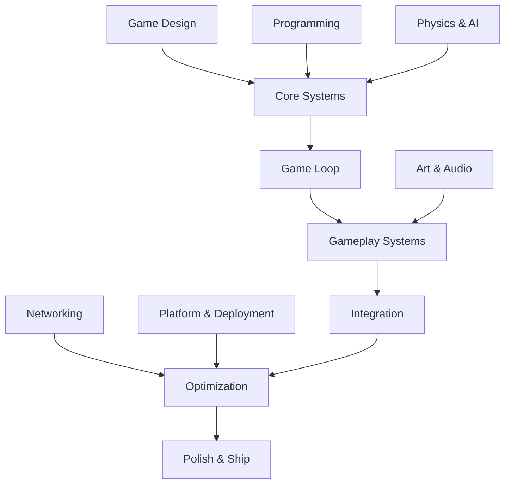

<div class="hero-section" style="background: linear-gradient(135deg, #f093fb 0%, #f5576c 100%); color: white; padding: 3rem 2rem; margin: -2rem -3rem 2rem -3rem; text-align: center;">
  <h1 style="color: white; margin: 0; font-size: 2.5rem;">Game Development</h1>
  <p style="font-size: 1.25rem; margin-top: 1rem; opacity: 0.9;">Engines, systems, and principles for creating interactive entertainment experiences</p>
</div>

Game development is a multidisciplinary field combining programming, art, design, and audio to create interactive entertainment. Whether you are an indie developer building your first game, a professional working on AAA titles, or exploring specialized domains like VR and mobile, this guide covers the engines, systems, and principles that power modern game creation.

## Learning Paths

Choose your path based on your goals and experience level:

### Beginner Path
**Starting from scratch?** Build your foundation systematically:
1. Master the [Game Loop Architecture](#game-loop-architecture) and state machines
2. Learn [Entity Component System](#entity-component-system-ecs) for flexible game objects
3. Study [core loop design](#design-physics-and-platforms) to understand what makes games engaging
4. Add a [save system](save-systems.html) and [UI](ui-design.html) once the loop is fun

### Indie Developer Path
**Building games independently?** Focus on efficiency and scope management:
1. Master [Entity Component System](#entity-component-system-ecs) for flexible architecture
2. Use [procedural generation](procedural-generation.html) to stretch limited content budgets
3. Plan [monetization](monetization.html) and [platform targets](#design-physics-and-platforms) early

### AAA/Enterprise Path
**Working on large-scale productions?** Master professional workflows:
1. Deep dive into [Unreal Engine](../technology/unreal.html) with Nanite and Lumen
2. Master [multiplayer networking](multiplayer-networking.html) and [game AI](../ai-ml/game-ai.html)
3. Learn [Performance Optimization](../optimization/) for target platforms
4. Build a [testing &amp; QA](testing-qa.html) pipeline toward certification

### Specialized Paths

**VR/AR Development:** Core game dev + [VR/AR Development](../vr-ar/) + [spatial audio](audio-design.html)
**Technical Art:** [3D Rendering](../graphics/3d-rendering.html) + [shader programming](../graphics/shaders.html)
**Multiplayer Specialist:** [Multiplayer Networking](multiplayer-networking.html) + [Performance Optimization](../optimization/)

## How Game Development Topics Connect



Each discipline feeds into the core systems, which integrate into cohesive gameplay experiences that are optimized and shipped across platforms.

## Documentation Overview

Explore the library, grouped by how a game comes together — from the architectural backbone to the systems players touch, the visuals and audio that sell the experience, the networking that connects players, and the production work that ships it.

### Core Architecture

The structural foundations every game is built on — engines, the frame loop, and how game objects are composed.

<div class="command-grid">
  <div class="feature-card">
    <h4><i class="fas fa-cube"></i> <a href="../technology/unreal.html">Unreal Engine</a></h4>
    <p>Epic's AAA engine — Nanite virtualized geometry, Lumen real-time GI, World Partition streaming, Blueprints, and MetaSounds.</p>
  </div>
  <div class="feature-card">
    <h4><i class="fas fa-sync"></i> <a href="#game-loop-architecture">Game Loop &amp; State Machines</a></h4>
    <p>The input → update → render heartbeat, fixed vs. variable timestep, and the state machines that drive game logic.</p>
  </div>
  <div class="feature-card">
    <h4><i class="fas fa-th-large"></i> <a href="#entity-component-system-ecs">Entity Component System</a></h4>
    <p>Composition over inheritance — cache-friendly, parallelizable game objects assembled from data components.</p>
  </div>
</div>

### Gameplay Systems

The systems players interact with directly — design loops, persistence, interfaces, and generated content.

<div class="command-grid">
  <div class="feature-card">
    <h4><i class="fas fa-dice"></i> <a href="procedural-generation.html">Procedural Generation</a></h4>
    <p>Noise functions, wave function collapse, dungeon and terrain generation, and seeded reproducible worlds.</p>
  </div>
  <div class="feature-card">
    <h4><i class="fas fa-save"></i> <a href="save-systems.html">Save Systems &amp; Persistence</a></h4>
    <p>Serialization formats, versioned migration, cloud saves, autosave, and corruption-safe write strategies.</p>
  </div>
  <div class="feature-card">
    <h4><i class="fas fa-window-maximize"></i> <a href="ui-design.html">UI/UX &amp; Menu Architecture</a></h4>
    <p>HUDs, menu state machines, input remapping, resolution scaling, and accessibility-first interface design.</p>
  </div>
</div>

### Graphics &amp; Audio

The presentation layer — rendering, shaders, immersive spaces, and the sound that brings them to life.

<div class="command-grid">
  <div class="feature-card">
    <h4><i class="fas fa-cubes"></i> <a href="../graphics/3d-rendering.html">3D Rendering</a></h4>
    <p>The rendering pipeline, rasterization, lighting models, and real-time techniques behind modern visuals.</p>
  </div>
  <div class="feature-card">
    <h4><i class="fas fa-paint-brush"></i> <a href="../graphics/shaders.html">Shader Programming</a></h4>
    <p>Vertex and fragment shaders, the GPU pipeline, and writing materials and effects on the hardware.</p>
  </div>
  <div class="feature-card">
    <h4><i class="fas fa-volume-up"></i> <a href="audio-design.html">Audio Design</a></h4>
    <p>Spatial audio and HRTF, adaptive music, occlusion, mixing, and middleware integration.</p>
  </div>
  <div class="feature-card">
    <h4><i class="fas fa-vr-cardboard"></i> <a href="../vr-ar/">VR &amp; AR Development</a></h4>
    <p>Spatial tracking, comfort and locomotion, XR interactions, and the rendering constraints of immersive hardware.</p>
  </div>
</div>

### Networking

Connecting players — architectures, latency hiding, and the AI that fills the world.

<div class="command-grid">
  <div class="feature-card">
    <h4><i class="fas fa-network-wired"></i> <a href="multiplayer-networking.html">Multiplayer Networking</a></h4>
    <p>Client-server vs. P2P, authoritative servers, client-side prediction, reconciliation, and lag compensation.</p>
  </div>
  <div class="feature-card">
    <h4><i class="fas fa-robot"></i> <a href="../ai-ml/game-ai.html">Game AI</a></h4>
    <p>Behavior trees, pathfinding, steering, and machine-learning-driven NPCs for real-time interactive agents.</p>
  </div>
</div>

### Production

Shipping the game — quality assurance and the business models that sustain it.

<div class="command-grid">
  <div class="feature-card">
    <h4><i class="fas fa-vial"></i> <a href="testing-qa.html">Testing &amp; QA</a></h4>
    <p>Automated and playtesting strategy, regression suites, profiling, certification, and bug triage.</p>
  </div>
  <div class="feature-card">
    <h4><i class="fas fa-coins"></i> <a href="monetization.html">Monetization &amp; Business Models</a></h4>
    <p>Premium, free-to-play, IAP and battle passes, ethical design, and the economics behind each model.</p>
  </div>
</div>

## Foundations Reference

A condensed look at the architectural patterns above — the ones not yet split into their own pages.

### Engine at a Glance

| Engine | Language | Best For | Licensing | Standout Feature |
|--------|----------|----------|-----------|------------------|
| Unreal Engine 5 | C++ / Blueprints | AAA, high-fidelity 3D | Royalty after revenue threshold | Nanite + Lumen |
| Unity | C# | Indie, mobile, cross-platform | Subscription tiers | Asset Store + reach |
| Godot | GDScript / C# | 2D, lightweight 3D, open source | MIT (free, no royalties) | Scene system, tiny footprint |
| Custom (id Tech, Frostbite, Decima) | C++ | Studio-specific AAA needs | Proprietary | Tailored to one game family |

Unity reaches 25+ platforms with a deep Asset Store and DOTS for performance; Godot offers a lightweight, royalty-free, scene-based workflow; and large studios maintain proprietary engines (id Tech, Frostbite, Decima, REDengine) tuned to one game family. For deep coverage of the leading AAA engine, see the [Unreal Engine guide](../technology/unreal.html).

### Entity Component System (ECS)

A composition-based architecture for game objects:

```
Entity: Unique identifier (ID only)
├── Transform Component (position, rotation, scale)
├── Render Component (mesh, material)
├── Physics Component (rigidbody, collider)
└── Behavior Component (AI, player input)

Systems process entities with specific components:
- Render System: Processes entities with Transform + Render
- Physics System: Processes entities with Transform + Physics
- AI System: Processes entities with Transform + Behavior
```

Storing components contiguously gives a cache-friendly layout, makes systems easy to parallelize, and favors flexible composition over deep inheritance hierarchies.

### Game Loop Architecture

The fundamental structure of any game:

```
while (game_running) {
    // 1. Process Input
    input.poll_events()

    // 2. Update Game State
    delta_time = calculate_delta()
    physics.step(delta_time)
    ai.update(delta_time)
    game_logic.update(delta_time)

    // 3. Render
    renderer.begin_frame()
    renderer.draw_scene()
    renderer.end_frame()

    // 4. Frame Timing
    frame_limiter.wait()
}
```

**Fixed vs Variable Timestep:** variable timesteps give smoother visuals but unstable physics; fixed timesteps give deterministic simulation but can stutter. The common solution is a **hybrid** — a fixed-step physics simulation with variable-step rendering and interpolation.

**State machines** sit on top of the loop to drive game logic: discrete states (Idle, Walking, Jumping, Attacking, Damaged) with explicit transitions. Hierarchical state machines (HSMs) let parent states hold shared behavior so sub-states specialize without state explosion.

### Design, Physics and Platforms

A few cross-cutting fundamentals that every project tunes:

- **Core loop design** — the repeatable activity that drives engagement (e.g. *combat → loot → upgrade*), tuned to player motivations (achievement, exploration, social, immersion) and a difficulty curve with assist/accessibility options.
- **Physics &amp; simulation** — middleware (PhysX, Havok, Chaos, Jolt, Bullet), broad-phase vs. narrow-phase collision (BVH, sweep-and-prune, GJK, SAT), and capsule-based character controllers with step/slope handling.
- **Platform targets** — console certification (TRCs/TCRs, 30/60 FPS targets), mobile constraints (thermals, touch UI, memory streaming), and PC scalability (graphics options, input methods, modding, distribution).

## Key Takeaways

- **The game loop is the heartbeat.** Input → update → render, every frame. A fixed-timestep simulation with variable rendering is the standard for stable physics and smooth visuals.
- **Pick the engine for the job.** Unreal for high-fidelity AAA, Unity for cross-platform and mobile reach, Godot for lightweight 2D and open-source freedom.
- **Composition beats inheritance.** ECS and component-based architectures give cache-friendly, parallelizable, flexible game objects at scale.
- **Design the core loop first.** Engagement comes from a satisfying repeatable activity (collect → build → battle → reward) tuned to player motivation.
- **Multiplayer is prediction + reconciliation.** Authoritative servers plus client-side prediction and lag compensation hide latency without enabling cheating.
- **Ship within a budget.** Platform targets (30/60 FPS, memory, thermals) drive optimization and certification from day one, not at the end.

## See Also

Beyond the sections above, these neighboring topics round out a game project:

- [Performance Optimization](../optimization/) - Profiling, bottleneck analysis, and platform-specific tuning
- [Networking Fundamentals](../technology/networking/) - Low-level networking concepts underpinning multiplayer
