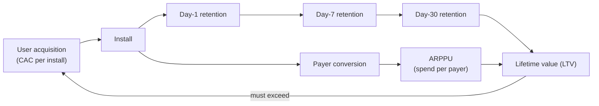
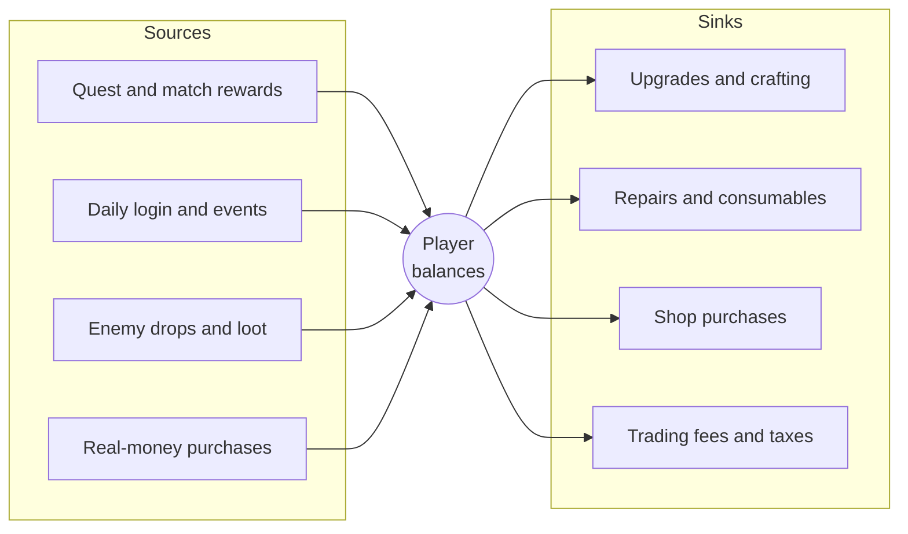

# Monetization & Business Models

[Game Development](./) &raquo; Monetization &amp; Business Models

A game's business model is a design constraint as fundamental as its frame budget. It decides what content gets built, how progression is paced, how the team is staffed after launch, and what the first five minutes and the five-hundredth hour feel like. This page covers the major revenue models and the metrics used to run them, in-app purchases and virtual-economy design, randomized purchases and battle passes, dark patterns and the regulation now targeting them, and the store and platform rules every model has to operate inside. Figures and legal status are current as of late 2026; both change often, so check primary sources before relying on a number.

## Revenue Models

The four canonical models are rarely used alone. A premium game sells cosmetic DLC; a free-to-play game adds a subscription tier; a mobile puzzle game mixes rewarded ads with a starter pack. What matters is which model is *primary*, because that one shapes the design.

| Model | Player pays | Typical fit | Revenue shape | Main risk |
|-------|-------------|-------------|---------------|-----------|
| Premium (buy-to-play) | Once, up front | Narrative, single-player, finite content | Launch spike, long discount-driven tail | Finite window to recoup cost; no recurring income |
| Free-to-play (F2P) | Optionally, repeatedly | Multiplayer, mobile, live service | Recurring, concentrated in a few spenders | User-acquisition cost; retention-dependent |
| Subscription | Monthly or annual fee | MMOs, catalog services | Predictable recurring revenue | Churn; must justify every renewal |
| Ad-supported | Nothing (attention) | Hyper-casual and casual mobile | Per-impression, scale-dependent | Tiny value per user; ad fatigue |

The model also dictates the cost structure. A premium game must recoup development and marketing from a finite launch window. A live-service game spreads ongoing operations (servers, live-ops, a content team) against a recurring revenue stream, so it has to be funded and staffed as an ongoing service, not a project that ships and ends.

### Premium

The player pays a fixed price and owns the game. Revenue is front-loaded: most of it arrives in the launch window, followed by a long tail driven by reviews, word of mouth, and seasonal sales. Wishlists (on Steam) and pre-orders are the main leading indicators, and launch-discount and regional-pricing strategy shape the spike.

Premium suits authored, finite experiences because nothing in the design has to serve a storefront. It is commonly extended with **expansions and DLC** and later a **complete edition** bundling the base game and add-ons for late adopters. The test for paid add-ons is whether they feel like *more game* rather than *the game withheld*.

A growing hybrid is **premium plus live service**: a paid game that also runs a cosmetic shop or season content. *Helldivers 2*, for example, is a paid game whose premium-currency "Warbonds" never expire, removing the time pressure typical of battle passes.

### Free-to-Play

The game is free to download; revenue comes from the minority of players who make in-app purchases (IAP). F2P dominates mobile and much of the PC and console live-service market. Its defining feature is the **spend distribution**: most players never pay, many payers spend small amounts, and a small fraction of heavy spenders (industry slang: "whales") account for a large share of revenue. Payer conversion in the low single-digit percentages is common on mobile.

F2P is only viable when players are worth more than they cost to acquire, and that depends mostly on retention. The metrics are covered in [Core Metrics](#core-metrics).

### Subscription

The player pays a recurring fee for ongoing access. Three variants are common:

- **Single-game subscription.** The classic MMO model: a monthly fee funds a persistent world, servers, and a content cadence (*World of Warcraft*, *Final Fantasy XIV*).
- **Catalog subscription.** One fee grants access to a rotating library, as in Xbox Game Pass, PlayStation Plus, Apple Arcade, and Netflix Games. For developers these are usually licensing deals: the platform pays for inclusion, trading per-copy revenue for guaranteed income and reach.
- **In-game membership.** A recurring premium tier inside an F2P game (a monthly pass with daily currency, or Fortnite Crew bundling the battle pass with a monthly skin).

A subscription base behaves like a leaky bucket. If a fraction $c$ of subscribers churn each month and $n$ new subscribers join, the base evolves as

$$
S_{t+1} = (1 - c)\,S_t + n
$$

and converges to the steady state $S^\ast = n / c$. Halving churn doubles the long-run subscriber base at the same acquisition rate, which is why subscription games put so much into content cadence: every renewal has to be earned.

### Ad-Supported

The game is free and sells the player's attention. This is the backbone of hyper-casual and much of casual mobile, where development cost is low and reach is large. Formats, from least to most intrusive:

- **Rewarded video.** The player opts in to watch an ad for an in-game reward (a revive, currency, a hint). Because it is consensual and gives value, it is the most player-friendly format and often the highest-earning.
- **Banner.** A small persistent strip; low revenue, low intrusion.
- **Interstitial.** A full-screen ad at a natural break, such as between levels. Effective but disruptive if frequency is not capped.
- **Playable and offerwall units.** Interactive ads, often used for cross-promotion.

Ad revenue is measured by eCPM (effective revenue per thousand impressions):

$$
\text{Ad revenue} = \frac{\text{Impressions}}{1000} \times \text{eCPM}
$$

eCPMs are small and vary widely by country, platform, format, and fill rate, so ads work only at scale. Most successful mobile games now use **hybrid monetization**: rewarded ads for the large non-paying audience plus IAP for spenders, tuned so each does not cannibalize the other (an "ad removal" purchase is often a player's first IAP).

## Core Metrics

Live-service games are run from a small set of metrics. Most can be read off the player funnel:

| Metric | Definition | Why it matters |
|--------|-----------|----------------|
| DAU / MAU | Daily / monthly active users | Audience size; DAU/MAU ratio measures "stickiness" |
| D1 / D7 / D30 retention | Share of an install cohort still playing on day 1, 7, 30 | A churned player can never spend; the master metric |
| Conversion | Share of players who ever pay | Health of the store and offer design |
| ARPDAU | Revenue per daily active user | Daily monetization intensity |
| ARPPU | Revenue per *paying* user | What a payer is worth |
| LTV | Expected total revenue per acquired player | Caps what you can spend to acquire one |
| CAC | Marketing cost to acquire one player | The other side of the viability test |
| Churn | Share of subscribers or players lost per period | Subscription and live-service decay rate |

ARPU averages over everyone; ARPPU averages over payers only and is typically many times larger:

$$
\text{ARPU} = \frac{\text{Revenue}}{\text{Active users}}, \qquad \text{ARPPU} = \frac{\text{Revenue}}{\text{Paying users}}
$$

A common back-of-envelope LTV multiplies daily revenue per user by the expected number of days a new player is active, which is the area under the cohort's retention curve $r(d)$ (the fraction still active on day $d$):

$$
\text{LTV} \approx \text{ARPDAU} \times \sum_{d=0}^{D} r(d)
$$

The business grows profitably only when

$$
\text{LTV} > \text{CAC}
$$

with enough margin to cover platform fees, operations, and the cash-flow delay before a cohort pays back its acquisition cost. A ratio around 3:1 is a frequently quoted rule of thumb, and teams also track **payback period** (days until cumulative cohort revenue exceeds CAC), since money spent on acquisition today returns only over weeks or months. Because LTV is dominated by the retention curve, improving D7 and D30 retention usually does more than any store tweak.

## In-App Purchases and Virtual Economies

Designing IAP is designing a **virtual economy**: a closed system in which currency and items enter through sources and leave through sinks, with real money entering at controlled points.

### Categories of IAP

| Type | Description | Consumed? | Examples |
|------|-------------|-----------|----------|
| Consumable | Used up; can be re-bought | Yes | Currency, energy refills, boosts |
| Non-consumable | Permanent unlock bought once | No | Ad removal, a character, a campaign |
| Cosmetic | Changes appearance, not power | No | Skins, emotes, weapon finishes |
| Convenience | Saves time or effort | Sometimes | Extra inventory, auto-collect, XP boosts |
| Power ("pay-to-win") | Direct competitive advantage | Varies | Stat boosts, stronger gear |

The most consequential fork is **cosmetic versus power**. Cosmetic monetization lets players spend on identity and expression without unbalancing play, and it underpins most of the respected F2P competitive games (*Fortnite*, *League of Legends*, *Valorant*). Selling power earns short-term revenue but erodes the fairness competitive communities depend on. Convenience items sit in between: an XP boost is harmless in a cooperative game and corrosive if the grind it skips was made deliberately tedious to sell it.

### Dual-Currency Systems

Most economies use at least two currencies:

- **Soft currency** (coins, gold) is earned through play, is plentiful, and serves as a pacing lever for routine progression.
- **Hard or premium currency** (gems, crystals, V-Bucks) is bought with real money and granted sparingly in play.

The split lets designers tune free and paid progression separately. It also hides the real-money price of items, since players buy currency in bundles and spend currency on items, and bundle sizes that never match item prices leave a leftover balance that nudges the next purchase. Regulators now treat that opacity as a consumer-protection issue: the 2025 US FTC settlement with Genshin Impact's publisher required disclosing exchange rates for its multi-tiered currencies, and EU consumer authorities have pushed for in-game prices to be shown in real money as well (see [Regulation](#regulation-by-jurisdiction)).

### Sources and Sinks

A virtual economy is a flow problem. Sources create currency and items; sinks remove them.

If sources outpace sinks, currency inflates, prices lose meaning, and IAP loses value. If sinks outpace sources, players hit a **grind wall** that pushes them either to pay or to quit. Economies with player trading (MMOs, *EVE Online*, Steam Community Market items) add the problems of a real market: speculation, bots, and real-money trading. Live-ops teams track the total money supply, average balances by player segment, and price indices over time, and adjust drop rates, prices, and sink costs in response.

### Loot Boxes and Gacha

A **loot box** or **gacha** (after Japanese capsule-toy machines) sells a randomized outcome from a published probability table. It is the most lucrative and most scrutinized mechanic in the industry, because it couples variable-ratio reward psychology with collection.

Two numbers matter for a single rare item with per-pull probability $p$. The chance of getting it at least once in $N$ pulls is

$$
P(\text{at least one in } N) = 1 - (1 - p)^N
$$

and with no guarantee the expected number of pulls is $1/p$. A **pity system** guarantees the item by a fixed pull count $N$ (hard pity), which caps the worst case and lowers the expected cost to

$$
E[\text{pulls}] = \sum_{k=0}^{N-1} (1 - p)^k = \frac{1 - (1 - p)^N}{p}
$$

For example, with $p = 0.006$ and hard pity at 90 pulls, the expected cost is about 70 pulls, and roughly 58% of players reach the pity pull without a natural hit. The advertised rate therefore says little about what players actually pay; the pity threshold does. **Soft pity**, in which the rate ramps up over the final pulls before the guarantee, lowers the expected cost further.

Standard player protections are published odds (required by several platforms and jurisdictions), pity guarantees, duplicate protection (converting repeats into currency or guaranteeing new items), and spend limits. Paid randomized items are also now a ratings and legal issue in many markets.

## Battle Passes

A **battle pass** is a seasonal, tiered reward track. Players earn pass XP by playing and unlock rewards tier by tier. A **free track** gives everyone sparse, basic rewards; a **premium track**, bought once per season, adds dense and usually exclusive cosmetics. Seasons commonly run 6 to 12 weeks.

| | Free track | Premium track |
|---|---|---|
| Price | Free | One-time per-season purchase |
| Reward density | Sparse | Most tiers |
| Typical rewards | Soft currency, basic cosmetics | Exclusive cosmetics, some premium currency |
| Progress | Shared: the same XP advances both tracks | Shared |

Battle passes largely replaced loot boxes in Western shooters because they correct several problems:

- **Known price, known contents.** No randomness and no gambling dynamics.
- **Rewards follow play.** Progress comes from engagement, which the game wants anyway, rather than from repeated spending.
- **Predictable revenue.** Seasons turn revenue into regular pulses and give lapsed players a reason to return.

They have their own pressure points. Expiring tiers create **fear of missing out**, and a pass tuned to require several hours a week to finish, with paid tier-skips on sale, turns the time budget into a monetization lever. Better-regarded designs fit completion within a casual time budget, refund enough premium currency to buy the next season's pass, or remove expiry altogether (*Halo Infinite*'s passes and *Helldivers 2*'s Warbonds stay available indefinitely).

## Ethics and Dark Patterns

A **dark pattern** is a design choice that steers players into spending or acting against their own interest. Beyond the ethics, dark patterns are now enforcement targets. In 2022 Epic Games agreed to pay USD 520 million to settle FTC complaints, including USD 245 million in refunds over interface designs the FTC said tricked players into unwanted purchases. The guiding principle is informed consent: the player should know what they are buying, what it costs in real money, and what the odds are.

| Dark pattern | Mechanism | Healthier alternative |
|--------------|-----------|------------------------|
| Currency obfuscation | Real-money cost hidden behind layers of currency | Show real-money equivalents; sell exact amounts |
| Mismatched bundles | Currency packs never match item prices | Pack sizes that map to prices |
| Fake urgency | Fabricated scarcity or countdowns | Honest availability windows |
| Pay-to-skip frustration | Deliberately tedious grind sold with a paid bypass | Pace progression to be fun unpaid; sell extras, not relief |
| Accidental purchases | One-tap buys, confirm buttons where cancel was | Explicit confirmation; easy refunds |
| Confirmshaming, hard cancel | Guilt-trip wording; buried cancel flow | Symmetric one-step opt-out; clear renewal terms |
| Targeting minors | Gambling-like mechanics aimed at children | Age gates, parental consent, cosmetic-only |
| Escalating offers | Personalized offers that exploit compulsive spenders | Spend caps, cooldowns, self-exclusion tools |

Revenue concentration means some of the heaviest spenders are spending compulsively, and some are minors using a parent's payment method. Responsible designs include **spend limits**, **purchase confirmations**, **parental controls**, visible **spending history**, and easy **refund paths**.

A useful test for any mechanic: *does the player get more fun, or relief from pain the game created?* Selling more content, expression, or convenience that does not gate core fun aligns revenue with player value. Selling an exit from designed frustration does not, and it is increasingly what regulators look for.

### Regulation by Jurisdiction

Loot-box and virtual-currency law is fragmented and still changing. Selected positions:

| Jurisdiction | Position (late 2026) |
|--------------|----------------------|
| Belgium | Gaming Commission (2018) treats paid loot boxes as illegal gambling; several publishers removed them for Belgian players |
| Netherlands | 2022 Council of State ruling overturned a fine against EA, finding FIFA packs were not illegal gambling |
| United Kingdom | Government (2022) chose not to legislate; industry adopted self-regulatory principles (age controls, odds disclosure) |
| South Korea | Mandatory probability disclosure for paid random items, enforced from March 2024 |
| Australia | From September 2024, paid loot boxes carry a minimum M rating; simulated gambling is R18+ |
| United States | No loot-box statute, but FTC enforcement: Epic (2022, dark patterns and COPPA) and Genshin Impact's publisher (2025, USD 20 million; no loot-box sales to under-16s without parental consent; disclosed odds and currency exchange rates) |
| Europe (PEGI) | From July 2026, paid random items raise the rating to PEGI 16 and time- or quantity-limited purchasable offers to at least PEGI 12 |
| China | Odds disclosure for randomized items required since 2017 |

Design to the strictest market you ship in. Retrofitting a live economy because a ruling outlawed its core mechanic is far more expensive than avoiding the mechanic up front.

## Stores and Platforms

Every model runs inside a storefront that takes a share, sets policy, and controls the payment rails. Always model unit economics on **net** revenue, after the platform fee, VAT or sales tax, refunds, and payment processing. A bundle that looks profitable at gross can lose money at net.

### Revenue Share

| Store | Standard share | Reduced tiers |
|-------|----------------|---------------|
| Steam | 30% | 25% after USD 10 million lifetime revenue per title, 20% after USD 50 million |
| Epic Games Store | 12% | 0% on a title's first USD 1 million of revenue (since June 2025); Unreal Engine royalty waived on Epic Store sales |
| Apple App Store | 30% | 15% in the Small Business Program (under USD 1 million a year) and for subscriptions after the first year |
| Google Play | 30% (headline) | 15% on the first USD 1 million a year and on subscriptions; US terms restructured by the 2026 Epic v. Google settlement |
| Consoles (PlayStation, Xbox, Nintendo) | Typically 30% | Negotiated; not publicly standardized |

### Payment Rails and Anti-Steering Rules

Mobile platforms historically required digital goods to be sold through their own billing systems and banned links to cheaper web purchases. That rule has been broken in major markets:

- **European Union.** The Digital Markets Act (applicable to Apple and Google since 2024) requires allowing alternative app marketplaces and alternative payment options, under platform-specific fee schemes.
- **United States, iOS.** In April 2025 the court in *Epic v. Apple* found Apple in contempt of its anti-steering injunction and barred it from charging commission on purchases made through external links. Apple's appeals have continued, so check the current state before depending on it.
- **United States, Android.** *Epic v. Google* ended with injunctions upheld on appeal in 2025 and a settlement in 2026 that opened Android to third-party stores and lowered standard fees.

As a result, **web shops** (direct-to-consumer stores that sell premium currency outside the app) have become a standard part of mobile monetization. They carry their own costs: payment processing, fraud, tax handling, and a less convenient checkout. Rules differ by country, so track them per jurisdiction. Store policies on odds disclosure and on subscriptions (free-trial handling, renewal disclosure, easy cancellation) are strictly enforced and a common reason for submission rejection.

### Age Ratings and Children's Privacy

Monetization affects age ratings directly. ESRB labels games with "In-Game Purchases" and, where applicable, "(Includes Random Items)"; PEGI and Australia's classification board now raise the minimum age for some mechanics (see the [regulation table](#regulation-by-jurisdiction)). Children's-privacy law such as COPPA in the US and the UK's Age Appropriate Design Code restricts data collection and behavioral advertising for young players, which limits ad-supported models in children's games.

### Store-Page Conversion

The store page is the top of the funnel. Store optimization (title, keywords, capsule art, screenshots, trailer, and the first few seconds of each) drives install and wishlist conversion, which lowers effective CAC and feeds the LTV-versus-CAC test. For premium games, wishlist volume at launch and the discount calendar largely determine the launch spike.

## See Also

- [Game Development](./) - Section hub: engines, core systems, and design principles
- [Testing & QA](testing-qa.html) - Telemetry pipelines and playtest metrics that feed monetization analytics
- [Multiplayer Networking](multiplayer-networking.html) - The server architecture live-service games run on
- [Game AI](../ai-ml/game-ai.html) - Behavior and decision systems that shape live-service content
- [Performance Optimization](../optimization/) - Keeping a live game inside frame and server budgets
- [Networking Fundamentals](../technology/networking/) - The backend infrastructure under online services
- [VR/AR Development](../vr-ar/) - Store and platform considerations for immersive titles
