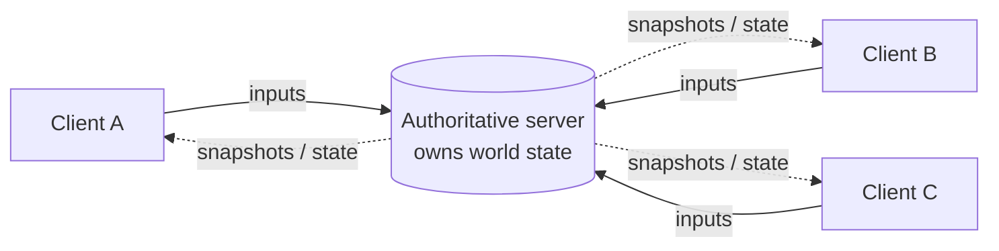
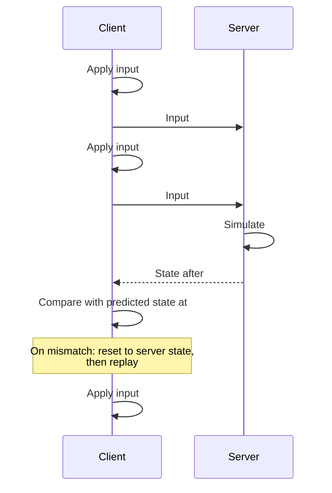
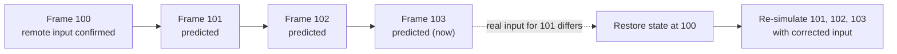
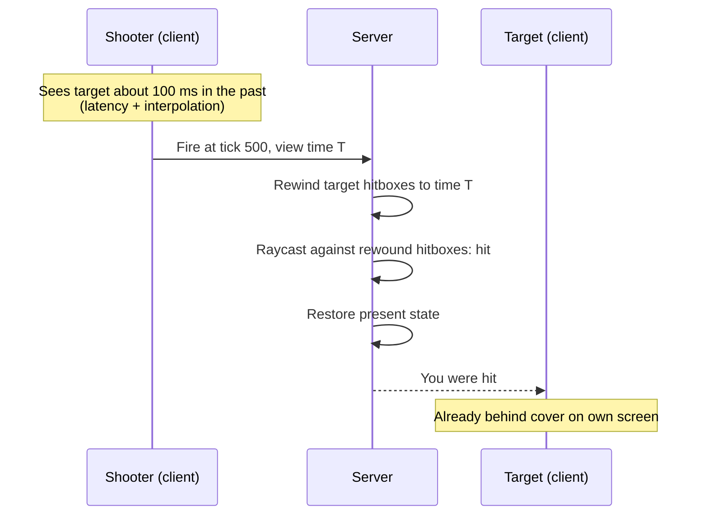
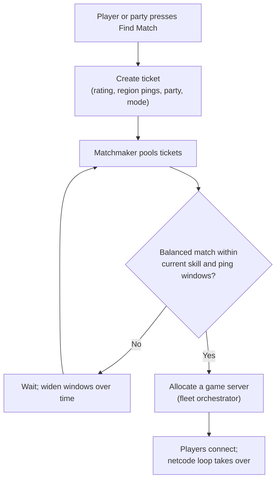

# Multiplayer Networking

[Game Development](./) &raquo; Multiplayer Networking

Multiplayer networking ("netcode") is the problem of keeping several machines in agreement about a shared, fast-changing world when the network between them adds tens to hundreds of milliseconds of delay, drops packets, and delivers them out of order. A single-player game's simulation is simply the truth. An online game has to reconcile what each player *sees* with what an authority decides *happened*, fast enough that controls feel immediate and robustly enough that cheating is hard. This page covers network topologies, the authoritative-server model, client-side prediction and reconciliation, rollback, lag compensation, interpolation of remote entities, replication data models, bandwidth and transport, engine frameworks, cheating, and matchmaking.

Four ideas recur throughout:

- **One authority.** In competitive games the server's simulation is the truth; clients send inputs and *predict*, and the server corrects them.
- **Hide latency; never wait on it.** Round-trip time is bounded by physics. Show the local player an immediate result and repair it when the authoritative answer arrives.
- **Fairness requires rewinding time.** The server evaluates a shot against the world as the shooter saw it, not the world as it is when the packet arrives.
- **Send only what changed and what matters.** Delta-compress against acknowledged state, quantize, and filter by relevance.

## Network Topologies

The first architectural decision is where the authoritative simulation runs.

### Client-Server

Every client talks only to a central **server** that owns the canonical simulation. Clients send inputs up; the server sends state down.

- **Dedicated server.** A headless process in a datacenter with no local player. Standard for competitive and large-scale games (*Counter-Strike 2*, *Valorant*, *Fortnite*).
- **Listen server.** One player's machine also hosts. It costs nothing to operate, but the host has zero latency, can tamper with the simulation, and takes the session down if they leave unless the game supports **host migration**.



A single authority makes cheating hard, keeps state consistent, and scales to large player counts. The costs are at least one round trip before any action becomes "real," which prediction hides, and the expense of running servers.

### Peer-to-Peer

Peers connect directly with no central authority. Two sub-models exist:

- **Deterministic lockstep.** Peers exchange only *inputs*, and each runs the same deterministic simulation. This is the traditional RTS model (*StarCraft*, *Age of Empires*), where streaming the state of thousands of units would be too expensive. It needs bit-exact determinism across machines, and in its basic form every peer waits for the slowest peer's input.
- **Replicated-state P2P.** Peers send state directly. Simpler, but trust is spread across every peer and bandwidth grows with peer count.

A full mesh of $N$ peers has

$$
L = \frac{N(N-1)}{2}
$$

links, and each peer uploads to $N-1$ others. Eight peers need 28 links, so a residential upload connection becomes the bottleneck quickly. P2P also has to traverse NAT (via STUN/ICE-style hole punching, with a relay fallback) and exposes players' IP addresses to each other.

### Relays and Hybrids

Many shipping games mix models. Backend services handle accounts, matchmaking, persistence, and anti-cheat, while gameplay traffic goes over P2P or through **relay servers**. A relay forwards packets without simulating anything, which solves NAT traversal, hides player IP addresses (a DDoS defense), and can route over a private backbone; Valve's Steam Datagram Relay is a prominent example. Fighting games typically run P2P rollback over relays. Unity's Netcode for GameObjects adds a **distributed authority** topology, in which clients each own authority over some objects and a cloud service relays and arbitrates state; it suits cooperative games where server cost matters more than cheat resistance.

### Choosing a Topology

| Criterion | Dedicated server | Listen server | Deterministic lockstep | Replicated P2P |
|-----------|------------------|---------------|------------------------|----------------|
| Cheat resistance | High | Medium (host trusted) | Medium (inputs validated by all; map hacks easy) | Low |
| Latency to act | 1 RTT, hidden by prediction | 0 for host, 1 RTT for others | Input delay, or rollback | About half an RTT per peer |
| Bandwidth | Server fans out state | Host fans out | Tiny (inputs only) | Grows with peers squared |
| Player count | Hundreds or more | Tens | Tens | A handful |
| Operating cost | High | None | Low (relay only) | Low (relay only) |
| Typical genres | FPS, battle royale, MMO | Co-op, casual | RTS, fighting games | Small co-op |

## The Authoritative Server

In an **authoritative** model the server's simulation is correct by definition and each client's view is an optimistic guess the server may overrule. The client never tells the server where it is. It sends intent ("tick 4012: W held, jump pressed"), and the server runs the movement code to decide where the player ends up.

That separation is the foundation of anti-cheat. A client claiming "I am at (9999, 9999) with 999 health" is ignored because the server computes those values itself. What remains are **information cheats** (wallhacks and radar using state the server sent) and **input cheats** (aimbots and triggerbots that send plausible but superhuman input), which need other defenses (see [Cheating and Trust](#cheating-and-trust)).

The server runs a **fixed-timestep** loop:

```python
# Server main loop at a fixed tick rate (e.g. 64 Hz -> 15.625 ms per tick)
while running:
    tick += 1
    for client in clients:
        inputs = client.input_buffer.pop_for_tick(tick)   # buffered, possibly late
        simulate_player(client.player, inputs, TICK_DT)   # server is the physics authority
    run_game_logic(tick)                                   # combat, scoring, pickups
    history.record(tick, world.snapshot())                 # for lag compensation
    for client in clients:
        send_snapshot(client, relevant_state(client), ack=client.last_input_seq)
    sleep_until_next_tick()
```

### Tick Rate

A higher tick rate shrinks the time quantum between client and server, improving hit registration and reducing latency-related artifacts, at a roughly linear cost in CPU and bandwidth. Publicly reported server rates:

| Game | Server tick rate |
|------|------------------|
| *Valorant* | 128 Hz |
| *Counter-Strike 2* | 64 Hz, with sub-tick timestamps on inputs |
| *Overwatch 2* | About 64 Hz |
| *Fortnite* | 30 Hz |
| *Apex Legends*, *Call of Duty: Warzone* | About 20 Hz |
| Many MMOs | 10 to 20 Hz |

*Counter-Strike 2*'s **sub-tick** system stamps each input with the precise moment it happened between ticks, and the server evaluates shots and movement at that moment rather than at the tick boundary. This decouples input precision from tick rate, though the server still simulates and broadcasts at 64 Hz.

Server-side validation also covers input sanity (no impossible speed or turn rate), rate limits, and running the same collision code as the client, so the server never accepts a position inside a wall.

## Client-Side Prediction and Reconciliation

If a client waited a round trip on every key press, a 100 ms ping would mean 100 ms of input lag. **Client-side prediction** runs the same movement code locally and shows the result immediately, then corrects it when the server's answer arrives. This model was popularized by *QuakeWorld* and the Quake 3 and Source engines, and is standard in modern shooters.

### The Loop

1. Each frame, the client samples input, tags it with a **sequence number**, and sends it to the server. Clients usually resend the last few inputs in every packet so a single lost packet does not lose input.
2. The client immediately applies the input to its local predicted state and renders the result.
3. The client keeps each unacknowledged input, and the state it predicted, in a ring buffer.
4. The server processes inputs in order and returns authoritative state stamped with the **last input sequence number it applied**.



### Reconciliation

When a snapshot acknowledges input $n$, the client compares the state it predicted at $n$ with the authoritative state:

- If they match within a tolerance, the prediction was right. Drop buffered inputs up to $n$.
- If they differ (an unpredicted collision, knockback from another player, a server-side slow effect), the client **resets to the authoritative state** and **replays** every input after $n$ to bring the prediction back to the present.

```python
def on_server_state(snapshot):
    # Forget inputs the server has already applied.
    pending.drop_through(snapshot.ack_seq)
    predicted = prediction_history[snapshot.ack_seq]

    if distance(predicted, snapshot.player_state) > EPSILON:
        # Misprediction: adopt the server's state, then replay unacknowledged inputs.
        state = snapshot.player_state.copy()
        for inp in pending:                      # in sequence order
            state = simulate_player(state, inp, TICK_DT)
            prediction_history[inp.seq] = state
        local_player.state = state
        local_player.visual_offset += old_render_pos - state.position  # blend out over a few frames
```

The invariant is that **client and server run identical movement code on the same fixed timestep**. If they diverge (a different gravity constant, a different collision epsilon), reconciliation corrects the player constantly and they "rubber-band." Corrections are applied to the simulation state immediately but smoothed on the rendered model over a few frames so a small error does not look like a teleport. Prediction usually covers only what the local player controls (movement, weapon fire, cooldowns); other players cannot be predicted reliably and are interpolated instead.

## Rollback Netcode

**Rollback** extends prediction to the whole game state and is the standard for modern fighting games, popularized by Tony Cannon's GGPO library (open-sourced under the MIT license in 2019). Each peer:

1. Predicts the remote player's input for the current frame, usually "same as last frame."
2. Simulates immediately with that guess and saves a snapshot of the game state.
3. When the real input for an earlier frame arrives and differs from the guess, **restores** the snapshot from that frame and **re-simulates** every frame up to the present within a single rendered frame.



Rollback needs a **deterministic** simulation and cheap state save and restore, because a misprediction can force several frames to be re-simulated inside one 16.7 ms frame. Most implementations combine a small, fixed **input delay** (one to three frames) with rollback: the delay absorbs part of the latency so rollbacks are shorter and visual corrections rarer. The alternative, pure **delay-based** netcode, waits for remote input before simulating each frame; it never shows corrections, but it feels sluggish and degrades badly with jitter, which is why *Street Fighter 6*, *Tekken 8*, and *Mortal Kombat 1* all ship rollback. Rollback has since spread beyond fighting games, including the RTS *Stormgate*.

## Lag Compensation

Prediction fixes the local player's feel but creates a fairness problem between players. On your screen, an enemy stands in a doorway; you fire. By the time your command reaches the server, the server's copy of the enemy has moved on, so without correction a well-aimed shot misses.

**Lag compensation** (server-side rewind) fixes this. The server keeps a short **history buffer** of every hittable entity's position and hitboxes. When a fire command arrives, the server:

1. Estimates when the shooter saw the world: the command's timestamp, or approximately the current time minus the shooter's one-way latency and their interpolation delay.
2. **Rewinds** relevant entities to their recorded positions at that time.
3. Performs the hit test against the rewound world.
4. Restores the present and applies the result at the current tick.



The rewind amount is roughly

$$
t_{\text{rewind}} \approx t_{\text{one-way}} + t_{\text{interp}}
$$

and is capped (Source's default limit is one second) so a high-ping player cannot shoot far into the past. Many games cap it much lower, or reduce compensation for players above a ping threshold.

The trade-off cannot be avoided. The shooter gets a fair shot, and the target sometimes dies "behind cover" because they were not behind cover on the shooter's screen. When the shooter's and target's views disagree by a round trip, only one can be treated as correct, and most competitive shooters **favor the shooter**, since missing a shot you clearly landed feels worse than occasionally dying late.

### Peeker's Advantage

A related effect is **peeker's advantage**: a player who moves around a corner sees a stationary defender before the defender's client shows the peeker. The gap is roughly the sum of both players' latencies, the interpolation delay, and the server's tick interval. Riot's engineering write-ups for *Valorant* describe shrinking it with 128 Hz servers, minimal interpolation buffering, and a network of regional datacenters and peering to keep round trips low. It can be reduced but never eliminated.

## Interpolation and Extrapolation

Remote entities arrive as discrete snapshots at the server's send rate, far below a 144 Hz display's frame rate. Rendering each snapshot as it arrives looks like stutter and teleporting under packet loss. Two techniques smooth it.

### Entity Interpolation

The client deliberately renders remote entities slightly **in the past**, typically two snapshot intervals behind, so it almost always has a snapshot on each side of the render time. For render time $t$ between snapshots at $t_0$ and $t_1$:

$$
P(t) = P_0 + (P_1 - P_0)\,\frac{t - t_0}{t_1 - t_0}
$$

```python
def remote_position(buffer, now):
    render_time = now - INTERP_DELAY                 # e.g. 2 snapshot intervals
    s0, s1 = buffer.bracket(render_time)             # snapshots either side
    alpha = (render_time - s0.time) / (s1.time - s0.time)
    return lerp(s0.pos, s1.pos, alpha)               # slerp for rotations
```

Linear interpolation shows kinks at snapshot points; if snapshots carry velocity, **cubic Hermite** interpolation between position and velocity pairs gives smooth curves. The interpolation delay (100 ms by default in older Source games at 20 updates per second; much less at high send rates) is a latency-for-smoothness trade: a larger buffer rides out more jitter and loss but shows remote players further behind the present. That delay is exactly what lag compensation must add back when rewinding.

### Extrapolation (Dead Reckoning)

If the next snapshot is late or lost, there is nothing to interpolate toward, so the client **extrapolates** from the last known velocity and acceleration:

$$
P(t) = P_0 + v_0\,(t - t_0) + \frac{1}{2}\,a_0\,(t - t_0)^2
$$

Dead reckoning keeps motion fluid through short gaps but is wrong whenever the entity changes direction, so it is limited to a short window (typically 100 to 250 ms) and corrected by blending toward fresh data rather than snapping. Games dominated by inertia, such as vehicle or flight games, can extrapolate much more reliably than twitchy character shooters.

| | Interpolation | Extrapolation |
|---|---|---|
| Uses | Two past snapshots | Last snapshot plus velocity |
| Accuracy | Exact at snapshot points | Wrong when motion changes |
| Cost | Fixed display delay | Visible corrections |
| Used when | Normal operation | Late or missing snapshots |

## Replication Data Models

There are three main ways to move game state across the network, and most games use all three.

### Snapshots and Delta Compression

A **snapshot** is the relevant world state at one tick: positions, rotations, health, animation state. Full snapshots are simple but expensive, so servers **delta-compress** each snapshot against the last one the client **acknowledged**:

```
Client acked tick 100:  {p1: full, p2: full, p3: full}
Snapshot 103 vs 100:    {p2: pos}                     # p1, p3 unchanged
Snapshot 104 vs 100:    {p1: health, p2: pos, p3: pos} # 103 not yet acked
```

Because each delta is relative to state the client is known to have, a lost packet only makes the next delta larger; it never corrupts state. This is the Quake 3 and Source model, and it pairs naturally with interpolation.

### Property Replication

Engine frameworks let you mark variables as **replicated**. The server tracks which have changed and sends updates to clients for which the object is relevant. It is per-property delta compression with good ergonomics, and it is the dominant model in commercial engines:

```cpp
// Unreal Engine: replicated property with a change callback
UPROPERTY(ReplicatedUsing = OnRep_Health)
float Health;

void AMyCharacter::GetLifetimeReplicatedProps(TArray<FLifetimeProperty>& OutLifetimeProps) const
{
    Super::GetLifetimeReplicatedProps(OutLifetimeProps);
    DOREPLIFETIME(AMyCharacter, Health);
}
```

Replicated properties are eventually consistent: a client sees the latest value, not necessarily every intermediate value.

### Remote Procedure Calls

An **RPC** is a one-shot event: "play this impact effect," "round over," "request to open this door." Replicated state describes *what is*; RPCs describe *what happened*. Directions are client-to-server (a request, always validated), server-to-client (a notification), and multicast (server to all relevant clients).

| Model | Describes | Behavior on packet loss | Best for |
|-------|-----------|-------------------------|----------|
| Snapshot / delta | Continuous world state | Self-healing via acked baseline | Positions, physics, many entities |
| Property replication | Per-object values | Engine resends latest value | Health, ammo, score, door state |
| RPC / event | Discrete events | Must be sent reliably if important | Round events, ability triggers, cosmetic effects |

Important RPCs travel on a **reliable, ordered** channel, since a lost "you died" is unacceptable. Snapshots travel **unreliably**, since a lost position update is superseded by the next one a few milliseconds later. This per-message choice is why games build their own protocols on UDP.

## Bandwidth and Transport

### Transport

Real-time games use **UDP** almost universally. TCP delivers everything in order, so one lost packet causes **head-of-line blocking**: all later data waits for the retransmission, which is wrong for a stream where only the newest position matters. Game protocols add their own sequencing, acknowledgement, selective reliability, fragmentation, and encryption on top of UDP; examples include ENet, Valve's GameNetworkingSockets, and the transport layers inside Unreal and Unity.

Browser games cannot open raw UDP sockets. They use **WebRTC data channels** (unreliable, unordered modes; mainly P2P) or **WebTransport** over HTTP/3, whose QUIC datagrams give UDP-like unreliable delivery to a server. WebSockets run over TCP and inherit head-of-line blocking. See [Network & I/O Optimization](../optimization/network-io-optimization.html) for a deeper protocol comparison.

### Budgeting Bandwidth

Bandwidth per client scales with send rate, the number of relevant entities, and bytes per entity:

$$
\text{bandwidth} \approx f_{\text{send}} \times N_{\text{entities}} \times B_{\text{entity}}
$$

At 60 snapshots a second, 20 visible entities, and 12 bytes each, that is about 14 KB/s (115 kbit/s) before headers, which is fine for one client but significant for a server with 100 clients. The main tools:

- **Quantization.** A position on a 2 km map at 1 cm precision needs about 18 bits per axis instead of a 32-bit float. Rotations are sent as "smallest three" quaternions: drop the largest component, which can be reconstructed, and quantize the other three to 9 to 10 bits each.
- **Relevancy (area of interest).** Only send entities a client can plausibly perceive, by distance, line of sight, or spatial grid.
- **Prioritization.** Under a per-packet byte budget, send the most important entities first (nearby, recently changed, shooting at you) and let others accumulate priority until they are sent.
- **Variable send rates.** Distant or idle entities update less often.

Relevancy filtering is also an anti-cheat measure: state the server never sends cannot be displayed by a wallhack.

### Trade-Offs

Every netcode decision trades latency, bandwidth, CPU, and consistency against each other, and the right point depends on genre:

- **Prediction versus determinism.** Prediction and reconciliation (shooters) hide local latency and tolerate floating-point differences. Lockstep and rollback (RTS, fighting games) use tiny bandwidth but demand bit-exact determinism, which rules out non-deterministic physics and careless floating-point use.
- **Authority placement.** Full server authority maximizes cheat resistance at the cost of server spend. Client authority over its own movement is cheaper and more responsive but trusts the client. The common split: the server is authoritative over anything that affects other players (damage, scoring, pickups), and clients are authoritative over purely cosmetic state.
- **Tick and send rate.** Higher rates improve responsiveness and hit registration and cost CPU and bandwidth linearly.

## Engine Frameworks and Services

| Framework | Model | Notes |
|-----------|-------|-------|
| Unreal Engine replication | Server-authoritative property replication plus RPCs; relevancy and priority per actor | Character movement has built-in prediction; the **Iris** replication system (opt-in, still marked experimental in the UE 5 docs) targets larger worlds and player counts |
| Unity Netcode for GameObjects | Server-authoritative, host, or distributed authority | Aimed at casual and co-op games; prediction is left to the developer |
| Unity Netcode for Entities | ECS-based, server-authoritative | Built-in client prediction, interpolation, and lag compensation for competitive games |
| Godot high-level multiplayer | `MultiplayerSpawner` and `MultiplayerSynchronizer` nodes, RPCs | Transports include ENet, WebSocket, and WebRTC |
| Photon Fusion / Photon Quantum | Fusion: state transfer with prediction; Quantum: deterministic rollback | Commercial, hosted relay infrastructure |
| GGPO and derivatives | Deterministic P2P rollback | Common in fighting games and emulators |

For dedicated-server fleets, **Agones** (an open-source, Kubernetes-based game-server orchestrator), Amazon GameLift, and similar services allocate and autoscale server instances; see [Kubernetes](../technology/kubernetes/) for the underlying orchestration model.

## Cheating and Trust

Server authority removes the largest class of cheats, but not all of them:

| Cheat | Defense |
|-------|---------|
| Speed, teleport, and god-mode hacks | Server authority: simulate, never trust client state |
| Wallhacks and radar | Relevancy and visibility culling on the server (do not send hidden enemies) |
| Aimbots and triggerbots | Behavioral and statistical detection; client anti-cheat |
| Lag switching | Cap lag-compensation windows; penalize or drop inputs that arrive very late |
| Packet tampering and replay | Encryption, sequence numbers, session keys |
| DDoS against hosts | Dedicated servers or relays that hide player IP addresses |

Client-side anti-cheat (Easy Anti-Cheat, BattlEye, Riot Vanguard, and others) inspects the local machine for known cheat software; several run kernel-mode drivers, which is effective against sophisticated cheats but controversial for security and privacy reasons. It complements server authority rather than replacing it.

## Matchmaking

Before any gameplay runs, players have to be grouped into sessions and assigned to servers. A matchmaker balances three competing goals:

- **Skill balance.** A rating system estimates each player's skill and pairs players with similar ratings (see below).
- **Connection quality.** Choose the datacenter that minimizes the worst ping in the lobby. This conflicts with skill balance: a perfectly skill-matched lobby spread across three continents plays worse than a looser one in one region.
- **Queue time.** Tighter skill and ping windows mean fewer eligible opponents and longer waits, so matchmakers widen the windows as a ticket waits.

### Rating Systems

**Elo** tracks a single number per player. **Glicko-2** adds a rating deviation (uncertainty) and volatility, so new or returning players move quickly and established ones slowly. Microsoft's **TrueSkill** and **TrueSkill 2** model team games with a Bayesian skill distribution per player, and **OpenSkill** provides open-source implementations of similar models. Elo's expected score for player A against player B is

$$
E_A = \frac{1}{1 + 10^{(R_B - R_A)/400}}
$$

and after a game A's rating changes by $K(S_A - E_A)$, where $S_A$ is the actual result (1, 0.5, or 0) and $K$ sets the step size. An upset therefore moves ratings more than an expected result.

### Pipeline



At scale, matchmaking also handles **parties** (a coordinated group of five should face comparable coordination), **backfill** (filling slots left by leavers), **role queues**, and **server allocation** tied to queue depth. Open-source components such as Open Match (matchmaking logic) and Agones (server allocation) implement this pipeline on Kubernetes.

## Further Reading

- Gabriel Gambetta, *Fast-Paced Multiplayer* series (gabrielgambetta.com): client prediction, reconciliation, interpolation, and lag compensation with live demos.
- Glenn Fiedler, *Gaffer On Games* (gafferongames.com): UDP reliability, snapshot compression, and deterministic lockstep.
- Valve Developer Community, *Source Multiplayer Networking* and *Latency Compensating Methods in Client/Server In-game Protocol Design and Optimization* (Yahn Bernier, 2001).
- Timothy Ford, *Overwatch Gameplay Architecture and Netcode* (GDC 2017).

## See Also

- [Game Development](./) - Section hub: engines, core systems, and design principles
- [Monetization & Business Models](monetization.html) - The live-service business that server infrastructure supports
- [Testing & QA](testing-qa.html) - Replay and determinism tests, soak and load testing for servers
- [Network & I/O Optimization](../optimization/network-io-optimization.html) - UDP, QUIC, and TCP trade-offs, batching, and zero-copy I/O
- [Networking Fundamentals](../technology/networking/) - Packets, protocols, and NAT beneath game transports
- [Game AI](../ai-ml/game-ai.html) - Server-side behavior that must stay deterministic and authoritative
- [Distributed Systems Theory](../advanced/distributed-systems-theory/) - Consistency, latency, and coordination foundations
