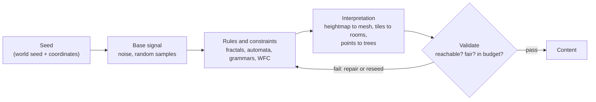
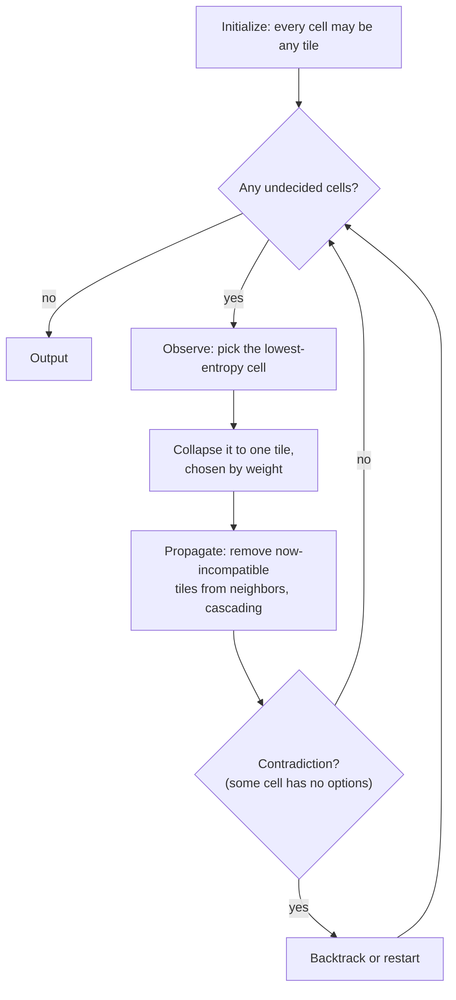
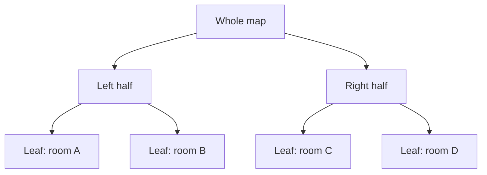

# Procedural Content Generation

[Game Development](./) &raquo; Procedural Content Generation

Procedural content generation (PCG) is the algorithmic creation of game content (terrain, dungeons, textures, vegetation, object placement, items, quests) instead of, or alongside, authoring it by hand. It trades direct control for variety, replayability, and scale: a seed and a few kilobytes of code can expand into a planet. The craft is choosing algorithms whose *statistical* output is controllable enough to be fun and varied enough to stay interesting. This page covers seeding and determinism, coherent noise and fractal terrain, erosion and biomes, point distribution, cellular automata, L-systems, wave function collapse, dungeon generation, techniques for steering randomness, machine-learning approaches, and production tooling.

Most generators follow the same pipeline: a seed drives a base signal (noise or random samples), rules shape it into structure, the result is interpreted as playable content, and a validation step rejects or repairs anything unplayable.



## Why Generate Content

| Goal | What PCG provides | Examples |
|------|-------------------|----------|
| Replayability | A different layout every run | *Spelunky*, *The Binding of Isaac*, *Dead Cells*, roguelikes generally |
| Scale | More content than could be authored | *Minecraft*, *No Man's Sky*, *Elite Dangerous* |
| Compression | Tiny data expands into large worlds | *.kkrieger* (a 96 KB 3D shooter, 2004), the demoscene |
| Variety | Non-repeating textures, foliage, crowds | SpeedTree, Substance Designer, Houdini pipelines |
| Production speed | Artists direct generators instead of placing every asset | Unreal PCG Framework, Houdini Engine scattering |
| Adaptivity | Content tuned to the player at runtime | Director systems, mission generators |

The central tension is **control versus randomness**. Pure randomness has unlimited variety and no meaning; pure authoring has meaning and no variety. PCG sits between them, shaping randomness with structure and constraints. Many successful games mix the two: *Spelunky* and *Dead Cells* assemble hand-authored rooms or tiles along procedurally chosen layouts, keeping local quality high while varying the whole.

## Seeding and Determinism

A **pseudo-random number generator (PRNG)** maps an integer seed deterministically to a stream of numbers. The same seed reproduces the same stream, which makes seed codes shareable between players and generation bugs reproducible.

### Choosing a PRNG

C's `rand()` and many language defaults are poor choices: short periods, weak low bits, and hidden global state shared with the rest of the program. Generators need an explicit, fast, well-distributed PRNG whose state you own. Common choices are the **PCG** family (permuted congruential generators), **xoshiro256\*\*** / **xoshiro128+**, and **SplitMix64**, which is also used to seed the others:

```python
MASK64 = (1 << 64) - 1

def splitmix64(state):
    """One SplitMix64 step. Returns (random_u64, new_state)."""
    state = (state + 0x9E3779B97F4A7C15) & MASK64
    z = state
    z = ((z ^ (z >> 30)) * 0xBF58476D1CE4E5B9) & MASK64
    z = ((z ^ (z >> 27)) * 0x94D049BB133111EB) & MASK64
    return z ^ (z >> 31), state
```

The same algorithm must run on every platform. C++ `std::mt19937` is fully specified, but `std::uniform_int_distribution` and the other standard distributions are implementation-defined, so the same seed can give different results on different standard libraries. Write your own range mapping when results must match across platforms.

### Positional (Hierarchical) Seeding

Large worlds need **positional determinism**: chunk (10, 7) must generate identically whether it is visited first or last. Rather than drawing from one sequential stream, derive each chunk's or feature's seed by **hashing the world seed together with its coordinates**, then run a local PRNG from that seed:

```python
def mix64(z):
    """SplitMix64 finalizer: a strong 64-bit integer hash."""
    z = ((z ^ (z >> 30)) * 0xBF58476D1CE4E5B9) & MASK64
    z = ((z ^ (z >> 27)) * 0x94D049BB133111EB) & MASK64
    return z ^ (z >> 31)

def position_seed(world_seed, x, y, salt=0):
    h = mix64(world_seed ^ salt)
    h = mix64(h ^ (x & MASK64))
    h = mix64(h ^ (y & MASK64))
    return h
```

The `salt` separates independent decisions at the same position (terrain, ore, vegetation), so changing how trees are placed does not reshuffle every ore deposit. This gives **order-independent, position-addressable** randomness: whether a feature exists at a location can be decided by hashing its coordinates, without generating its neighbors. Coordinate hashes are also the basis of the noise functions below.

Avoid ad-hoc combiners such as `h ^= v + 0x9e3779b9 + (h << 6) + (h >> 2)` (from Boost's `hash_combine`) for this purpose: they are designed for hash tables, not statistical quality, and produce visible correlations between neighboring coordinates.

### Determinism Pitfalls

- **Floating point.** Results can differ across CPUs, compilers, and flags (x87 versus SSE, fused multiply-add contraction, `-ffast-math`, transcendental functions in different math libraries). Where results must match exactly, such as lockstep multiplayer or shared seeds across platforms, use integer or fixed-point math, or pin compiler floating-point behavior and avoid platform `sin`/`exp`.
- **Iteration order.** Iterating a hash map or set in unspecified order desynchronizes generation. Sort, or use ordered containers.
- **Conditional consumption.** If one branch draws random numbers and another does not, every later draw shifts. Use a separate stream per feature (positional seeding makes this natural).
- **Parallelism.** Threads drawing from a shared generator produce schedule-dependent results. Give each job its own seeded stream.
- **Version drift.** Changing any generator code changes what existing seeds produce, which is why a *Minecraft* seed gives a different world after a major terrain update. Games that promise stable seeds must keep old generator versions available.

## Noise Functions

**Coherent noise** is a function $\text{noise}(x, y, \ldots)$ that looks random but is smooth: nearby inputs give nearby outputs. The smoothness makes it usable as terrain height, density, or texture without single-sample spikes.

### Value Noise

Assign a pseudo-random value to each integer lattice point (by hashing its coordinates) and interpolate between them:

```python
def value_noise_1d(x, seed):
    x0 = math.floor(x)
    t = x - x0
    v0 = hash_to_unit(x0, seed)        # deterministic value in [0, 1)
    v1 = hash_to_unit(x0 + 1, seed)
    return lerp(v0, v1, fade(t))
```

The interpolation curve matters. Linear interpolation leaves visible creases at lattice lines because the derivative is discontinuous there. The cubic smoothstep makes the first derivative continuous:

$$
s(t) = 3t^2 - 2t^3
$$

Perlin's quintic fade also makes the second derivative continuous, which matters when normals or lighting are derived from the height field:

$$
s(t) = 6t^5 - 15t^4 + 10t^3
$$

Value noise is cheap but blobby, with features visibly aligned to the grid.

### Perlin (Gradient) Noise

Perlin noise (Ken Perlin, 1985; "improved noise," 2002) stores a pseudo-random **gradient vector** at each lattice point instead of a value. Each corner contributes the dot product of its gradient with the offset from that corner to the sample point, and the contributions are blended with the fade curve. For a 2D sample $p$ in a cell with corners $c$:

$$
n_c = g(c) \cdot (p - c)
$$

$$
n(p) = \text{lerp}\big(\text{lerp}(n_{00}, n_{10}, s(u)),\ \text{lerp}(n_{01}, n_{11}, s(u)),\ s(v)\big)
$$

where $u, v$ are the fractional coordinates within the cell. Noise is exactly zero at every lattice point, which removes value noise's blobs and gives features a more consistent size, but a slight **axis-aligned bias** remains.

```python
def perlin2d(x, y, perm, grad):
    xi, yi = math.floor(x) & 255, math.floor(y) & 255
    xf, yf = x - math.floor(x), y - math.floor(y)
    u, v = fade(xf), fade(yf)                     # quintic fade

    # perm is a shuffled 0..255 table repeated twice (512 entries)
    aa = perm[perm[xi] + yi]
    ab = perm[perm[xi] + yi + 1]
    ba = perm[perm[xi + 1] + yi]
    bb = perm[perm[xi + 1] + yi + 1]

    n00 = dot(grad[aa % len(grad)], (xf,     yf))
    n10 = dot(grad[ba % len(grad)], (xf - 1, yf))
    n01 = dot(grad[ab % len(grad)], (xf,     yf - 1))
    n11 = dot(grad[bb % len(grad)], (xf - 1, yf - 1))

    return lerp(lerp(n00, n10, u), lerp(n01, n11, u), v)   # roughly in [-0.7, 0.7] in 2D
```

The permutation table repeats every 256 units; hashing coordinates with a function like `mix64` instead gives a non-repeating domain and lets the seed change the pattern.

### Simplex and OpenSimplex2

Simplex noise (Perlin, 2001) tessellates space into **simplices** (triangles in 2D, tetrahedra in 3D) instead of hypercubes. An $n$-dimensional hypercube has $2^n$ corners; a simplex has $n + 1$:

$$
\text{corners}_{\text{Perlin}} = 2^n \qquad \text{corners}_{\text{simplex}} = n + 1
$$

That is 8 versus 4 corners in 3D and 16 versus 5 in 4D. Each corner's contribution is a radially symmetric kernel rather than a separable interpolation, which removes the axis-aligned bias and gives a continuous gradient everywhere:

$$
n(p) = \sum_{i} \max\!\big(0,\ r^2 - \lVert d_i \rVert^2\big)^4 \,\big(g_i \cdot d_i\big)
$$

where $d_i$ is the offset from corner $i$ to the sample, $g_i$ is that corner's gradient, and $r^2$ is the kernel radius (0.5 in common 2D implementations).

The US patent on simplex noise for 3D and higher texture synthesis (US 6,867,776) expired on 8 January 2022, so the old licensing concern is gone. **OpenSimplex2** (by K.jpg), created as an unencumbered alternative, remains a popular choice for its quality, and libraries such as **FastNoiseLite** provide Perlin, value, OpenSimplex2, cellular noise, fractals, and domain warping behind one API in many languages, including GPU shader ports.

### Worley (Cellular) Noise

Worley noise scatters feature points, typically one jittered point per grid cell, and returns the distance from the sample to the nearest ones, searching the surrounding 3x3 cells in 2D:

$$
F_1(p) = \min_{i} \lVert p - q_i \rVert
$$

$F_1$ gives a cellular Voronoi look; $F_2 - F_1$ (second-nearest minus nearest) gives crack and vein patterns. It is used for stone, scales, caustics, cracked mud, and partitioning a world into regions such as biomes or territories.

### Comparison

| Property | Value | Perlin | Simplex / OpenSimplex2 | Worley |
|----------|-------|--------|------------------------|--------|
| Corners or points per sample | $2^n$ values | $2^n$ gradients | $n+1$ gradients | $3^n$ cells searched |
| Look | Blobby, grid-aligned | Good, slight axis bias | Isotropic | Cellular, crystalline |
| Gradient continuity | Depends on fade | Continuous with quintic fade | Continuous everywhere | Discontinuous at cell edges |
| Typical use | Cheap effects | General 2D and 3D terrain | 3D/4D, animated noise, normals | Stone, cracks, regions |

## Fractal Noise and Terrain

One octave of noise has a single characteristic feature size. Real terrain has detail at every scale, from mountain ranges down to gravel. **Fractional Brownian motion (fBm)** sums octaves of the same noise at increasing frequency and decreasing amplitude:

$$
f(p) = \sum_{i=0}^{N-1} g^{\,i}\, \text{noise}\!\big(\ell^{\,i}\, p\big)
$$

- **Lacunarity** $\ell$ multiplies frequency per octave (typically 2).
- **Gain** or persistence $g$ multiplies amplitude per octave (typically 0.5). Lower gain gives smoother terrain; higher gain gives rougher.

Gain and lacunarity together set the self-similarity of the result. Writing $g = \ell^{-H}$ defines the Hurst exponent $H$; the common choice $\ell = 2, g = 0.5$ gives $H = 1$, which produces natural-looking terrain. The maximum amplitude is bounded by a geometric series, which is why implementations normalize by the sum of amplitudes:

$$
\sum_{i=0}^{N-1} g^{\,i} = \frac{1 - g^N}{1 - g}
$$

```python
def fbm(x, y, octaves=6, lacunarity=2.0, gain=0.5):
    amplitude, frequency, total, norm = 1.0, 1.0, 0.0, 0.0
    for i in range(octaves):
        # Offset each octave so lattice artifacts do not line up.
        total += amplitude * noise(x * frequency + 17.3 * i, y * frequency - 9.1 * i)
        norm += amplitude
        amplitude *= gain
        frequency *= lacunarity
    return total / norm
```

Variations give characteristic landforms:

- **Ridged multifractal.** Use $1 - \lvert \text{noise} \rvert$ per octave (often squared) to turn rounded hills into sharp ridges. Good for mountain ranges.
- **Billow.** Use $\lvert \text{noise} \rvert$ for puffy, rolling shapes such as clouds and dunes.
- **Domain warping.** Offset the input coordinates by another noise field, $f(p + k \cdot \text{fbm}(p))$, for flowing, folded, marbled structure that plain fBm cannot produce.

### Shaping a Heightmap

A heightmap $h(x, y)$ is usually built from several fields at different scales, each with a job:

```python
def terrain_height(x, y):
    continent = fbm(x * 0.0005, y * 0.0005, octaves=4)           # land vs. ocean, large scale
    land = smoothstep(-0.05, 0.1, continent)                    # coastline mask
    mountains = ridged_fbm(x * 0.004, y * 0.004, octaves=6)
    mountain_mask = smoothstep(0.3, 0.6, fbm(x * 0.001, y * 0.001, octaves=3))
    detail = fbm(x * 0.05, y * 0.05, octaves=3)

    h = -200 + land * (220 + mountains * mountain_mask * 900) + detail * 8
    return h
```

Common shaping steps:

- **Masks.** Low-frequency fields decide where land, mountains, or plateaus occur, so high-frequency detail is applied only where wanted.
- **Falloff maps.** For islands, subtract a radial gradient so edges drop into the ocean.
- **Redistribution.** Raising normalized height to a power, $h' = h^k$ with $k > 1$, flattens lowlands and sharpens peaks.
- **Curves or splines.** Map noise values through artist-edited curves instead of formulas. *Minecraft* has done this since version 1.18, driving terrain height from splines over several noise parameters.

### Erosion

Noise terrain looks unweathered: slopes are uniform and there are no drainage networks. Erosion simulation is the single largest quality improvement.

- **Hydraulic erosion.** Simulate water picking up sediment on steep, fast descents and depositing it where it slows. The common particle ("droplet") method releases many droplets that follow the gradient downhill, carrying sediment up to a capacity proportional to speed and slope, and depositing the excess. Grid-based pipe models simulate water flow per cell and parallelize well on GPUs.
- **Thermal erosion.** Material slides downhill wherever the slope exceeds a talus angle, producing scree slopes and softened cliffs.

Erosion is expensive and non-local (a droplet can travel far), which conflicts with independent chunk generation. Games often erode a coarse world-scale map offline or at load time and add local detail on top, or approximate erosion with cheaper noise tricks such as analytical-derivative noise that dampens detail on steep slopes.

### Biomes

The classic approach is a lookup on two more noise fields, **temperature** and **moisture**, following the Whittaker diagram from ecology:

```python
def biome(temperature, moisture):
    if moisture < 0.2:
        return DESERT if temperature > 0.6 else TUNDRA
    if temperature > 0.7:
        return RAINFOREST if moisture > 0.6 else SAVANNA
    if temperature > 0.4:
        return FOREST if moisture > 0.4 else GRASSLAND
    return TAIGA if moisture > 0.4 else SNOW
```

*Minecraft* since 1.18 generalizes this into a **multi-noise** system. Each position samples several noise parameters: temperature, humidity, **continentalness** (ocean to inland), **erosion** (flat to mountainous), **weirdness** (which also yields a "peaks and valleys" value), and depth. Each biome is defined as a region in that parameter space, and the position takes the nearest biome. The terrain-shaping parameters also drive height, so biomes and landforms stay correlated (peaks biomes appear on peaks) without being rigidly coupled.

### Chunking and Infinite Worlds

Open worlds generate in **chunks** on demand, seeded by chunk coordinates (see [Positional Seeding](#positional-hierarchical-seeding)). Because the height function is a deterministic function of world position, neighboring chunks evaluate the same continuous field and their edges match without stitching. Features that cross chunk borders, such as trees, structures, and rivers, are handled by generating them in a larger region than the chunk and keeping only the part inside, or by deciding them on a coarser grid that each chunk can query. Very large worlds also need **floating-origin** rendering or double-precision positions, because 32-bit floats lose centimeter precision a few tens of kilometers from the origin.

## Point Distribution and Object Placement

Placing trees, rocks, and loot needs points that are random but not clumped. Independent uniform samples clump and leave gaps; a jittered grid looks regular. **Poisson disk sampling** produces points no closer than a minimum distance $r$ while filling space evenly, the "blue noise" distribution seen in natural spacing. Bridson's algorithm (2007) does this in linear time:

```python
def poisson_disk(width, height, r, k, rng):
    cell = r / math.sqrt(2)                     # each grid cell holds at most one point
    grid = {}
    first = (rng.uniform(0, width), rng.uniform(0, height))
    points, active = [first], [first]
    grid[(int(first[0] // cell), int(first[1] // cell))] = first
    while active:
        i = rng.randrange(len(active))
        px, py = active[i]
        for _ in range(k):                      # k candidates, typically 30
            a = rng.uniform(0, 2 * math.pi)
            d = rng.uniform(r, 2 * r)           # annulus between r and 2r
            q = (px + d * math.cos(a), py + d * math.sin(a))
            if in_bounds(q, width, height) and far_from_neighbors(q, grid, cell, r):
                points.append(q); active.append(q)
                grid[(int(q[0] // cell), int(q[1] // cell))] = q
                break
        else:
            active.pop(i)                       # no valid candidate: retire this point
    return points
```

In production, placement is usually a chain of filters over candidate points: sample, reject by slope, altitude, or biome, thin by density maps painted by artists, then enforce spacing between asset types. Unreal's PCG Framework and Houdini scattering tools are built around exactly this point-processing model.

## Cellular Automata

A **cellular automaton** (CA) is a grid of cells whose next state depends on its current state and its neighbors'. Simple local rules produce coherent global structure, which makes CAs cheap generators for caves and organic regions. The general update rule is

$$
c_{t+1}(x) = R\Big(c_t(x),\ \sum_{j \in N(x)} c_t(j)\Big)
$$

where $N(x)$ is the neighborhood and $R$ the transition rule. Conway's Game of Life is the best-known example (a live cell survives with 2 or 3 live neighbors; a dead cell is born with exactly 3).

### Cave Generation

Fill a grid randomly with wall and floor, then repeatedly apply a smoothing rule that takes a majority vote over the 8-cell Moore neighborhood:

```python
def generate_cave(width, height, fill_prob, iterations, rng):
    grid = [[1 if rng.random() < fill_prob else 0 for _ in range(width)]
            for _ in range(height)]
    for _ in range(iterations):
        new = [[0] * width for _ in range(height)]
        for y in range(height):
            for x in range(width):
                walls = count_wall_neighbors(grid, x, y)   # out-of-bounds counts as wall
                if walls > 4:
                    new[y][x] = 1
                elif walls < 4:
                    new[y][x] = 0
                else:
                    new[y][x] = grid[y][x]
        grid = new
    return grid
```

A fill probability around 0.45 with 4 to 5 iterations is a common starting point. Raw output usually contains disconnected pockets, so **post-processing is required**: flood-fill to find connected regions, keep the largest (or carve tunnels to join the others), and fill the rest. Only then is the cave guaranteed to be traversable.

## L-Systems

**Lindenmayer systems** are parallel rewriting grammars introduced by Aristid Lindenmayer (1968) to model plant growth. Start from an **axiom**, rewrite every symbol simultaneously using **production rules** for several generations, then interpret the resulting string as **turtle-graphics** commands:

```
Axiom:  X
Rules:  X -> F+[[X]-X]-F[-FX]+X
        F -> FF
Angle:  25 degrees

F  draw forward        +  turn left by the angle
[  push position and heading onto a stack
]  pop position and heading       -  turn right by the angle
```

Each `[ ... ]` pair is a branch: save the turtle state, draw the sub-branch, and return to the trunk.

```python
def expand(axiom, rules, generations):
    s = axiom
    for _ in range(generations):
        s = "".join(rules.get(ch, ch) for ch in s)   # parallel rewrite
    return s
```

Variants increase realism:

- **Stochastic** L-systems choose among several productions by probability, so every plant differs (seed the choice for determinism).
- **Context-sensitive** rules fire only given particular neighbors, modeling signals traveling through the plant.
- **Parametric** symbols carry values such as length, width, and age, allowing tapering and continuous growth.

L-systems suit self-similar branching: plants, rivers, lightning, and road networks. For trees that respond to their surroundings, the **space colonization** algorithm (Runions et al., 2007) is a common alternative: scatter attraction points in the crown volume and grow branches toward them, which fills space naturally and avoids self-intersection. Production tools such as SpeedTree combine rule-based growth with artist control.

## Wave Function Collapse

**Wave function collapse** (WFC) is a constraint-solving generator that produces output locally similar to an example or consistent with tile adjacency rules. Maxim Gumin published it in 2016, building on Paul Merrell's earlier **model synthesis** (2007). The name is an analogy: every cell starts in a "superposition" of all possible tiles, and the algorithm repeatedly collapses one cell to a single tile and propagates the consequences.

There are two common modes:

- **Simple tiled model.** Tiles and their allowed neighbors are authored explicitly.
- **Overlapping model.** All $N \times N$ patterns (commonly 3x3) are extracted from a sample image, and adjacency is inferred from how patterns overlap. One small bitmap is enough input.



The "most constrained" cell is chosen by Shannon entropy over its remaining tiles $D$ with weights $w_t$:

$$
H = -\sum_{t \in D} p_t \log p_t, \qquad p_t = \frac{w_t}{\sum_{u \in D} w_u}
$$

Collapsing low-entropy cells first reduces the chance of contradictions, in the same way a Sudoku solver fills the most constrained square first.

```python
def wfc_step(grid, rng):
    cell = min_entropy_cell(grid)            # undecided cell with fewest options (ties broken randomly)
    if cell is None:
        return DONE
    cell.collapse_to(weighted_choice(cell.options, rng))
    if not propagate(grid, cell):            # arc-consistency style pruning
        return CONTRADICTION                 # backtrack or restart
    return CONTINUE
```

WFC is used in *Townscaper*, *Bad North*, and *Caves of Qud*, and suits tile-based content with strong local rules: towns, dungeon rooms, pipe and circuit layouts, and texture synthesis. Its limitations:

- **Only local guarantees.** Adjacency rules do not ensure a path from entrance to exit. Pre-place key tiles (start, exit, paths) as fixed constraints, or verify connectivity afterwards.
- **Contradictions.** Dense rule sets make the solver fail and restart. Backtracking, better tile sets, and generating in overlapping chunks (as model synthesis does) help.
- **Scale.** Propagation over large grids is expensive and output tends to lack large-scale structure. Hierarchical or chunked WFC, or seeding the grid with a coarse layout from another method, addresses both.

## Dungeon Generation

Dungeons must be **playable**: connected, fair, and paced. Several families of generators dominate.

| Method | Output character | Connectivity | Design control |
|--------|------------------|--------------|----------------|
| Room templates on a grid | Hand-made rooms, varied arrangement | Guaranteed by a solution path | High locally |
| Rooms plus graph (Delaunay, MST) | Scattered rooms, natural corridors | Guaranteed by the spanning tree | Medium |
| BSP partitioning | Evenly distributed rectangular rooms | Guaranteed by the tree | Medium |
| Random walk, cellular automata | Organic caves | Needs post-processing | Low |
| Mission graphs (graph grammars) | Structured progression | Guaranteed by construction | High globally |

### Room Templates

*Spelunky* divides each level into a 4x4 grid of rooms. It first walks a random path from a top-row entrance to a bottom-row exit, marking the rooms it passes through as types with the openings the path needs. Each room is then filled from a pool of hand-authored templates for that type, with random chunks varied inside. A solution path is guaranteed and each room still looks designed. *Dead Cells* and *The Binding of Isaac* use related template-over-layout approaches.

### Rooms and Graphs

Scatter rectangular rooms and reject or separate overlaps, then decide connections as a graph problem:

1. **Delaunay-triangulate** room centers to get candidate connections between neighboring rooms.
2. Take a **minimum spanning tree** of that graph, which guarantees every room is reachable.
3. **Add back** a fraction (for example 10 to 15%) of the remaining Delaunay edges to create loops, so the dungeon is not a pure tree with only dead ends.
4. Carve L-shaped or pathfound corridors along the chosen edges.

This approach was popularized by the developer of *TinyKeep*.

```python
def generate_dungeon(rng):
    rooms = place_non_overlapping_rooms(rng)
    candidates = delaunay(centers(rooms))
    corridors = minimum_spanning_tree(candidates)
    extras = [e for e in candidates if e not in corridors]
    corridors += rng.sample(extras, k=int(0.15 * len(extras)))   # loops
    carve(rooms, corridors)
    return rooms, corridors
```

### BSP Partitioning

**Binary space partitioning** recursively splits the map rectangle, alternating roughly between horizontal and vertical cuts, until cells reach a target size. Each leaf gets a room, and each internal node connects its two children, so the tree structure guarantees connectivity and spreads rooms evenly.



Siblings are joined first (A with B, C with D), then the two subtrees are joined through any pair of their rooms.

### Random Walks and Caves

For organic layouts, carve floor with a **drunkard's walk** (a random walk that turns cells to floor) until a target floor percentage is reached, or use the [cellular-automata method](#cave-generation). Both need connectivity post-processing, and multiple walkers or biased walks give more control over shape.

### Mission Graphs

The most controllable approach separates the **mission**, the logical sequence of goals (find the key, open the locked door, defeat the boss), from the **space** that realizes it. A graph grammar generates the mission graph, including lock-and-key dependencies; a second step embeds that graph into rooms and corridors. This guarantees solvability and pacing by construction. Joris Dormans formalized the approach in academic work and applied a related idea, **cyclic dungeon generation** (building levels from loops rather than trees), in *Unexplored* (2017).

## Steering Randomness

The recurring problem is steering a random process toward good content.

| Technique | What it does |
|-----------|--------------|
| Seeded determinism | Reproducible, shareable, debuggable output |
| Hard constraints | Forbid invalid output (WFC adjacency, no overlap, reachability) |
| Weighting | Bias choices toward desirable outcomes (loot rarity, biome frequency) |
| Authored pieces | Hand-made rooms, vistas, and set pieces placed inside procedural space |
| Grammars and templates | Guarantee structure and pacing (mission graphs, room templates) |
| Generate and test | Produce many candidates, score them, keep the best |

### Generate and Test

When direct control is hard, generate candidates and **evaluate** them against metrics such as path length, difficulty, reachability, and item spread. A weighted sum is the simplest fitness function:

$$
\text{fitness}(L) = \sum_{k} w_k \, m_k(L)
$$

Candidates that fail a hard requirement are rejected outright; the rest are ranked by the soft metrics. **Search-based PCG** replaces blind sampling with optimization, using evolutionary algorithms or quality-diversity methods such as MAP-Elites, which keep the best candidate in each cell of a grid of behavioral features and so return a *range* of good but different levels. **Constraint solvers**, including answer-set programming (ASP) and SAT/SMT solvers, generate only content that satisfies the hard constraints by construction.

### Designer Controls

In production, generators are rarely autonomous. Designers get **controls**: density maps, biome weights, difficulty curves, exclusion zones, and hand-placed anchors the generator must respect. A useful working rule: make the generator produce plausible content by default, give designers controls to bias it, validate hard requirements (solvability, fairness, performance budget) with automated checks, and tune soft qualities with weights and metrics. Run generators across thousands of seeds in CI to catch the rare seed that produces an unwinnable level; see [Testing & QA](testing-qa.html).

## Machine Learning and PCG

Machine-learned generation (often called PCGML) learns content distributions from examples instead of hand-writing rules. Research has applied Markov chains, LSTMs, GANs, and more recently diffusion models and transformers to levels, terrain, textures, and 3D assets; large language models are used to draft quest text, item descriptions, and dialogue under designer review. Generative "world models", such as Google DeepMind's Genie 3 (2025), produce interactive, explorable environments frame by frame from a text prompt.

In shipped games, learned generators are used mostly offline in asset production (texture and material generation, terrain synthesis, concept iteration) rather than at runtime. Classical PCG remains dominant at runtime for practical reasons: it is deterministic from a seed, cheap to evaluate, easy to constrain, and explainable when a designer asks why a level looks the way it does. Learned models need training data, cost more per sample, and are harder to constrain to hard requirements such as solvability. Hybrids are common, with a classical generator guaranteeing structure and a learned model adding surface detail or scoring candidates.

## Tools and Engines

| Tool | Role |
|------|------|
| Unreal Engine PCG Framework | Node-graph point processing and scattering, introduced in UE 5.2; integrates with World Partition and can run in-editor or at runtime |
| Houdini (with Houdini Engine) | Industry-standard procedural modeling; tools packaged as digital assets and run inside Unreal or Unity |
| SpeedTree | Procedural vegetation modeling and wind animation |
| Substance Designer | Node-based procedural materials and textures |
| World Machine, Gaea | Terrain generation with erosion simulation |
| FastNoiseLite | Portable noise library (Perlin, value, OpenSimplex2, cellular, fractals, domain warp) |

## See Also

- [Game Development](./) - Section hub: engines, core systems, and design principles
- [Testing & QA](testing-qa.html) - Automated and determinism testing, useful for validating generators across seeds
- [Save Systems & Persistence](save-systems.html) - Storing seeds plus player-made changes instead of whole generated worlds
- [Game AI Systems](../ai-ml/game-ai.html) - Pathfinding and decision-making over generated worlds
- [3D Graphics &amp; Rendering](../graphics/3d-rendering.html) - Rendering the meshes and textures PCG produces
- [Performance Optimization](../optimization/) - Keeping generation within frame and memory budgets
- [Unreal Engine](../technology/unreal.html) - PCG Framework, World Partition, and procedural tooling
