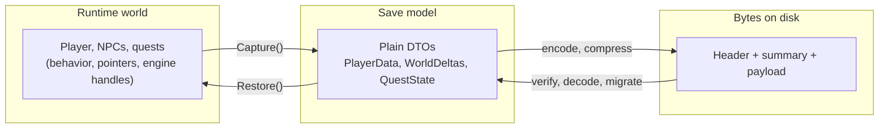
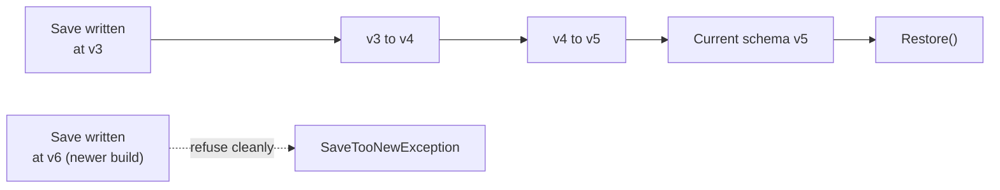
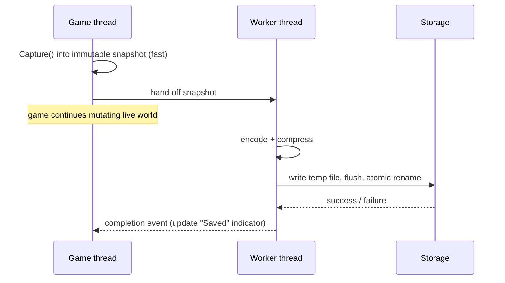
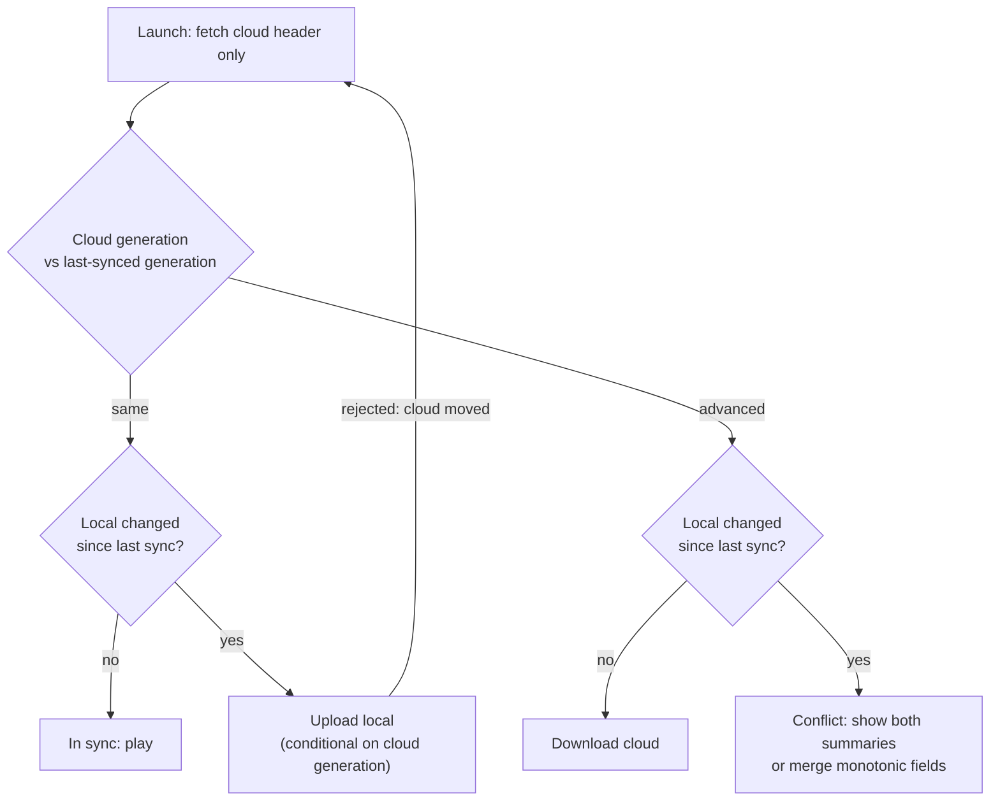
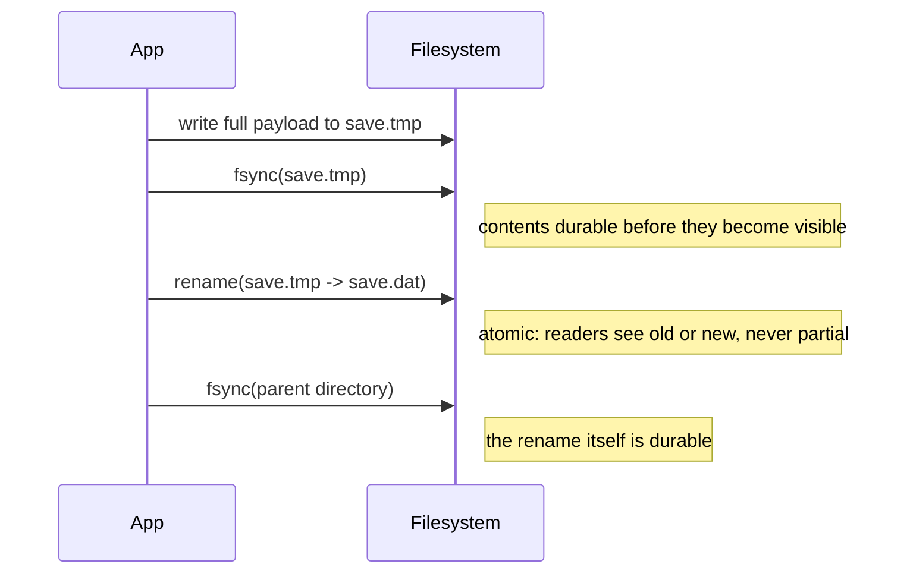
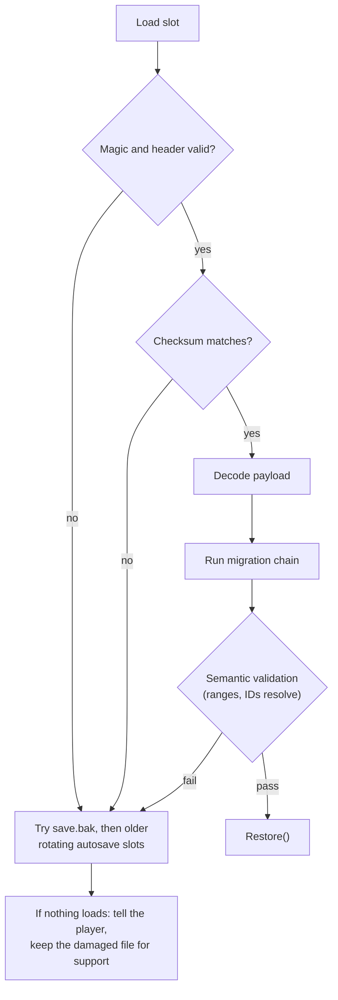
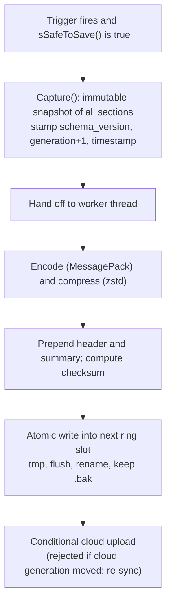

# Save Systems & Persistence

[Game Development](./) &raquo; Save Systems & Persistence

A **save system** converts the in-memory state of a running game into durable bytes and back again. The difficulty is not the encoding — any serializer can write JSON — but everything around it: the file must be readable by builds that did not exist when it was written, must survive a crash or power loss in the middle of a write, and may be edited on two devices that later have to agree. In practice a save file behaves like a very small database, with a schema, migrations, a durability protocol, and a replication story.

This page covers, in order: deciding what state to persist; serialization formats; the architecture that separates the save model from the runtime model; versioning and migration; autosave; cloud synchronization and conflict resolution; crash-safe writes and integrity checks; engine and platform APIs; and how to test a save system.

## What Goes in a Save

Not all game state belongs in the save. Classify every field into one of three categories before writing any serialization code:

| Category | Definition | Examples | Treatment |
|----------|-----------|----------|-----------|
| **Persistent** | Authoritative facts the player expects to keep | Inventory, quest flags, player position, unlocks, world mutations (an opened chest stays open), statistics | Save it |
| **Derived** | Reconstructable from persistent state | Navmesh, spatial partitions, pathfinding caches, LOD choices, UI layout | Recompute on load |
| **Transient** | Meaningful only within the current session or frame | Particles mid-emission, in-flight projectiles, input buffers, network sockets, audio voices | Discard |

Saving derived state wastes space and creates a second source of truth that can disagree with the authoritative data after a patch. Saving transient state makes the file large and brittle for no visible benefit. The most common structural mistake is serializing the whole scene graph — every transform and component — which couples the save format to engine internals and breaks the first time a prefab is reorganized.

For open worlds, persistent world state is usually stored as **deltas against authored content**: the level ships with its default state, and the save records only what the player changed (chest `0x3A` opened, NPC `0x91` dead). This keeps saves small and lets designers edit levels after launch without invalidating every save, provided entity IDs remain stable.

## Serialization Formats

A serializer turns an object graph into a byte stream. The choice trades readability, size, speed, tolerance for schema change, and safety against one another.

| Format | Human-readable | Size | Speed | Schema evolution | Notes |
|--------|:-:|------|-------|------------------|-------|
| JSON | Yes | Large | Slow | Easy (named, optional fields) | Excellent for debugging and tooling; no native binary blobs |
| Custom binary | No | Smallest | Fastest | Manual and fragile unless fields are tagged | Full control; you own every compatibility decision |
| Protocol Buffers | No | Small | Fast | Excellent (numbered fields, unknown-field skipping) | Requires a schema compiler step |
| FlatBuffers / Cap'n Proto | No | Small | Fastest reads (zero-copy) | Good | Readable without a parse step; suits very large saves |
| MessagePack / CBOR | No | Small | Fast | Easy (binary JSON) | Schema-less and self-describing |
| XML | Yes | Largest | Slowest | Easy | Legacy; not recommended for new work |
| Engine-native (Unity `JsonUtility`, Unreal `FArchive`/`USaveGame`, Godot `store_var`) | Varies | Varies | Fast | Engine-coupled | Convenient; ties the format to engine behavior and version |

### Choosing a format

- **Long post-launch support.** Use a tagged format (Protocol Buffers, MessagePack with explicit keys, or custom binary with field IDs). New code can read old data and old code can skip unknown fields, which is the basis of painless migration.
- **Very large saves** (open worlds, simulation games). A zero-copy format lets the loader memory-map the file and touch only what it needs. Add compression: LZ4 for speed, Zstandard for a better ratio at similar decode speed.
- **Development and tooling.** JSON is invaluable for diffing saves, hand-editing test cases, and attaching saves to bug reports. A common arrangement is JSON in debug builds and a binary encoding in release builds, generated from the same schema.
- **Untrusted input.** Treat every save as hostile input, especially if saves are shared, cloud-synced, or feed leaderboards. Never use a serializer that can instantiate arbitrary types from the stream — .NET `BinaryFormatter` (obsolete; its implementation was removed in .NET 9), Python `pickle`, Java native serialization, Godot `get_var(allow_objects = true)`, or loading a player-supplied Godot `.tres`/`.res` resource (resources can embed scripts). Use a data-only format and validate ranges and references on load.

### A self-describing header

Whatever the payload encoding, prefix the file with a small fixed-size header that can be read and validated before committing to a full parse:

```c
struct SaveHeader {             // little-endian, packed
    char     magic[4];          // "ASAV" -- reject anything else immediately
    uint16_t format;            // 0 = JSON, 1 = MessagePack, 2 = custom binary
    uint16_t schema_version;    // drives the migration chain
    uint32_t flags;             // e.g. bit 0 = zstd-compressed payload
    uint32_t payload_len;       // bytes of payload that follow
    uint32_t checksum;          // CRC32C or xxHash32 of the payload
    uint64_t timestamp_ms;      // wall-clock time of the save (display, tie-breaks)
    uint64_t generation;        // monotonic save counter (cloud sync, rollback detection)
};
```

`magic` rejects foreign files, `schema_version` routes to the migration chain, `checksum` detects corruption before any payload is decoded, and `generation` feeds cloud conflict detection. Store a small **summary block** (player level, location name, play time, thumbnail) right after the header so the load menu can list slots without decoding every full save.

## Save-Game Architecture

A maintainable save system keeps a hard boundary between the **runtime object model** (behavior-rich objects, engine handles, pointers) and the **save model** (plain data-transfer objects with no behavior). Mixing the two couples the on-disk format to every internal refactor and invites serializing pointers or handles that are meaningless after a reload.



Each persistent system implements a two-method contract, and a save manager orchestrates them without knowing their internals:

```csharp
public interface ISaveable
{
    string Key { get; }            // stable section id, e.g. "inventory"
    object Capture();              // returns a plain DTO; no I/O
    void   Restore(object data);   // rebuilds runtime state from the DTO
}

public sealed class SaveManager
{
    private readonly List<ISaveable> _systems = new();

    public SaveDocument BuildSnapshot()
    {
        var doc = new SaveDocument { Version = Migrations.CurrentVersion };
        foreach (var s in _systems)
            doc.Sections[s.Key] = s.Capture();       // pure, synchronous
        return doc;
    }

    public void ApplySnapshot(JsonObject raw)
    {
        raw = Migrations.UpgradeToCurrent(raw);      // see Versioning
        SaveDocument doc = SaveDocument.FromJson(raw);
        foreach (var s in _systems)
            if (doc.Sections.TryGetValue(s.Key, out var data))
                s.Restore(data);                     // missing section => defaults
    }
}
```

Two properties make this design scale:

1. **Capture performs no I/O.** Building the snapshot is fast and bounded; encoding and writing happen separately. This split is what makes non-blocking autosave possible.
2. **Sections are keyed and independent.** A save is a dictionary of named sections rather than one monolithic blob. A new system adds a section without touching others, and a missing section simply means "use defaults."

### Object references and stable IDs

References between objects (the player's active quest, a chest's owner) cannot be saved as pointers. The standard solution:

- Give every persistent entity a **stable ID** — a GUID baked into authored level content, or an ID assigned at spawn and recorded in the save.
- Serialize references **as IDs**, never as pointers or array indices (indices shift when ordering changes).
- Restore in **two passes**: instantiate all entities and register them in an ID table, then resolve every stored ID into a live reference.

```
Pass 1 (instantiate):  0x4F -> Player   0x91 -> Quest   0xA2 -> Chest
Pass 2 (relink):       Player.activeQuest = table[0x91]
                       Chest.owner        = table[0x4F]
```

Two-pass restore also handles reference cycles (A refers to B refers to A) that would recurse forever in a naive depth-first serializer. Decide explicitly what happens when an ID no longer resolves — for example, content removed in a patch — and log it rather than crash.

## Versioning & Migration

Once a game ships, its save format is fixed for every existing player, and the next content patch almost always changes the schema. Versioning is therefore a launch requirement, not a polish item: the first build that ships must already write a version number.

On load, the file's `schema_version` is compared with the current code's version, and a chain of single-step migrations brings the data forward:



Migrations are **append-only**: a `v3 -> v4` step is run by every player who ever had a v3 save, so editing it after release risks corrupting saves that already passed through the old version. Add new steps; never rewrite old ones. Migrating a generic document tree (JSON object, MessagePack map) rather than typed classes keeps old migrations compiling after the typed classes change.

```csharp
public static class Migrations
{
    public const int CurrentVersion = 4;

    // Steps[i] upgrades a document from version (i + 1) to (i + 2).
    private static readonly Func<JsonObject, JsonObject>[] Steps =
    {
        V1ToV2,
        V2ToV3,
        V3ToV4,
    };

    public static JsonObject UpgradeToCurrent(JsonObject doc)
    {
        int v = (int)doc["version"];
        if (v > CurrentVersion)
            throw new SaveTooNewException(v);   // never guess at a newer schema

        for (; v < CurrentVersion; v++)
            doc = Steps[v - 1](doc);

        doc["version"] = CurrentVersion;
        return doc;
    }

    // v4 split the single "name" field into "firstName" / "lastName".
    private static JsonObject V3ToV4(JsonObject d)
    {
        var player = d["sections"]["player"].AsObject();
        var parts  = ((string)player["name"] ?? "").Split(' ', 2);
        player["firstName"] = parts[0];
        player["lastName"]  = parts.Length > 1 ? parts[1] : "";
        player.Remove("name");
        return d;
    }
}
```

### Schema-change rules

| Change | Safe approach |
|--------|---------------|
| Add a field | Give it a default and apply the default when absent. Tagged formats do this automatically. |
| Remove a field | Stop reading it. Never reuse its tag or key for something else. |
| Rename a field | Add the new field, migrate old to new, keep accepting the old name for at least one version. |
| Change a type | Add a new field of the new type, convert in a migration, retire the old field. |
| Restructure | Write an explicit migration step; this is what the framework is for. |

The central rule of tagged formats is that **field IDs are permanent**. If field 7 once meant `stamina`, it can never mean anything else, because old saves still carry a value tagged 7. The same discipline appears in database schema management; see [Schema Evolution & Migrations](../technology/database-design/schema-evolution-and-migrations.html).

### Forward compatibility

Backward compatibility (new code reads old saves) is mandatory. **Forward compatibility** (old code reads newer saves) matters whenever two installs can be on different patch levels — a cloud save written on an updated PC and then opened on a console still awaiting the patch, or a save made on a beta branch. Tagged formats give partial forward compatibility by skipping unknown fields, but if the old build then re-saves, those fields are lost. When forward compatibility cannot be guaranteed, refuse the load with a clear message ("This save was made with a newer version of the game") instead of crashing or silently discarding data.

## Autosave & Checkpoints

### When to save

| Trigger | Advantages | Drawbacks |
|---------|-----------|-----------|
| Designer-placed checkpoints | Known-safe states; supports difficulty tuning | Progress between checkpoints is lost |
| Timed interval | Bounds maximum loss | May fire in an unsafe state |
| Events (zone change, boss defeated, item acquired) | Natural breakpoints | Each event needs a "safe" definition |
| Suspend, quit, or focus loss | Captures the latest state | Unreliable on crashes; suspend time is short on consoles and mobile |

Robust games combine event-driven saves, a timed safety net, and a save on suspend or quit, all gated by a single **"is it safe to save?"** predicate: not mid-cutscene, not during a level transition, not in combat (if the design requires), and not while a multi-step quest update is half-applied. A save that restores the player into an unwinnable situation — falling, surrounded, with 1 HP — is worse than a slightly older save.

On consoles and mobile, the OS gives an app only a short window after a suspend notification before it is frozen or killed, so the suspend path must be fast: flush an already-captured snapshot rather than starting a heavy capture.

### Non-blocking autosave

A visible hitch at every autosave is a quality bug. Exploit the capture/encode split:



The snapshot must be an **immutable copy** of the persistent data. Serializing live objects from a worker thread while the game thread mutates them is a data race that produces torn, internally inconsistent saves. If capture itself is too slow, make sections copy-on-write or capture them incrementally across a few frames while gameplay that would modify them is paused.

Most platforms require a visible save indicator while writing and forbid powering off during it; follow the platform's rules for the icon and its minimum display time.

### Rotating slots

Keep a small ring of autosave slots rather than one file. Rotation is defense in depth on top of atomic writes, and it protects against **logically bad** saves (autosaving while soft-locked) that no checksum can detect:

```
autosave_0   autosave_1   autosave_2      <- ring; the oldest slot is overwritten next
                             ^ newest
```

## Cloud Saves & Synchronization

Cloud saves copy the save between devices through a remote store: Steam Cloud, Xbox Game Saves, PlayStation and Nintendo cloud services, Apple iCloud / Game Center, Google Play Games Services, Epic Online Services, or a custom backend. Once more than one device can write, save synchronization becomes a distributed-systems problem.

### Detecting conflicts

Compare each side against the **last state both agreed on** (the last successful sync), not merely against each other:

| Local since last sync | Cloud since last sync | Action |
|:-:|:-:|--------|
| Unchanged | Unchanged | Nothing to do |
| Changed | Unchanged | Upload local |
| Unchanged | Changed | Download cloud |
| Changed | Changed | **Conflict** — prompt or merge |

This is exactly the model Microsoft documents for Xbox Game Saves, which then shows a system dialog asking the player which copy to keep.



Resolution strategies, from crudest to safest:

- **Last writer wins by timestamp.** Simple, but device clocks drift or are set wrong, and it silently destroys the losing device's progress.
- **Generation counters with conditional upload.** Each save records the generation it was based on; the server accepts an upload only if its current generation still matches (optimistic concurrency, the same technique databases use to prevent lost updates — see [Transactions & Concurrency](../technology/database-design/transactions-and-concurrency.html)). Stale writes are rejected instead of applied.
- **Player-chosen resolution.** On a true conflict, show both candidates with their summary blocks ("This device: Level 12, 4 h 10 m, Riverside" vs "Cloud: Level 14, 5 h 02 m, Old Mine") and let the player choose. Standard for single-player games, because it never discards progress silently.
- **Merging.** Some data can be merged rather than chosen: unlocked achievements and codex entries (set union), best times and highest level reached (maximum), lifetime statistics (per-device counters summed). Designing such fields as monotonic, CRDT-style values makes them conflict-free.

### Platform behavior to design around

- **Steam Cloud** offers **Auto-Cloud** (no code; Steam syncs configured paths at launch and exit) or the **`ISteamRemoteStorage`** API for direct control. With *Dynamic Cloud Sync*, Steam can upload while a game is suspended on Steam Deck and resume on another PC; wrapping multi-file writes in `BeginFileWriteBatch` / `EndFileWriteBatch` tells Steam not to sync a half-written set. Splitting data into several files avoids re-uploading unchanged data.
- **Xbox Game Saves** (Microsoft GDK) provides `XGameSave` (containers of blobs, written through update handles) and `XGameSaveFiles` (a synced folder, mainly for PC ports). Updates are atomic per container, a lock prevents two devices from writing concurrently, the system syncs periodically during play and at session end, and conflicts are resolved through a platform dialog.
- **Console platforms** in general impose declared size quotas, require the game to handle "storage full" and "save corrupted" through platform-standard messaging, and check this during certification (see [Testing & QA](testing-qa.html#certification)).

Whatever the service, keep sync **advisory**: a network failure must never stop someone from playing offline against the local save.

## Crash-Safe Writes & Integrity

The most important property of a save system is that it **never destroys a good save**. Threats include a crash or power loss mid-write, full storage, OS write caching that reorders or delays writes, storage bit-rot, and deliberate tampering.

### Write to a temporary file, then rename

Overwriting a save in place is never safe: if the process dies after truncating the old contents and before the new contents are complete, both versions are gone. The standard protocol writes a complete new file and atomically swaps it in:



The ordering matters. If the rename becomes durable before the file contents, a power loss can leave a correctly named but empty or zero-filled file — the worst outcome, because it looks valid until it is parsed. Platform details:

- **Linux / POSIX:** `rename()` within one filesystem is atomic; `fsync` the file before renaming and the directory after.
- **macOS / iOS:** plain `fsync` does not force the drive's own cache to stable storage; use `fcntl(fd, F_FULLFSYNC)` when true power-loss durability is required.
- **Windows:** `MoveFileEx` with `MOVEFILE_REPLACE_EXISTING | MOVEFILE_WRITE_THROUGH`, or `ReplaceFile` (which .NET's `File.Replace` wraps and which can also keep a backup copy). Both require the source and destination to be on the same volume.
- **Consoles:** use the platform save-data API and its commit semantics rather than raw file I/O; the platform provides the journaling.

```csharp
// .NET / Unity: atomic replace with a retained backup.
public static void AtomicWrite(string path, ReadOnlySpan<byte> bytes)
{
    string tmp = path + ".tmp";
    using (var fs = new FileStream(tmp, FileMode.Create, FileAccess.Write, FileShare.None))
    {
        fs.Write(bytes);
        fs.Flush(flushToDisk: true);           // force contents to the device
    }

    if (File.Exists(path))
        File.Replace(tmp, path, path + ".bak"); // old save becomes .bak
    else
        File.Move(tmp, path);
}
```

After this protocol, a crash at any point leaves one of two valid states:

```
crash before rename:  save.dat = old (intact)   save.tmp = incomplete (delete on next launch)
crash after rename:   save.dat = new (intact)   save.bak = previous save (recoverable)
```

Check free space before writing (a full disk mid-write is a common real-world failure), and treat any write error as "the old save is still the current save."

### Verifying on load



Use CRC32C or xxHash for fast corruption detection; a cryptographic hash is only needed for tamper resistance. Never delete a file that failed to load — keep it so it can be attached to a support ticket or repaired by a later patch.

### Tampering

A client-side save cannot be made tamper-proof, because the player controls the machine. It is possible only to raise the cost:

- **Keyed hash (HMAC)** of the payload with a key embedded in the binary rejects casual hex-editing. A determined attacker extracts the key.
- **Rollback detection.** Encryption hides contents but does not stop a player from restoring an older, legitimately signed save to undo spending. Checking the save's `generation` against a server-side or platform-stored counter detects this.
- **Server authority.** For anything competitive or monetized — currencies, ranked progress, purchasable items — the server holds the authoritative state and the local save is only a cache. This is the only robust defense; see [Cybersecurity](../technology/cybersecurity/) and [Multiplayer Networking](multiplayer-networking.html).

For single-player games, many studios deliberately leave saves editable: modding and save editing are a feature for many players, and effort is better spent on corruption resistance.

## Engine and Platform APIs

| Environment | Built-in facilities | Notes |
|-------------|---------------------|-------|
| **Unity** | `Application.persistentDataPath`; `JsonUtility`; Newtonsoft Json.NET (`com.unity.nuget.newtonsoft-json`); `PlayerPrefs`; Unity Gaming Services Cloud Save | `JsonUtility` handles only serializable fields and does not support dictionaries or polymorphism. `PlayerPrefs` is for settings, not game saves (it lives in the registry on Windows). |
| **Unreal Engine** | `USaveGame` subclasses with `UGameplayStatics::SaveGameToSlot` / `AsyncSaveGameToSlot`; `FArchive` with the `SaveGame` property specifier (`Ar.ArIsSaveGame`); `ISaveGameSystem` platform abstraction | The platform save-game system maps slots onto each console's save API. Serializing whole actors via `SaveGame`-flagged properties is convenient but couples the format to class layouts; version it with custom version GUIDs. |
| **Godot 4** | `FileAccess` (`user://`); `JSON`; `store_var` / `get_var`; `ConfigFile` for settings; `ResourceSaver` | Keep `get_var` object decoding disabled for untrusted data, and do not load player-supplied `.tres` / `.res` files. |
| **Steam** | Auto-Cloud; `ISteamRemoteStorage` | Per-user byte and file-count quotas configured in Steamworks. |
| **Xbox / PC Game Pass** | GDK `XGameSave`, `XGameSaveFiles` | Container-level atomicity, device locks, platform conflict dialog. |
| **PlayStation, Nintendo** | Platform save-data libraries (under NDA) | Quotas declared up front; journaled commits; mandatory handling of full or corrupted storage. |

## Testing a Save System

Save bugs are among the most damaging a game can ship, and they are cheap to catch with automation:

- **Round-trip tests.** `Restore(Capture(state))` must reproduce `state`; compare a canonical hash of persistent data before and after.
- **Golden-save corpus.** Keep real save files from every shipped version (and from late-game and edge-case playthroughs) in the repository, and load each through the current migration chain in CI. A migration regression then fails the build instead of reaching players.
- **Corruption and fuzz tests.** Truncate files at random offsets, flip bits, and feed malformed payloads; the loader must fall back or report an error, never crash or hang.
- **Kill tests.** Terminate the process at random points during a save (or cut power to a test device) and verify that a valid save always remains.
- **Platform scenarios.** Full storage, storage removed mid-save, sign-out during save, suspend during save, and simultaneous play on two devices. These map directly onto certification requirements; see [Testing & QA](testing-qa.html).

## End-to-End Flow

The complete lifecycle of one autosave, and where each technique on this page applies:



Loading runs the same path in reverse: read the header, verify magic and checksum, fall back to `.bak` or an older slot on failure, decode, migrate to the current schema, validate, then restore each system with two-pass ID relinking.

## See Also

- [Game Development Hub](./) — engines, the game loop, ECS, and the systems a save must capture
- [Testing & QA](testing-qa.html) — certification requirements for storage handling, soak tests, and regression testing
- [Multiplayer Networking](multiplayer-networking.html) — server-authoritative state for anything that must not be tampered with
- [Database Design](../technology/database-design/) — durability, transactions, and concurrency control that save systems borrow
- [Schema Evolution & Migrations](../technology/database-design/schema-evolution-and-migrations.html) — the same versioning discipline applied to databases
- [Cybersecurity](../technology/cybersecurity/) — why the client is never trusted
- [Memory Optimization](../optimization/memory-optimization.html) — the cost of large in-memory state and streaming
