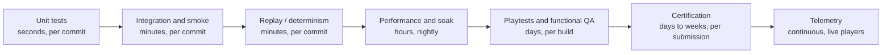
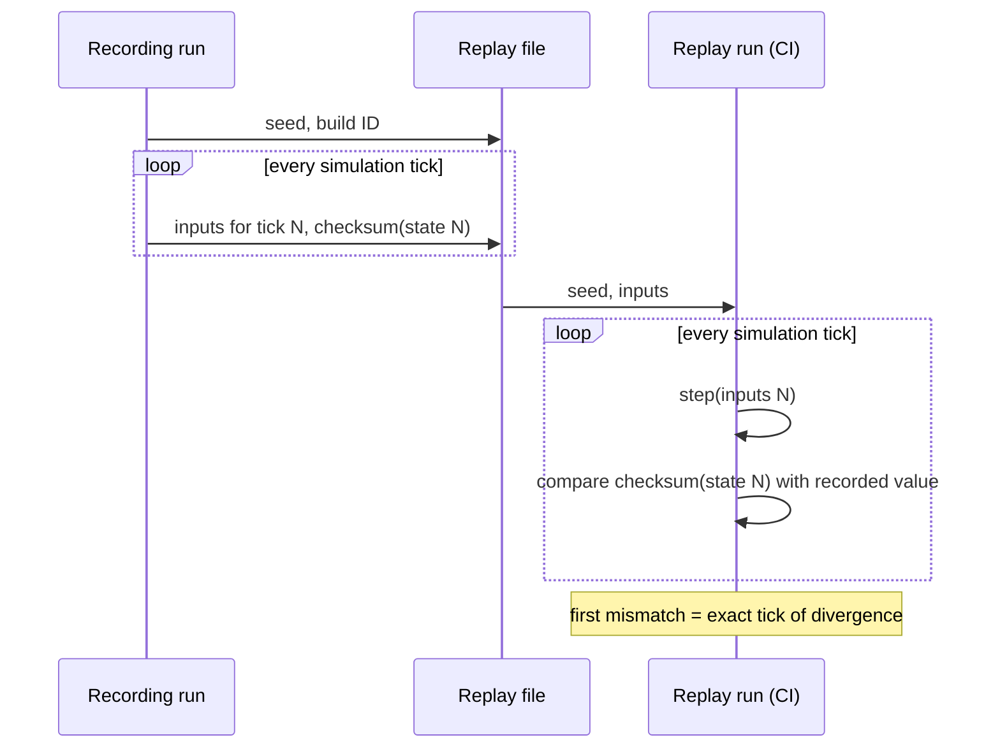
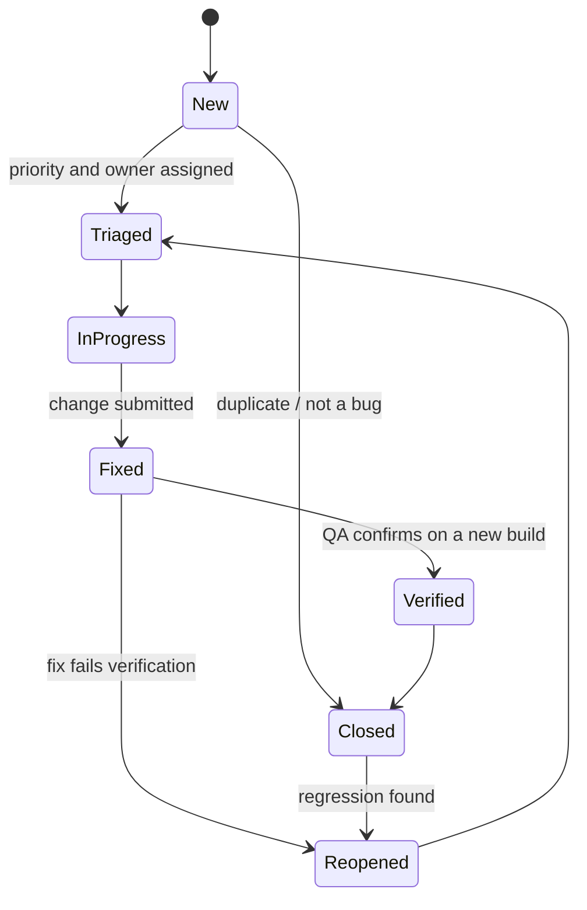
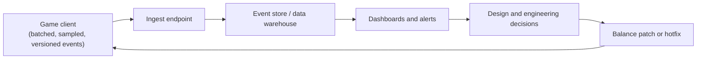

# Testing & QA

[Game Development](./) &raquo; Testing &amp; QA

**Game quality assurance** combines human judgment with automation to find defects in software that is large, stateful, real-time, frequently non-deterministic, and judged as much on feel as on correctness. A regression in a business application produces a wrong number; a regression in a game can be a soft-lock that traps a player, a physics edge case that launches the character out of the level, or a slow memory leak that crashes a console after six hours of play — failures that ordinary unit tests rarely catch.

This page covers the layers of a game QA system: **playtesting** for usability and fun; **automated testing** (unit, integration, smoke, and replay/determinism) for correctness; **performance and soak testing** for stability over time; **bug triage**; platform **certification**; and **telemetry** from live players.

## Why Game Testing Is Different

Conventional QA assumes inputs can be pinned down and outputs asserted. Games strain every part of that assumption:

| Property | Consequence for testing |
|----------|-------------------------|
| **Real-time** | Bugs depend on timing; a single slow frame can change behavior. Tests must run the game loop, not just call functions. |
| **Stateful** | A bug may appear only after many hours of a particular play history. The state space is effectively unbounded. |
| **Non-deterministic** | Floating-point differences, threading, and input timing make repro steps unreliable. Reproducibility has to be engineered. |
| **Subjective** | "Is it fun?" and "does the jump feel responsive?" cannot be asserted in code. |
| **Content-heavy** | Thousands of levels, assets, and quests, each a failure point. Coverage is a content problem as much as a code problem. |
| **Platform-fragmented** | One build must work across PC hardware, several consoles, handhelds, and sometimes mobile. A bug may exist on exactly one SKU. |

No single technique suffices. Effective QA is **layered**: cheap automated checks run constantly and catch many shallow bugs, while expensive human testing and long-running soak tests catch the few deep ones. Each layer should catch what the next, more expensive layer would otherwise find later.



A determinism bug found by a replay test in CI costs minutes. The same bug found during certification costs a failed submission and possibly a missed release date.

## Playtesting

Playtesting is the human layer. It answers questions automation cannot: whether the tutorial is understandable, whether the difficulty curve is fair, whether the core loop is enjoyable, and whether players can find the exit at all.

### Kinds of playtesting

| Type | Question answered | Testers | When |
|------|-------------------|---------|------|
| **Usability / UX** | Can players understand controls and UI without help? | New players representative of the audience | Early and continuously |
| **Design / fun** | Is the core loop engaging; is pacing right? | Target-audience players | Throughout production |
| **Balance** | Are difficulty, economy, and power curves tuned? | Mixed skill levels | Mid to late production |
| **Functional QA** | Does it work? Find and document defects. | Professional testers | Continuously |
| **Compliance** | Does the build meet platform requirements? | Specialist testers | Before each submission |
| **Compatibility** | Does it run across the hardware matrix? | Test lab or device farm | Late production and per patch |
| **Accessibility** | Can players with disabilities complete the game with the provided options? | Players with relevant disabilities, accessibility consultants | Mid production onward |

Developers, and friends of developers, are poor usability testers: they already know how the game works and unconsciously avoid the dead ends that new players walk into.

### Running a usability test

The standard method is **think-aloud observation without assistance**:

1. **Recruit representative players** who have never seen the game.
2. **Give goals, not instructions** — "reach the first save point," not "press X to open the door."
3. **Do not help.** When a tester is stuck, the stuck moment is the data. Anything that must be explained in the room will have to be explained by the shipped game.
4. **Ask testers to think aloud**, narrating what they expect and what confuses them.
5. **Record** gameplay, face, and audio. What players did is more reliable than what they say afterward.
6. **Look for patterns across sessions.** One tester disliking a jump is an opinion; five testers failing the same jump is a design defect.

Many studios run these sessions through a dedicated games user research (GUR) function, and increasingly supplement lab sessions with remote unmoderated tests using recorded builds.

### Playtest metrics

Even qualitative playtests benefit from instrumentation:

- **Time to first action** and **time to complete** each objective — spikes indicate confusion.
- **Failure and retry counts** per encounter — spikes indicate difficulty problems.
- **Drop-off point** — where players stop, the strongest retention signal.
- **Path heatmaps** — where players actually go compared with the intended route.

The same instrumentation later becomes the live [telemetry](#telemetry) system.

## Automated Testing

Automated tests are the inexpensive, continuous layer that runs on every change. For games the important families are unit tests, integration and smoke tests, and replay/determinism tests, supported by bots, image comparison, and property-based testing.

### Engine test frameworks

| Engine | Frameworks | Notes |
|--------|-----------|-------|
| **Unity** | Unity Test Framework (NUnit-based) | *Edit Mode* tests run without entering Play Mode; *Play Mode* tests run the real player loop and can yield across frames. Runs from the command line with `-runTests` for CI. |
| **Unreal Engine** | Automation Test Framework: simple/complex automation tests, **Automation Spec** (BDD style), **CQTest** (fixtures and simplified async tests), **Functional Tests** (level-based, authored in Blueprint), **Automation Driver** (simulated user input), screenshot comparison, Editor tests in Python; **Low-Level Tests** (Catch2-based) for pure unit tests; **Gauntlet** for orchestrating multi-process sessions on devices | Session Frontend runs tests interactively; `RunUAT` / Horde automate them in CI. |
| **Godot 4** | GUT (Godot Unit Test), GdUnit4 | Both run headless from the command line; GdUnit4 also supports C#. |
| **Custom engines** | GoogleTest, Catch2, doctest | Keep simulation code in libraries that link without the renderer. |

### Unit tests

Unit tests exercise pure logic in isolation: damage formulas, inventory rules, serialization, pathfinding costs, state-machine transitions. They are fast and hermetic. The prerequisite is **separating rules from the engine**: extract logic into plain classes that do not depend on rendering, frame time, or input devices.

```csharp
// Pure logic: no MonoBehaviour, no scene, fully unit-testable.
public static class DamageCalculator
{
    public static int Resolve(int baseDamage, int armor, bool isCrit)
    {
        int mitigated = Math.Max(1, baseDamage - armor);   // never below 1
        return isCrit ? mitigated * 2 : mitigated;
    }
}

public class DamageCalculatorTests
{
    [TestCase(5, 100, false, ExpectedResult = 1)]    // armor cannot reduce below 1
    [TestCase(10, 3, false, ExpectedResult = 7)]
    [TestCase(10, 3, true,  ExpectedResult = 14)]    // crit doubles mitigated damage
    public int Resolve_AppliesArmorThenCrit(int dmg, int armor, bool crit)
        => DamageCalculator.Resolve(dmg, armor, crit);
}
```

### Integration and Play Mode tests

Integration tests run part of the real game — a scene, the physics world, several systems together — and assert on behavior over multiple frames:

```csharp
using System.Collections;
using NUnit.Framework;
using UnityEngine;
using UnityEngine.SceneManagement;
using UnityEngine.TestTools;

public class PlayerPhysicsTests
{
    [UnityTest]
    public IEnumerator Player_LandsOnGround_WithinTwoSeconds()
    {
        yield return SceneManager.LoadSceneAsync("TestArena", LoadSceneMode.Single);

        var player = Object.FindFirstObjectByType<PlayerController>();
        Assert.IsNotNull(player, "TestArena has no PlayerController");
        player.transform.position = new Vector3(0, 10, 0);

        float elapsed = 0f;
        while (!player.IsGrounded && elapsed < 2f)
        {
            elapsed += Time.deltaTime;
            yield return null;                 // advance one real frame
        }
        Assert.IsTrue(player.IsGrounded, "Player never landed: gravity or collision broken");
    }
}
```

(`Object.FindObjectOfType` is deprecated in current Unity versions; use `FindFirstObjectByType` or `FindAnyObjectByType`.)

**Smoke tests** are the highest-value integration tests: load every level, spawn the player, run a few hundred frames, and assert no exceptions, no error logs, no NaN transforms, and no missing references. They catch catastrophic content breakage — a level that crashes because a referenced asset was deleted — that no unit test sees. Pair them with **content validation**: automated checks over assets (missing references, oversized textures, invalid collision, localization strings that overflow their UI) run on import or in CI.

### Replay and determinism tests

A replay test records a session as an **initial seed plus a stream of inputs**, replays the inputs into a fresh simulation, and asserts that the simulation reaches identical state, usually by comparing a per-frame checksum of game state.



Replay tests provide:

1. **Regression detection.** Any change that alters simulation output fails, and the failure reports the exact tick of divergence.
2. **Reproducible bug reports.** When determinism holds, a tester's input log is a perfect repro.
3. **Lockstep validation.** Deterministic lockstep netcode (common in RTS and fighting games) is a replay system running across machines; the same machinery catches desyncs. See [Multiplayer Networking](multiplayer-networking.html).

Determinism is hard to retrofit. Common sources of divergence, all of which checksum diffing exposes:

- **Floating-point differences** between compilers, instruction sets (x87, SSE, FMA contraction), and platforms. Use fixed-point arithmetic or strictly controlled float settings for authoritative simulation.
- **Unordered iteration** over hash maps and sets; sort or use ordered containers in simulation code.
- **Uninitialized memory** and RNG seeded from time or per machine; use explicit, seeded RNG streams per system.
- **Frame-rate-coupled logic**; the simulation must advance on a fixed timestep independent of rendering (see [Game Loop Architecture](./#game-loop-architecture)).
- **Multithreaded jobs** whose results are combined in completion order rather than a fixed order.

### Other automated techniques

- **Bots and monkey testing.** Scripted or navmesh-driven bots wander levels, mash inputs, and try to leave the playable area. They find collision holes and out-of-bounds exploits and double as soak-test drivers. Studios are also using reinforcement-learning and other learned agents to explore levels and exercise balance at scale; see [Game AI](../ai-ml/game-ai.html).
- **Screenshot (golden-image) tests.** Render a fixed scene and compare against an approved reference with a tolerance, catching rendering regressions. Pin GPU, driver, and quality settings, or tolerances become meaningless.
- **Property-based testing.** Generate many random valid inputs (inventories, item combinations) and assert invariants such as "total item count is conserved" instead of hand-picked cases.
- **Save/load round-trips and migration tests** over a corpus of real saves from previous versions; see [Save Systems](save-systems.html#testing-a-save-system).

### Flaky tests

Frame-based tests are prone to flakiness: they depend on load times, frame rate, and physics timing. Treat flakiness as a defect in the test or the game, not noise. Useful practices: wait on conditions with timeouts rather than fixed frame counts; run tests with a fixed timestep and fixed seeds; quarantine a flaky test (tracked, with an owner) rather than letting it train the team to ignore red builds.

## Performance and Soak Testing

A game that is functionally correct but stutters, or correct but crashes after four hours, has still failed.

### Performance testing

Performance testing verifies that the game holds its **frame budget** in worst-case scenes and catches regressions before they accumulate.

| Target | Frame budget |
|--------|-------------:|
| 30 FPS | 33.3 ms |
| 40 FPS (common 120 Hz console / handheld mode) | 25.0 ms |
| 60 FPS | 16.7 ms |
| 90 FPS (typical VR minimum) | 11.1 ms |
| 120 FPS | 8.3 ms |

The average frame time is the least informative number. Players perceive the **tail**:

| Metric | Why it matters |
|--------|----------------|
| Average frame time | Coarse health check; hides stutter entirely |
| 95th / 99th percentile frame time | One slow frame in a hundred is a visible hitch |
| 1% and 0.1% lows | Common reporting form for the worst frames |
| Hitch count (frames over budget by a threshold) | Directly counts what players notice; also catches shader-compilation and streaming stalls |
| Memory high-water mark | Fixed-memory platforms crash rather than slow down |

Automated performance tests run a fixed camera path or scripted scenario on dedicated, stable hardware in CI, record these metrics per build, and fail or flag the build when thresholds regress. Tracking per commit turns "the game got slower this month" into "commit `a1b2c3` added 4 ms to the market scene." Shader-compilation stutter on PC deserves its own test: play through with an empty shader/PSO cache and count hitches.

Profilers are platform-specific: Unity Profiler and Profile Analyzer; Unreal Insights and `stat unit` / `stat gpu`; RenderDoc, PIX, NVIDIA Nsight, AMD Radeon GPU Profiler; Tracy and Superluminal for custom engines; and the platform-holder profilers on consoles. For fixing what the tests find, see [Performance Optimization](../optimization/), particularly [GPU](../optimization/gpu-optimization.html) and [CPU](../optimization/cpu-optimization.html) optimization.

### Soak testing

A **soak test** (endurance or stability test) leaves the game running for hours or days to surface faults that only appear over time. Platform holders require stability over extended sessions, so soak testing directly supports [certification](#certification).

Soak tests catch:

- **Memory leaks** — a few kilobytes per spawn is invisible in a five-minute test and fatal after hours on fixed-memory hardware.
- **Heap fragmentation** — without any true leak, allocation churn fragments memory until a large allocation fails.
- **Precision and overflow** — a `float` game clock loses precision after hours; 32-bit frame counters wrap; physics far from the world origin jitters.
- **Handle exhaustion** — file handles, audio voices, GPU descriptors, and network sockets slowly running out.
- **Thermal behavior** — throttling on mobile devices and handhelds (see [Platform-Specific Tuning](../optimization/platform-tuning.html)).

Typical setups are an **idle soak** (title screen or pause menu for 24–72 hours), a **gameplay soak** (bots or looping replays playing continuously), and a **suspend/resume soak** on consoles and mobile. Always graph memory over the whole run; a line that rises without plateauing is a leak.

### Load testing

For online games, **load testing** drives hundreds or thousands of headless bot clients against the servers to find the concurrency limit, validate matchmaking and backend services, and size infrastructure before launch traffic arrives. See [Multiplayer Networking](multiplayer-networking.html).

## Bug Triage

Testing produces bugs; triage turns them into an ordered queue of work. A database of a thousand unprioritized bugs is functionally no better than none.

### A useful bug report

- **Title** that states the symptom and location.
- **Repro steps**, numbered and minimal.
- **Expected and actual** behavior.
- **Build number, platform, and hardware SKU.**
- **Evidence**: video, screenshot, crash dump and call stack, and a replay file or save file where available.
- **Repro rate**: always, intermittent (with an estimate such as 3 in 10), or once.

"Sometimes the game crashes" cannot be acted on. "Build 4471, PS5: crash when dodging during the boss intro cutscene, 10/10, dump and video attached" can be assigned immediately. In-game bug reporters that capture build, position, recent log lines, a screenshot, and the current save with one key press dramatically improve report quality.

### Severity and priority

These are separate axes, and conflating them is a classic triage error:

- **Severity** describes impact if the bug occurs: cosmetic, minor, major, crash, data loss, certification blocker.
- **Priority** is the decision about fix order, combining severity, frequency, cost to fix, risk of the fix, and time to ship.

A rare crash reachable only through a debug menu is high severity and low priority. A flicker on the main menu is low severity but may be high priority because every player sees it.

|  | Frequent | Rare |
|--|----------|------|
| **High severity** | P0 — fix now | P1 — fix this milestone |
| **Low severity** | P2 — fix when convenient | P3 — backlog or won't fix |

### Bug lifecycle



Hold triage regularly (daily near a milestone), keep a separate **certification-blocker** lane that overrides normal priority before submission, and enforce verification: a bug is closed when QA confirms the fix on a fresh build on the target platform, not when a developer says it is fixed. Link fixes to changes in version control (see [Git](../technology/git/)) so regressions can be traced.

## Certification

To release on a console, and on some storefronts, a build must pass the platform holder's **certification**: a formal test pass against a published requirements list.

| Platform holder | Requirements | Notes |
|-----------------|--------------|-------|
| Sony (PlayStation) | **TRC** — Technical Requirements Checklist | Submitted through Sony's partner portal |
| Microsoft (Xbox, including PC via Microsoft Store) | **XR** — Xbox Requirements (successor to the older TCR) | Covers areas such as Game Saves behavior, suspend/resume, and user handling |
| Nintendo (Switch, Switch 2) | **Lotcheck** against Nintendo's guidelines | |
| Valve (Steam Deck) | **Steam Deck compatibility** review | Performed by Valve on released games; results are Verified, Playable, Unsupported, or Unknown. It is a compatibility rating, not a release gate. |

Certification does not judge whether a game is good; it enforces platform consistency and user-experience standards. Typical requirement areas:

- **Terminology** — exact platform names for hardware, buttons, accounts, and services.
- **Suspend and resume** — correct behavior when the console sleeps and wakes mid-session, including network reconnection.
- **Controller disconnection** — pause and show the correct prompt; handle controller re-pairing to a different user.
- **User and account changes** — sign-out, user switching, and multiple local users.
- **Storage** — full or unavailable storage, corrupted saves, and save indicators (see [Save Systems](save-systems.html)).
- **Network loss** — correct messaging and recovery.
- **Stability** — no crashes or hangs across extended play (supported by [soak testing](#soak-testing)).
- **Online features and safety** — parental controls, privilege checks, blocking and reporting, and text/voice chat requirements.
- **Achievements / trophies, age-rating display, and required system UI.**

Practical consequences:

- A failed submission costs a fix, a resubmission, and days or weeks — directly threatening a fixed launch date and any coordinated marketing.
- Many requirements are architectural (suspend/resume, user switching, save handling). Treat the requirement lists as a test suite from the start of production.
- Studios run an **internal pre-certification pass** against the checklist before submitting, so the external pass becomes a formality. Patches also go through certification, usually with a lighter process.

## Telemetry

Pre-launch testing reaches hundreds of players at most. **Telemetry** instruments the shipped game to report from every consenting session, turning the live audience into a continuous source of QA and design data.

### What to collect

- **Crashes and hangs** — call stacks and minidumps, deduplicated by signature. Services such as Sentry, Backtrace, BugSplat, and Firebase Crashlytics aggregate reports; engines provide their own crash reporters.
- **Performance** — frame-time distributions and hardware configuration sampled in the wild, exposing the long tail of GPUs and drivers no lab can cover.
- **Progression** — funnels, completion rates, and where players stop.
- **Balance and economy** — weapon pick and win rates, currency sources and sinks, encounters with abnormal death rates.
- **Behavior** — heatmaps of movement, deaths, and stuck positions.

### Pipeline



Engineering practices:

- **Send asynchronously and in batches** off the main thread; telemetry must never cost frame time or block play when the network is down.
- **Sample** high-frequency data; per-frame positions for every player are rarely needed.
- **Version every event schema** so data remains interpretable across patches.
- **Treat it as personal data.** Disclose collection, obtain consent where required, honor opt-outs, minimize and pseudonymize identifiers, and set retention limits, in line with GDPR, CCPA/CPRA, and children's-privacy rules such as COPPA. See [Privacy Engineering](../technology/cybersecurity/privacy-engineering.html).

### Closing the loop

Telemetry is only useful when it drives action: a drop-off cliff at level 3 sends designers to fix pacing, a weapon with an outlying win rate triggers a balance change, and a crash spike on one driver version triggers a hotfix or a driver-specific workaround. It is the playtest metrics described above, scaled from a room of ten to an audience of millions.

## A Continuous QA Pipeline

Mature teams run all of these layers continuously rather than as a final phase:

| Cadence | Activities |
|---------|-----------|
| Every change (CI) | Unit tests, content validation, smoke tests, replay/determinism tests, quick performance check |
| Nightly | All-levels smoke, full performance run on reference hardware, short soak, screenshot tests |
| Per build | Functional QA pass, structured playtest, bug triage |
| Per milestone | Balance playtest, compatibility / device-farm pass, accessibility review |
| Before submission | Internal pre-certification, extended soak, load test |
| Live | Crash aggregation, telemetry dashboards, hotfix process |

The underlying principle is to **shift detection left**: move each class of bug to the earliest and most automated layer that can catch it. A defect caught by a unit test in seconds does not cost a playtester an afternoon, a failed certification a week, or a player a refund. For CI infrastructure itself, see [CI/CD](../technology/ci-cd/).

## See Also

- [Game Development](./) — engines, core systems, the game loop, and design principles
- [Save Systems & Persistence](save-systems.html) — save corruption resistance and migration testing
- [Multiplayer Networking](multiplayer-networking.html) — deterministic lockstep and load testing
- [Performance Optimization](../optimization/) — profiling and fixing what performance tests reveal
- [Platform-Specific Tuning](../optimization/platform-tuning.html) — thermals, fixed console hardware, and PC scalability
- [Game AI](../ai-ml/game-ai.html) — agents used for automated play, soak, and balance testing
- [CI/CD](../technology/ci-cd/) — build pipelines that run automated test layers
