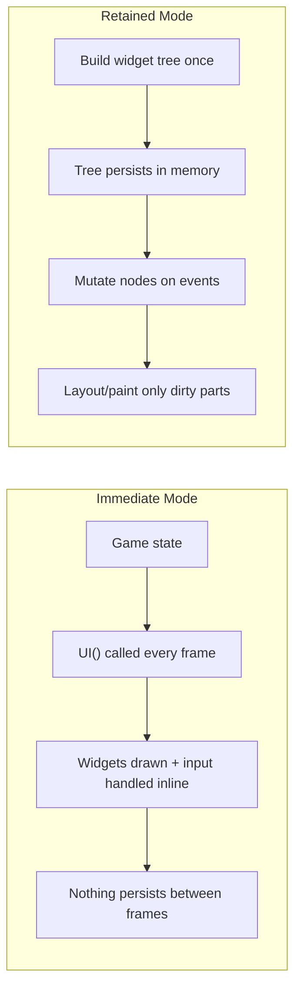
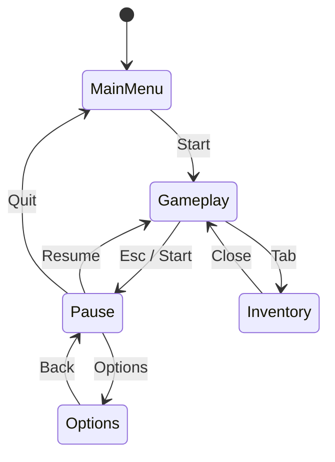
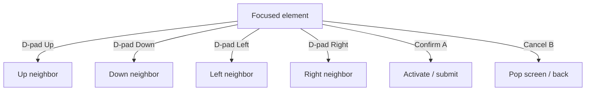
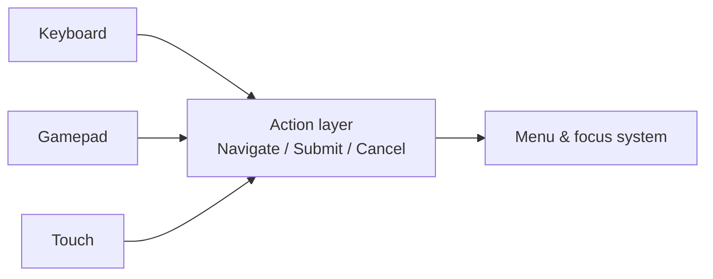

<div class="hero-section" style="background: linear-gradient(135deg, #f093fb 0%, #f5576c 100%); color: white; padding: 3rem 2rem; margin: -2rem -3rem 2rem -3rem; text-align: center;">
  <h1 style="color: white; margin: 0; font-size: 2.5rem;">UI/UX & Menu Architecture</h1>
  <p style="font-size: 1.25rem; margin-top: 1rem; opacity: 0.9;">Immediate vs retained mode, menu state machines, HUDs, responsive scaling, and accessible input navigation</p>
</div>

[Game Development](./) &raquo; UI/UX & Menu Architecture

<div class="hub-intro">
  <p class="lead">A game's user interface is the membrane between the player and the simulation: it surfaces state (health, ammo, objectives), accepts intent (move, confirm, pause), and frames the entire experience through menus and overlays. Unlike application UI, game UI must redraw every frame inside a tight budget, work across mouse, controller, and touch simultaneously, scale from a phone to a 4K TV viewed from a couch, and remain legible and operable for players with a wide range of abilities. This page covers the two architectural paradigms (immediate vs retained mode), menu and screen state management, HUD design, responsive scaling and safe areas, focus-based input navigation, and accessibility.</p>
</div>

<div class="key-insights">
  <div class="insight-card"><i class="fas fa-sync"></i><h4>UI is per-frame, not event-driven</h4><p>Game UI lives inside the render loop. Even "static" menus are rebuilt or re-evaluated every frame, so the cost model is throughput, not idle event handling.</p></div>
  <div class="insight-card"><i class="fas fa-layer-group"></i><h4>Screens are a state machine</h4><p>Menus, pause, inventory, and dialogs form a stack of screens with clear transitions. Modeling them as a stack-based state machine prevents tangled input and focus bugs.</p></div>
  <div class="insight-card"><i class="fas fa-gamepad"></i><h4>Design for focus, not the cursor</h4><p>A controller has no pointer. Every interactive element needs a defined focus order and directional neighbors, or the UI is simply unusable on a gamepad.</p></div>
  <div class="insight-card"><i class="fas fa-universal-access"></i><h4>Accessibility is core, not a toggle</h4><p>Safe areas, scalable text, remappable input, and colorblind-safe coding are baseline requirements that also make the UI better for everyone.</p></div>
</div>

## Immediate Mode vs Retained Mode

The first architectural decision in any UI system is *who owns the widget state*. The two answers define the two dominant paradigms.



### Retained Mode

In **retained mode**, the UI is a persistent tree of objects (a *scene graph* or *widget tree*). You construct buttons, panels, and labels once; the framework keeps them in memory, lays them out, and repaints only what changed (the *dirty* subtree). You interact with the UI by mutating that retained state — setting a label's text, toggling a node's visibility, attaching an event callback.

- **Examples:** Unity uGUI and UI Toolkit, Unreal UMG/Slate, the browser DOM, Godot's `Control` node tree.
- **Strengths:** Efficient for largely static UI (only dirty regions repaint), natural data binding, designer-friendly visual editors, accessibility hooks attach to persistent nodes.
- **Costs:** State lives in two places (your game model *and* the widget tree), which must be kept in sync. The tree, layout caches, and event subscriptions consume memory and add structural complexity.

```csharp
// Retained mode (Unity uGUI-style): widgets persist, you mutate them
public class HealthBar : MonoBehaviour {
    [SerializeField] Image fill;       // created once in the editor
    [SerializeField] TMP_Text label;

    // Called only when health changes, NOT every frame
    public void OnHealthChanged(int current, int max) {
        fill.fillAmount = (float)current / max;   // mutate retained node
        label.text = $"{current}/{max}";
    }
}
```

### Immediate Mode

In **immediate mode**, there is no persistent widget tree. Every frame you *call* the UI into existence: `if (Button("Start")) StartGame();` both draws the button and reports whether it was clicked, in one call, this frame. The library holds almost no per-widget state between frames — interaction state (which widget is hovered/active) is keyed by an ID derived from call order or an explicit label.

- **Examples:** Dear ImGui, Nuklear, Unity's legacy `OnGUI`/IMGUI, most debug overlays and editor tooling.
- **Strengths:** UI code lives next to game code with no synchronization layer; trivial to add/remove elements conditionally; ideal for debug menus, tools, and rapidly changing data.
- **Costs:** Rebuilding and re-laying-out every frame costs CPU even when nothing changed; complex layout and animation are awkward; accessibility/screen-reader integration is hard because there is no stable node to expose.

```cpp
// Immediate mode (Dear ImGui-style): widget is "drawn" and queried in one call
void DrawPauseMenu(GameState& gs) {
    ImGui::Begin("Pause");
    if (ImGui::Button("Resume"))  gs.Resume();
    if (ImGui::Button("Options")) gs.PushScreen(Screen::Options);
    if (ImGui::Button("Quit"))    gs.QuitToMenu();
    ImGui::SliderFloat("Volume", &gs.settings.volume, 0.0f, 1.0f);
    ImGui::End();   // no widget objects survive this function
}
```

### Choosing Between Them

| Concern | Immediate Mode | Retained Mode |
|---------|----------------|---------------|
| State ownership | Game owns all state | Widget tree owns UI state |
| Per-frame cost | Re-builds every frame | Repaints dirty regions only |
| Best for | Debug tools, fast-changing data, prototypes | Shipping player-facing UI, complex layouts |
| Animation/transitions | Manual | First-class |
| Designer tooling | Minimal | Strong (visual editors) |
| Accessibility integration | Difficult (no stable nodes) | Natural (persistent node = accessible element) |

A common production pattern is **both**: a retained-mode framework (UMG, uGUI, Godot `Control`) for the shipping player UI, and an immediate-mode overlay (ImGui) for developer debug menus and live tuning. The "cost" of immediate mode is amortized cheaply for a debug overlay but becomes significant for a large, animated, accessibility-rich main menu — which is why player-facing UI almost always uses retained mode.

## Menu & Screen State Management

A game is rarely showing just one screen. It shows the HUD, then a pause menu over it, then an options sub-menu over that, then a "discard changes?" confirmation dialog over *that*. Modeling these as ad-hoc booleans (`isPaused`, `isOptionsOpen`) produces tangled input routing and focus bugs. The robust model is a **screen stack** — a stack-based state machine.



### The Screen Stack

Each screen is an object that can update, draw, and consume input. The stack defines layering and input routing:

- **Top of stack receives input first.** A modal dialog at the top consumes input so screens beneath cannot act on it.
- **Transparency controls drawing.** A pause menu may request that the screen *below* it still draws (the frozen gameplay behind a dimming overlay), while a full main menu does not.
- **Push / Pop / Replace** are the core operations: `Push(Options)` opens a sub-menu, `Pop()` returns, `Replace(Gameplay)` swaps without growing the stack.

```cpp
struct Screen {
    virtual void Update(float dt) {}
    virtual void Draw() {}
    virtual bool HandleInput(const Input& in) { return false; } // true = consumed
    virtual bool BlocksUpdateBelow() const { return true; }     // pause freezes gameplay
    virtual bool BlocksDrawBelow()  const { return false; }     // overlay vs full screen
};

class ScreenStack {
    std::vector<std::unique_ptr<Screen>> stack_;
public:
    void Push(std::unique_ptr<Screen> s) { stack_.push_back(std::move(s)); }
    void Pop() { if (!stack_.empty()) stack_.pop_back(); }

    void Update(float dt) {
        // Update from the top down; stop when a screen blocks those below.
        for (int i = (int)stack_.size() - 1; i >= 0; --i) {
            stack_[i]->Update(dt);
            if (stack_[i]->BlocksUpdateBelow()) break;
        }
    }

    void HandleInput(const Input& in) {
        // Top screen gets first refusal; a consumed event stops propagation.
        for (int i = (int)stack_.size() - 1; i >= 0; --i)
            if (stack_[i]->HandleInput(in)) break;
    }

    void Draw() {
        // Find the lowest screen that must draw, then paint bottom-to-top.
        int start = 0;
        for (int i = (int)stack_.size() - 1; i >= 0; --i)
            if (stack_[i]->BlocksDrawBelow()) { start = i; break; }
        for (int i = start; i < (int)stack_.size(); ++i)
            stack_[i]->Draw();
    }
};
```

This single abstraction cleanly handles the recurring hard cases: a confirmation dialog *over* the options menu *over* a paused game all route input and draw correctly, and `Pop()` always returns to exactly the right previous context.

### Transitions and Lifecycle

Screens need lifecycle hooks so they can allocate/free resources and animate:

- **`OnEnter` / `OnExit`** — load assets, subscribe to events, start music; tear down on exit.
- **`OnSuspend` / `OnResume`** — fired when another screen is pushed on top or popped off. A pause menu pushed over gameplay *suspends* gameplay (stop accepting input) without exiting it.
- **Transition animations** — slide/fade screens in and out. A screen is briefly in a `TransitioningIn`/`TransitioningOut` state during which it ignores input, preventing a "double confirm" while a menu is still animating in.

## HUD Design

The **Heads-Up Display** is the persistent, non-modal overlay that communicates live game state without interrupting play: health, ammo, minimap, objectives, reticle, damage indicators. Good HUD design is an exercise in *signal at a glance* — the player should absorb critical information through peripheral vision while focused on the action.

### Diegetic vs Non-Diegetic

UI elements are classified by their relationship to the game's fiction. This framing (popularized by analyses of *Dead Space* and *Far Cry 2*) guides where information should live:

| Type | In the story world? | On the 2D screen plane? | Example |
|------|---------------------|-------------------------|---------|
| Non-diegetic | No | Yes | Classic health bar in the corner |
| Diegetic | Yes | No | Ammo counter on the gun model (Dead Space) |
| Spatial | No | No (rendered in 3D space) | Floating waypoint marker, enemy outline |
| Meta | No | Yes | Blood splatter on the screen edges when hurt |

Diegetic and spatial UI increase immersion by embedding information in the world; non-diegetic UI maximizes clarity and is easier to read at a glance. Most games mix them: a non-diegetic minimap, a meta damage vignette, and spatial objective markers.

### Information Hierarchy and Cost

Every HUD element competes for the player's limited attention and a finite slice of screen real estate. Apply a strict hierarchy:

- **Always-on, glanceable:** health, ammo, reticle — placed in stable, learned positions (corners, screen center).
- **Contextual, transient:** "Press E to open", combo counters, pickup notifications — appear only when relevant, then fade.
- **On-demand:** full map, inventory, quest log — moved to dedicated screens (the menu stack), not the HUD.

A useful budget heuristic: the HUD should be **legible when ignored**. If the player has to stop and parse it, it has failed. Prefer position and color/shape changes (which the visual system processes pre-attentively) over text the player must read.

### Decoupling HUD from Simulation

The HUD should *observe* game state, never drive it, and should update on change rather than poll every frame. An event/observer pattern keeps the HUD a thin presentation layer:

```csharp
// Publisher: the simulation raises events; it knows nothing about UI.
public class Health {
    public event Action<int,int> Changed;   // (current, max)
    int current, max;
    public void Damage(int amount) {
        current = Mathf.Max(0, current - amount);
        Changed?.Invoke(current, max);       // notify observers
    }
}

// Subscriber: the HUD reacts. No per-frame polling of the model.
public class HealthWidget : MonoBehaviour {
    [SerializeField] Health health;
    [SerializeField] Image fill;
    void OnEnable()  => health.Changed += Refresh;
    void OnDisable() => health.Changed -= Refresh;
    void Refresh(int cur, int max) => fill.fillAmount = (float)cur / max;
}
```

This decoupling means the same simulation can drive a different HUD per platform (a denser PC HUD, a sparser controller HUD) and makes the HUD trivially testable in isolation.

## Responsive Scaling & Safe Areas

A shipping game UI must look correct on a 16:9 monitor, a 21:9 ultrawide, a 4:3 retro display, a notched phone, and a TV that crops its edges. This is a layout problem with two distinct axes: **resolution/density scaling** and **aspect-ratio adaptation**.

### Anchors and Reference Resolution

The foundational tool is **anchor-based layout**: each element is anchored to a point or edge of its parent rather than positioned with absolute pixels. A health bar anchored to the bottom-left corner stays in the corner at any resolution; a centered title stays centered. Stretch anchors let a panel grow with its parent.

Most engines also use a **reference (design) resolution** — say 1920x1080 — and compute a uniform scale factor for the actual screen. The two common modes:

- **Scale with screen size (uniform):** multiply all UI by a single factor so a button is the same *fraction* of the screen everywhere. Preserves layout; can make text tiny on small/high-DPI screens.
- **Constant physical/pixel size:** keep UI a fixed pixel size, anchoring elements to edges. Keeps text crisp and tappable; leaves more or less empty space at different resolutions.

A robust approach blends both: a uniform scale that **matches width and height by a tunable weight**, so neither dimension is starved on extreme aspect ratios. For a reference resolution $(W_r, H_r)$ and screen $(W_s, H_s)$, a log-blended match (as used by Unity's Canvas Scaler) computes:

$$
s = \exp\!\left( (1 - t)\,\ln\frac{W_s}{W_r} + t\,\ln\frac{H_s}{H_r} \right)
$$

where $t \in [0,1]$ is the **match** weight: $t=0$ scales purely by width, $t=1$ purely by height, and $t=0.5$ balances the two. The DPI-aware pixel size of a UI element is then:

$$
\text{px} = \text{ref\_px} \times s \times \frac{\text{dpi}}{96}
$$

so the same design renders at a consistent *physical* size across displays of different pixel density.

### Aspect Ratio and Pillarboxing

When the screen is wider or taller than the design, you have three choices for the *content* (as opposed to the UI overlay):

- **Expand the view** (show more world) — preferred for gameplay cameras so ultrawide players see more, not stretched.
- **Letterbox/pillarbox** — add bars to preserve a fixed aspect (common for cutscenes and fixed-camera puzzle games).
- **Stretch** — almost never acceptable; distorts circles into ellipses and breaks readability.

UI overlays should generally *anchor to the visible edges* rather than the design rectangle, so the minimap stays pinned to the true corner on an ultrawide instead of floating inward.

### Safe Areas: Notches and TV Overscan

Two physical realities crop the edges of the screen:

- **TV overscan:** historically TVs cropped 5–10% of the image; modern platform guidelines still mandate a **title-safe area** (typically the inner ~90%) for critical UI and an **action-safe area** (~93–95%) for important visuals. Console certification (TRC/TCR) checks this.
- **Mobile notches and cutouts:** phones report an *inset* rectangle (`Screen.safeArea` in Unity, `SafeAreaInsets` on iOS, `WindowInsets` on Android) describing the unobstructed region inside the notch, rounded corners, and home indicator.

The rule is simple: **anchor all interactive and critical elements inside the safe area; let only decorative backgrounds bleed to the physical edge.**

```csharp
// Reposition a panel to the device-reported safe area (Unity, mobile notches).
public class SafeAreaFitter : MonoBehaviour {
    RectTransform rt;
    void Awake() => rt = GetComponent<RectTransform>();
    void Update() {                       // re-run on rotation / resolution change
        Rect safe = Screen.safeArea;      // pixels of the unobstructed rectangle
        Vector2 min = safe.position;
        Vector2 max = safe.position + safe.size;
        min.x /= Screen.width;  min.y /= Screen.height;   // normalize to [0,1]
        max.x /= Screen.width;  max.y /= Screen.height;
        rt.anchorMin = min;               // anchors now hug the safe rectangle
        rt.anchorMax = max;
    }
}
```

## Input & Focus Navigation

A mouse points anywhere; a controller or keyboard does not. Console and TV UIs (and accessibility on every platform) require a **focus model**: at all times exactly one element is *focused*, directional input moves focus between elements, and the confirm button activates the focused element. Designing for focus first — then layering pointer support on top — yields a UI that works everywhere.



### The Focus Graph

Each focusable widget stores explicit (or auto-computed) neighbors: `up`, `down`, `left`, `right`. Pressing a direction moves focus to that neighbor and visually highlights it.

- **Explicit links** give designers full control over non-grid layouts but are tedious to maintain.
- **Geometric auto-navigation** picks the nearest focusable widget in the pressed direction. A robust heuristic scores candidates by combining axial distance with angular deviation so the "most directly in that direction" element wins. For moving right from a widget at the origin to a candidate at offset $(\Delta x, \Delta y)$ with $\Delta x > 0$:

$$
\text{cost} = \Delta x + k \cdot |\Delta y|
$$

with a penalty weight $k > 1$ so the algorithm strongly prefers elements roughly aligned on the axis of travel over ones that are closer but far off-axis. The lowest-cost candidate becomes the new focus.

```csharp
// Geometric directional navigation: choose the best neighbor to the right.
Selectable FindRight(Selectable from, IEnumerable<Selectable> all) {
    Vector2 origin = Center(from);
    Selectable best = null;
    float bestCost = float.MaxValue;
    const float k = 2f;                       // off-axis penalty
    foreach (var s in all) {
        if (s == from || !s.IsInteractable()) continue;
        Vector2 d = Center(s) - origin;
        if (d.x <= 0f) continue;              // must be to the right
        float cost = d.x + k * Mathf.Abs(d.y);
        if (cost < bestCost) { bestCost = cost; best = s; }
    }
    return best;
}
```

### Cross-Device and Hardware Cursor Hand-Off

Modern UIs support all input devices *simultaneously* and switch the visible model on the fly: when the player touches the mouse, show a pointer and hover states; when they touch the stick or D-pad, hide the pointer and show the focus highlight. Key rules:

- **Always keep a valid focus.** When a screen opens, focus a sensible default (the primary action, or the last-selected item) so the controller has somewhere to start.
- **Wrap or clamp at edges** consistently — list menus often wrap top-to-bottom; grids usually clamp.
- **Trap focus inside modals.** A confirmation dialog must not let focus escape to widgets behind it (the same blocking the screen stack already enforces for input).
- **Map confirm/cancel to platform conventions.** The accept and back buttons differ by platform (the A/B swap on Nintendo vs Xbox); read them from a remappable binding, never hardcode.

### Input Abstraction

Route everything through an **input action layer** rather than reading raw buttons in UI code. UI requests semantic actions — `Navigate`, `Submit`, `Cancel`, `TabLeft` — and the binding layer maps keyboard, gamepad, and touch to them. This is what makes remapping (an accessibility requirement, below) possible and keeps menu code identical across platforms.



## Accessibility

Accessibility widens your audience and is increasingly a platform and legal requirement. The strongest accessibility work is *architectural* — built into the UI systems above — not a settings screen bolted on at the end. Map each feature to the systems it touches:

- **Visual.**
  - *Scalable text and UI.* The reference-resolution scaler should also honor a player text-size multiplier; never bake text size into fixed pixels.
  - *Colorblind-safe coding.* Never rely on color alone (red/green ~8% of men cannot distinguish). Pair color with shape, icon, or text; offer Protanopia/Deuteranopia/Tritanopia palettes. Maintain WCAG contrast — body text at a contrast ratio of at least 4.5:1, large text at 3:1.
  - *High-contrast and reduced-motion modes.* Provide a high-contrast theme and a toggle that disables screen shake, parallax, and flashing (also a photosensitivity/seizure safeguard).
  - *Screen-reader / UI narration.* This is far easier in **retained mode**: each persistent node exposes a name, role, and value to the platform accessibility API. Immediate-mode UIs struggle here precisely because they have no stable node to describe.

- **Motor.**
  - *Full input remapping*, enabled by the action layer above — every action rebindable, including UI navigation and confirm/cancel.
  - *Hold-to-toggle and adjustable timing* — convert hold inputs to taps, lengthen or remove quick-time-event windows, slow auto-advancing dialog.
  - *Generous, scalable hit targets* — keep interactive elements above a minimum tappable size (mobile guidelines suggest ~44–48 px), and snap the cursor/focus to them.

- **Cognitive.**
  - *Clear, consistent layout and learned positions* — the same action lives in the same place across screens; the focus highlight is always obvious.
  - *Adjustable text speed, persistent objective reminders, and difficulty/assist modes* (see the [Game Development overview](./)) reduce load without compromising the core experience.

- **Auditory.**
  - *Subtitles and closed captions* with adjustable size, background opacity, and speaker labels; *visualized audio cues* (directional damage indicators, on-screen icons for important sounds) so critical information is never audio-only.

A practical test: navigate the entire UI with a controller, with the pointer disabled, at maximum text size, in a colorblind palette, with audio muted. If every screen is fully operable under those constraints, the architecture is sound — and it will be more pleasant for *all* players as a result.

## Key Takeaways

<div class="takeaway-grid">
  <div class="takeaway-card"><h4>Retained for the game, immediate for tools</h4><p>Ship player-facing UI in a retained-mode framework (UMG, uGUI, Godot Control) and use immediate mode (ImGui) for debug overlays. The choice is about who owns widget state.</p></div>
  <div class="takeaway-card"><h4>Screens are a stack</h4><p>Model menus, pause, inventory, and dialogs as a screen stack with clear input routing and draw-below/update-below rules. It dissolves the hardest UI bugs.</p></div>
  <div class="takeaway-card"><h4>HUDs observe, never drive</h4><p>Decouple the HUD from the simulation with events; keep it legible-when-ignored and classify elements as diegetic, spatial, meta, or non-diegetic by intent.</p></div>
  <div class="takeaway-card"><h4>Anchor to safe areas</h4><p>Use anchors plus a reference resolution to scale across displays, and pin all critical UI inside the title-safe / device safe-area rectangle so notches and overscan never clip it.</p></div>
  <div class="takeaway-card"><h4>Design for focus first</h4><p>Build a focus graph with directional navigation and route input through a semantic action layer so controller, keyboard, and touch all work — and remapping is possible.</p></div>
  <div class="takeaway-card"><h4>Accessibility is architecture</h4><p>Scalable text, colorblind-safe coding, remappable input, captions, and screen-reader nodes belong in the core UI systems, not in a bolted-on options menu.</p></div>
</div>

## See Also
- [Game Development](./) - The hub: engines, the game loop, ECS, and core systems
- [3D Graphics & Rendering](../graphics/3d-rendering.html) - How UI is composited into the frame each render pass
- [GPU Optimization](../optimization/gpu-optimization.html) - Frame budgets and draw-call cost that per-frame UI shares
- [VR/AR Development](../vr-ar/) - Spatial (world-space) UI and the strict comfort constraints of immersive interfaces
- [Game AI](../ai-ml/game-ai.html) - State machines, the same pattern that underpins the menu screen stack
