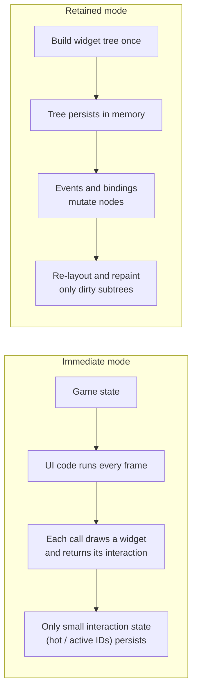
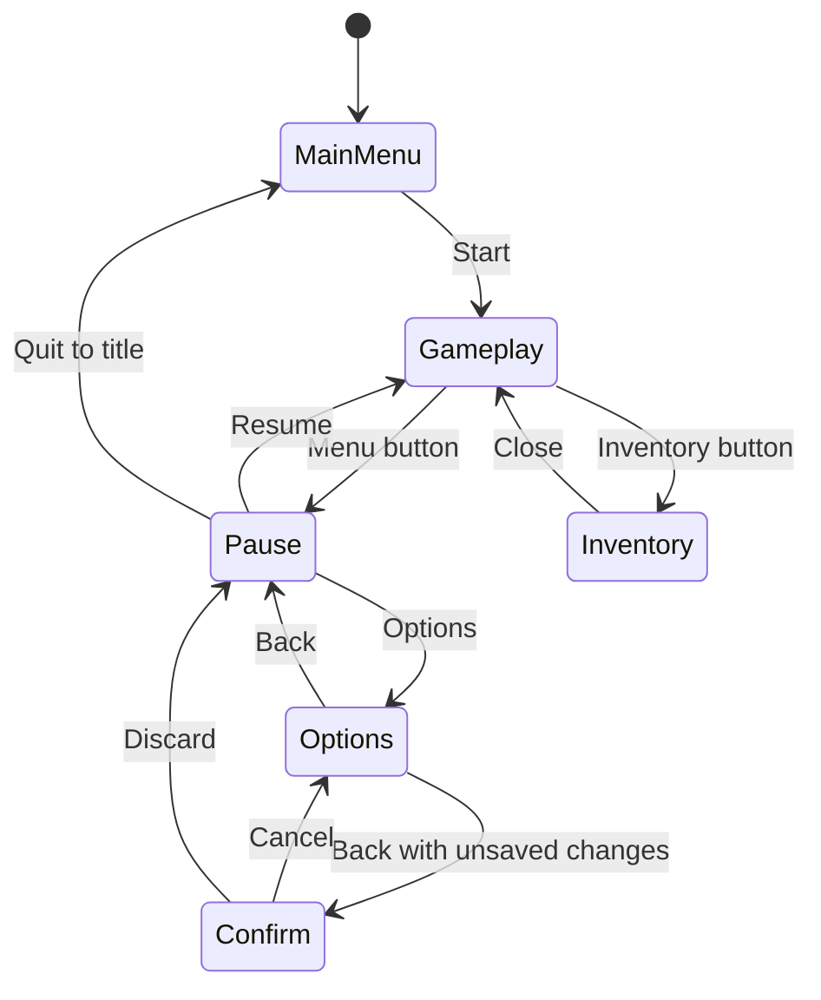
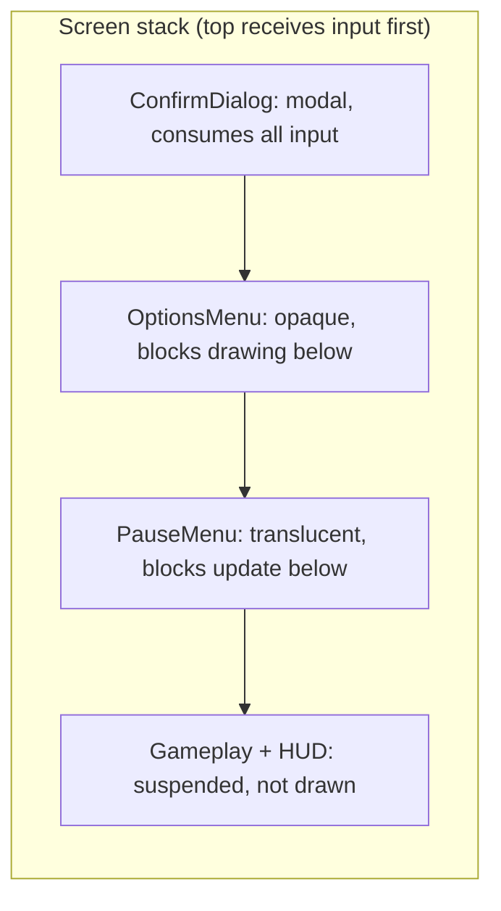
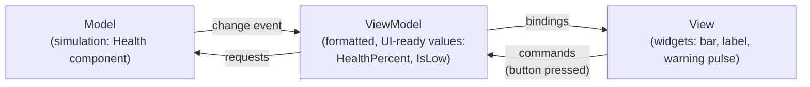
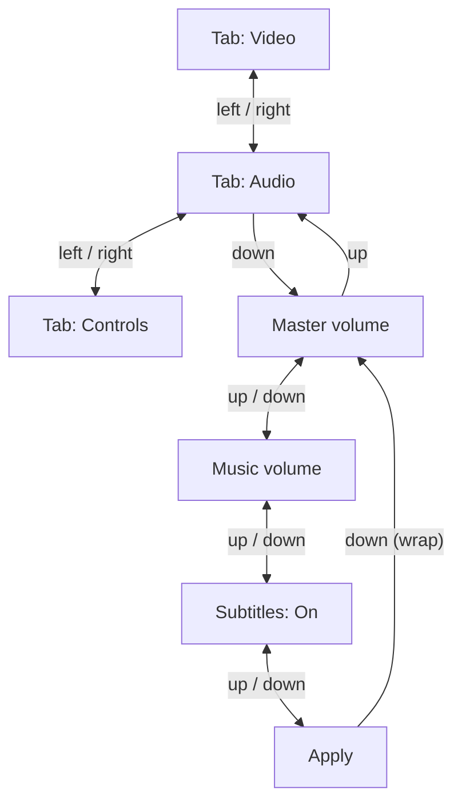
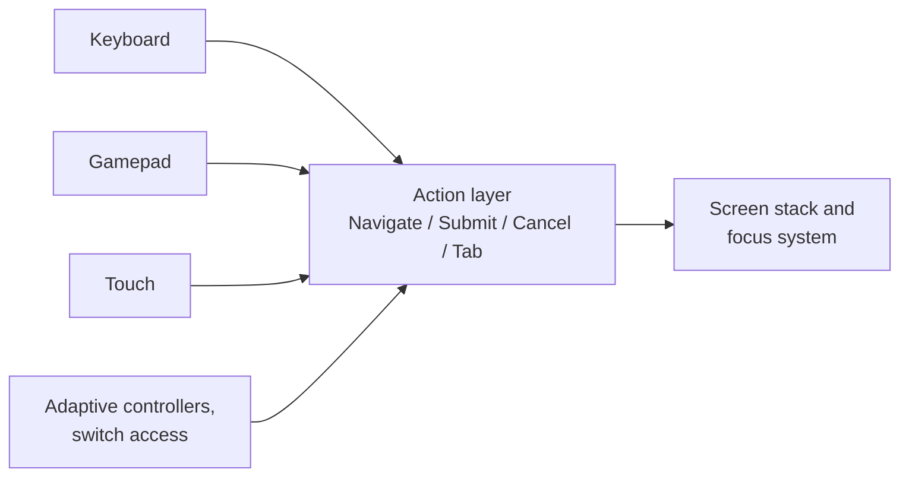

# UI/UX & Menu Architecture

[Game Development](./) &raquo; UI/UX & Menu Architecture

A game's **user interface** surfaces simulation state (health, ammunition, objectives), accepts player intent (navigate, confirm, pause), and frames the experience through menus and overlays. Game UI differs from application UI in several ways: it is drawn inside the frame budget alongside the game, must work with mouse, gamepad, and touch — often in the same session — must scale from a handheld screen to a television viewed from across a room, and must remain usable for players with a wide range of abilities.

This page covers the two architectural paradigms (immediate and retained mode) and current engine frameworks; managing menus as a screen stack; HUD design and binding the HUD to game state; resolution scaling and safe areas; focus-based navigation for controllers; localization; UI performance; and accessibility.

## Immediate Mode vs Retained Mode

The first architectural question for any UI system is **who owns widget state**.



### Retained mode

In **retained mode** the UI is a persistent tree of widget objects. Buttons, panels, and labels are created once; the framework keeps them in memory, lays them out, and redraws only what has changed. Code interacts with the UI by mutating that tree — setting text, toggling visibility, binding a property, attaching a callback.

- **Examples:** Unity UI Toolkit and uGUI, Unreal UMG (built on Slate), Godot `Control` nodes, the browser DOM, and middleware such as Noesis GUI and Coherent Gameface.
- **Strengths:** efficient for mostly static screens; supports data binding, animation, and visual editors; persistent nodes give accessibility APIs something to describe.
- **Costs:** state exists in two places — the game model and the widget tree — and must be kept in sync; trees, layout caches, and subscriptions cost memory and structural complexity.

```csharp
// Retained mode (Unity uGUI): widgets persist; code mutates them on change.
public class HealthBar : MonoBehaviour
{
    [SerializeField] Image fill;         // authored once in the editor
    [SerializeField] TMP_Text label;

    public void OnHealthChanged(int current, int max)   // called on change, not per frame
    {
        fill.fillAmount = (float)current / max;
        label.text = $"{current}/{max}";
    }
}
```

### Immediate mode

In **immediate mode** there is no persistent widget tree. Each frame the code calls the UI into existence: `if (Button("Start")) StartGame();` both draws the button and reports whether it was clicked this frame. The library keeps only minimal state between frames, such as which widget is hovered or active, keyed by an ID derived from labels or call position.

- **Examples:** Dear ImGui, Nuklear, egui, Unity's legacy IMGUI (`OnGUI`), and most debug overlays and editor tools.
- **Strengths:** UI code lives beside the data it shows, with no synchronization layer; conditional UI is trivial; ideal for debug menus, tools, and rapidly changing data.
- **Costs:** layout is rebuilt every frame even when nothing changed; rich layout, styling, and animation are awkward; screen-reader integration is difficult because there are no stable nodes to expose.

```cpp
// Immediate mode (Dear ImGui): each call draws a widget and returns its state.
void DrawDebugPanel(GameState& gs)
{
    ImGui::Begin("Debug");
    if (ImGui::Button("Respawn player")) gs.RespawnPlayer();
    ImGui::Checkbox("God mode", &gs.cheats.godMode);
    ImGui::SliderFloat("Time scale", &gs.timeScale, 0.0f, 4.0f);
    ImGui::Text("Entities: %d", gs.EntityCount());
    ImGui::End();   // no widget objects survive this function
}
```

### Choosing between them

| Concern | Immediate mode | Retained mode |
|---------|----------------|---------------|
| State ownership | Game owns all state | Widget tree owns UI state |
| Per-frame cost | Rebuilds every frame | Updates only dirty regions |
| Best suited to | Debug tools, editors, prototypes | Shipping player-facing UI |
| Animation and transitions | Manual | Built in |
| Designer tooling | Minimal | Visual editors, style sheets |
| Accessibility | Difficult (no stable nodes) | Natural (each node maps to an accessible element) |

The usual production arrangement uses **both**: a retained-mode framework for everything the player sees, and an immediate-mode overlay (typically Dear ImGui) for developer menus, live tuning, and in-game inspectors that are compiled out of shipping builds.

### Engine frameworks

| Engine | Player-facing UI | Notes |
|--------|------------------|-------|
| **Unity 6** | **UI Toolkit** (UXML layout, USS styling, runtime data binding); uGUI (Canvas-based, still supported) | UI Toolkit is the recommended system for new runtime UI. Unity 6.2 added world-space UI Toolkit panels; Unity 6.3 added UI Shader Graph support, USS filters, and SVG import as a core module. uGUI remains common for world-space and heavily animated UI in existing projects. |
| **Unreal Engine 5** | **UMG** widgets (on Slate); the **CommonUI** plugin; the **UMG ViewModel** (MVVM) plugin | CommonUI supplies activatable widget stacks, layered input routing, gamepad navigation, and platform-specific button icons — effectively a production implementation of the screen stack described below. |
| **Godot 4** | `Control` node tree with containers and themes | Godot 4.5 added experimental screen-reader support through AccessKit, a `FoldableContainer` node, and recursive overrides of mouse and focus behavior. |
| **Custom engines** | Dear ImGui (tools); RmlUi, Noesis GUI, Coherent Gameface, or in-house retained frameworks | HTML/CSS-based middleware lets UI artists use web tooling. |

## Menu & Screen State Management

A game rarely shows one screen at a time. It shows the HUD, then a pause menu over it, then an options menu over that, then a "discard changes?" dialog over the options menu. Tracking this with independent flags (`isPaused`, `isOptionsOpen`) produces tangled input routing and focus bugs. The robust model is a **screen stack**.



### The screen stack

Each screen can update, draw, and handle input; the stack decides layering and routing:



- **The top screen receives input first.** A modal dialog consumes input so screens beneath cannot react.
- **Screens declare whether lower screens keep drawing and updating.** A pause menu is translucent (the frozen game remains visible) but stops gameplay updates; a full-screen menu blocks drawing below it to save GPU time.
- **Push, Pop, and Replace** are the core operations. `Push(Options)` opens a submenu, `Pop()` returns to exactly the previous context, and `Replace(Gameplay)` swaps without growing the stack.

```cpp
struct Screen {
    virtual ~Screen() = default;
    virtual void Update(float dt) {}
    virtual void Draw() {}
    virtual bool HandleInput(const InputEvent& e) { return false; } // true = consumed
    virtual bool BlocksUpdateBelow() const { return true; }         // e.g. pause freezes gameplay
    virtual bool BlocksDrawBelow()   const { return false; }        // overlay vs full screen
    virtual void OnEnter() {}   virtual void OnExit() {}
    virtual void OnSuspend() {} virtual void OnResume() {}
};

class ScreenStack {
    std::vector<std::unique_ptr<Screen>> stack_;
public:
    void Push(std::unique_ptr<Screen> s) {
        if (!stack_.empty()) stack_.back()->OnSuspend();
        s->OnEnter();
        stack_.push_back(std::move(s));
    }
    void Pop() {
        if (stack_.empty()) return;
        stack_.back()->OnExit();
        stack_.pop_back();
        if (!stack_.empty()) stack_.back()->OnResume();
    }
    void Update(float dt) {               // top down; stop at the first blocker
        for (int i = (int)stack_.size() - 1; i >= 0; --i) {
            stack_[i]->Update(dt);
            if (stack_[i]->BlocksUpdateBelow()) break;
        }
    }
    void HandleInput(const InputEvent& e) {
        for (int i = (int)stack_.size() - 1; i >= 0; --i)
            if (stack_[i]->HandleInput(e)) break;   // consumed: stop propagation
    }
    void Draw() {                         // find lowest visible screen, paint bottom-up
        int start = 0;
        for (int i = (int)stack_.size() - 1; i >= 0; --i)
            if (stack_[i]->BlocksDrawBelow()) { start = i; break; }
        for (int i = start; i < (int)stack_.size(); ++i)
            stack_[i]->Draw();
    }
};
```

In a real implementation, `Push` and `Pop` requested during `Update` or `HandleInput` should be **deferred** until the end of the frame, since modifying the vector while iterating over it invalidates the loop.

### Lifecycle and transitions

- **`OnEnter` / `OnExit`** — load assets, subscribe to events, start music; release them on exit.
- **`OnSuspend` / `OnResume`** — fired when another screen is pushed above or popped off. Suspension differs from exit: the pause menu suspends gameplay without destroying it.
- **Transition states** — while a screen animates in or out it ignores input, preventing a double confirm from reaching a menu that is still sliding into view.
- **Focus restoration** — on resume, return focus to the element that was focused when the screen was suspended.

Many games use several stacks or **layers** — for example Game, GameMenu, Menu, and Modal — so that a system notification or controller-disconnect prompt can appear above everything without disturbing the menu stack beneath. Unreal's CommonUI and Lyra sample project are organized this way.

## HUD Design

The **heads-up display** is the persistent, non-modal overlay that reports live state without interrupting play: health, ammunition, minimap, objectives, reticle, damage indicators. Its goal is information at a glance, absorbed through peripheral vision while attention stays on the action.

### Diegetic and non-diegetic UI

UI elements are commonly classified by their relationship to the game world, a framework popularized by analyses of *Dead Space* and *Far Cry 2*:

| Type | Exists in the game world? | Drawn on the screen plane? | Example |
|------|:-:|:-:|---------|
| Non-diegetic | No | Yes | Health bar in a screen corner |
| Diegetic | Yes | No | Ammunition counter on the weapon model; health shown on the character's suit |
| Spatial | No | No (placed in 3D) | Floating waypoint marker, enemy outline |
| Meta | No | Yes | Blood or frost on the screen edges when hurt |

Diegetic and spatial UI improve immersion; non-diegetic UI is the clearest and fastest to read. Most games mix them. In VR, non-diegetic screen-space UI is uncomfortable and usually replaced by diegetic and spatial elements (see [VR/AR Development](../vr-ar/)).

### Information hierarchy

Every element competes for limited attention and screen space:

- **Always visible:** health, ammunition, reticle — in stable, learned positions.
- **Contextual:** interaction prompts, combo counters, pickup notifications — shown when relevant, then faded.
- **On demand:** full map, inventory, quest log — moved to screens on the menu stack, not the HUD.

A good HUD is **legible when ignored**. If the player must stop and read it, it has failed. Prefer changes in position, size, color, and shape — which the visual system processes pre-attentively — over text. Offer HUD customization (element opacity, scale, and toggles); it serves both preference and accessibility.

### Binding the HUD to game state

The HUD should **observe** game state and never drive it, updating when values change rather than polling every frame. The model-view-viewmodel (MVVM) pattern — supported directly by Unity UI Toolkit runtime binding and Unreal's UMG ViewModel plugin — formalizes this:



A minimal observer version in Unity:

```csharp
// Simulation raises events and knows nothing about UI.
public class Health
{
    public event Action<int, int> Changed;       // (current, max)
    int current, max;

    public void Damage(int amount)
    {
        current = Math.Max(0, current - amount);
        Changed?.Invoke(current, max);
    }
}

// HUD subscribes; no per-frame polling of the model.
public class HealthWidget : MonoBehaviour
{
    [SerializeField] Image fill;
    Health health;

    public void Bind(Health h) { Unbind(); health = h; health.Changed += Refresh; }
    void Unbind() { if (health != null) health.Changed -= Refresh; }
    void OnDestroy() => Unbind();                // avoid dangling subscriptions

    void Refresh(int cur, int max) => fill.fillAmount = (float)cur / max;
}
```

Decoupling lets the same simulation drive different HUD layouts per platform, allows the HUD to be tested in isolation with fake models, and keeps UI code out of gameplay code paths.

## Responsive Scaling & Safe Areas

Shipping UI must look correct on 16:9 monitors, 21:9 and 32:9 ultrawides, 16:10 handhelds, notched and rounded phones, and televisions viewed at a distance. There are two separate problems: **scaling** to resolution and density, and **adapting** to aspect ratio.

### Anchors and reference resolution

**Anchor-based layout** attaches each element to a point or edge of its parent rather than absolute pixel coordinates: a health bar anchored bottom-left stays in that corner at any resolution, and stretch anchors let panels grow with their container.

Engines scale layouts from a **reference resolution** (for example 1920×1080). Two common modes:

- **Scale with screen size:** a single factor keeps each element the same fraction of the screen everywhere. Layout is preserved, but text can become too small on small or distant screens.
- **Constant physical size:** elements keep a fixed physical size (points, dp, or inches), with edges anchored. Text stays readable and touch targets stay tappable; the amount of free space varies.

For screen-size scaling, blending the width and height ratios logarithmically keeps extreme aspect ratios from starving either axis. For reference resolution $(W_r, H_r)$, screen $(W_s, H_s)$, and match weight $t \in [0, 1]$:

$$
s = \exp\left( (1 - t)\,\ln\frac{W_s}{W_r} + t\,\ln\frac{H_s}{H_r} \right) = \left(\frac{W_s}{W_r}\right)^{1-t} \left(\frac{H_s}{H_r}\right)^{t}
$$

$t = 0$ scales by width only, $t = 1$ by height only, and $t = 0.5$ takes the geometric mean. This is the computation behind Unity's Canvas Scaler "Match Width Or Height" mode (implemented with base-2 logarithms, which gives the same result). For landscape games, a match weight near 1 (height) keeps vertical layouts stable as screens get wider.

For constant physical size, the pixel size follows the display density. Using Android's density-independent pixel (1 dp = 1/160 inch) as the unit:

$$
\text{px} = \text{dp} \times \frac{\text{dpi}}{160}
$$

Television UIs add a third factor: viewing distance. A 10-foot interface needs substantially larger minimum text than a desktop interface at the same resolution; many console guidelines specify minimum text heights at 1080p, and the [Xbox Accessibility Guidelines](https://learn.microsoft.com/en-us/gaming/accessibility/guidelines) recommend a player-adjustable text size.

### Aspect ratio

When the screen is wider or taller than the design, the game view can:

- **Expand** — show more of the world; preferred for gameplay cameras, so ultrawide players see more rather than a stretched image (competitive games often cap horizontal field of view to limit the advantage).
- **Letterbox or pillarbox** — add bars to preserve a fixed aspect; common for cutscenes and fixed-camera games.
- **Stretch** — distorts shapes and is almost never acceptable.

UI overlays should anchor to the **visible** edges of the screen, not the design rectangle, so a minimap stays in the true corner on an ultrawide display. Many PC games also offer a "HUD aspect" option that confines the HUD to a centered 16:9 region on ultrawide monitors, which keeps critical information closer to the center of vision.

### Safe areas

Two physical realities hide the edges of the screen:

<figure style="max-width:520px;margin:1em auto">
<svg viewBox="0 0 400 225" role="img" aria-labelledby="safeTitle safeDesc" xmlns="http://www.w3.org/2000/svg" style="width:100%;height:auto;font-family:inherit">
  <title id="safeTitle">Safe-area regions of a display</title>
  <desc id="safeDesc">Nested rectangles: the full display, an action-safe area inset slightly, and a title-safe area inset further, with a phone-style camera cutout at the top.</desc>
  <rect x="2" y="2" width="396" height="221" rx="10" fill="none" stroke="currentColor" stroke-width="2"/>
  <rect x="160" y="2" width="80" height="14" rx="7" fill="currentColor" opacity="0.35"/>
  <rect x="14" y="10" width="372" height="205" fill="none" stroke="currentColor" stroke-width="1.5" stroke-dasharray="6 4" opacity="0.8"/>
  <rect x="22" y="24" width="356" height="178" fill="currentColor" fill-opacity="0.06" stroke="currentColor" stroke-width="1.5"/>
  <text x="200" y="100" text-anchor="middle" font-size="13" fill="currentColor">Title-safe: text, HUD, interactive UI</text>
  <text x="200" y="120" text-anchor="middle" font-size="11" fill="currentColor" opacity="0.8">(inside device safe-area insets and overscan margin)</text>
  <text x="30" y="196" font-size="10" fill="currentColor" opacity="0.8">Action-safe (dashed): important visuals</text>
  <text x="248" y="12" font-size="9" fill="currentColor" opacity="0.8">cutout / notch</text>
  <text x="300" y="218" font-size="9" fill="currentColor" opacity="0.7">full display: backgrounds only</text>
</svg>
<figcaption style="font-size:0.85em;text-align:center">Only backgrounds and decorative art should extend to the physical edge.</figcaption>
</figure>

- **Television overscan.** Televisions historically cropped several percent of the picture at each edge. The traditional broadcast convention reserves an *action-safe* area (about 93% of width and height) for important visuals and a *title-safe* area (about 90%) for text. Modern TVs often show the full image, so consoles let players calibrate the visible area in system settings and expose that calibration (or a recommended margin) to games; platform requirements check that critical UI respects it.
- **Notches, cutouts, rounded corners, and system gestures.** Phones and some handhelds report an unobstructed rectangle: `Screen.safeArea` in Unity, `safeAreaInsets` on iOS `UIView`, `WindowInsets` / `DisplayCutout` on Android. Android 15 made edge-to-edge drawing the default for apps targeting it, so games that previously relied on the system reserving space must now apply insets themselves.

The rule: **place interactive and critical elements inside the safe area; let only backgrounds bleed to the physical edge.**

```csharp
// Unity: fit a RectTransform to the device safe area, updating only on change.
[RequireComponent(typeof(RectTransform))]
public class SafeAreaFitter : MonoBehaviour
{
    RectTransform rt;
    Rect lastSafe;
    Vector2Int lastSize;

    void Awake() { rt = GetComponent<RectTransform>(); Apply(); }

    void Update()   // rotation, resolution, or window changes
    {
        if (Screen.safeArea != lastSafe || lastSize != new Vector2Int(Screen.width, Screen.height))
            Apply();
    }

    void Apply()
    {
        lastSafe = Screen.safeArea;
        lastSize = new Vector2Int(Screen.width, Screen.height);
        Vector2 min = lastSafe.position, max = lastSafe.position + lastSafe.size;
        rt.anchorMin = new Vector2(min.x / Screen.width, min.y / Screen.height);
        rt.anchorMax = new Vector2(max.x / Screen.width, max.y / Screen.height);
    }
}
```

## Input & Focus Navigation

A mouse can point anywhere; a gamepad or keyboard cannot. Console and television UI — and accessible UI on every platform — needs a **focus model**: exactly one element is focused at any time, directional input moves focus between elements, and a confirm action activates the focused element. Designing for focus first and adding pointer support second produces a UI that works on every device.

### The focus graph

Each focusable element has neighbors in each direction. A small options screen might form this graph:



Neighbors are defined in two ways:

- **Explicit links** give designers exact control for irregular layouts but must be maintained when layouts change. Examples: uGUI `Navigation` set to *Explicit*, Godot `focus_neighbor_*` properties, Unreal widget navigation rules.
- **Geometric auto-navigation** chooses the nearest focusable element in the pressed direction. A common heuristic scores candidates by distance along the axis of travel plus a penalty for off-axis distance. Moving right from an element at the origin to a candidate at offset $(\Delta x, \Delta y)$ with $\Delta x > 0$:

$$
\text{cost} = \Delta x + k \, |\Delta y|, \qquad k > 1
$$

The penalty weight $k$ makes a well-aligned element win over one that is closer but far off-axis. Production implementations also measure between element edges rather than centers, so large and small elements are compared fairly.

```csharp
// Geometric navigation: best focusable element to the right of 'from'.
Selectable FindRight(Selectable from, IEnumerable<Selectable> candidates)
{
    const float k = 2f;                         // off-axis penalty
    Vector2 origin = Center(from);
    Selectable best = null;
    float bestCost = float.MaxValue;

    foreach (var s in candidates)
    {
        if (s == from || !s.IsInteractable()) continue;
        Vector2 d = Center(s) - origin;
        if (d.x <= 0f) continue;                // must lie to the right
        float cost = d.x + k * Mathf.Abs(d.y);
        if (cost < bestCost) { bestCost = cost; best = s; }
    }
    return best;
}
```

### Rules for mixed input

Players switch devices mid-session, so the UI should switch presentation to match the most recent input: show a pointer and hover states after mouse movement; hide the pointer and show the focus highlight after stick or D-pad input; show button glyphs for the active controller type.

- **Always have a valid focus.** When a screen opens, focus a sensible default (the primary action, or the previously selected item).
- **Make the focus highlight unmistakable** — not a subtle tint that disappears on some backgrounds.
- **Wrap or clamp consistently.** Vertical lists commonly wrap; grids usually clamp.
- **Trap focus inside modals.** Focus must not escape a dialog to widgets behind it.
- **Follow platform confirm/cancel conventions.** Nintendo platforms place confirm on the right face button, Xbox and PC on the bottom; PlayStation has used Cross as confirm worldwide since the PS5, whereas earlier Japanese releases used Circle. Read these from the input binding layer, never hard-code them.
- **Support scrolling lists** by keeping the focused item in view and virtualizing long lists.

### Input abstraction

UI code should consume semantic **actions** — `Navigate`, `Submit`, `Cancel`, `TabLeft`, `TabRight` — rather than raw buttons. A binding layer (Unity Input System, Unreal Enhanced Input with CommonUI input actions, Godot `InputMap`) maps keyboard, gamepad, and touch onto these actions. This keeps menu code identical across platforms and makes full remapping possible.



## Localization

UI layouts must survive translation. Designing for it from the start is far cheaper than retrofitting:

- **Text expansion.** Translations from English commonly run 20–35% longer (German, French, Russian), and short labels can double. Use auto-sizing containers, allow wrapping, and test with **pseudo-localization** (for example `[!!! Ŝéţţîñĝš !!!]`) to find truncation and hard-coded strings early.
- **Scripts and fonts.** CJK scripts need large glyph sets or dynamic font atlases; Arabic and Hebrew are right-to-left and require bidirectional layout and mirrored UI; Thai and Devanagari require complex shaping. Configure font fallback chains per language.
- **No string concatenation.** Word order differs between languages; use format strings with named arguments and plural rules (ICU MessageFormat or the engine's localization system).
- **Culture-aware formatting** for numbers, dates, and currency.
- **Images with baked-in text** must be localized or avoided.

## UI Performance

UI shares the frame budget with everything else, and a complex menu or a HUD with many dynamic elements can cost several milliseconds.

- **Layout and rebuild cost.** In Unity uGUI, changing any element marks its Canvas dirty and rebuilds that Canvas's batches; split frequently changing elements (timers, health bars) onto separate canvases from static ones. UI Toolkit similarly benefits from avoiding per-frame style and layout changes.
- **Overdraw.** Full-screen translucent panels stacked on top of each other multiply fill cost, which matters most on mobile and at 4K. Screens that fully cover what is beneath should set `BlocksDrawBelow`.
- **Text.** Signed-distance-field text (TextMeshPro, UI Toolkit, Slate) stays sharp across scales; avoid reformatting strings every frame — update text only when the value changes.
- **Hidden is not free.** Invisible widgets may still tick, lay out, or receive events; deactivate or remove them instead.
- **World-space UI** (nameplates, damage numbers) needs pooling and culling like any other entity.

See [GPU Optimization](../optimization/gpu-optimization.html) for draw-call and overdraw analysis.

## Accessibility

Accessibility broadens the audience and is increasingly a platform and legal requirement. In the United States, the CVAA has applied to communication features in games (text and voice chat and their UI) since January 2019. The European Accessibility Act, applicable from 28 June 2025, covers e-commerce and electronic communications services, which can bring in-game stores and chat into scope. Established references include the [Game Accessibility Guidelines](https://gameaccessibilityguidelines.com/), Microsoft's [Xbox Accessibility Guidelines](https://learn.microsoft.com/en-us/gaming/accessibility/guidelines), and the [WCAG 2.2](https://www.w3.org/TR/WCAG22/) criteria for contrast and target size.

The most effective accessibility work is architectural — built into the systems above — rather than a settings screen added at the end.

| Area | Feature | Implementation hook |
|------|---------|---------------------|
| **Vision** | Scalable text and UI | Player text-size multiplier applied by the scaling system; layouts must reflow, not clip |
| | Not relying on color alone | Pair color with shape, icon, pattern, or text; roughly 8% of men and 0.5% of women of Northern European ancestry have color-vision deficiency. Offer palettes or filters for protanopia, deuteranopia, and tritanopia. |
| | Contrast | WCAG AA: at least 4.5:1 for body text, 3:1 for large text and essential UI components; add optional background plates behind HUD text and subtitles |
| | Screen-reader and UI narration | Retained-mode nodes expose name, role, and value to platform APIs: Unity's Accessibility module (iOS, Android, and — since Unity 6.3 — Windows Narrator and macOS VoiceOver), Godot 4.5 AccessKit support, platform text-to-speech on consoles |
| | Reduced motion and photosensitivity | Toggles for screen shake, camera bob, motion blur, and flashing effects; test cutscenes against photosensitive-epilepsy guidance (for example the Harding test) |
| **Motor** | Full remapping | Every action, including UI Navigate, Submit, and Cancel, rebindable through the action layer |
| | Timing | Hold-to-toggle options, adjustable or removable quick-time events, no time-limited menu interactions |
| | Target size | WCAG 2.2: at least 24×24 CSS px (AA) and 44×44 (AAA); Apple recommends 44×44 pt and Material Design 48×48 dp for touch |
| **Cognition** | Consistency | Same actions in the same places on every screen; clear focus highlight; objective reminders; adjustable text speed; assist and difficulty options |
| **Hearing** | Subtitles and captions | Adjustable size and background opacity, speaker names, captions for important sounds; see [Audio Design](audio-design.html#accessibility) |
| | Visualized audio | Directional indicators for off-screen threats and sounds so no critical information is audio-only |

A practical acceptance test: navigate every screen with a controller and the pointer disabled, at maximum text size, with a color-vision filter applied, with audio muted, and with a screen reader on. A UI that works under those constraints is usually better for every player.

## See Also

- [Game Development](./) — engines, the game loop, ECS, and core systems
- [Audio Design](audio-design.html) — captions, audio accessibility, and UI sound feedback
- [Testing & QA](testing-qa.html) — usability playtesting and certification checks on UI requirements
- [3D Graphics & Rendering](../graphics/3d-rendering.html) — how UI is composited into the frame
- [GPU Optimization](../optimization/gpu-optimization.html) — frame budgets, draw calls, and overdraw that UI shares
- [VR/AR Development](../vr-ar/) — spatial UI and comfort constraints in immersive interfaces
- [Game AI](../ai-ml/game-ai.html) — state machines, the same pattern behind the screen stack
