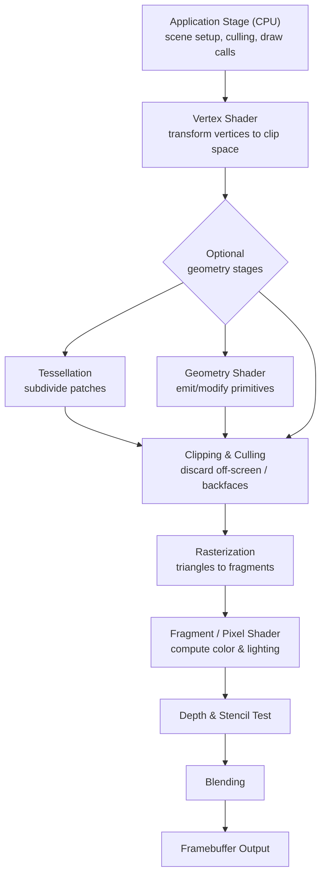
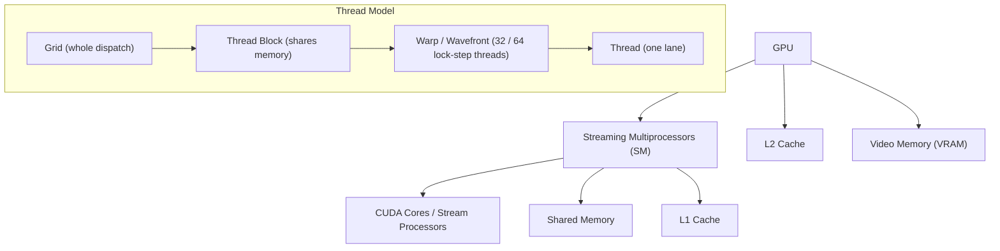

<div class="hero-section" style="background: linear-gradient(135deg, #f093fb 0%, #f5576c 100%); color: white; padding: 3rem 2rem; margin: -2rem -3rem 2rem -3rem; text-align: center;">
  <h1 style="color: white; margin: 0; font-size: 2.5rem;">3D Graphics & Rendering</h1>
  <p style="font-size: 1.25rem; margin-top: 1rem; opacity: 0.9;">Real-time rendering pipelines, shading techniques, and GPU architectures for interactive visuals</p>
</div>

<div class="hub-intro">
  <p class="lead">3D graphics rendering transforms mathematical representations of three-dimensional scenes into two-dimensional images displayed on screen. Modern rendering pipelines combine sophisticated algorithms, parallel GPU architectures, and advanced shading techniques to produce photorealistic or stylized visuals in real-time for games, simulations, and interactive applications.</p>
</div>

<div class="key-insights">
  <div class="insight-card"><i class="fas fa-stream"></i><h4>Pipeline, Not Magic</h4><p>Every frame is a fixed sequence of stages: transform geometry, decide which pixels are covered, then shade them. Understanding the stages tells you where time goes.</p></div>
  <div class="insight-card"><i class="fas fa-bolt"></i><h4>Massively Parallel</h4><p>A GPU runs thousands of threads at once. Performance comes from feeding that parallelism evenly, not from clever serial tricks.</p></div>
  <div class="insight-card"><i class="fas fa-balance-scale"></i><h4>Rasterize vs Trace</h4><p>Rasterization is fast and approximate; ray tracing is accurate and expensive. Modern engines blend both ("hybrid rendering").</p></div>
  <div class="insight-card"><i class="fas fa-tachometer-alt"></i><h4>Budget Driven</h4><p>At 60 FPS you have ~16 ms per frame. Rendering is a constant negotiation between visual fidelity and that fixed time budget.</p></div>
</div>

## The Rendering Pipeline

### Overview

Rendering answers two questions for every pixel: *what surface is visible here?* and *what color is that surface?* The graphics pipeline processes geometry through a fixed sequence of stages to answer them. Vertices flow in at the top, get transformed and assembled into triangles, are converted to candidate pixels (fragments), and finally shaded and composited into the framebuffer.



The CPU-side **application stage** is where your engine lives: it decides what to draw, performs high-level culling, and issues draw calls. Everything below it runs on the GPU. The fixed-function stages (rasterization, depth test, blend) are configured but not programmed; the programmable stages (vertex, fragment, and optionally tessellation/geometry/compute) are where shader code runs.

### Coordinate Spaces

Transformations move vertices through coordinate systems:

| Space | Description | Transform |
|-------|-------------|-----------|
| **Object/Model** | Local coordinates relative to mesh origin | - |
| **World** | Global scene coordinates | Model Matrix |
| **View/Camera** | Relative to camera position | View Matrix |
| **Clip** | Homogeneous coordinates for clipping | Projection Matrix |
| **NDC** | Normalized Device Coordinates [-1,1] | Perspective Division |
| **Screen** | Final pixel coordinates | Viewport Transform |

### Vertex Processing

The vertex shader transforms each vertex:

```glsl
// Basic vertex shader
#version 450

layout(location = 0) in vec3 inPosition;
layout(location = 1) in vec3 inNormal;
layout(location = 2) in vec2 inTexCoord;

layout(binding = 0) uniform Matrices {
    mat4 model;
    mat4 view;
    mat4 projection;
};

layout(location = 0) out vec3 fragPosition;
layout(location = 1) out vec3 fragNormal;
layout(location = 2) out vec2 fragTexCoord;

void main() {
    vec4 worldPos = model * vec4(inPosition, 1.0);
    fragPosition = worldPos.xyz;
    fragNormal = mat3(transpose(inverse(model))) * inNormal;
    fragTexCoord = inTexCoord;

    gl_Position = projection * view * worldPos;
}
```

### Rasterization vs Ray Tracing

The two dominant paradigms for visibility determination take opposite approaches. **Rasterization** projects each triangle onto the screen and asks "which pixels does it cover?" — it iterates over geometry. **Ray tracing** shoots a ray through each pixel and asks "what does this ray hit?" — it iterates over pixels. Rasterization is the basis of real-time graphics because it maps perfectly onto GPU parallelism and avoids expensive scene-wide queries; ray tracing produces physically correct shadows, reflections, and global illumination but historically required offline render farms.

| Aspect | Rasterization | Ray Tracing |
|--------|---------------|-------------|
| Core question | Which pixels does this triangle cover? | What does this ray hit? |
| Iterates over | Geometry (triangles) | Pixels (rays) |
| Cost scaling | Linear in triangles + overdraw | Scales with rays × scene complexity (mitigated by BVH) |
| Shadows | Approximate (shadow maps) | Exact, soft from area lights |
| Reflections | Screen-space / probes (incomplete) | Accurate, off-screen reflections |
| Global illumination | Baked or screen-space approximations | Natural multi-bounce |
| Hardware | Universal, decades of optimization | RT cores (RTX, RDNA2+) needed for real-time |
| Typical use | Primary visibility, real-time base | Shadows, reflections, GI in hybrid pipelines |

<div class="tip-card" markdown="1">
#### Hybrid Rendering Is the Norm
Modern engines (UE5, Frostbite, RED Engine) rasterize primary visibility for speed, then fire rays only for the effects where rasterization fails — shadows, reflections, and indirect light. This pays the ray-tracing cost only where it buys the most visual quality. UE5's Lumen and ray-traced shadows are exactly this strategy.
</div>

## Lighting and Shading

### Lighting Models

**Phong Reflection Model:**

$$I = I_a k_a + \sum_{\text{lights}} I_\ell\Big(k_d\,(\vec{N}\cdot\vec{L}) + k_s\,(\vec{R}\cdot\vec{V})^{\,n}\Big)$$

| Symbol | Meaning |
|--------|---------|
| $I_a,\ k_a$ | Ambient intensity and reflection coefficient |
| $I_\ell$ | Per-light intensity |
| $k_d,\ k_s$ | Diffuse and specular coefficients |
| $\vec{N},\ \vec{L}$ | Surface normal, light direction |
| $\vec{R},\ \vec{V}$ | Reflection direction, view direction |
| $n$ | Shininess exponent |

**Blinn-Phong (Optimized):**
- Uses the halfway vector $\vec{H} = \operatorname{normalize}(\vec{L} + \vec{V})$
- Specular term becomes $k_s\,(\vec{N}\cdot\vec{H})^{\,n}$
- More efficient, with near-identical results

### Physically Based Rendering (PBR)

Modern standard for realistic materials:

**Core Parameters:**
- **Albedo/Base Color**: Surface color without lighting
- **Metallic**: Metal (1.0) vs dielectric (0.0)
- **Roughness**: Microsurface irregularity (0.0 = smooth, 1.0 = rough)
- **Normal Map**: Per-pixel surface detail
- **Ambient Occlusion**: Soft shadowing in crevices

**Cook-Torrance BRDF:**

$$f(\vec{l},\vec{v}) = f_{\text{diffuse}} + f_{\text{specular}}, \qquad f_{\text{specular}} = \frac{D\,F\,G}{4\,(\vec{n}\cdot\vec{l})(\vec{n}\cdot\vec{v})}$$

- $D$ — Normal Distribution Function (GGX / Trowbridge-Reitz)
- $F$ — Fresnel term (Schlick approximation)
- $G$ — Geometry / shadowing-masking (Smith GGX)

### Global Illumination

Simulating indirect lighting:

**Real-Time Techniques:**
- **Screen-Space GI (SSGI)**: Sample nearby pixels
- **Voxel Cone Tracing**: Voxelize scene, trace cones
- **Light Probes**: Precomputed irradiance at points
- **Reflection Probes**: Cubemap captures for reflections
- **Ray Tracing**: Hardware-accelerated path tracing

**Unreal Engine 5 Lumen:**
- Hybrid software/hardware ray tracing
- Infinite bounces for indirect light
- Dynamic, no baking required
- Screen-space fallback for efficiency

## Shadow Rendering

### Shadow Mapping

Standard real-time shadow technique:

1. **Shadow Pass**: Render depth from light's perspective
2. **Main Pass**: Compare fragment depth to shadow map
3. **Result**: In shadow if fragment depth > shadow map depth

**Common Issues and Solutions:**
- **Shadow Acne**: Add depth bias
- **Peter Panning**: Reduce bias, use slope-scaled bias
- **Aliasing**: PCF filtering, variance shadow maps
- **Resolution**: Cascaded shadow maps for large scenes

### Cascaded Shadow Maps (CSM)

Multiple shadow maps for different distance ranges:

```
Near cascade: High resolution, close to camera
Mid cascade: Medium resolution, mid-range
Far cascade: Low resolution, distant objects

Split distances based on:
- Logarithmic distribution
- Practical split scheme (PSSM)
- Custom per-game tuning
```

### Ray-Traced Shadows

Hardware ray tracing benefits:

- Pixel-perfect accuracy
- Natural soft shadows from area lights
- No aliasing or bias issues
- Higher performance cost

## Advanced Rendering Techniques

### Deferred Rendering

Separate geometry from lighting:

**G-Buffer Contents:**
- Position (or depth for reconstruction)
- Normal
- Albedo/Diffuse
- Specular/Roughness
- Emissive (optional)

**Advantages:**
- Decouple geometry complexity from light count
- Efficient many-light scenarios
- Easy post-processing access to scene data

**Disadvantages:**
- High memory bandwidth
- Difficult transparency handling
- MSAA complications

### Forward+ Rendering

Hybrid approach:

1. **Depth Pre-Pass**: Populate depth buffer
2. **Light Culling**: Tile-based light assignment
3. **Shading**: Forward pass with culled light lists

**Benefits:**
- Supports transparency naturally
- Lower memory bandwidth than deferred
- MSAA compatible
- Efficient for moderate light counts

### Clustered Rendering

3D extension of Forward+:

- Divide view frustum into 3D clusters
- Assign lights to clusters (not just tiles)
- Better handling of depth discontinuities
- More uniform light distribution

## Post-Processing Effects

### Screen-Space Effects

**Ambient Occlusion:**
- SSAO (Screen-Space Ambient Occlusion)
- HBAO+ (Horizon-Based)
- GTAO (Ground Truth)

**Reflections:**
- SSR (Screen-Space Reflections)
- Hi-Z tracing for efficiency
- Fallback to probes for missing data

**Motion Blur:**
- Per-object velocity buffers
- Camera motion blur
- Temporal reconstruction

### Color Grading and Tone Mapping

**HDR to LDR Conversion:**

```glsl
// Reinhard tone mapping
vec3 toneMapReinhard(vec3 hdrColor) {
    return hdrColor / (hdrColor + vec3(1.0));
}

// ACES Filmic
vec3 toneMapACES(vec3 x) {
    float a = 2.51;
    float b = 0.03;
    float c = 2.43;
    float d = 0.59;
    float e = 0.14;
    return clamp((x*(a*x+b))/(x*(c*x+d)+e), 0.0, 1.0);
}
```

**Color Grading:**
- LUT (Look-Up Table) based
- Split toning (shadows/highlights)
- Color wheels adjustment
- Film grain and vignette

### Anti-Aliasing

**Techniques Comparison:**

| Method | Quality | Performance | Motion | Transparency |
|--------|---------|-------------|--------|--------------|
| MSAA | Good | Medium | Poor | Good |
| FXAA | Low | Fast | Poor | Good |
| SMAA | Good | Fast | Poor | Good |
| TAA | Excellent | Medium | Good | Medium |
| DLSS/FSR | Excellent | Fast* | Good | Good |

*Upscaling provides net performance gain

### Temporal Anti-Aliasing (TAA)

Modern standard approach:

1. Jitter projection matrix each frame
2. Accumulate samples over time
3. Reject samples using motion vectors
4. Apply neighborhood clamping

**Challenges:**
- Ghosting on fast motion
- Loss of fine detail
- Requires motion vectors

## GPU Architecture

### Parallelism Model

GPUs execute thousands of threads simultaneously. Hardware is organized as a hierarchy of compute units, and the software thread model mirrors it:



Threads within a **warp** execute in lock-step (SIMT). When threads in a warp take different branches, the GPU runs *both* paths and masks the inactive lanes — this is **warp divergence**, the reason branchy shaders are slow. Keeping all 32/64 lanes doing the same work is the single most important shader-performance principle.

### Memory Hierarchy

Optimizing for GPU memory access:

| Memory Type | Latency | Scope | Size |
|-------------|---------|-------|------|
| Registers | 1 cycle | Thread | ~256 per thread |
| Shared Memory | ~20 cycles | Block | 48-96 KB |
| L1 Cache | ~20 cycles | SM | 48-128 KB |
| L2 Cache | ~200 cycles | Device | 4-6 MB |
| VRAM | ~400 cycles | Global | 8-24 GB |

### Graphics APIs

**Vulkan:**
- Low-level, explicit control
- Cross-platform
- Best for engine developers

**DirectX 12:**
- Windows/Xbox exclusive
- Similar to Vulkan
- Better tooling ecosystem

**Metal:**
- Apple platforms
- Excellent iOS/macOS integration
- Swift/Objective-C friendly

**WebGPU:**
- Browser-based 3D
- Modern API design
- Growing adoption

## Optimization Techniques

### Culling

Eliminate invisible geometry:

- **Frustum Culling**: Outside camera view
- **Occlusion Culling**: Hidden behind other objects
- **Backface Culling**: Faces pointing away from camera
- **Distance Culling**: Beyond view distance
- **Small Object Culling**: Sub-pixel geometry

### Level of Detail (LOD)

Reduce complexity with distance:

```
LOD 0: Full detail (0-50m)
LOD 1: 50% triangles (50-100m)
LOD 2: 25% triangles (100-200m)
LOD 3: 10% triangles (200m+)
Billboard: 2D impostor (very far)
```

**Modern Approaches:**
- **Nanite** (UE5): Virtualized geometry, automatic LOD
- **Mesh Shaders**: GPU-driven LOD selection
- **Continuous LOD**: Smooth transitions

### Batching and Instancing

Reduce draw calls:

- **Static Batching**: Combine static meshes
- **Dynamic Batching**: Runtime combination of small meshes
- **GPU Instancing**: Single draw call, multiple instances
- **Indirect Drawing**: GPU-driven draw commands

## Key Takeaways

<div class="takeaway-grid">
  <div class="takeaway-card"><h4>The pipeline is fixed</h4><p>Vertices → triangles → fragments → framebuffer. Knowing which stage dominates a frame is the first step in optimizing it.</p></div>
  <div class="takeaway-card"><h4>Rasterize first, trace selectively</h4><p>Rasterization wins on speed; ray tracing wins on accuracy. Hybrid pipelines rasterize visibility and trace only shadows, reflections, and GI.</p></div>
  <div class="takeaway-card"><h4>PBR is the material standard</h4><p>Albedo, metallic, and roughness drive a physically grounded Cook-Torrance BRDF that behaves consistently under any lighting.</p></div>
  <div class="takeaway-card"><h4>Draw calls and overdraw cost</h4><p>Batching, instancing, LODs, and culling exist to reduce CPU-side draw calls and wasted GPU shading.</p></div>
  <div class="takeaway-card"><h4>Avoid warp divergence</h4><p>The GPU shades 32/64 threads in lock-step. Branchy shaders and uneven work waste lanes — keep work uniform.</p></div>
  <div class="takeaway-card"><h4>TAA + upscaling are default</h4><p>Temporal accumulation (TAA) plus DLSS/FSR now deliver the best quality-per-millisecond for anti-aliasing.</p></div>
</div>

## See Also
- [Game Development](../gamedev/) - Game engines, physics, and multiplayer systems
- [Performance Optimization](../optimization/) - GPU profiling and optimization techniques
- [Unreal Engine](../technology/unreal.html) - UE5 Nanite, Lumen, and MetaSounds
- [VR/AR Development](../vr-ar/) - Immersive rendering and XR techniques
- [Physics Documentation](../physics/) - Mathematical foundations
