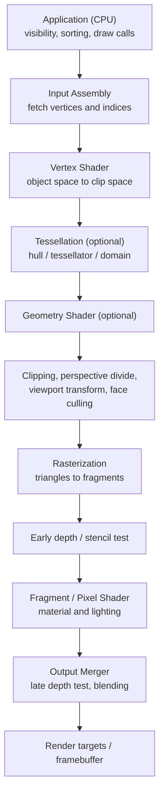
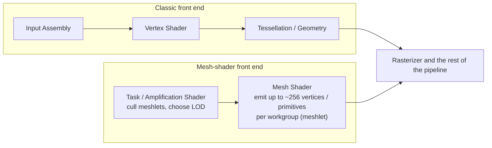
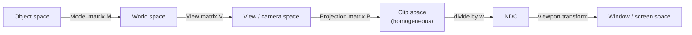
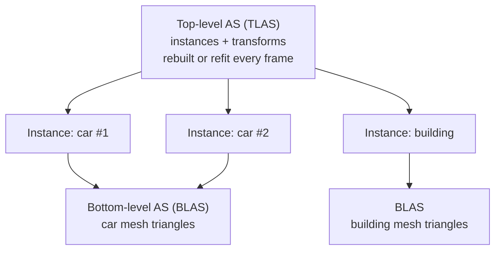
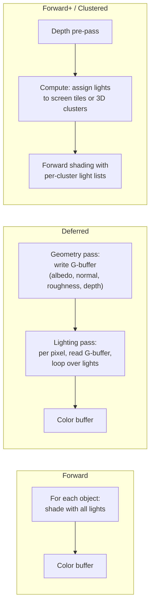
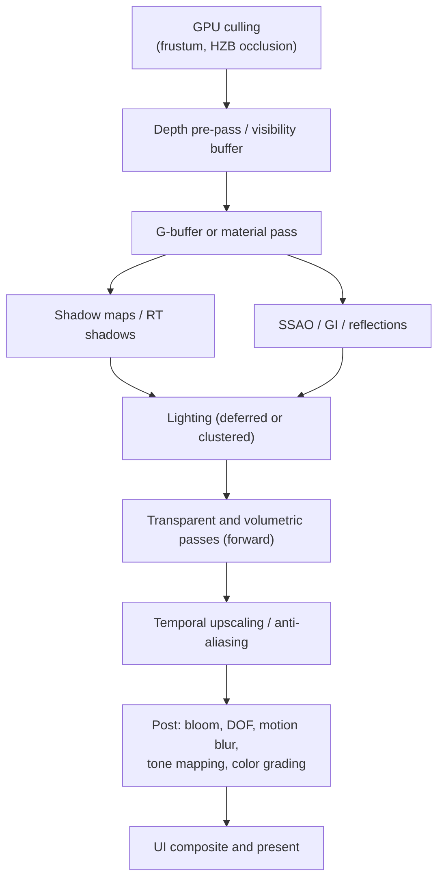
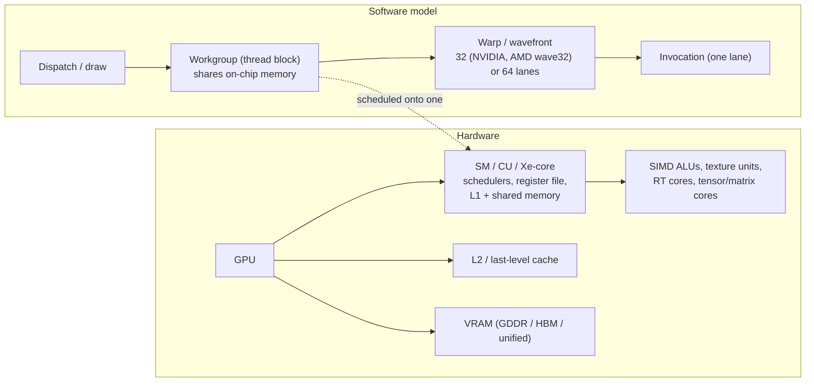

# 3D Graphics & Rendering

Real-time 3D rendering turns a mathematical description of a scene (meshes, materials, lights, and a camera) into an image, many times per second. This page covers how a modern renderer works: the GPU pipeline, the transforms that carry vertices to the screen, the two ways of solving visibility (rasterization and ray tracing), lighting and global illumination, shadows, renderer architectures, anti-aliasing and upscaling, GPU hardware, graphics APIs, and the optimizations that keep a frame within budget. The programmable stages themselves, and the BRDF code for physically based shading, are covered in [Shader Programming](shaders.html).

## Overview

A renderer answers two questions for every pixel: *which surface is visible here?* and *what color does that surface send toward the camera?* Every technique on this page solves one of those questions, or solves one of them faster.

Real-time rendering works to a fixed **frame budget**. All CPU and GPU work for a frame has to finish within that time, so every feature is weighed against its cost in milliseconds:

| Target | Frame time | Typical context |
|--------|-----------:|-----------------|
| 30 FPS | 33.3 ms | Console "quality" modes, cinematic games |
| 60 FPS | 16.7 ms | Standard target for action games |
| 90 FPS | 11.1 ms | Minimum comfortable rate for most VR headsets |
| 120 FPS | 8.3 ms | High-refresh displays, competitive games, "performance" modes |
| 144+ FPS | 6.9 ms or less | Esports titles |

The CPU and GPU run as a pipeline, usually one or two frames apart. A frame is limited by whichever side is slower, so the first step in optimizing is to find out which side is the bottleneck (see [GPU Optimization](../optimization/gpu-optimization.html)).

## The Rendering Pipeline

### Classic Graphics Pipeline

The graphics pipeline is a fixed sequence of stages. Some stages are **programmable** (shaders written by the application) and some are **fixed-function** (configured through state, but implemented in dedicated hardware).



- The **application stage** runs on the CPU. The engine decides what to draw, culls coarsely, builds command buffers, and submits them.
- The **vertex shader** runs once per vertex and must output a homogeneous clip-space position.
- **Tessellation** and **geometry shaders** are optional, and modern engines rarely use them. Mesh shaders (below) replace both.
- The **rasterizer** finds which pixel samples each triangle covers, and interpolates the vertex outputs to each sample with perspective correction.
- **Early-Z** rejects occluded fragments before they are shaded. A shader that writes depth or uses `discard` can turn it off, which makes the depth test run after shading instead.
- The **output merger** runs the final depth and stencil tests and blends the result into the render target.

### Mesh-Shader Pipeline

GPUs since NVIDIA Turing, AMD RDNA 2, and Intel Arc, plus Apple silicon, support a second geometry front end. It replaces input assembly, vertex, tessellation, and geometry shading with two compute-like stages. The API exposure is Direct3D 12 Shader Model 6.5, Vulkan `VK_EXT_mesh_shader`, and Metal 3 mesh shaders.



Geometry is pre-split into **meshlets**, which are small clusters of about 64–128 vertices and 64–256 triangles. A task shader can cull an entire meshlet against the frustum, occlusion data, or normal cones before any vertex work runs. This is the basis of *GPU-driven rendering*, in which the GPU, not the CPU, decides what gets drawn.

## Coordinate Spaces and Transforms

A vertex passes through a chain of coordinate spaces on its way to the screen:



| Space | Meaning | Reached by |
|-------|---------|-----------|
| Object (model) | Relative to the mesh's own origin | — |
| World | Shared scene coordinates | Model matrix |
| View (camera) | Camera at the origin, looking down one axis | View matrix (inverse of the camera's world transform) |
| Clip | 4D homogeneous coordinates in which the frustum becomes a box | Projection matrix |
| NDC | Normalized device coordinates: $x, y \in [-1, 1]$; $z \in [0, 1]$ (D3D, Vulkan, Metal, WebGPU) or $[-1, 1]$ (OpenGL default) | Perspective divide |
| Screen (window) | Pixel coordinates plus depth | Viewport transform |

The vertex shader computes the clip-space position, and the fixed-function hardware does the rest:

$$\mathbf{p}_{\text{clip}} = P \, V \, M \, \mathbf{p}_{\text{obj}}, \qquad \mathbf{p}_{\text{ndc}} = \left( \frac{x_c}{w_c}, \frac{y_c}{w_c}, \frac{z_c}{w_c} \right)$$

$$x_{\text{screen}} = \frac{x_{\text{ndc}} + 1}{2} \, W, \qquad y_{\text{screen}} = \frac{1 - y_{\text{ndc}}}{2} \, H$$

(The $y$ flip shown is for APIs whose window origin is at the top left. The exact convention depends on the API.)

**Normals** transform differently from positions. Under non-uniform scaling a normal must be multiplied by the inverse-transpose of the upper-left 3×3 of the model matrix, $N_{\text{mat}} = \left(M_{3\times 3}^{-1}\right)^{T}$. Engines compute this once per object on the CPU rather than once per vertex.

**Depth precision.** A perspective projection stores a value proportional to $1/z$, so most of the depth range is spent close to the near plane. Distant surfaces then **z-fight**, flickering where two surfaces have nearly equal depth. The standard fix is **reversed-Z**: map the near plane to depth 1 and the far plane to 0, and use a 32-bit floating-point depth buffer. Floating-point numbers are densest near 0, which offsets the $1/z$ distribution and gives nearly uniform precision. With reversed-Z an infinite far plane is also practical. Most current engines use it.

## Visibility: Rasterization and Ray Tracing

The two visibility algorithms have the same loops in opposite order:

- **Rasterization** loops over triangles and asks *which pixels does this triangle cover?* A depth buffer (z-buffer) keeps the nearest surface at each sample.
- **Ray tracing** loops over pixels (rays) and asks *what does this ray hit first?* An acceleration structure keeps this from requiring a test against every triangle.

| Aspect | Rasterization | Ray tracing |
|--------|---------------|-------------|
| Core query | Triangle coverage of a regular pixel grid | Nearest intersection along an arbitrary ray |
| Cost scales with | Triangle count and overdraw | Rays × $O(\log n)$ BVH traversal |
| Rays it can answer | Only coherent rays from one point (camera, light) | Any ray: incoherent, secondary, off-screen |
| Shadows | Shadow maps (resolution and bias artifacts) | Exact; soft shadows from area lights |
| Reflections | Screen-space or probes; misses off-screen objects | Correct, including off-screen objects |
| Indirect light | Baked, probe-based, or screen-space approximations | Multi-bounce, but noisy at real-time sample counts |
| Hardware | Every GPU | RT cores or ray accelerators (NVIDIA Turing+, AMD RDNA 2+, Intel Arc, Apple M3+/A17 Pro) |

### Acceleration Structures

Hardware ray tracing APIs (DXR, Vulkan ray tracing, Metal) organize the scene as a two-level **bounding volume hierarchy (BVH)**:



A **BLAS** holds the triangles of one mesh and is built once, then refit when the mesh deforms. The **TLAS** holds transformed instances that point to BLASes, so moving an object means rebuilding only the small TLAS. Traversal cost grows logarithmically with scene size. The expensive parts are building and updating these structures and the incoherent memory access that secondary rays cause. Features added in recent API versions target those costs:

- **Opacity micromaps** skip any-hit shader calls for alpha-tested foliage.
- **Shader execution reordering (SER)** regroups divergent hit shaders so they run coherently.
- **Cluster (meshlet-level) acceleration structures** are for very dense geometry.

SER and opacity micromaps are standardized in Direct3D Shader Model 6.9.

### Hybrid Rendering and Path Tracing

Most shipping engines **rasterize primary visibility** and trace rays only where rasterization breaks down: shadows, reflections, and indirect light. This is **hybrid rendering**. UE5's Lumen is an example. It combines screen-space tracing, software tracing against signed distance fields, and hardware ray tracing.

Since about 2023, **real-time path tracing** has shipped in some games, for example the "Overdrive" mode of *Cyberpunk 2077* and *Alan Wake 2*. These titles trace one or two paths per pixel. Several techniques make that sample count usable:

- **ReSTIR** (reservoir-based spatiotemporal importance resampling) reuses light samples across neighboring pixels and previous frames. It lets many lights be sampled with only a few rays.
- **Denoisers** rebuild a clean image from very noisy input. Examples are SVGF-style filters and the ML-based NVIDIA Ray Reconstruction and AMD FSR Ray Regeneration.
- **Radiance caches** store indirect light so later bounces can end early.

Some games now require hardware ray tracing, for example *Indiana Jones and the Great Circle* (2024) and *DOOM: The Dark Ages* (2025). These titles have no rasterized-lighting fallback.

## Lighting and Materials

### Empirical Models: Phong and Blinn-Phong

The classic **Phong** reflection model adds an ambient term to diffuse and specular terms summed over the lights:

$$I = k_a I_a + \sum_{\ell} I_\ell \left( k_d \, \max(0, \mathbf{n} \cdot \mathbf{l}) + k_s \, \max(0, \mathbf{r} \cdot \mathbf{v})^{s} \right)$$

| Symbol | Meaning |
|--------|---------|
| $I_a,\ k_a$ | Ambient intensity and ambient coefficient |
| $I_\ell$ | Intensity of light $\ell$ |
| $k_d,\ k_s$ | Diffuse and specular coefficients |
| $\mathbf{n},\ \mathbf{l},\ \mathbf{v}$ | Unit surface normal, direction to the light, direction to the viewer |
| $\mathbf{r}$ | $\mathbf{l}$ reflected about $\mathbf{n}$ |
| $s$ | Shininess exponent |

**Blinn-Phong** replaces $\mathbf{r} \cdot \mathbf{v}$ with $\mathbf{n} \cdot \mathbf{h}$, where $\mathbf{h} = \operatorname{normalize}(\mathbf{l} + \mathbf{v})$ is the half vector. Blinn-Phong highlights are wider for the same exponent; an exponent about four times larger gives a similar highlight size. The half-vector form behaves better at grazing angles, and it is the ancestor of the microfacet models below. Neither model conserves energy, and both are now used mainly for stylized or very low-end rendering.

### Physically Based Rendering

**Physically based rendering (PBR)** describes a surface with a **BRDF**, $f_r(\mathbf{l}, \mathbf{v})$, grounded in optics. Outgoing radiance comes from the reflectance equation, which is the non-emissive part of Kajiya's rendering equation:

$$L_o(\mathbf{v}) = \int_{\Omega} f_r(\mathbf{l}, \mathbf{v}) \, L_i(\mathbf{l}) \, (\mathbf{n} \cdot \mathbf{l}) \, d\omega_{\mathbf{l}}$$

The real-time standard is a Lambertian diffuse lobe plus a **Cook-Torrance microfacet** specular lobe:

$$f_r = \frac{c_{\text{diff}}}{\pi} + \frac{D(\mathbf{h}) \, F(\mathbf{v}, \mathbf{h}) \, G(\mathbf{l}, \mathbf{v})}{4 \, (\mathbf{n} \cdot \mathbf{l}) (\mathbf{n} \cdot \mathbf{v})}$$

Here $D$ is the GGX (Trowbridge-Reitz) normal distribution, $F$ is Schlick's Fresnel approximation, and $G$ is Smith shadowing-masking. Materials are authored in the **metallic-roughness** workflow, with parameters base color, metallic, roughness, normal, and ambient occlusion. glTF 2.0 standardizes this workflow and extends it with `KHR_materials_*` layers such as clearcoat, sheen, transmission, and anisotropy. For film and design work, **OpenPBR** from the Academy Software Foundation unifies Autodesk Standard Surface and Adobe Standard Material. [Shader Programming](shaders.html#physically-based-shading) derives each term and gives GLSL code.

### Global Illumination

Direct lighting accounts for only part of what makes an image look real. **Global illumination (GI)** adds light that has bounced off other surfaces. Real-time techniques trade accuracy, dynamism, and cost against each other:

| Technique | How it works | Dynamic lights/geometry | Cost | Typical weakness |
|-----------|--------------|:-----------------------:|------|------------------|
| Baked lightmaps | Offline path tracing stored in textures | No | Near zero at runtime | Static only; memory; bake times |
| Irradiance probes (SH, DDGI) | Grid of probes storing incoming light; DDGI updates them with rays | Partly / yes | Low–medium | Light leaking; low spatial detail |
| Reflection probes | Prefiltered cubemaps captured at points | Partly | Low | Parallax errors; stale captures |
| Screen-space GI / reflections | Ray-march the depth buffer | Yes | Medium | Misses anything off-screen or occluded |
| Voxel cone tracing | Voxelize the scene, trace cones through mip levels | Yes | Medium–high | Coarse; leaking; memory |
| Signed-distance-field tracing | Trace against per-mesh or global SDFs (software Lumen) | Yes | Medium | Approximate geometry |
| Hardware RT + denoising | Trace a few rays per pixel, denoise, cache radiance | Yes | High | Noise, temporal lag |
| Path tracing (ReSTIR) | Full multi-bounce light transport | Yes | Very high | Needs upscaling and denoising to be real-time |

Production engines layer several of these. **Lumen** in Unreal Engine 5, for example, combines screen traces, SDF or hardware ray tracing, a surface cache, and a final-gather denoiser. UE 5.5 added **MegaLights**, an experimental stochastic direct-lighting system that allows hundreds of shadow-casting lights.

## Shadows

### Shadow Mapping

**Shadow mapping** is the standard rasterized technique:

1. **Shadow pass.** Render depth from the light's point of view into a shadow map.
2. **Main pass.** Transform each shaded point into light space and compare its depth to the stored depth. If it is farther away, something blocks the light.

| Artifact | Cause | Mitigation |
|----------|-------|-----------|
| Shadow acne | A surface self-shadows because of depth quantization | Constant plus **slope-scaled** depth bias; normal-offset sampling |
| Peter-panning | Too much bias detaches shadows from their casters | Smaller bias; thicker casters; normal offset in place of depth bias |
| Aliasing / jagged edges | Shadow-map texels are larger than screen pixels | Cascades, higher resolution, filtering |
| Hard edges | A binary depth comparison | PCF, PCSS (contact-hardening), or VSM/EVSM/MSM filtering |

### Cascaded and Virtual Shadow Maps

A directional light such as the sun covers the whole view frustum, so a single shadow map wastes resolution in the distance and has too little near the camera. **Cascaded shadow maps (CSM)** split the frustum by depth into $N$ ranges, each with its own shadow map. The "practical split scheme" blends logarithmic and uniform splits with a weight $\lambda \in [0, 1]$, where $n$ and $f$ are the near and far planes:

$$z_i = \lambda \, n \left( \frac{f}{n} \right)^{i/N} + (1 - \lambda) \left( n + (f - n) \frac{i}{N} \right)$$

**Virtual shadow maps** (UE5) take the idea to its limit. A very large (16k × 16k) virtual shadow map is paged like virtual memory, and only the pages that visible pixels need are rendered and cached. The result is consistent texel density at every distance. Combined with Nanite geometry, this approach has largely replaced hand-tuned cascades in that engine.

### Ray-Traced Shadows

Tracing a shadow ray toward the light removes resolution and bias problems. Sampling an **area light** stochastically produces physically correct soft shadows that sharpen near contact. The cost is one or more rays per pixel per light plus denoising. For this reason games often trace only the sun or a few key lights, or use ReSTIR-style light sampling.

## Renderer Architectures

A renderer's architecture determines where lighting is computed and how its cost grows with the number of lights and objects.



| Architecture | Lighting cost | Transparency | MSAA | Material variety | Memory bandwidth |
|--------------|---------------|:------------:|:----:|------------------|------------------|
| Forward | Objects × lights | Natural | Yes | Unlimited | Low |
| Deferred | Pixels × lights in range | Separate forward pass | Hard | Limited by G-buffer layout | High (fat G-buffer) |
| Forward+ (tiled) | Pixels × lights in tile | Natural | Yes | Unlimited | Low–medium |
| Clustered (forward or deferred) | Pixels × lights in 3D cluster | Natural (forward) | Yes (forward) | Unlimited (forward) | Low–medium |
| Visibility buffer | Pixels × lights; materials resolved per pixel | Separate pass | Yes | Unlimited | Very low |

- **Deferred shading** writes surface attributes to a **G-buffer** first, then lights each pixel exactly once. This separates geometric complexity from lighting cost. Its drawbacks are bandwidth, trouble with transparency, and a fixed set of material parameters.
- **Forward+** and **clustered** shading use a compute pass to build lists of lights per screen tile, or per 3D cluster (tile × depth slice). Forward shading then loops only over the relevant lights. Clustering handles depth discontinuities better than 2D tiles. *DOOM* (2016) and many mobile engines use clustered forward shading.
- **Visibility-buffer** rendering writes only a triangle and instance ID per pixel, then reconstructs attributes and shades in screen-space passes. It suits very dense geometry, where tiny triangles waste quad-shading work. Nanite uses it.
- **Tile-based mobile GPUs** favor forward rendering, or deferred rendering that keeps the G-buffer in on-chip tile memory (subpasses or framebuffer fetch), because writing a full G-buffer to DRAM costs too much power.

### Anatomy of a Frame

A typical modern deferred or hybrid frame runs the following passes (exact order varies by engine):



## Anti-Aliasing and Upscaling

A pixel is a sample, not a small square. Edges, thin geometry, sharp specular highlights, and high-frequency textures all **alias**: they produce stair-steps and shimmer under motion.

| Method | How it works | Cost | Strengths | Weaknesses |
|--------|--------------|------|-----------|------------|
| SSAA | Render at higher resolution and downsample | Very high | Reference quality | Cost scales with sample count |
| MSAA | Several coverage/depth samples per pixel, shaded once | Medium–high (bandwidth) | Sharp, temporally stable geometric edges | Ignores shader and texture aliasing; awkward with deferred |
| FXAA / SMAA | Post-process edge detection and blur | Low | Cheap, works anywhere | Blurs text; no temporal stability |
| TAA | Jitter the camera sub-pixel each frame and accumulate history reprojected by motion vectors | Low | Resolves all aliasing types; stable | Ghosting, softness, disocclusion artifacts |
| Temporal upscaling (TSR, FSR 2/3, XeSS) | TAA that also reconstructs a higher output resolution | Low, with net savings | Renders ~50–67% of output pixels | Same failure modes as TAA, amplified |
| ML upscaling (DLSS, FSR 4, XeSS XMX, PSSR) | A neural network replaces TAA's hand-tuned heuristics | Low (tensor/matrix units) | Best quality per millisecond | Vendor- or hardware-specific |

### Temporal Accumulation

TAA and every temporal upscaler work the same way:

1. **Jitter** the projection matrix by a sub-pixel offset each frame (Halton sequence) so successive frames sample different points within each pixel.
2. **Reproject.** Use per-pixel motion vectors to find where each pixel was in the previous frame, and fetch the history buffer there.
3. **Rectify.** Clamp or clip the history color to the range of the current frame's local neighborhood so stale history does not smear (ghosting).
4. **Blend** the current sample into the history, typically keeping ~90% history, and write the result back.

### Upscaling and Frame Generation (2025–2026)

Upscaling is now the default in AAA titles, and some games are balanced for 1080p–1440p internal resolution even on high-end GPUs.

- **NVIDIA DLSS 4** (January 2025) replaced DLSS's convolutional network with a vision-transformer model, which reduces ghosting and improves stability. It also added **Multi Frame Generation** on RTX 50-series GPUs, which inserts several generated frames per rendered frame. DLSS 4.5 (CES 2026) introduced a second-generation transformer and dynamic frame generation.
- **AMD FSR 4** (2025) is ML-based and runs on RDNA 4 hardware. The FSR "Redstone" update (December 2025) added ML frame generation, **Ray Regeneration** (a denoiser), and radiance caching. FSR 3.1 remains the cross-vendor, non-ML option.
- **Intel XeSS 2** added frame generation and a low-latency mode. Sony's **PSSR** is the ML upscaler on PS5 Pro.

**Frame generation** raises the displayed frame rate but not responsiveness. Generated frames are interpolated between real ones, so input latency follows the *rendered* frame rate plus the interpolation delay. Vendors pair it with latency-reduction systems (Reflex, Anti-Lag), and it works best when the base frame rate is already about 60 FPS.

## Post-Processing and Tone Mapping

The lit scene is stored as **high-dynamic-range** linear radiance, usually in a 16-bit float target. Post-processing then applies camera and display effects, usually as full-screen compute passes:

- **Bloom:** light scattering in the lens and eye. Usually a mip-chain downsample and upsample of bright regions.
- **Depth of field** and **motion blur:** simulated with the depth buffer and velocity buffer.
- **Ambient occlusion:** SSAO, HBAO+, or GTAO. Ray-traced AO where available.
- **Exposure:** automatic eye adaptation from a luminance histogram.
- **Tone mapping:** compresses HDR radiance into the display's range. **Color grading** through a 3D LUT follows, usually applied in a log or wide-gamut space before tone mapping.

Common tone-mapping operators:

| Operator | Notes |
|----------|-------|
| Reinhard, $c / (1 + c)$ | Simple; desaturates and flattens contrast |
| ACES (RRT+ODT, or Narkowicz's curve fit) | Film-like contrast; the popular per-channel fit shifts hues and oversaturates bright colors |
| AgX | Designed to desaturate gracefully toward white in highlights; Blender's default view transform since 4.0 |
| Khronos PBR Neutral | Keeps base colors close to their authored sRGB values; for product and e-commerce rendering |
| Hable / Uncharted 2, GT (Gran Turismo) | Filmic curves with tunable toe and shoulder |

```glsl
// Reinhard: maps [0, inf) to [0, 1)
vec3 tonemapReinhard(vec3 c) { return c / (1.0 + c); }

// ACES filmic approximation (Krzysztof Narkowicz, 2015).
// Input is scene-linear; apply exposure first, output is display-linear.
vec3 tonemapACESFitted(vec3 x) {
    const float a = 2.51, b = 0.03, c = 2.43, d = 0.59, e = 0.14;
    return clamp((x * (a * x + b)) / (x * (c * x + d) + e), 0.0, 1.0);
}
```

On **HDR displays** (HDR10 / PQ, scRGB), the tone mapper targets the display's reported peak luminance rather than a fixed [0, 1] range. The UI is composited separately at a calibrated "paper white" level.

## GPU Architecture

### Hardware and Execution Hierarchy

A GPU is an array of **streaming multiprocessors** (NVIDIA SM; AMD Compute Unit / WGP; Intel Xe-core; Apple GPU core). Each one holds many SIMD lanes, a large register file, shared memory, and fixed-function units: texture samplers, and on recent parts ray-tracing and matrix ("tensor") cores. The software thread hierarchy maps onto this hardware:



Lanes in a warp execute in lock-step (**SIMT**). When lanes take different branches, the warp runs both paths with inactive lanes masked off (**divergence**). The GPU hides memory latency by switching among many resident warps, so **occupancy**, the number of warps resident per SM, matters. Occupancy is limited by register and shared-memory use per thread.

### Memory Hierarchy

Figures are order-of-magnitude values for recent desktop GPUs and vary by vendor and generation:

| Level | Approx. latency | Scope | Typical capacity |
|-------|-----------------|-------|------------------|
| Registers | ~1 cycle | Thread (lane) | ~64k × 32-bit per SM (≈256 KB); up to 255 registers per thread |
| Shared memory / LDS | ~20–30 cycles | Workgroup | 64–228 KB per SM (shared with L1 on NVIDIA) |
| L1 / texture cache | ~30 cycles | SM | Combined with shared memory above |
| L2 / Infinity Cache | ~150–300 cycles | Whole GPU | ~4–128 MB (large last-level caches since ~2020–2022) |
| VRAM | ~400–800 cycles | Whole GPU | 8–32 GB consumer; far more on data-center parts |

Bandwidth, not arithmetic, limits most rendering passes. This is why compressed textures, compact G-buffers, and large on-die caches matter so much.

## Graphics APIs

| API | Platforms | Status (2026) | Notes |
|-----|-----------|---------------|-------|
| **Vulkan** | Windows, Linux, Android, Switch; macOS/iOS via MoltenVK | Vulkan 1.4 (December 2024) | Explicit, low-level; extensions for ray tracing, mesh shaders, dynamic rendering, shader objects |
| **Direct3D 12** | Windows, Xbox | Features ship through the Agility SDK | DXR ray tracing, mesh shaders, sampler feedback, **work graphs** (GPU-generated work, v1.0 in 2024); Microsoft has announced a move to SPIR-V as the future shader interchange format |
| **Metal** | Apple platforms | Metal 4 (announced 2025) | Unified memory, mesh shaders, hardware ray tracing on M3+/A17 Pro, ML tensor operations in shaders |
| **WebGPU** | Browsers, native via Dawn/wgpu | Shipped in Chrome/Edge (2023), Safari 26 and Firefox 141 (2025) | Modern explicit API for the web, with WGSL shaders |
| **OpenGL / WebGL 2** | Everywhere | Maintenance only (OpenGL 4.6, 2017) | Still common for tools, education, and legacy code; no new core features |

The explicit APIs (Vulkan, D3D12, Metal, WebGPU) move work that drivers used to do onto the application: memory allocation, synchronization, resource state transitions, and pipeline creation. In exchange, command recording is cheap and multi-threaded, and CPU overhead is predictable. The main new cost is **pipeline state objects**. Shaders are compiled into PSOs, and compiling them when they are first needed causes hitches ("shader compilation stutter"). Engines work around it with precompilation, PSO caches, and newer mechanisms such as Vulkan graphics pipeline libraries and shader objects.

## Performance Techniques

### Culling

| Technique | Removes | Where |
|-----------|---------|-------|
| Frustum culling | Objects outside the camera volume | CPU or GPU compute |
| Occlusion culling | Objects hidden behind others; commonly tested against a hierarchical Z-buffer (HZB) built from the previous frame's depth | GPU |
| Back-face culling | Triangles facing away from the camera | Fixed-function hardware |
| Small-primitive / cluster culling | Meshlets or triangles that cover no sample | Task/mesh or compute shaders |
| Distance / contribution culling | Objects too far away or too small on screen to matter | CPU or GPU |

### Level of Detail

Discrete **LOD** chains swap in simpler meshes as screen size shrinks: for example 100% → 50% → 25% → 10% triangles, then a 2D **impostor** or billboard. Selection should depend on projected screen size rather than raw distance, so that it holds up under different fields of view and resolutions. Cross-fading or dithered transitions hide popping.

**Nanite** (UE5) replaces discrete LODs with a hierarchy of triangle clusters. The renderer picks a cut through that hierarchy each frame so the error stays below about one pixel. Most triangles go through a compute-shader software rasterizer, which is faster than hardware for pixel-sized triangles, and the rest through the hardware rasterizer. Both write a visibility buffer. Streaming makes the geometry "virtual", so only the clusters that are needed stay resident.

### Draw-Call Reduction and GPU-Driven Rendering

Each draw call costs CPU time for validation and state setup. The standard techniques are:

- **Instancing** draws many copies of one mesh in a single call, with per-instance data held in a buffer.
- **Batching / merging** combines static meshes that share a material.
- **Bindless resources** index textures and buffers from large descriptor heaps, so draws stop needing per-draw rebinding.
- **Indirect and GPU-driven rendering** has compute shaders cull and write draw arguments into a buffer. Then `ExecuteIndirect` or `vkCmdDrawIndexedIndirectCount` submits thousands of draws in one command, and the CPU never touches individual objects.

## Emerging Directions

- **Neural rendering.** Beyond upscaling and denoising, small neural networks are now evaluated *inside* shaders: neural texture compression, neural materials, and neural radiance caches. They run on matrix hardware through cooperative-vector and tensor extensions (Vulkan `VK_NV_cooperative_vector`, D3D12 cooperative vectors (preview), and Metal 4 tensor operations).
- **Gaussian splatting.** *3D Gaussian Splatting* (Kerbl et al., SIGGRAPH 2023) represents a captured scene as millions of anisotropic 3D Gaussians and rasterizes them by sorted alpha blending at real-time rates. It has largely replaced NeRFs for photogrammetry-style capture and is being adopted in engines and web viewers.
- **Work graphs** (D3D12) let shaders launch other shaders on the GPU, moving more scheduling decisions, such as culling, LOD selection, and procedural generation, off the CPU.

## See Also

- [Shader Programming](shaders.html): programmable stages, GLSL/HLSL, PBR shading code, and shader debugging
- [GPU Optimization](../optimization/gpu-optimization.html): profiling, occupancy, and draw-call optimization
- [Game Development](../gamedev/): engines, physics, and multiplayer systems
- [Unreal Engine](../technology/unreal.html): Nanite, Lumen, virtual shadow maps, and TSR in practice
- [VR/AR Development](../vr-ar/): stereo rendering and XR performance constraints
- [Physics Documentation](../physics/): optics and the mathematical foundations of light transport
