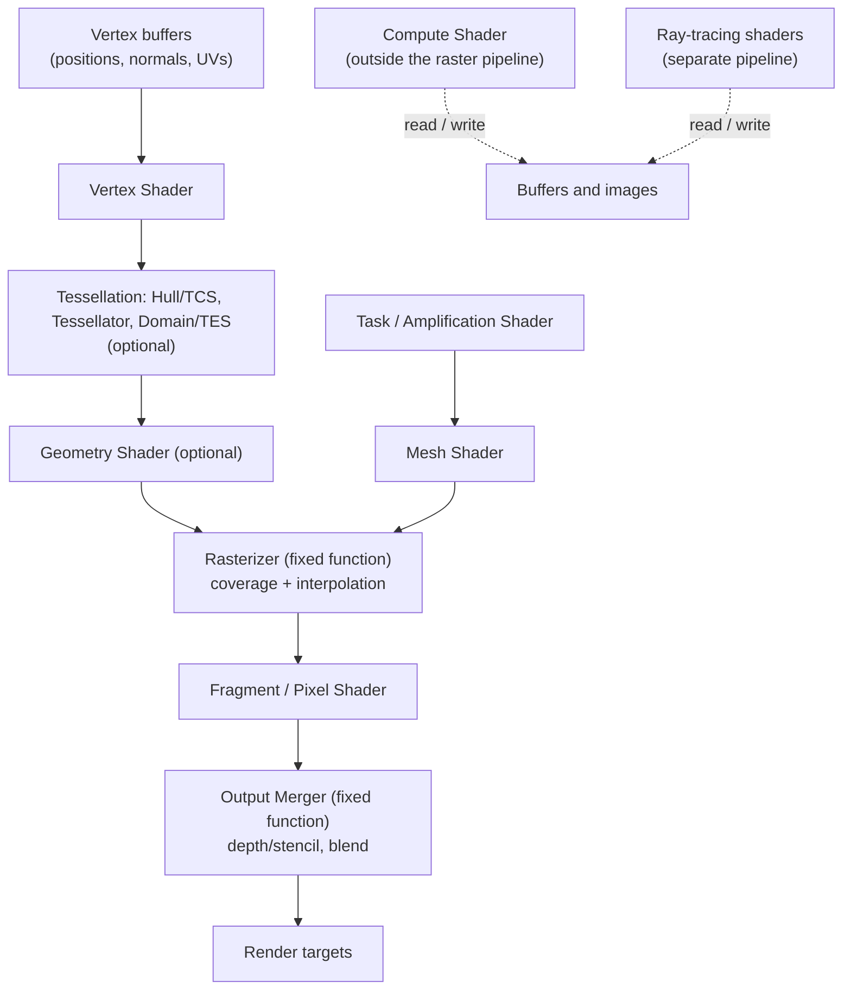
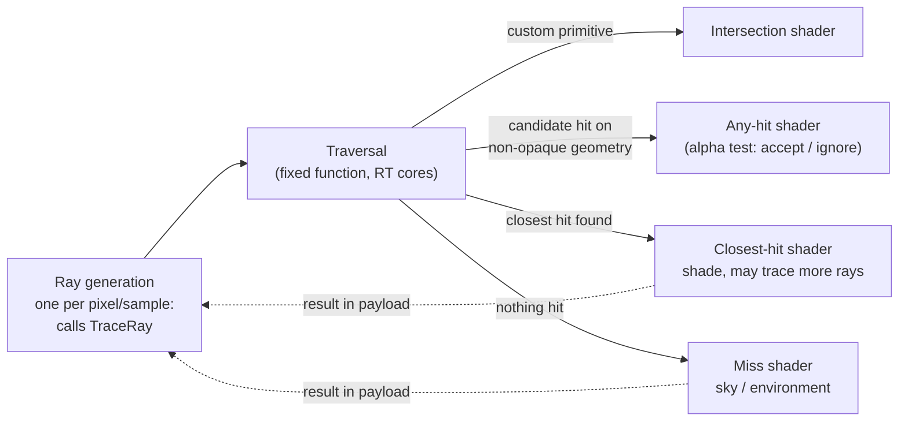
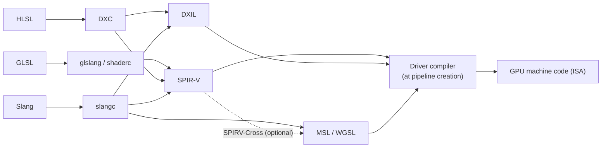

# Shader Programming

[3D Graphics &amp; Rendering](3d-rendering.html) &raquo; Shader Programming

A **shader** is a program that runs on the GPU. The same code is executed in parallel for every vertex, pixel, ray, or compute thread that a draw or dispatch produces. Shaders decide where geometry lands on screen, how light interacts with surfaces, and how the final image is filtered. This page covers:

- the programmable pipeline and each shader stage
- the main shading languages (GLSL, HLSL, MSL, WGSL, and Slang) and how they are compiled
- physically based shading, with working GLSL
- common surface and post-processing effects
- texture sampling
- the performance model
- debugging

For the rendering pipeline as a whole (visibility, shadows, renderer architectures, and upscaling), see [3D Graphics & Rendering](3d-rendering.html).

## Execution Model

A shader is written from the point of view of **one element**: one vertex, one fragment, one ray, or one compute invocation. The GPU runs that code across thousands of elements at once. This is the **SPMD** (single program, multiple data) model. The hardware groups invocations into **warps** or **wavefronts** of 32 or 64 lanes that execute in lock-step (SIMT). Three consequences follow:

- **There are no loops over vertices or pixels.** You write the loop body. The draw call or dispatch supplies the iteration.
- **Branches can cost both paths.** If lanes in a warp disagree on a condition, the warp executes both sides with inactive lanes masked off.
- **Cost multiplies.** A full-screen fragment shader at 4K runs about 8.3 million times per frame. One extra instruction there costs more than a hundred in a per-object computation.

## The Programmable Pipeline

Early GPUs had a **fixed-function** pipeline: transform and lighting were hardwired and could only be switched and parameterized. Programmable vertex and pixel stages arrived in 2001 (DirectX 8, GeForce 3). Unified shader cores followed in 2006–2007 (DirectX 10, GeForce 8800), and compute, mesh, and ray-tracing stages were added later. Rasterization, depth/stencil testing, and blending are still fixed-function because dedicated hardware does them far more efficiently.



A raster pipeline needs a **vertex shader** (or a mesh shader, in the mesh-shader pipeline). A **fragment shader** is required whenever color is written; depth-only passes can omit it. Tessellation and geometry stages are optional and uncommon in new code. **Compute** and **ray-tracing** shaders run in their own pipelines, reading and writing arbitrary buffers and images.

### What Flows Between Stages

| Data class | Meaning | Changes |
|------------|---------|---------|
| **Vertex attributes** | Data streamed from vertex buffers (position, normal, tangent, UV, color) | Per vertex |
| **Uniforms / constant buffers / push constants** | Read-only values shared by the whole draw (matrices, light data, time) | Per draw or per frame |
| **Varyings / interpolants** | Outputs of the vertex (or mesh) stage, interpolated across the triangle with perspective correction | Per fragment |
| **Textures + samplers** | Images read with filtering, addressed by coordinate | Per access |
| **Storage buffers / images (UAVs)** | Arbitrary read-write resources | Per access |

A **varying** is written at each triangle vertex, and the rasterizer blends it to each fragment using barycentric weights with perspective correction. The blend of three unit normals is generally not unit length, so **interpolated normals must be renormalized** in the fragment shader. Integer varyings cannot be interpolated and must be marked `flat` (GLSL) or `nointerpolation` (HLSL).

## Shader Stages

### Vertex Shader

The vertex shader runs once per vertex. It must output a clip-space position, and it usually passes data on to the fragment stage.

```glsl
#version 460

layout(location = 0) in vec3 inPosition;
layout(location = 1) in vec3 inNormal;
layout(location = 2) in vec4 inTangent;   // xyz = tangent, w = bitangent sign
layout(location = 3) in vec2 inTexCoord;

layout(set = 0, binding = 0) uniform Camera {
    mat4 viewProj;
    vec3 cameraPos;
};

layout(push_constant) uniform Object {
    mat4 model;
    mat4 normalMatrix;  // inverse-transpose of model, computed on the CPU
};

layout(location = 0) out vec3 vWorldPos;
layout(location = 1) out vec3 vNormal;
layout(location = 2) out vec4 vTangent;
layout(location = 3) out vec2 vTexCoord;

void main() {
    vec4 worldPos = model * vec4(inPosition, 1.0);
    vWorldPos = worldPos.xyz;
    vNormal   = mat3(normalMatrix) * inNormal;
    vTangent  = vec4(mat3(model) * inTangent.xyz, inTangent.w);
    vTexCoord = inTexCoord;
    gl_Position = viewProj * worldPos;
}
```

`gl_Position` (HLSL `SV_Position`, WGSL `@builtin(position)`) is the contract with the fixed-function hardware. It is the homogeneous clip-space position, which the hardware clips, divides by $w$, and maps to the viewport. Normals use the **inverse-transpose** of the model matrix so that they stay perpendicular to the surface under non-uniform scale. Compute that matrix once per object on the CPU; calling `inverse()` per vertex wastes work.

### Fragment (Pixel) Shader

The fragment shader runs once per **fragment**, a candidate sample produced by rasterization. It receives the interpolated varyings and writes one or more colors, and can optionally write depth. A fragment is not yet a pixel: the depth test can still reject it, and blending can still combine it with what is already in the target.

```glsl
#version 460

layout(location = 0) in vec3 vWorldPos;
layout(location = 1) in vec3 vNormal;
layout(location = 3) in vec2 vTexCoord;

layout(set = 0, binding = 0) uniform Camera { mat4 viewProj; vec3 cameraPos; };
layout(set = 1, binding = 0) uniform sampler2D albedoTex;   // sRGB format: decoded to linear on sample
layout(set = 1, binding = 1) uniform Light { vec3 lightPos; vec3 lightColor; };

layout(location = 0) out vec4 outColor;

void main() {
    vec3 albedo = texture(albedoTex, vTexCoord).rgb;

    vec3 N = normalize(vNormal);                 // re-normalize after interpolation
    vec3 L = normalize(lightPos - vWorldPos);
    vec3 V = normalize(cameraPos - vWorldPos);
    vec3 H = normalize(L + V);

    float diffuse  = max(dot(N, L), 0.0);
    float specular = pow(max(dot(N, H), 0.0), 64.0) * step(0.0, dot(N, L));

    vec3 color = albedo * (0.03 + diffuse * lightColor) + specular * lightColor;
    outColor = vec4(color, 1.0);                 // linear; an sRGB render target encodes on write
}
```

GPUs rasterize and shade fragments in **2×2 quads**. This lets the hardware compute screen-space derivatives (`dFdx`/`dFdy`, HLSL `ddx`/`ddy`) as finite differences between neighboring lanes, and texture sampling uses those derivatives to choose a mip level. Lanes in a quad that fall outside the triangle still run as **helper invocations** so that their neighbors have derivatives. As a result, tiny triangles waste up to three quarters of their shading work, and a `discard`ed fragment does not free its quad neighbors.

### Tessellation Shaders

Tessellation subdivides coarse **patches** on the GPU. It is used for terrain, displacement mapping, and smooth curved surfaces. Two programmable stages surround a fixed-function tessellator:

| Stage (GLSL / HLSL) | Runs per | Job |
|---------------------|----------|-----|
| Tessellation control / **Hull** shader | Patch (and per output control point) | Choose tessellation factors, usually from screen-space edge length; transform control points |
| Tessellator (fixed function) | Patch | Generate a grid of new vertices in the patch's parametric domain (triangle, quad, isoline) |
| Tessellation evaluation / **Domain** shader | Generated vertex | Compute the final position, for example by evaluating a Bézier surface or sampling a displacement map |

Because the factors are continuous, detail can increase smoothly without popping. Hardware tessellation performs poorly with high amplification factors on some GPUs. Newer engines often use mesh shaders or compute-based subdivision instead, and Metal exposes tessellation through a compute-driven model.

### Geometry Shader

The geometry shader runs once per primitive (point, line, or triangle) and can emit zero or more primitives, so it can **create or destroy** geometry. Typical uses are point-sprite expansion, wireframe overlays, and routing primitives to layers of a cubemap or array texture.

Its variable-sized, ordered output is hard for hardware to parallelize, so it is a well-known performance trap. Metal and WebGPU do not have it at all. Mesh shaders, compute shaders, and viewport/layer selection from the vertex shader (`gl_Layer`, `SV_RenderTargetArrayIndex`) cover its use cases.

### Compute Shader

Compute shaders leave the raster pipeline entirely. A dispatch launches a 3D grid of **workgroups** (thread groups). Invocations within a workgroup can share fast on-chip **shared memory** (HLSL `groupshared`, WGSL `var<workgroup>`) and synchronize with **barriers**. Modern renderers use compute heavily, for GPU culling, light clustering, particles, skinning, post-processing, and upscalers.

```glsl
#version 460

// 8x8 = 64 invocations: a multiple of both 32- and 64-wide hardware
layout(local_size_x = 8, local_size_y = 8) in;

layout(set = 0, binding = 0, rgba16f) uniform readonly  image2D srcImage;
layout(set = 0, binding = 1, rgba16f) uniform writeonly image2D dstImage;

void main() {
    ivec2 p    = ivec2(gl_GlobalInvocationID.xy);
    ivec2 size = imageSize(srcImage);
    if (any(greaterThanEqual(p, size))) return;   // grid is rounded up; guard the edge

    // 3x3 box blur
    vec4 sum = vec4(0.0);
    for (int dy = -1; dy <= 1; ++dy)
        for (int dx = -1; dx <= 1; ++dx)
            sum += imageLoad(srcImage, clamp(p + ivec2(dx, dy), ivec2(0), size - 1));

    imageStore(dstImage, p, sum / 9.0);
}
```

The host dispatches `ceil(width / 8) × ceil(height / 8)` workgroups, using `vkCmdDispatch`, `Dispatch`, `dispatchThreadgroups`, or `dispatchWorkgroups` depending on the API. Choose a workgroup size that is a multiple of the hardware's SIMD width (64 is a safe default). For larger kernels, load a tile including a border into shared memory once rather than having each thread fetch its neighbors from memory. **Subgroup** (wave) operations such as `subgroupAdd` and `WaveActiveSum` let lanes within one warp exchange data without shared memory at all, and they are the standard building block for fast reductions and prefix sums.

### Mesh and Task Shaders

Mesh shading replaces the entire vertex, tessellation, and geometry front end with two compute-like stages. The **task** (amplification) shader decides which **meshlets** to process, typically by culling them against the frustum, the previous frame's depth pyramid, and a normal cone. The **mesh** shader then writes a small batch of vertices and triangles, commonly up to 64–128 vertices and 64–256 triangles, directly into on-chip memory for the rasterizer.

It is supported through D3D12 (Shader Model 6.5+), Vulkan (`VK_EXT_mesh_shader`), and Metal 3. Mesh shading underpins GPU-driven renderers, although UE5's Nanite rasterizes most of its small triangles in a compute shader instead.

### Ray-Tracing Shaders

Hardware ray tracing (DXR, Vulkan `VK_KHR_ray_tracing_pipeline`, Metal) adds its own set of stages. The driver schedules them around the traversal of an acceleration structure (see [3D Graphics & Rendering](3d-rendering.html#acceleration-structures)):



Data travels between the stages in a user-defined **ray payload**. A **shader binding table** maps each geometry instance to its hit shaders.

The alternative is **inline ray tracing**: `RayQuery` in HLSL (DXR 1.1) or `GL_EXT_ray_query` in GLSL. It traces rays directly from any stage, including compute and fragment shaders, without a separate pipeline. It is often simpler and faster for shadows and ambient occlusion, where a hit only needs a yes/no answer.

**Shader execution reordering** (SER, standardized in D3D12 Shader Model 6.9) lets the application sort hit-shader work by material or hit location before shading. This reduces divergence in path tracers.

## Shading Languages

| Language | Primary targets | Compiled with / to | Notes |
|----------|-----------------|--------------------|-------|
| **GLSL** | OpenGL, Vulkan | glslang, shaderc → SPIR-V | Vulkan-flavored GLSL (`#version 450`/`460`) with `set`/`binding` layouts; GLSL ES for WebGL |
| **HLSL** | Direct3D 12, Vulkan | DXC → DXIL or SPIR-V | The most widely used language in games; HLSL 2021 added templates and operator overloading |
| **MSL** | Metal | Metal compiler → AIR | Based on C++14; tensor/ML operations added in Metal 4 |
| **WGSL** | WebGPU | Tint (Chrome), Naga (Firefox, wgpu) → backend language | Rust-like syntax, strict typing, no preprocessor |
| **Slang** | All of the above | slangc → SPIR-V, DXIL, MSL, WGSL, GLSL, HLSL, CUDA | Largely HLSL-compatible, adding modules, generics, interfaces, and automatic differentiation; hosted by Khronos since November 2024 |



Shaders are compiled **twice**. First the offline compiler produces a portable intermediate representation (SPIR-V, DXIL, or AIR). Then, at pipeline creation time, the driver compiles that into the GPU's native instruction set. The second step is the source of **shader compilation stutter** in PC games. Engines reduce it by collecting pipeline state objects (PSOs) ahead of time, precompiling them during loading screens, and shipping driver-side caches. Microsoft has announced that DirectX will adopt SPIR-V as its interchange format in a future shader model. That change would give the two major desktop APIs a common IR.

### Core Types and Syntax

| Concept | GLSL | HLSL | WGSL |
|---------|------|------|------|
| Float vectors | `vec2 vec3 vec4` | `float2 float3 float4` | `vec2f vec3f vec4f` (`vec3<f32>`) |
| Half precision | `mediump` / `float16_t` (extension) | `half`, `min16float` | `f16` (optional feature) |
| Integer vectors | `ivec3`, `uvec3` | `int3`, `uint3` | `vec3i`, `vec3u` |
| Matrices | `mat3`, `mat4` | `float3x3`, `float4x4` | `mat3x3f`, `mat4x4f` |
| Texture + sampler | `sampler2D` (combined) or separate `texture2D` + `sampler` | `Texture2D` + `SamplerState` | `texture_2d<f32>` + `sampler` |
| Texture fetch | `texture(tex, uv)` | `tex.Sample(samp, uv)` | `textureSample(tex, samp, uv)` |
| Fragment entry point | `void main()` | `float4 PSMain(...) : SV_Target` | `@fragment fn fs_main(...) -> @location(0) vec4f` |
| Clip-space position | `gl_Position` | `SV_Position` | `@builtin(position)` |
| Stage linkage | `layout(location = N)` | Semantics (`TEXCOORD0`, ...) | `@location(N)` |
| Linear interpolation | `mix` | `lerp` | `mix` |
| Clamp to [0, 1] | `clamp(x, 0.0, 1.0)` | `saturate(x)` | `saturate(x)` |

**Matrix conventions** cause more cross-API bugs than anything else. Both GLSL and HLSL store matrices **column-major** in buffers by default. GLSL code conventionally multiplies `M * v` (column vectors), while a lot of HLSL code uses `mul(v, M)` (row vectors) with transposed matrices. The two conventions give the same result only if the CPU-side matrix layout matches the one the shader expects. Pick one convention per engine and document it.

### Swizzling and Vector Math

Shading languages let you reorder and replicate vector components with **swizzles**:

```glsl
vec4 c = vec4(1.0, 0.5, 0.2, 1.0);
vec3 rgb  = c.rgb;      // (1.0, 0.5, 0.2)
vec3 bgr  = c.bgr;      // (0.2, 0.5, 1.0)
vec2 xy   = c.xy;       // xyzw, rgba (and stpq in GLSL) name the same components
vec4 gray = c.gggg;     // replicate one component
c.xy = c.yx;            // swizzles are assignable (no repeated components)
```

Arithmetic on vectors works **component by component**: `a * b` multiplies element-wise. Use `dot`, `cross`, and matrix multiplication (`*` in GLSL/WGSL, `mul` in HLSL) for linear algebra.

### Essential Built-in Functions

| Function (GLSL) | Purpose |
|-----------------|---------|
| `normalize`, `length`, `distance` | Unit vector, magnitude, point distance |
| `dot`, `cross` | Dot and cross product |
| `mix(a, b, t)` | Linear interpolation |
| `clamp`, `min`, `max` | Range limiting |
| `step(edge, x)`, `smoothstep(e0, e1, x)` | Hard and smooth (Hermite) thresholds |
| `fract`, `mod`, `floor` | Tiling and periodic patterns |
| `reflect(I, N)`, `refract(I, N, eta)` | Reflection and refraction directions |
| `dFdx`, `dFdy`, `fwidth` | Screen-space derivatives (fragment stage, or compute with quad derivatives) |
| `texture`, `textureLod`, `textureGrad`, `texelFetch` | Filtered sample with automatic, explicit, or gradient-based mip; unfiltered texel load |

### Precision

GLSL ES (WebGL) requires **precision qualifiers**: `highp`, `mediump`, and `lowp`. Mobile GPUs honor them, and running at 16-bit precision can nearly double ALU throughput and halve register use. Desktop GLSL accepts the qualifiers but ignores them. HLSL uses `min16float` or native `half` (with `-enable-16bit-types`), and WGSL has an optional `f16` feature.

Colors, UVs over small textures, and normalized directions usually tolerate 16-bit precision. World positions, depth, and UVs over large textures do not.

## Physically Based Shading

**Physically based rendering (PBR)** evaluates a reflectance model grounded in optics, so a material looks right under any lighting and does not need retuning for each scene. It rests on three ideas:

1. **Energy conservation.** A surface cannot reflect more light than it receives.
2. **Microfacet theory.** Roughness is modeled as the statistical distribution of tiny mirror facets.
3. **The metal/dielectric split.** Metals reflect only specularly, with tinted reflections. Dielectrics (non-metals) have untinted specular reflection plus a diffuse term.

### The Rendering Equation

Shading approximates the **rendering equation** (Kajiya, 1986). Outgoing radiance is emitted radiance plus the incoming radiance integrated over the hemisphere, weighted by the BRDF $f_r$ and by the cosine of the angle of incidence:

$$L_o(\mathbf{v}) = L_e(\mathbf{v}) + \int_{\Omega} f_r(\mathbf{l}, \mathbf{v}) \, L_i(\mathbf{l}) \, (\mathbf{n} \cdot \mathbf{l}) \, d\omega_{\mathbf{l}}$$

For a punctual light (point, spot, or directional), the integral becomes a single term:

$$L_o = f_r(\mathbf{l}, \mathbf{v}) \, E_\ell \, \max(0, \mathbf{n} \cdot \mathbf{l})$$

Here $E_\ell$ is the illuminance the light delivers perpendicular to $\mathbf{l}$. Environment and indirect light come from [image-based lighting](#image-based-lighting) or from the GI techniques in [3D Graphics & Rendering](3d-rendering.html#global-illumination).

### The Cook-Torrance BRDF

The standard specular model is the **Cook-Torrance** microfacet BRDF:

$$f_{\text{spec}}(\mathbf{l}, \mathbf{v}) = \frac{D(\mathbf{h}) \, F(\mathbf{v}, \mathbf{h}) \, G(\mathbf{l}, \mathbf{v})}{4 \, (\mathbf{n} \cdot \mathbf{l}) \, (\mathbf{n} \cdot \mathbf{v})}, \qquad \mathbf{h} = \frac{\mathbf{l} + \mathbf{v}}{\lVert \mathbf{l} + \mathbf{v} \rVert}$$

| Term | Models | Standard choice |
|------|--------|-----------------|
| $D$: normal distribution | Fraction of microfacets oriented along $\mathbf{h}$; controls the highlight's size and tail | GGX / Trowbridge-Reitz |
| $F$: Fresnel | Reflectance rising toward 1 at grazing angles | Schlick's approximation |
| $G$: shadowing-masking | Microfacets blocking light and view at grazing angles | Smith, GGX-matched; height-correlated form preferred |

With $\alpha = \text{roughness}^2$ (the perceptual-to-linear remap popularized by Disney and Epic), the GGX distribution and Schlick's Fresnel term are:

$$D_{\text{GGX}}(\mathbf{h}) = \frac{\alpha^2}{\pi \left( (\mathbf{n} \cdot \mathbf{h})^2 (\alpha^2 - 1) + 1 \right)^2}$$

$$F_{\text{Schlick}}(\mathbf{v}, \mathbf{h}) = F_0 + (1 - F_0) \left( 1 - \mathbf{v} \cdot \mathbf{h} \right)^5$$

$F_0$ is the reflectance at normal incidence. It is about 0.04 for common dielectrics (index of refraction about 1.5) and equals the base color for metals. The **metallic** parameter interpolates $F_0$ between those two values and fades out the diffuse term, because metals have no diffuse reflection.

### The Metallic-Roughness Workflow

Most engines, and glTF 2.0, parameterize materials with these maps:

| Map | Range | Meaning |
|-----|-------|---------|
| **Base color** | RGB (sRGB-encoded) | Diffuse albedo for dielectrics; $F_0$ for metals |
| **Metallic** | 0–1 | 0 = dielectric, 1 = metal; intermediate values only for blending at edges and dirt |
| **Roughness** | 0–1 | Perceptual roughness: 0 = mirror, 1 = fully rough |
| **Normal** | RGB (linear, tangent space) | Per-pixel normal perturbation |
| **Ambient occlusion** | 0–1 | Baked occlusion of *indirect* light only |
| **Emissive** | RGB | Light the surface emits |

Layered extensions add clearcoat, sheen (cloth), transmission and volume (glass, liquids), iridescence, and anisotropy (glTF `KHR_materials_*`; UE5 Substrate; OpenPBR).

### GLSL Implementation

```glsl
const float PI = 3.14159265359;

// GGX / Trowbridge-Reitz NDF. a = roughness^2
float D_GGX(float NdotH, float a) {
    float a2 = a * a;
    float d  = NdotH * NdotH * (a2 - 1.0) + 1.0;
    return a2 / (PI * d * d);
}

// Height-correlated Smith visibility term.
// Returns V = G / (4 * NdotL * NdotV), so the 4*NdotL*NdotV denominator is already folded in.
float V_SmithGGXCorrelated(float NdotV, float NdotL, float a) {
    float a2 = a * a;
    float ggxV = NdotL * sqrt(NdotV * NdotV * (1.0 - a2) + a2);
    float ggxL = NdotV * sqrt(NdotL * NdotL * (1.0 - a2) + a2);
    return 0.5 / (ggxV + ggxL);
}

vec3 F_Schlick(float VdotH, vec3 F0) {
    return F0 + (1.0 - F0) * pow(1.0 - VdotH, 5.0);
}

// Radiance reflected toward V from one punctual light of color/intensity lightColor.
vec3 shadePBR(vec3 N, vec3 V, vec3 L, vec3 baseColor,
              float metallic, float perceptualRoughness, vec3 lightColor) {
    vec3  H     = normalize(V + L);
    float NdotL = clamp(dot(N, L), 0.0, 1.0);
    float NdotV = abs(dot(N, V)) + 1e-5;        // avoid artifacts at silhouettes
    float NdotH = clamp(dot(N, H), 0.0, 1.0);
    float VdotH = clamp(dot(V, H), 0.0, 1.0);

    float a  = max(perceptualRoughness * perceptualRoughness, 1e-3);
    vec3  F0 = mix(vec3(0.04), baseColor, metallic);

    vec3 F  = F_Schlick(VdotH, F0);
    vec3 Fr = D_GGX(NdotH, a) * V_SmithGGXCorrelated(NdotV, NdotL, a) * F;

    // Energy split: light reflected specularly is not also diffused; metals have no diffuse.
    vec3 kD = (1.0 - F) * (1.0 - metallic);
    vec3 Fd = kD * baseColor / PI;               // Lambertian diffuse

    return (Fd + Fr) * lightColor * NdotL;
}
```

The height-correlated Smith term (used by Filament, Frostbite, and others) is more accurate than multiplying two independent Schlick-GGX factors. The older separable form, with $k = (\text{roughness} + 1)^2 / 8$ from Epic's 2013 course notes, still appears in many tutorials. A single-scattering microfacet BRDF also *loses* energy at high roughness, because light that bounces between microfacets is dropped. Production shaders add a **multiple-scattering energy compensation** term, looked up from the same LUT used for image-based lighting, so rough metals do not look too dark.

### Image-Based Lighting

Direct lights alone leave PBR materials looking flat. **Image-based lighting (IBL)** treats an HDR environment map (a cubemap) as light arriving from every direction. The integral is precomputed with the **split-sum approximation** (Karis, 2013):

- **Diffuse:** an irradiance map, or 9 spherical-harmonic coefficients, sampled by the normal $\mathbf{n}$.
- **Specular:** a **prefiltered environment map**, whose mip levels are convolved with the GGX lobe for increasing roughness. It is sampled along the reflection vector $\mathbf{r} = \operatorname{reflect}(-\mathbf{v}, \mathbf{n})$ at a mip chosen by roughness. The result is multiplied by a 2D **BRDF LUT** indexed by $(\mathbf{n} \cdot \mathbf{v}, \text{roughness})$, which returns a scale and bias to apply to $F_0$.

```glsl
vec3 R        = reflect(-V, N);
vec3 prefilt  = textureLod(prefilteredEnv, R, roughness * maxMip).rgb;
vec2 envBRDF  = texture(brdfLUT, vec2(NdotV, roughness)).rg;
vec3 specIBL  = prefilt * (F0 * envBRDF.x + envBRDF.y);
vec3 diffIBL  = texture(irradianceMap, N).rgb * baseColor * (1.0 - metallic);
vec3 ambient  = (diffIBL + specIBL) * ao;
```

## Common Effects

### Normal Mapping

A **normal map** stores a perturbed normal for each texel, so a flat triangle picks up light as if it had fine surface detail. It costs no extra geometry. The normals are stored in **tangent space**, relative to the surface, which is why normal maps look mostly blue: the unperturbed normal $(0, 0, 1)$ encodes to $(0.5, 0.5, 1.0)$.

The shader rotates the sampled normal into world space with the **TBN** matrix (tangent, bitangent, normal). The bitangent is reconstructed from the normal, the tangent, and a handedness sign stored in `tangent.w`, following the **MikkTSpace** convention that Blender, Substance, Unreal, Unity, and glTF all use. Baking tools and the renderer must use the same tangent basis, or seams and lighting errors appear.

```glsl
vec3 n = normalize(vNormal);
vec3 t = normalize(vTangent.xyz - n * dot(n, vTangent.xyz));  // Gram-Schmidt re-orthogonalize
vec3 b = cross(n, t) * vTangent.w;                             // handedness from tangent.w
mat3 TBN = mat3(t, b, n);

vec3 nTS = texture(normalMap, vTexCoord).xyz * 2.0 - 1.0;      // normal map must be sampled as LINEAR
// For two-channel (BC5) normal maps: nTS.z = sqrt(max(0.0, 1.0 - dot(nTS.xy, nTS.xy)));
vec3 N = normalize(TBN * nTS);
```

Normal maps come in two green-channel conventions: **OpenGL-style (Y+)**, used by glTF, Blender, and Unity, and **DirectX-style (Y−)**, used by Unreal. Importing a map with the wrong one inverts the lighting of every bump.

### Parallax Occlusion Mapping

Normal mapping changes lighting but not apparent depth: silhouettes and parallax stay flat. **Parallax mapping** offsets the texture coordinate along the view direction according to a height map. **Parallax occlusion mapping (POM)** ray-marches the height field for each pixel, which gives convincing depth and self-occlusion, at the cost of many texture reads.

```glsl
// viewTS: surface-to-eye direction in tangent space. depthMap: 0 = surface top, 1 = deepest.
vec2 parallaxOcclusion(sampler2D depthMap, vec2 uv, vec3 viewTS, float heightScale) {
    const int   MAX_LAYERS = 32;
    float numLayers  = mix(float(MAX_LAYERS), 8.0, abs(viewTS.z)); // more steps at grazing angles
    float layerDepth = 1.0 / numLayers;
    vec2  deltaUV    = (viewTS.xy / viewTS.z) * heightScale / numLayers;

    // Take derivatives once, outside the loop: the loop is divergent, so implicit-LOD
    // sampling inside it would have undefined mip selection.
    vec2 dx = dFdx(uv), dy = dFdy(uv);

    vec2  currUV    = uv;
    float currLayer = 0.0;
    float currDepth = textureGrad(depthMap, currUV, dx, dy).r;

    for (int i = 0; i < MAX_LAYERS && currLayer < currDepth; ++i) {
        currUV    -= deltaUV;
        currDepth  = textureGrad(depthMap, currUV, dx, dy).r;
        currLayer += layerDepth;
    }

    // Linearly interpolate between the last two layers to hide stepping.
    vec2  prevUV = currUV + deltaUV;
    float after  = currDepth - currLayer;
    float before = textureGrad(depthMap, prevUV, dx, dy).r - (currLayer - layerDepth);
    float w      = after / (after - before);
    return mix(currUV, prevUV, w);
}
```

When the budget allows, real displacement through tessellation, or dense Nanite-style geometry, has replaced POM for large surfaces. POM is still common for small details such as bricks, cobblestones, and decals.

### Full-Screen Passes and Post-Processing

Post-processing effects filter the rendered image: bloom, depth of field, motion blur, SSAO, color grading, and tone mapping. Most engines now implement them as compute dispatches. When a fragment shader is used, the standard approach is a single **full-screen triangle** generated from the vertex index, with no vertex buffer bound. It is cheaper than a two-triangle quad because it avoids the helper-lane waste along the quad's diagonal seam.

```glsl
// Vertex shader: draw 3 vertices, no vertex buffer. (Vulkan; use gl_VertexID in OpenGL.)
layout(location = 0) out vec2 vUV;
void main() {
    vUV = vec2((gl_VertexIndex << 1) & 2, gl_VertexIndex & 2);  // (0,0) (2,0) (0,2)
    gl_Position = vec4(vUV * 2.0 - 1.0, 0.0, 1.0);             // covers the whole viewport
    // Flip vUV.y if the API's texture origin differs from its NDC y direction.
}
```

**Tone mapping** compresses scene-linear HDR values into the display range. Commonly used operators include Reinhard, ACES and its curve fits, AgX, and Khronos PBR Neutral. They are compared in [3D Graphics & Rendering](3d-rendering.html#post-processing-and-tone-mapping). Tone mapping belongs at the end of the chain, after bloom and exposure. Encoding to sRGB or PQ (the HDR10 transfer function) comes after tone mapping, or is done automatically by an sRGB render target.

## Textures and Sampling

**UV coordinates** are 2D texture coordinates, conventionally in [0, 1]. The rasterizer interpolates them across each triangle, and the fragment shader samples the texture at the resulting coordinate.

### Sampler State

A **sampler** describes how a texture is read:

| Setting | Options | Notes |
|---------|---------|-------|
| Magnification / minification filter | Nearest, linear | Nearest for pixel art and lookup tables; linear otherwise |
| Mip filter | Nearest, linear (trilinear) | Linear avoids visible mip bands |
| Anisotropy | 1–16× | Extra samples along the direction of compression; keeps grazing-angle floors sharp at small cost |
| Address mode | Repeat, mirrored repeat, clamp-to-edge, clamp-to-border | Controls what happens outside [0, 1] |
| Comparison | Less, greater, ... | Used for hardware shadow-map PCF |

### Mipmapping

A **mipmap** chain stores the texture at successively halved resolutions. When many texels fall inside one pixel, sampling the full-resolution texture aliases and shimmers under motion. A pre-filtered smaller level fixes this. The hardware picks the level from how fast the UVs change across the 2×2 quad:

$$\lambda = \log_2 \max\left( \left\lVert \frac{\partial (u, v)}{\partial x} \right\rVert, \left\lVert \frac{\partial (u, v)}{\partial y} \right\rVert \right)$$

Here $u$ and $v$ are measured in texels. Because mip selection depends on derivatives, **sampling inside non-uniform control flow gives undefined results**. If neighboring lanes of the quad take different branches, the derivative is meaningless. Sample before the branch, or use `textureGrad` or `textureLod` with explicit values.

### Color Spaces and Formats

- **Color textures** (base color, emissive, UI) are stored in **sRGB**. Use an `*_SRGB` format so the hardware converts them to linear *before* filtering. Converting after filtering in the shader gives slightly wrong results.
- **Data textures** (normals, roughness, metallic, masks, height) must be sampled as **linear**. Sampling a normal map as sRGB is a classic bug.
- Lighting math runs in **linear** space. Encoding to sRGB or PQ happens once, at output.
- Block compression cuts memory and bandwidth 4–8× compared with RGBA8. Desktop GPUs use **BC1–BC7** (BC5 for normal maps, BC6H for HDR, BC7 for high-quality color). Mobile GPUs use **ASTC**, and older ones ETC2.

### Atlases and UV Pitfalls

Packing many images into one **atlas** reduces binds and draw calls, but texels from neighboring tiles bleed across edges under bilinear filtering and at lower mip levels. Pad each tile with gutters and clamp UVs half a texel inside. Bindless descriptor indexing and array textures now remove most of the reasons to use atlases in 3D content.

Also watch for the **UV origin**. It is at the top-left in D3D, Vulkan, and Metal image data, and at the bottom-left in OpenGL, so importers often flip $v$.

## Performance

Shader performance depends less on clever algorithms than on keeping the parallel hardware evenly busy and fed with data.

### The Cost Model

| Cost driver | Why it hurts | Mitigation |
|-------------|--------------|------------|
| **Divergence** | A 32- or 64-lane warp runs both sides of a non-uniform branch | Keep branches coherent (uniform across a warp or tile); use `mix`/`step` for cheap selects; sort work (e.g. SER for ray tracing) |
| **Low occupancy** | Heavy register or shared-memory use limits how many warps can hide memory latency | Fewer live values, avoid huge unrolled loops, split mega-shaders |
| **Memory bandwidth** | Large or uncompressed textures, fat G-buffers, random access | Mips, block compression, packed formats, coherent access |
| **Dependent texture reads** | A UV computed from an earlier sample serializes the latencies | Compute coordinates early; avoid long fetch chains |
| **Overdraw** | Pixels shaded, then overwritten | Depth pre-pass, front-to-back sorting, fewer transparent layers |
| **Quad inefficiency** | Tiny triangles shade up to 4× the fragments they cover | LODs, meshlet culling, compute/visibility-buffer rasterization |
| **Transcendentals** | `pow`, `exp`, `sin`, `rcp`, and `rsqrt` run on slower special-function units | Keep them out of inner loops; use LUTs or polynomial fits where accuracy allows |

Modern compilers already hoist constants, fold arithmetic, and turn `x / y` into multiplies by a reciprocal. Profile and read the generated ISA with RGA, Nsight, or PIX before hand-optimizing.

### Uber-Shaders, Permutations, and Compilation

Materials multiply into thousands of shader **permutations**, one for each combination of features (normal map on or off, skinning, fog, and so on). Each permutation is a separate compiled PSO, which inflates build times and causes runtime compile hitches. The alternatives are:

- **Uber-shaders**: one shader that branches on *uniform* flags. Coherent branches are cheap on modern GPUs.
- **Specialization constants** (Vulkan) and function constants (Metal): the driver compiles out dead code at pipeline creation.
- **Aggressive PSO pre-caching and precompilation**, often driven by recorded gameplay.

### Platform Differences

- **Mobile / tile-based GPUs** (Apple, Arm Mali, Qualcomm Adreno, Imagination) render each screen tile in on-chip memory and write it to DRAM once. DRAM bandwidth, which costs power and heat, is the dominant cost. Blending and MSAA resolve are cheap because they happen on-chip. Keeping attachments transient and reading them through framebuffer fetch or subpasses is a large win. `discard` and depth writes in the fragment shader can defeat hidden-surface removal. 16-bit precision gives real speedups.
- **Desktop immediate-mode GPUs** (NVIDIA, AMD, Intel) hide latency through high occupancy and large caches. They tolerate long shaders but are hurt by overdraw, divergence, and bandwidth at 4K.
- **Web** (WebGPU/WGSL) adds validation, uniformity analysis (derivatives must be used in uniform control flow, enforced at compile time), and no guaranteed 16-bit or subgroup support without optional features.

### Optimization Checklist

- Move work that is constant per draw into uniforms, and work that varies linearly across a triangle into the vertex shader.
- Use 16-bit types where precision allows, especially on mobile.
- Use block-compressed textures with full mip chains.
- Use a depth pre-pass, or a visibility buffer, for expensive materials.
- Write compute workgroup sizes as multiples of 64 and use subgroup operations for reductions.
- Profile on target hardware before and after every change.

## Debugging Shaders

Shaders offer little conventional debugging support, and one bug is repeated across millions of invocations. The main techniques are visualization and frame-capture tools.

### Visual Debugging

**Output the suspect value as color.** Some standard visualizations:

- Normals: `vec4(N * 0.5 + 0.5, 1.0)`
- UVs: `vec4(fract(uv), 0.0, 1.0)`
- Depth: `vec4(vec3(linearDepth / far), 1.0)`
- A binary condition: red or green

Magenta or black patches usually mean a NaN or Inf, an unbound resource, or `normalize` of a zero vector. Several tools also offer shader `printf`: Vulkan's `debugPrintfEXT` through the validation layers, and RenderDoc's shader printf support.

### GPU Debugging Tools

| Tool | Platforms / APIs | Strength |
|------|------------------|----------|
| **RenderDoc** | Vulkan, D3D11/12, OpenGL, Android | Free frame capture: inspect every draw, resource, and pipeline state; step through a shader for any pixel, vertex, or compute thread |
| **PIX** | Windows D3D12, Xbox | Captures, timing, shader debugging, DXR inspection |
| **NVIDIA Nsight Graphics** | NVIDIA (D3D12, Vulkan) | GPU trace, shader profiler with per-line stalls, ray-tracing inspection |
| **AMD Radeon GPU Profiler / RGA** | AMD | Wave occupancy, instruction timing, ISA disassembly |
| **Xcode Metal debugger** | Apple | Frame capture, shader debugging, per-line cost on Apple GPUs |
| **Arm Performance Studio / Snapdragon Profiler / Android GPU Inspector** | Mobile | Tile-GPU counters and bandwidth analysis |

With a RenderDoc capture you can pick any pixel, see its full history (every draw that touched it), and debug the fragment shader invocation that produced it with the exact inputs it received.

### Common Bugs and Their Signatures

| Symptom | Likely cause |
|---------|--------------|
| Black or magenta surface | Unbound texture; NaN from `normalize(vec3(0))`, `pow` of a negative base, or divide by zero |
| Lighting looks inverted or bumps flip | Wrong TBN handedness; OpenGL vs DirectX green channel; normal map sampled as sRGB |
| Everything too bright or washed out | Double gamma: sRGB texture decoded twice, or output encoded twice |
| Faceted look on smooth meshes | Normals not renormalized, or flat normals exported |
| Seams along UV borders | Derivative discontinuities break mip selection; mismatched tangent basis at the bake |
| Shimmering specular | Normal-map or geometric specular aliasing; filter roughness by normal variance (e.g. Toksvig) |
| Banding in gradients | 8-bit targets, low precision, no dithering |
| Flicker or smearing that persists | A NaN written into a TAA/upscaler history buffer; clamp and sanitize history |

The usual workflow is to isolate the stage, visualize the suspect value, capture the frame, and inspect the failing pixel. That finds most shader bugs faster than reading the code.

## See Also

- [3D Graphics &amp; Rendering](3d-rendering.html): the pipeline, visibility, lighting, and GPU architecture these shaders run on
- [GPU Optimization](../optimization/gpu-optimization.html): profiling and tuning GPU workloads
- [Game Development](../gamedev/): engines and real-time rendering in context
- [VR/AR Development](../vr-ar/): stereo rendering and XR-specific shading constraints
- [Unreal Engine](../technology/unreal.html): Nanite, Lumen, and the material editor
