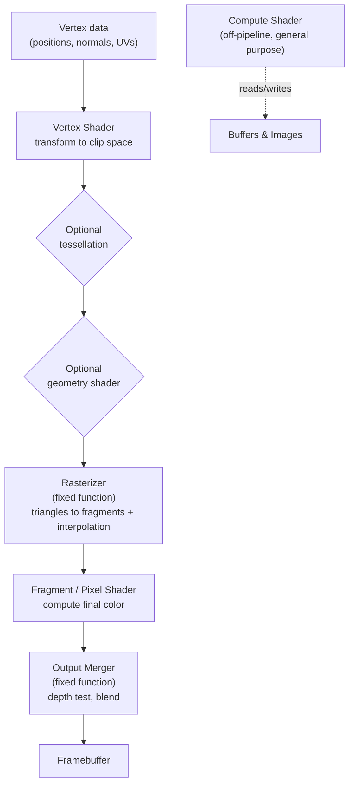

# Shader Programming

[3D Graphics &amp; Rendering](3d-rendering.html) &raquo; Shader Programming

A shader is a small program that runs on the GPU, executed in parallel across thousands of vertices or pixels. Shaders are the programmable heart of the rendering pipeline: they decide where geometry lands on screen, how light interacts with a surface, and how the final image is filtered. This page covers the programmable pipeline, the major shader stages, GLSL and HLSL fundamentals, physically based shading, common effects, and the performance realities of writing code that runs a million times per frame. Four ideas shape how shaders are written:

- **SPMD, not serial.** One shader is written once but executed for every vertex or fragment in lock-step. You write code from the perspective of a single element and let the hardware fan it out.
- **Stages pass data forward.** The vertex stage outputs interpolated values the fragment stage consumes. Most shader bugs are mismatched or wrongly-spaced varyings.
- **Lighting is math.** A surface's appearance is a function evaluated per pixel — dot products of normals and light directions, fed through a BRDF.
- **Cost multiplies.** An instruction in a fragment shader runs once per covered pixel — millions of times per frame. Small inefficiencies become whole milliseconds.

## The Programmable Pipeline

Early GPUs implemented a **fixed-function pipeline**: transforms and lighting were hardwired and configured through a fixed set of switches. Modern GPUs replaced the configurable stages with **programmable stages** — shaders — while keeping certain stages (rasterization, depth/stencil test, blending) fixed-function because they map onto dedicated hardware.



The **only required programmable stages** are the vertex and fragment shaders. Tessellation and geometry stages are optional and frequently skipped. Compute shaders sit *outside* the rasterization pipeline entirely — they read and write arbitrary buffers and images for general-purpose GPU work.

The crucial mental model: a shader is written for **one element** (one vertex, or one fragment) but the GPU runs it across all of them simultaneously. This is the **SPMD** (single program, multiple data) model. You never write a loop over vertices — you write the body that processes one vertex, and the hardware dispatches it.

### What Flows Between Stages

| Input class | Meaning | Frequency |
|-------------|---------|-----------|
| **Attributes / inputs** | Per-vertex data streamed from vertex buffers (position, normal, UV, color) | Once per vertex |
| **Uniforms / constants** | Read-only values constant across a draw call (matrices, light data, time) | Set per draw |
| **Varyings / interpolants** | Vertex-shader outputs, perspective-correctly interpolated across the triangle before reaching the fragment shader | Per fragment |
| **Samplers / textures** | Bound image resources sampled by coordinate | Per access |
| **Storage buffers / images** | Read-write resources (compute, modern fragment shaders) | Per access |

The single most common source of confusion is the **varying**: a value the vertex shader writes per-vertex, which the rasterizer interpolates so the fragment shader receives a smoothly blended value for its specific pixel. A normal written at three triangle corners arrives at an interior pixel as a weighted blend — which is exactly why interpolated normals must be re-normalized in the fragment shader.

## Shader Stages

### Vertex Shader

The vertex shader runs once per vertex. Its mandatory job is to output a clip-space position; it usually also forwards data the fragment shader needs.

```glsl
#version 450

// Per-vertex inputs (attributes)
layout(location = 0) in vec3 inPosition;
layout(location = 1) in vec3 inNormal;
layout(location = 2) in vec2 inTexCoord;

// Uniforms: constant across the draw call
layout(binding = 0) uniform Matrices {
    mat4 model;
    mat4 view;
    mat4 projection;
};

// Outputs (varyings) to the fragment shader
layout(location = 0) out vec3 fragWorldPos;
layout(location = 1) out vec3 fragNormal;
layout(location = 2) out vec2 fragTexCoord;

void main() {
    vec4 worldPos = model * vec4(inPosition, 1.0);
    fragWorldPos  = worldPos.xyz;

    // Transform normals by the inverse-transpose to stay correct under
    // non-uniform scaling. Computing this per-vertex is wasteful in
    // production — pass a precomputed normal matrix as a uniform instead.
    fragNormal    = mat3(transpose(inverse(model))) * inNormal;
    fragTexCoord  = inTexCoord;

    gl_Position = projection * view * worldPos;
}
```

Writing `gl_Position` is the contract: it is the homogeneous clip-space coordinate the rasterizer divides by `w` to reach normalized device coordinates.

### Fragment (Pixel) Shader

The fragment shader runs once per **fragment** — a candidate pixel produced by rasterizing a triangle. It receives interpolated varyings and outputs a color (and optionally depth). A "fragment" is not yet a pixel: it may be discarded by the depth test, or blended with what is already there.

```glsl
#version 450

layout(location = 0) in vec3 fragWorldPos;
layout(location = 1) in vec3 fragNormal;
layout(location = 2) in vec2 fragTexCoord;

layout(binding = 1) uniform sampler2D albedoTex;

layout(binding = 2) uniform Lighting {
    vec3 lightPos;
    vec3 lightColor;
    vec3 cameraPos;
};

layout(location = 0) out vec4 outColor;

void main() {
    vec3 albedo = texture(albedoTex, fragTexCoord).rgb;

    // Interpolated normals are not unit length — renormalize.
    vec3 N = normalize(fragNormal);
    vec3 L = normalize(lightPos - fragWorldPos);
    vec3 V = normalize(cameraPos - fragWorldPos);
    vec3 H = normalize(L + V);

    float diffuse  = max(dot(N, L), 0.0);
    float specular = pow(max(dot(N, H), 0.0), 32.0);

    vec3 color = albedo * (0.1 + diffuse) + lightColor * specular;
    outColor = vec4(color, 1.0);
}
```

GPUs always rasterize fragments in **2×2 quads** so that screen-space derivatives (`dFdx`/`dFdy`, used for mipmap selection) can be computed by finite differences between neighbors. A direct consequence: even a one-pixel-wide triangle shades four fragments, and `discard`ing fragments does not free up their quad neighbors.

### Tessellation Shaders

Tessellation subdivides coarse patches into finer geometry **on the GPU**, so the application can stream low-poly meshes and add detail dynamically (terrain, displacement, smooth curved surfaces). It is two programmable stages around a fixed-function tessellator:

- **Tessellation Control Shader (TCS)** / *Hull Shader* (HLSL): runs per patch, outputs tessellation factors (how finely to subdivide) and control points.
- **Tessellator** (fixed function): generates new vertices in the patch's parametric domain.
- **Tessellation Evaluation Shader (TES)** / *Domain Shader* (HLSL): runs per generated vertex, computes its final position (e.g. by sampling a displacement map).

Tessellation factors are usually driven by distance to camera, giving continuous, pop-free level of detail.

### Geometry Shader

The geometry shader runs once per **primitive** (point, line, triangle) and can emit zero or more new primitives. It is uniquely able to *create and destroy* geometry on the fly — used for point-sprite expansion, fur/grass fins, wireframe overlays, or single-pass cubemap/layered rendering.

It is widely considered a performance trap: its variable output makes it hard for the hardware to schedule, and on many GPUs it serializes poorly. Modern engines prefer compute shaders or **mesh shaders** for the same effects.

### Compute Shader

Compute shaders escape the rasterization pipeline. They run a flat grid of threads (organized into **workgroups**) over arbitrary data, reading and writing buffers and images. They power particle simulation, culling, physics, image processing, GPGPU, and increasingly the core of modern renderers (tiled/clustered light culling, GPU-driven rendering).

```glsl
#version 450

// One workgroup is 16x16 = 256 invocations.
layout(local_size_x = 16, local_size_y = 16) in;

layout(binding = 0, rgba8) uniform readonly  image2D inputImage;
layout(binding = 1, rgba8) uniform writeonly image2D outputImage;

void main() {
    ivec2 coord = ivec2(gl_GlobalInvocationID.xy);
    ivec2 size  = imageSize(inputImage);
    if (coord.x >= size.x || coord.y >= size.y) return; // guard the edges

    // 3x3 box blur
    vec4 sum = vec4(0.0);
    for (int dy = -1; dy <= 1; ++dy)
        for (int dx = -1; dx <= 1; ++dx)
            sum += imageLoad(inputImage,
                       clamp(coord + ivec2(dx, dy), ivec2(0), size - 1));

    imageStore(outputImage, coord, sum / 9.0);
}
```

The host dispatches a number of workgroups (`glDispatchCompute(ceil(w/16), ceil(h/16), 1)`); each workgroup runs `local_size_x * local_size_y * local_size_z` invocations. Threads in a workgroup can cooperate through fast **shared memory** and **barriers**, which is the key to efficient reductions, prefix sums, and tiled algorithms.

### Mesh & Task Shaders

The newest pipeline (DX12 Ultimate, Vulkan) replaces the entire vertex/tessellation/geometry front-end with two compute-like stages: **task (amplification) shaders** decide how much geometry to produce, and **mesh shaders** emit small clusters of primitives (meshlets) directly. This gives the application fine-grained, GPU-driven control over culling and LOD and underpins systems like UE5 Nanite.

## GLSL and HLSL Basics

The two dominant shading languages are **GLSL** (OpenGL/Vulkan, via SPIR-V) and **HLSL** (DirectX, and increasingly Vulkan too). Metal uses **MSL**; the web uses **WGSL**. They share C-like syntax and the same vocabulary of vectors, matrices, and samplers, differing mostly in keywords and built-ins.

### Core Types

| Concept | GLSL | HLSL |
|---------|------|------|
| Float vectors | `vec2 vec3 vec4` | `float2 float3 float4` |
| Integer vectors | `ivec2 ...` | `int2 ...` |
| Matrices | `mat3 mat4` (column-major) | `float3x3 float4x4` (row-major by default) |
| Texture + sampler | `sampler2D` (combined) | `Texture2D` + `SamplerState` (separate) |
| Fragment entry | `void main()` | `float4 PSMain(...) : SV_Target` |
| Vertex output position | `gl_Position` | `SV_Position` semantic |
| Texture fetch | `texture(tex, uv)` | `tex.Sample(samp, uv)` |
| Interpolant linkage | `layout(location=N)` | semantics (`TEXCOORD0`, etc.) |

### Swizzling and Vector Math

A defining feature of shading languages is **swizzling** — reordering and replicating vector components with member syntax:

```glsl
vec4 c = vec4(1.0, 0.5, 0.2, 1.0);
vec3 rgb  = c.rgb;        // (1.0, 0.5, 0.2)
vec3 bgr  = c.bgr;        // (0.2, 0.5, 1.0)
vec2 uv   = c.xy;         // position-style names alias the same fields
float g   = c.g;          // single component
vec4 gray = c.gggg;       // replicate green to all four lanes
c.xy = c.yx;              // swizzles are valid l-values (swap r and g)
```

Vector operations are **component-wise** by default; `a * b` multiplies element by element. Use the built-ins `dot`, `cross`, and matrix multiplication for linear algebra.

### Essential Built-in Functions

| Function | Purpose |
|----------|---------|
| `normalize(v)` | Scale a vector to unit length |
| `dot(a, b)` / `cross(a, b)` | Dot / cross product |
| `length(v)` / `distance(a, b)` | Magnitude / point distance |
| `mix(a, b, t)` (`lerp` in HLSL) | Linear interpolation |
| `clamp(x, lo, hi)` / `saturate(x)` | Clamp to range / to [0,1] |
| `step(edge, x)` / `smoothstep(a, b, x)` | Hard / smooth threshold |
| `pow`, `exp`, `log`, `sqrt`, `inversesqrt` | Scalar math (component-wise) |
| `reflect(I, N)` / `refract(I, N, eta)` | Reflection / refraction vectors |
| `dFdx(v)` / `dFdy(v)` / `fwidth(v)` | Screen-space derivatives (fragment only) |
| `texture(s, uv)` / `textureLod(s, uv, lod)` | Sample a texture (auto / explicit mip) |

### Precision and Qualifiers

GLSL ES (mobile/WebGL) requires precision qualifiers — `highp`, `mediump`, `lowp`. Desktop GLSL ignores them, but mobile GPUs honor them, and choosing `mediump` for values that tolerate it (most colors and UVs do not need full float precision) is a meaningful mobile optimization. Storage qualifiers (`in`, `out`, `uniform`, `flat`, `centroid`) control how data crosses stage boundaries; `flat` in particular disables interpolation, which is required for integer varyings and useful for per-triangle constants.

## Physically Based Shading

**Physically based rendering (PBR)** shades surfaces with a model grounded in real optics, so materials look correct under any lighting and stay consistent between scenes. It replaced the ad-hoc Phong/Blinn-Phong era as the industry standard. PBR rests on a few principles: energy conservation (a surface cannot reflect more light than it receives), a microfacet model of roughness, and a clean split between metals and non-metals (dielectrics).

### The Rendering Equation

All physically based shading approximates the **rendering equation**: outgoing radiance in a direction is emitted light plus the integral, over the hemisphere, of incoming radiance weighted by the surface's BRDF and the cosine of the incidence angle.

$$L_o(\mathbf{v}) = L_e(\mathbf{v}) + \int_{\Omega} f_r(\mathbf{l}, \mathbf{v})\, L_i(\mathbf{l})\, (\mathbf{n} \cdot \mathbf{l})\, d\omega_l$$

Real-time shaders cannot evaluate that integral exactly, so they sum over a handful of discrete lights and approximate environment lighting with precomputed probes.

### The Cook-Torrance BRDF

The dominant specular model is **Cook-Torrance**, a microfacet BRDF. It imagines the surface as countless tiny mirrors whose orientation statistics encode roughness:

$$f_{\text{specular}} = \frac{D(\mathbf{h})\, F(\mathbf{v}, \mathbf{h})\, G(\mathbf{l}, \mathbf{v})}{4\, (\mathbf{n} \cdot \mathbf{l})\, (\mathbf{n} \cdot \mathbf{v})}$$

The three terms each model a physical effect:

- **D — Normal Distribution Function.** What fraction of microfacets are aligned with the halfway vector. **GGX / Trowbridge-Reitz** is the modern choice for its long, realistic highlight tails.
- **F — Fresnel.** How reflectivity rises at grazing angles. Almost always the **Schlick approximation**.
- **G — Geometry / shadowing-masking.** How microfacets shadow and mask each other at grazing angles. **Smith** with a GGX-matched distribution.

The Schlick Fresnel approximation, which nearly every PBR shader uses:

$$F(\mathbf{v}, \mathbf{h}) = F_0 + (1 - F_0)\,\bigl(1 - (\mathbf{v} \cdot \mathbf{h})\bigr)^{5}$$

Here $F_0$ is the reflectance at normal incidence: roughly `0.04` for dielectrics, and the metal's base color for metals. The **metallic** parameter simply interpolates $F_0$ between those two and zeroes out the diffuse term for metals (metals have no diffuse reflection).

### The Metallic-Roughness Workflow

Most engines and the glTF standard use the **metallic-roughness** parameterization, which an artist or texture authors as a small set of maps:

| Map | Range | Meaning |
|-----|-------|---------|
| **Base Color (albedo)** | RGB | Diffuse color (dielectric) or specular $F_0$ (metal) |
| **Metallic** | 0–1 | 0 = dielectric, 1 = metal; selects how base color is used |
| **Roughness** | 0–1 | Microfacet spread: 0 = mirror, 1 = fully matte |
| **Normal** | RGB (tangent space) | Per-pixel surface direction |
| **Ambient Occlusion** | 0–1 | Baked self-occlusion of indirect light |

A compact GGX specular implementation:

```glsl
const float PI = 3.14159265359;

// GGX / Trowbridge-Reitz normal distribution
float distributionGGX(vec3 N, vec3 H, float roughness) {
    float a  = roughness * roughness;     // perceptual -> linear roughness
    float a2 = a * a;
    float NdotH = max(dot(N, H), 0.0);
    float d = (NdotH * NdotH) * (a2 - 1.0) + 1.0;
    return a2 / (PI * d * d);
}

// Schlick-GGX geometry term (one direction)
float geometrySchlickGGX(float NdotX, float roughness) {
    float r = roughness + 1.0;
    float k = (r * r) / 8.0;              // direct-lighting remap
    return NdotX / (NdotX * (1.0 - k) + k);
}

// Smith: combine view and light masking
float geometrySmith(vec3 N, vec3 V, vec3 L, float roughness) {
    return geometrySchlickGGX(max(dot(N, V), 0.0), roughness)
         * geometrySchlickGGX(max(dot(N, L), 0.0), roughness);
}

// Fresnel-Schlick
vec3 fresnelSchlick(float cosTheta, vec3 F0) {
    return F0 + (1.0 - F0) * pow(clamp(1.0 - cosTheta, 0.0, 1.0), 5.0);
}

vec3 cookTorrance(vec3 N, vec3 V, vec3 L, vec3 albedo,
                  float metallic, float roughness) {
    vec3 H = normalize(V + L);
    vec3 F0 = mix(vec3(0.04), albedo, metallic); // dielectric vs metal

    float D = distributionGGX(N, H, roughness);
    float G = geometrySmith(N, V, L, roughness);
    vec3  F = fresnelSchlick(max(dot(H, V), 0.0), F0);

    vec3  numerator   = D * G * F;
    float denominator = 4.0 * max(dot(N, V), 0.0) * max(dot(N, L), 0.0) + 1e-4;
    vec3  specular    = numerator / denominator;

    // Energy conservation: light reflected (F) is not diffusely scattered.
    vec3 kD = (vec3(1.0) - F) * (1.0 - metallic);
    vec3 diffuse = kD * albedo / PI;

    float NdotL = max(dot(N, L), 0.0);
    return (diffuse + specular) * NdotL;
}
```

### Image-Based Lighting

Direct lights alone leave PBR materials looking flat. **Image-based lighting (IBL)** supplies the ambient/indirect term by treating an environment map (a cubemap or equirectangular HDRI) as a giant area light. It is split into two precomputed pieces: an **irradiance map** (the diffuse contribution, a heavily blurred convolution of the environment) and a **prefiltered environment map** plus a **BRDF integration LUT** (the split-sum approximation for specular). At runtime the shader samples these by surface normal and reflection vector — cheap lookups standing in for an expensive hemisphere integral.

## Common Effects

### Diffuse and Specular Lighting

The foundation is **Lambertian diffuse** — brightness proportional to `max(dot(N, L), 0)` — plus a specular highlight. The classic non-PBR specular is **Blinn-Phong**, using the halfway vector $\mathbf{h} = \text{normalize}(\mathbf{l} + \mathbf{v})$ and `pow(dot(N, H), shininess)`. It remains useful for stylized work and cheap mobile content where full Cook-Torrance is overkill.

### Normal Mapping

A **normal map** stores a perturbed surface normal per texel, letting a flat triangle catch light as if covered in fine bumps — at zero extra geometry cost. The normals are stored in **tangent space** (relative to the surface), which is why the map looks predominantly blue: the unperturbed normal `(0,0,1)` encodes to `(0.5, 0.5, 1.0)`.

To apply it, the shader transforms the sampled normal from tangent space to world space using the **TBN matrix** (tangent, bitangent, normal), built from per-vertex tangents:

```glsl
// In the vertex shader: pass world-space T, B, N.
// In the fragment shader:
vec3 sampledNormal = texture(normalMap, uv).rgb * 2.0 - 1.0; // [0,1] -> [-1,1]
mat3 TBN = mat3(normalize(fragTangent),
                normalize(fragBitangent),
                normalize(fragNormal));
vec3 N = normalize(TBN * sampledNormal);  // now in world space
```

### Parallax Mapping

Normal mapping fakes lighting but not silhouette or motion-parallax — the surface is still geometrically flat. **Parallax mapping** offsets the texture coordinate along the view direction using a height/depth map, so texels appear to shift with viewing angle, conveying real depth. The robust variant, **parallax occlusion mapping (POM)**, ray-marches the height field per pixel and even casts self-shadows, at meaningfully higher cost.

```glsl
// Steepest descent through a depth map along the view direction (tangent space).
vec2 parallaxOcclusion(vec2 uv, vec3 viewDirTS, sampler2D depthMap,
                       float heightScale) {
    const float numLayers = 32.0;
    float layerDepth = 1.0 / numLayers;
    vec2  P = viewDirTS.xy / viewDirTS.z * heightScale;
    vec2  deltaUV = P / numLayers;

    float currentDepth = 0.0;
    vec2  currentUV    = uv;
    float sampledDepth = texture(depthMap, currentUV).r;

    while (currentDepth < sampledDepth) {
        currentUV    -= deltaUV;
        sampledDepth  = texture(depthMap, currentUV).r;
        currentDepth += layerDepth;
    }

    // Interpolate between the last two layers for a smooth result.
    vec2  prevUV = currentUV + deltaUV;
    float after  = sampledDepth - currentDepth;
    float before = texture(depthMap, prevUV).r - currentDepth + layerDepth;
    float weight = after / (after - before);
    return mix(currentUV, prevUV, weight);
}
```

### Post-Processing

Post-process effects are full-screen passes: a fragment (or compute) shader runs over the rendered image to filter it. Common members of the chain include bloom, depth of field, motion blur, screen-space ambient occlusion (SSAO), color grading, and **tone mapping** — the mandatory step that compresses high-dynamic-range light into the [0,1] display range:

```glsl
// ACES filmic tone mapping curve (Narkowicz fit).
vec3 toneMapACES(vec3 x) {
    const float a = 2.51, b = 0.03, c = 2.43, d = 0.59, e = 0.14;
    return clamp((x * (a * x + b)) / (x * (c * x + d) + e), 0.0, 1.0);
}

// Reinhard (simpler, lower contrast)
vec3 toneMapReinhard(vec3 hdr) {
    return hdr / (hdr + vec3(1.0));
}
```

The canonical way to run a post pass is a single **fullscreen triangle** (larger than the screen, clipped to it) generated entirely in the vertex shader from `gl_VertexIndex`, with no vertex buffer bound — cheaper than a quad and free of the diagonal seam a two-triangle quad introduces.

## UVs and Texture Sampling

**UV coordinates** (also called texture coordinates) are 2D values, conventionally in `[0, 1]`, that map each vertex onto a texture. The rasterizer interpolates them across the triangle, and the fragment shader samples the texture at the resulting per-pixel UV.

### Sampling Mechanics

Sampling is more than a memory read. A **sampler** specifies:

- **Filtering** — how between-texel values are reconstructed. *Nearest* picks the closest texel (blocky, pixel-art); *bilinear* blends the four nearest; *trilinear* additionally blends between mip levels; *anisotropic* takes more samples along the direction of texture compression for sharp grazing-angle surfaces.
- **Wrap / address mode** — what happens outside `[0,1]`: `repeat` (tiling), `mirror`, `clamp-to-edge`, or `clamp-to-border`.
- **Mip selection** — which level of the mipmap chain to read, derived from screen-space UV derivatives.

### Mipmapping

A **mipmap** is a precomputed chain of progressively halved versions of a texture. When a textured surface recedes into the distance, many texels fall inside one pixel; sampling the full-resolution texture then *aliases* and shimmers under motion. Mipmapping fixes this by selecting a smaller pre-averaged level. The hardware chooses the level from the rate of change of UVs across the 2×2 fragment quad — `fwidth(uv)` — which is precisely why fragments are shaded in quads.

A subtle but important rule: **mip selection depends on derivatives**, so sampling inside divergent control flow (an `if` where neighboring fragments disagree) yields undefined derivatives. Sample textures at uniform control-flow scope, or fetch an explicit mip with `textureLod`.

### Texture Atlases and UV Pitfalls

Packing many images into one **atlas** cuts texture binds and draw calls but reintroduces bleeding at tile edges under bilinear filtering and mipmapping — guard with padding/gutters or half-texel insets. Other recurring pitfalls: forgetting that some APIs put UV origin at the top-left and others at the bottom-left (flip `v` when importing), and sampling sRGB color textures as if they were linear (use an sRGB texture format or convert in-shader so lighting math runs in linear space).

## Performance and Platform Differences

A fragment shader instruction executes once per covered pixel — for a full-screen effect at 4K that is over 8 million times, 60 times a second. Shader performance is therefore a first-order concern, governed less by clever algorithms than by feeding the GPU's parallel hardware evenly.

### The Cost Model

| Cost driver | Why it hurts | Mitigation |
|-------------|--------------|------------|
| **Warp divergence** | A warp (32) / wavefront (64) of threads runs in lock-step; a branch where lanes disagree executes *both* sides with masking | Keep branches uniform across a warp; prefer `mix`/`step` over `if` for cheap selects |
| **Overdraw** | Shading a pixel later overwritten by a nearer one | Sort front-to-back, depth pre-pass, cut transparency |
| **Texture bandwidth / cache misses** | Random or high-resolution sampling stalls on memory | Mipmaps, compressed formats, coherent access, fewer/smaller textures |
| **Register pressure (low occupancy)** | A shader using many registers limits how many warps run concurrently, hiding less latency | Shorten shaders, reduce live variables, avoid huge unrolled loops |
| **Dependent texture reads** | Sampling at a UV computed from a previous sample serializes latency | Precompute coordinates; avoid chains of dependent fetches |
| **Expensive instructions** | `pow`, `sin`, `exp`, divides, normalize are multi-cycle | Use cheaper approximations; precompute in uniforms or LUTs |

The recurring theme is **occupancy** — how many warps the GPU can keep in flight to hide memory latency. Long shaders, heavy register use, and large workgroup shared-memory requests all reduce occupancy, and a shader that is "correct but slow" is very often simply a low-occupancy shader.

### Platform Differences

Shaders are not write-once-run-everywhere, even when the language is the same:

- **Mobile / tiled GPUs** (Apple, ARM Mali, Qualcomm Adreno) use **tile-based deferred rendering**: the screen is split into tiles kept in fast on-chip memory. This makes alpha blending and avoiding full-screen `discard` cheap-to-careful in different ways than on desktop, makes framebuffer fetch nearly free, and makes precision qualifiers (`mediump`) genuinely matter. Bandwidth, not compute, is usually the bottleneck.
- **Desktop / immediate-mode GPUs** (NVIDIA, AMD) hide latency through massive occupancy and large caches; they tolerate longer shaders but punish overdraw and divergence harder at high resolution.
- **APIs and languages** diverge: GLSL compiles to SPIR-V for Vulkan; HLSL targets DXIL for DirectX; Metal uses MSL; the web uses WGSL/WebGPU and the older GLSL ES via WebGL. Cross-platform engines author once and **transpile** (via tools like SPIRV-Cross, or a shared shader language) rather than hand-port.
- **Driver compilation cost** is itself a platform issue: shaders compile at load or first use, causing stutter. Engines mitigate with pipeline state object (PSO) caches and precompilation passes.

### Practical Optimization Checklist

- Move per-frame-constant math out of the fragment shader into the vertex shader or a uniform.
- Prefer `mediump`/`half` precision where the eye cannot tell (most color and UV math on mobile).
- Replace conditional discards and branches with `mix`/`step`/`clamp` arithmetic when the work is cheap on both sides.
- Use mipmaps and compressed texture formats (BCn on desktop, ASTC/ETC2 on mobile) to cut bandwidth.
- Batch a depth pre-pass for heavy fragment shaders so overdraw is shaded once.
- Profile before optimizing — the bottleneck is rarely where intuition says.

## Debugging Shaders

Shaders have no `printf` and no breakpoints in the conventional sense, and a single bug is replicated across millions of invocations. Debugging is consequently a discipline of visualization and specialized tooling.

### Visual Debugging

The first-resort technique is to **output intermediate values as color**. If lighting is wrong, render the normal directly (`outColor = vec4(N * 0.5 + 0.5, 1.0)`) and check it points sensibly; render UVs as `vec4(uv, 0, 1)` to confirm the mapping; render `vec4(vec3(depth), 1.0)` to inspect depth. A surface that turns up magenta or black usually means a NaN, an unbound texture, or a normalize-of-zero — all visible at a glance.

### GPU Debugging Tools

| Tool | Platform | Strength |
|------|----------|----------|
| **RenderDoc** | Vulkan, D3D, GL, mobile | Free, captures a frame; step the pipeline, inspect every resource and the value of any pixel's shader inputs/outputs |
| **NVIDIA Nsight Graphics** | NVIDIA | Deep profiling, shader source debugging, warp-level inspection |
| **PIX** | Windows / D3D / Xbox | Capture, profile, and debug shaders on Microsoft platforms |
| **Xcode GPU debugger** | Apple / Metal | Per-line shader profiling on Apple GPUs |
| **Radeon GPU Profiler / RGA** | AMD | Wavefront occupancy and instruction-level analysis |

**RenderDoc** is the workhorse for cross-API work: it freezes a captured frame so you can pick any pixel, see which draw call produced it, inspect the exact uniform and texture values that fed its shader, and watch the shader execute on that pixel's data.

### Common Bugs and Their Signatures

- **Black or magenta surface** — unbound texture, sampling outside a defined resource, or a NaN propagating (often `normalize` of a zero vector, or `pow` of a negative base).
- **Inverted or flat lighting** — normals not renormalized after interpolation, wrong handedness in the TBN matrix, or a normal map sampled as sRGB instead of linear.
- **Z-fighting / shadow acne** — depth precision and missing bias, not a shader logic error per se but surfaces in shaded output.
- **Seams across UV islands** — derivative discontinuities at UV wrap points break mip selection; sample with explicit LOD across seams.
- **Banding in gradients** — insufficient precision (`lowp`/8-bit) or missing dithering in the output.
- **Whole-object pop or flicker** — divergent control flow producing undefined derivatives, or NaNs surviving a `max`/`min` and poisoning a TAA history buffer.

A disciplined workflow — isolate the stage, visualize the suspect value, capture the frame in RenderDoc, and inspect the failing pixel — resolves the overwhelming majority of shader defects faster than reading the code.

## Key Takeaways

- **Write for one element.** A shader processes a single vertex or fragment; the GPU fans it out across thousands in lock-step. Think SPMD, not loops.
- **Vertex out, fragment in.** The vertex stage writes varyings the rasterizer interpolates and the fragment stage consumes. Always renormalize interpolated normals.
- **PBR is the standard.** Albedo, metallic, and roughness feed a Cook-Torrance (GGX) BRDF that behaves correctly under any lighting.
- **Maps fake geometry.** Normal, parallax, and displacement maps add surface detail in the shader at a fraction of the cost of real triangles.
- **Sampling is quad-based.** Fragments shade in 2×2 quads so mip selection has derivatives — which is why texturing in divergent branches misbehaves.
- **Divergence and overdraw cost.** Lock-step warps punish branchy shaders, and overdraw shades pixels twice. Uniform work and depth pre-passes pay off.
- **Visualize to debug.** No printf — output values as color and capture frames in RenderDoc to inspect any pixel's shader inputs.

## See Also
- [3D Graphics &amp; Rendering](3d-rendering.html) - The pipeline, lighting, and GPU architecture these shaders run on
- [GPU Optimization](../optimization/gpu-optimization.html) - Profiling and tuning GPU workloads
- [Game Development](../gamedev/) - Engines and real-time rendering in context
- [VR/AR Development](../vr-ar/) - Stereo rendering and XR-specific shading concerns
- [Unreal Engine](../technology/unreal.html) - Nanite, Lumen, and the material editor

