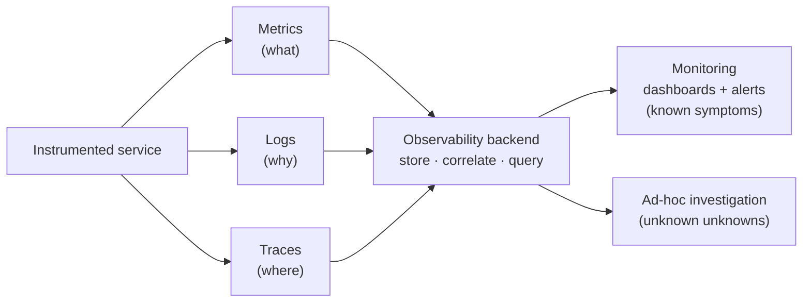
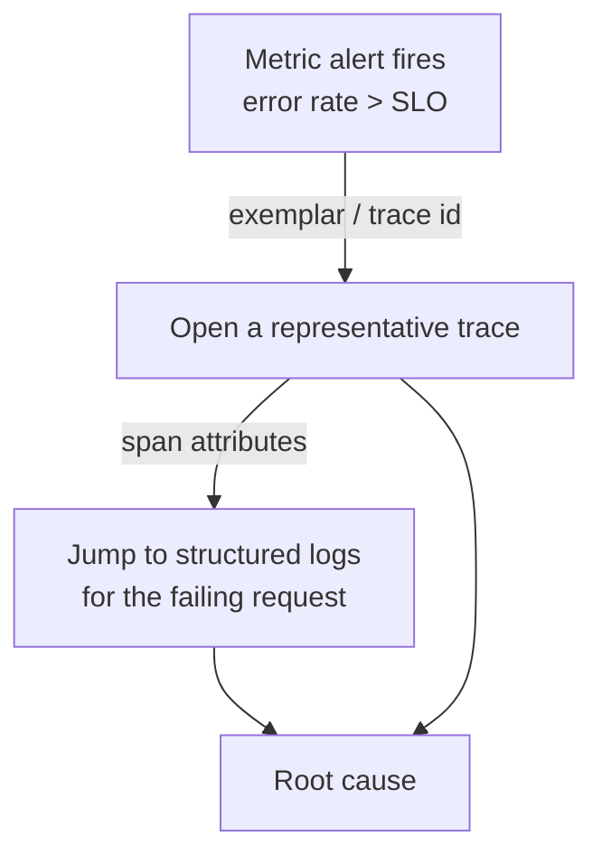

  <h1 style="color: white; margin: 0; font-size: 2.5rem;">Observability</h1>
  
Metrics, logs, and traces — understanding the internal state of production systems from their external output

Observability is the practice of instrumenting systems so that their internal behavior can be inferred from the telemetry they emit. Modern services are distributed, dynamic, and partially failing at all times; you cannot SSH into one box and read a log file to understand them. This hub frames the core idea — observability as a property you design *into* a system — and routes you into focused pages for each of the three pillars: metrics, logging, and tracing.

## Overview

Observability is the ability to understand the internal state of a system purely from the data it exposes — its metrics, logs, and traces — without shipping new code to ask a new question. The term is borrowed from control theory, where a system is *observable* if its internal state can be reconstructed from its outputs over time. Applied to software, the bar is practical: when something breaks at 3 a.m., can you diagnose a novel failure mode with the telemetry you already collect, or do you have to add a log line and redeploy to find out what happened?

**What you'll get:** a working mental model of why observability is distinct from traditional monitoring, the three pillars and what each is good (and bad) at, and the SLO/error-budget framework that ties them to engineering and product decisions. From here you can branch into the focused pages for each pillar.

**Assumed background:** comfort with running a service in production, basic networking, and the idea that systems are composed of many independently failing parts. No prior SRE experience required.

### Observability vs. Monitoring

The two terms are often used interchangeably, but they describe different postures toward failure.

**Monitoring** is checking whether a system is in one of a *known* set of bad states. You decide in advance what can go wrong — disk full, CPU pegged, endpoint returning 500s — and you build a dashboard or an alert for each. Monitoring answers questions you already knew to ask. It is necessary, well-understood, and sufficient for systems simple enough that you can enumerate their failure modes.

**Observability** is the property that lets you ask *new* questions about a system without deploying new instrumentation. It is about the *unknown unknowns* — the emergent failure modes of distributed systems that nobody predicted, where the dashboard is green but a specific cohort of users on a specific code path is failing. A monitored system tells you *that* something is wrong; an observable system lets you interrogate *why*, even when "why" is a question you'd never thought to pre-build.

| | Monitoring | Observability |
|---|---|---|
| **Questions** | Known, pre-defined ("is the disk full?") | Arbitrary, asked after the fact ("why are p99 latencies up only for EU mobile users?") |
| **Failure modes** | Known unknowns | Unknown unknowns |
| **Data** | Aggregated, low-cardinality | High-cardinality, high-dimensional |
| **Typical question shape** | Boolean / threshold | Exploratory, slice-and-dice |
| **Maps to** | Dashboards, alerts | Ad-hoc querying across metrics, logs, traces |

Observability does not replace monitoring — you still alert on a handful of known, user-facing symptoms. Rather, monitoring is what you do with an observable system once you've decided which signals matter. The shift in modern systems is that the *enumerate-every-failure-mode* approach stops scaling once you have hundreds of services, autoscaling replicas, and deploys many times a day. At that point, instrumenting for arbitrary questions becomes a design requirement, not a luxury.

### The Three Pillars

Observability is conventionally built from three complementary signal types. None is sufficient alone; each compensates for the others' blind spots.

**1. Metrics — aggregated numeric time series.** A metric is a number measured over time: requests per second, error ratio, queue depth, p99 latency, memory saturation. Metrics are cheap to store and fast to query because they are pre-aggregated — a counter incremented millions of times costs the same to store as one incremented once. That same aggregation is their weakness: once you've summed everything into a counter, you can no longer recover the individual events. Metrics are the natural home for **dashboards** and **alerting**, and the four "golden signals" (latency, traffic, errors, saturation) live here. See **[Metrics &amp; Monitoring](metrics.html)**.

**2. Logs — discrete event records.** A log is a timestamped record of a single event, ideally **structured** (key/value or JSON) rather than free-text. Logs carry the high-cardinality detail metrics throw away: the exact user ID, request parameters, error message, and stack trace of one failing request. The cost is volume — logs are expensive to store and search at scale, which drives sampling, retention tiers, and the move from string-grepping to structured querying. See **[Logging](logging.html)**.

**3. Traces — causal request paths.** A distributed trace follows a single request as it fans out across services, recording a tree of **spans** (each a timed unit of work) linked by a propagated trace context. Traces answer the question metrics and logs struggle with in a microservice mesh: *which* of the twelve services this request touched added the 800 ms, and was it on the critical path? See **[Distributed Tracing](tracing.html)**.

The pillars are most powerful when **correlated**: a metric alert points you at a time window, exemplars or trace IDs on that metric jump you to representative traces, and span attributes link out to the structured logs for the exact failing requests. Modern instrumentation (notably **OpenTelemetry**) emits all three from a single SDK with a shared context so this correlation is built in rather than stitched together by hand.

### Service Level Objectives and Error Budgets

Telemetry is only useful if it drives decisions, and the framework that connects signals to decisions is the **SLI / SLO / SLA** hierarchy popularized by Google's SRE practice.

- **SLI — Service Level Indicator.** A quantitative measure of some aspect of service health, almost always expressed as *good events / valid events*. Examples: the proportion of HTTP requests served in under 300 ms, or the proportion of requests that did not return a 5xx. A good SLI is a ratio between 0 and 1 that tracks the user's actual experience.
- **SLO — Service Level Objective.** A target for an SLI over a window. For example: "99.9% of requests over a rolling 28-day window complete successfully." The SLO is an internal commitment — the line between "healthy enough" and "needs attention."
- **SLA — Service Level Agreement.** A contractual promise to customers, usually *looser* than the internal SLO and carrying financial penalties when breached. You set the SLO stricter than the SLA so you notice and react before the contract is at risk.

The pivotal idea is the **error budget**: the amount of unreliability the SLO *permits*. If your availability SLO is 99.9% over 28 days, you are explicitly allowed to be unavailable for the remaining 0.1% — roughly 40 minutes per month. That budget is a resource to spend:

$$
\text{error budget} = 1 - \text{SLO}
$$

For a request-based availability SLO over a window of $N$ valid requests, the number of failures you can absorb before breaching is:

$$
\text{failures allowed} = N \times (1 - \text{SLO})
$$

And the fraction of budget already consumed at any point in the window is:

$$
\text{budget consumed} = \frac{\text{bad events so far}}{N \times (1 - \text{SLO})}
$$

The error budget reframes reliability from an absolute ("never go down") to an economic trade-off. A team with budget to spare can ship risky features and move fast; a team that has *burned* its budget freezes feature work and spends the next cycle on reliability. This turns reliability into a negotiated, data-driven decision rather than a source of perpetual conflict between developers (who want to ship) and operators (who want stability). Alerting then targets the **burn rate** — how fast the budget is being consumed — so a fast burn pages immediately while a slow burn opens a ticket.

100% is the wrong reliability target: it is impossible, prohibitively expensive, and indistinguishable to users from "almost always up" given that their own networks and devices fail more often than a well-run service does. The right SLO is the *lowest* reliability your users won't notice, which leaves the maximum budget for change.

## Explore the Pillars

The pages below go deep on each of the three pillars. Read them in pillar order, or jump straight to whichever signal you're currently trying to wrangle.

| Page | What it covers |
|------|----------------|
| [Metrics & Monitoring](metrics.html) | Counters/gauges/histograms, golden signals (RED & USE), Prometheus + PromQL, dashboards, alerting |
| [Logging](logging.html) | Structured logging, log levels, correlation IDs, aggregation pipelines, sampling, retention and cost |
| [Distributed Tracing](tracing.html) | Spans, context propagation, head/tail sampling, OpenTelemetry, latency and error localization |

## How It Fits

Observability is not a standalone discipline — it is the sensory layer over everything else you run, and it is the operational counterpart to the theory of distributed systems.

- **[Distributed Systems](../distributed-systems/).** Observability is listed there as a mandatory design concern, and for good reason: the failure modes that make distributed systems hard — partial failure, no global clock, emergent multi-node behavior — are *invisible* without tracing, metrics, and structured logs. The three pillars are how you reason about a system whose state is smeared across many machines that fail independently.
- **[Kubernetes](../technology/kubernetes/).** Containers are ephemeral and rescheduled constantly, so node-local log files and per-pod dashboards are useless. Kubernetes is the canonical environment that *forces* observability: Prometheus scrapes pod metrics through service discovery, sidecars or DaemonSets ship logs off short-lived containers, and the service mesh emits traces for east-west traffic you didn't instrument by hand.
- **[AWS Cloud Services](../technology/aws/).** Managed platforms supply the storage and query backends — CloudWatch for metrics and logs, X-Ray for traces, and managed Prometheus/Grafana — and emit their own telemetry for the infrastructure you don't operate (load balancers, queues, databases), which you stitch into the same SLOs.
- **[Networking](../technology/networking/).** Latency, packet loss, and connection saturation are first-class observability signals; many "application" incidents are network incidents wearing a costume, and the metrics pillar is where you tell them apart.

In short: distributed systems and Kubernetes create the complexity, AWS and other platforms provide the backends, and observability is the discipline that makes the resulting system understandable — and the SLO framework is how that understanding becomes operational policy.

## Key Takeaways

- **Observability is not monitoring.** Monitoring answers known questions; observability lets you ask new ones after the fact. Modern distributed systems need both.
- **Use all three pillars.** Metrics for the *what*, logs for the *why*, traces for the *where*. Correlate them so an alert leads to a trace leads to the failing log line.
- **Structure your telemetry.** Structured, high-cardinality logs and labeled metrics are queryable; free-text strings and unlabeled counters are not.
- **Define SLOs, not vibes.** An SLI is a good/valid ratio; an SLO is a target; the error budget is what you spend on shipping features.
- **100% is the wrong target.** Aim for the lowest reliability users won't notice — it maximizes the budget available for change.
- **Instrument once.** OpenTelemetry emits all three signals from a shared context, so correlation is built in rather than bolted on.

## See Also

- **[Metrics & Monitoring](metrics.html)** — the golden signals, Prometheus, and alerting.
- **[Logging](logging.html)** — structured logs, correlation IDs, and aggregation pipelines.
- **[Distributed Tracing](tracing.html)** — spans, context propagation, and OpenTelemetry.
- **[Distributed Systems](../distributed-systems/)** — the emergent, multi-node behavior observability exists to illuminate.
- **[Kubernetes](../technology/kubernetes/)** — the ephemeral, dynamic environment that makes observability mandatory.
- **[AWS Cloud Services](../technology/aws/)** — CloudWatch, X-Ray, and managed metric/trace backends.
- **[Networking](../technology/networking/)** — the substrate whose latency and loss show up first in your metrics.

### Further Reading

- "Site Reliability Engineering" by Google (the SRE Book) — SLIs, SLOs, and error budgets
- "The Site Reliability Workbook" by Google — implementing SLOs in practice
- "Observability Engineering" by Majors, Fong-Jones & Miranda
- "Distributed Systems Observability" by Cindy Sridharan
- [OpenTelemetry documentation](https://opentelemetry.io/docs/)
- [Prometheus documentation](https://prometheus.io/docs/)
