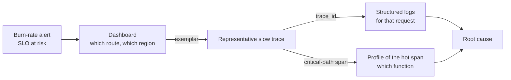
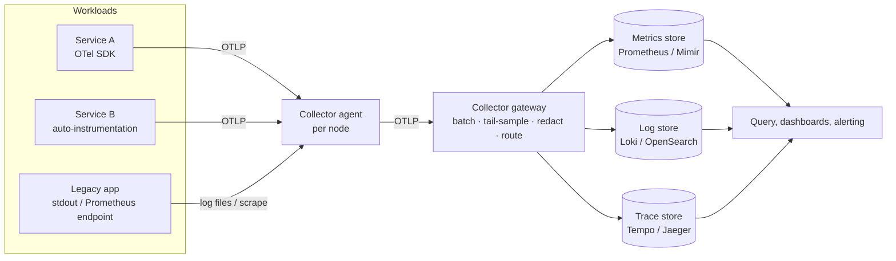
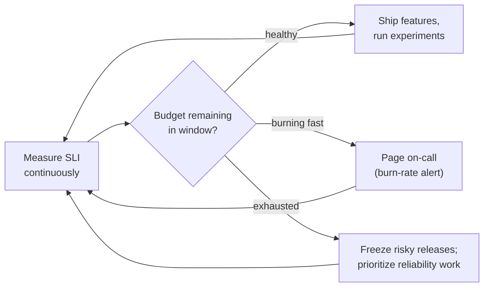

  <h1 style="color: white; margin: 0; font-size: 2.5rem;">Observability</h1>
  
Metrics, logs, and traces — understanding the internal state of production systems from their external output

**Observability** is the degree to which the internal state of a running system can be inferred from the telemetry it emits — metrics, logs, traces, and increasingly continuous profiles — without shipping new code to ask a new question. This hub defines the term, contrasts it with monitoring, describes each telemetry signal and how the signals are correlated, introduces OpenTelemetry as the now-standard instrumentation layer, and covers the SLI/SLO/error-budget framework that turns telemetry into operational decisions. Each signal has its own page:

| Page | Covers |
|------|--------|
| [Metrics &amp; Monitoring](metrics.html) | Metric types, Prometheus 3 and PromQL, native histograms, RED/USE, Grafana, Alertmanager, burn-rate alerts, cardinality, long-term storage |
| [Logging](logging.html) | Structured logs, the OpenTelemetry log data model, levels, correlation, Elasticsearch/OpenSearch and Loki, collectors, retention, PII, log-based alerts |
| [Distributed Tracing](tracing.html) | Spans, W3C Trace Context, the OpenTelemetry SDK and Collector, head and tail sampling, Jaeger/Tempo/Zipkin |

## Definition

The term comes from control theory, where a system is *observable* if its internal state can be reconstructed from its outputs over time (R. Kálmán, 1960). Applied to software the bar is practical: when a novel failure occurs, can an engineer explain it using only the telemetry already being collected, or must they add a log line and redeploy to find out?

### Observability and monitoring

The two terms are often used interchangeably but describe different postures toward failure.

- **Monitoring** checks whether a system is in one of a *known* set of bad states — disk full, CPU saturated, endpoint returning 5xx. Each failure mode is anticipated in advance and gets a dashboard panel or an alert. Monitoring answers questions someone already thought to ask.
- **Observability** is the property that allows *new* questions to be answered after the fact: why p99 latency rose only for EU mobile clients on one API version, while every dashboard stayed green. It targets the *unknown unknowns* that emerge in distributed systems.

| | Monitoring | Observability |
|---|---|---|
| Questions | Pre-defined ("is the disk full?") | Arbitrary, asked during investigation |
| Failure modes | Known unknowns | Unknown unknowns |
| Data shape | Pre-aggregated, low-cardinality | High-cardinality, high-dimensional events |
| Typical output | Threshold alert, dashboard | Ad-hoc slice-and-dice across signals |

Observability does not replace monitoring. A mature system still alerts on a small number of user-facing symptoms; observability is what makes the resulting investigation tractable. The shift matters because enumerating every failure mode stops scaling once a system has hundreds of services, autoscaled replicas, feature flags, and many deploys per day.

## Telemetry Signals

Observability data is conventionally described as three "pillars". The framing is useful for tooling but misleading if taken to mean three separate systems: the signals are most valuable when they share identifiers and can be pivoted between.

| Signal | Unit of data | Strength | Weakness | Typical backend |
|--------|--------------|----------|----------|-----------------|
| **Metrics** | Numeric time series, pre-aggregated | Cheap, constant cost; ideal for dashboards and alerts | Aggregation discards individual events; label cardinality must stay bounded | Prometheus, Mimir, Thanos, VictoriaMetrics, CloudWatch |
| **Logs** | Timestamped discrete events | Arbitrary per-event detail (payloads, errors, stack traces) | Volume and cost; unstructured text is hard to query | Elasticsearch/OpenSearch, Loki, ClickHouse, CloudWatch Logs |
| **Traces** | Tree of timed spans for one request | Shows causality and where latency accrues across services | Must be sampled at scale; requires context propagation everywhere | Jaeger, Grafana Tempo, Zipkin, AWS X-Ray |
| **Profiles** | Stack samples aggregated over time | Attributes CPU/memory cost to specific functions in production | Newer signal; tooling and standards still maturing | Grafana Pyroscope, Parca, vendor profilers |

- **Metrics** answer *how much and how often*. Because a counter costs the same whether it has counted ten events or ten billion, metrics are the substrate for dashboards, SLOs, and alerting. See [Metrics &amp; Monitoring](metrics.html).
- **Logs** answer *what exactly happened* in one event. They should be structured (typed key/value fields, usually JSON) and carry the active `trace_id`. See [Logging](logging.html).
- **Traces** answer *where* — which of the services a request touched added the latency or raised the error, and whether it was on the critical path. See [Distributed Tracing](tracing.html).
- **Continuous profiling** answers *which code* is consuming resources. OpenTelemetry added profiles as a fourth signal to its protocol; as of 2026 that part of the specification is still in development, while traces, metrics, and logs are stable.

### Wide events

A competing framing, associated with the "Observability 2.0" argument made by Honeycomb's founders, holds that the pillars are an artifact of storage engines rather than a model of the problem. It proposes a single primary signal: **wide, structured events** — one record per unit of work with dozens to hundreds of fields (user, tenant, build SHA, feature flags, timings, outcome) — from which metrics can be derived at query time and traces reconstructed by parent/child IDs. Columnar stores such as ClickHouse make this approach economical. In practice most organizations run a hybrid: OpenTelemetry spans with rich attributes serve as wide events, while pre-aggregated metrics still back SLOs and paging.

### Correlation

The signals become a single investigative surface when they share context. The mechanisms are:

- **Shared resource attributes** (`service.name`, `service.version`, `deployment.environment.name`, `k8s.pod.name`) on every metric, log, and span, so all three can be filtered by the same dimensions.
- **Trace IDs in logs**, injected automatically by the logging integration from the active span.
- **Exemplars** on metrics: a `trace_id` attached to a sample histogram observation, so a latency spike on a graph links to a representative trace.
- **Span-to-log and span-to-metric links** configured in the query UI (for example Grafana's Tempo–Loki–Prometheus data-source links).

## OpenTelemetry

**OpenTelemetry (OTel)** is the CNCF project that standardizes how telemetry is produced and transported: vendor-neutral APIs and SDKs for each language, a wire protocol (**OTLP**), shared **semantic conventions** for attribute names, and the **Collector**, a pipeline service that receives, processes, and exports telemetry. It is the second most active CNCF project after Kubernetes and has displaced most proprietary agents as the default way to instrument new code.

The practical consequence is a decoupling of instrumentation from backend choice. Applications emit OTLP once; the Collector (or a distribution of it, such as Grafana Alloy) routes each signal to whatever store is appropriate, and changing vendors becomes a Collector configuration change rather than a re-instrumentation project. Most backends now accept OTLP directly, including Prometheus 3 (for metrics) and Loki 3 (for logs).

Two instrumentation styles coexist:

- **Code-based instrumentation** uses the OTel API directly, or library integrations for HTTP servers, database drivers, and RPC frameworks, to create spans, record metrics, and bridge existing logging libraries.
- **Zero-code instrumentation** attaches without source changes: language agents (Java, .NET, Python, Node.js) and, increasingly, **eBPF**-based instrumentation that observes HTTP/gRPC traffic from the kernel. Grafana donated its Beyla eBPF instrumentation to OpenTelemetry in 2025, where it continues as OpenTelemetry eBPF Instrumentation (OBI). eBPF gives broad coverage cheaply but sees only protocol-level detail, not business attributes.

## Service Level Objectives

Telemetry is useful only if it drives decisions. The framework connecting signals to decisions is the **SLI / SLO / SLA** hierarchy popularized by Google's SRE books.

| Term | Definition | Example | Audience |
|------|------------|---------|----------|
| **SLI** (indicator) | Ratio of good events to valid events, measured where the user experiences it | Fraction of HTTP requests answered successfully in under 300 ms | Engineers |
| **SLO** (objective) | Target for an SLI over a window | 99.9% of requests good over a rolling 28 days | Engineering and product |
| **SLA** (agreement) | Contractual promise with penalties | 99.5% monthly availability, service credits if missed | Customers, legal |

The SLO is deliberately stricter than any SLA so that the team reacts before the contract is at risk. Good SLIs measure symptoms users notice — availability, latency, correctness, freshness — rather than causes such as CPU usage.

### Error budgets

The **error budget** is the unreliability the SLO permits:

$$
\text{error budget} = 1 - \text{SLO}
$$

For a request-based SLO over a window containing $N$ valid requests, the number of bad requests that can be absorbed, and the fraction of budget consumed so far, are:

$$
\text{bad events allowed} = N \, (1 - \text{SLO}), \qquad
\text{budget consumed} = \frac{\text{bad events so far}}{N \, (1 - \text{SLO})}
$$

For a time-based availability SLO the budget is a duration:

| SLO | Downtime per 28 days | Downtime per 30 days | Downtime per year |
|-----|----------------------|----------------------|-------------------|
| 99% | 6 h 43 min | 7 h 12 min | 3.65 days |
| 99.5% | 3 h 22 min | 3 h 36 min | 1.83 days |
| 99.9% | 40 min 19 s | 43 min 12 s | 8 h 46 min |
| 99.95% | 20 min 10 s | 21 min 36 s | 4 h 23 min |
| 99.99% | 4 min 2 s | 4 min 19 s | 52 min 34 s |

The budget reframes reliability from an absolute ("never go down") into a resource that is spent on change. An **error-budget policy**, agreed in advance between engineering and product, states what happens as the budget depletes:

Alerting is driven by the **burn rate** — how fast the budget is being consumed relative to the rate that would exactly exhaust it at the end of the window. A fast burn pages immediately; a slow burn opens a ticket. The multi-window, multi-burn-rate technique is covered in [Metrics &amp; Monitoring](metrics.html#burn-rate-alerting).

A 100% target is the wrong goal: it is unachievable, expensive, and indistinguishable to users whose own networks and devices fail more often than a well-run service. The right SLO is the lowest reliability users will not notice, which leaves the largest budget for change. SLOs can be defined declaratively and compiled into Prometheus rules by tools such as Sloth and Pyrra, or described portably with the OpenSLO specification.

## Related Topics

- **[Distributed Systems: Observability](../distributed-systems/observability.html)** — the three signals, correlation IDs, and SLOs in a multi-node setting; partial failure and the absence of a global clock are invisible without them.
- **[Kubernetes](../technology/kubernetes/)** — ephemeral, rescheduled containers make node-local logs and per-host dashboards useless; Prometheus service discovery, DaemonSet log collectors, and mesh-generated traces are the standard answer.
- **[AWS Monitoring](../technology/aws/monitoring.html)** — CloudWatch metrics and logs, X-Ray tracing, and managed Prometheus and Grafana, plus telemetry for infrastructure you do not operate.
- **[Networking](../technology/networking/)** — latency, loss, and connection saturation; many "application" incidents are network incidents, and metrics are where the two are told apart.
- **[CI/CD](../technology/ci-cd/)** — deployment annotations, canary analysis, and SLO gates connect releases to their observed impact.

## Further Reading

- Beyer, Jones, Petoff, Murphy (eds.), *Site Reliability Engineering* (Google, 2016) — SLIs, SLOs, and error budgets. [sre.google/books](https://sre.google/books/)
- Beyer et al., *The Site Reliability Workbook* (Google, 2018) — implementing SLOs and burn-rate alerting.
- Majors, Fong-Jones, Miranda, *Observability Engineering* (O'Reilly, 2022).
- Sridharan, *Distributed Systems Observability* (O'Reilly, 2018).
- [OpenTelemetry documentation](https://opentelemetry.io/docs/) and [specification status](https://opentelemetry.io/docs/specs/status/)
- [Prometheus documentation](https://prometheus.io/docs/)
- [OpenSLO specification](https://openslo.com/)
