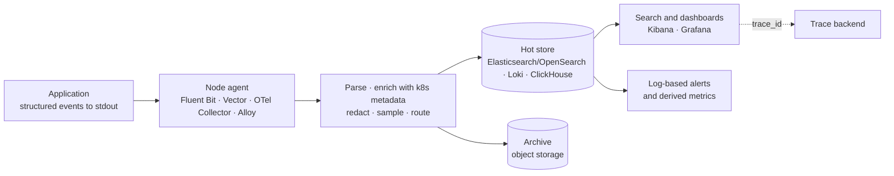
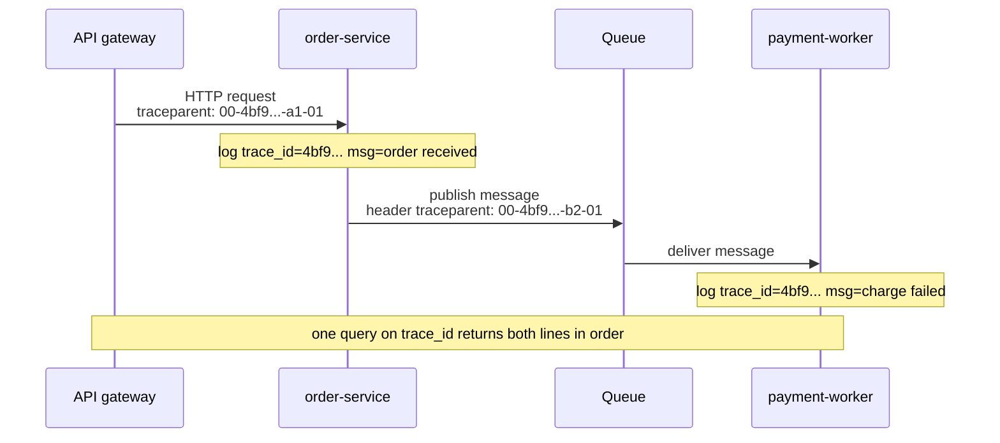
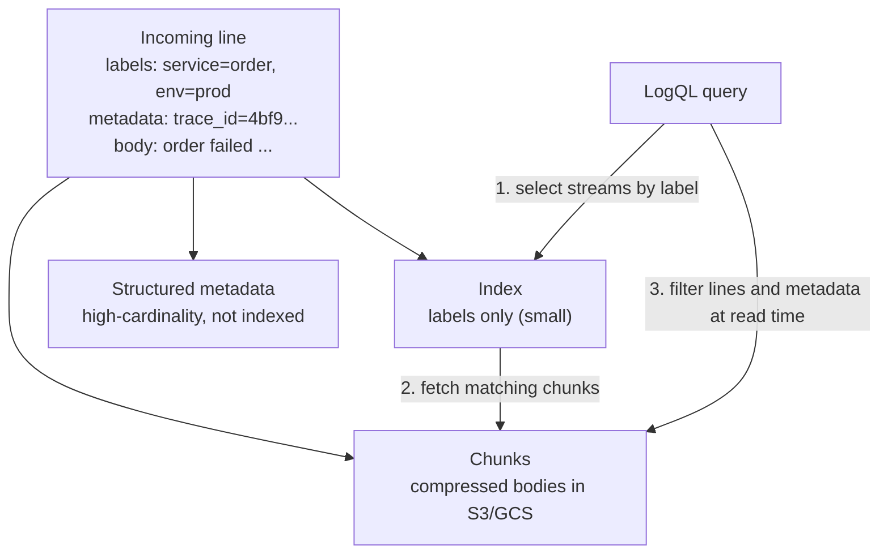
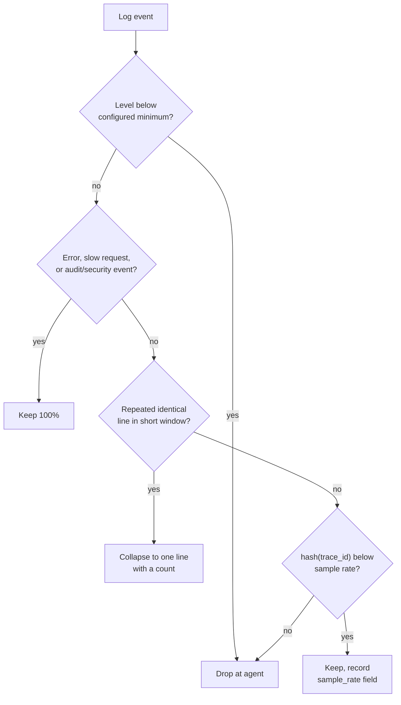

[Observability Hub](./) &raquo; Logging

# Logging

A **log** is a timestamped record of a discrete event emitted by a program. Logs are the highest-fidelity observability signal — they can carry the exact payload, error, and stack trace of one failing request — and also the most expensive per byte to ship, index, and retain. This page covers structured logging and the OpenTelemetry log data model, severity levels, correlation with traces, the two dominant storage designs (inverted-index search in Elasticsearch/OpenSearch and label-indexed chunks in Loki), collection agents, retention and sampling, sensitive-data handling, and log-based alerting. For how logs fit with metrics and traces, see the [Observability hub](./).

## Overview

A metric reports *that* the error rate rose and a trace shows *which span* was slow; a log records *exactly what happened* in one event. That richness is also the cost: logs have unbounded cardinality and the highest volume of any signal. Good logging practice is therefore mostly about four things — emitting the right events, in a machine-parseable shape, joinable to the rest of the telemetry by shared IDs, and retained and protected appropriately.



In containerized environments the conventional pattern is that applications write one event per line to **stdout/stderr**; the container runtime writes those lines to files on the node (under `/var/log/containers/` on Kubernetes, in the CRI log format), and a node-level agent tails, enriches, and forwards them. Writing directly from the application to a remote store is possible — for example through an OpenTelemetry SDK log exporter — but couples the application to the pipeline's availability.

## Structured Logging

The most important decision in a logging stack is to emit **structured records** — typed key/value fields, usually one JSON object per line — rather than prose. An unstructured line:

```
2026-09-22 14:02:11 ERROR order 12345 failed for user 789: card declined (latency 612ms)
```

can only be queried with brittle regular expressions. The structured equivalent is self-describing and indexable:

```json
{
  "timestamp": "2026-09-22T14:02:11.418Z",
  "level": "error",
  "service.name": "order-service",
  "message": "order failed",
  "order_id": "12345",
  "user_id": "789",
  "decline_reason": "insufficient_funds",
  "latency_ms": 612,
  "trace_id": "4bf92f3577b34da6a3ce929d0e0e4736",
  "span_id": "00f067aa0ba902b7"
}
```

A backend can now filter on `level = error AND latency_ms > 500`, group by `decline_reason`, and chart latency percentiles without parsing text. Rules that keep structured logs useful:

- **Stable message, variable fields.** Keep the message a low-cardinality constant ("order failed") so events group cleanly; put identifiers and values in fields rather than interpolating them into the string.
- **Stable names and types.** If `latency_ms` is sometimes a number and sometimes `"unknown"`, a strictly mapped index rejects or mistypes documents. One type per field name, across all services.
- **One event per line.** Newline-delimited JSON streams cleanly through agents. Multi-line output — pretty-printed JSON, raw stack traces — needs fragile multiline reassembly; serialize stack traces into a single field instead.
- **A shared schema.** Use the OpenTelemetry semantic conventions for common attributes (`service.name`, `http.route`, `exception.type`, `exception.stacktrace`). The Elastic Common Schema (ECS) was contributed to OpenTelemetry in 2023 and is being merged into the semantic conventions, so the two are converging.

### Canonical log lines

A widely used refinement is to emit one **canonical log line** (also called a *wide event*) per request or unit of work, at the end of processing, containing every attribute of interest: route, status, duration, user and tenant, feature flags, build version, cache hits, downstream call counts, and error details. A single wide record is easier to query and aggregate than a dozen narrow lines scattered through the handler, and many metrics can be derived from it at query time. Narrow lines remain useful for events inside long operations; the canonical line is the summary.

### The OpenTelemetry log data model

OpenTelemetry defines a vendor-neutral **log record** model, used both by its SDK log bridges and by the Collector when it parses files. Its logs specification (bridge API, SDK, and OTLP protocol) is stable.

| Field | Meaning |
|-------|---------|
| `Timestamp` | When the event occurred (source clock) |
| `ObservedTimestamp` | When the collection system first saw it |
| `SeverityText` / `SeverityNumber` | Original level string, and a normalized number from 1 to 24 |
| `Body` | The message: a string or structured value |
| `Attributes` | Event-specific key/value pairs |
| `Resource` | Identity of the emitter (`service.name`, `k8s.pod.name`, `host.name`) |
| `TraceId`, `SpanId`, `TraceFlags` | Link to the active span, if any |
| `EventName` | Identifies a named event type (for structured events) |

Rather than replacing existing logging libraries, OpenTelemetry provides **bridges**: a handler or appender for Python `logging`, Log4j/Logback, `slog`, and others that converts each record to the OTel model, attaches the current trace context, and exports it over OTLP.

### A structured logger with automatic trace context

The following Python logger emits JSON using `python-json-logger`, stamps service identity on every record, and injects the active OpenTelemetry trace and span IDs so application code never passes correlation IDs by hand. (The OpenTelemetry `logging` instrumentation package can inject the same IDs automatically; the filter below shows the mechanism.)

```python
import logging
from pythonjsonlogger.json import JsonFormatter
from opentelemetry import trace


class ContextFilter(logging.Filter):
    """Stamp service identity and the active trace/span IDs on every record."""

    def __init__(self, service_name: str, env: str):
        super().__init__()
        self.service_name = service_name
        self.env = env

    def filter(self, record: logging.LogRecord) -> bool:
        record.service = self.service_name
        record.env = self.env
        ctx = trace.get_current_span().get_span_context()
        if ctx.is_valid:
            # Same hex format the tracing UI displays
            record.trace_id = format(ctx.trace_id, "032x")
            record.span_id = format(ctx.span_id, "016x")
        return True


handler = logging.StreamHandler()
handler.setFormatter(JsonFormatter(
    "%(asctime)s %(levelname)s %(name)s %(message)s",
    rename_fields={"levelname": "level", "asctime": "timestamp"},
))
handler.addFilter(ContextFilter("order-service", env="prod"))

root = logging.getLogger()
root.addHandler(handler)
root.setLevel(logging.INFO)

log = logging.getLogger("order")
log.info("order processed", extra={"order_id": "12345", "latency_ms": 612})
# {"timestamp": "...", "level": "INFO", "name": "order", "message": "order processed",
#  "service": "order-service", "env": "prod", "trace_id": "4bf9...", "span_id": "00f0...",
#  "order_id": "12345", "latency_ms": 612}
```

Other ecosystems have equivalent structured loggers built in or as de-facto standards: `log/slog` in the Go standard library, SLF4J with Logback or Log4j 2 JSON layouts in Java, `structlog` in Python, `pino` in Node.js, and `tracing` in Rust.

## Log Levels

Severity levels are the main control over both volume and signal. The table includes the OpenTelemetry `SeverityNumber` ranges, which give backends a common scale regardless of each language's naming.

| Level | OTel SeverityNumber | Use for | Production default |
|-------|---------------------|---------|--------------------|
| **TRACE** | 1–4 | Very fine-grained flow (per iteration, per message) | Off |
| **DEBUG** | 5–8 | Diagnostic detail for developers | Off, or enabled briefly per service |
| **INFO** | 9–12 | Normal, noteworthy events ("order placed", "config reloaded") | On |
| **WARN** | 13–16 | Unexpected but handled: retries, fallbacks, approaching limits | On |
| **ERROR** | 17–20 | An operation failed and someone may need to act | On |
| **FATAL** | 21–24 | The process cannot continue | On; usually pages |

Practices:

- **Change levels at runtime.** A configuration value or feature flag that raises one service (or one logger) to DEBUG during an incident, without a redeploy, is far more useful than permanently verbose logging.
- **Reserve ERROR for failures of this system.** A malformed client request correctly rejected with HTTP 400 is the client's error, not the service's; log it at INFO or WARN. If ERROR fires on routine events it stops meaning anything.
- **Treat WARN as a leading indicator.** Retries, circuit-breaker trips, and near-quota conditions belong at WARN; a rising WARN rate often precedes an ERROR spike.
- **Avoid paying for suppressed levels.** Pass values as fields or lazy arguments (`log.debug("x=%s", x)`) rather than pre-formatting strings, and guard genuinely expensive computations with `isEnabledFor(logging.DEBUG)`.

## Correlation IDs and Trace Context

A single user request fans out across many services, and its log lines land on many hosts, interleaved with unrelated traffic. A **correlation ID** — the same identifier stamped on every line emitted while handling one request — lets a single query reassemble the complete story.

| Identifier | Scope | Source |
|------------|-------|--------|
| `trace_id` | One distributed request, across all services | Tracing context (W3C `traceparent`) |
| `span_id` | One operation within the request | Tracing context |
| `request_id` | One request at the edge; often returned to clients for support | API gateway or load balancer |
| `session_id`, `user_id`, `tenant_id` | Activity over time | Application |

The trace ID is the best correlation key because it also links logs to traces (see [Distributed Tracing](tracing.html)). It propagates by the same mechanism as trace context: extracted from inbound headers, held in context-local storage for the duration of the request, injected into outbound calls, and stamped on each log record by the logging integration. The vendor-neutral format is the **W3C Trace Context** `traceparent` header:

```
traceparent: 00-4bf92f3577b34da6a3ce929d0e0e4736-00f067aa0ba902b7-01
             ^^ ^^^^^^^^^^^^^^^^^^^^^^^^^^^^^^^^ ^^^^^^^^^^^^^^^^ ^^
          version     trace-id (16 bytes)        parent-id (8 B)  flags
```



Asynchronous boundaries — message queues, background jobs, scheduled tasks — must carry the context in message headers or metadata, or the chain breaks into disconnected fragments. With IDs in place, investigation moves freely between signals: from a slow span to every log line it produced, or from an error log to its full trace.

## Storage Backends

Log stores fall into three designs, distinguished by what they index.

| Design | Examples | Indexes | Query strength | Cost profile |
|--------|----------|---------|----------------|--------------|
| **Inverted-index search** | Elasticsearch, OpenSearch | Every token of every field | Fast arbitrary full-text and field search | High CPU, memory, and SSD for indexing |
| **Label index + compressed chunks** | Grafana Loki | Only a small set of stream labels | Fast when labels narrow the search; content is scanned | Low; chunks in object storage |
| **Columnar database** | ClickHouse (and products built on it) | Sparse primary index plus optional skip indexes | Fast aggregations over structured fields | Low storage via high compression; SQL |

### Elasticsearch and OpenSearch (ELK)

The classic open-source pipeline is the **ELK stack** — Elasticsearch, Logstash, Kibana — or **EFK**, with Fluentd or Fluent Bit as the collector.

| Component | Role |
|-----------|------|
| Beats (Filebeat) / Fluent Bit / Elastic Agent | Lightweight shippers that tail logs on each host |
| Logstash | Heavier pipeline for parsing, enrichment, and routing |
| Elasticsearch | Distributed search and analytics store built on Lucene inverted indexes |
| Kibana | Query UI, dashboards, alerting |

Elasticsearch builds an **inverted index** over every field, so arbitrary queries such as `message:"timeout" AND service.name:payment` return in milliseconds across billions of documents. Kibana supports the Lucene/KQL query syntax and **ES\|QL**, a piped query language (generally available since Elasticsearch 8.14) that adds aggregation and transformation steps.

Licensing changed twice: in 2021 Elastic moved from Apache 2.0 to the SSPL and Elastic License, prompting AWS to fork the last Apache version as **OpenSearch** (with OpenSearch Dashboards); in 2024 Elastic added the OSI-approved AGPLv3 as a third license option. OpenSearch moved to the Linux Foundation's OpenSearch Software Foundation in 2024 and remains Apache 2.0. For logging purposes the two are functionally similar, though their APIs and features have diverged.

Operating an Elasticsearch-backed log store:

- **Use data streams with index lifecycle management (ILM).** A data stream writes to a series of time-ordered backing indices that roll over by size or age; ILM moves them through hot, warm, cold, and frozen tiers and finally deletes them. Retention then becomes whole-index deletion instead of per-document expiry. OpenSearch provides the equivalent through Index State Management (ISM).
- **Control the mapping.** Map known fields explicitly and restrict dynamic mapping, or a single field that takes arbitrary keys can create thousands of fields ("mapping explosion").
- **Size shards deliberately.** Elastic's guidance is roughly 10–50 GB per shard; too many small shards waste heap and cluster-state overhead, too few large ones slow recovery and limit parallelism.

### Grafana Loki

**Loki** takes the opposite approach: it does not index log content. Each log stream is identified by a small set of **labels** (as with Prometheus metrics — `service`, `namespace`, `env`), and the lines are stored as compressed chunks in object storage. A query first selects streams by label, then scans the matching chunks.



Consequences of this design:

- **Much cheaper ingestion and storage** than full-text indexing, since there is no inverted index to build or hold in memory.
- **Labels must stay low-cardinality.** Each unique label combination is a separate stream; putting `user_id` or `trace_id` in a label creates millions of tiny streams and degrades the whole cluster. High-cardinality values belong in the line or in **structured metadata** — per-line key/value pairs introduced in Loki 3.0 that are stored alongside the line and filterable at query time without being indexed.
- **Query speed depends on label selectivity.** Narrow label selectors followed by line filters are fast; broad selectors over large time ranges scan a lot of data. Loki 3 added bloom-filter-based query acceleration for "needle in a haystack" searches on structured metadata.
- **Native OTLP ingestion.** Loki 3 accepts OpenTelemetry logs directly, mapping selected resource attributes to labels and the rest to structured metadata.

**LogQL** echoes PromQL: a stream selector, a pipeline of filters and parsers, and optional metric aggregations.

```logql
# Line filter, JSON parser, then a field filter
{service="order-service", env="prod"} |= "order failed" | json | latency_ms > 500

# Filter on structured metadata without making trace_id a label
{service="order-service"} | trace_id="4bf92f3577b34da6a3ce929d0e0e4736"

# Metric from logs: failed orders per second by decline reason
sum by (decline_reason) (
  rate({service="order-service"} |= "order failed" | json [5m])
)
```

Loki fits naturally in a Grafana stack (Mimir or Prometheus for metrics, Tempo for traces), where a derived field turns each `trace_id` into a link to the trace. Choose **Loki** for cheap, high-volume retention queried mostly by known labels; choose **Elasticsearch or OpenSearch** for rich ad-hoc full-text search and analytics; consider a **columnar store** when logs are well structured and most questions are aggregations.

## Collection Agents

Between applications and storage sits the **collection pipeline**: an agent that tails files or receives events, parses them, enriches them with metadata, redacts sensitive fields, optionally samples, and forwards to one or more destinations.

| Agent | Language | Configuration | Notes |
|-------|----------|---------------|-------|
| **Fluent Bit** | C | YAML (classic `.conf` format deprecated) | Very small footprint; the most common Kubernetes DaemonSet; logs, metrics, and traces |
| **Fluentd** | Ruby/C | Custom directive format | CNCF graduated; large plugin ecosystem; heavier, often used as an aggregator |
| **Vector** | Rust | TOML/YAML with Vector Remap Language (VRL) | High throughput; expressive transforms; maintained by Datadog |
| **OpenTelemetry Collector** | Go | YAML receivers, processors, exporters | `filelog` receiver for files; one agent for all OTel signals |
| **Grafana Alloy** | Go | Alloy configuration syntax | Grafana's OTel Collector distribution; replaces Grafana Agent and Promtail |
| **Logstash** | JVM | Pipeline DSL | Powerful parsing (grok); typically a central aggregator rather than a node agent |

Grafana's **Promtail**, formerly the standard Loki shipper, reached end of life on 2 March 2026; Grafana Alloy is its replacement and includes a converter for Promtail configuration.

All agents share the same core responsibilities: **buffer** locally (in memory or on disk) so a downstream outage does not lose data, **batch and compress** to reduce network cost, **retry with backoff**, and apply **backpressure** so a slow destination cannot exhaust the node's memory. Expensive work — parsing, redaction, sampling — is best done at the edge, so the central store ingests only clean, safe, right-sized data.

### Fluent Bit

Fluent Bit models a pipeline as **inputs → parsers → filters → outputs**. YAML has been the standard configuration format since v3.2, and the classic format is scheduled for deprecation at the end of 2026. A typical Kubernetes DaemonSet configuration tails container logs, reassembles multi-line CRI/Docker output, enriches each record with pod metadata, and ships to Elasticsearch:

```yaml
service:
  flush: 1

pipeline:
  inputs:
    - name: tail
      path: /var/log/containers/*.log
      multiline.parser: docker, cri     # handle both runtime log formats
      tag: kube.*
      mem_buf_limit: 50MB
      skip_long_lines: on

  filters:
    - name: kubernetes                  # join each line to pod name, namespace, labels
      match: kube.*
      merge_log: on                     # lift fields out of JSON log bodies
      keep_log: off
      k8s-logging.parser: on            # honor per-pod parser annotations

  outputs:
    - name: es
      match: kube.*
      host: elasticsearch
      port: 9200
      logstash_format: on
      suppress_type_name: on            # required for Elasticsearch 8+
      retry_limit: 5
```

The `kubernetes` filter is what makes container logs useful: without it, a line is only a string from an anonymous file; with it, the record carries `kubernetes.namespace_name`, `kubernetes.pod_name`, and pod labels for filtering.

### Vector

Vector builds a graph of **sources → transforms → sinks**. Its `remap` transform runs **VRL**, a small, type-checked language for parsing and reshaping events. The pipeline below parses JSON, drops debug events, removes secrets, masks card and SSN patterns, and fans out to Loki and an S3 archive:

```toml
[sources.app_logs]
type = "file"
include = ["/var/log/app/*.log"]

[transforms.clean]
type = "remap"
inputs = ["app_logs"]
source = '''
  . = parse_json!(string!(.message))
  if .level == "debug" { abort }                  # cut volume at the edge
  del(.password)
  del(.authorization)
  if exists(.email) { .email = "[REDACTED]" }
  if is_string(.message) {
    .message = redact(.message, filters: ["us_social_security_number", r'\b(?:\d[ -]?){13,19}\b'])
  }
'''

[sinks.loki]
type = "loki"
inputs = ["clean"]
endpoint = "http://loki:3100"
encoding.codec = "json"
labels = { service = "{{ service }}", level = "{{ level }}" }

[sinks.archive]
type = "aws_s3"
inputs = ["clean"]
bucket = "log-archive"
region = "us-east-1"
compression = "gzip"
encoding.codec = "json"
```

## Retention and Sampling

Log volume grows with traffic and code paths; controlling lifetime and intake is what keeps cost bounded.

### Retention tiers

Not every log deserves the same lifetime or storage class. **Tiered retention** moves data to cheaper, slower storage as it ages and eventually deletes it.

| Tier | Typical age | Storage | Query latency | Purpose |
|------|-------------|---------|---------------|---------|
| Hot | 0–7 days | Indexed, SSD | Interactive | Incident response, live debugging |
| Warm | 1–4 weeks | Indexed, cheaper disks or fewer replicas | Seconds | Recent investigations, trends |
| Cold / frozen | Months | Object storage (e.g. searchable snapshots) | Seconds to minutes | Occasional lookups, audits |
| Archive | Months to years | Object storage archive classes | Hours to rehydrate | Compliance, forensics |
| Delete | Beyond policy | — | — | Cost and privacy hygiene |

Retention is set by three pressures:

- **Cost.** Indexed hot storage can cost one to two orders of magnitude more per gigabyte than compressed object storage, so aging data out of the hot tier is the largest cost lever.
- **Compliance.** Regulations set minimums and maximums. PCI DSS v4.0, for example, requires audit log history to be retained for at least twelve months with the most recent three months immediately available for analysis; privacy law (GDPR, CCPA) requires that personal data not be kept longer than necessary. Security and audit logs therefore usually have much longer retention than application debug logs, and should be stored separately.
- **Utility.** The probability of querying a log falls quickly with age; most queries target the last few days.

Implement aging with the platform's lifecycle tooling — Elasticsearch ILM or OpenSearch ISM, Loki's retention settings with object-store lifecycle rules — or route an archive copy straight to object storage from the agent, as the Vector `aws_s3` sink above does.

### Sampling and volume control

When tiering is not enough, reduce what is ingested — selectively.



- **Level filtering** — drop DEBUG and TRACE in production at the agent.
- **Probabilistic sampling** — keep 1 in N of high-volume, low-value events (health checks, successful access logs), recording the sample rate so counts can be scaled back up.
- **Trace-consistent sampling** — decide per `trace_id` (a hash compared against the rate) so a request's logs are kept or dropped together, and align the decision with trace sampling so kept traces have their logs.
- **Deduplication** — collapse a tight loop emitting the same line thousands of times into one line with a count.

The governing principle is the same as for tracing: **never sample away errors.** Sampling exists to cheapen the high-volume, low-information background; rare failure logs are the ones most needed.

## Sensitive Data

Logs are a common data-leak vector: a single `log.info(request_body)` can persist passwords, card numbers, tokens, or health data into a long-retained, widely readable index.

- **Never log secrets.** Passwords, API keys, session tokens, private keys, authorization headers, and full card numbers (PANs) must not reach a log. The most reliable control makes it impossible — for example, wrapping secrets in a type whose string representation is `***`.
- **Redact or pseudonymize personal data early** — in the application, and again in the agent before data leaves the node. Mask (`j***@example.com`), replace with a keyed hash (which preserves joinability without exposing the value), or drop the field.
- **Apply defense in depth.** Combine application discipline with pipeline scrubbers for known patterns (emails, card numbers, national ID formats), so a careless debug statement is still caught downstream.
- **Protect the store.** Encrypt in transit and at rest, restrict query access (log search is effectively access to the most detailed data the organization holds), and audit who queries what.
- **Respect retention limits and data-subject rights.** Deletion requests are tractable when logs contain pseudonymous IDs with bounded retention and nearly impossible when they contain raw personal data kept indefinitely. Pin data residency where required.

A last-resort redaction filter for Python `logging` that scrubs the rendered message and known sensitive fields, regardless of which code emitted the record:

```python
import logging
import re

_EMAIL = re.compile(r"[\w.+-]+@[\w-]+\.[\w.-]+")
_CARD = re.compile(r"\b(?:\d[ -]?){13,19}\b")
_SENSITIVE_FIELDS = ("password", "authorization", "token", "secret")


class RedactionFilter(logging.Filter):
    def filter(self, record: logging.LogRecord) -> bool:
        msg = record.getMessage()                 # render msg % args first
        msg = _EMAIL.sub("[REDACTED-EMAIL]", msg)
        record.msg = _CARD.sub("[REDACTED-CARD]", msg)
        record.args = None                        # already rendered
        for field in _SENSITIVE_FIELDS:
            if hasattr(record, field):
                setattr(record, field, "[REDACTED]")
        return True
```

## Log-Based Alerts

Most alerting should use **metrics**, which are cheap and stable (see [Metrics &amp; Monitoring](metrics.html#alerting-with-alertmanager)). Some conditions, however, are visible only in logs: a specific exception type, a security event, or the absence of an expected line. The standard technique is **logs-to-metrics**: count matching lines or extract a numeric field, turn the result into a time series, and alert on that series with ordinary alerting machinery.

In Loki, the **ruler** evaluates LogQL alerting and recording rules in Prometheus rule format and sends alerts to Alertmanager; recording rules can `remote_write` their results into Prometheus or Mimir so log-derived metrics live beside the rest:

```yaml
groups:
  - name: order-service-logs
    rules:
      - alert: CardDeclineSpike
        expr: |
          sum(count_over_time({service="order-service"} |= "card declined" [5m])) > 25
        for: 5m
        labels:
          severity: ticket
        annotations:
          summary: "More than 25 card declines in 5 minutes"

      - record: order_service:card_declines:rate5m
        expr: sum(rate({service="order-service"} |= "card declined" [5m]))
```

Elasticsearch and OpenSearch provide the same capability through Kibana alerting rules and OpenSearch Alerting monitors; managed platforms offer metric filters (CloudWatch Logs) or log-based metrics.

Guidance:

- **Alert on rates and ratios, not single lines**, except for genuinely critical singletons such as a FATAL or a specific security signature. Paging on every matching line turns one bad deploy into hundreds of pages.
- **Alert on absence.** "No `batch completed` line in the last hour" — a dead man's switch — catches a job that hangs silently without logging errors.
- **Link to evidence.** An alert should deep-link to the exact filtered log query and, through `trace_id`, to representative traces.
- **Route by severity** through Alertmanager or equivalent, with grouping and deduplication.

Log alerts complement SLO burn-rate alerting: the burn-rate alert says reliability is at risk; the error logs, joined by `trace_id`, explain why.

## See Also

- **[Observability Hub](./)** — how logs, metrics, and traces combine; SLOs
- **[Distributed Tracing](tracing.html)** — trace context and the `trace_id` that joins logs to spans
- **[Metrics &amp; Monitoring](metrics.html)** — cheap, low-cardinality signals for most alerting
- **[Distributed Systems: Observability](../distributed-systems/observability.html)** — correlation IDs and the signals in a multi-node setting
- **[Kubernetes Operations](../technology/kubernetes/operations.html)** — cluster operations, where DaemonSet log agents run
- **[AWS Monitoring](../technology/aws/monitoring.html)** — CloudWatch Logs, metric filters, and log-based alarms

### References

- [OpenTelemetry logs data model](https://opentelemetry.io/docs/specs/otel/logs/data-model/)
- [Grafana Loki documentation](https://grafana.com/docs/loki/latest/)
- [Fluent Bit manual](https://docs.fluentbit.io/manual/)
- [Vector documentation](https://vector.dev/docs/)
- Stripe Engineering, "Fast and flexible observability with canonical log lines" (2019)
