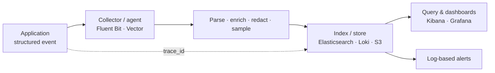
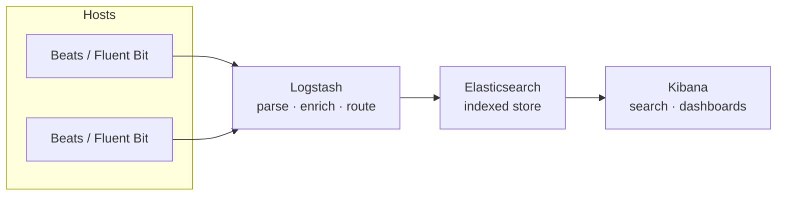

[Observability Hub](./) &raquo; Logging

Structured events, correlation IDs, log pipelines, retention, and PII-safe, alertable logs at scale.

## Logs as a Pillar of Observability

Of the three observability signals — metrics, traces, and logs — **logs are the highest-fidelity and highest-cost**. A metric tells you *that* the error rate rose; a trace tells you *which* span was slow; a log tells you *exactly what happened* in one discrete event, with arbitrary detail: the offending payload, the stack trace, the user's tenant, the SQL that timed out. That richness is also their liability. Logs have the highest cardinality and the worst cost-per-byte of any signal, so the discipline of good logging is mostly about emitting the *right* events, in a *machine-parseable* shape, *joinable* to the rest of your telemetry, and *retained* and *protected* sensibly.

A useful mental model: a log line is a **timestamped, structured event** with a severity, a message, a correlation key, and a bag of typed fields. Everything in this page is about getting each of those four parts right.



## Structured Logging

The single most important decision in a logging stack is to emit **structured, machine-parseable records** — almost always JSON — rather than free-text prose. An unstructured line like

```
2026-06-06 14:02:11 ERROR order 12345 failed for user 789: card declined (latency 612ms)
```

forces every consumer to re-parse English with brittle regexes. The structured equivalent is self-describing and indexable:

```json
{
  "timestamp": "2026-06-06T14:02:11.418Z",
  "level": "error",
  "service": "order-service",
  "message": "order failed: card declined",
  "order_id": "12345",
  "user_id": "789",
  "decline_reason": "insufficient_funds",
  "latency_ms": 612,
  "trace_id": "4bf92f3577b34da6a3ce929d0e0e4736"
}
```

Now your backend can run `service="order-service" AND level="error" AND latency_ms>500` without parsing prose, aggregate `decline_reason`, and chart p99 `latency_ms` — all as first-class typed fields.

A few rules make structured logs durable:

- **Log key/value fields, not interpolated strings.** Pass `order_id` as a field, not baked into the message. The message should be a stable, low-cardinality string (good for grouping); the variable data lives in fields.
- **Keep field names and types stable.** If `latency_ms` is sometimes a number and sometimes the string `"unknown"`, a strict index (Elasticsearch) will reject or mistype the document. Pick a type per field and stick to it.
- **One event per line (JSONL).** Newline-delimited JSON streams cleanly through agents and is trivially splittable; a multi-line pretty-printed object is not.
- **Use a canonical schema.** Adopt or align with a shared model — the OpenTelemetry Logs data model and the Elastic Common Schema (ECS) both define standard field names (`service.name`, `trace.id`, `log.level`) so logs from many services share vocabulary.

### A Structured Logger with Auto-Injected Context

This logger emits JSON, stamps service identity on every record, and — crucially — auto-injects the *current* trace/span IDs from the active OpenTelemetry context, so application code never threads correlation IDs by hand:

```python
import logging
from pythonjsonlogger import jsonlogger
from opentelemetry import trace

# Emit JSON so the backend indexes every field
handler = logging.StreamHandler()
handler.setFormatter(jsonlogger.JsonFormatter(
    "%(asctime)s %(levelname)s %(name)s %(message)s",
    rename_fields={"levelname": "level", "asctime": "timestamp"},
))
root = logging.getLogger()
root.addHandler(handler)
root.setLevel(logging.INFO)


class ContextFilter(logging.Filter):
    """Stamp service identity and the active trace/span IDs on every record."""
    def __init__(self, service_name, env):
        super().__init__()
        self.service_name = service_name
        self.env = env

    def filter(self, record):
        record.service = self.service_name
        record.env = self.env
        ctx = trace.get_current_span().get_span_context()
        if ctx.is_valid:
            # 32-/16-hex IDs that match exactly what the trace UI shows
            record.trace_id = format(ctx.trace_id, "032x")
            record.span_id = format(ctx.span_id, "016x")
        return True


handler.addFilter(ContextFilter("order-service", env="prod"))
log = logging.getLogger("order")

# Variable data goes in `extra` as fields; the message stays stable
log.info("order processed", extra={"order_id": "12345", "user_id": "789", "latency_ms": 612})
# -> {"timestamp": "...", "level": "INFO", "service": "order-service", "env": "prod",
#     "message": "order processed", "trace_id": "4bf9...", "span_id": "00f0...",
#     "order_id": "12345", "user_id": "789", "latency_ms": 612}
```

## Log Levels

Severity levels are the primary lever for controlling *volume* and *signal*. The widely shared ladder, from quietest to loudest:

| Level | When to use | Typical action |
|-------|-------------|----------------|
| **TRACE** | Extremely fine-grained flow (per-iteration, per-byte). Off in production. | Ignore unless deep-debugging |
| **DEBUG** | Developer-facing detail useful while diagnosing. Off or sampled in prod. | Investigation only |
| **INFO** | Normal, noteworthy business events ("order placed", "user logged in"). | Baseline narrative |
| **WARN** | Something unexpected but recoverable; degraded but still serving. | Watch; may precede failure |
| **ERROR** | A request/operation failed; a human may need to act. | Alert candidate |
| **FATAL / CRITICAL** | The process cannot continue and is shutting down. | Page immediately |

Operational discipline around levels:

- **Make the level dynamically configurable** per service (and ideally per logger/module) without a redeploy. The standard pattern is a config value or feature flag that raises a hot service to DEBUG for a few minutes during an incident, then drops it back.
- **Reserve ERROR for things a human should care about.** If ERROR fires on routine validation failures, the level becomes noise and real errors get lost. A bad client request that you correctly reject with a 400 is usually INFO or WARN, not ERROR — it is the *client's* fault, not your system's.
- **WARN is a leading indicator.** Retries, fallbacks, near-quota, and slow-path activations belong at WARN; a rising WARN rate often precedes an ERROR spike.
- **Levels are not free of cost when filtered.** Even a suppressed DEBUG call can evaluate its arguments. Guard expensive interpolation (`if log.isEnabledFor(DEBUG)`), or rely on structured fields that the logger only serializes when the record is actually emitted.

## Correlation IDs and Trace Context

A single user request fans out across many services; its logs land on many hosts, interleaved with millions of unrelated lines. A **correlation ID** is the join key that reassembles that scatter into one coherent story. Attach the *same* identifier to every log line emitted while handling one request, across every service it touches, and a single query reconstructs the complete, ordered narrative.

Three related identifiers show up in practice:

- **`trace_id`** — the distributed-tracing identifier shared by every span in a request. This is the best correlation ID because it *also* links logs directly to traces (see [Tracing](./tracing.html)).
- **`request_id`** — a per-request ID minted at the edge (e.g. an API gateway) when no trace exists, often surfaced to clients in a response header for support ("quote me your request ID").
- **`session_id` / `user_id` / `tenant_id`** — broader correlation keys for grouping a user's or tenant's activity over time.

### How the ID Propagates

The ID flows by exactly the same mechanism as trace context: extracted from inbound headers, held in async-local/thread-local storage for the duration of the request, injected into outbound calls, and stamped onto every log line by a logging filter (as in the logger above). The vendor-neutral standard is **W3C Trace Context**, carried in the `traceparent` header:

```
traceparent: 00-4bf92f3577b34da6a3ce929d0e0e4736-00f067aa0ba902b7-01
             │  └────────── trace-id (16B) ───────┘ └ span-id (8B) ┘ │
             version                                          trace-flags
```

For asynchronous boundaries — message queues, background jobs, scheduled tasks — stamp the same IDs into message headers/metadata so the consumer continues the same correlation chain. **Anywhere a request crosses a boundary without carrying its ID, the story breaks into disconnected fragments.**

The payoff is the cross-pillar pivot: because every log line carries `trace_id`, you can jump from a slow span in your tracing UI straight to every log line that span produced, and from an error log back to the full trace — metrics, traces, and logs become one navigable surface.

## The ELK / EFK Stack

The classic open-source logging pipeline is the **ELK stack** — **E**lasticsearch, **L**ogstash, **K**ibana — and its lighter cousin **EFK**, which swaps Logstash for **F**luentd (or Fluent Bit) as the collector.

| Component | Role |
|-----------|------|
| **Beats / Fluentd / Fluent Bit** | Lightweight shippers that tail logs on each host and forward them |
| **Logstash** | Heavyweight pipeline: parse, transform, enrich, and route (can be the collector *or* sit behind the shippers) |
| **Elasticsearch** | Distributed, inverted-index search/analytics store — the system of record for log data |
| **Kibana** | Query UI, dashboards, and visualizations over Elasticsearch |



**Why it dominates:** Elasticsearch builds an **inverted index** over every field, so arbitrary full-text and field queries (`message: "timeout" AND service: payment`) return in milliseconds even over billions of documents. That power is also the cost driver — indexing every field is CPU-, RAM-, and disk-expensive, which is exactly the tradeoff Loki was built to challenge (next section).

**OpenSearch** is the Apache-2.0-licensed fork of Elasticsearch/Kibana (renamed OpenSearch / OpenSearch Dashboards) created after Elastic's 2021 license change; for logging purposes it is a drop-in equivalent of the ELK pattern.

Operational notes for an Elasticsearch-backed stack:

- **Index per time window** (e.g. daily indices `logs-2026.06.06`), managed by **Index Lifecycle Management (ILM)** through hot → warm → cold → delete phases. Time-based indices make retention a cheap whole-index delete rather than per-document expiry.
- **Control the mapping.** Disable dynamic mapping for free-form fields, or a single rogue high-cardinality field can explode the index. Use ECS field names so dashboards are portable.
- **Size shards deliberately.** Too many small shards waste heap; too few huge shards hurt parallelism and recovery. Tens of GB per shard is a common target.

## Loki: Logs Indexed Like Metrics

**Grafana Loki** takes the opposite design stance from Elasticsearch: **do not full-text index the log body at all.** Instead, Loki indexes only a small set of **labels** (much like Prometheus metric labels — `service`, `env`, `level`, `namespace`) and stores the raw log lines as compressed chunks in cheap object storage (S3/GCS). Queries filter to a stream by labels, then **grep** the matched chunks at read time.

The consequences are a direct, deliberate tradeoff against ELK:

- **Much cheaper ingestion and storage.** No inverted index to build or hold in RAM; chunks live in object storage. Loki is often an order of magnitude cheaper per byte than Elasticsearch.
- **Labels must stay low-cardinality.** Every unique label-set is a separate stream; putting `user_id` or `trace_id` in a *label* causes a "cardinality explosion" that wrecks Loki — exactly the same hazard as high-cardinality Prometheus labels. High-cardinality values belong *in the log line*, found by filter expressions, not as labels.
- **Filter queries do a brute-force scan** of matched streams. Narrow by label first, then `|= "timeout"` to grep. This is fast when labels prune well and slow when they do not, the mirror image of Elasticsearch's profile.

LogQL, Loki's query language, deliberately echoes PromQL:

```logql
# Stream selector by labels, then a line filter, then a metric over logs
sum by (status) (
  rate({service="order-service", env="prod"} |= "card declined" [5m])
)
```

Loki slots naturally into a Grafana-centric stack (Grafana for both metrics and logs, Tempo for traces), and because `trace_id` lives in the log *body*, Grafana can link a log line straight to its trace via a derived field. Choose **Loki** when you want cheap, high-volume log *storage* and mostly query by known labels; choose **Elasticsearch/OpenSearch** when you need rich, ad-hoc full-text analytics across arbitrary fields.

## Collection Pipelines: Fluent Bit and Vector

Between your applications and your store sits the **collection pipeline**: an agent that tails logs, parses them, enriches them with metadata, redacts sensitive fields, optionally samples, and forwards to one or more sinks. Two modern collectors dominate.

### Fluent Bit

**Fluent Bit** is a lightweight (C, single-binary, low-footprint) log/metric processor from the Fluentd family, ubiquitous as a **Kubernetes DaemonSet** — one instance per node tailing every container's stdout. Its model is a pipeline of pluggable stages: **input → parser → filter → output**, configured declaratively. A typical Kubernetes config tails container logs, enriches them with pod metadata, and ships to Elasticsearch:

```ini
[INPUT]
    Name              tail
    Path              /var/log/containers/*.log
    Parser            docker
    Tag               kube.*
    Refresh_Interval  5

[FILTER]
    Name                kubernetes
    Match               kube.*
    # Enrich each line with pod/namespace/labels from the K8s API
    Merge_Log           On
    Keep_Log            Off
    K8s-Logging.Parser  On

[OUTPUT]
    Name            es
    Match           kube.*
    Host            elasticsearch
    Port            9200
    Logstash_Format On
    Retry_Limit     5
```

The `kubernetes` filter is what makes container logs useful: it joins each raw stdout line to the pod name, namespace, labels, and annotations, so you can later query `kubernetes.namespace_name="payments"`.

### Vector

**Vector** (Rust, by Datadog) is a higher-throughput, more programmable collector built around a **sources → transforms → sinks** graph and the **Vector Remap Language (VRL)** for inline parsing, reshaping, and redaction. It targets logs *and* metrics and is often chosen for its performance and its expressive transform layer. A pipeline that parses JSON, drops debug lines, and redacts a field before fanning out to two sinks:

```toml
[sources.app_logs]
type = "file"
include = ["/var/log/app/*.log"]

[transforms.parse]
type = "remap"
inputs = ["app_logs"]
source = '''
  . = parse_json!(.message)
  # Drop noisy debug events at the edge to cut volume
  if .level == "debug" { abort }
  # Redact PII before it ever leaves the node
  .email = "REDACTED"
'''

[sinks.loki]
type = "loki"
inputs = ["parse"]
endpoint = "http://loki:3100"
labels = { service = "{{ service }}", level = "{{ level }}" }

[sinks.archive]
type = "aws_s3"
inputs = ["parse"]
bucket = "log-archive"
compression = "gzip"
```

Both agents share the same responsibilities — **buffer** locally so a downstream outage does not drop logs, **batch and compress** to cut network cost, **retry with backoff**, and apply **backpressure** so a slow sink does not OOM the node. Push expensive work (parsing, redaction, sampling) **to the edge**, in the agent, so your central store only ever ingests clean, safe, right-sized data.

## Retention and Sampling

Logs grow without bound; controlling volume and lifetime is what keeps a logging bill survivable.

### Retention Tiers

Not all logs deserve the same lifetime or storage class. The standard pattern is **tiered retention**, moving data to cheaper, slower storage as it ages and ultimately deleting it:

| Tier | Age | Storage | Query speed | Purpose |
|------|-----|---------|-------------|---------|
| **Hot** | 0–7 days | Indexed (SSD) | Instant | Live debugging, incident response |
| **Warm** | 1–4 weeks | Indexed (HDD) | Slower | Recent investigations, trend analysis |
| **Cold / archive** | months–years | Object store (S3 Glacier) | Minutes–hours to rehydrate | Compliance, audit, forensics |
| **Delete** | past policy | — | — | Cost and privacy hygiene |

Drivers of the retention policy:

- **Cost** — indexed hot storage can be 10–100x the price of compressed object storage; aggressive aging is the biggest lever on spend.
- **Compliance** — regulations dictate *minimums* (e.g. PCI-DSS commonly requires 1 year of audit logs, 3 months hot) and privacy law dictates *maximums* (don't keep PII longer than justified). Security/audit logs usually have far longer retention than verbose application debug logs.
- **Utility** — the probability you'll query a log decays fast with age; most queries hit the last few days.

Implement aging with the platform's lifecycle tooling: Elasticsearch **ILM** policies, Loki/S3 **object lifecycle rules**, or a collector that routes archive copies straight to cold storage (as the Vector `aws_s3` sink above does).

### Sampling and Volume Control

When even tiered retention is not enough, **reduce what you ingest** — but never blindly:

- **Level-based filtering** — the coarsest control: drop DEBUG/TRACE in production at the agent; keep INFO and above.
- **Probabilistic sampling** — keep 1 in N of a high-volume, low-value event class (e.g. successful health-check or access logs). Always record the sample rate so counts can be scaled back up.
- **Tail/consistency sampling** — keep *all* logs for requests that errored or were slow, and sample the boring successful ones. If you sample by `trace_id`, make the keep/drop decision *consistently per trace* so you never keep half a request's logs.
- **Deduplication / aggregation** — collapse a tight loop emitting the same line thousands of times into one line with a `count`, rather than flooding the pipeline.

The guiding principle mirrors tracing: **never sample away your errors.** Sampling exists to cheapen the high-volume, low-information background; the rare failure logs are the ones you most need and must keep at 100%.

## PII and Sensitive-Data Handling

Logs are a notorious data-leak vector: a single `log.info(request_body)` can quietly persist passwords, full card numbers, access tokens, or health records into a long-retained, widely-readable index. Treat sensitive-data handling as a hard requirement, not a nicety.

- **Never log secrets.** Passwords, API keys, session tokens, full PANs (card numbers), private keys, and authorization headers must never reach a log line. The safest design makes it *impossible* — e.g. wrapping secrets in a type whose `repr`/`toString` prints `***`.
- **Redact or tokenize PII** as early as possible — ideally in the application, certainly in the agent at the edge — *before* it leaves the node. Mask (`j***@example.com`), hash (a salted hash of `user_id` preserves joinability without exposing it), or drop the field entirely. The Vector and Fluent Bit examples above redact in-pipeline precisely so raw PII never reaches central storage.
- **Defense in depth.** Combine application-level discipline (don't log the field) with pipeline-level scrubbers (regex/VRL redaction of emails, card-number, SSN patterns) so a careless `log.debug` is still caught downstream.
- **Encrypt and access-control the store.** Encrypt logs at rest and in transit; restrict who can query, since log search is effectively a query over your most detailed event data. Maintain an **audit log of who queried the logs**.
- **Honor data-subject rights and retention limits.** Privacy regimes (GDPR/CCPA) grant deletion ("right to be forgotten") and constrain how long PII may be kept. Logs full of un-redacted PII make compliance painful; pseudonymized/tokenized logs with bounded retention make it tractable. Pin data residency where required (region-locked storage).

```python
# Belt-and-suspenders redaction filter: scrub known-sensitive patterns
# from any record before it is emitted, regardless of who logged it.
import re, logging

_EMAIL = re.compile(r"[\w.+-]+@[\w-]+\.[\w.-]+")
_CARD  = re.compile(r"\b(?:\d[ -]*?){13,19}\b")

class RedactionFilter(logging.Filter):
    def filter(self, record):
        record.msg = _CARD.sub("[REDACTED-CARD]", _EMAIL.sub("[REDACTED-EMAIL]", str(record.msg)))
        # Drop sensitive fields outright if present
        for field in ("password", "authorization", "token"):
            if hasattr(record, field):
                setattr(record, field, "[REDACTED]")
        return True
```

## Log-Based Alerts

Most alerting should ride on **metrics**, which are cheap, low-cardinality, and stable. But some conditions are only *visible in logs* — a specific exception class, a particular error string, a security event, the *absence* of an expected heartbeat line. The standard technique is **logs-to-metrics**: count or extract a value from matching log lines, turn it into a time series, and alert on that series with the same machinery you use for any metric.

```logql
# Loki: alert when card-decline errors exceed 5/min over 5 minutes
sum(
  rate({service="order-service", level="error"} |= "card declined" [5m])
) > (5 / 60)
```

```yaml
# Elasticsearch/OpenSearch alerting (sketch): fire when ERROR count
# for a service crosses a threshold in a 5-minute window
trigger:
  schedule: { interval: 1m }
  query:
    bool:
      filter:
        - term:   { "service.keyword": "order-service" }
        - term:   { "level.keyword": "error" }
        - range:  { "@timestamp": { gte: "now-5m" } }
  condition: ctx.results[0].hits.total.value > 50
  action: page_oncall
```

Practical guidance for log alerts:

- **Prefer extracted-metric alerts over raw-text alerts.** Convert "lines matching X per minute" into a counter and alert on its *rate* with hysteresis, instead of paging on every single matching line — otherwise one bad deploy pages you a thousand times.
- **Alert on rates and ratios, not single events** (except for genuinely critical singletons like FATAL or a specific security signature). A few errors per minute may be normal; a 10x jump is not.
- **Watch for the absence of logs too.** "No successful-batch line in the last hour" (a *dead-man's-switch*) catches a silently wedged job that emits no errors at all.
- **Make every alert link back to the logs.** A good log alert deep-links to the exact filtered query (and, via `trace_id`, to the trace) so the on-call engineer lands on the evidence, not a blank dashboard.
- **Deduplicate and route.** Group related firings, suppress flapping, and route by severity (page for FATAL/security, ticket for elevated WARN) through your alert manager.

Log alerts complement, not replace, metric-based **SLO/burn-rate** alerting: SLO alerts tell you reliability is at risk; the matching error logs, joined by `trace_id`, tell you *why*.

## See Also

- **[Observability Hub](./)** — metrics, traces, and logs unified into one debugging surface
- **[Tracing](./tracing.html)** — distributed traces and the `trace_id` that joins logs to spans
- **[Metrics](./metrics.html)** — cheap, low-cardinality signals and why most alerts should ride on them
- **[Distributed Systems: Observability](../distributed-systems/observability.html)** — the three pillars, correlation IDs, and SLOs in a multi-node setting
- **[Kubernetes](../technology/kubernetes/)** — where Fluent Bit DaemonSets collect container logs
- **[AWS Monitoring &amp; Messaging](../technology/aws/monitoring.html)** — CloudWatch Logs, metric filters, and log-based alarms
