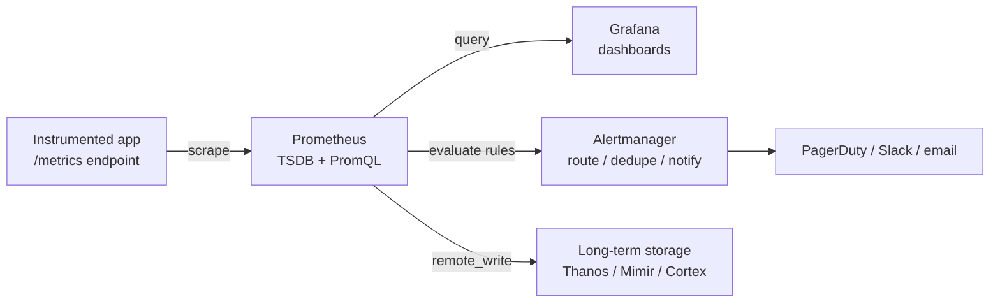

<div class="hero-section" style="background: linear-gradient(135deg, #667eea 0%, #764ba2 100%); color: white; padding: 3rem 2rem; margin: -2rem -3rem 2rem -3rem; text-align: center;">
  <h1 style="color: white; margin: 0; font-size: 2.5rem;">Observability: Metrics &amp; Monitoring</h1>
  <p style="font-size: 1.25rem; margin-top: 1rem; opacity: 0.9;">Counters, gauges, histograms, PromQL, dashboards, RED/USE, and burn-rate alerting — the cheapest, most constant signal in the observability stack.</p>
</div>

[Observability Hub](./) &raquo; Metrics &amp; Monitoring

## Why Metrics

Of the three pillars of observability — metrics, traces, and logs — **metrics are the cheapest and the most predictable**. A counter is the same size in memory and on the wire whether it has counted ten events or ten billion, because it stores only a running total, not the individual events. That constant cost is exactly what makes metrics the right substrate for **dashboards** (what is the system doing right now and over the last hour?) and **alerts** (page me when something crosses a line). Traces tell you *which request* was slow; logs tell you *exactly what happened* in one event; metrics tell you *how much and how often*, aggregated, continuously, for pennies.

A metric is fundamentally a **time series**: a stream of `(timestamp, value)` samples for one named, labelled measurement. The art of metrics is choosing the right *type* for each measurement, keeping the *cardinality* of labels bounded, and aggregating in ways that do not lie about the tail of the distribution.



## Metric Types

Every metrics system is built from a small vocabulary of measurement types. Choosing the wrong one is the most common instrumentation bug — a value modelled as a gauge when it should be a counter produces nonsense when you `rate()` it.

| Type | Semantics | Aggregatable across instances? | Example |
|------|-----------|--------------------------------|---------|
| **Counter** | Monotonically increasing total; you query its **rate**, never its raw value | Yes (sum) | `http_requests_total` |
| **Gauge** | A value that goes up and down; sampled instantaneously | Yes (sum/avg/max, with care) | `queue_depth`, `temperature_celsius` |
| **Histogram** | Bucketed distribution; quantiles computed **server-side** at query time | **Yes** | `http_request_duration_seconds` |
| **Summary** | Quantiles computed **client-side**, shipped as ready values | **No** | per-instance latency φ-quantiles |

### Counter

A **counter** only ever goes up (or resets to zero on process restart). You almost never read a counter's absolute value — you read its **rate of change**. `http_requests_total` climbing from 4,000,000 to 4,000,300 over 5 minutes is meaningless as a number but means "1 request/second" as a rate.

Counters must be **monotonic** so that rate functions can detect and correct for resets. A process restart sends the counter back to 0; Prometheus's `rate()` sees the value drop, infers a reset, and adds the pre-reset delta rather than reporting a huge negative spike. This is why you must never use a gauge for something you intend to rate.

```python
from prometheus_client import Counter

requests_total = Counter(
    "http_requests_total", "Total HTTP requests",
    ["method", "route", "status"],
)
# In a handler:
requests_total.labels("GET", "/orders/{id}", "200").inc()
```

### Gauge

A **gauge** is a snapshot of something that fluctuates: in-flight requests, queue depth, free disk bytes, temperature, a connection-pool's in-use count. Unlike a counter it can decrease, so rating it is meaningless. You sample it, and you aggregate it with `avg`, `max`, `min`, or `sum` depending on what the value means (summing free-memory gauges across nodes is sensible; summing temperature gauges is not).

```python
from prometheus_client import Gauge

inflight = Gauge("http_inflight_requests", "In-flight HTTP requests")
inflight.inc()      # request starts
# ... handle ...
inflight.dec()      # request ends
```

### Histogram

A **histogram** is the workhorse for latency and size distributions. The client maintains a set of **cumulative buckets** defined by upper bounds (`le`, "less than or equal"). Each observation increments every bucket whose bound it falls under, plus a `_sum` and a `_count`. The exported series for a single histogram look like:

```
http_request_duration_seconds_bucket{le="0.1"}  9234
http_request_duration_seconds_bucket{le="0.25"} 9821
http_request_duration_seconds_bucket{le="0.5"}  9950
http_request_duration_seconds_bucket{le="1"}    9990
http_request_duration_seconds_bucket{le="+Inf"} 10000   # == _count
http_request_duration_seconds_sum               1843.2
http_request_duration_seconds_count             10000
```

Because the raw buckets are exported, the **backend** can compute any quantile *across all instances* via `histogram_quantile()`. The crucial property: histograms are **aggregatable**. To get the fleet-wide p99 you sum the bucket counts across every instance first, then interpolate — which is correct, because you are reconstructing one combined distribution. Quantile accuracy is limited by bucket granularity, so choose buckets that straddle your SLO thresholds (e.g. dense buckets around 100 ms–1 s if your latency SLO is 300 ms).

The average always lies about the tail. If 99 requests take 10 ms and one takes 5 s, the mean (~60 ms) hides the disaster; the p99 (≈5 s) exposes it. Always alert on tail percentiles, which only a histogram (or a summary) can give you.

Prometheus also offers **native (exponential) histograms**, a newer high-resolution type where buckets are auto-generated on an exponential scale, giving accurate quantiles across many orders of magnitude with far less configuration and storage than classic fixed buckets.

```python
from prometheus_client import Histogram

latency = Histogram(
    "http_request_duration_seconds", "HTTP request duration (seconds)",
    ["method", "route"],
    buckets=(0.005, 0.01, 0.025, 0.05, 0.1, 0.25, 0.5, 1, 2.5, 5, 10),
)
with latency.labels("GET", "/orders/{id}").time():
    handle_request()
```

### Summary

A **summary** also tracks a distribution, but the client computes **φ-quantiles** (e.g. the 0.5, 0.9, 0.99 quantiles) over a sliding window and exports them as finished numbers, alongside a `_sum` and `_count`. The fatal limitation: **summary quantiles cannot be aggregated**. The average of three instances' p99 values is *not* the fleet p99 — there is no mathematically valid way to combine pre-computed quantiles. Summaries are therefore only useful when you care about a single instance, or when computing quantiles in the backend is too expensive. In almost all modern setups, **prefer histograms** so the backend can aggregate.

| | Histogram | Summary |
|---|---|---|
| Quantiles computed | At query time, in the backend | At observation time, in the client |
| Aggregatable across instances | **Yes** | **No** |
| Bucket/quantile choice | Buckets fixed at instrumentation | φ-quantiles fixed at instrumentation |
| Client CPU cost | Low (just counters) | Higher (streaming quantile estimation) |

## Prometheus

**Prometheus** is the de-facto open-source metrics system and a CNCF graduated project. It is a single-binary server that **pulls** (scrapes) metrics from instrumented targets over HTTP, stores them in a local time-series database (TSDB), evaluates alerting and recording rules, and answers queries in its query language, PromQL.

### Data Model

A Prometheus time series is uniquely identified by a **metric name plus a set of label key/value pairs**:

```
http_requests_total{method="GET", route="/orders/{id}", status="200"}
└────── metric name ──────┘ └──────────────── labels ────────────────┘
```

Every distinct combination of label values is a **separate time series**. The metric name is itself sugar for a reserved label `__name__`, so the line above is equivalent to `{__name__="http_requests_total", method="GET", ...}`. Each series is a stream of `(timestamp_ms, float64)` samples. There are no integer, string, or boolean sample types — everything is a float (booleans are encoded as 0/1, and string information lives only in labels).

### Scraping (Pull Model)

Prometheus is **pull-based**: targets expose a plaintext `/metrics` endpoint, and Prometheus periodically fetches it on a fixed `scrape_interval` (commonly 15–60 s). The pull model has real operational advantages: Prometheus controls the sampling rate, a target being scrapable is itself a health signal (the synthetic `up` metric is 1 if the scrape succeeded), and there is no need for apps to know where to push.

Targets are found via **service discovery** — Kubernetes, Consul, EC2, DNS, or a static list — so the target set tracks autoscaling automatically.

```yaml
# prometheus.yml
global:
  scrape_interval: 15s
  evaluation_interval: 15s          # how often alert/recording rules run

scrape_configs:
  - job_name: "api"
    metrics_path: /metrics
    static_configs:
      - targets: ["api-1:9090", "api-2:9090"]

  - job_name: "kubernetes-pods"     # dynamic targets from the K8s API
    kubernetes_sd_configs:
      - role: pod
    relabel_configs:                # keep only pods that opt in via annotation
      - source_labels: [__meta_kubernetes_pod_annotation_prometheus_io_scrape]
        action: keep
        regex: "true"

rule_files:
  - "rules/*.yml"

alerting:
  alertmanagers:
    - static_configs:
        - targets: ["alertmanager:9093"]
```

Workloads that are short-lived (batch jobs, cron tasks) cannot be scraped because they exit before Prometheus visits them. For these, the job **pushes** its final metrics to a **Pushgateway**, which holds them for Prometheus to scrape. Use the Pushgateway *only* for service-level batch jobs — it is an anti-pattern for normal long-running services.

### PromQL

**PromQL** is Prometheus's functional query language. Its core types are the **instant vector** (one sample per series at a single instant) and the **range vector** (a window of samples per series over a duration, written `[5m]`).

```promql
# Instant vector: current value of every matching series
http_requests_total{status="500"}

# Range vector: the last 5 minutes of samples, used as input to rate()
http_requests_total[5m]

# rate(): per-second average increase of a counter over the window
# (handles counter resets correctly)
rate(http_requests_total[5m])

# Aggregate away labels: total request rate per route across all instances
sum by (route) (rate(http_requests_total[5m]))

# Error ratio per route
  sum by (route) (rate(http_requests_total{status=~"5.."}[5m]))
/ sum by (route) (rate(http_requests_total[5m]))

# p99 latency across the whole fleet, reconstructed from histogram buckets
histogram_quantile(0.99,
  sum by (route, le) (rate(http_request_duration_seconds_bucket[5m])))
```

Two rate functions are easy to confuse:

- **`rate()`** — average per-second rate over the whole window; smooth, good for graphs and alerts.
- **`irate()`** — instantaneous rate from the last two samples; spiky, good for fast-moving signals on high-resolution graphs but unsuitable for alerting.

For gauges, use **`increase()`** sparingly and prefer `deriv()` or raw values; `delta()` gives the difference over a window. Use `rate()`/`irate()`/`increase()` **only on counters**.

**Recording rules** pre-compute expensive expressions (like fleet p99) on the evaluation interval and store the result as a new series, so dashboards and alerts read a cheap pre-aggregated metric instead of re-scanning millions of samples on every refresh:

```yaml
groups:
  - name: api-aggregations
    rules:
      - record: job:http_request_duration_seconds:p99
        expr: |
          histogram_quantile(0.99,
            sum by (job, le) (rate(http_request_duration_seconds_bucket[5m])))
```

### Exemplars

A long-standing weakness of metrics is that they are *aggregate* — a p99 latency spike tells you the symptom but not *which request* caused it. **Exemplars** bridge metrics and traces: an exemplar is a `trace_id` (plus optional labels) attached to a specific histogram bucket observation. When you graph p99 in Grafana and see a spike, you can click the exemplar dot to jump straight to a representative slow **trace** in Tempo/Jaeger. Exemplars are exposed in the OpenMetrics format (the `# {trace_id="..."}` suffix on a bucket line) and require histogram instrumentation that records them:

```
http_request_duration_seconds_bucket{le="2.5"} 9990 # {trace_id="4bf92f3577b34da6"} 2.31 1700000000
```

This is the metric → trace pivot that turns a dashboard into an investigation starting point.

## Grafana Dashboards

**Grafana** is the visualization layer. It queries one or more data sources (Prometheus, Loki for logs, Tempo for traces, SQL databases, cloud monitoring APIs) and renders panels — time-series graphs, stat tiles, heatmaps, tables, gauges — onto dashboards.

Design principles for dashboards that are actually useful in an incident:

- **Follow the signal hierarchy.** Top row: the SLO/RED summary for the whole service (rate, errors, latency percentiles). Lower rows: per-route breakdowns, then per-resource USE panels, then dependencies.
- **Use template variables** (`$service`, `$route`, `$instance`) so one dashboard serves every service rather than copy-pasting dozens.
- **Heatmaps for histograms.** A latency heatmap (time on x, bucket on y, count as color) reveals bimodal distributions and slow-creep that a single p99 line hides.
- **Annotate deploys.** Overlay deployment markers so you can correlate a latency regression with the release that caused it.
- **Link to traces via exemplars.** Enable exemplar display so a spike is one click from a slow trace.

A minimal RED dashboard panel set, with the PromQL behind each:

```promql
# Rate panel
sum by (route) (rate(http_requests_total[$__rate_interval]))

# Error-ratio panel
  sum by (route) (rate(http_requests_total{status=~"5.."}[$__rate_interval]))
/ sum by (route) (rate(http_requests_total[$__rate_interval]))

# Latency panel (p50 / p90 / p99 overlaid)
histogram_quantile(0.50, sum by (route, le) (rate(http_request_duration_seconds_bucket[$__rate_interval])))
histogram_quantile(0.99, sum by (route, le) (rate(http_request_duration_seconds_bucket[$__rate_interval])))
```

Dashboards should be **provisioned as code** (JSON model committed to git, or generated with Grafana's Jsonnet/Terraform tooling) so they are versioned, reviewable, and reproducible rather than hand-edited and lost.

## The RED and USE Methods

Faced with "what should I even measure?", two complementary frameworks give a complete answer: RED for the *workload*, USE for the *resources*.

### RED — for request-driven services

For any request-driven service (an HTTP API, an RPC handler, a queue consumer), the **RED method** prescribes exactly three signals **per endpoint**:

- **R**ate — requests per second.
- **E**rrors — failed requests per second (or as a fraction of rate).
- **D**uration — the distribution of request latencies (percentiles, never the mean).

RED is **workload-centric**: it describes what users actually experience, and the three signals map directly onto a histogram-plus-counter instrumentation. The middleware below emits all of RED in one place:

```python
from prometheus_client import Counter, Histogram, Gauge
import time

request_count = Counter(
    "http_requests_total", "Total HTTP requests",
    ["method", "route", "status"],
)
request_duration = Histogram(
    "http_request_duration_seconds", "HTTP request duration",
    ["method", "route"],
    buckets=(0.005, 0.01, 0.025, 0.05, 0.1, 0.25, 0.5, 1, 2.5, 5),
)
inflight = Gauge("http_inflight_requests", "In-flight HTTP requests")


async def metrics_middleware(request, handler):
    start = time.perf_counter()
    inflight.inc()
    status = "5xx"                         # default so failures still record
    try:
        response = await handler(request)
        status = f"{response.status // 100}xx"
        return response
    finally:
        # ALWAYS the route TEMPLATE (/orders/{id}), never the raw path — bounds cardinality
        route = request.match_info.route.resource.canonical
        request_count.labels(request.method, route, status).inc()
        request_duration.labels(request.method, route).observe(time.perf_counter() - start)
        inflight.dec()
```

### USE — for resources

Where RED watches requests, the **USE method** watches **resources** — CPUs, disks, memory, network links, connection pools, thread pools. For every resource, track:

- **U**tilization — the fraction of time the resource was busy (or fraction of capacity in use).
- **S**aturation — the degree to which work is queued waiting for the resource (run-queue length, queue depth, swap activity).
- **E**rrors — error events from the resource (disk I/O errors, dropped packets, pool-checkout timeouts).

USE is **resource-centric**: it finds the bottleneck. The two methods are complementary — RED says *the service is slow*; USE says *which exhausted resource* is making it slow. **Saturation is the most predictive signal**: a resource at 70% utilization with a growing queue is about to fall over even though it is "not yet full," because queueing latency rises non-linearly as utilization approaches 100% (a direct consequence of queueing theory — see the latency knee below).

| Resource | Utilization | Saturation | Errors |
|----------|-------------|------------|--------|
| CPU | `% busy` | run-queue length | (n/a) |
| Memory | `% used` | swap rate, OOM kills | alloc failures |
| Disk | `% I/O time` | I/O queue depth | I/O errors |
| Network | `bytes/s ÷ link capacity` | dropped / retransmitted packets | NIC errors |
| Conn pool | `in-use ÷ size` | waiters blocked on checkout | checkout timeouts |

The latency-vs-utilization "knee" that makes saturation so important follows from the M/M/1 queueing model, where mean response time $T$ scales with the service time $T_s$ and utilization $\rho$ as:

$$
T = \frac{T_s}{1 - \rho}
$$

As $\rho \to 1$, $T \to \infty$ — which is why a resource that *looks* only 80% utilized can already be inflicting severe queueing latency.

## Alerting with Alertmanager

Prometheus **evaluates alerting rules** on its `evaluation_interval`; when a rule's expression returns a non-empty result for longer than its `for:` duration, Prometheus fires an alert and sends it to **Alertmanager**. Alertmanager is a separate component responsible for everything *after* an alert fires: **grouping, deduplication, inhibition, silencing, and routing** to notification channels.

```yaml
# rules/alerts.yml — evaluated by Prometheus
groups:
  - name: api-availability
    rules:
      - alert: HighErrorRate
        expr: |
            sum(rate(http_requests_total{status=~"5.."}[5m]))
          / sum(rate(http_requests_total[5m])) > 0.05
        for: 10m                       # must hold 10m to suppress brief blips
        labels:
          severity: page
        annotations:
          summary: "5xx error ratio above 5% on {{ $labels.job }}"
          runbook: "https://runbooks.example.com/high-error-rate"
```

Alertmanager then decides what to *do* with that alert:

```yaml
# alertmanager.yml
route:
  receiver: slack-default
  group_by: ["alertname", "job"]   # collapse related alerts into one notification
  group_wait: 30s                  # wait to batch alerts that fire together
  group_interval: 5m
  repeat_interval: 4h
  routes:
    - matchers: [severity="page"]  # critical → PagerDuty
      receiver: pagerduty
inhibit_rules:                     # suppress symptoms when the cause is already firing
  - source_matchers: [severity="page", alertname="NodeDown"]
    target_matchers: [severity="warning"]
    equal: ["instance"]
receivers:
  - name: slack-default
    slack_configs: [{ channel: "#alerts", api_url: "https://hooks.slack.com/..." }]
  - name: pagerduty
    pagerduty_configs: [{ service_key: "..." }]
```

Key Alertmanager concepts:

- **Grouping** collapses many related alerts (every node in a failed rack) into a single notification.
- **Deduplication** ensures replicated Prometheus servers firing the same alert produce one page, not N.
- **Inhibition** suppresses lower-priority alerts when a higher-priority cause is already firing (don't page on "high latency" when "node down" is the real story).
- **Silences** mute alerts during planned maintenance.

### Burn-Rate Alerting

The naive alert "fire when availability dips below the SLO" is simultaneously too noisy (it screams on brief blips) and too slow (it tolerates a slow bleed that quietly exhausts the budget). The SRE-standard approach alerts on the **burn rate**: how fast you are consuming the **error budget** relative to the rate that would exhaust it exactly at the window's end. A burn rate of 1 spends the entire budget precisely over the SLO window; a burn rate of 14.4 spends 2% of a 30-day budget in a single hour.

Given an SLO availability target, the error budget is the allowed unreliability:

$$
\text{Error budget} = 1 - \text{SLO}
$$

Use **multi-window, multi-burn-rate** alerts — a fast page on a high burn rate over a short window (catches outages quickly) plus a slow ticket on a moderate burn rate over a long window (catches gradual erosion), each confirmed by a shorter sub-window to suppress flapping:

```promql
# Fast burn: 14.4x too fast over 1h, confirmed by a 5m sub-window.
# With a 99.9% SLO the budget is 0.001, so the threshold is 14.4 * 0.001.
(
    sum(rate(http_requests_total{status=~"5.."}[1h]))
  / sum(rate(http_requests_total[1h]))            > (14.4 * 0.001)
)
and
(
    sum(rate(http_requests_total{status=~"5.."}[5m]))
  / sum(rate(http_requests_total[5m]))            > (14.4 * 0.001)
)
```

## Cardinality Pitfalls

The single most expensive mistake in metrics is **cardinality explosion**. Recall that *every unique combination of label values is a separate time series*, each with its own index entry and in-memory chunk. A metric with labels `method` (5 values) × `route` (40 values) × `status` (6 values) is a manageable 1,200 series. Add a `user_id` label with a million users and you have a *billion* series — enough to OOM the server and bankrupt long-term storage.

High-cardinality label values to **never** put on a metric:

- User IDs, session IDs, request IDs, trace IDs.
- Full URLs or paths containing IDs (`/orders/8a3f...`) — use the **route template** (`/orders/{id}`) instead.
- Email addresses, IP addresses (for a public service), raw error messages.
- Timestamps, or anything unbounded and ever-growing.

Guidance:

- **Keep labels low-cardinality and bounded.** Good labels are enumerable: method, route template, status class, region, environment.
- **Push high-cardinality detail into traces and logs**, which are designed to carry per-request identifiers. The trace already holds the `user_id`; the metric only needs the aggregate.
- **Watch the multiplication.** Cardinality is the *product* of label cardinalities, not the sum. Two innocuous-looking 100-value labels make 10,000 series.
- **Audit cardinality.** Prometheus exposes `prometheus_tsdb_head_series` (total active series) and `topk(20, count by (__name__)({__name__=~".+"}))` finds your worst offenders. Alert when total series growth is anomalous.
- **Drop labels at scrape time** with `metric_relabel_configs` if an upstream library emits a high-cardinality label you cannot remove at the source.

```yaml
# Defensive relabeling: drop a runaway label before ingestion
metric_relabel_configs:
  - source_labels: [user_id]
    action: labeldrop
    regex: user_id
```

## Long-Term Storage

A single Prometheus server is intentionally simple: it stores data **locally** on one node, with **no clustering** and a bounded retention (typically 15 days to a few weeks). That is excellent for recent operational queries but insufficient for capacity planning, year-over-year comparison, compliance retention, or a global view across many Prometheus instances. Three CNCF systems extend Prometheus into a horizontally scalable, long-term, highly available metrics platform. All speak Prometheus's `remote_write`/`remote_read` protocol and answer PromQL, so they are drop-in from the query and instrumentation side.

| | **Thanos** | **Cortex** | **Mimir** |
|---|---|---|---|
| Origin | Improbable, now CNCF | CNCF, multi-tenant from day one | Grafana Labs (forked & evolved from Cortex) |
| Default ingest model | **Sidecar** alongside each Prometheus + object storage | **Push** via `remote_write` to ingesters | **Push** via `remote_write` (Cortex lineage) |
| Object storage | Yes (S3/GCS/Azure) | Yes | Yes |
| Global query / dedup | Querier fans out to sidecars + store gateway | Query frontend over distributed blocks | Query frontend, highly optimized |
| Multi-tenancy | Add-on | First-class | First-class |
| Sweet spot | Bolt-on LTS for existing Prometheus fleets | Large multi-tenant SaaS-style platforms | High-scale, operationally simplified Cortex |

**Thanos** keeps each Prometheus instance running and attaches a **sidecar** that uploads completed TSDB blocks to object storage (S3/GCS) and serves recent data; a **Querier** transparently fans a single PromQL query out across all sidecars and a **Store Gateway** (which reads historical blocks from object storage), **deduplicating** samples from HA replica pairs. A **Compactor** downsamples and compacts old blocks so multi-year queries stay fast. Thanos is the lowest-friction path when you already run many Prometheus servers.

**Cortex** takes the opposite approach: Prometheus `remote_write`s every sample into a **horizontally sharded, multi-tenant cluster** of microservices (distributors, ingesters, queriers, compactors) backed by object storage. It was built for multi-tenant "metrics as a service" platforms where strict tenant isolation and elastic scale matter more than reusing existing Prometheus nodes.

**Mimir** is Grafana Labs's evolution of the Cortex codebase, re-engineered for far higher scale (a billion+ active series per tenant), simpler operation, and faster queries, while retaining the `remote_write` ingest model. For a fresh build at large scale, Mimir is generally the most operationally polished of the three.

```yaml
# Ship every sample to a remote long-term store (Mimir/Cortex), keeping local TSDB for recent data
remote_write:
  - url: "https://mimir.example.com/api/v1/push"
    queue_config:
      max_samples_per_send: 2000
      capacity: 20000
```

The common thread: instrument once with Prometheus client libraries, scrape with Prometheus, and the *same* metrics, PromQL, dashboards, and alerts scale from a single node to a global multi-tenant platform without changing a line of application code.

## See Also

- **[Observability Hub](./)** — traces, logs, and how metrics fit alongside them
- **[Distributed Systems: Observability](../distributed-systems/observability.html)** — the three pillars, SLIs/SLOs, and error budgets in a multi-node setting
- **[AWS Monitoring &amp; Messaging](../technology/aws/monitoring.html)** — CloudWatch metrics, logs, and alarms in a managed cloud
- **[Kubernetes](../technology/kubernetes/)** — where most scraped workloads run; native metrics and health probes
- **[Database Design: Operations &amp; Monitoring](../technology/database-design/operations-and-monitoring.html)** — instrumenting and alerting on the data tier
- **[CI/CD Pipelines](../technology/ci-cd/)** — wiring SLO gates and burn-rate checks into deployment
