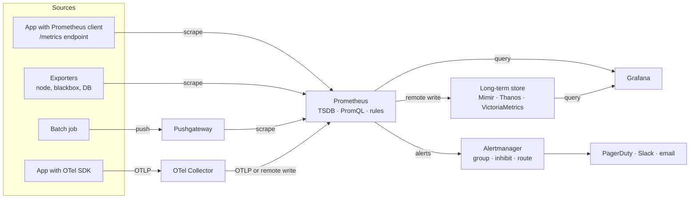
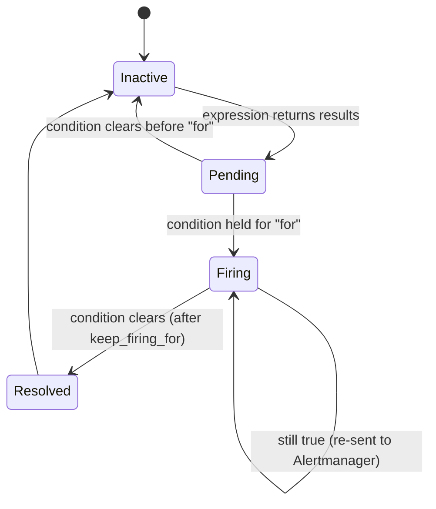

[Observability Hub](./) &raquo; Metrics &amp; Monitoring

# Metrics &amp; Monitoring

A **metric** is a numeric measurement sampled over time and identified by a name and a set of labels. Metrics are the cheapest and most predictable observability signal: a counter costs the same whether it has counted ten events or ten billion, which makes metrics the natural basis for dashboards, service level objectives, and alerting. This page covers the metric types, instrumentation with Prometheus client libraries and OpenTelemetry, Prometheus 3 and PromQL, native histograms, the RED and USE methods, dashboards, Alertmanager and burn-rate alerting, cardinality control, and long-term storage. For how metrics relate to logs and traces, see the [Observability hub](./).

## Overview

A metric is fundamentally a **time series**: a stream of `(timestamp, value)` samples for one named, labeled measurement. Where a [log](logging.html) records one event in detail and a [trace](tracing.html) records one request's path, a metric answers *how much and how often*, aggregated and continuous. Aggregation is both the strength and the limitation: storage cost is independent of traffic, but individual events cannot be recovered afterwards.

The dominant open-source stack is Prometheus for collection, storage, and rule evaluation; Grafana for visualization; Alertmanager for notification; and a horizontally scalable store (Mimir, Thanos, Cortex, or VictoriaMetrics) for long-term and global views. Since Prometheus 3.0 (November 2024), OpenTelemetry's OTLP protocol is a first-class ingestion path alongside the classic scrape.



## Metric Types

Every metrics system is built from a small vocabulary of measurement types. Choosing the wrong one is the most common instrumentation bug — a value modeled as a gauge when it should be a counter produces nonsense under `rate()`.

| Prometheus type | OpenTelemetry instrument | Semantics | Aggregatable across instances | Example |
|-----------------|--------------------------|-----------|-------------------------------|---------|
| **Counter** | Counter, ObservableCounter | Monotonically increasing total; query its rate, not its value | Yes (sum of rates) | `http_requests_total` |
| **Gauge** | Gauge, UpDownCounter, ObservableGauge | Value that rises and falls, sampled instantaneously | Depends on meaning (sum, avg, max) | `queue_depth`, `memory_free_bytes` |
| **Histogram** | Histogram (explicit or exponential buckets) | Bucketed distribution; quantiles computed in the backend | Yes | `http_request_duration_seconds` |
| **Summary** | (none; legacy only) | Quantiles precomputed in the client | No | per-instance φ-quantiles |

### Counter

A **counter** only increases, resetting to zero when the process restarts. Its absolute value is rarely meaningful — `http_requests_total` moving from 4,000,000 to 4,000,300 over five minutes means "one request per second" only once it is expressed as a rate. Counters must be monotonic so that `rate()` can detect resets: when the value drops, Prometheus assumes a restart and adds the pre-reset value rather than reporting a negative spike. By convention counter names end in `_total`.

```python
from prometheus_client import Counter

requests_total = Counter(
    "http_requests_total", "Total HTTP requests",
    ["method", "route", "status"],
)
requests_total.labels("GET", "/orders/{id}", "200").inc()
```

### Gauge

A **gauge** is a snapshot of something that fluctuates: in-flight requests, queue depth, free disk bytes, pool connections in use. Rating a gauge is meaningless. Aggregate it according to what it represents — summing free-memory gauges across nodes is sensible; summing temperatures is not. Useful PromQL functions for gauges are `avg_over_time`, `max_over_time`, `deriv()`, `delta()`, and `predict_linear()` (for example, "disk full within four hours").

```python
from prometheus_client import Gauge

inflight = Gauge("http_inflight_requests", "In-flight HTTP requests")
with inflight.track_inprogress():
    handle_request()
```

### Histogram

A **histogram** records a distribution — almost always latency or payload size. A *classic* histogram keeps a fixed set of **cumulative buckets** with upper bounds labeled `le` ("less than or equal"), plus a `_sum` and `_count`:

```
http_request_duration_seconds_bucket{le="0.1"}  9234
http_request_duration_seconds_bucket{le="0.25"} 9821
http_request_duration_seconds_bucket{le="0.5"}  9950
http_request_duration_seconds_bucket{le="1"}    9990
http_request_duration_seconds_bucket{le="+Inf"} 10000   # equals _count
http_request_duration_seconds_sum               1843.2
http_request_duration_seconds_count             10000
```

Because raw bucket counts are exported, the backend can compute any quantile across any set of instances with `histogram_quantile()`: sum the bucket rates across instances first, then interpolate within the bucket containing the target rank. This is mathematically sound because it reconstructs one combined distribution. Accuracy is limited by bucket placement, so buckets should straddle SLO thresholds; an SLO of "95% under 300 ms" needs a bucket boundary at exactly 0.3 to be measured without interpolation error.

The mean hides the tail. If 99 requests take 10 ms and one takes 5 s, the mean is about 60 ms while the p99 is about 5 s. Latency SLOs and alerts should use percentiles or, better, the fraction of requests under a threshold — which a histogram gives exactly when a bucket boundary sits at the threshold.

```python
from prometheus_client import Histogram

latency = Histogram(
    "http_request_duration_seconds", "HTTP request duration",
    ["method", "route"],
    buckets=(0.005, 0.01, 0.025, 0.05, 0.1, 0.25, 0.3, 0.5, 1, 2.5, 5, 10),
)
with latency.labels("GET", "/orders/{id}").time():
    handle_request()
```

### Native histograms

**Native histograms** (called *exponential histograms* in OpenTelemetry) replace hand-chosen buckets with buckets on an exponential scale whose resolution is set by a single *schema* parameter. Only populated buckets are stored, and the whole distribution is one series rather than one series per bucket, so they are both higher-resolution and cheaper than classic histograms.

| | Classic histogram | Native histogram |
|---|---|---|
| Bucket layout | Fixed at instrumentation time | Exponential, automatic; resolution adjustable |
| Series per label set | One per bucket, plus `_sum` and `_count` | One |
| Accuracy across wide ranges | Poor unless many buckets are configured | Bounded relative error at every scale |
| Merging different layouts | Not possible | Automatic (resolution reduced to the coarser schema) |
| Querying | `histogram_quantile(0.99, sum by (le) (rate(x_bucket[5m])))` | `histogram_quantile(0.99, sum(rate(x[5m])))` — no `le` label |

Native histograms became a **stable** feature in Prometheus v3.8. Ingestion is opt-in in the 3.x series and is expected to default to on in Prometheus 4:

```yaml
global:
  scrape_native_histograms: true   # accept native histograms from targets

remote_write:
  - url: https://mimir.example.com/api/v1/push
    send_native_histograms: true
```

Client support varies by language: the Go and Java Prometheus clients and every OpenTelemetry SDK (via exponential histograms) can emit them. PromQL adds functions such as `histogram_count()`, `histogram_sum()`, `histogram_avg()`, and `histogram_fraction(0, 0.3, ...)` — the last directly answers "what fraction of requests completed in under 300 ms", which is exactly a latency SLI.

### Summary

A **summary** computes φ-quantiles (for example 0.5, 0.9, 0.99) inside the client over a sliding window and exports finished numbers. Summary quantiles **cannot be aggregated**: the average of three instances' p99 is not the fleet p99, and no valid way exists to combine them. Summaries also fix the quantiles and window at instrumentation time. New instrumentation should use histograms; summaries remain mainly in older libraries.

### OpenTelemetry metrics

OpenTelemetry defines its own metrics API with the instruments listed above. The SDK aggregates measurements in-process and exports them periodically over OTLP; Prometheus-compatible backends then store them as the equivalent Prometheus types. Two differences from the Prometheus model matter in practice:

- **Temporality.** OTel supports *cumulative* sums (the Prometheus model: running totals since start) and *delta* sums (increments since the last export, preferred by some vendors). Prometheus expects cumulative data; delta streams need conversion, for example with the Collector's `deltatocumulative` processor.
- **Naming.** OTel semantic conventions use dotted names with units carried as metadata (`http.server.request.duration`, unit `s`). By default Prometheus translates this to `http_server_request_duration_seconds`; Prometheus 3 can also keep the original UTF-8 name.

```python
from opentelemetry import metrics
from opentelemetry.sdk.metrics import MeterProvider
from opentelemetry.sdk.metrics.export import PeriodicExportingMetricReader
from opentelemetry.sdk.resources import Resource
from opentelemetry.exporter.otlp.proto.http.metric_exporter import OTLPMetricExporter

reader = PeriodicExportingMetricReader(
    OTLPMetricExporter(endpoint="http://otel-collector:4318/v1/metrics"),
    export_interval_millis=15_000,
)
metrics.set_meter_provider(MeterProvider(
    resource=Resource.create({"service.name": "order-service"}),
    metric_readers=[reader],
))

meter = metrics.get_meter("order-service")
duration = meter.create_histogram(
    "http.server.request.duration", unit="s",
    description="Duration of HTTP server requests",
)
duration.record(0.042, {
    "http.request.method": "GET",
    "http.route": "/orders/{id}",          # route template, never the raw path
    "http.response.status_code": 200,
})
```

## Prometheus

**Prometheus** is a CNCF graduated project and the de-facto open-source metrics system: a single binary that discovers and scrapes targets, stores samples in a local time-series database (TSDB), evaluates recording and alerting rules, and answers PromQL queries. The **3.x** series, begun in November 2024, is the first major version since 2017. Its principal changes:

- **OTLP ingestion** — enabled with `--web.enable-otlp-receiver`, accepting OpenTelemetry metrics at `/api/v1/otlp/v1/metrics`.
- **UTF-8 metric and label names**, so OTel names such as `http.server.request.duration` can be stored unchanged. PromQL gains a quoted form: `{"http.server.request.duration", "http.route"="/orders/{id}"}`.
- **Remote Write 2.0**, which carries metadata, exemplars, and native histograms natively and interns repeated label strings to reduce bandwidth.
- **A rewritten web UI**, native histograms (stable from v3.8), and **left-open range selectors** — a sample exactly at the start of a `[5m]` window is no longer included, which can change results for queries whose window equals the scrape interval.
- **Long-term support (LTS) releases** designated periodically alongside the roughly six-weekly minor releases (for example, v3.13 is an LTS line).

### Data model

A series is uniquely identified by a metric name plus a set of label key/value pairs:

```
http_requests_total{method="GET", route="/orders/{id}", status="200"}
└─── metric name ─┘ └──────────────── labels ─────────────────────┘
```

Every distinct combination of label values is a separate series. The metric name is itself a reserved label, `__name__`. Samples are `(millisecond timestamp, float64)` pairs, or histogram values for native histograms; there are no string samples — string information lives only in labels.

### Scraping and service discovery

Prometheus is **pull-based**: targets expose `/metrics` and Prometheus fetches it every `scrape_interval` (commonly 15–60 s). Pulling lets Prometheus control load and gives a free health signal — the synthetic `up` series is 1 when a scrape succeeded and 0 otherwise. Targets come from **service discovery** (Kubernetes, Consul, EC2, DNS, HTTP, file) so the target set follows autoscaling; **relabeling** filters and rewrites target labels before the scrape.

```yaml
# prometheus.yml
global:
  scrape_interval: 15s
  evaluation_interval: 15s          # how often rules run

scrape_configs:
  - job_name: api
    static_configs:
      - targets: ["api-1:8000", "api-2:8000"]

  - job_name: kubernetes-pods
    kubernetes_sd_configs:
      - role: pod
    relabel_configs:                # keep only pods that opt in via annotation
      - source_labels: [__meta_kubernetes_pod_annotation_prometheus_io_scrape]
        action: keep
        regex: "true"

rule_files:
  - "rules/*.yml"

alerting:
  alertmanagers:
    - static_configs:
        - targets: ["alertmanager:9093"]
```

On Kubernetes, the Prometheus Operator's `ServiceMonitor` and `PodMonitor` custom resources are the more common way to declare scrape targets than raw `kubernetes_sd_configs`.

Short-lived batch jobs finish before they can be scraped, so they push final results to a **Pushgateway**, which Prometheus then scrapes. The Pushgateway is intended only for service-level batch jobs; using it for long-running services loses the `up` signal and leaves stale series behind after instances disappear.

### PromQL

**PromQL** is Prometheus's functional query language. Selectors return an **instant vector** (one sample per series at the evaluation time) or, with a duration suffix such as `[5m]`, a **range vector** (all samples in the window), which functions like `rate()` reduce back to an instant vector.

```promql
# Per-second request rate over 5 minutes, handling counter resets
rate(http_requests_total[5m])

# Aggregate away instance labels: request rate per route
sum by (route) (rate(http_requests_total[5m]))

# Error ratio per route
  sum by (route) (rate(http_requests_total{status=~"5.."}[5m]))
/ sum by (route) (rate(http_requests_total[5m]))

# Fleet-wide p99 from classic histogram buckets
histogram_quantile(0.99,
  sum by (route, le) (rate(http_request_duration_seconds_bucket[5m])))

# Disk predicted to fill within 4 hours, based on the last hour's trend
predict_linear(node_filesystem_avail_bytes[1h], 4 * 3600) < 0
```

| Function | Input | Use |
|----------|-------|-----|
| `rate()` | Counter | Average per-second increase over the window; the default for graphs and alerts |
| `irate()` | Counter | Rate from the last two samples; reacts instantly but is noisy — graphs only, not alerts |
| `increase()` | Counter | Total increase over the window (`rate × window`) |
| `delta()`, `deriv()` | Gauge | Change, or least-squares slope, over the window |
| `*_over_time()` | Gauge | `avg`, `max`, `min`, `quantile` of samples in a window |
| `predict_linear()` | Gauge | Linear extrapolation for capacity alerts |

The range should span at least four scrape intervals so `rate()` always has enough samples; in Grafana, `$__rate_interval` computes this automatically.

**Recording rules** precompute expensive expressions on every evaluation cycle and store the result as a new series, so dashboards and alerts read a cheap aggregate instead of rescanning raw samples. By convention their names follow `level:metric:operations`:

```yaml
groups:
  - name: api-aggregations
    rules:
      - record: job_route:http_requests:rate5m
        expr: sum by (job, route) (rate(http_requests_total[5m]))
      - record: job:http_request_duration_seconds:p99_5m
        expr: |
          histogram_quantile(0.99,
            sum by (job, le) (rate(http_request_duration_seconds_bucket[5m])))
```

### Exemplars

Metrics are aggregate: a p99 spike shows the symptom but not which request caused it. An **exemplar** is a `trace_id` (and optional labels) attached to an individual histogram or counter observation. Grafana plots exemplars as points on the graph, and selecting one opens the corresponding trace in Tempo or Jaeger. In the OpenMetrics text format an exemplar follows the sample after a `#`:

```
http_request_duration_seconds_bucket{le="2.5"} 9990 # {trace_id="4bf92f3577b34da6a3ce929d0e0e4736"} 2.31 1758540000.123
```

Prometheus stores exemplars when started with `--enable-feature=exemplar-storage`; OpenTelemetry SDKs attach exemplars from the active span automatically when sampling allows. See [Distributed Tracing](tracing.html) for the trace side of the pivot.

## Grafana Dashboards

**Grafana** is the usual visualization layer. It queries many data sources — Prometheus and compatible stores, Loki, Tempo, SQL databases, cloud monitoring APIs — and renders time-series graphs, stat panels, heatmaps, and tables.

Principles for dashboards that help during an incident:

- **Follow the signal hierarchy.** Top row: SLO status and RED summary for the whole service. Below: per-route breakdowns, then USE panels for resources, then dependencies.
- **Use template variables** (`$service`, `$route`, `$instance`) so one dashboard serves every service.
- **Use heatmaps for latency.** A heatmap of histogram buckets over time reveals bimodal distributions and gradual drift that a single p99 line hides.
- **Annotate deploys and feature-flag changes**, so regressions line up visibly with their cause.
- **Enable exemplars** on latency panels, so a spike is one click from a trace.
- **Manage dashboards as code** — file provisioning, the Grafana Terraform provider, or the Grafana Foundation SDK — so they are versioned and reviewed rather than hand-edited and lost.

A minimal RED panel set:

```promql
# Rate
sum by (route) (rate(http_requests_total[$__rate_interval]))

# Error ratio
  sum by (route) (rate(http_requests_total{status=~"5.."}[$__rate_interval]))
/ sum by (route) (rate(http_requests_total[$__rate_interval]))

# Latency percentiles (one query per quantile, overlaid)
histogram_quantile(0.50, sum by (route, le) (rate(http_request_duration_seconds_bucket[$__rate_interval])))
histogram_quantile(0.99, sum by (route, le) (rate(http_request_duration_seconds_bucket[$__rate_interval])))
```

## The RED and USE Methods

Two complementary checklists answer "what should be measured?": RED for the *workload* a service handles, USE for the *resources* it consumes. Google's four golden signals — latency, traffic, errors, saturation — combine the two.

| Method | Applies to | Signals | Answers |
|--------|------------|---------|---------|
| **RED** (Tom Wilkie) | Request-driven services: APIs, RPC handlers, queue consumers | Rate, Errors, Duration | Is the service healthy from the caller's point of view? |
| **USE** (Brendan Gregg) | Resources: CPU, memory, disks, NICs, pools, queues | Utilization, Saturation, Errors | Which resource is the bottleneck? |
| **Golden signals** (Google SRE) | Any user-facing system | Latency, Traffic, Errors, Saturation | Both of the above, in one view |

### RED

For every endpoint, record the request **R**ate, the **E**rror rate (or ratio), and the **D**uration distribution. RED describes what users experience and maps directly onto a counter plus a histogram. The middleware below (aiohttp) emits all three:

```python
import time
from prometheus_client import Counter, Histogram, Gauge

request_count = Counter(
    "http_requests_total", "Total HTTP requests",
    ["method", "route", "status"],
)
request_duration = Histogram(
    "http_request_duration_seconds", "HTTP request duration",
    ["method", "route"],
    buckets=(0.005, 0.01, 0.025, 0.05, 0.1, 0.25, 0.3, 0.5, 1, 2.5, 5),
)
inflight = Gauge("http_inflight_requests", "In-flight HTTP requests")


async def metrics_middleware(request, handler):
    start = time.perf_counter()
    inflight.inc()
    status = "5xx"                    # default so exceptions are still counted
    try:
        response = await handler(request)
        status = f"{response.status // 100}xx"
        return response
    finally:
        # Route TEMPLATE (/orders/{id}), never the raw path, to bound cardinality
        route = request.match_info.route.resource.canonical
        request_count.labels(request.method, route, status).inc()
        request_duration.labels(request.method, route).observe(time.perf_counter() - start)
        inflight.dec()
```

### USE

For every resource, track **U**tilization (fraction of time busy, or of capacity in use), **S**aturation (work queued waiting for the resource), and **E**rrors. RED says *the service is slow*; USE says *which exhausted resource* makes it slow.

| Resource | Utilization | Saturation | Errors |
|----------|-------------|------------|--------|
| CPU | % busy | run-queue length; PSI `cpu some` | — |
| Memory | % used | swapping, PSI `memory`, OOM kills | allocation failures |
| Disk | % time busy | I/O queue depth, PSI `io` | I/O errors |
| Network | bytes/s ÷ link capacity | drops, retransmits, socket backlog | NIC errors |
| Connection pool | in use ÷ size | callers waiting on checkout | checkout timeouts |

On Linux, **pressure stall information** (PSI, `/proc/pressure/*`, exported by node_exporter and cAdvisor) measures saturation directly as the share of time tasks were stalled waiting for CPU, memory, or I/O, and is often a better saturation signal than utilization.

Saturation is the most predictive of the three because queueing delay grows non-linearly with utilization. In the M/M/1 queueing model, mean response time $T$ depends on service time $T_s$ and utilization $\rho$ as

$$
T = \frac{T_s}{1 - \rho}
$$

At $\rho = 0.5$ requests take twice the service time; at $\rho = 0.9$, ten times; as $\rho$ approaches 1, $T$ grows without bound. A resource that looks only 80% utilized can therefore already be adding severe queueing latency.

## Alerting with Alertmanager

Prometheus evaluates **alerting rules** every `evaluation_interval`. An alert whose expression returns results enters the *pending* state and becomes *firing* only once the condition has held for the rule's `for` duration; `keep_firing_for` optionally holds it in the firing state after the condition clears, to damp flapping. Firing alerts are sent to **Alertmanager**, which handles everything after that: grouping, deduplication, inhibition, silencing, and routing to receivers.



```yaml
# rules/alerts.yml — evaluated by Prometheus
groups:
  - name: api-availability
    rules:
      - alert: HighErrorRate
        expr: |
            sum by (job) (rate(http_requests_total{status=~"5.."}[5m]))
          / sum by (job) (rate(http_requests_total[5m])) > 0.05
        for: 10m
        keep_firing_for: 5m
        labels:
          severity: page
        annotations:
          summary: "5xx ratio above 5% on {{ $labels.job }}"
          runbook_url: "https://runbooks.example.com/high-error-rate"
```

```yaml
# alertmanager.yml
route:
  receiver: slack-default
  group_by: ["alertname", "job"]     # one notification per group
  group_wait: 30s                    # batch alerts that fire together
  group_interval: 5m
  repeat_interval: 4h
  routes:
    - matchers: ['severity="page"']
      receiver: pagerduty
inhibit_rules:                       # suppress symptoms when the cause is firing
  - source_matchers: ['alertname="NodeDown"']
    target_matchers: ['severity="warning"']
    equal: ["instance"]
receivers:
  - name: slack-default
    slack_configs:
      - channel: "#alerts"
        api_url: "https://hooks.slack.com/services/..."
  - name: pagerduty
    pagerduty_configs:
      - routing_key: "<events-api-v2-integration-key>"
```

| Concept | Effect |
|---------|--------|
| **Grouping** | Collapses related alerts (every node in a failed rack) into one notification |
| **Deduplication** | Identical alerts from HA Prometheus replicas produce one notification |
| **Inhibition** | Suppresses lower-priority alerts while a causal alert fires |
| **Silences** | Mute matching alerts for a period, e.g. planned maintenance |

Good alerting practice: page only on **symptoms** users would notice (SLO burn, not CPU), attach a runbook to every paging alert, route cause-level and capacity alerts to tickets, and review alerts that fired without requiring action.

### Burn-rate alerting

Alerting directly on "availability below the SLO" is both too noisy (brief blips) and too slow (a gradual bleed exhausts the budget unnoticed). The approach from Google's *SRE Workbook* alerts on the **burn rate**: the observed error ratio divided by the error ratio the SLO permits.

$$
\text{burn rate} = \frac{\text{error ratio over window}}{1 - \text{SLO}}
$$

A burn rate of 1 spends exactly the whole budget over the SLO period. Sustained for a time $t$, a burn rate $b$ consumes a fraction $b \cdot t / P$ of the budget for an SLO period $P$ — so for a 30-day period, a burn rate of 14.4 sustained for one hour consumes $14.4 / 720 = 2\%$ of the budget.

**Multi-window, multi-burn-rate** alerts pair a long window, which establishes that significant budget has been spent, with a short window (one-twelfth of the long one), which confirms the problem is still happening so the alert resets quickly once it stops. The standard parameters for a 30-day SLO:

| Severity | Budget consumed | Long window | Short window | Burn rate |
|----------|-----------------|-------------|--------------|-----------|
| Page | 2% | 1 h | 5 min | 14.4 |
| Page | 5% | 6 h | 30 min | 6 |
| Ticket | 10% | 3 days | 6 h | 1 |

```promql
# Fast-burn page for a 99.9% SLO (budget 0.001)
(
    sum(rate(http_requests_total{status=~"5.."}[1h]))
  / sum(rate(http_requests_total[1h]))             > (14.4 * 0.001)
)
and
(
    sum(rate(http_requests_total{status=~"5.."}[5m]))
  / sum(rate(http_requests_total[5m]))             > (14.4 * 0.001)
)
```

In practice the error ratios for each window are precomputed as recording rules, and generators such as **Sloth** or **Pyrra** produce the complete rule set from a short SLO definition. For latency SLOs, the "bad events" are requests above the threshold, computed from the histogram bucket at the threshold (or with `histogram_fraction` on a native histogram).

## Cardinality Pitfalls

The most expensive mistake in metrics is **cardinality explosion**. Every unique combination of label values is a separate series with its own index entry and in-memory chunk, and total cardinality is the *product* of each label's distinct values. A metric labeled with `method` (5) × `route` (40) × `status` (6) yields 1,200 series; adding `user_id` with a million users yields over a billion — enough to exhaust memory on the server and budget in a hosted backend, which typically bills per active series.

Values that must not become labels:

- User, session, request, or trace IDs (put these in traces, logs, or exemplars).
- Raw URLs or paths containing IDs (`/orders/8a3f...`); use the route template (`/orders/{id}`).
- Email addresses, client IP addresses, raw error messages, timestamps, or anything unbounded.

Guidance:

- **Keep labels enumerable**: method, route template, status class, region, environment.
- **Audit regularly.** `prometheus_tsdb_head_series` reports active series; `topk(20, count by (__name__) ({__name__=~".+"}))` finds the worst metrics; the Prometheus UI's TSDB status page lists the highest-cardinality labels. Alert on unexpected series growth.
- **Limit at ingestion.** Per-scrape `sample_limit` and `label_value_length_limit` protect Prometheus from a misbehaving target; hosted backends enforce per-tenant series limits.
- **Drop at scrape time** with `metric_relabel_configs` when a library emits a label or metric you cannot change at the source:

```yaml
metric_relabel_configs:
  - action: labeldrop              # remove a runaway label from every series
    regex: user_id
  - action: drop                   # discard an unwanted metric entirely
    source_labels: [__name__]
    regex: "grpc_server_handling_seconds_bucket"
```

Dropping a label can make previously distinct series collide; drop only labels whose removal leaves series unique, or aggregate with a recording rule instead.

## Long-Term Storage

A single Prometheus server stores data on local disk with no clustering and bounded retention (15 days by default). That suits recent operational queries but not capacity planning, year-over-year comparison, or a global view across many clusters. Several systems extend Prometheus into a horizontally scalable, highly available, long-term store; all accept `remote_write` and answer PromQL, so instrumentation, dashboards, and alert rules carry over unchanged.

| | Thanos | Cortex | Grafana Mimir | VictoriaMetrics |
|---|---|---|---|---|
| Origin / status | Improbable; CNCF incubating | Weaveworks; CNCF incubating | Grafana Labs fork of Cortex (2022); AGPLv3 | VictoriaMetrics Inc.; Apache 2.0 (cluster version open source) |
| Ingest model | Sidecar uploads Prometheus blocks, or Receive component for `remote_write` | `remote_write` to sharded ingesters | `remote_write` to sharded ingesters; optional Kafka-based ingest storage | `remote_write`, many push formats, or its own scraper (vmagent) |
| Storage | Object storage (S3, GCS, Azure) | Object storage | Object storage | Local disks with its own compressed format |
| Multi-tenancy | Limited | First-class | First-class | Cluster version |
| Typical fit | Adding global query and retention to an existing Prometheus fleet | Existing multi-tenant deployments | New large-scale, multi-tenant platforms | High ingest per core, low operational footprint |

- **Thanos** leaves each Prometheus in place and attaches a **sidecar** that uploads completed TSDB blocks to object storage. A **Querier** fans a PromQL query out to sidecars and a **Store Gateway** (historical blocks) and deduplicates samples from HA replica pairs; a **Compactor** compacts and downsamples old blocks for fast long-range queries.
- **Cortex** receives `remote_write` into a horizontally sharded set of microservices — distributors, ingesters, queriers, compactors — backed by object storage, with strict tenant isolation.
- **Mimir** re-engineered the Cortex codebase for higher scale and simpler operation; the 3.x series adds its own query engine and an ingest-storage architecture that decouples the write and read paths through a Kafka-compatible log.
- **VictoriaMetrics** is a separate implementation with a PromQL-compatible dialect (MetricsQL), known for high compression and low resource use.

```yaml
# Keep local TSDB for recent data and ship every sample to a remote store
remote_write:
  - url: "https://mimir.example.com/api/v1/push"
    send_native_histograms: true
    queue_config:
      max_samples_per_send: 2000
      capacity: 10000
```

When Prometheus is used purely as a forwarder, **agent mode** (`--agent`) disables local querying and rules and keeps only a write-ahead log, reducing its footprint. The OpenTelemetry Collector and Grafana Alloy fill the same role for OTLP pipelines.

## See Also

- **[Observability Hub](./)** — how metrics relate to logs, traces, and SLOs
- **[Logging](logging.html)** — deriving metrics from logs and correlating by `trace_id`
- **[Distributed Tracing](tracing.html)** — the other side of the exemplar link
- **[Distributed Systems: Observability](../distributed-systems/observability.html)** — the signals and SLOs in a multi-node setting
- **[AWS Monitoring](../technology/aws/monitoring.html)** — CloudWatch metrics and alarms, Amazon Managed Service for Prometheus
- **[Kubernetes Operations](../technology/kubernetes/operations.html)** — cluster metrics, probes, and the Prometheus Operator in context
- **[Database Design: Operations &amp; Monitoring](../technology/database-design/operations-and-monitoring.html)** — instrumenting the data tier
- **[CI/CD Pipelines](../technology/ci-cd/)** — SLO gates and canary analysis in deployment

### References

- [Prometheus documentation](https://prometheus.io/docs/) and [native histograms specification](https://prometheus.io/docs/specs/native_histograms/)
- [Using Prometheus as an OpenTelemetry backend](https://prometheus.io/docs/guides/opentelemetry/)
- [OpenTelemetry metrics data model](https://opentelemetry.io/docs/specs/otel/metrics/data-model/)
- Google, *The Site Reliability Workbook*, chapter "Alerting on SLOs" — [sre.google/workbook/alerting-on-slos](https://sre.google/workbook/alerting-on-slos/)
- Brendan Gregg, "The USE Method" — [brendangregg.com/usemethod.html](https://www.brendangregg.com/usemethod.html)
