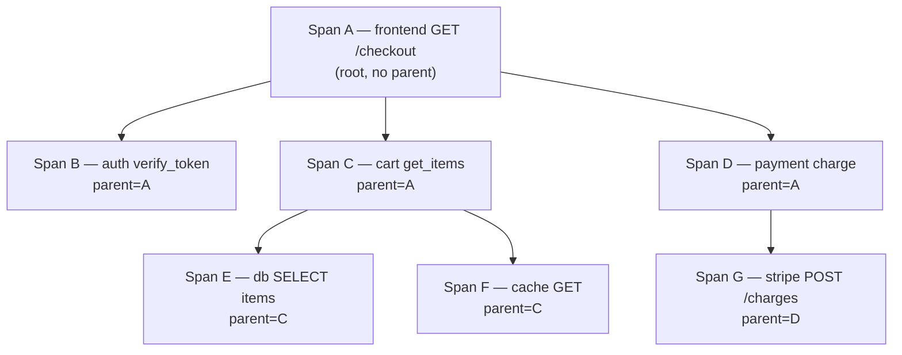
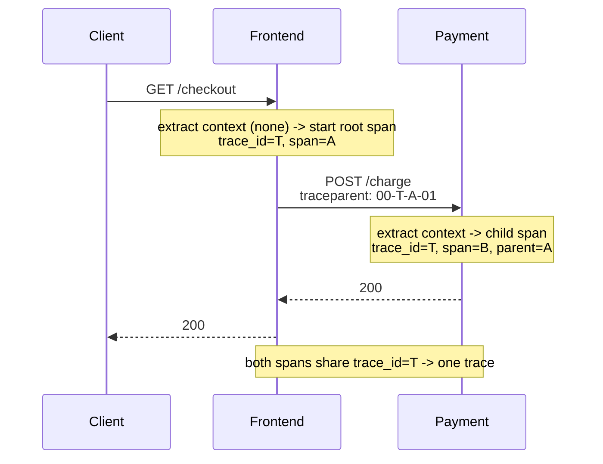
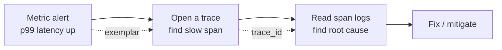

[Observability](./) &raquo; Distributed Tracing

Traces, spans, and context propagation — following one request across every service it touches.

## Why Distributed Tracing

In a monolith, a stack trace tells you the whole story of a request: every function call on the path is on one stack, in one process. The moment you split that monolith into services, the stack trace fragments. A single user click now fans out across an API gateway, an auth service, a cart service, a payment service, and three databases — each on a different host, with its own logs and its own clock. When the request is slow, no single machine holds the answer; the *latency lives in the interaction between services*, and the interaction is exactly what a per-process stack trace cannot see.

**Distributed tracing** reconstructs that cross-service stack trace. It stitches together the work done across every service into a single, navigable picture of one request, answering the two questions metrics and logs alone cannot: *where did the time go?* and *where did the error happen?* — across process boundaries, for this specific request.

Tracing is one of the [three pillars of observability](./), and it sits at the high-cardinality, per-request end of the spectrum:

| Pillar | Question it answers | Cardinality | Cost profile |
|--------|---------------------|-------------|--------------|
| **Traces** | *Where* did the time go / the error happen, across services, for one request? | High (per-request) | Sampled; storage-heavy |
| [**Metrics**](./metrics.html) | *How much / how often* is happening, aggregated over time? | Low (aggregated) | Cheap, constant-size |
| [**Logs**](./logging.html) | *What exactly* happened in this event, with full detail? | Very high | Expensive at volume |

Metrics tell you *that* p99 latency spiked; a trace tells you *which* downstream call caused it; the logs on that span tell you *why*. The rest of this page is about producing, propagating, sampling, storing, and correlating traces well.

## Traces and Spans

A **trace** captures the full lifecycle of a single request as it propagates through a distributed system. It is a tree — more precisely a directed acyclic graph — of **spans**, where each span is one unit of work: an HTTP handler, a database query, a call to a downstream service, a publish to a message queue.

### The Span Data Model

Every span carries, at minimum:

- A **trace ID** — a globally unique identifier (16 bytes / 32 hex chars) shared by *every* span in the request. This is the join key that stitches the distributed picture together.
- A **span ID** — unique to this span (8 bytes / 16 hex chars).
- A **parent span ID** — the span that caused this one (empty for the root span). Parent links are what turn a flat list of spans into a tree.
- A **name** — a low-cardinality operation label (`GET /orders/{id}`, `SELECT orders`), *not* the full templated URL with IDs.
- A **start time** and **duration**.
- A **span kind** — `SERVER`, `CLIENT`, `PRODUCER`, `CONSUMER`, or `INTERNAL`. Kinds let the backend infer the topology: a `CLIENT` span in one service pairs with a `SERVER` span in the next.
- **Attributes** (key/value tags) — `http.request.method`, `db.system`, `server.address`, etc.
- **Events** — timestamped log lines scoped to the span ("cache miss", "retry 1 of 3").
- **Links** — references to other spans not in the parent chain (e.g. a batch consumer span linking to each producing span).
- A **status** — `UNSET`, `OK`, or `ERROR`.

Visualized, a trace becomes a waterfall (flame graph) where the horizontal axis is wall-clock time and nesting shows the call hierarchy:

```
trace_id = 4bf92f3577b34da6
[ frontend: GET /checkout ........................................ 220ms ]
   [ auth: verify_token ...... 18ms ]
   [ cart: get_items .......................... 95ms ]
       [ db: SELECT items ........... 60ms ]
       [ cache: GET cart:42 .. 5ms ]
   [ payment: charge ........................... 90ms ]   <-- critical path
       [ stripe: POST /charges ............ 82ms ]
```

The **critical path** — the chain of spans whose durations sum to the total latency — is what you optimize. A span that runs in parallel and finishes early does not lengthen the request even if it is individually slow. Reading a trace is largely the discipline of finding the critical path and asking why the longest span on it took as long as it did.



### Span Lifecycle and Error Handling

A span is **started** when work begins, **ended** when it completes, and its status set to `ERROR` if it failed. The cardinal rule is that *every started span must be ended* — a leaked span produces a trace that never finishes and may break tail-based sampling. Most SDKs solve this with scope guards (`with` blocks in Python, `defer` in Go, `using` in C#) so the span ends even when an exception unwinds the stack.

## Context Propagation

The single hardest part of tracing is **context propagation**: making the trace ID and the current span ID flow from one operation to the next, including across process and network boundaries. Get this wrong and your trace shatters into disconnected single-service fragments.

There are two regimes:

- **In-process propagation.** Within one service, the "current span" is stored in thread-local / async-local / goroutine-local storage so that any code can ask "what span am I in?" and parent its child spans correctly without passing the span explicitly down every function signature.
- **Cross-process propagation.** When a request crosses a network boundary, the context must be **injected** into the outgoing carrier (HTTP headers, gRPC metadata, message attributes) on the caller side and **extracted** on the callee side, where it becomes the parent of the next server span.

### W3C Trace Context

The vendor-neutral standard — and OpenTelemetry's default — is **W3C Trace Context**, which defines two HTTP headers:

```
traceparent: 00-4bf92f3577b34da6a3ce929d0e0e4736-00f067aa0ba902b7-01
             │  └── trace-id (16 bytes) ─────┘ └ parent-id (8B) ┘ │
             version                                         trace-flags (01 = sampled)
tracestate:  vendorA=opaque,vendorB=opaque   (per-vendor key/value continuation)
```

- **`traceparent`** carries the version, trace ID, the parent (the caller's span ID), and trace-flags. The low bit of trace-flags is the **sampled flag**, which propagates the head-sampling decision so every service in the trace agrees to keep or drop it consistently.
- **`tracestate`** is an ordered, vendor-specific key/value list that lets multiple tracing systems pass extra state without clobbering each other.

Older systems may use **B3** headers (`b3` or `X-B3-TraceId` / `X-B3-SpanId` / `X-B3-Sampled`), popularized by Zipkin. OpenTelemetry can be configured to propagate B3 alongside or instead of W3C for interop with legacy Zipkin/Istio meshes. **Baggage** is a separate W3C standard (`baggage` header) for propagating arbitrary application key/values (e.g. `tenant.id`) alongside trace context — useful, but keep it small since it is copied onto every hop.

### Propagating Across Every Boundary

For message queues the trace context is stamped into message headers/metadata so the consumer can continue the trace asynchronously (usually as a span with a *link* to the producer rather than a strict parent, since the consumer may process a batch). The golden rule: **propagate context everywhere a request crosses a boundary** — HTTP clients, gRPC, Kafka/RabbitMQ producers and consumers, background jobs, cron triggers — or the trace breaks into disconnected fragments.



## OpenTelemetry

**OpenTelemetry (OTel)** is the CNCF standard — the merger of the earlier OpenTracing and OpenCensus projects — that unifies the instrumentation layer across traces, metrics, and logs. Its central promise is *instrument once, export anywhere*: you write vendor-neutral instrumentation and choose (or change) your backend without touching application code. It is the de facto standard for new tracing work, so the rest of this page is OTel-centric.

### The Components

OpenTelemetry is several pieces that are easy to conflate:

| Component | Role |
|-----------|------|
| **API** | The minimal surface application code calls (`start_span`, `set_attribute`). Stable, dependency-light; a no-op if no SDK is installed. |
| **SDK** | The implementation behind the API: sampling, span processors, batching, exporters. Configured once at startup. |
| **Instrumentation libraries** | Auto-instrumentation for popular frameworks (Flask, Express, gRPC, SQLAlchemy, Kafka) that creates spans and propagates context with no manual code. |
| **OTLP** | The **OpenTelemetry Protocol** — the wire format (gRPC or HTTP/protobuf) for shipping telemetry to a collector or backend. |
| **Collector** | A standalone process that receives, processes, and exports telemetry. |
| **Semantic conventions** | A standardized attribute vocabulary (below) so data is portable across tools. |

### The Collector

The **OpenTelemetry Collector** is a vendor-agnostic proxy and pipeline for telemetry. Instead of every service knowing how to talk to Jaeger *and* Tempo *and* a SaaS, services emit OTLP to a local Collector, and the Collector fans the data out. Its pipeline has three stages:

- **Receivers** ingest data (OTLP, Jaeger, Zipkin, Prometheus scrape, …).
- **Processors** transform it in flight — `batch` (group for efficient export), `memory_limiter` (backpressure), `tail_sampling` (decide after the full trace arrives), `attributes`/`resource` (add or redact fields, e.g. strip PII).
- **Exporters** send it onward to one or more backends.

```yaml
# otel-collector-config.yaml — receive OTLP, batch, tail-sample, fan out
receivers:
  otlp:
    protocols:
      grpc: { endpoint: 0.0.0.0:4317 }
      http: { endpoint: 0.0.0.0:4318 }

processors:
  memory_limiter:
    check_interval: 1s
    limit_percentage: 80
  batch:
    timeout: 5s
  tail_sampling:                 # decide AFTER the whole trace is buffered
    decision_wait: 10s
    policies:
      - name: keep-errors
        type: status_code
        status_code: { status_codes: [ERROR] }
      - name: keep-slow
        type: latency
        latency: { threshold_ms: 500 }
      - name: sample-rest
        type: probabilistic
        probabilistic: { sampling_percentage: 5 }

exporters:
  otlp/tempo:                    # Grafana Tempo over OTLP
    endpoint: tempo:4317
    tls: { insecure: true }
  otlp/jaeger:                   # Jaeger also speaks OTLP natively
    endpoint: jaeger:4317
    tls: { insecure: true }

service:
  pipelines:
    traces:
      receivers:  [otlp]
      processors: [memory_limiter, tail_sampling, batch]
      exporters:  [otlp/tempo, otlp/jaeger]
```

Run the Collector as an **agent** (a sidecar/DaemonSet next to each app, doing cheap local batching) and/or as a **gateway** (a central cluster doing tail sampling and export). Tail sampling must run in the gateway tier because it needs *all* spans of a trace in one place — which also means a trace's spans must be routed to the same collector instance (`loadbalancing` exporter, keyed on trace ID).

### Semantic Conventions

The value of portable telemetry collapses if every team names the same attribute differently (`httpMethod` vs `http.method` vs `verb`). **Semantic conventions** are OpenTelemetry's standardized, versioned dictionary of attribute names and span-naming rules for common operations, so backends and dashboards can rely on stable keys.

A few stabilized examples (the conventions are still evolving — `http.method` was renamed to `http.request.method` in the 1.x stabilization, which is why you see both in the wild):

| Domain | Attribute | Example |
|--------|-----------|---------|
| HTTP server | `http.request.method`, `http.route`, `http.response.status_code`, `url.path` | `GET`, `/orders/{id}`, `200` |
| Database | `db.system`, `db.namespace`, `db.query.text` | `postgresql`, `orders`, `SELECT ...` |
| RPC | `rpc.system`, `rpc.service`, `rpc.method` | `grpc`, `OrderService`, `Charge` |
| Messaging | `messaging.system`, `messaging.destination.name`, `messaging.operation` | `kafka`, `orders`, `publish` |
| Resource | `service.name`, `service.version`, `deployment.environment` | `order-service`, `1.4.0`, `prod` |

The special **Resource** attributes (`service.name`, `service.version`, host/k8s/cloud identity) describe the *emitter* and are attached to every span it produces — they are how the backend attributes a span to a service.

### Instrumenting a Service

Wiring up OTel has three parts: configure the SDK once at startup, let auto-instrumentation handle the framework, and add manual spans on the business logic you care about.

```python
from opentelemetry import trace
from opentelemetry.sdk.trace import TracerProvider
from opentelemetry.sdk.trace.export import BatchSpanProcessor
from opentelemetry.sdk.resources import Resource
# Modern OTel exports via OTLP to a Collector, which fans out to Jaeger/Tempo/etc.
from opentelemetry.exporter.otlp.proto.grpc.trace_exporter import OTLPSpanExporter

# Resource: identify this service so spans are attributed correctly in the backend
resource = Resource.create({
    "service.name": "order-service",
    "service.version": "1.4.0",
    "deployment.environment": "prod",
})
trace.set_tracer_provider(TracerProvider(resource=resource))
tracer = trace.get_tracer(__name__)

# BatchSpanProcessor buffers spans and exports them in batches over OTLP to the
# local Collector (which forwards to Tempo/Jaeger). Never use SimpleSpanProcessor
# in production — it exports synchronously and adds latency to every request.
otlp_exporter = OTLPSpanExporter(endpoint="http://otel-collector:4317", insecure=True)
trace.get_tracer_provider().add_span_processor(BatchSpanProcessor(otlp_exporter))


async def process_request(request_id):
    # start_as_current_span sets the active span; child spans auto-link as parent->child
    with tracer.start_as_current_span("process_request") as span:
        span.set_attribute("request.id", request_id)

        with tracer.start_as_current_span("validate"):
            await validate_request(request_id)

        with tracer.start_as_current_span("process"):
            result = await process_data(request_id)

        with tracer.start_as_current_span("persist") as persist_span:
            try:
                await save_result(result)
            except Exception as exc:
                # Record the error on the span so it surfaces in the trace UI
                persist_span.record_exception(exc)
                persist_span.set_status(trace.Status(trace.StatusCode.ERROR))
                raise

        return result
```

Cross-service propagation uses OTel's `inject`/`extract` on the configured propagator. Most HTTP and gRPC instrumentation libraries do this automatically once installed; the manual form makes the mechanism explicit:

```python
from opentelemetry.propagate import inject, extract

# --- Caller side: inject current context into outgoing headers ---
headers = {}
inject(headers)                       # adds 'traceparent' / 'tracestate'
await http_client.post(url, headers=headers, json=payload)

# --- Callee side: extract context, continue the same trace ---
ctx = extract(incoming_request.headers)
with tracer.start_as_current_span("handle_charge", context=ctx):
    ...
```

For most services you do far less than this: `opentelemetry-instrument python app.py` (zero-code auto-instrumentation) wires up the framework, HTTP client, and DB driver, propagates context, and exports — and you add manual spans only on the business operations worth naming.

## Tracing Backends: Jaeger, Tempo, Zipkin

A tracing **backend** ingests spans, stores them, indexes them for search, and renders the waterfall UI. Three open-source options dominate; all three speak OTLP today.

| | **Jaeger** | **Grafana Tempo** | **Zipkin** |
|---|---|---|---|
| Origin | Uber (CNCF graduated) | Grafana Labs | Twitter (the original, 2012) |
| Storage | Cassandra / Elasticsearch / OpenSearch / Badger | Object storage (S3/GCS) only | In-memory / Cassandra / Elasticsearch / MySQL |
| Indexing | Indexes spans for rich attribute search | **No span index** — find traces by ID; search is via metrics/logs (exemplars, TraceQL) | Indexes for service/operation/tag search |
| Cost model | Higher storage + index cost | **Very cheap** — trace ID lookup against cheap object storage | Lightweight, simple |
| UI | Standalone Jaeger UI | Grafana (integrated with metrics/logs) | Standalone Zipkin UI |
| Best for | Standalone tracing with full-text trace search | Cost-efficient tracing tightly integrated with Grafana metrics/logs | Simple setups, legacy B3 ecosystems |

The key architectural split is **Tempo's bet that you should not index spans at all**. Indexing every span's attributes is the dominant cost of tracing at scale. Tempo instead stores raw traces cheaply in object storage and assumes you arrive at the right trace ID *from elsewhere* — a metric **exemplar**, a log line's `trace_id`, or a TraceQL query — making it dramatically cheaper but reliant on good metric/log correlation. Jaeger and Zipkin index spans so you can search "all error traces for `order-service` tagged `region=eu`" directly, at the cost of an Elasticsearch/Cassandra cluster.

Whichever you pick, point the Collector's exporter at it. Migrating backends is a one-line Collector change, not a redeploy of every service — which is precisely the portability OTel buys you.

## Sampling Strategies

Tracing every request at high volume is expensive in CPU (span creation), network (export), and storage (indexing). **Sampling** keeps a representative subset. The decision is *where* and *when* to make it.

### Head-Based Sampling

**Head-based sampling** decides at the root span, before the trace runs, and propagates that decision in the `traceparent` sampled flag so every downstream service honors it. This keeps a trace whole — either all of its spans are kept or none are.

- **Pros:** cheap (decide once, up front); unsampled spans are never created or exported; the decision is consistent across services for free.
- **Cons:** it is blind. A flat 1% rate discards 99% of traces *including* the rare slow and error traces you most want to keep.

```python
from opentelemetry.sdk.trace.sampling import TraceIdRatioBased, ParentBased

# Keep 5% of root traces; always honor an upstream service's keep/drop decision.
# ParentBased ensures consistency: if the caller sampled the trace, we keep our spans.
sampler = ParentBased(root=TraceIdRatioBased(0.05))
TracerProvider(resource=resource, sampler=sampler)
```

`TraceIdRatioBased` makes the keep/drop decision a deterministic hash of the trace ID, so independently-configured services reach the *same* decision for the same trace even without communicating — the foundation of consistent head sampling.

### Tail-Based Sampling

**Tail-based sampling** buffers all of a trace's spans and decides *after* the trace completes, so the policy can see the whole trace: keep 100% of error traces and slow traces, sample the boring fast ones.

- **Pros:** keeps exactly the interesting traces; the right tradeoff for most production systems.
- **Cons:** every span must be created, emitted, and buffered until the trace finishes (more CPU/network than head sampling), and it requires a stateful collector tier that holds spans in memory and routes all spans of a trace to the same instance.

The `tail_sampling` processor in the Collector config above is the canonical implementation: probabilistically keep ~5% baseline, but force-keep any trace containing an error or exceeding 500ms.

### Picking a Strategy

A common, robust production setup combines both: light head sampling to bound the volume of spans created, plus tail sampling in the gateway Collector to guarantee error and slow traces survive. Tune so that (a) you always capture failures, (b) you keep enough successful traces to characterize the *normal* baseline (you cannot tell "slow" from "typical" with only error traces), and (c) cost stays bounded. Keep the sampling rate in `tracestate`/resource attributes so dashboards can scale sampled counts back up to true rates.

## Correlating Traces, Metrics, and Logs

A trace in isolation is useful; a trace *connected to* the metric that alerted you and the logs that explain it is the whole point of observability. The connective tissue is the **trace ID**, shared across all three pillars.



**Metrics -> traces, via exemplars.** An **exemplar** is a trace ID attached to a specific sample in a histogram bucket — a pointer from an aggregate to a concrete example. When a Grafana panel shows p99 latency spiking, the exemplar markers on that line are one click away from an *actual slow trace* that contributed to the spike. Exemplars are how Tempo's "no span index" model stays usable: you arrive at the trace ID from the metric.

**Traces -> logs, via trace_id on every log line.** Emit the active trace and span IDs on *every* structured log line. Once your logs carry `trace_id`, you pivot directly from a slow span to every log line that span produced, and from an error log back to the full trace. The three pillars become one navigable surface.

This logger auto-injects the *current* trace/span IDs from the active OpenTelemetry context, so callers never thread IDs by hand:

```python
import logging
from pythonjsonlogger import jsonlogger
from opentelemetry import trace

handler = logging.StreamHandler()
handler.setFormatter(jsonlogger.JsonFormatter())
root = logging.getLogger()
root.addHandler(handler)
root.setLevel(logging.INFO)


class TraceContextFilter(logging.Filter):
    """Stamp the active trace_id/span_id onto every record automatically."""
    def filter(self, record):
        ctx = trace.get_current_span().get_span_context()
        if ctx.is_valid:
            # 32-/16-hex-char IDs that match exactly what Jaeger/Tempo show
            record.trace_id = format(ctx.trace_id, "032x")
            record.span_id = format(ctx.span_id, "016x")
        return True


handler.addFilter(TraceContextFilter())
log = logging.getLogger("order")

# trace_id/span_id are injected automatically; just log structured fields
log.info("Order processed", extra={"order_id": "12345"})
# -> {"message": "Order processed", "order_id": "12345",
#     "trace_id": "4bf92f3577b34da6a3ce929d0e0e4736", "span_id": "00f067aa0ba902b7"}
```

With this in place a single incident flows as one investigation: a **burn-rate alert** on an SLO fires from RED **metrics**, an **exemplar** jumps you to a representative slow **trace**, the slow **span** links to the **logs** it produced (joined by `trace_id`), and those logs reveal the exception. That pivot — metric -> trace -> log, anchored by a shared trace ID — is the payoff of instrumenting all three pillars consistently.

## Instrumenting Services: Practical Guidance

- **Prefer auto-instrumentation first.** Install the OTel instrumentation libraries for your framework and DB driver before writing any manual spans; they cover HTTP/gRPC/DB and propagate context correctly for free.
- **Add manual spans on business operations,** not on every function. A span per *meaningful* unit of work (validate, charge, persist) reads well; a span per helper call drowns the waterfall.
- **Use the route template, never the raw path,** in span names and `http.route` (`/orders/{id}`, not `/orders/12345`) to keep operation cardinality bounded.
- **Follow semantic conventions** for attribute names so your data is portable across backends and dashboards.
- **Record exceptions and set ERROR status** on the span where the failure occurred so error traces are findable and tail sampling keeps them.
- **Propagate context across *every* boundary** — including async jobs and message queues — or traces fragment.
- **Keep baggage small.** Anything in baggage is copied onto every hop of every request.
- **Never put high-cardinality identifiers in metric labels;** put them in span attributes and logs instead, where per-request detail belongs.

## See Also

- **[Observability Hub](./)** — the three pillars, observability vs monitoring, and SLOs
- **[Observability: Metrics & Monitoring](./metrics.html)** — counters, histograms, Prometheus/PromQL, RED & USE, exemplars
- **[Observability: Logging](./logging.html)** — structured logging, correlation IDs, ELK/Loki, sampling and PII
- **[Distributed Systems: Observability](../distributed-systems/observability.html)** — tracing, metrics, and SLOs framed inside distributed-system design
- **[Kubernetes](../technology/kubernetes/)** — where most traced services run; Collector as a sidecar/DaemonSet
- **[Networking](../technology/networking/)** — the latency and failure modes traces expose
- **[Database Design](../technology/database-design/)** — instrumenting and tracing data-tier calls
