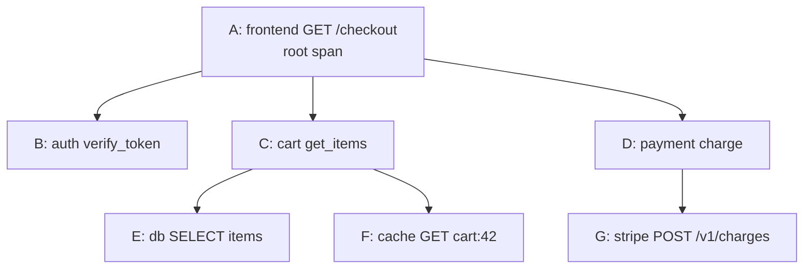
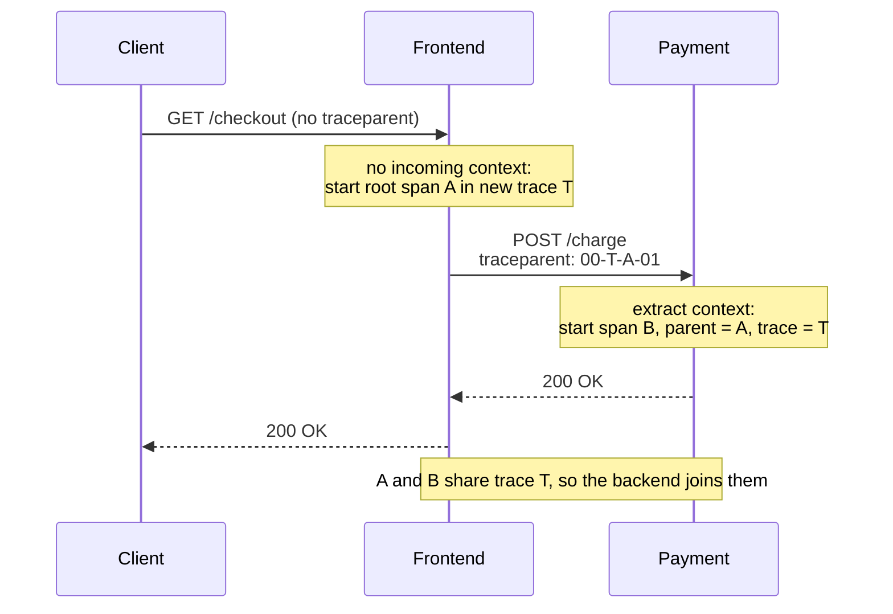
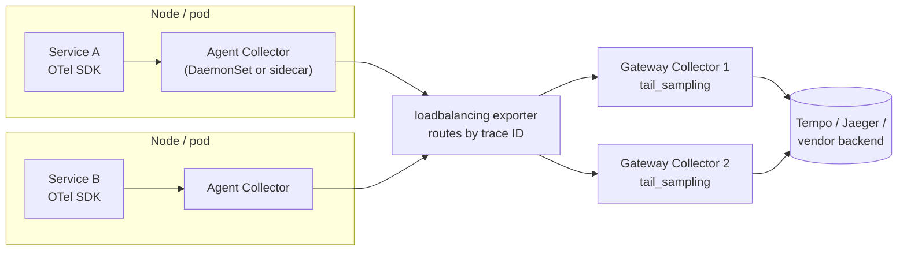
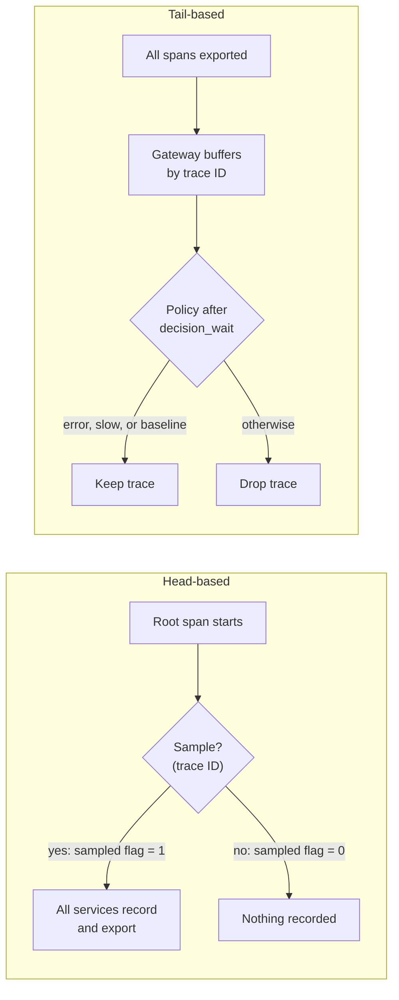
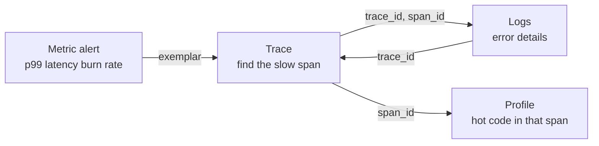

[Observability](./) &raquo; Distributed Tracing

**Distributed tracing** records the path of a single request through every service, queue, and datastore it touches, and reassembles that path into one timeline. This page covers the trace data model, context propagation (W3C Trace Context), OpenTelemetry and its Collector, the major open-source backends, head- and tail-based sampling, and how traces connect to metrics, logs, and profiles. It reflects OpenTelemetry and backend behavior as of late 2026.

## Why Distributed Tracing

In a monolith, a stack trace tells the whole story of a request: every call on the path sits on one stack in one process. Split the monolith into services and that story fragments. A single click fans out across a gateway, an auth service, a cart service, a payment service, and several databases, each on a different host with its own logs and clock. When the request is slow, no single machine holds the answer, because the latency lives in the *interaction* between services.

Tracing reconstructs a cross-service stack trace. For one specific request it answers the two questions that aggregated metrics and scattered logs cannot: *where did the time go?* and *where did the error originate?*

| Signal | Question it answers | Cardinality | Cost profile |
|--------|---------------------|-------------|--------------|
| **Traces** | Where did the time go, or the error happen, across services, for one request? | High (per request) | Sampled; storage-heavy |
| [**Metrics**](./metrics.html) | How much and how often, aggregated over time? | Low (aggregated) | Cheap, constant size |
| [**Logs**](./logging.html) | What exactly happened in this event? | Very high | Expensive at volume |
| **Profiles** | Which *code* consumed the CPU or memory? | High (per stack) | Sampled; continuous |

Metrics tell you *that* p99 latency spiked; a trace tells you *which* downstream call caused it; the logs and profile attached to that span tell you *why*.

The idea dates to Google's **Dapper** paper (2010). Twitter's **Zipkin** (open-sourced 2012) and Uber's **Jaeger** (2016) brought it to open source, the competing OpenTracing and OpenCensus APIs merged into **OpenTelemetry** in 2019, and OpenTelemetry is now the default instrumentation layer for new systems.

## Traces and Spans

A **trace** is the record of one request. It is a tree of **spans** (more generally a directed acyclic graph, once span links are included), where each span is one timed unit of work: an HTTP handler, a database query, an outgoing RPC, a message publish.

### The Span Data Model

| Field | Meaning |
|-------|---------|
| **Trace ID** | 16 bytes (32 hex chars), shared by every span in the trace. The join key for the whole request. |
| **Span ID** | 8 bytes (16 hex chars), unique to this span. |
| **Parent span ID** | The span that caused this one; empty on the root span. Parent links turn a flat list into a tree. |
| **Name** | A low-cardinality operation label: `GET /orders/{id}`, `SELECT orders`. Never the raw URL with IDs in it. |
| **Start time, end time** | Wall-clock timestamps on the emitting host. |
| **Kind** | `SERVER`, `CLIENT`, `PRODUCER`, `CONSUMER`, or `INTERNAL`. A `CLIENT` span in one service pairs with a `SERVER` span in the next, which is how backends infer the service graph. |
| **Attributes** | Typed key/value pairs such as `http.request.method` or `db.system.name`, named by the [semantic conventions](#semantic-conventions). |
| **Events** | Timestamped annotations inside the span ("cache miss", an exception). See the note on the [Span Events API deprecation](#span-events-and-the-logs-api). |
| **Links** | References to spans outside the parent chain, for example a batch consumer linking to each producer span. |
| **Status** | `UNSET`, `OK`, or `ERROR`. |
| **Resource** | Attributes describing the *emitter* (`service.name`, host, pod, cloud region), shared by all its spans. |

### Reading a Trace

Backends render a trace as a **waterfall**: the horizontal axis is time, and nesting shows the call hierarchy.

```
trace_id 4bf92f3577b34da6a3ce929d0e0e4736                     0ms        110ms       220ms
frontend  GET /checkout            SERVER  |==========================================|
auth        verify_token           CLIENT  |===|                                        18ms
cart        get_items              SERVER      |===================|                    95ms
db            SELECT items         CLIENT        |===========|                          60ms
cache         GET cart:42          CLIENT                     |=|                        5ms
payment     charge                 SERVER                          |=================|  90ms  <- critical path
stripe        POST /v1/charges     CLIENT                           |===============|   82ms
```

The **critical path** is the chain of spans whose durations determine end-to-end latency. A span that runs in parallel and finishes early does not lengthen the request, however slow it is individually. Reading a trace mostly means finding the critical path, then asking why the longest span on it took as long as it did. Gaps *between* child spans are also informative: they are time spent in the parent's own code, in queues, or in un-instrumented calls.

The same trace as a span tree:



### Span Lifecycle

A span is started when work begins and ended when it completes; its status is set to `ERROR` if the work failed. Every started span must be ended. A leaked span never reaches the exporter, leaves a hole in the trace, and can stall tail-based sampling while the collector waits for it. SDKs make this hard to get wrong with scope guards: `with` blocks in Python, `defer span.End()` in Go, `using` in C#, try-with-resources in Java.

Because span timestamps come from different hosts, clock skew can make a child appear to start before its parent. Most backends apply skew adjustment in the UI; keep hosts NTP- or PTP-synchronized regardless.

## Context Propagation

**Context propagation** carries the trace ID and the current span ID from one operation to the next. It is the part of tracing most likely to break, and when it does the trace shatters into disconnected single-service fragments.

- **In-process.** The "current span" lives in a context object stored in thread-local, async-local (`contextvars` in Python, `AsyncLocalStorage` in Node.js), or explicitly passed storage (`context.Context` in Go). Any code can ask for the active span and parent new spans under it.
- **Cross-process.** At a network boundary the caller **injects** the context into the carrier (HTTP headers, gRPC metadata, message headers), and the callee **extracts** it and uses it as the parent of its server span.



### W3C Trace Context

The vendor-neutral standard, and OpenTelemetry's default propagator, is **W3C Trace Context**. It defines two HTTP headers:

```
traceparent: 00-4bf92f3577b34da6a3ce929d0e0e4736-00f067aa0ba902b7-01
             |  |                                |                |
             |  trace-id (16 bytes)              parent-id (8 B)  trace-flags
             version                                              (bit 0 = sampled)

tracestate:  ot=th:c,vendorB=opaque-value
```

- **`traceparent`** carries the version, trace ID, the caller's span ID, and **trace-flags**. Bit 0 is the **sampled** flag: it carries the upstream keep/drop decision so downstream services agree.
- **`tracestate`** is an ordered list of vendor key/value entries that lets several tracing systems carry their own state without clobbering one another. OpenTelemetry uses the `ot` key.

**Trace Context Level 2** (a W3C Candidate Recommendation Draft) adds a **random** flag in bit 1 of trace-flags. When set, it guarantees that at least the rightmost 7 bytes of the trace ID are uniformly random, which lets any service make a consistent sampling decision from the trace ID alone (see [consistent probability sampling](#consistent-probability-sampling)).

Other formats you will meet:

| Format | Headers | Where it appears |
|--------|---------|------------------|
| **W3C Trace Context** | `traceparent`, `tracestate` | OpenTelemetry default; most current tooling |
| **B3** (Zipkin) | `b3` single header, or `X-B3-TraceId` / `X-B3-SpanId` / `X-B3-Sampled` | Zipkin, older Istio/Envoy meshes |
| **Jaeger** | `uber-trace-id` | Legacy Jaeger client libraries (retired) |
| **AWS X-Ray** | `X-Amzn-Trace-Id` | AWS load balancers, Lambda, API Gateway |
| **W3C Baggage** | `baggage` | Application key/values (for example `tenant.id`) carried alongside the trace |

OpenTelemetry can run several propagators at once (`OTEL_PROPAGATORS=tracecontext,baggage,b3multi`) to bridge legacy services. Keep baggage small: it is copied onto every downstream hop, and it is visible to any service (and any third party) you call, so never put secrets or PII in it.

### Propagating Across Every Boundary

Propagate context everywhere a request crosses a boundary: HTTP and gRPC clients, message producers and consumers, background jobs, scheduled tasks, and thread pools or executors inside a process. Each one missed is a place the trace breaks.

Messaging is the awkward case. The producer writes the context into message headers. A consumer that processes one message at a time can parent its span on the producer span; a consumer that processes a batch starts its own span and adds a **link** to each message's producer span, because a span can have only one parent.

## OpenTelemetry

**OpenTelemetry (OTel)** is the CNCF project that standardizes how telemetry is produced and shipped: traces, metrics, logs, and (in alpha) profiles. Its promise is *instrument once, export anywhere*. Application code depends only on the vendor-neutral API; the backend is chosen, and changed, in configuration.

### Components

| Component | Role |
|-----------|------|
| **API** | The surface application and library code calls (`start_span`, `set_attribute`). Dependency-light; a no-op unless an SDK is installed, so libraries can instrument themselves safely. |
| **SDK** | The implementation: samplers, span processors, batching, exporters. Configured once at process start. |
| **Instrumentation libraries** | Plug-ins for frameworks and clients (Flask, Express, Spring, gRPC, SQLAlchemy, Kafka) that create spans and propagate context without manual code. |
| **Zero-code agents** | Attach instrumentation at startup (Java agent, `opentelemetry-instrument` for Python, the .NET and Node.js auto-instrumentation packages) or from the kernel via eBPF (below). |
| **OTLP** | The OpenTelemetry Protocol: protobuf over gRPC (port 4317) or HTTP (port 4318). |
| **Collector** | A standalone pipeline that receives, processes, and exports telemetry. |
| **Semantic conventions** | The shared vocabulary of attribute and span names. |

### The Collector

The **OpenTelemetry Collector** decouples applications from backends. Services send OTLP to a nearby Collector; the Collector batches, enriches, filters, samples, and fans out to one or more backends. A pipeline has three stage types:

- **Receivers** ingest data: OTLP, Jaeger, Zipkin, Kafka, Prometheus scrape, host metrics.
- **Processors** transform it in flight: `memory_limiter` (backpressure), `batch`, `k8sattributes` (add pod and namespace metadata), `resource`/`attributes`/`transform` (add, rename, or redact fields such as PII), `filter`, and `tail_sampling`.
- **Exporters** send it on: OTLP to any OTLP-speaking backend, Kafka, files, vendor-specific exporters.

Collectors are usually deployed in two tiers:



- The **agent** tier runs next to the application, adds host and Kubernetes metadata, and batches cheaply.
- The **gateway** tier is a horizontally scaled pool that does expensive work such as tail sampling and export. Tail sampling needs every span of a trace on the same instance, so the agents use the `loadbalancing` exporter with trace ID as the routing key.

A gateway configuration that receives OTLP, tail-samples, and fans out to two backends:

```yaml
# otel-collector-gateway.yaml
receivers:
  otlp:
    protocols:
      grpc: { endpoint: 0.0.0.0:4317 }
      http: { endpoint: 0.0.0.0:4318 }

processors:
  memory_limiter:            # first in the pipeline: refuse data before OOM
    check_interval: 1s
    limit_percentage: 80
    spike_limit_percentage: 20
  tail_sampling:             # decide after the whole trace has arrived
    decision_wait: 10s
    num_traces: 100000
    policies:
      - name: keep-errors
        type: status_code
        status_code: { status_codes: [ERROR] }
      - name: keep-slow
        type: latency
        latency: { threshold_ms: 500 }
      - name: baseline
        type: probabilistic
        probabilistic: { sampling_percentage: 5 }
  batch:
    timeout: 5s

exporters:
  otlp/tempo:
    endpoint: tempo:4317
    tls: { insecure: true }  # plaintext inside the cluster only
  otlp/jaeger:               # Jaeger v2 accepts OTLP natively
    endpoint: jaeger:4317
    tls: { insecure: true }

service:
  pipelines:
    traces:
      receivers:  [otlp]
      processors: [memory_limiter, tail_sampling, batch]
      exporters:  [otlp/tempo, otlp/jaeger]
```

Tail-sampling policies are OR-ed: a trace is kept if any policy says keep. Here every error trace and every trace over 500 ms survives, plus a 5% baseline of everything else.

### Semantic Conventions

Portable telemetry is worthless if every team spells the same attribute differently (`httpMethod`, `http.method`, `verb`). The **semantic conventions** are OpenTelemetry's versioned dictionary of attribute names, span names, and span kinds for common operations.

| Domain | Key attributes | Example values | Status (late 2026) |
|--------|---------------|----------------|--------------------|
| HTTP | `http.request.method`, `http.route`, `http.response.status_code`, `url.path`, `server.address`, `error.type` | `GET`, `/orders/{id}`, `200` | Stable |
| Database | `db.system.name`, `db.namespace`, `db.operation.name`, `db.collection.name`, `db.query.text` | `postgresql`, `orders`, `SELECT`, `items` | Stable |
| RPC | `rpc.system`, `rpc.service`, `rpc.method` | `grpc`, `OrderService`, `Charge` | Development |
| Messaging | `messaging.system`, `messaging.destination.name`, `messaging.operation.type` | `kafka`, `orders`, `send` / `process` | Development |
| Resource | `service.name`, `service.version`, `deployment.environment.name` | `order-service`, `1.4.0`, `production` | Stable |

Several names changed on the way to stability, which is why older dashboards and instrumentations still emit the previous forms: `http.method` became `http.request.method`, `http.status_code` became `http.response.status_code`, `db.system` became `db.system.name`, `db.statement` became `db.query.text`, and `deployment.environment` became `deployment.environment.name`. Instrumentation libraries typically offer a transition setting (`OTEL_SEMCONV_STABILITY_OPT_IN`) to emit the old names, the new names, or both during migration.

**Resource** attributes describe the emitter rather than the operation and are attached to everything it produces. `service.name` is the one attribute every service must set; without it, backends group spans under `unknown_service`.

### Instrumenting a Service

Instrumentation has three layers: configure the SDK once at startup, let instrumentation libraries cover frameworks and clients, and add manual spans only around business operations worth naming.

**Configuration first.** Most settings can come from the environment, so the same build runs everywhere:

```bash
export OTEL_SERVICE_NAME=order-service
export OTEL_RESOURCE_ATTRIBUTES=service.version=1.4.0,deployment.environment.name=production
export OTEL_EXPORTER_OTLP_ENDPOINT=http://otel-collector:4317
export OTEL_TRACES_SAMPLER=parentbased_traceidratio
export OTEL_TRACES_SAMPLER_ARG=0.25

# Zero-code: instrument installed frameworks, HTTP clients, and DB drivers
pip install opentelemetry-distro opentelemetry-exporter-otlp
opentelemetry-bootstrap -a install      # installs instrumentations for detected libraries
opentelemetry-instrument python app.py
```

OpenTelemetry also defines a **declarative configuration** file format, whose schema is now stable (per-language SDK support is still maturing). It is selected with `OTEL_CONFIG_FILE` and expresses samplers, processors, and exporters as YAML instead of dozens of environment variables:

```yaml
file_format: "1.2"
tracer_provider:
  sampler:
    parent_based:
      root:
        always_on:
  processors:
    - batch:
        exporter:
          otlp_http:
            endpoint: http://otel-collector:4318/v1/traces
```

**Manual setup in code**, for when you need programmatic control:

```python
from opentelemetry import trace
from opentelemetry.sdk.resources import Resource
from opentelemetry.sdk.trace import TracerProvider
from opentelemetry.sdk.trace.export import BatchSpanProcessor
from opentelemetry.exporter.otlp.proto.grpc.trace_exporter import OTLPSpanExporter

resource = Resource.create({
    "service.name": "order-service",
    "service.version": "1.4.0",
    "deployment.environment.name": "production",
})
provider = TracerProvider(resource=resource)
# BatchSpanProcessor exports asynchronously in batches. SimpleSpanProcessor
# exports synchronously on span end and belongs only in tests.
provider.add_span_processor(
    BatchSpanProcessor(OTLPSpanExporter(endpoint="http://otel-collector:4317", insecure=True))
)
trace.set_tracer_provider(provider)
tracer = trace.get_tracer("order-service")


async def process_order(order_id: str):
    # start_as_current_span makes this the active span, so the child spans
    # below (and any spans created by instrumented libraries) nest under it.
    with tracer.start_as_current_span("process_order") as span:
        span.set_attribute("app.order.id", order_id)

        with tracer.start_as_current_span("validate"):
            await validate(order_id)

        with tracer.start_as_current_span("charge"):
            receipt = await charge(order_id)

        # An exception escaping a start_as_current_span block is recorded on the
        # span and sets status ERROR by default; set it explicitly only when you
        # handle the error yourself and still want the span marked failed.
        with tracer.start_as_current_span("persist") as persist:
            try:
                await save(receipt)
            except TimeoutError as exc:
                persist.set_status(trace.Status(trace.StatusCode.ERROR, "save timed out"))
                persist.set_attribute("error.type", type(exc).__qualname__)
                await enqueue_retry(receipt)

        return receipt
```

Custom attributes should use your own namespace (`app.` or a company prefix) so they never collide with future semantic conventions.

**Propagation by hand.** Instrumented HTTP and gRPC clients inject and extract automatically; the manual form shows the mechanism, and is what you write for a custom transport:

```python
from opentelemetry.propagate import inject, extract

# Caller: write the active context into outgoing headers
headers: dict[str, str] = {}
inject(headers)                        # adds traceparent (and tracestate, baggage)
await http_client.post(url, headers=headers, json=payload)

# Callee: read the context and continue the same trace
ctx = extract(request.headers)
with tracer.start_as_current_span("handle_charge", context=ctx,
                                  kind=trace.SpanKind.SERVER):
    ...
```

### eBPF-Based Instrumentation

**OpenTelemetry eBPF Instrumentation (OBI)** instruments processes from the Linux kernel instead of inside the application. It observes HTTP/S, HTTP/2, gRPC, Kafka, and common database protocols at the socket and runtime level, emits OTel spans and metrics, and can propagate trace context, with no code or image changes. It is useful for services you cannot modify or for a fast baseline across a fleet. The trade-off is depth: it sees protocol boundaries, not business operations, so SDK instrumentation remains the way to name the spans that matter.

### Span Events and the Logs API

OpenTelemetry has two ways to attach a timestamped event to a request: span events (`span.add_event`, `span.record_exception`) and log records emitted through the Logs API while a span is active. In 2026 the project announced the deprecation of the **Span Events API** in favor of **log-based events**, on the principle that "events are logs with names emitted via the Logs API, correlated with traces and metrics through context."

The change is gradual. Span events remain part of the OTLP trace data model, existing data stays valid, instrumentations migrate in their next major versions, and SDKs offer compatibility options that copy log-based events back onto spans for backends that expect them. For new code, prefer emitting events through the logging pipeline with trace context attached.

## Tracing Backends

A **backend** ingests spans, stores them, lets you find them, and renders the waterfall. All three open-source mainstays accept OTLP.

| | **Jaeger** | **Grafana Tempo** | **Zipkin** |
|---|---|---|---|
| Origin | Uber, 2016; CNCF graduated | Grafana Labs, 2020 | Twitter, 2012 |
| Architecture | v2 is built on the OpenTelemetry Collector framework | Microservices or single binary; object storage only | Single Java service |
| Storage | Elasticsearch, OpenSearch, Cassandra, Badger, memory, or a remote storage plugin | S3, GCS, Azure Blob (columnar Parquet blocks) | Memory, Cassandra, Elasticsearch, MySQL |
| Finding traces | Indexed search by service, operation, tags, duration | TraceQL queries over Parquet columns; trace-ID lookup; arrival via exemplars and logs | Indexed search by service, span name, tags |
| Cost at scale | Dominated by the search index cluster | Low; storage is object storage | Low at small scale |
| UI | Jaeger UI | Grafana (Explore, Traces Drilldown) | Zipkin UI |
| Best for | Standalone tracing with rich ad hoc search | High-volume tracing tied to Grafana metrics and logs | Small setups, B3-based ecosystems |

**Jaeger v2** re-implemented Jaeger as a distribution of the OpenTelemetry Collector: the same binary can receive OTLP, run Collector processors, and write to Jaeger storage. The 1.x line is now archived and the Jaeger-specific client libraries were retired in favor of OpenTelemetry SDKs, so new deployments should use v2 fed by OTel instrumentation.

**Tempo** takes the opposite design point from Jaeger's indexed search. It does not maintain a separate per-attribute index; instead it writes traces to object storage in a columnar Parquet format and answers **TraceQL** queries by scanning the relevant columns. TraceQL selects spans by attributes, structure, and timing:

```
{ resource.service.name = "payment" && span.http.response.status_code >= 500 }

{ span.db.system.name = "postgresql" && duration > 200ms } | count() > 3
```

TraceQL metrics can also compute RED-style rates and latency quantiles directly from stored spans. The design keeps storage cheap but relies on good correlation, since the common workflow is to arrive at a trace from a metric exemplar or a log line.

Managed options (AWS X-Ray, Google Cloud Trace, Azure Monitor, and commercial APM vendors) accept OTLP as well. Because the Collector sits in between, switching or dual-writing backends is a configuration change, not a redeploy of every service.

## Sampling

Tracing every request at high volume costs CPU to create spans, network to export them, and storage to keep them. **Sampling** keeps a representative subset. The design questions are *where* the keep/drop decision is made and *how much* of the trace the decision can see.

| | Head-based | Tail-based |
|---|---|---|
| Decision point | At the root span, before the work happens | After the trace completes, in a Collector |
| Sees | Only the trace ID and root attributes | Every span: errors, latency, attributes |
| Keeps errors and slow outliers | Only by chance, at the base rate | Reliably, by policy |
| Overhead of dropped traces | None; unsampled spans are never recorded | Every span is created, exported, and buffered |
| Infrastructure | None beyond the SDK | Stateful gateway tier with trace-ID routing |
| Failure mode | Misses rare interesting traces | Late or orphaned spans arrive after the decision |



### Head-Based Sampling

The root service decides and records the decision in the `traceparent` sampled flag. A **parent-based** sampler in every downstream service honors that flag, so traces stay complete: all spans kept or none.

```python
from opentelemetry.sdk.trace import TracerProvider
from opentelemetry.sdk.trace.sampling import ParentBased, TraceIdRatioBased

# Sample 5% of new traces at the root; downstream, follow the caller's decision.
sampler = ParentBased(root=TraceIdRatioBased(0.05))
provider = TracerProvider(resource=resource, sampler=sampler)
```

### Consistent Probability Sampling

`TraceIdRatioBased` derives its decision from the trace ID so that services sampling independently at the same rate agree. Its exact algorithm was never specified, however, so different SDKs could disagree, and the sampling rate was not recorded anywhere a backend could read it. The specification now deprecates it (SDKs must keep it working until at least January 2027) in favor of the composable **`ProbabilitySampler`**, currently in development status:

- It relies on the Trace Context Level 2 **random** flag, which guarantees 56 random bits in the trace ID.
- It compares those bits with a **rejection threshold** and records the threshold in `tracestate` as `ot=th:<hex>`.
- Any service or backend can read `th` to learn the exact sampling probability, so sampled counts can be scaled back up to true request rates, and different services can sample at different rates while remaining consistent.

### Tail-Based Sampling

Tail sampling buffers all spans of a trace in a gateway Collector and decides after `decision_wait`, when the whole trace is visible. The configuration in [The Collector](#the-collector) keeps all error traces, all traces over 500 ms, and 5% of the rest. Operational points:

- **Route by trace ID.** Every span of a trace must reach the same gateway instance (`loadbalancing` exporter). Scaling the gateway pool reshuffles routing, so expect a short period of split decisions during scale events.
- **Size `decision_wait` to your slowest normal trace.** Spans that arrive after the decision (long async work, retries) are handled by a late-span policy or dropped.
- **Budget memory.** The buffer holds `num_traces` complete traces; `memory_limiter` must sit in front of `tail_sampling`.

### Choosing a Strategy

A common production setup combines both: generous head sampling (or none) to bound the span volume created, then tail sampling at the gateway to guarantee that errors and slow traces survive. Tune so that you always capture failures, keep enough successful traces to characterize *normal* latency (you cannot recognize "slow" from error traces alone), and cap cost. Generate RED metrics from **all** spans before sampling, either with the Collector's `spanmetrics` connector or in the backend, so dashboards stay accurate regardless of the sample rate.

## Correlating Traces, Metrics, Logs, and Profiles

A trace in isolation is useful; a trace connected to the metric that paged you and the logs and profile that explain it is the point of observability. The connective tissue is the **trace ID** (and span ID), carried by all signals.



- **Metrics to traces, via exemplars.** An [exemplar](./metrics.html) is a trace ID attached to an individual observation in a histogram bucket. On a latency panel, exemplar markers link from the spike straight to a real slow trace. Exemplars are what make Tempo's storage model practical.
- **Traces to logs, via IDs on every log line.** When every structured log line carries `trace_id` and `span_id`, you can jump from a slow span to the logs it produced and from an error log back to the full trace.
- **Traces to profiles.** The OpenTelemetry **profiles** signal (public alpha) and its eBPF-based profiling agent collect continuous CPU and memory profiles and correlate samples with the active span, so a slow span can open onto the stack frames that consumed its time. Several backends (Grafana Pyroscope among them) already offer span-to-profile links.

### Stamping Trace IDs on Logs

With the OpenTelemetry logging bridge (`opentelemetry-instrumentation-logging` in Python, or the equivalent appenders for Log4j, Logback, and others), trace and span IDs are injected automatically. The mechanism is simple enough to show directly:

```python
import logging
from pythonjsonlogger import jsonlogger   # python-json-logger
from opentelemetry import trace


class TraceContextFilter(logging.Filter):
    """Stamp the active trace_id/span_id onto every log record."""
    def filter(self, record: logging.LogRecord) -> bool:
        ctx = trace.get_current_span().get_span_context()
        if ctx.is_valid:
            # Same 32- and 16-hex-character forms that tracing UIs display
            record.trace_id = format(ctx.trace_id, "032x")
            record.span_id = format(ctx.span_id, "016x")
        return True


handler = logging.StreamHandler()
handler.setFormatter(jsonlogger.JsonFormatter())
handler.addFilter(TraceContextFilter())
logging.basicConfig(level=logging.INFO, handlers=[handler])

log = logging.getLogger("order")
log.info("Order processed", extra={"order_id": "12345"})
# {"message": "Order processed", "order_id": "12345",
#  "trace_id": "4bf92f3577b34da6a3ce929d0e0e4736", "span_id": "00f067aa0ba902b7"}
```

An incident then flows as one investigation: a burn-rate alert fires on an SLO built from RED metrics; an exemplar opens a representative slow trace; the slowest span on the critical path links to its logs, which show a timeout; its profile shows where the CPU went.

## Instrumentation Guidelines

- **Start with instrumentation libraries or zero-code agents.** They cover HTTP, gRPC, messaging, and database clients, and they propagate context correctly.
- **Add manual spans for business operations,** not every function. A span per meaningful unit of work (validate, charge, persist) produces a readable waterfall; a span per helper call buries it.
- **Keep span names low-cardinality.** Use the route template (`/orders/{id}`), never the raw path, in span names and `http.route`.
- **Follow semantic conventions** and put custom attributes under your own namespace.
- **Mark failures where they happen.** Set `ERROR` status (and `error.type`) on the span where the failure occurred so error traces are searchable and tail sampling keeps them.
- **Propagate across every boundary,** including queues, background jobs, and thread pools.
- **Keep baggage small and non-sensitive.**
- **Put per-request identifiers in spans and logs, not metric labels.** High-cardinality detail belongs in traces; metric labels should stay bounded.
- **Redact at the Collector.** Strip PII and secrets (query parameters, `db.query.text` literals, auth headers) with Collector processors so the policy lives in one place.

## See Also

- [Observability Hub](./): the signals, observability versus monitoring, and SLOs
- [Metrics and Monitoring](./metrics.html): counters, histograms, Prometheus and PromQL, RED and USE, exemplars
- [Logging](./logging.html): structured logging, correlation IDs, log pipelines, PII handling
- [Distributed Systems: Observability](../distributed-systems/observability.html): tracing and SLOs in the context of distributed-system design
- [Kubernetes](../technology/kubernetes/): where most traced services run, and where Collectors run as DaemonSets and gateways
- [Networking](../technology/networking/): the latency and failure modes traces expose
- [Database Design](../technology/database-design/): the data-tier calls that dominate many traces
