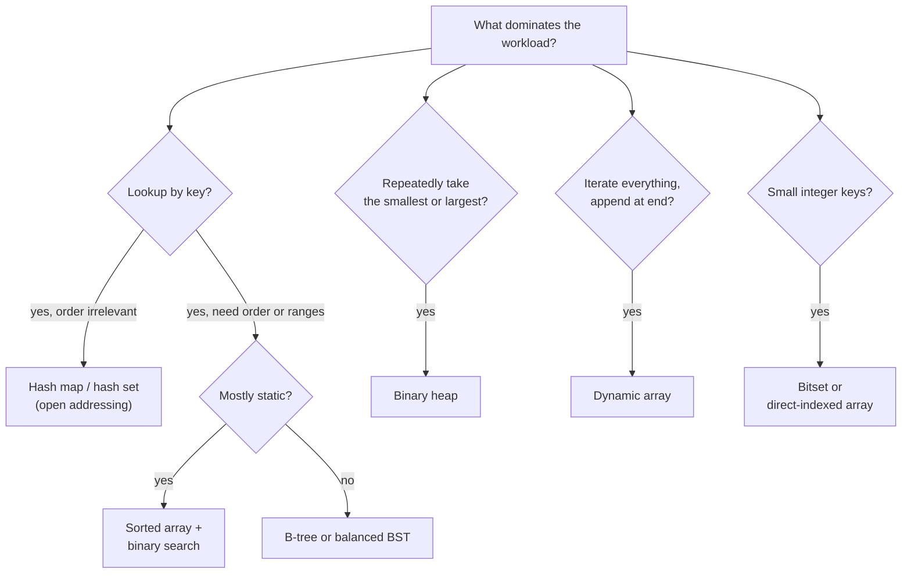
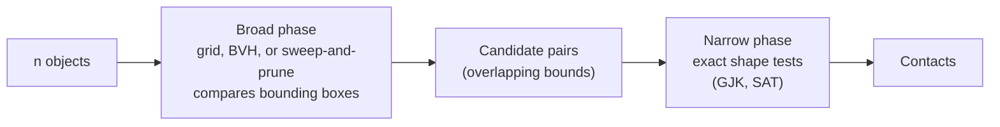
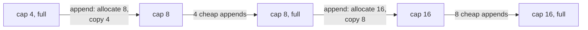

# Algorithmic Optimization

[Performance Optimization](./) &raquo; Algorithmic Optimization

The most valuable optimization is usually a better algorithm, not a faster line of code. Replacing an $O(n^2)$ pass with an $O(n \log n)$ one turns a million-element job from roughly $10^{12}$ operations into about $2 \times 10^7$, a gap no amount of constant-factor tuning can close. This page covers complexity analysis as it plays out on real hardware, choosing data structures by their operation profile, spatial partitioning, caching and memoization, probabilistic data structures, and amortized analysis. Constant-factor and hardware-level work that comes after the algorithm is right is covered in [CPU Optimization](./cpu-optimization.html) and [Memory Optimization](./memory-optimization.html); the theory behind complexity classes is in [Complexity Theory](../advanced/complexity-theory/).

## Complexity Analysis in Practice

### Why Growth Rate Dominates

Asymptotic complexity describes how cost grows with input size $n$, ignoring constant factors and lower-order terms. It predicts which algorithm wins as the problem scales, and production inputs nearly always grow.

| $n$ | $\log_2 n$ | $n$ | $n \log_2 n$ | $n^2$ | $2^n$ |
|------|----------|------|------------|--------|--------|
| 16 | 4 | 16 | 64 | 256 | 65,536 |
| 1,024 | 10 | 1,024 | ~10,240 | ~$1.05 \times 10^6$ | ~$1.8 \times 10^{308}$ |
| $10^6$ | ~20 | $10^6$ | ~$2 \times 10^7$ | $10^{12}$ | astronomically large |

At roughly $10^9$ simple operations per second per core, the $n \log n$ column for a million items is about 20 ms; the $n^2$ column is about 17 minutes. A 2x constant-factor improvement to the quadratic version still leaves it more than four orders of magnitude behind. **Fix the complexity class before tuning constants.**

Common upgrades, usually spotted as hot spots in a profile:

| Operation | Naive | Better | Notes |
|-----------|-------|--------|-------|
| Lookup by key | $O(n)$ linear scan | $O(1)$ average hash table | Or $O(\log n)$ binary search on a sorted array |
| Sort | $O(n^2)$ insertion/bubble | $O(n \log n)$ comparison sort | Radix sort is $O(n \cdot w)$ for $w$-digit fixed-width keys |
| Repeated membership test | $O(n)$ per query | $O(1)$ hash set, or a Bloom filter when approximate is acceptable | |
| Nearest neighbor (low dimensions) | $O(n)$ per query | ~$O(\log n)$ k-d tree, BVH, or grid | Tree methods degrade toward $O(n)$ as dimensions grow |
| Nearest neighbor (high dimensions) | $O(n d)$ brute force | Approximate search (HNSW, IVF) | Trades exact recall for sub-linear queries |
| Shortest path (non-negative weights) | Repeated relaxation, $O(VE)$ (Bellman-Ford) | $O((V + E) \log V)$ Dijkstra with a binary heap | A* adds a heuristic that usually explores far fewer nodes |
| Collision detection | $O(n^2)$ all pairs | ~$O(n \log n)$ broad phase | See [Spatial Data Structures](#spatial-data-structures) |
| Range sum/min over a changing array | $O(n)$ per query | $O(\log n)$ Fenwick or segment tree | Prefix sums give $O(1)$ if the array is static |
| Top-$k$ of $n$ | $O(n \log n)$ full sort | $O(n \log k)$ bounded heap, or $O(n)$ average selection | `std::partial_sort`, `std::nth_element`, `heapq.nlargest` |

### When Big O Misleads

Asymptotics are necessary but not sufficient. Three effects decide whether the theoretically faster algorithm wins on real hardware.

1. **Small $n$ favors simple algorithms.** Insertion sort beats quicksort on arrays of a few dozen elements because its inner loop is tiny and branch- and cache-friendly. Production sorts are hybrids for exactly this reason: `std::sort` implementations use introsort or pattern-defeating quicksort (pdqsort) with an insertion-sort cutoff; Python's list sort is a merge-based adaptive sort (Timsort, with the Powersort merge policy since Python 3.11); Rust's standard library switched to the driftsort and ipnsort hybrids in Rust 1.81.
2. **Memory access is a hidden constant.** Big O counts operations, not cache misses. A miss to main memory costs on the order of 100 ns, hundreds of cycles, so a linear scan of a contiguous array can outrun a pointer-chasing tree or linked list for surprisingly large $n$. See [Memory Optimization](./memory-optimization.html).
3. **Average, amortized, and worst case are different guarantees.** A hash insert that is $O(1)$ amortized can stall for $O(n)$ during a resize, and a hash lookup that is $O(1)$ on average can be $O(n)$ under adversarial keys. Which bound matters depends on whether you care about throughput or tail latency (see [Amortized Analysis](#amortized-analysis)).

The practical rule: use complexity analysis to pick the candidates, then benchmark them on realistic data sizes and distributions.

### Worked Example: Removing a Nested Search

A frequent accidental $O(n \cdot m)$ pattern is "for each item, search a list for its match":

```cpp
// O(n * m): for each event, linearly search for its handler
for (const Event& e : events) {            // n events
    for (Handler& h : handlers) {          // m handlers
        if (h.id == e.target_id) { h.process(e); break; }
    }
}
```

Building an index once makes each lookup $O(1)$ on average and the whole pass $O(n + m)$:

```cpp
// O(n + m): index handlers by id once, then look up directly
std::unordered_map<Id, Handler*> by_id;
by_id.reserve(handlers.size());            // avoid rehashing while building
for (Handler& h : handlers) by_id.emplace(h.id, &h);

for (const Event& e : events) {
    if (auto it = by_id.find(e.target_id); it != by_id.end())
        it->second->process(e);
}
```

The same pattern hides in SQL (a query per row, the "N+1 queries" problem), in nested list comprehensions, and in `list.index()` or `x in list` inside a loop. **When a search sits inside a loop, ask whether the searched collection can be indexed first**: a hash map, a sorted array for binary search, or a spatial structure.

## Choosing Data Structures

A data structure is a contract over operations and their costs, so choosing one is often the entire optimization. Start from the access pattern: mostly lookups by key, in-order iteration, range queries, repeated extraction of the minimum, or inserts and removals in the middle?

| Structure | Lookup | Insert | Delete | Ordered | Typical use |
|-----------|--------|--------|--------|---------|-------------|
| Dynamic array (`std::vector`, `Vec`, `list`) | $O(1)$ by index, $O(n)$ by value | $O(1)$ amortized at end | $O(n)$ in middle | If kept sorted | Default choice; best locality |
| Sorted array + binary search | $O(\log n)$ | $O(n)$ | $O(n)$ | Yes | Build once, query many times |
| Open-addressing hash map (Swiss table) | $O(1)$ avg | $O(1)$ amortized | $O(1)$ avg | No | General key lookup |
| Node-based hash map (`std::unordered_map`) | $O(1)$ avg | $O(1)$ amortized | $O(1)$ avg | No | When stable element addresses are required |
| Balanced BST (`std::map`, `TreeMap`) | $O(\log n)$ | $O(\log n)$ | $O(\log n)$ | Yes | Ordered data with frequent updates |
| B-tree / B+ tree (`BTreeMap`, database indexes) | $O(\log n)$ | $O(\log n)$ | $O(\log n)$ | Yes | Ordered data; cache- and page-friendly |
| Binary heap | $O(1)$ peek min | $O(\log n)$ | $O(\log n)$ pop min | No | Priority queues, schedulers, Dijkstra/A* frontier |
| Linked list | $O(n)$ | $O(1)$ at a known node | $O(1)$ at a known node | Insertion order | Intrusive lists, splicing; rarely otherwise |
| Bitset | $O(1)$ | $O(1)$ | $O(1)$ | Yes | Dense sets of small integers |



### Heuristics

- **Default to a contiguous array.** Its locality wins so often that a node-based structure needs a reason. Linear search over a small packed array frequently beats a tree or even a hash map.
- **Prefer open-addressing hash tables for lookups.** "Swiss table" designs (Abseil `flat_hash_map`, `boost::unordered_flat_map`, Rust's standard `HashMap`, which is built on hashbrown) store entries inline and probe groups of control bytes with SIMD, and are typically several times faster than node-based `std::unordered_map`. The standard container's API requires stable element addresses, which forces a node per element.
- **Reserve capacity when the size is known** (`reserve(n)`, `with_capacity(n)`) to avoid repeated rehashing or reallocation.
- **Use ordered structures only when you need order.** For build-once, query-many data, a sorted vector with `std::lower_bound` beats `std::map` because it stays contiguous. For ordered data under frequent updates, B-trees generally beat red-black trees in memory because each node holds many keys and fills whole cache lines.
- **Mind adversarial input.** Hash tables keyed by untrusted data need a keyed or randomized hash (SipHash in Rust and Python) to resist collision-flooding denial of service.
- **Match the structure to the storage tier.** On disk or SSD, cost is counted in page reads, which is why [databases](../technology/database-design/) index with B+ trees and LSM trees rather than hash maps or binary trees.

### The Cost of Indirection

Two structures with identical Big O can differ by an order of magnitude in wall-clock time. `std::map` and a sorted `std::vector` are both $O(\log n)$ for lookup, but the map follows a pointer to a separately allocated node at every level, often missing cache each time, while binary search over the vector touches one contiguous block. When asymptotics tie, **prefer the structure with better locality**. This is the bridge from algorithmic work into data-oriented design ([CPU Optimization](./cpu-optimization.html#data-oriented-design-aos-vs-soa)).

## Spatial Data Structures

Many performance problems reduce to "find the objects near a point or region": collision detection, view-frustum culling, ray casting, nearest-neighbor queries, AI perception. Done naively this is $O(n)$ per query, or $O(n^2)$ to test every pair. Spatial structures partition space so that a query examines only nearby candidates.

| Structure | Build | Handles | Strengths | Typical use |
|-----------|-------|---------|-----------|-------------|
| Uniform grid / spatial hash | $O(n)$, cheap to rebuild every frame | Similar-sized, evenly spread objects | Simplest; constant-time cell lookup | Particles, crowds, tile games |
| Quadtree / octree | $O(n \log n)$ | Uneven density | Adapts depth to detail | Static or slowly changing worlds |
| Loose octree | $O(n \log n)$ | Moving objects that straddle cells | Objects need not be split across cells | Dynamic scenes |
| BVH (bounding volume hierarchy) | $O(n \log n)$; can be refit in $O(n)$ | Arbitrary objects | Excellent ray and query pruning | Ray tracing, physics broad phase |
| k-d tree | $O(n \log n)$ | Points | Exact nearest neighbor in low dimensions | Point clouds, low-dimensional search |
| R-tree | $O(n \log n)$ | Rectangles, polygons | Disk-friendly, balanced | Spatial databases (PostGIS), GIS |
| BSP tree | Expensive, offline | Static polygons | Exact visibility ordering | Classic level geometry |

### Broad Phase and Narrow Phase

Collision detection uses spatial structures in two stages instead of testing all $\binom{n}{2}$ pairs:



The broad phase cheaply discards pairs whose bounding volumes cannot touch, cutting the work to roughly $O(n \log n)$ (or near $O(n)$ with a well-tuned grid); the expensive exact tests run only on the few candidate pairs that remain.

### Uniform Spatial Hashing

For evenly distributed, similarly sized objects, a spatial hash is the simplest fast option. Each position maps to an integer cell; cells live in a hash map; a neighbor query inspects the object's cell and its 8 (2D) or 26 (3D) neighbors.

```cpp
#include <cmath>
#include <cstdint>
#include <unordered_map>
#include <vector>

struct CellKey {
    int32_t x, y, z;
    bool operator==(const CellKey&) const = default;   // C++20
};

struct CellHash {
    size_t operator()(const CellKey& k) const noexcept {
        // Multiply in unsigned arithmetic: signed overflow would be undefined behavior.
        uint64_t h = uint64_t(uint32_t(k.x)) * 73856093u
                   ^ uint64_t(uint32_t(k.y)) * 19349663u
                   ^ uint64_t(uint32_t(k.z)) * 83492791u;
        return size_t(h);
    }
};

class SpatialHash {
    float cell_size_;
    std::unordered_map<CellKey, std::vector<Object*>, CellHash> cells_;

    CellKey key_of(const Vector3& p) const {
        return { int32_t(std::floor(p.x / cell_size_)),
                 int32_t(std::floor(p.y / cell_size_)),
                 int32_t(std::floor(p.z / cell_size_)) };
    }

public:
    explicit SpatialHash(float cell_size) : cell_size_(cell_size) {}

    void clear() { cells_.clear(); }                    // rebuild each frame
    void insert(Object* o) { cells_[key_of(o->position)].push_back(o); }

    // Append candidates from the object's cell and its 26 neighbors to `out`.
    void query_neighbors(const Vector3& p, std::vector<Object*>& out) const {
        const CellKey c = key_of(p);
        for (int dz = -1; dz <= 1; ++dz)
        for (int dy = -1; dy <= 1; ++dy)
        for (int dx = -1; dx <= 1; ++dx)
            if (auto it = cells_.find({c.x + dx, c.y + dy, c.z + dz}); it != cells_.end())
                out.insert(out.end(), it->second.begin(), it->second.end());
    }
};
```

`cell_size` is the tuning knob. Too large and each cell holds many objects, sliding back toward $O(n^2)$; too small and objects span many cells and queries touch many empty ones. Start near the diameter of a typical object. Passing the output vector in by reference lets callers reuse its allocation across queries.

### Hierarchical Structures

When density is uneven, with clusters of detail in mostly empty space, a flat grid wastes memory on empty cells or overloads dense ones. Hierarchies adapt:

- **Quadtrees and octrees** subdivide a square or cube into four or eight children only where objects exist, giving roughly $O(\log n)$ depth in reasonably balanced scenes.
- **BVHs** wrap objects in nested bounding boxes forming a tree. A ray or query descends only into boxes it intersects, pruning whole subtrees. BVHs are the acceleration structure behind hardware ray tracing (the DXR and Vulkan ray-tracing APIs build them for you), and they can be **refit** cheaply (recompute bounds bottom-up without restructuring) when objects move a little. See [3D Graphics and Rendering](../graphics/3d-rendering.html).

The common idea: turn a global "test everything" into a local "test only what is nearby" by exploiting spatial coherence.

### High-Dimensional Search

Space-partitioning trees stop helping as dimensionality grows: beyond a few dozen dimensions nearly every partition must be visited (the curse of dimensionality). Similarity search over embeddings, which have hundreds or thousands of dimensions, therefore uses **approximate nearest neighbor** (ANN) indexes. **HNSW** (hierarchical navigable small-world graphs) and **IVF** (inverted file with clustering, often combined with product quantization) answer queries in sub-linear time at a recall below 100%, tunable against speed and memory. Libraries such as FAISS and the vector indexes built into PostgreSQL (pgvector) and search engines implement these.

## Caching and Memoization

When the same expensive computation recurs with the same inputs, store the result and return it next time. This trades memory for time, and it is most effective when the function is **pure** (its output depends only on its inputs) and recomputation is expensive relative to a lookup.

### Memoizing a Pure Function

```cpp
class ExpensiveComputation {
    mutable std::unordered_map<Key, Result, KeyHash> cache_;

public:
    const Result& compute(const Key& key) const {
        if (auto it = cache_.find(key); it != cache_.end())
            return it->second;                       // hit: O(1) average
        auto [it, _] = cache_.emplace(key, expensive_calculation(key));
        return it->second;                           // miss: full cost, once
    }

    void invalidate() { cache_.clear(); }
};
```

This version is not thread-safe; a cache shared between threads needs a lock, sharding, or a concurrent map. Most languages ship a memoization helper: `functools.cache` and `functools.lru_cache` in Python, `computeIfAbsent` on a Java `ConcurrentHashMap`, `useMemo` in React.

### Memoization and Dynamic Programming

Memoization is the top-down form of dynamic programming. A recursive solution that recomputes overlapping subproblems becomes polynomial once each subproblem is cached. Fibonacci shows the effect: naive recursion makes $O(\varphi^n)$ calls (with $\varphi \approx 1.618$), memoized recursion makes $O(n)$.

$$
F(n) = F(n-1) + F(n-2), \qquad F(0) = 0, \quad F(1) = 1
$$

```cpp
#include <cstdint>
#include <vector>

// memo must have size n + 1, initialized to -1
int64_t fib(int n, std::vector<int64_t>& memo) {
    if (n < 2) return n;
    if (memo[n] != -1) return memo[n];
    return memo[n] = fib(n - 1, memo) + fib(n - 2, memo);
}
```

The bottom-up form fills a table in dependency order and avoids recursion depth limits; when each state depends only on the previous few, the table shrinks to a few variables (Fibonacci needs two). The same move, identifying overlapping subproblems and caching them, turns exponential search into polynomial time for edit distance, sequence alignment, knapsack with integer weights, and shortest paths in DAGs.

### Invalidation and Eviction

The two hard parts of caching are deciding when a stored result stops being valid and what to discard when the cache is full.

- **Invalidation.** A cached result is correct only while its inputs are unchanged. Pure functions of immutable inputs never need invalidation; caches over mutable state must be cleared, versioned, or given a time-to-live. Stale-cache bugs are notorious because the wrong answer arrives quickly and silently.
- **Eviction.** An unbounded cache is a memory leak. Bounded caches evict under a policy:

| Policy | Evicts | Good for | Weakness |
|--------|--------|----------|----------|
| LRU | Least recently used | Temporal locality | A single large scan flushes the whole cache |
| LFU | Least frequently used | Persistently hot keys | Slow to adapt; needs frequency aging |
| FIFO / random | Oldest or random entry | Very cheap bookkeeping | Ignores access pattern |
| W-TinyLFU (Caffeine) | Admits new entries only if estimated to be hotter than the victim | Mixed workloads | More complex |
| S3-FIFO, SIEVE | FIFO queues with a small probationary queue or a "visited" bit | Web and CDN caches with many one-hit keys | Newer; less tooling |

Measure hit rate on real traces; the best policy is workload-specific.

### Caching Across the Stack

The same principle recurs at every scale: CPU caches hold recently used memory lines, operating systems keep a page cache, [databases](../technology/database-design/) cache pages and query plans, CDNs and HTTP caches hold responses, and applications memoize functions. Each level keeps a small, fast copy of data whose authoritative home is larger and slower.

## Probabilistic Data Structures

When an exact answer is unnecessary, a probabilistic structure can answer in constant time and a small, fixed amount of memory, with a bounded error.

| Structure | Answers | Error | Memory |
|-----------|---------|-------|--------|
| **Bloom filter** | "Is $x$ in the set?" | False positives possible, no false negatives | ~9.6 bits per element at 1% false-positive rate |
| **Cuckoo / xor filter** | Membership, like Bloom | Same one-sided error; cuckoo filters support deletion | Often smaller than Bloom at low error rates |
| **HyperLogLog** | "How many distinct items?" | Relative standard error $\approx 1.04/\sqrt{m}$ for $m$ registers | ~12 KB estimates billions of distinct items to within ~1% |
| **Count-Min sketch** | "How often has $x$ appeared?" | Overestimates only, by a bounded amount | Fixed, independent of stream length |

A Bloom filter with $m$ bits, $k$ hash functions, and $n$ inserted elements has false-positive probability

$$
p \approx \left(1 - e^{-kn/m}\right)^{k},
$$

minimized at $k = (m/n) \ln 2$, which gives $m/n = -\ln p / (\ln 2)^2$ bits per element. The typical use is a cheap pre-check in front of an expensive lookup: LSM-tree databases (RocksDB, Cassandra) keep a Bloom filter per file so most reads for absent keys never touch disk.

## Amortized Analysis

Some operations are usually cheap and occasionally expensive. **Amortized analysis** bounds the average cost per operation over any sequence of operations, showing that the rare expensive step is paid for by the many cheap ones. Unlike average-case analysis it makes no assumption about input distribution.

### Dynamic Array Growth

Appending to a dynamic array usually writes to the next free slot in $O(1)$. When the array is full, it allocates a larger buffer and copies every element, an $O(n)$ step. Growing the capacity by a constant **factor** keeps the total cost linear. With doubling, starting at capacity 1 and appending $n = 2^j$ elements, the copies across all resizes total

$$
1 + 2 + 4 + \cdots + 2^{j-1} = 2^{j} - 1 = n - 1 = O(n),
$$

so each append costs $O(1)$ amortized. Growing by a constant *amount* $c$ instead makes the total $c + 2c + 3c + \cdots = O(n^2/c)$, or $O(n)$ per append. Real implementations use factors between 1.5 (MSVC, folly) and 2 (libstdc++, libc++); smaller factors waste less memory and can reuse freed blocks. Calling `reserve()` when the final size is known removes all intermediate copies.



Each resize copies as many elements as there were cheap appends since the previous resize, which is why the copying cost averages out to a constant per append.

### Throughput Versus Latency

Amortized $O(1)$ is a statement about throughput. It says nothing about a single operation's latency: the append that triggers a resize still takes $O(n)$. That is invisible in a server's mean request time but can blow a 16.7 ms frame budget in a game or a deadline in a real-time controller. Hash-table rehashing and garbage-collection pauses have the same shape.

The defenses:

- **Pre-size** structures when the final size is known, so growth never happens on the hot path.
- **Do the expensive work deliberately**: during a loading screen, at idle, or spread incrementally across frames. Some hash tables and garbage collectors resize or collect incrementally for this reason.
- **Use worst-case-bounded structures** on hard real-time paths: fixed-capacity pools, ring buffers, and arena allocators never resize. See [Memory Optimization](./memory-optimization.html#allocation-strategies).

### Proof Techniques

Amortized bounds are proved in one of three equivalent ways:

1. **Aggregate method.** Bound the total cost of $n$ operations, then divide by $n$ (the doubling sum above).
2. **Accounting (banker's) method.** Charge each cheap operation a small surplus that prepays future expensive ones. If the stored credit never goes negative, the charge is a valid amortized bound. For doubling arrays, charging 3 per append suffices: 1 for the write, 2 banked toward future copies.
3. **Potential method.** Define a potential $\Phi \ge 0$ on the data structure's state, with $\Phi_0 = 0$. The amortized cost of operation $i$ is $\hat{c}_i = c_i + \Phi_i - \Phi_{i-1}$, and summing gives $\sum_i \hat{c}_i \ge \sum_i c_i$. For doubling arrays, $\Phi = 2 \cdot \text{size} - \text{capacity}$ (floored at 0) works.

You rarely write these proofs in practice, but knowing whether a structure's guarantee is worst-case, average, or amortized is what lets you choose correctly between throughput-bound and latency-bound code.

## See Also

- [Performance Optimization Hub](./): the optimization section index and process
- [CPU Optimization](./cpu-optimization.html): profiling, cache-aware layout, SIMD, and threading that make a good algorithm fast
- [Memory Optimization](./memory-optimization.html): the memory hierarchy and allocators behind the hidden constants
- [Profiling tools](./cpu-optimization.html#profiling-tools): measure before optimizing so you target the algorithm that actually dominates
- [Complexity Theory](../advanced/complexity-theory/) and [Approximation Algorithms](../advanced/approximation-algorithms/): the theory of what can be computed efficiently, and what to do when it cannot
- [Database Design](../technology/database-design/): B-tree and LSM indexes, query planning, and page caching
- [3D Graphics and Rendering](../graphics/3d-rendering.html): BVHs and spatial structures in culling and ray tracing
