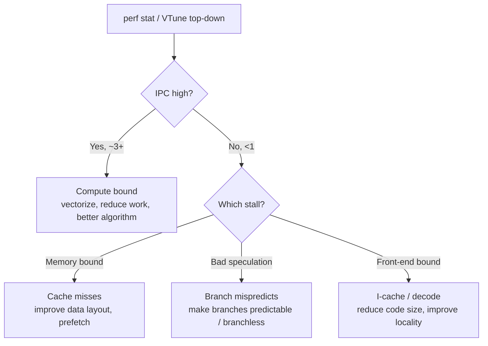

<div class="hero-section" style="background: linear-gradient(135deg, #667eea 0%, #764ba2 100%); color: white; padding: 3rem 2rem; margin: -2rem -3rem 2rem -3rem; text-align: center;">
  <h1 style="color: white; margin: 0; font-size: 2.5rem;">CPU Profiling & Tuning</h1>
  <p style="font-size: 1.25rem; margin-top: 1rem; opacity: 0.9;">Profile hot paths, respect the cache hierarchy, vectorize the inner loop, and scale across cores without false sharing</p>
</div>

[Performance Optimization](./) &raquo; CPU Profiling & Tuning

<div class="hub-intro">
  <p class="lead">Modern CPUs are starved for data, not for arithmetic. The single biggest lever on most workloads is keeping the right bytes in cache, feeding the pipeline straight-line work it can predict, and spreading independent work across cores without making them fight over the same cache lines. This page covers how to find the hot path with a profiler, then how to make it faster.</p>
</div>

CPU optimization is the systematic process of reducing the wall-clock time spent executing code on the processor. It begins with measurement — a profiler tells you where time actually goes, which is almost never where intuition says — and proceeds through a hierarchy of fixes: better algorithms first, then cache-friendly data layout, then vectorization and branch-friendly control flow, and finally parallelism across cores. Each of those fixes targets a specific hardware bottleneck, and the only reliable way to know which one you have is to profile.

## Profiling Tools

You cannot optimize what you have not measured. Always profile a **Release/optimized build** on a **representative, worst-case workload**, and collect multiple runs to average out noise. Debug builds disable inlining and optimization and will point you at the wrong hot spots.

**Platform Profilers:**
- **Visual Studio Profiler**: Windows CPU/memory analysis with sampling and instrumentation modes
- **Instruments**: macOS/iOS profiling suite (Time Profiler, System Trace)
- **perf**: Linux performance counters and sampling profiler
- **VTune**: Intel CPU deep analysis (microarchitecture, memory access, threading)
- **Superluminal**: Low-overhead sampling profiler for Windows

**In-Engine:**
- Unreal Insights
- Unity Profiler
- Custom timing systems (scoped timers writing to a frame trace)

### Sampling vs Instrumentation

There are two fundamentally different ways to profile, and they answer different questions:

| Approach | How it works | Strengths | Weaknesses |
|----------|-------------|-----------|------------|
| **Sampling** | Periodically interrupt the program and record the call stack | Very low overhead; profiles release builds unchanged; reveals where wall-clock time actually goes | Statistical — rare functions may be missed; no exact call counts |
| **Instrumentation** | Insert enter/exit hooks around functions or scopes | Exact call counts and per-call timing | High overhead; can distort the very behavior being measured (especially tiny hot functions) |

For finding *where* time goes, start with a sampling profiler. Reach for instrumentation only when you need exact counts for a specific suspect.

### Using `perf` on Linux

`perf` is the workhorse Linux profiler. It samples hardware performance counters with negligible overhead and needs no special build (though `-fno-omit-frame-pointer` or DWARF unwinding improves stacks).

```bash
# Record a sampling profile (call graphs via DWARF unwinding)
perf record -g --call-graph dwarf ./my_app --workload=stress

# Interactive report: hot functions, expand to see callers/callees
perf report

# Flat top-down view, refreshed live, like 'top' for functions
perf top

# Count specific hardware events for the whole run
perf stat -e cycles,instructions,cache-references,cache-misses,branches,branch-misses ./my_app
```

The `perf stat` output is the fastest way to classify a bottleneck. Two derived ratios matter most:

$$\text{IPC} = \frac{\text{instructions}}{\text{cycles}}$$

A modern core can retire ~3-4 instructions per cycle. An IPC below ~1.0 means the core is stalling — usually on memory or mispredicted branches — and raw "do less math" optimizations will not help. The miss rate

$$\text{branch miss rate} = \frac{\text{branch-misses}}{\text{branches}}$$

flags branch-prediction problems; anything above a few percent on a hot loop is worth investigating.

### Flame Graphs

A flame graph collapses thousands of sampled stacks into a single picture: width is time spent, the y-axis is call depth. The widest plateaus near the top are your hot leaf functions — the place to start.

```bash
# Record, then fold stacks and render an interactive SVG
perf record -g ./my_app
perf script | stackcollapse-perf.pl | flamegraph.pl > profile.svg
```

### VTune for Microarchitectural Analysis

When `perf stat` shows low IPC but you cannot tell *why*, Intel VTune's **Microarchitecture Exploration** (top-down analysis) attributes every stalled cycle to a category: front-end bound (instruction fetch/decode), back-end bound (split into core-bound and memory-bound), bad speculation (branch mispredicts), or retiring (useful work). This top-down breakdown tells you whether to chase cache misses, branch prediction, or instruction-level parallelism before you change any code.



## Cache Optimization

Understanding the CPU cache hierarchy is the foundation of CPU performance. Each level up is roughly an order of magnitude slower:

```
CPU Core
├── L1 Cache: 32-64 KB, ~4 cycles
├── L2 Cache: 256-512 KB, ~12 cycles
├── L3 Cache: 8-32 MB, ~40 cycles
└── Main Memory: GBs, ~200 cycles

Cache Line: 64 bytes (typical)
```

The decisive number is the ~200-cycle cost of a main-memory access versus ~4 cycles for L1. In those 200 cycles a core could have retired several hundred instructions. This is why **memory access patterns dominate performance** on data-heavy workloads — a single cache miss can erase the savings from dozens of arithmetic optimizations.

Two properties govern whether your accesses hit cache:

- **Spatial locality** — when you touch a byte, the CPU loads the whole surrounding 64-byte cache line. Accessing data that lives next to data you just used is effectively free. Sequential array traversal is the ideal pattern; the hardware prefetcher even reads ahead for you.
- **Temporal locality** — recently accessed data stays in cache. Reusing it soon is cheap; revisiting it after walking gigabytes is a guaranteed miss.

### Data-Oriented Design: AoS vs SoA

The classic cache pitfall is the **Array of Structures (AoS)** layout, where hot and cold fields are interleaved. Iterating over one hot field drags every cold field through cache with it, wasting most of every cache line you load.

```cpp
// Cache-unfriendly (Array of Structures)
struct Entity {
    Vector3 position;    // Used every frame
    Vector3 velocity;    // Used every frame
    String name;         // Rarely used
    Texture* icon;       // Rarely used
    float health;        // Used every frame
    // ... more fields
};
Entity entities[1000];

// Cache-friendly (Structure of Arrays)
struct EntityData {
    Vector3 positions[1000];   // Contiguous hot data
    Vector3 velocities[1000];  // Contiguous hot data
    float healths[1000];       // Contiguous hot data
};
struct EntityMetadata {
    String names[1000];        // Separate cold data
    Texture* icons[1000];
};
```

With **Structure of Arrays (SoA)**, an integration loop that reads `positions` and `velocities` walks two tight, contiguous streams. Every byte pulled into cache is used, the prefetcher tracks both streams perfectly, and — as the next section shows — the compiler can vectorize the loop because the data is laid out the way SIMD wants it.

### Quantifying the Win

For a physics step that touches only `position`, `velocity`, and `health` (28 bytes of a, say, 96-byte AoS struct), the AoS layout transfers ~3.4× more memory than SoA. On a memory-bound loop that translates almost directly into a ~3× speedup — without changing a single arithmetic operation. This is the single most reliable CPU optimization in data-heavy code.

### Other Cache Techniques

- **Hot/cold splitting** — keep rarely-touched fields (debug names, serialization metadata) in a separate, parallel array so they never pollute the hot cache lines.
- **Blocking/tiling** — for nested loops over large matrices, process the data in cache-sized tiles so each block is reused before it is evicted. This turns an O(n) memory-traffic-per-element loop into one that touches main memory once per tile.
- **Prefetching** — when an access pattern is predictable but not sequential (e.g. pointer-chasing through a known list), software prefetch hints (`__builtin_prefetch`, `_mm_prefetch`) can fetch the next element while the current one is being processed. Use sparingly and measure; the hardware prefetcher already handles sequential streams.

## SIMD and Vectorization

A SIMD (Single Instruction, Multiple Data) instruction applies one operation to several values at once. On x86, SSE registers hold 4 floats, AVX holds 8, and AVX-512 holds 16; ARM NEON holds 4. A loop that does the same arithmetic on every element of an array is the perfect candidate — the inner body is replicated across lanes and the trip count drops by the lane width.

### Auto-Vectorization

The compiler will vectorize many loops automatically given `-O2`/`-O3` (`/O2` on MSVC), *if* you let it. Vectorization fails when the compiler cannot prove the loop is safe to transform:

- **Aliasing** — if two pointers might overlap, the compiler must assume writes through one affect reads through the other. Mark non-overlapping pointers `__restrict` (or `restrict` in C) to unlock vectorization.
- **Loop-carried dependencies** — when iteration `i+1` needs the result of iteration `i`, lanes cannot run independently.
- **Branches and function calls** in the loop body block or complicate vectorization.
- **Non-unit strides / gather-scatter** — vectorization is far more effective on contiguous (SoA) data than on strided AoS access.

```cpp
// __restrict promises a, b, out do not overlap -> compiler can vectorize freely
void add_scaled(float* __restrict out,
                const float* __restrict a,
                const float* __restrict b,
                float k, int n) {
    for (int i = 0; i < n; ++i)
        out[i] = a[i] + k * b[i];   // one fused multiply-add per lane
}
```

Ask the compiler to report what it did so you are not guessing:

```bash
# GCC: explain which loops vectorized and why others didn't
g++ -O3 -march=native -fopt-info-vec-missed add.cpp

# Clang: emit vectorization remarks
clang++ -O3 -march=native -Rpass=loop-vectorize -Rpass-missed=loop-vectorize add.cpp
```

Note `-march=native` (or a specific `-mavx2`): without telling the compiler the target supports wide vectors, it conservatively emits only the baseline instruction set.

### Intrinsics

When the compiler cannot auto-vectorize — or you need a specific shuffle/reduction it will not find — drop to intrinsics, which map almost one-to-one to machine instructions while letting the compiler handle register allocation.

```cpp
#include <immintrin.h>
// Sum an array of floats using AVX (8 lanes), then reduce the partial sums
float sum_avx(const float* data, int n) {
    __m256 acc = _mm256_setzero_ps();
    int i = 0;
    for (; i + 8 <= n; i += 8) {
        __m256 v = _mm256_loadu_ps(data + i);   // load 8 floats
        acc = _mm256_add_ps(acc, v);            // 8 adds in one instruction
    }
    // Horizontal reduce the 8 partial sums to one scalar
    float partial[8];
    _mm256_storeu_ps(partial, acc);
    float total = 0.0f;
    for (int j = 0; j < 8; ++j) total += partial[j];
    for (; i < n; ++i) total += data[i];        // scalar tail
    return total;
}
```

Intrinsics are powerful but non-portable and easy to get wrong. Prefer auto-vectorization first, verify with `-fopt-info-vec`, and reach for intrinsics only on a profiled hot loop. Libraries such as `std::experimental::simd`, Google Highway, or `xsimd` offer portable wrappers that target multiple instruction sets from one source.

## Branch Prediction

Modern CPUs have deep pipelines (15-20+ stages) and execute speculatively: at every conditional branch the branch predictor guesses the outcome and the pipeline races ahead. A correct guess is free. A **misprediction** flushes the in-flight pipeline and costs ~15-20 cycles — comparable to several L2 cache misses.

Predictors are extremely good at *regular* patterns (always-taken, never-taken, simple loops). They struggle with **data-dependent, unpredictable** branches — for example, a comparison against random data inside a hot loop.

### Sorting to Make Branches Predictable

A famous example: summing the elements of an array that exceed a threshold is dramatically faster if the array is sorted first, because the branch then becomes a long run of not-taken followed by a long run of taken — perfectly predictable — instead of coin-flip random.

```cpp
long sum_above(const int* data, int n) {
    long sum = 0;
    for (int i = 0; i < n; ++i)
        if (data[i] >= 128)   // unpredictable on random data -> mispredicts
            sum += data[i];
    return sum;
}
// Sorting `data` first can make this loop several times faster,
// purely by making the branch predictable.
```

### Branchless Code

When a branch is inherently unpredictable, removing it entirely can win. Replace control flow with arithmetic or data-flow the CPU does not have to predict:

```cpp
// Branchy: clamp to [0, hi]
int clamp_branchy(int x, int hi) {
    if (x < 0) return 0;
    if (x > hi) return hi;
    return x;
}

// Branchless: compiles to conditional-move / min-max, no prediction needed
int clamp_branchless(int x, int hi) {
    x = x > 0 ? x : 0;       // typically a CMOV / max
    return x < hi ? x : hi;  // typically a CMOV / min
}
```

Other branchless tools: `select`/conditional-move via the ternary operator, bit-twiddling (`mask = -(cond)` then `a ^ ((a ^ b) & mask)`), and predication in SIMD (compute both sides, blend with a mask). Caveat: branchless code does *more* work unconditionally. It only wins when the branch was both **hot** and **unpredictable**; for predictable branches, leave the branch in. Use likelihood hints (`[[likely]]`/`[[unlikely]]`, `__builtin_expect`) to steer the compiler when one side dominates.

## Multithreading

Once a single core is saturated, the next axis is parallelism across cores. The goal is to split independent work into tasks that run concurrently and recombine the results.

### Task-Based Systems

A **job system** is the standard pattern: worker threads pull jobs from a queue, and a counter tracks completion so dependent work can wait on it. This scales to whatever core count is available without hardcoding thread counts.

```cpp
// Job system pattern
struct Job {
    void (*function)(void* data);
    void* data;
    atomic<int>* counter;
};

void worker_thread() {
    while (running) {
        Job job = job_queue.pop();
        job.function(job.data);
        job.counter->fetch_sub(1);
    }
}

// Usage
void parallel_update(Entity* entities, int count) {
    atomic<int> counter = 0;
    int batch_size = count / num_workers;

    for (int i = 0; i < num_workers; i++) {
        submit_job(update_batch, &entities[i * batch_size], &counter);
    }

    wait_for_counter(&counter, 0);
}
```

**Common Patterns:**
- **Fork-join** for parallel loops (split a range, process in parallel, join)
- **Producer-consumer** for pipelines (stages hand work to the next stage via a queue)
- **Thread pools** for task scheduling (fixed worker set, dynamic work)
- **Lock-free data structures** for high contention (atomics and CAS instead of mutexes)

### Amdahl's Law

Parallelism has a hard ceiling. If a fraction *p* of the work is parallelizable and *(1 − p)* is inherently serial, the maximum speedup on *N* cores is

$$S(N) = \frac{1}{(1 - p) + \dfrac{p}{N}}$$

As *N* grows, *S* approaches *1/(1 − p)*. A workload that is 90% parallel can never exceed a 10× speedup no matter how many cores you throw at it. The lesson: attack the serial fraction (and per-task overhead) before adding cores, and never expect linear scaling.

### False Sharing

The subtlest multithreading bug is not a race — it is **false sharing**, a silent performance killer. Cache coherency operates at cache-line granularity (64 bytes), not per variable. When two threads write to *different* variables that happen to share the same cache line, every write invalidates the other core's copy of the line, forcing it to be re-fetched. The threads are logically independent but the hardware ping-pongs the line between cores, sometimes turning a parallel speedup into a slowdown.

```cpp
// FALSE SHARING: counters[0] and counters[1] live in the same 64-byte line.
// Two threads incrementing them thrash each other's cache.
struct Counters {
    atomic<long> counters[8];   // packed tightly -> shared lines
};

// FIX: pad/align each counter to its own cache line.
struct alignas(64) PaddedCounter {
    atomic<long> value;
    char padding[64 - sizeof(atomic<long>)];
};
PaddedCounter counters[8];      // each on its own line -> no false sharing
```

Detect false sharing with VTune's "memory access" or "false sharing" analysis, or `perf c2c` on Linux, which attributes cache-line contention to specific source lines. The fix is almost always padding/aligning per-thread data to 64 bytes, or giving each thread a private accumulator that is combined once at the end.

## Memory Allocation

General-purpose allocators (`malloc`/`new`) are surprisingly expensive on a hot path: they take a lock, search free lists, and hand back memory scattered across the heap — wrecking cache locality. High-performance code avoids per-frame allocation almost entirely.

### Object Pooling

A pool pre-allocates a fixed block of objects and hands them out from an intrusive free list. Allocation and deallocation become a couple of pointer writes with no lock and no fragmentation.

```cpp
template<typename T, size_t PoolSize>
class ObjectPool {
    T objects[PoolSize];
    T* free_list;

public:
    T* allocate() {
        T* obj = free_list;
        free_list = *reinterpret_cast<T**>(free_list);
        return obj;
    }

    void deallocate(T* obj) {
        *reinterpret_cast<T**>(obj) = free_list;
        free_list = obj;
    }
};
```

### Frame (Linear/Arena) Allocators

For data that lives exactly one frame, a **linear allocator** is unbeatable: it bumps a pointer forward to allocate and resets the pointer to the start at end of frame. There is no per-object free, no fragmentation, and allocations are perfectly sequential and cache-friendly.

- Linear allocator for per-frame data (a single bump pointer)
- Reset the pointer at frame end (frees everything in O(1))
- Zero fragmentation
- Cache-friendly sequential access

### Other Allocation Strategies

- **Stack allocators** add a LIFO discipline to the linear allocator — useful for nested scopes where you free in reverse order of allocation.
- **Slab/free-list allocators** serve fixed-size blocks for a single type, like the object pool but growable.
- **`reserve()` up front** — for `std::vector` and friends, reserve the expected capacity once to avoid repeated reallocation and copy as the container grows.
- **Custom STL allocators** let you route container allocations through an arena, keeping standard-library code on your fast path.

## Worked Example: A Full Optimization Pass

To tie the techniques together, consider an N-body-style update over 1,000,000 entities that was running at 14 ms — far over a 16 ms frame budget once the rest of the game is added.

1. **Profile** (`perf stat`): IPC of 0.4, cache-miss rate ~30%. Clearly **memory bound**, not compute bound — vectorizing first would be wasted effort.
2. **Fix the data layout** (AoS → SoA): split the hot `position`/`velocity`/`mass` fields into contiguous arrays, cold metadata elsewhere. Cache misses drop sharply; time falls to ~5 ms. IPC rises to ~1.6.
3. **Now vectorize**: with contiguous SoA arrays and `__restrict`, the integration loop auto-vectorizes under `-O3 -march=native`, processing 8 entities per AVX instruction. Time falls to ~2 ms.
4. **Parallelize** the now-compute-light loop across 8 cores with a fork-join over disjoint ranges (no shared writes, so no false sharing). Time falls to ~0.4 ms.

Net result: ~35× faster, and the order mattered — vectorizing or threading before fixing the layout would have parallelized a memory-stalled loop and left most of the win on the table. **Profile, fix the dominant bottleneck, re-profile, repeat.**

## See Also
- [Performance Optimization](./) - The optimization hub: philosophy, process, and learning paths
- [3D Graphics & Rendering](../graphics/3d-rendering.html) - GPU pipeline and rendering performance
- [Game Development](../gamedev/) - Engine architecture and real-time systems
- [Distributed Systems Theory](../advanced/distributed-systems-theory/) - Scaling beyond a single machine
- [Docker](../technology/docker/) - Container resource limits and performance
