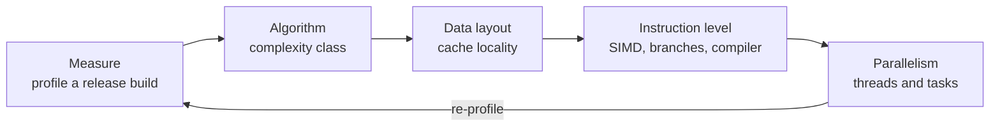
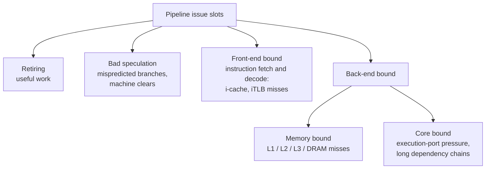
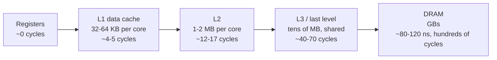
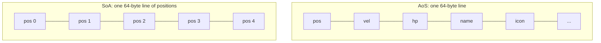
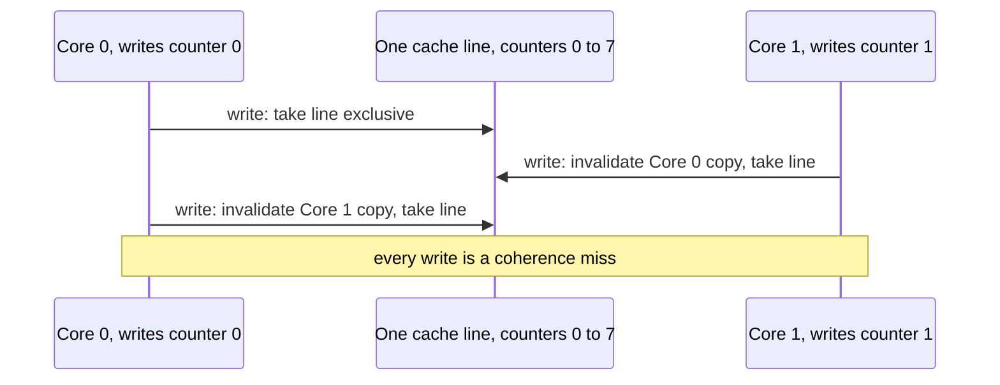

# CPU Profiling & Tuning

[Performance Optimization](./) &raquo; CPU Profiling & Tuning

CPU optimization reduces the time a processor spends executing code. On modern hardware the limit is usually not arithmetic but **data movement and prediction**: a core that can retire four or more instructions per cycle spends much of its time waiting on memory or recovering from mispredicted branches. This page covers measurement (sampling profilers, hardware counters, top-down analysis, benchmarking), cache-friendly data layout, SIMD, branch prediction, compiler-driven optimization (LTO, PGO, BOLT), and multithreading. Algorithm choice comes first and is covered in [Algorithmic Optimization](./algorithmic-optimization.html); allocators and the memory hierarchy in depth are in [Memory Optimization](./memory-optimization.html).

The order of attack:



Each step changes what the next profile shows. Vectorizing or threading a loop that stalls on cache misses mostly multiplies the stalls.

## Profiling Tools

Profile a **release build with debug symbols** (`-O2 -g`, or RelWithDebInfo) on a **representative, worst-case workload**, and repeat runs to see the noise. Debug builds disable inlining and optimization and point at the wrong hot spots.

| Tool | Platform | Type | Notes |
|------|----------|------|-------|
| `perf` | Linux | Sampling, hardware counters | The standard Linux profiler; also `perf c2c`, `perf mem`, `perf sched` |
| Intel VTune Profiler | Linux, Windows | Sampling, microarchitecture analysis | Top-down analysis, memory access, threading; best on Intel CPUs |
| AMD uProf | Linux, Windows | Sampling, counters | AMD's equivalent for Zen cores |
| Visual Studio Profiler, Windows Performance Analyzer (ETW) | Windows | Sampling, tracing | WPA shows system-wide CPU, scheduling, and I/O |
| Instruments | macOS, iOS | Sampling, tracing | Time Profiler, CPU Counters, System Trace |
| samply | Linux, macOS, Windows | Sampling | Command-line sampler that opens results in the Firefox Profiler UI |
| Superluminal | Windows, consoles | Sampling | Low-overhead, popular in game development |
| Tracy | Cross-platform | Instrumentation plus sampling | Frame-oriented timeline profiler for games and real-time code |
| Unreal Insights, Unity Profiler | Engine | Instrumentation | Engine-integrated frame traces |

### Sampling Versus Instrumentation

| Approach | How it works | Strengths | Weaknesses |
|----------|-------------|-----------|------------|
| **Sampling** | Interrupt the program periodically (timer or hardware-counter overflow) and record the call stack | Low overhead; works on unmodified release builds; shows where time actually goes | Statistical: short or rare functions can be missed; no exact call counts |
| **Instrumentation** | Record timestamps at function or scope entry and exit | Exact counts and per-call durations; shows ordering on a timeline | Overhead distorts small hot functions; only covers instrumented code |

Start with sampling to find *where* time goes. Add instrumentation (scoped timers, Tracy zones) where you need per-frame timelines or exact counts.

### perf on Linux

```bash
# Sample with call graphs. Frame-pointer unwinding (fp) is cheap and accurate when
# code is built with -fno-omit-frame-pointer; dwarf works without it but costs more.
perf record -F 999 -g --call-graph fp ./my_app --workload=stress

perf report            # interactive: hot functions, callers and callees
perf top               # live system-wide view
perf annotate          # per-instruction samples for one function

# Count hardware events for the whole run
perf stat -e cycles,instructions,cache-references,cache-misses,branches,branch-misses ./my_app

# Top-down breakdown (on CPUs and kernels that support it)
perf stat -M TopdownL1 ./my_app
```

Stack quality depends on unwinding. Ubuntu 24.04 and recent Fedora releases build their 64-bit packages with frame pointers enabled, for a typical cost of about 1 to 2 percent, so system libraries now unwind cleanly with `--call-graph fp`. Build your own code with `-fno-omit-frame-pointer` for the same benefit.

Two ratios from `perf stat` classify a bottleneck quickly:

$$
\text{IPC} = \frac{\text{instructions retired}}{\text{cycles}}
\qquad\qquad
\text{branch miss rate} = \frac{\text{branch misses}}{\text{branches}}
$$

Current cores can retire 4 to 8 instructions per cycle at peak, and well-tuned compute loops often sustain 2 to 4. An IPC below about 1 means the core is mostly stalled, usually on memory or mispredicts, and removing arithmetic will not help. A branch miss rate above a few percent in a hot loop is worth investigating.

### Flame Graphs

A **flame graph** merges thousands of sampled stacks into one picture: the x-axis is the share of samples (not time order), the y-axis is stack depth, and wide plateaus at the top are the hot leaf functions.

```bash
perf record -F 999 -g ./my_app
perf script | stackcollapse-perf.pl | flamegraph.pl > profile.svg   # Brendan Gregg's FlameGraph scripts
# or: samply record ./my_app   (opens an interactive flame graph and call tree)
```

**Differential flame graphs** (`difffolded.pl`) compare two profiles and color the functions that got slower or faster, which is the quickest way to explain a regression.

### Top-Down Microarchitecture Analysis

When IPC is low but the cause is unclear, **top-down analysis** (Intel's TMA method, exposed by VTune, `perf stat -M TopdownL1`, and AMD uProf's pipeline-utilization view) attributes every issue slot to one of four categories:



| Dominant category | Likely fix |
|-------------------|-----------|
| Retiring high | Already efficient per instruction: do less work (better algorithm, SIMD to do more per instruction) |
| Memory bound | Improve locality and layout, reduce footprint, prefetch, block or tile loops |
| Bad speculation | Make branches predictable, or remove them |
| Front-end bound | Shrink hot code, improve code layout (PGO, BOLT), reduce indirect calls |
| Core bound | Break dependency chains, use more independent accumulators, vectorize |

### Benchmarking Hygiene

Profiles tell you where; microbenchmarks tell you whether a change helped. They are easy to get wrong:

- Use a harness that handles warm-up, repetition, and statistics: Google Benchmark or nanobench (C++), Criterion (Rust), JMH (Java), pyperf (Python).
- Stop the compiler from deleting the work under test (`benchmark::DoNotOptimize`, `std::hint::black_box`).
- Control the machine: fixed CPU frequency governor, turbo behavior noted or disabled, the process pinned to one core type on hybrid P-core/E-core CPUs, and a quiet system.
- Report distributions (median and spread), not a single best run, and confirm that a win in a microbenchmark survives in the full application, where caches are shared with everything else.

## Cache Optimization

### The Memory Hierarchy



Figures are representative of 2024 to 2026 desktop and server x86 cores; Apple's performance cores use a 128 KB L1D and larger shared L2 clusters, and AMD's 3D V-Cache parts stack L3 to 96 MB or more per chiplet. The number that matters is the ratio: one DRAM miss costs as much time as several hundred instructions. That is why **memory access patterns dominate data-heavy workloads**.

Data moves in **cache lines**, 64 bytes on x86 and most Arm server cores, 128 bytes on Apple silicon. Two kinds of locality determine whether accesses hit:

- **Spatial locality.** Touching one byte loads its whole line, so neighboring data is effectively free. Sequential traversal is ideal, and hardware prefetchers detect sequential and strided streams and fetch ahead.
- **Temporal locality.** Recently used data is still in cache. Reuse it soon; revisiting it after streaming through gigabytes guarantees a miss.

Translation matters too: every access needs a virtual-to-physical translation from the TLB. Random access over a large heap can be TLB-bound; **huge pages** (2 MB on x86, via transparent huge pages or explicit `madvise`) cut TLB misses substantially for such workloads.

### Data-Oriented Design: AoS vs SoA

The classic cache pitfall is an **array of structures** (AoS) where hot and cold fields are interleaved. A loop that reads one hot field drags every cold field through the cache with it.

```cpp
// Array of Structures: each Entity is ~96 bytes; the update loop uses 28 of them
struct Entity {
    Vector3     position;   // hot: every frame
    Vector3     velocity;   // hot: every frame
    float       health;     // hot: every frame
    std::string name;       // cold
    Texture*    icon;       // cold
    // ... more cold fields
};
std::vector<Entity> entities;

// Structure of Arrays: each hot field is its own contiguous stream
struct EntityHot {
    std::vector<Vector3> positions;
    std::vector<Vector3> velocities;
    std::vector<float>   healths;
};
struct EntityCold {
    std::vector<std::string> names;
    std::vector<Texture*>    icons;
};
```

With **structure of arrays** (SoA), an update that reads positions and velocities walks tight contiguous streams. Every byte loaded is used, the prefetcher tracks each stream, and the loop is laid out the way SIMD wants it. Entity-component-system (ECS) engines such as Unity DOTS, Bevy, and flecs are built on this principle.

For the update above, AoS moves about 96 bytes per entity to use 28, roughly 3.4 times the memory traffic of SoA. On a memory-bound loop that translates almost directly into a 3x speedup with no change to the arithmetic.



### Other Cache Techniques

- **Hot/cold splitting.** Move rarely touched fields (debug names, serialization data) into a parallel array or behind a pointer so they never occupy hot lines.
- **Loop blocking (tiling).** For nested loops over large matrices, process cache-sized tiles so each tile is reused many times before eviction. Blocked matrix multiplication moves each element from DRAM once per tile instead of once per use.
- **Smaller types.** `float` instead of `double`, 32-bit indices instead of pointers, and bitfields or packed enums fit more elements per line.
- **Software prefetch.** For predictable but non-sequential access (walking an index array, pointer chasing a known list), `__builtin_prefetch` or `_mm_prefetch` a few iterations ahead can hide latency. The hardware prefetcher already handles sequential and simple strided streams, so measure: badly placed prefetches waste bandwidth.

## SIMD and Vectorization

A **SIMD** (single instruction, multiple data) instruction applies one operation to every lane of a wide register.

| ISA | Register width | 32-bit float lanes | Availability |
|-----|---------------|--------------------|--------------|
| SSE2 to SSE4.2 | 128-bit | 4 | Every x86-64 CPU (SSE2 is the baseline) |
| AVX2 + FMA | 256-bit | 8 | Most x86 CPUs since about 2013 to 2015 |
| AVX-512 / AVX10 | 512-bit | 16 | Intel server parts, AMD Zen 4 and Zen 5 |
| Arm NEON (ASIMD) | 128-bit | 4 | Every AArch64 CPU |
| Arm SVE / SVE2 | 128 to 2048-bit, vector-length agnostic | Implementation-defined | Neoverse V-series, Graviton 3 and 4, Grace |

A loop doing the same arithmetic on every element of an array is the ideal candidate: the body is replicated across lanes and the iteration count divides by the lane width.

### Auto-Vectorization

Compilers vectorize many loops at `-O2`/`-O3` (`/O2` in MSVC) if they can prove the transformation is safe. Common blockers:

- **Aliasing.** If two pointers might overlap, a write through one may change what the other reads. Mark non-overlapping pointers `__restrict` (`restrict` in C).
- **Loop-carried dependencies.** If iteration `i + 1` needs the result of iteration `i`, lanes cannot run independently. Floating-point reductions are a special case: vectorizing a sum reorders additions, which the compiler will not do without `-ffast-math`, `-fassociative-math`, or an OpenMP `simd reduction` pragma.
- **Calls and complex control flow** in the loop body.
- **Non-unit strides and gathers.** Contiguous SoA data vectorizes far better than strided AoS access.

```cpp
// __restrict promises out, a, b do not overlap, so the compiler can vectorize freely
void add_scaled(float* __restrict out,
                const float* __restrict a,
                const float* __restrict b,
                float k, std::size_t n) {
    for (std::size_t i = 0; i < n; ++i)
        out[i] = a[i] + k * b[i];     // one fused multiply-add per lane with FMA enabled
}
```

Ask the compiler what it did instead of guessing:

```bash
# GCC: report loops that were and were not vectorized, with reasons
g++ -O3 -march=x86-64-v3 -fopt-info-vec-optimized -fopt-info-vec-missed add.cpp

# Clang: optimization remarks
clang++ -O3 -march=x86-64-v3 -Rpass=loop-vectorize -Rpass-missed=loop-vectorize add.cpp
```

Without a `-march` flag the compiler targets baseline x86-64 (SSE2) only. `-march=native` tunes for the build machine, which is wrong for binaries shipped elsewhere; the **microarchitecture levels** `x86-64-v2` (SSE4.2), `x86-64-v3` (AVX2, FMA, BMI2), and `x86-64-v4` (AVX-512) are the portable choices. Libraries that must run everywhere use **function multiversioning** (`[[gnu::target_clones("avx2","default")]]`) or runtime dispatch to pick a code path per CPU.

### Intrinsics and Portable SIMD

When the compiler cannot vectorize a loop, or you need a specific shuffle or reduction, **intrinsics** map almost one-to-one to machine instructions while leaving register allocation to the compiler.

```cpp
#include <immintrin.h>

// Sum floats with AVX (8 lanes). Two accumulators hide the 4-cycle add latency.
float sum_avx(const float* data, std::size_t n) {
    __m256 acc0 = _mm256_setzero_ps(), acc1 = _mm256_setzero_ps();
    std::size_t i = 0;
    for (; i + 16 <= n; i += 16) {
        acc0 = _mm256_add_ps(acc0, _mm256_loadu_ps(data + i));
        acc1 = _mm256_add_ps(acc1, _mm256_loadu_ps(data + i + 8));
    }
    __m256 acc = _mm256_add_ps(acc0, acc1);
    // Horizontal reduction: 8 lanes -> 4 -> 2 -> 1
    __m128 lo = _mm256_castps256_ps128(acc);
    __m128 hi = _mm256_extractf128_ps(acc, 1);
    __m128 s  = _mm_add_ps(lo, hi);
    s = _mm_add_ps(s, _mm_movehl_ps(s, s));
    s = _mm_add_ss(s, _mm_shuffle_ps(s, s, 0x55));
    float total = _mm_cvtss_f32(s);
    for (; i < n; ++i) total += data[i];   // scalar tail
    return total;
}
```

Intrinsics are non-portable and easy to get subtly wrong. Portable alternatives:

- **`std::simd`** (header `<simd>`, proposal P1928) is part of **C++26**, providing `std::simd::vec<T>` and `std::simd::mask` types; `std::experimental::simd` from the Parallelism TS v2 is its predecessor and ships with GCC's libstdc++.
- **Google Highway**, **xsimd**, and **EVE** target many instruction sets from one source with runtime dispatch.
- Rust's `std::simd` (nightly, portable SIMD) and crates such as `wide`; .NET's `Vector<T>` and `Vector256<T>`; Java's incubating Vector API.

Prefer auto-vectorization, verify with compiler reports, and use explicit SIMD only on a profiled hot loop.

## Branch Prediction

Cores run deep pipelines speculatively: at every conditional branch the predictor guesses the outcome and execution races ahead. A correct guess is almost free. A **misprediction** discards the speculative work and costs roughly 15 to 20 cycles, which on a 6- to 8-wide core is on the order of 100 lost instruction slots.

Predictors learn regular patterns (always taken, loop exits, repeating sequences, correlations with recent branches) extremely well. They fail on **data-dependent, random** outcomes, such as comparing unsorted random data against a threshold in a hot loop.

### Making Branches Predictable

```cpp
long long sum_above(const int* data, std::size_t n) {
    long long sum = 0;
    for (std::size_t i = 0; i < n; ++i)
        if (data[i] >= 128)     // random data: mispredicts about half the time
            sum += data[i];
    return sum;
}
```

On random data this branch is a coin flip. If the data is sorted (or partitioned) first, the branch becomes a long run of not-taken followed by a long run of taken, and the loop can run several times faster purely from prediction. In practice, an optimizing compiler may turn this particular loop into a conditional move or vectorized select, removing the branch altogether; check the generated assembly before drawing conclusions from a benchmark like this.

### Branchless Code

When a branch is inherently unpredictable, replacing control flow with data flow can win:

```cpp
// Branchy clamp to [0, hi]
int clamp_branchy(int x, int hi) {
    if (x < 0)  return 0;
    if (x > hi) return hi;
    return x;
}

// Branchless: typically compiles to max/min or conditional moves (CMOV, CSEL)
int clamp_branchless(int x, int hi) {
    return std::min(std::max(x, 0), hi);
}
```

Other techniques: select via bit masks (`mask = -int(cond); r = b ^ ((a ^ b) & mask)`), lookup tables, and SIMD predication (compute both sides and blend with a mask). Branchless code always executes both paths, so it only wins when the branch was both **hot** and **unpredictable**; a predictable branch is cheaper than the extra work. When one side dominates, `[[likely]]` and `[[unlikely]]` (C++20) or `__builtin_expect` help the compiler place the common path in straight-line code.

## Compiler and Build Optimizations

Some of the largest cheap wins come from the build rather than the source.

| Technique | What it does | Typical gain |
|-----------|-------------|--------------|
| **`-O2` / `-O3`** | Standard optimization levels; `-O3` adds more aggressive inlining and vectorization | Baseline; `-O3` is not always faster than `-O2` |
| **Target flags** (`-march=x86-64-v3`) | Allows AVX2, FMA, BMI2 and tunes scheduling | Large on SIMD-friendly code |
| **LTO** (`-flto`, ThinLTO) | Optimizes across translation units: cross-file inlining, dead-code removal | A few percent to 10%+ |
| **PGO** (`-fprofile-generate`, then `-fprofile-use`; Clang also accepts sampled perf profiles) | Uses a recorded workload to guide inlining, branch layout, and hot/cold code splitting | Often 10 to 20% on large, branchy programs (compilers, databases, interpreters) |
| **BOLT** (LLVM post-link optimizer) | Reorders functions and basic blocks in the final binary using a perf profile | Additional gains on front-end-bound code, on top of PGO |

PGO and BOLT help most on code that is **front-end bound**: large binaries whose hot paths are scattered, such as compilers, databases, browsers, and language runtimes. Many major projects ship PGO-optimized builds, including CPython, Chromium, Firefox, and the Rust compiler. The cost is a representative training workload and a more complex build.

## Multithreading

Once a single core is well used, the next axis is running independent work on several cores.

### Task-Based Parallelism

Rather than one thread per job, production systems use a **thread pool** with a work queue, typically with **work stealing**: each worker has its own deque, and idle workers steal from busy ones, balancing load automatically. Use an existing implementation where possible:

| Language | Library |
|----------|---------|
| C++ | oneTBB, Taskflow, OpenMP; C++17 parallel algorithms (`std::execution::par`); C++26 `std::execution` (senders and receivers) |
| Rust | Rayon (data parallelism), Tokio (async I/O) |
| Java | `ForkJoinPool`, parallel streams, virtual threads (for I/O concurrency) |
| .NET | Task Parallel Library, `Parallel.For` |
| Game engines | Engine job systems (Unity C# Job System, Unreal Task Graph) |

A fork-join parallel loop with the C++ standard library (libstdc++ implements the parallel policies on top of oneTBB, so link with `-ltbb`):

```cpp
#include <algorithm>
#include <execution>

// Each element is independent, so the runtime can split the range across
// cores (par) and vectorize within each chunk (unseq).
void integrate(std::vector<Particle>& ps, float dt) {
    std::for_each(std::execution::par_unseq, ps.begin(), ps.end(),
                  [dt](Particle& p) { p.pos += p.vel * dt; });
}
```

Patterns:

- **Fork-join** for data-parallel loops: split a range, process chunks, join.
- **Pipelines** (producer-consumer) where stages hand work downstream through bounded queues.
- **Task graphs** where jobs declare dependencies and the scheduler runs whatever is ready, as in frame-based game engines.
- **Lock-free structures** (atomics, compare-and-swap) for high-contention shared state. They are hard to get right; prefer designs that avoid sharing.

Chunk size matters: too small and scheduling overhead dominates, too large and some cores idle at the end. Work-stealing runtimes adapt automatically, which is a main reason to prefer them over hand-rolled splits.

### Amdahl's and Gustafson's Laws

If a fraction $p$ of the work parallelizes perfectly and $1 - p$ is serial, the speedup on $N$ cores is bounded by **Amdahl's law**:

$$
S(N) = \frac{1}{(1 - p) + \dfrac{p}{N}}, \qquad \lim_{N \to \infty} S(N) = \frac{1}{1 - p}
$$

A program that is 90% parallel can never exceed a 10x speedup. **Gustafson's law** gives the complementary view: if the problem grows with the machine (more pixels, more entities, larger batches), the scaled speedup is $S(N) = (1 - p) + pN$, which keeps growing. Both point to the same practice: shrink the serial fraction and per-task overhead before adding cores, and expect sublinear scaling.

On **hybrid CPUs** (Intel P-cores and E-cores, Arm big.LITTLE, Apple performance and efficiency cores), equal-sized static chunks finish at different times. Dynamic scheduling or work stealing handles the asymmetry; fixed splits leave the fast cores waiting on the slow ones.

### False Sharing

Cache coherence operates on whole cache lines. When two threads write to *different* variables that share a line, each write invalidates the other core's copy and the line ping-pongs between cores. The threads are logically independent, yet the program can run slower in parallel than serially.



```cpp
#include <atomic>
#include <new>

// Contended: eight counters packed into one or two cache lines
struct Counters { std::atomic<long> value[8]; };

// Fixed: each counter on its own line. std::hardware_destructive_interference_size
// (C++17, <new>) is typically 64; some code uses 128 because Intel's adjacent-line
// prefetcher pulls lines in pairs, and Apple silicon uses 128-byte lines.
struct alignas(std::hardware_destructive_interference_size) PaddedCounter {
    std::atomic<long> value{0};
};
PaddedCounter counters[8];
```

Detect false sharing with `perf c2c` on Linux, which reports contended cache lines and the source lines touching them, or with VTune's memory-access analysis. The usual fixes are padding per-thread data to a line, or better, giving each thread a private accumulator and combining results once at the end.

## Memory Allocation on the Hot Path

General-purpose `malloc`/`new` is expensive on a hot path: it may take locks, search free lists, touch cold metadata, and scatter objects across the heap. High-performance code avoids per-item allocation in inner loops.

- **Reserve capacity** for containers whose size is known.
- **Arena (bump) allocators** for data with a shared lifetime such as one frame or one request: allocation is a pointer increment, and everything is freed at once.
- **Pools** for many same-sized objects with individual lifetimes.
- **A faster general allocator.** Swapping glibc `malloc` for mimalloc, jemalloc, or tcmalloc (often with no code changes, via linking or `LD_PRELOAD`) can noticeably speed up allocation-heavy, multithreaded programs.

Implementations and trade-offs are covered in [Memory Optimization: Allocation Strategies](./memory-optimization.html#allocation-strategies).

## Worked Example: An Optimization Pass

An illustrative sequence for an update over 1,000,000 entities that takes 14 ms, too much for a 16.7 ms (60 Hz) frame once the rest of the game is added:

| Step | Observation | Change | Time |
|------|-------------|--------|------|
| 1. Profile | `perf stat`: IPC 0.4, high LLC miss rate; top-down says memory bound | None yet: vectorizing now would multiply stalls | 14 ms |
| 2. Layout | AoS loop drags cold fields through cache | Split hot `position`, `velocity`, `mass` into SoA arrays | ~5 ms, IPC ~1.6 |
| 3. Vectorize | Contiguous floats, no aliasing | `__restrict` and `-march=x86-64-v3`; loop processes 8 entities per AVX instruction | ~2 ms |
| 4. Parallelize | Independent elements, no shared writes | `std::for_each(std::execution::par_unseq, ...)` over 8 cores | ~0.4 ms |

About 35x overall, and the order mattered: threading the original loop would have spread a memory-stalled loop across cores that share the same memory bandwidth. The loop is: **profile, fix the dominant bottleneck, re-profile.**

## See Also

- [Performance Optimization](./): the hub, process, and learning paths
- [Algorithmic Optimization](./algorithmic-optimization.html): complexity and data-structure choice, which come before any of this
- [Memory Optimization](./memory-optimization.html): allocators, fragmentation, and cache locality in depth
- [GPU Optimization](./gpu-optimization.html): the throughput-oriented counterpart
- [3D Graphics and Rendering](../graphics/3d-rendering.html): the rendering pipeline the CPU feeds
- [Game Development](../gamedev/): frame budgets and engine architecture
- [Distributed Systems Theory](../advanced/distributed-systems-theory/): scaling beyond one machine
- [Docker](../technology/docker/): CPU limits and their effect on performance in containers
