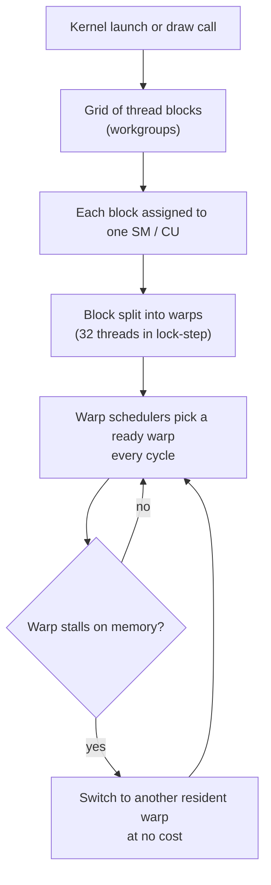
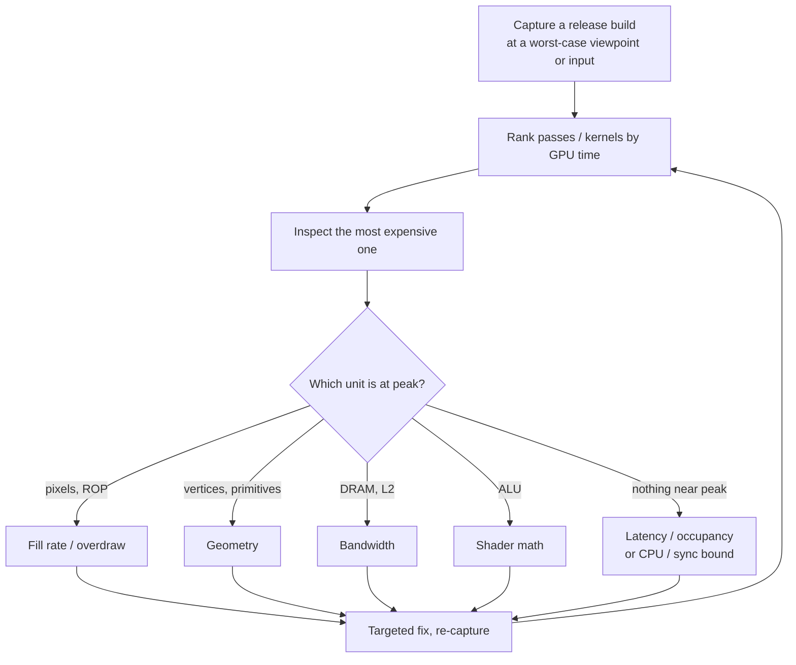
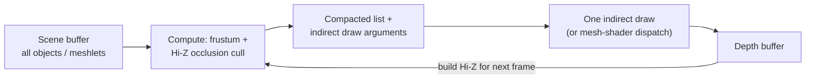
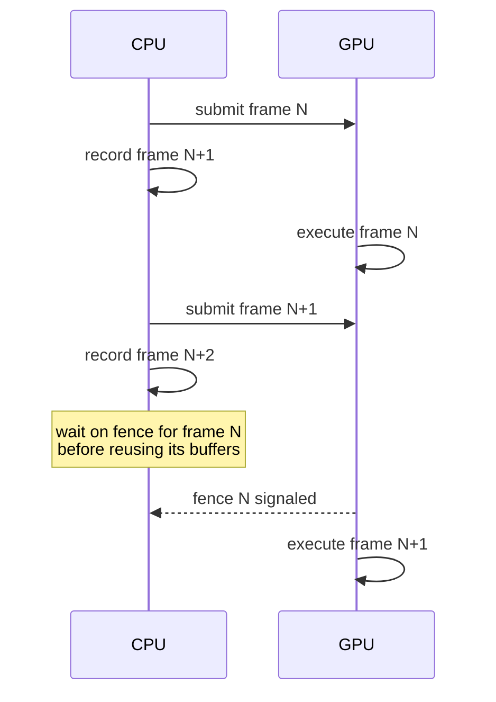

# GPU Optimization

[Performance Optimization](./) &raquo; GPU Optimization

A GPU is a throughput machine, not a faster CPU: it runs tens of thousands of threads at once and hides memory latency by switching among them rather than by avoiding it. Optimizing GPU work means finding which hardware unit limits the frame or kernel, keeping enough work in flight to hide latency, moving as few bytes as possible through the memory hierarchy, and never letting the CPU and GPU wait on each other. This page covers the execution model, profiling tools, bottleneck classification and the roofline model, occupancy, memory access (coalescing, shared memory, bank conflicts), draw-call submission and GPU-driven rendering, shader optimization, compute-specific techniques, and CPU-GPU synchronization. It applies to both graphics (Vulkan, Direct3D 12, Metal) and compute (CUDA, HIP, compute shaders).

## The GPU Execution Model

GPUs execute threads in groups that share one instruction stream, a model NVIDIA calls **SIMT** (single instruction, multiple threads).

| Vendor | Group name | Width | Multiprocessor |
|--------|-----------|-------|----------------|
| NVIDIA | Warp | 32 | Streaming multiprocessor (SM) |
| AMD RDNA (Radeon) | Wavefront | 32 or 64 (wave32 / wave64) | Compute unit (CU), paired as a WGP |
| AMD CDNA (Instinct) | Wavefront | 64 | Compute unit |
| Apple | SIMD-group | 32 | GPU core |
| Intel Xe | Sub-group (SIMD) | 8, 16, or 32 | Xe core |

This page uses "warp" for the generic concept. A kernel launch or draw call becomes a grid of **thread blocks** (workgroups in Vulkan and compute shaders); each block is assigned to one multiprocessor, split into warps, and the multiprocessor's schedulers interleave all resident warps cycle by cycle.



Two consequences drive nearly every GPU optimization:

1. **Latency is hidden by parallelism, not avoided.** A global-memory load takes hundreds of cycles. The multiprocessor stays busy only if other warps are ready to issue while one waits. How many warps are resident is the **occupancy**; how many are *ready* also depends on how much independent work each warp has.
2. **Divergence wastes lanes.** When threads in one warp take different branches, the hardware runs each path in turn with the non-participating lanes masked off. A fully divergent `if/else` costs the sum of both paths. (Since Volta, NVIDIA GPUs track a program counter per thread, which avoids some deadlocks in divergent code, but divergent paths still execute serially.)

Pixel shaders, vertex shaders, and compute threads all run on this same machinery. Pixel shaders are additionally launched in 2x2 **quads** so that screen-space derivatives (for mip selection) can be computed, which is why tiny triangles waste shading work.

## GPU Profiling

GPU intuition is unreliable: work is asynchronous, deeply pipelined, and spread across units that overlap in time. Start with a capture.

| Tool | Scope | Use it for |
|------|-------|-----------|
| **NVIDIA Nsight Systems** | System timeline (CPU threads, API calls, GPU queues, transfers) | Finding CPU-GPU stalls, idle gaps, launch overhead; the first tool for CUDA and ML workloads |
| **NVIDIA Nsight Compute** | Single CUDA kernel | Occupancy, warp stall reasons, memory throughput, roofline, source-level hot spots |
| **NVIDIA Nsight Graphics** | Graphics frame | Per-draw GPU timing, GPU Trace unit throughputs, shader profiler |
| **RenderDoc** | Graphics frame, cross-vendor | Frame debugging: every draw, resource, and pipeline state; inputs and outputs of each stage |
| **AMD Radeon GPU Profiler (RGP)** | Frame or dispatch on AMD | Wavefront occupancy, barriers, instruction timing |
| **AMD rocprof / Omniperf (ROCm Compute Profiler)** | HIP kernels on AMD | Counter collection and roofline for Instinct GPUs |
| **PIX** | Direct3D 12 on Windows and Xbox | GPU captures, timing, and CPU-side timelines |
| **Xcode Metal debugger / Metal System Trace** | Apple GPUs | Shader cost, limiter counters, CPU-GPU timeline |
| **PyTorch Profiler, `torch.cuda` events** | ML frameworks | Operator-level GPU time, exported to trace viewers |

Metrics to read:

- GPU time per pass and per draw or kernel, from the **timeline** rather than by summing per-draw numbers (overlapping work makes the sum exceed frame time)
- Unit throughputs as a percentage of peak (shader ALU, texture, memory, raster), which directly identify the limiter
- Achieved versus theoretical occupancy, and **warp stall reasons** (memory dependency, barrier, execution dependency, instruction fetch)
- DRAM bandwidth, L1 and L2 hit rates
- Overdraw and primitive counts before and after culling

### Workflow



When **no unit is near its peak**, the GPU is usually starved: too little parallelism, stalls on dependent memory accesses, or waiting on the CPU. Check the system timeline for gaps before optimizing shaders.

## Identifying the Bottleneck

A GPU frame or kernel is limited by whichever unit saturates first, and the fix for one bound does nothing for another.

| Bound | Symptoms | Typical fixes |
|-------|----------|---------------|
| **Fill rate / pixel** | Time scales with resolution; high overdraw; heavy pixel shaders | Depth prepass or front-to-back sorting, cheaper pixel shaders, lower internal resolution with upscaling (DLSS, FSR, XeSS), variable-rate shading |
| **Geometry** | Time scales with triangle count, not resolution; many sub-pixel triangles | LOD, culling (frustum, occlusion, backface, cluster), mesh simplification, meshlets and mesh shaders |
| **Bandwidth** | DRAM throughput near peak | Block-compressed textures (BC, ASTC), mipmaps, smaller render-target formats, fewer passes (merge or fuse them), better cache reuse |
| **ALU (shader math)** | ALU throughput near peak | Simplify math, move work to vertex or earlier stages, precompute, lower precision |
| **Latency / occupancy** | Nothing at peak; stalls on memory dependency | Raise occupancy, add independent work per thread, prefetch into shared memory |
| **CPU / submission** | GPU idle between bursts; CPU thread saturated | Batching, instancing, indirect and GPU-driven rendering, multithreaded command recording |

Quick diagnostics when a profiler is not available:

- **Change the resolution.** If frame time scales with pixel count, the bound is fill rate or bandwidth on screen-space work. If it barely moves, look at geometry or the CPU.
- **Replace a pixel shader with a flat color.** A large speedup points at that shader.
- **Disable a pass** (shadows, post-processing) and measure the difference.
- **Check CPU and GPU frame times separately.** If the CPU frame time exceeds the GPU's, GPU optimization will not help.

### The Roofline Model

For compute kernels (and full-screen passes), the **roofline model** answers "am I limited by math or by memory?" **Arithmetic intensity** is the useful work per byte moved from DRAM:

$$
I = \frac{\text{FLOPs executed}}{\text{bytes moved to and from memory}}
$$

Attainable performance is bounded by both the compute peak and the memory system:

$$
P_{\text{attainable}} = \min\left(P_{\text{peak}},\; I \times B_{\text{peak}}\right)
$$

The **ridge point** $I^{*} = P_{\text{peak}} / B_{\text{peak}}$ is the machine balance. Kernels to its left are memory-bound; to its right, compute-bound.

<figure style="margin:1.5rem auto; max-width:640px;">
<svg viewBox="0 0 640 300" width="100%" role="img" aria-labelledby="gpu-roofline-title" style="color:currentColor; background:transparent;">
<title id="gpu-roofline-title">Roofline model: attainable performance rises with arithmetic intensity along the memory-bandwidth roof until the ridge point, then flattens at the compute peak</title>
<line x1="70" y1="250" x2="610" y2="250" stroke="currentColor" stroke-width="1.5"/>
<line x1="70" y1="250" x2="70" y2="20" stroke="currentColor" stroke-width="1.5"/>
<text x="340" y="285" text-anchor="middle" font-size="14" fill="currentColor">Arithmetic intensity (FLOP per byte, log scale)</text>
<text x="25" y="135" text-anchor="middle" font-size="14" fill="currentColor" transform="rotate(-90 25 135)">Attainable FLOP/s (log scale)</text>
<polyline points="80,240 330,60 600,60" fill="none" stroke="currentColor" stroke-width="3"/>
<line x1="330" y1="60" x2="330" y2="250" stroke="currentColor" stroke-width="1" stroke-dasharray="5 5" opacity="0.6"/>
<text x="465" y="50" text-anchor="middle" font-size="13" fill="currentColor">Compute roof: peak FLOP/s</text>
<text x="175" y="130" text-anchor="middle" font-size="13" fill="currentColor" transform="rotate(-36 175 130)">Memory roof: slope = bandwidth</text>
<text x="336" y="80" font-size="12" fill="currentColor">ridge point I*</text>
<text x="200" y="242" text-anchor="middle" font-size="13" fill="currentColor" opacity="0.8">memory-bound</text>
<text x="470" y="242" text-anchor="middle" font-size="13" fill="currentColor" opacity="0.8">compute-bound</text>
<circle cx="150" cy="200" r="6" fill="none" stroke="currentColor" stroke-width="2"/>
<text x="162" y="212" font-size="12" fill="currentColor">elementwise add</text>
<circle cx="500" cy="85" r="6" fill="none" stroke="currentColor" stroke-width="2"/>
<text x="500" y="110" text-anchor="middle" font-size="12" fill="currentColor">large matrix multiply</text>
</svg>
<figcaption style="text-align:center; font-size:0.9em;">A kernel's point sits below the roof; the gap to the roof is headroom, and which roof is above it says what to optimize.</figcaption>
</figure>

As a concrete scale, an NVIDIA H100 SXM has about 67 TFLOP/s of non-tensor FP32 throughput and about 3.35 TB/s of HBM3 bandwidth, a ridge point near 20 FLOP per byte. An elementwise FP32 add (`c = a + b`) does 1 FLOP per 12 bytes moved, about 0.08 FLOP per byte, so it runs at under 1% of peak compute no matter how its math is written; the only way to speed it up is to move fewer bytes, for example by **fusing** it into the kernel that produced `a` or the one that consumes `c`. Large matrix multiplications reuse each loaded element many times and sit far to the right, which is why they, and the tensor cores that accelerate them, reach near-peak throughput.

## Occupancy

**Occupancy** is the ratio of resident warps on a multiprocessor to the hardware maximum:

$$
\text{Occupancy} = \frac{\text{active warps per SM}}{\text{maximum warps per SM}}
$$

It is capped by whichever per-SM resource runs out first:

- **Registers.** The register file is shared by all resident threads. More registers per thread means fewer warps.
- **Shared memory** (LDS on AMD, threadgroup memory in Metal, `groupshared` in HLSL) per block.
- **Block size and the per-SM block limit.** Warps are allocated in whole blocks, so a block size that does not divide the warp budget evenly leaves slots unused.

Per-SM limits for recent NVIDIA architectures (from the CUDA programming guide):

| Compute capability | Examples | Max resident warps | Max threads | 32-bit registers | Max registers per thread | Max shared memory |
|--------------------|----------|--------------------|-------------|------------------|--------------------------|-------------------|
| 8.0 | A100 | 64 | 2048 | 65,536 | 255 | 164 KB |
| 8.6 / 8.9 | RTX 30 / RTX 40 series, L40 | 48 | 1536 | 65,536 | 255 | 100 KB |
| 9.0 | H100, H200 | 64 | 2048 | 65,536 | 255 | 228 KB |
| 12.0 | RTX 50 series | 48 | 1536 | 65,536 | 255 | 100 KB |

Ignoring allocation granularity, the register-limited warp count is

$$
W_{\text{reg}} = \left\lfloor \frac{R_{\text{SM}}}{R_{\text{thread}} \times T_{\text{warp}}} \right\rfloor
$$

where $R_{\text{SM}}$ is the register file size, $R_{\text{thread}}$ the registers per thread, and $T_{\text{warp}}$ the warp width. Achieved occupancy is the minimum of this, the shared-memory limit, the block limit, and the hardware maximum.

**Worked example (compute capability 9.0).** At 32 registers per thread, $65536 / (32 \times 32) = 64$ warps, the hardware maximum, so 100% theoretical occupancy. A change that raises usage to 40 registers gives $\lfloor 65536 / 1280 \rfloor = 51$ warps; with 256-thread (8-warp) blocks only 6 whole blocks fit, so 48 warps, 75% occupancy. At 128 registers, 16 warps remain (25%). If the compiler must **spill** registers to local memory to stay under a limit, it adds memory traffic on top.

**More occupancy is not always better.** Once enough warps are resident to cover memory latency, more add nothing, and forcing register usage down (with `__launch_bounds__` or `-maxrregcount`) can cause spills that make the kernel slower. Many of the fastest kernels, including tuned matrix multiplies and attention kernels, deliberately run at low occupancy and hide latency with **instruction-level parallelism** instead: each thread keeps several independent loads and math operations in flight. Aim for enough latency hiding, measured by stall reasons, not for a 100% occupancy number.

Levers when occupancy is the limiter:

- Reduce live registers: shorten long-lived values, split very large kernels, avoid large per-thread arrays (which can end up in local memory).
- Reduce shared memory per block, or choose a tile size that lets another block fit.
- Choose block sizes that are multiples of the warp width and divide the per-SM warp budget; the CUDA occupancy API (`cudaOccupancyMaxPotentialBlockSize`) or the Nsight Compute occupancy calculator shows the options.

## Memory Access


Every level down is slower and shared by more threads. The largest wins come from moving data across the lower links less often.

### Coalescing

Global memory is served in aligned chunks: on NVIDIA GPUs, 32-byte **sectors** grouped into 128-byte cache lines. When the 32 threads of a warp access 32 consecutive 4-byte words, the request is served by four sectors in one line: **coalesced**. When they access addresses far apart, each thread needs its own sector and most of each transfer is wasted.

```
Coalesced: thread t reads element t
thread:  0     1     2     3    ...   31
address: 0     4     8     12   ...   124      -> 4 sectors, 128 bytes, all used

Strided: thread t reads element 64*t
thread:  0     1     2    ...
address: 0     256   512  ...                  -> 32 sectors, 1024 bytes moved for 128 used
```

This is why **structure of arrays** beats array of structures on the GPU. With AoS, consecutive threads reading one field are separated by the whole struct size; with SoA, the field is contiguous.

```cpp
// AoS: thread t reads particles[t].position, strided by sizeof(Particle)
struct Particle { float3 position; float3 velocity; float4 color; float mass; };

// SoA: thread t reads positions[t], contiguous and coalesced
struct Particles {
    float3* positions;
    float3* velocities;
    float4* colors;
    float*  masses;
};
```

Guidelines:

- Map the fastest-varying thread index (`threadIdx.x`, `gl_LocalInvocationID.x`) to the contiguous dimension of the data. For a row-major 2D array, adjacent threads should walk along a row.
- Align base addresses and row pitches to the transaction size; APIs provide pitched allocations (`cudaMallocPitch`) for this.
- Prefer 16-byte vector loads (`float4`) where the data allows; fewer, wider instructions reach peak bandwidth more easily.
- For textures, nearby pixels should sample nearby texels. Mipmaps and the GPU's tiled (swizzled) texture layouts exist to keep those accesses cache-friendly; sampling a high-resolution texture far away without mips thrashes the cache.

### Shared Memory and Bank Conflicts

**Shared memory** is a fast, software-managed on-chip scratchpad visible to all threads of a block. The standard pattern is to load a tile from global memory with coalesced reads, synchronize, then read it many times in whatever pattern the algorithm needs.

Shared memory is divided into 32 **banks** of 4 bytes. Threads of a warp that access different addresses in the same bank are serialized (a **bank conflict**). A matrix transpose shows both problems and their fixes:

```cpp
constexpr int TILE = 32;

// in: rows x cols, row-major; out: cols x rows. Launch with blockDim = (32, 8).
__global__ void transpose(float* __restrict__ out, const float* __restrict__ in,
                          int rows, int cols) {
    // +1 column of padding shifts each row by one bank, so reading a column
    // touches 32 different banks instead of the same bank 32 times.
    __shared__ float tile[TILE][TILE + 1];

    int x = blockIdx.x * TILE + threadIdx.x;       // column in `in`
    int y = blockIdx.y * TILE + threadIdx.y;       // row in `in`
    for (int j = 0; j < TILE; j += blockDim.y)     // coalesced read along rows
        if (x < cols && y + j < rows)
            tile[threadIdx.y + j][threadIdx.x] = in[(y + j) * cols + x];

    __syncthreads();

    x = blockIdx.y * TILE + threadIdx.x;           // column in `out`
    y = blockIdx.x * TILE + threadIdx.y;           // row in `out`
    for (int j = 0; j < TILE; j += blockDim.y)     // coalesced write along rows
        if (x < rows && y + j < cols)
            out[(y + j) * rows + x] = tile[threadIdx.x][threadIdx.y + j];
}
```

A naive transpose reads rows and writes columns, so one of the two global accesses is strided. Staging through the tile makes both global accesses coalesced; the transposition happens in shared memory, where the padding keeps column reads conflict-free.

On Hopper and later NVIDIA GPUs, the **Tensor Memory Accelerator** (TMA) copies whole tiles between global and shared memory asynchronously, and libraries such as CUTLASS and cuDNN use it to overlap loading the next tile with computing on the current one.

## Draw Calls and GPU-Driven Rendering

Every draw call has CPU-side cost: state validation, descriptor binding, and command encoding. Thousands of small draws make a frame **CPU-bound on submission** while the GPU sits partly idle. Explicit APIs (Vulkan, Direct3D 12, Metal) cut per-draw driver overhead substantially and allow recording command buffers on many threads, but reducing the number of CPU-issued draws still pays.

| Technique | What it does | Best for |
|-----------|-------------|----------|
| Static batching | Merge static meshes that share a material at build time | Static level geometry |
| Instancing | One draw, many copies with per-instance data | Repeated objects: foliage, crowds, debris |
| Bindless resources | Index textures and buffers from large descriptor arrays instead of binding per draw | Removing material state changes so more draws merge |
| Multi-draw indirect | GPU reads an array of draw arguments from a buffer | Many different meshes in one call |
| GPU-driven culling | Compute pass culls objects or meshlets and writes indirect arguments | Large scenes; removes CPU-GPU round trips |
| Mesh shaders | Replace the vertex and primitive pipeline with compute-like task and mesh stages over meshlets | Fine-grained culling and LOD on the GPU |
| Device-generated commands, D3D12 Work Graphs | GPU generates new work (including state changes or dispatches) without the CPU | Fully GPU-driven pipelines |

**Instancing** submits one mesh and a per-instance buffer of transforms; a forest of 10,000 trees becomes one draw.

```glsl
#version 460
// OpenGL 4.6 vertex shader: one draw, N instances.
// (In Vulkan GLSL, use gl_InstanceIndex, which includes the base instance.)
layout(location = 0) in vec3 inPosition;

layout(std430, binding = 0) readonly buffer InstanceData {
    mat4 modelMatrix[];            // one entry per instance
};

layout(std140, binding = 1) uniform Camera {
    mat4 viewProj;
};

void main() {
    mat4 model = modelMatrix[gl_InstanceID];
    gl_Position = viewProj * model * vec4(inPosition, 1.0);
}
```

**GPU-driven rendering** moves the per-object decisions to the GPU. A compute pass tests every object (or meshlet) against the view frustum and last frame's depth pyramid (Hi-Z occlusion), compacts the survivors, and writes draw arguments that a single `vkCmdDrawIndexedIndirectCount` or `ExecuteIndirect` call consumes. The CPU submits a constant handful of calls regardless of scene size. Virtualized-geometry systems such as Unreal Engine 5's Nanite take this further with cluster-level culling and LOD selected entirely on the GPU.



**State sorting.** When draws remain CPU-issued, sort them so the most expensive state changes happen least often: render target first, then pipeline (shader) state, then material resources, then per-draw constants and buffers. With bindless resources, material changes become index changes and nearly disappear from the cost. Combine sorting with a **depth prepass** or rough front-to-back order so early depth testing rejects hidden pixels before they are shaded.

## Shader Optimization

When a shader is the bound, the win comes from doing less work per invocation, keeping warps coherent, and using the cheapest correct precision. A pixel shader runs once per covered pixel, often millions of times per frame, so small savings multiply.

**Divergence.**

- Branches that are **uniform** across a draw or dispatch (based on constants) are cheap; only thread-varying branches diverge.
- Branches that are coherent across screen regions (most pixels in a tile take the same side) diverge only at region edges, so they are usually fine.
- For short, genuinely divergent branches, compute both sides and select (`mix`, `step`, `select`); the compiler often does this itself. For long divergent branches, consider sorting or binning work so each warp sees similar cases (for example, material sorting in deferred and ray-traced renderers).

**Math.**

- Compilers already turn `pow(x, 2.0)` into `x * x` and fold constants; write clear code and check the generated ISA (via Nsight, RGA, or the Metal shader profiler) before hand-optimizing.
- Move work to the earliest stage where it is still correct: per-draw constants on the CPU, slowly varying terms in the vertex shader (interpolated to pixels), per-pixel only what must be.
- Transcendentals (`sin`, `exp`, `rsqrt`) run on special-function units at a fraction of the regular ALU rate; they are fast but not free.

**Precision.**

- 16-bit floats (`half` in Metal, `min16float` or `float16_t` with Shader Model 6.2+ in HLSL, `mediump` in GLSL ES) can double ALU throughput on hardware with packed FP16 math and halve register use, which in turn raises occupancy.
- `mediump` and `lowp` are hints: desktop OpenGL ignores them, and mobile implementations map them to FP16 or wider. Use 16-bit types for colors, normals, and UVs within a modest range; keep positions and depth in 32-bit float.

**Registers and memory.**

- Long shaders with many simultaneously live values consume registers and cap occupancy. Shorten live ranges and avoid dynamically indexed local arrays.
- Dependent texture fetches (a coordinate computed from another fetch) serialize latency; keep such chains short.
- Simple arithmetic is often cheaper than a texture lookup; precomputed lookup textures still win for expensive functions. The balance shifts by GPU generation, so measure both.

## Compute and ML Workloads

GPU compute, and machine learning in particular, adds a few concerns that graphics rarely hits:

- **Use the tensor cores.** Matrix math in FP16, BF16, TF32, or FP8 (Hopper and later; FP4 on Blackwell) runs an order of magnitude faster than FP32 on the regular ALUs. Mixed-precision training and inference (`torch.autocast`) is the default for a reason.
- **Fuse kernels.** Chains of elementwise operations are memory-bound, so each separate kernel re-reads and re-writes the whole tensor. Fusion keeps intermediates in registers or shared memory. Compilers (`torch.compile`, XLA, Triton) fuse automatically; FlashAttention is the landmark hand-fused example, computing attention tile by tile in shared memory so the full attention matrix is never written to DRAM.
- **Cut launch overhead.** Each kernel launch costs several microseconds of CPU and driver time. Workloads made of many tiny kernels (small-batch inference) are launch-bound; **CUDA Graphs** record a sequence of launches once and replay it with a single call.
- **Overlap transfers with compute.** Use pinned (page-locked) host memory, asynchronous copies on separate streams, and double-buffered batches so PCIe or NVLink transfers hide behind computation. Better still, keep data resident on the GPU between steps.
- **Batch.** A batch that is too small cannot fill tens of thousands of lanes; throughput often scales nearly linearly with batch size until a compute or memory roof is reached.

For model-level techniques (quantization, pruning, distillation, serving), see [Model Compression](../ai-ml/model-compression.html) and [AI/ML Optimization](../ai-ml/optimization-guide.html).

## CPU-GPU Synchronization

The CPU and GPU are independent processors connected by command queues. The CPU records command buffers that the GPU executes later, usually one or two frames behind. Both run at full speed only while neither waits for the other; the classic performance bug is an accidental **sync point**.



**Readback stalls.** Reading a GPU result on the CPU immediately after requesting it (a query result, a computed buffer, a screenshot) blocks the CPU until the GPU drains all earlier work, serializing the two processors and potentially costing a whole frame. Avoid it by:

- **Deferring the read.** Copy results into a ring of staging buffers and read each one two or three frames later, when its fence has already signaled.
- **Keeping results on the GPU.** With indirect drawing and compute, values such as visible-object counts never need to reach the CPU.

**Buffer update hazards.** Writing a buffer the GPU may still be reading forces the driver (in older APIs) to stall or silently copy, and in explicit APIs is simply a bug. Use:

- **Per-frame copies** (double or triple buffering) so the CPU never writes a resource that is in flight.
- **Persistently mapped ring buffers** carved into per-frame regions, each reused only after the fence for its frame has signaled.

**Synchronization primitives.**

| Primitive | Synchronizes | Notes |
|-----------|-------------|-------|
| Fence (D3D12 `ID3D12Fence`, Vulkan fence or timeline semaphore, Metal shared event) | GPU to CPU | Know when a frame's resources can be reused. Poll or wait only when about to reuse, not every frame. |
| Semaphore (Vulkan binary or timeline semaphores, core since Vulkan 1.2) | Queue to queue | Order work across graphics, async compute, and transfer queues without CPU involvement |
| Pipeline barrier / resource transition | Work within a queue | Order dependent passes and change resource layouts. Over-broad barriers (all stages, all resources) serialize the GPU; scope them to the actual dependency and batch them. |

**Async compute.** Independent compute work (light culling, particle simulation, post-processing) can run on a separate queue and overlap graphics passes that leave ALUs idle, such as shadow-map rendering, which is mostly raster- and depth-bound. The gain depends on the two workloads stressing different units; profile before and after.

**Frames in flight.** Letting the CPU run two to three frames ahead of the GPU, bounded by fences, keeps both saturated at the cost of input latency. Latency-reduction features (NVIDIA Reflex, AMD Anti-Lag, and similar) shorten this queue dynamically when the GPU is the bottleneck.

## See Also

- [Performance Optimization](./): the hub, process, and learning paths
- [CPU Optimization](./cpu-optimization.html): profiling, cache-aware layout, and SIMD on the CPU side
- [Memory Optimization](./memory-optimization.html): texture compression, streaming, and memory budgets
- [3D Graphics and Rendering](../graphics/3d-rendering.html): the rendering pipeline and GPU architecture this builds on
- [Shader Programming](../graphics/shaders.html): shader stages, languages, and debugging
- [AI/ML Optimization](../ai-ml/optimization-guide.html): inference and training performance for diffusion and other models
- [Game Development](../gamedev/): frame budgets and engine-level performance
- [Unreal Engine](../technology/unreal.html): Unreal's GPU profiling tools and Nanite
- [VR/AR Development](../vr-ar/): tight GPU budgets for stereo rendering at high refresh rates
