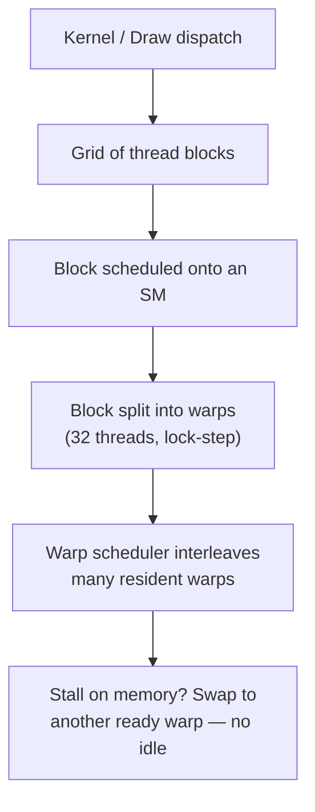
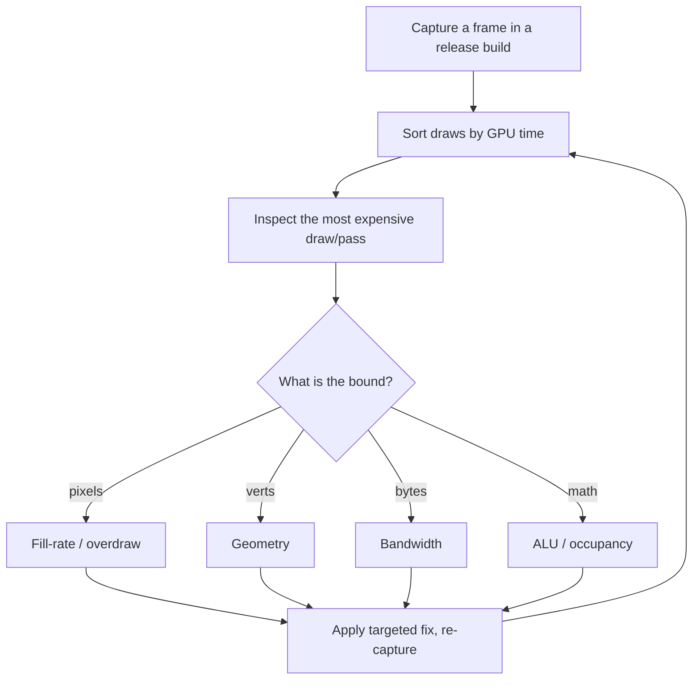
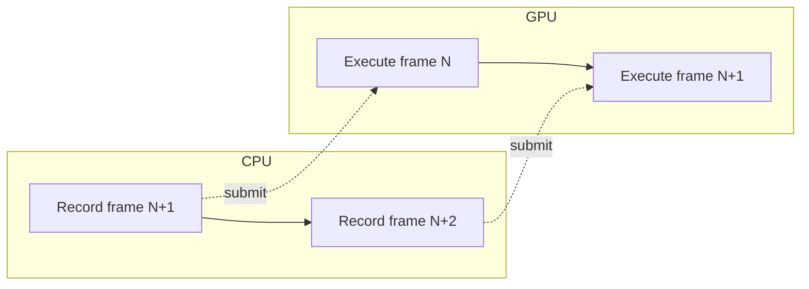

<div class="hero-section" style="background: linear-gradient(135deg, #667eea 0%, #764ba2 100%); color: white; padding: 3rem 2rem; margin: -2rem -3rem 2rem -3rem; text-align: center;">
  <h1 style="color: white; margin: 0; font-size: 2.5rem;">GPU Optimization</h1>
  <p style="font-size: 1.25rem; margin-top: 1rem; opacity: 0.9;">Profile the pipeline, find your bound, and feed thousands of parallel threads efficiently</p>
</div>

[Performance Optimization](./) &raquo; GPU Optimization

<div class="hub-intro">
  <p class="lead">The GPU is a massively parallel throughput machine, not a faster CPU. Optimizing it means keeping its execution units busy, moving data efficiently across a hierarchy of memories, and minimizing the synchronization that stalls the CPU and GPU on each other. This page covers GPU profilers, occupancy, memory coalescing, draw-call batching, shader optimization, and CPU-GPU synchronization.</p>
</div>

<div class="key-insights">
  <div class="insight-card"><i class="fas fa-search"></i><h4>Find the bound first</h4><p>A GPU frame is fill-rate, geometry, bandwidth, or ALU limited. The profiler tells you which — and every other decision follows from that answer.</p></div>
  <div class="insight-card"><i class="fas fa-bolt"></i><h4>Occupancy hides latency</h4><p>The GPU covers ~400-cycle memory stalls by swapping to another warp. Too few warps in flight means the cores sit idle waiting on memory.</p></div>
  <div class="insight-card"><i class="fas fa-grip-lines"></i><h4>Coalesce your memory</h4><p>Adjacent threads should touch adjacent addresses so one wide transaction serves a whole warp. Scattered access multiplies bandwidth cost.</p></div>
  <div class="insight-card"><i class="fas fa-layer-group"></i><h4>Batch and don't stall</h4><p>Each draw call costs CPU validation; each readback stalls the pipeline. Batch geometry and keep the CPU and GPU running asynchronously.</p></div>
</div>

## The GPU Execution Model

Before optimizing, you need a mental model of *why* the GPU is fast. It is a SIMT (Single Instruction, Multiple Thread) machine: threads are grouped into **warps** (NVIDIA, 32 threads) or **wavefronts** (AMD, 32 or 64 threads) that execute the same instruction in lock-step. A streaming multiprocessor (SM / compute unit) holds many such warps resident at once and switches between them cycle-by-cycle to hide latency.



Two consequences drive almost every GPU optimization:

1. **Latency is hidden by parallelism, not avoided.** A single warp that issues a global-memory load waits hundreds of cycles. The GPU stays busy only if *other* warps are ready to run. The supply of ready warps is your **occupancy**.
2. **Divergence wastes lanes.** If threads in a warp take different branches, the hardware executes both paths with the inactive lanes masked off. A fully divergent `if/else` halves throughput for that region.

This model unifies graphics and compute: a pixel shader invocation, a vertex shader invocation, and a CUDA/compute thread are all just threads packed into warps.

## GPU Profiling

You cannot optimize what you have not measured, and on the GPU intuition is especially unreliable — the work is asynchronous, deeply pipelined, and split across hardware units that overlap. Always start with a frame capture.

**Tools:**
- **RenderDoc**: Cross-platform frame capture and analysis. Inspect every draw call, resource, and pipeline state; view inputs/outputs of each shader stage.
- **NVIDIA Nsight Graphics / Nsight Compute**: Deep NVIDIA GPU profiling — per-draw timing, occupancy, warp stall reasons, and roofline analysis for compute.
- **AMD Radeon GPU Profiler (RGP)**: Wavefront-level occupancy and instruction timing on AMD hardware.
- **PIX**: Xbox and Windows GPU capture and timing.
- **Xcode GPU Debugger / Metal System Trace**: Apple GPU profiling and shader cost analysis.

**Key Metrics:**
- GPU time per draw call (where is the frame actually spent?)
- Shader occupancy (how many warps are resident vs the hardware maximum?)
- Memory bandwidth usage and L1/L2 cache hit rates
- Overdraw (how many times is each pixel shaded?)
- Triangle throughput and primitive cull rate
- Warp/wavefront stall reasons (memory, barrier, instruction fetch)

### A Disciplined Workflow



Capture in a **release/shipping build** at a representative, worst-case viewpoint — debug builds and trivial scenes both mislead. Note that the *sum* of per-draw timings often exceeds the frame time because the GPU overlaps stages; trust the timeline view over naive addition.

## Identifying GPU Bottlenecks

A GPU frame is limited by whichever hardware unit saturates first. Classifying the bound is the single most important diagnostic step, because the fix for one bound does nothing for another.

```
Common Bottlenecks:

1. Fill Rate Limited
   - Many pixels shaded
   - Complex pixel shaders
   - High overdraw
   Fix: Reduce resolution, simplify shaders, depth prepass

2. Geometry Limited
   - High triangle count
   - Complex vertex shaders
   - Tessellation overhead
   Fix: LOD, culling, mesh simplification

3. Bandwidth Limited
   - Large textures
   - Many texture samples
   - Uncompressed data
   Fix: Texture compression, mipmaps, atlas textures

4. Shader Limited
   - Complex math
   - Branching
   - Register pressure
   Fix: Simplify shaders, precompute, use LUTs
```

**Quick binary-search diagnostics** when a profiler is not handy:

- **Halve the resolution.** If frame time drops proportionally, you are fill-rate or bandwidth bound on screen-space work. If it barely moves, you are geometry- or CPU-bound.
- **Replace the pixel shader with a flat color.** A large speedup confirms a fill-rate/ALU-heavy pixel shader.
- **Disable a pass entirely** (shadows, post-processing) and watch the delta to attribute cost.

The arithmetic-intensity (roofline) view formalizes the ALU-vs-bandwidth question. A kernel is bandwidth-bound when its useful compute per byte moved is below the hardware's ratio of peak FLOPs to peak bytes/s:

$$
\text{Arithmetic Intensity} = \frac{\text{FLOPs executed}}{\text{Bytes moved from memory}}
$$

If intensity is below the machine balance point, no amount of math optimization helps — you must move fewer bytes (compression, caching, smaller formats).

## Occupancy

**Occupancy** is the ratio of active warps resident on a multiprocessor to the hardware maximum. Because the GPU hides memory latency by switching among resident warps, low occupancy leaves cores idle whenever the active warp stalls. The formal definition:

$$
\text{Occupancy} = \frac{\text{Active warps per SM}}{\text{Maximum warps per SM}}
$$

Occupancy is capped by whichever per-SM resource runs out first as you pack more warps in:

- **Registers per thread.** Each SM has a fixed register file (e.g. 65536 32-bit registers). If a shader uses 64 registers per thread and a warp is 32 threads, each warp consumes 2048 registers, so at most 32 warps can be resident from this limit alone. A shader that *spills* registers to local memory both lowers occupancy and adds memory traffic.
- **Shared / group memory per block.** A block requesting a large shared-memory tile limits how many blocks fit per SM.
- **Block (thread-group) size.** Warps are allocated in whole blocks; a poorly chosen block size can leave warp slots unused.

The maximum warps an SM can host given a per-thread register budget is:

$$
W_{\max} = \left\lfloor \frac{R_{\text{SM}}}{R_{\text{thread}} \times T_{\text{warp}}} \right\rfloor
$$

where $R_{\text{SM}}$ is the register file size, $R_{\text{thread}}$ the registers per thread, and $T_{\text{warp}}$ the warp width.

**Worked example.** Suppose $R_{\text{SM}} = 65536$, a warp is $T_{\text{warp}} = 32$ threads, and the hardware caps an SM at 64 resident warps. A shader compiled to 32 registers/thread allows $65536 / (32 \times 32) = 64$ warps — register-unlimited, so 100% theoretical occupancy. Recompile with one extra texture lookup that pushes it to 40 registers/thread and you get $\lfloor 65536 / (40 \times 32) \rfloor = 51$ warps, or about 80% occupancy. Cross into spilling and effective occupancy collapses further.

**Higher occupancy is not always better.** Beyond the point where there are enough warps to hide memory latency, extra occupancy yields nothing — and chasing it by shrinking register usage can *hurt* if the compiler is forced to recompute or spill values. The goal is *enough* latency hiding for your access pattern, not a 100% number. Memory-bound kernels generally need higher occupancy to hide long stalls; compute-bound kernels with high arithmetic intensity often run fine at moderate occupancy.

**Levers to raise occupancy when it is the bound:**
- Reduce register pressure: split a large kernel, hoist constants, avoid keeping many live values, use lower precision where acceptable.
- Reduce shared-memory footprint per block, or tune the tile size.
- Tune block size to a multiple of the warp width (32) that divides cleanly into the SM's warp budget.

## Memory Coalescing

Global memory is delivered to a warp in wide transactions aligned to cache-line / segment boundaries (typically 32, 64, or 128 bytes). **Coalescing** means arranging accesses so that the threads of a warp touch a single contiguous, aligned region, served by the minimum number of transactions. Scattered or misaligned access forces the hardware to issue many transactions, most of whose bytes are discarded — wasting the majority of your bandwidth.

```
Coalesced (1 transaction serves the warp):
thread:   0    1    2    3   ...  31
addr:    [0]  [4]  [8]  [12] ... [124]   -> one 128-byte segment

Strided (many transactions, mostly wasted):
thread:   0      1      2     ...
addr:    [0]   [256]  [512]   ...        -> one segment per thread
```

The same principle is why **Structure of Arrays (SoA)** beats Array of Structures (AoS) on the GPU. With AoS, consecutive threads reading the same field stride by the whole struct size; with SoA, that field is contiguous and coalesces perfectly.

```cpp
// AoS: thread t reads particles[t].position -> strided by sizeof(Particle)
struct Particle { float3 position; float3 velocity; float4 color; float mass; };
Particle particles[N];

// SoA: thread t reads positions[t] -> fully contiguous, coalesced
struct Particles {
    float3 positions[N];   // hot, accessed together -> one segment per warp
    float3 velocities[N];
    float4 colors[N];
    float  masses[N];
};
```

**Practical guidance:**
- Index so that `threadIdx.x` (the fastest-varying thread index) maps to the contiguous memory dimension. For a row-major 2D array, let consecutive threads walk a row, not a column.
- Align base addresses and row strides (pitch) to the transaction size; APIs provide pitched allocations for exactly this.
- For graphics, the analog is texture access: nearby pixels (a quad) should sample nearby texels. Mipmaps and swizzled/tiled texture layouts exist to keep these accesses cache- and bandwidth-friendly.
- Use **shared / group memory** as a software-managed cache: have the warp cooperatively load a coalesced tile into fast on-chip memory once, then read it many times with arbitrary access patterns.

## Draw Call Optimization

Every draw call carries CPU-side cost: state validation, command-buffer encoding, and driver work to set up the GPU. Thousands of tiny draws make the frame **CPU-bound on submission** long before the GPU is saturated. The remedy is to do more work per call and to order calls so the GPU changes state as little as possible. (Modern explicit APIs — Vulkan, D3D12, Metal — cut the per-call driver cost dramatically but do not eliminate the value of batching.)

**Batching Strategies:**

| Technique | Description | Best For |
|-----------|-------------|----------|
| Static Batching | Combine static meshes at build time | Static geometry |
| Dynamic Batching | Runtime combination of small meshes | UI, particles |
| GPU Instancing | One draw call, many instances | Repeated objects |
| Indirect Drawing | GPU generates draw commands | Procedural, culling |
| Mesh Shaders | GPU-driven geometry | Complex scenes |

**GPU instancing** is the workhorse for repeated geometry: submit one mesh once and supply a per-instance buffer of transforms (and optionally per-instance colors/params). The GPU loops the geometry internally, so a forest of 10,000 trees becomes a single draw.

```glsl
// Vertex shader reading a per-instance transform (one draw, N instances)
layout(location = 0) in vec3 inPosition;

layout(std430, binding = 0) readonly buffer InstanceData {
    mat4 modelMatrix[];   // one entry per instance
};

uniform mat4 viewProj;

void main() {
    mat4 model = modelMatrix[gl_InstanceID];
    gl_Position = viewProj * model * vec4(inPosition, 1.0);
}
```

**Indirect / GPU-driven rendering** goes further: a compute pass culls objects and writes the draw arguments (index count, instance count, offsets) into a buffer the GPU consumes directly via `drawIndexedIndirect`. The CPU never sees the per-object decision, eliminating both submission cost and CPU-GPU round trips for culling.

**State Sorting:**
```
Sort draw calls to minimize state changes:
1. By render target
2. By shader program
3. By material/textures
4. By mesh

Cost of state changes (relative):
- Render target: Very high
- Shader program: High
- Textures: Medium
- Uniforms: Low
- Vertex buffers: Low
```

Sorting by the most expensive state first means a single pipeline/shader bind amortizes over many draws. Combine sorting with a **depth prepass** (render depth only, then shade front-to-back) to slash overdraw on fill-rate-bound scenes.

## Shader Optimization

Once a shader is the bound, the win comes from doing less work per invocation, keeping warps non-divergent, and using the cheapest precision that is correct. Remember that a pixel shader runs once per covered fragment, often millions of times per frame — small savings multiply enormously.

**General Guidelines:**
```glsl
// Avoid
if (condition) { ... }  // Divergent branching
sqrt(x)                 // Use x * inversesqrt(x) for length
pow(x, 2.0)            // Use x * x

// Prefer
mix(a, b, step(threshold, value))  // Branchless select
x * inversesqrt(x)                  // Faster length
x * x                               // Faster power of 2

// Use appropriate precision
lowp float color;       // 8-bit, for colors
mediump float uv;       // 16-bit, for UVs
highp float position;   // 32-bit, for positions
```

**Minimize warp divergence.** Because a warp executes both sides of a branch when threads disagree, the cost of a divergent `if/else` is the sum of both paths. Strategies:
- Replace small branches with branchless math (`mix`, `step`, `clamp`, `saturate`).
- Keep divergent decisions **coherent across the warp** — pixels in a screen tile usually share the same branch, so spatial coherence often makes branches effectively free.
- Hoist uniform-control-flow branches (the same for the whole draw) — these are cheap, only *thread-varying* branches diverge.

**Reduce register pressure.** Long shaders with many simultaneously-live variables consume registers and cap occupancy (see above). Shorten dependency chains, reuse variables, and avoid holding many intermediate results across long stretches.

**ALU vs Texture Tradeoffs:**
- Simple math is often faster than a texture lookup on modern GPUs with abundant ALU.
- Complex transcendental functions may still benefit from a precomputed **lookup-table (LUT) texture**.
- Texture units are fast, but a dependent texture fetch (where the coordinate comes from another fetch) serializes and stalls — avoid chains.
- Profile both ways; the balance shifts by GPU generation and by how loaded the ALU vs texture units already are.

**Other high-value moves:** move per-vertex what need not be per-pixel (e.g. compute slowly-varying terms in the vertex shader and let interpolation do the rest); precompute constants on the CPU and pass them as uniforms; prefer `mediump`/`half` precision on mobile tile-based GPUs where it doubles ALU throughput and halves bandwidth.

## CPU-GPU Synchronization

The CPU and GPU are independent processors connected by a command queue. The CPU records commands into a buffer that the GPU consumes some frames later. The system runs at full speed only when both stay busy; the classic performance killer is a **sync point** where one waits idle for the other.



**The readback stall.** Reading a GPU resource back to the CPU immediately after writing it (an occlusion-query result, a computed buffer, a screenshot) forces the CPU to block until the GPU drains every queued command and reaches that work. This serializes the two processors and can cost an entire frame. Avoid it by:
- **Deferring the read by N frames.** Issue the readback into a ring of staging buffers and consume the result two or three frames later, when it is already complete. You trade a little latency for full overlap.
- **Keeping the result on the GPU.** With indirect drawing and compute, results like cull counts never need to touch the CPU at all.

**Buffer updates and hazards.** Writing to a buffer or texture the GPU is still reading from creates a hazard the driver resolves by either stalling or renaming the resource. Use:
- **Multiple buffering** (double/triple): write into a different copy each frame so the CPU never touches a resource in flight.
- **Persistent mapped + fenced ring buffers**: a large mapped buffer carved into per-frame regions, gated by a fence so you only reuse a region after its frame's GPU work signals completion.

**Fences, semaphores, and barriers** are the primitives:
- A **fence** lets the CPU wait on (or poll) GPU completion of a submission — use it to know when a frame's resources are safe to reuse, *not* to block every frame.
- **Semaphores** synchronize GPU queues with each other (e.g. compute feeding graphics) without involving the CPU.
- **Pipeline barriers / resource transitions** order GPU work and change resource state; over-broad barriers serialize the pipeline, so scope them as tightly as the data dependency requires.

**Frames in flight.** Letting the CPU run 2-3 frames ahead of the GPU (bounded by fences) maximizes overlap, at the cost of input latency. This is the standard triple-buffered pipeline: enough lookahead to keep both processors saturated, but not so much that the controls feel laggy.

## Key Takeaways

<div class="takeaway-grid">
  <div class="takeaway-card"><h4>Capture, then classify the bound</h4><p>Profile a release-build worst case with RenderDoc/Nsight/RGP and decide whether you are fill-rate, geometry, bandwidth, or ALU limited before changing anything.</p></div>
  <div class="takeaway-card"><h4>Occupancy hides latency</h4><p>Resident warps cover memory stalls. Watch register and shared-memory pressure, but chase only *enough* occupancy to hide your access latency — not a 100% number.</p></div>
  <div class="takeaway-card"><h4>Coalesce and use SoA</h4><p>Make adjacent threads touch adjacent, aligned addresses so one wide transaction serves the warp. SoA layouts coalesce where AoS strides.</p></div>
  <div class="takeaway-card"><h4>Batch and sort draws</h4><p>Instancing and indirect rendering cut per-call CPU cost; sorting by render target then shader then material minimizes expensive state changes.</p></div>
  <div class="takeaway-card"><h4>Cut shader work and divergence</h4><p>Cheaper math, branchless selects, coherent branches, lower precision, and fewer live registers all raise per-invocation throughput.</p></div>
  <div class="takeaway-card"><h4>Never stall the pipeline</h4><p>Defer readbacks by frames, multi-buffer updates behind fences, and run the CPU 2-3 frames ahead so neither processor waits idle.</p></div>
</div>

## See Also
- [Performance Optimization](./) - The optimization hub: process, philosophy, and all subsystems
- [3D Graphics & Rendering](../graphics/3d-rendering.html) - The rendering pipeline and GPU architecture this builds on
- [Game Development](../gamedev/) - Frame budgets and engine-level performance
- [Unreal Engine](../technology/unreal.html) - UE5 GPU profiling tools and rendering features
- [VR/AR Development](../vr-ar/) - Strict GPU budgets for stereo rendering at high frame rates
