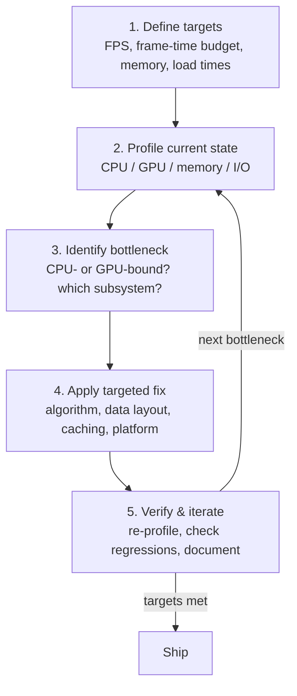

<div class="hero-section" style="background: linear-gradient(135deg, #667eea 0%, #764ba2 100%); color: white; padding: 3rem 2rem; margin: -2rem -3rem 2rem -3rem; text-align: center;">
  <h1 style="color: white; margin: 0; font-size: 2.5rem;">Performance Optimization</h1>
  <p style="font-size: 1.25rem; margin-top: 1rem; opacity: 0.9;">Master profiling-driven development, eliminate bottlenecks, and build responsive applications that scale</p>
</div>

<div class="hub-intro">
  <p class="lead">Master the art and science of performance optimization. From profiling-driven development to hardware-aware programming, learn systematic approaches to eliminate bottlenecks, achieve target frame rates, and build responsive applications that scale across platforms.</p>
</div>

Performance optimization is the systematic process of identifying and eliminating bottlenecks to achieve target frame rates, reduce latency, minimize memory usage, and improve overall application responsiveness. Effective optimization requires profiling-driven decisions, understanding hardware characteristics, and applying appropriate techniques at the right level of the software stack.

<div class="key-insights">
  <div class="insight-card"><i class="fas fa-chart-line"></i><h4>Measure before you cut</h4><p>Intuition about bottlenecks is usually wrong. Profile in a release build, on real workloads, before changing a line.</p></div>
  <div class="insight-card"><i class="fas fa-superscript"></i><h4>Big O beats micro-tuning</h4><p>An $O(n^2) \to O(n \log n)$ algorithmic fix dwarfs any amount of constant-factor hand-optimization.</p></div>
  <div class="insight-card"><i class="fas fa-memory"></i><h4>Memory is the modern bottleneck</h4><p>A cache miss costs ~200 cycles. Data-oriented layout (SoA) often beats raw compute optimization.</p></div>
  <div class="insight-card"><i class="fas fa-stopwatch-20"></i><h4>Budget, then defend it</h4><p>Convert your FPS target to a millisecond budget per frame, then track regressions in CI so wins don't erode.</p></div>
</div>

## Explore the Areas

This hub is a map. Each area below is a full guide with its own profilers, worked examples, and code — start with the one that matches your bottleneck, or follow a persona path below.

<div class="command-grid">
  <a href="cpu-optimization.html" class="nav-card">
    <h4><i class="fas fa-microchip"></i> CPU Optimization</h4>
    <p>Profile hot paths, respect the cache hierarchy, vectorize the inner loop, pool allocations, and scale across cores without false sharing.</p>
  </a>
  <a href="gpu-optimization.html" class="nav-card">
    <h4><i class="fas fa-tv"></i> GPU Optimization</h4>
    <p>Find your bound (fill-rate, geometry, bandwidth, or shader), batch draw calls, optimize shaders, and minimize CPU-GPU synchronization.</p>
  </a>
  <a href="memory-optimization.html" class="nav-card">
    <h4><i class="fas fa-memory"></i> Memory Optimization</h4>
    <p>Profile allocations, pool and arena-allocate to dodge the heap, fight fragmentation, stream assets within a budget, and lay out data for the cache.</p>
  </a>
  <a href="algorithmic-optimization.html" class="nav-card">
    <h4><i class="fas fa-superscript"></i> Algorithmic Optimization</h4>
    <p>Complexity analysis in practice, choosing the right data structure, spatial partitioning, caching, memoization, and amortization.</p>
  </a>
  <a href="platform-tuning.html" class="nav-card">
    <h4><i class="fas fa-mobile-alt"></i> Platform-Specific Tuning</h4>
    <p>Mobile thermals and power, console fixed-hardware tuning, PC scalability presets, and compiler profile-guided optimization (PGO).</p>
  </a>
  <a href="network-io-optimization.html" class="nav-card">
    <h4><i class="fas fa-network-wired"></i> Network &amp; I/O Optimization</h4>
    <p>Tame latency and bandwidth, pick the right protocol, batch and pipeline round trips, pool connections, and move bytes with zero-copy.</p>
  </a>
</div>

## Learning Paths

### Game/Real-time Developer Path
**Goal**: Achieve consistent 60/90/120 FPS for smooth gameplay

1. Establish baselines with profiling (see [Getting Started](#getting-started) below)
2. Master [CPU Optimization](cpu-optimization.html) techniques (cache optimization, multithreading)
3. Deep dive into [GPU Optimization](gpu-optimization.html) (draw calls, shader optimization)
4. Study [Memory Optimization](memory-optimization.html) for streaming and asset management
5. Apply [Platform-Specific Tuning](platform-tuning.html) for target consoles/mobile

**Key Focus**: Frame time budgets, low-level optimization, hardware awareness

### Backend/Server Developer Path
**Goal**: Maximize throughput and minimize latency under load

1. Begin with [Algorithmic Optimization](algorithmic-optimization.html) for Big O improvements
2. Study [CPU Optimization](cpu-optimization.html) for concurrent request handling
3. Learn [Memory Optimization](memory-optimization.html) for efficient data structures
4. Tame latency with [Network &amp; I/O Optimization](network-io-optimization.html)
5. Implement continuous performance testing in CI/CD

**Key Focus**: Scalability, algorithmic complexity, distributed systems performance

### Mobile Developer Path
**Goal**: Balance performance with battery life and thermal constraints

1. Understand power and thermal management in [Platform-Specific Tuning](platform-tuning.html)
2. Master [Memory Optimization](memory-optimization.html) for constrained environments
3. Study [GPU Optimization](gpu-optimization.html) for mobile GPUs (tile-based rendering)
4. Apply [Algorithmic Optimization](algorithmic-optimization.html) to reduce computational load
5. Focus on asset compression and streaming within a memory budget

**Key Focus**: Power efficiency, memory constraints, thermal throttling

### GPU/Graphics Programmer Path
**Goal**: Push visual fidelity while maintaining performance

1. Deep dive into [GPU Optimization](gpu-optimization.html) and profiling tools
2. Master shader optimization and GPU bottleneck analysis
3. Study draw-call batching and modern rendering techniques
4. Learn [Memory Optimization](memory-optimization.html) for texture and mesh data
5. Explore advanced techniques in our [3D Graphics &amp; Rendering](../graphics/3d-rendering.html) guide

**Key Focus**: Rendering pipelines, GPU architecture, graphics APIs

## Getting Started

### Prerequisites

**Essential Knowledge:**
- Basic understanding of your target platform architecture (CPU/GPU)
- Familiarity with your development environment's debugging tools
- Understanding of algorithmic complexity (Big O notation)
- Basic statistics for interpreting profiling data

**Recommended Background:**
- Experience with the target language (C++, C#, Java, etc.)
- Understanding of memory management concepts
- Basic knowledge of multithreading and concurrency
- Familiarity with graphics APIs (for graphics optimization)

### First Steps for Profiling

**1. Define Your Performance Budget:**
```
Frame Rate Target → Frame Time Budget
- 30 FPS → 33.33 ms per frame
- 60 FPS → 16.67 ms per frame
- 90 FPS → 11.11 ms per frame (VR)
- 120 FPS → 8.33 ms per frame
```

**2. Profile Before Optimizing:**
- Run your application in Release/Production configuration
- Identify the actual bottleneck (don't assume)
- Collect baseline metrics across multiple runs
- Profile worst-case scenarios, not just average cases

**3. Start with the Biggest Win:**
- Fix algorithmic issues first (O(n²) → O(n log n))
- Then optimize hot paths revealed by profiling
- Avoid micro-optimizations until necessary
- Always verify improvements with re-profiling

**4. Document and Track:**
- Record baseline performance metrics
- Document each optimization attempt and result
- Track performance over time in version control
- Set up automated performance regression tests

## Optimization Philosophy

### The Golden Rules

1. **Measure first, optimize second**: Never optimize without profiling data
2. **Optimize the bottleneck**: Find the actual constraint, not assumed ones
3. **Big O matters**: Algorithmic improvements beat micro-optimizations
4. **Hardware awareness**: Understand your target platform's characteristics
5. **Trade-offs exist**: Time vs space, quality vs performance, development time vs runtime

### The Optimization Process

Optimization is a disciplined loop, not a one-shot effort. Each pass targets the current bottleneck, verifies the win, and repeats — because fixing the top bottleneck simply promotes the next one.



## Tools Overview

Profiling-driven development starts with the right instrument for the bottleneck you suspect. The table below maps the common, production-grade profilers to their category and platform; each area guide goes deeper on how to read their output and which metrics matter.

| Category | Tool | Platform | Notes |
|----------|------|----------|-------|
| **CPU** | Visual Studio Profiler | Windows | CPU and memory analysis, integrated debugging |
| **CPU** | Instruments | macOS / iOS | Time Profiler, system trace, allocations |
| **CPU** | perf | Linux | Hardware performance counters, flame graphs |
| **CPU** | Intel VTune | Windows / Linux | Microarchitectural and threading deep analysis |
| **CPU** | Superluminal | Windows | Low-overhead sampling, multithreaded timelines |
| **GPU** | RenderDoc | Cross-platform | Frame capture, draw-call and pipeline inspection |
| **GPU** | NVIDIA Nsight | NVIDIA GPUs | Occupancy, memory bandwidth, shader profiling |
| **GPU** | AMD Radeon GPU Profiler | AMD GPUs | Wavefront occupancy and pipeline analysis |
| **GPU** | PIX | Xbox / Windows | GPU and CPU capture for D3D12 |
| **GPU** | Xcode GPU Debugger | Apple platforms | Metal frame capture and shader profiling |
| **Memory** | Valgrind (Massif/Memcheck) | Linux | Heap profiling and leak/error detection |
| **Memory** | AddressSanitizer (ASan) | Cross-platform | Compiler-instrumented use-after-free and overflow detection |
| **Memory** | Visual Studio Memory Profiler | Windows | Snapshot diffing and allocation tracking |
| **Memory** | Instruments (Allocations/Leaks) | macOS / iOS | Allocation graphs and leak detection |
| **Network/I/O** | Wireshark | Cross-platform | Packet capture and protocol-level analysis |
| **Network/I/O** | tcpdump | Linux / macOS | Lightweight CLI packet capture |
| **Network/I/O** | iperf3 | Cross-platform | Throughput and bandwidth benchmarking |
| **Network/I/O** | strace / dtrace / eBPF | Linux / macOS | Syscall and I/O-latency tracing |

> Engine-integrated profilers — **Unreal Insights**, the **Unity Profiler**, and custom in-engine timing systems — complement these by attributing cost to gameplay systems rather than raw functions. Use them together: the platform profiler tells you *what* is slow, the engine profiler tells you *which feature* caused it.

## Key Takeaways

<div class="takeaway-grid">
  <div class="takeaway-card"><h4>Profile, don't guess</h4><p>Always measure in a release build on representative, worst-case workloads before optimizing anything.</p></div>
  <div class="takeaway-card"><h4>Fix the biggest win first</h4><p>Algorithmic complexity, then the hottest path the profiler reveals. Defer micro-optimizations until they're justified.</p></div>
  <div class="takeaway-card"><h4>Respect the memory hierarchy</h4><p>Cache-friendly data-oriented layouts and pooling often beat raw compute changes by avoiding ~200-cycle misses.</p></div>
  <div class="takeaway-card"><h4>Know your bound</h4><p>CPU- vs GPU-bound, fill-rate vs geometry vs bandwidth — the bottleneck class dictates which fixes matter.</p></div>
  <div class="takeaway-card"><h4>Optimize per platform</h4><p>Mobile fights thermals and battery; consoles offer fixed hardware; PC demands scalable quality settings.</p></div>
  <div class="takeaway-card"><h4>Guard against regressions</h4><p>Automated performance tests in CI catch the slow creep of frame-time and memory regressions over time.</p></div>
</div>

## Related Documentation

### Graphics and Game Development
- [Game Development](../gamedev/) - Game development fundamentals and workflows
- [3D Graphics & Rendering](../graphics/3d-rendering.html) - Advanced rendering techniques and optimization
- [Unreal Engine](../technology/unreal.html) - UE5 profiling tools and performance guidelines
- [VR/AR Development](../vr-ar/) - VR performance requirements and optimization strategies

### Systems and Infrastructure
- [Docker](../technology/docker/) - Container performance optimization
- [Kubernetes](../technology/kubernetes/) - Cluster performance and resource optimization
- [Distributed Systems Theory](../advanced/distributed-systems-theory/) - Theoretical foundations for distributed performance

### Cross-Cutting Topics
- [Advanced Research Topics](../advanced/) - Graduate-level systems and theory
- [Quantum Computing](../technology/quantumcomputing.html) - Quantum algorithm optimization

---

*This performance optimization guide combines theoretical foundations with practical, production-tested techniques. For suggestions or contributions, visit our [GitHub repository](https://github.com/AndrewAltimit/Documentation).*
</content>
</invoke>
