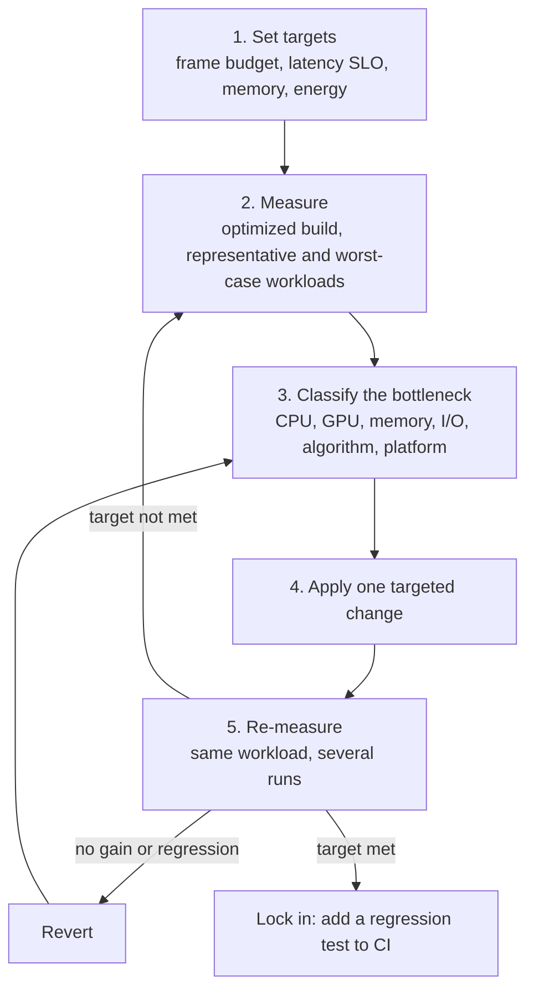

  <h1 style="color: white; margin: 0; font-size: 2.5rem;">Performance Optimization</h1>
  
Profiling-driven techniques for faster, leaner, more responsive software

**Performance optimization** is the practice of finding what limits a program's speed, latency, memory use, or energy consumption, and removing that limit. This section treats it as an engineering loop: set a budget, measure against it, identify the bottleneck, apply a targeted change, and verify. The guides below cover each layer of the stack, from algorithm choice down to cache lines, GPU passes, network round trips, and compiler flags. Examples lean toward real-time applications (games, rendering, interactive tools) and backend services, the two settings where budgets are most explicit.

Four principles apply throughout:

| Principle | In practice |
|-----------|-------------|
| **Measure before changing anything** | Intuition about bottlenecks is frequently wrong. Profile an optimized build on representative, worst-case workloads. |
| **Fix the largest cost first** | An algorithmic change from $O(n^2)$ to $O(n \log n)$ outweighs any amount of constant-factor tuning; after that, work down the profile. |
| **Respect the memory hierarchy** | A DRAM access costs hundreds of cycles, so data layout and access order often matter more than instruction count. |
| **Set a budget and defend it** | Convert targets into milliseconds, bytes, or requests per second, and track them in CI so gains are not lost to gradual regressions. |

## Guides

  <a href="cpu-optimization.html" class="nav-card">
    <h4><i class="fas fa-microchip"></i> CPU Optimization</h4>
    
Profiling hot paths, cache behavior, branch prediction, SIMD vectorization, and multithreading without false sharing.

  </a>
  <a href="gpu-optimization.html" class="nav-card">
    <h4><i class="fas fa-tv"></i> GPU Optimization</h4>
    
Identifying the bound (geometry, fill rate, bandwidth, or shader), reducing draw-call and state-change overhead, and avoiding CPU-GPU stalls.

  </a>
  <a href="memory-optimization.html" class="nav-card">
    <h4><i class="fas fa-memory"></i> Memory Optimization</h4>
    
Allocation profiling, arenas, pools and std::pmr, fragmentation, data-oriented layout, huge pages, and asset streaming within a budget.

  </a>
  <a href="algorithmic-optimization.html" class="nav-card">
    <h4><i class="fas fa-superscript"></i> Algorithmic Optimization</h4>
    
Complexity analysis in practice, choosing data structures, spatial partitioning, caching, memoization, and amortization.

  </a>
  <a href="platform-tuning.html" class="nav-card">
    <h4><i class="fas fa-mobile-alt"></i> Platform-Specific Tuning</h4>
    
Mobile thermals and power, fixed console hardware, PC scalability and upscaling, and compiler optimizations: LTO, PGO, and BOLT.

  </a>
  <a href="network-io-optimization.html" class="nav-card">
    <h4><i class="fas fa-network-wired"></i> Network &amp; I/O Optimization</h4>
    
Latency and bandwidth, TCP/QUIC/HTTP choice, batching and pooling, storage queue depth, the page cache, io_uring, and zero-copy.

  </a>

### Where to Start

| Symptom | Likely bottleneck | Start with |
|---------|-------------------|------------|
| Main-thread frame time over budget; GPU partly idle | CPU | [CPU Optimization](cpu-optimization.html) |
| GPU busy for the whole frame; lowering resolution helps | GPU (fill rate, bandwidth, or shaders) | [GPU Optimization](gpu-optimization.html) |
| Runtime grows much faster than input size | Algorithm or data structure | [Algorithmic Optimization](algorithmic-optimization.html) |
| High cache-miss rates, allocation hotspots, rising RSS, out-of-memory kills | Memory | [Memory Optimization](memory-optimization.html) |
| Low CPU use but high latency; threads blocked in syscalls | Network or storage I/O | [Network & I/O Optimization](network-io-optimization.html) |
| Fast at first, slower after minutes; good on one device, poor on another | Thermal limits or hardware variance | [Platform-Specific Tuning](platform-tuning.html) |
| Periodic hitches rather than uniformly slow frames | Garbage collection, shader compilation, streaming, or lock contention | Frame-timeline profiler, then the matching guide |

## Budgets

Performance work needs a numeric target. For real-time applications it is a frame-time budget:

$$t_{\text{frame}} = \frac{1000 \ \text{ms}}{\text{target FPS}}$$

| Target | Frame budget | Typical context |
|--------|--------------|-----------------|
| 30 FPS | 33.33 ms | Mobile battery-saver modes, cinematic console modes |
| 60 FPS | 16.67 ms | Standard for action games and smooth UI |
| 90 FPS | 11.11 ms | Minimum comfortable VR on many headsets |
| 120 FPS | 8.33 ms | High-refresh displays, performance modes, some VR |
| 240 FPS | 4.17 ms | Competitive esports titles |

The budget is divided among subsystems (for example: simulation 4 ms, animation 2 ms, render submission 3 ms, with the GPU running in parallel), and each owner is accountable for their share. Aim below the budget: the worst frames, not the average, determine perceived smoothness, so track **percentile frame times** (p95, p99, "1% lows") rather than average FPS.

Services use the same idea with different units: a **latency SLO** (for example, p99 below 200 ms), a throughput target, and a cost-per-request ceiling. As in frame budgets, tail percentiles matter more than means.

### Amdahl's Law

The benefit of optimizing one part of a program is bounded by that part's share of the total. If a fraction $p$ of the runtime is sped up by a factor $s$, the overall speedup is

$$S = \frac{1}{(1 - p) + \dfrac{p}{s}}$$

Making a function that takes 10% of the frame infinitely fast gains at most about 11%. The same law limits parallel scaling: with 5% serial work, no number of cores yields more than a 20x speedup. Profiles show where $p$ is large enough to matter.

## The Optimization Loop

Each pass targets the current bottleneck, verifies the gain, and repeats, because removing one bottleneck exposes the next.

Measurement practice:

- **Profile optimized builds.** Unoptimized builds have different hotspots. Use release builds with debug symbols and frame pointers.
- **Measure repeatedly.** Run-to-run variance from clock boosting, thermal state, background processes, and caches can exceed the effect being measured. Report medians and percentiles over several runs; pin CPU frequency or control for it where possible.
- **Profile worst cases**, such as the densest scene, the largest customer, or cold caches after startup, not only the average path.
- **Change one thing at a time**, so each gain or regression is attributable.
- **Automate regression detection.** Run benchmarks in CI on consistent hardware and alert on statistically significant changes; continuous profiling in production (Grafana Pyroscope, Parca, Google Cloud Profiler, Datadog) catches regressions that synthetic benchmarks miss.

## Profiling Tools

Choose the instrument that matches the suspected bottleneck. Each guide explains how to read its tools' output.

| Category | Tool | Platform | Notes |
|----------|------|----------|-------|
| **CPU** | `perf` | Linux | Sampling with hardware counters; basis for flame graphs; `perf stat` for top-down metrics |
| **CPU** | Intel VTune Profiler | Windows, Linux | Microarchitecture and threading analysis |
| **CPU** | AMD uProf | Windows, Linux | Counter-based analysis on AMD CPUs |
| **CPU** | Visual Studio Profiler, Windows Performance Analyzer (ETW) | Windows | Sampling, instrumentation, and system-wide traces |
| **CPU** | Instruments | macOS, iOS | Time Profiler, CPU counters, system trace |
| **CPU** | Superluminal, samply | Windows / cross-platform | Low-overhead samplers with timeline views |
| **Frame timeline** | Tracy | Cross-platform | Instrumented, nanosecond-resolution CPU/GPU timelines; widely used in games |
| **Frame timeline** | Perfetto | Android, Linux, Chrome | System-wide tracing with scheduling, frequency, and thermal data |
| **Engine** | Unreal Insights, Unity Profiler | Engine-specific | Attribute cost to gameplay systems and assets |
| **GPU** | RenderDoc | Cross-platform | Frame capture and inspection (debugging rather than timing) |
| **GPU** | NVIDIA Nsight Graphics / Nsight Systems | NVIDIA GPUs | GPU trace, shader profiling, CPU-GPU timeline |
| **GPU** | Radeon GPU Profiler | AMD GPUs | Wavefront occupancy, barriers, pipeline analysis |
| **GPU** | PIX | Windows, Xbox | D3D12 GPU captures and timing |
| **GPU** | Xcode Metal debugger | Apple platforms | Metal frame capture, shader cost, GPU counters |
| **GPU** | Android GPU Inspector, Snapdragon Profiler, Arm Performance Studio | Android | Mobile GPU counters and render-pass analysis |
| **Memory** | heaptrack, Valgrind (Massif, DHAT) | Linux | Allocation profiling and heap-over-time analysis |
| **Memory** | AddressSanitizer / LeakSanitizer | Clang, GCC, MSVC | Leaks, overflows, use-after-free in CI |
| **Memory** | Instruments (Allocations, Leaks), Visual Studio memory tools | macOS/iOS, Windows | Snapshot diffing and allocation call stacks |
| **I/O and system** | bpftrace, BCC tools, `strace`, `perf trace` | Linux | Syscall latency, block I/O latency, off-CPU time |
| **Network** | Wireshark, `tcpdump`, `ss`, `iperf3` | Cross-platform / Linux | Packet capture, socket state, throughput testing |
| **Storage** | `fio`, `iostat` | Linux (fio is cross-platform) | Device IOPS, throughput, and latency at varying queue depths |
| **Microbenchmarks** | Google Benchmark, Criterion (Rust), BenchmarkDotNet, JMH | Language-specific | Statistically sound benchmarks of small units |

A platform profiler shows *which functions* are slow; an engine or application-level profiler shows *which feature* caused the work. Use both.

## Learning Paths

| Path | Goal | Suggested order |
|------|------|-----------------|
| **Games and real-time** | Stable 60/90/120 FPS | [CPU](cpu-optimization.html) (cache, threading), then [GPU](gpu-optimization.html) (draw calls, shaders), [Memory](memory-optimization.html) (streaming, budgets), [Platform](platform-tuning.html) (consoles, mobile, PC scaling) |
| **Backend and services** | Throughput and tail latency under load | [Algorithmic](algorithmic-optimization.html), then [Network & I/O](network-io-optimization.html), [CPU](cpu-optimization.html) (concurrency), [Memory](memory-optimization.html) (allocators, GC pressure) |
| **Mobile** | Sustained performance within power and memory limits | [Platform](platform-tuning.html) (thermals, power APIs), then [Memory](memory-optimization.html), [GPU](gpu-optimization.html) (tile-based GPUs), [Algorithmic](algorithmic-optimization.html) |
| **Graphics programming** | Higher fidelity within the frame budget | [GPU](gpu-optimization.html), then [Memory](memory-optimization.html) (textures, meshes), [Platform](platform-tuning.html) (upscaling), [3D Graphics & Rendering](../graphics/3d-rendering.html) |

Useful background for all paths: CPU and memory architecture basics, Big-O notation, basic statistics for reading noisy measurements, and the debugging and profiling tools of your development environment.

## Related Documentation

- [Game Development](../gamedev/) - engine architecture and production workflows
- [3D Graphics & Rendering](../graphics/3d-rendering.html) - rendering techniques and their costs
- [Unreal Engine](../technology/unreal.html) - Unreal Insights, scalability settings, and platform profiling
- [VR/AR Development](../vr-ar/) - frame-rate and latency requirements for head-mounted displays
- [Observability](../observability/) - metrics, logs, and traces for production performance
- [Docker](../technology/docker/) and [Kubernetes](../technology/kubernetes/) - resource limits and container performance
- [Distributed Systems Theory](../advanced/distributed-systems-theory/) - latency, consistency, and coordination costs
- [Advanced Topics](../advanced/) - complexity theory and other theoretical foundations
