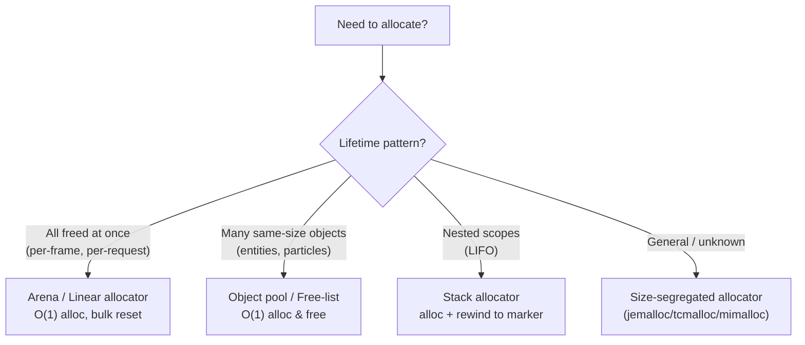

<div class="hero-section" style="background: linear-gradient(135deg, #667eea 0%, #764ba2 100%); color: white; padding: 3rem 2rem; margin: -2rem -3rem 2rem -3rem; text-align: center;">
  <h1 style="color: white; margin: 0; font-size: 2.5rem;">Memory Optimization</h1>
  <p style="font-size: 1.25rem; margin-top: 1rem; opacity: 0.9;">Profile allocations, pool and arena-allocate to avoid the heap, fight fragmentation, stream assets within a budget, and lay out data so the cache works for you.</p>
</div>

[Performance Optimization](./) &raquo; Memory Optimization

<div class="intro-card">
  <p class="lead-text">On modern hardware, memory — not raw compute — is the dominant cost. A single L1-cache hit costs ~4 cycles; a miss to main memory costs ~200. That two-orders-of-magnitude cliff means how you <em>arrange</em> and <em>allocate</em> data often matters more than the arithmetic you run on it. Memory optimization is therefore two disciplines woven together: keeping the working set small and contiguous so the cache hierarchy serves it cheaply, and managing the lifetime of allocations so you avoid heap overhead, fragmentation, and the unpredictable stalls of <code>malloc</code>/<code>free</code> on a hot path. This page covers memory profiling, allocation strategies (pools, arenas, free-lists), fragmentation, asset streaming and compression, and cache locality — the techniques that turn a memory-bound program back into a compute-bound one.</p>
</div>

<div class="key-insights">
  <div class="insight-card">
    <i class="fas fa-memory"></i>
    <h4>A cache miss costs ~200 cycles</h4>
    <p>The memory hierarchy spans two orders of magnitude. Contiguous, predictable access patterns are the single biggest lever you have.</p>
  </div>
  <div class="insight-card">
    <i class="fas fa-layer-group"></i>
    <h4>The heap is a hot-path liability</h4>
    <p>General-purpose <code>malloc</code> takes locks, walks free-lists, and fragments. Pools and arenas replace it with pointer bumps.</p>
  </div>
  <div class="insight-card">
    <i class="fas fa-puzzle-piece"></i>
    <h4>Fragmentation kills long-running processes</h4>
    <p>You can have gigabytes free and still fail a 1 MB allocation. Size-segregated and relocating allocators defend against it.</p>
  </div>
  <div class="insight-card">
    <i class="fas fa-stream"></i>
    <h4>Stream within a budget</h4>
    <p>You can't hold every asset in RAM. Prioritized, async streaming keeps the visible set resident and evicts the rest.</p>
  </div>
</div>

## Memory Profiling

You cannot optimize what you have not measured. Before changing a single allocation, profile to answer five concrete questions:

- **How much** memory is allocated (peak and steady-state)?
- **What types** of allocations dominate (which subsystem, which object type, which size class)?
- **Where** are allocations happening (call stacks, frequency, transient vs persistent)?
- **Are there leaks** — allocations whose live count grows monotonically over time?
- **What is the fragmentation level** — how much address space is reserved versus actually live?

### Tools

| Tool | Platform | Strengths |
|------|----------|-----------|
| Valgrind (Massif/Memcheck) | Linux | Heap profiling, leak detection, use-after-free |
| AddressSanitizer (ASan) | Cross-platform | Fast leak/overflow detection in CI |
| Visual Studio Memory Profiler | Windows | Snapshots, diff between snapshots, allocation call stacks |
| Instruments (Allocations/Leaks) | macOS/iOS | Live allocation graph, generation analysis |
| `heaptrack` / `jemalloc` stats | Linux | Low-overhead allocation tracing and fragmentation metrics |
| Platform memory APIs | Console/mobile | Authoritative budgets, residency, OS-level pressure events |

### Snapshot Diffing

The most reliable way to find a leak is the **three-snapshot pattern**: take a baseline, perform a repeatable operation (open a level, run a request), return to the baseline state, and take a second snapshot. Anything live in the diff that should have been freed is a leak. Repeat the operation N times — a leak grows linearly with N, while a one-time allocation stays flat.

```cpp
// A minimal tracking allocator to attribute allocations by tag.
// Wrap your real allocator; in profiling builds, record call sites.
struct AllocStats {
    std::atomic<size_t> live_bytes{0};
    std::atomic<size_t> live_count{0};
    std::atomic<size_t> peak_bytes{0};
};

AllocStats g_stats[NUM_TAGS];

void* tracked_alloc(size_t n, Tag tag) {
    void* p = ::operator new(n + sizeof(size_t) + sizeof(Tag));
    *reinterpret_cast<size_t*>(p) = n;
    *reinterpret_cast<Tag*>((char*)p + sizeof(size_t)) = tag;

    size_t live = g_stats[tag].live_bytes.fetch_add(n) + n;
    g_stats[tag].live_count.fetch_add(1);
    // Track high-water mark.
    size_t prev_peak = g_stats[tag].peak_bytes.load();
    while (live > prev_peak &&
           !g_stats[tag].peak_bytes.compare_exchange_weak(prev_peak, live)) {}

    return (char*)p + sizeof(size_t) + sizeof(Tag);
}
```

### Pitfalls

- **Debug allocators lie about size.** Debug heaps add guard bytes and fill patterns; measure peak memory in a release configuration.
- **The profiler perturbs the workload.** Allocation tracing adds per-call overhead; use sampling profilers for steady-state characterization and full tracing only for leak hunts.
- **Reserved is not resident.** A large `reserve()` or memory-mapped region inflates virtual address space without touching physical pages. Track RSS (resident set size), not just VSZ.

## Allocation Strategies

The general-purpose allocator (`malloc`/`new`) is a marvel of generality, and generality is exactly why it is slow on a hot path: it must handle any size, be thread-safe (locks or per-thread arenas), search free-lists, split and coalesce blocks, and return memory to the OS. Specialized allocators win by exploiting what you know about your allocation pattern.



### Arena (Linear / Bump) Allocator

The simplest fast allocator: hold a pointer into a fixed buffer, advance it on each allocation, and free everything at once by resetting the pointer. Allocation is a pointer add (and an alignment round-up); there is no per-object free, so there is **zero fragmentation** and the access pattern is perfectly sequential.

```cpp
class ArenaAllocator {
    char*  base_;
    size_t capacity_;
    size_t offset_ = 0;

public:
    ArenaAllocator(void* buffer, size_t capacity)
        : base_(static_cast<char*>(buffer)), capacity_(capacity) {}

    void* allocate(size_t size, size_t align = alignof(std::max_align_t)) {
        size_t aligned = (offset_ + align - 1) & ~(align - 1);
        if (aligned + size > capacity_) return nullptr;   // arena exhausted
        void* p = base_ + aligned;
        offset_ = aligned + size;
        return p;
    }

    // Free EVERYTHING in O(1). Caller guarantees no live pointers remain.
    void reset() { offset_ = 0; }
};
```

This is the canonical **frame allocator**: allocate all scratch data for a frame from the arena, then `reset()` at frame end. It is also ideal for parsing, request handling, and any "allocate a burst, drop it all together" pattern. The cost — you cannot free a single object — is exactly what makes it fast.

### Stack Allocator

A variant that supports LIFO frees via markers, giving you nested scopes without the all-or-nothing reset:

```cpp
class StackAllocator {
    char* base_; size_t capacity_; size_t offset_ = 0;
public:
    using Marker = size_t;
    Marker mark() const { return offset_; }
    void   rewind(Marker m) { offset_ = m; }   // free everything above the marker

    void* allocate(size_t size, size_t align) {
        size_t aligned = (offset_ + align - 1) & ~(align - 1);
        if (aligned + size > capacity_) return nullptr;
        offset_ = aligned + size;
        return base_ + aligned;
    }
};
```

### Object Pool (Free-List)

When you repeatedly allocate and free many objects of the **same type**, a pool pre-allocates a fixed block and threads a free-list through the unused slots. Both `allocate` and `deallocate` are O(1), there is no fragmentation (all slots are identical size), and the storage is contiguous and cache-friendly.

```cpp
template<typename T, size_t PoolSize>
class ObjectPool {
    alignas(T) char storage_[PoolSize * sizeof(T)];
    T* free_list_;

public:
    ObjectPool() {
        // Thread a singly-linked free-list through the raw slots.
        free_list_ = reinterpret_cast<T*>(storage_);
        for (size_t i = 0; i < PoolSize - 1; ++i) {
            T* slot = reinterpret_cast<T*>(storage_) + i;
            *reinterpret_cast<T**>(slot) = slot + 1;
        }
        *reinterpret_cast<T**>(reinterpret_cast<T*>(storage_) + PoolSize - 1) = nullptr;
    }

    T* allocate() {
        if (!free_list_) return nullptr;            // pool exhausted
        T* obj = free_list_;
        free_list_ = *reinterpret_cast<T**>(free_list_);
        return obj;                                 // caller placement-news into it
    }

    void deallocate(T* obj) {
        *reinterpret_cast<T**>(obj) = free_list_;   // push back onto the free-list
        free_list_ = obj;
    }
};
```

The free-list pointer is stored *inside* the freed slot (an intrusive list), so the pool needs no extra metadata. The pattern generalizes to a **block-pool** that grows by chaining additional fixed-size blocks when the first is exhausted, trading strict capacity for amortized O(1) growth.

### Sizing and Alignment

- **Over-allocate, don't grow on the hot path.** Size pools and arenas for the worst case so the hot path never falls back to `malloc`.
- **Align to cache lines (64 bytes)** for hot objects to avoid false sharing between threads writing adjacent objects.
- **Page-align large arenas** so the OS can map them efficiently and you can use huge pages where available.

## Fragmentation

Fragmentation is the silent killer of long-running processes (servers, game sessions, editors). You can have far more total free memory than a request needs and still fail it, because no single free region is contiguous enough.

- **External fragmentation**: free memory is split into many small, non-adjacent holes. A 1 MB request fails even with 2 GB free, because the largest hole is 512 KB.
- **Internal fragmentation**: an allocator rounds requests up to a size class (e.g. a 33-byte request consumes a 48-byte slot), wasting the slack inside each block.

```
External fragmentation: lots free, none usable for a big request
┌──────┬──────┬──────┬──────┬──────┬──────┬──────┐
│ USED │ free │ USED │ free │ USED │ free │ USED │
└──────┴──────┴──────┴──────┴──────┴──────┴──────┘
   request for ────────────────────► no contiguous hole fits it
```

### Mitigations

| Strategy | How it helps | Cost |
|----------|--------------|------|
| **Pools / arenas** | Uniform sizes mean every free block is reusable | Wasted slack if sizes vary |
| **Size-segregated allocators** (jemalloc, tcmalloc, mimalloc) | Separate free-lists per size class confine fragmentation | Some internal fragmentation per class |
| **Slab allocation** | Caches of fully-constructed fixed-size objects | Per-type setup |
| **Compacting / relocating GC** | Moves live objects to coalesce free space | Requires indirection (handles), pause time |
| **Handle indirection** | Refer to objects by handle, not pointer, so they can be relocated | Extra dereference |

A **relocating allocator** sidesteps external fragmentation entirely: hold objects behind handles (an index into a table of current addresses) rather than raw pointers, and periodically slide live objects toward the start of the heap, updating the table. This is how many garbage collectors and asset heaps keep a long-lived process from fragmenting — at the price of one extra indirection per access and occasional compaction work.

### Measuring Fragmentation

A simple, useful metric is `1 - (largest_free_block / total_free)`. Near 0 means free memory is essentially one contiguous block; near 1 means it is shattered into many small holes. Track it over time; a rising trend predicts an out-of-memory failure long before it happens.

## Cache Locality

Allocation strategy controls *when* memory is touched; data layout controls *how expensively* each touch resolves through the cache hierarchy.

```
CPU Core
├── L1 Cache: 32-64 KB,  ~4 cycles
├── L2 Cache: 256-512 KB, ~12 cycles
├── L3 Cache: 8-32 MB,    ~40 cycles
└── Main Memory: GBs,     ~200 cycles

Cache Line: 64 bytes (typical)
```

Memory moves between levels in **cache lines** of 64 bytes. Touch one byte and the whole 64-byte line is loaded. The optimization goal is therefore to make every loaded line *useful*: pack the data you actually read together, and walk it in order so the hardware prefetcher can stay ahead of you.

### Data-Oriented Design: AoS vs SoA

The classic transformation is **Array of Structures (AoS) to Structure of Arrays (SoA)**. When a loop only touches a few fields of a large object, AoS drags the cold fields into cache on every line load; SoA stores each field contiguously so the loop reads only hot data.

```cpp
// Cache-unfriendly (Array of Structures)
struct Entity {
    Vector3 position;    // Used every frame
    Vector3 velocity;    // Used every frame
    String  name;        // Rarely used
    Texture* icon;       // Rarely used
    float   health;      // Used every frame
    // ... more fields
};
Entity entities[1000];   // each iteration loads name/icon it never reads

// Cache-friendly (Structure of Arrays)
struct EntityData {
    Vector3 positions[1000];   // Contiguous hot data
    Vector3 velocities[1000];  // Contiguous hot data
    float   healths[1000];     // Contiguous hot data
};
struct EntityMetadata {
    String   names[1000];      // Separate cold data
    Texture* icons[1000];
};
```

With SoA, an integration loop over `positions` and `velocities` reads two tightly packed streams; the prefetcher sees the linear pattern and hides the latency entirely, turning a memory-bound loop into a compute-bound one.

### Locality Principles

- **Spatial locality**: lay out data you read together, together. Prefer contiguous arrays over node-based structures (a linked list scatters nodes across the heap; each `->next` is a likely miss).
- **Temporal locality**: reuse data while it is still hot. Tile and block your loops so a working set fits in L1/L2 before moving on.
- **Avoid pointer chasing**: indices into a flat array beat pointers — they are smaller (cache-denser) and relocatable.
- **Mind false sharing**: two threads writing different variables on the *same* cache line ping-pong the line between cores. Pad per-thread data to a cache line.
- **Hot/cold splitting**: move rarely-touched fields out of the hot struct (as in the `EntityMetadata` split above) so hot lines carry only frequently-used data.

### Access-Pattern Wins

| Pattern | Why it is fast |
|---------|----------------|
| Sequential array scan | Perfect prefetch, every line fully used |
| SoA over hot fields | No cold data pollutes the cache |
| Index-based references | Denser than pointers, relocatable |
| Cache-line-padded thread data | No false sharing |
| Sorted/grouped processing | Batches similar work, reuses warm state |

## Asset Memory and Compression

For games and media applications, the bulk of memory is *content* — textures, meshes, audio — not program state. The biggest wins come from storing that content in compressed, GPU- or codec-native formats rather than naive uncompressed buffers.

### Texture Compression

Block-compressed formats are decoded *by the GPU's texture units on the fly*, so they save both memory and bandwidth with no decode step on the CPU:

| Format | Bits/Pixel | Use Case |
|--------|------------|----------|
| RGBA8 | 32 | Uncompressed, high quality reference |
| BC1/DXT1 | 4 | Opaque textures (8:1 vs RGBA8) |
| BC3/DXT5 | 8 | Textures with alpha |
| BC7 | 8 | High quality, modern desktop GPUs |
| ASTC | 1-8 | Mobile, variable block size/quality |
| ETC2 | 4-8 | Mobile baseline (OpenGL ES) |

A 4096x4096 RGBA8 texture is 64 MB; the same texture in BC1 is 8 MB — an 8:1 reduction that also cuts the memory bandwidth needed to sample it. **Mipmaps** add another lever: pre-filtered downscales not only improve sampling quality but ensure the GPU reads only the resolution it needs for a given screen size, reducing the resident bandwidth for distant objects.

### Mesh Optimization

- Remove unused/duplicate vertices and degenerate triangles.
- **Optimize index order for the vertex cache** (e.g. Forsyth/Tom Forsyth's algorithm) so the GPU's post-transform cache reuses recently transformed vertices.
- Use **16-bit indices** when a mesh has fewer than 65,536 vertices (halves index buffer size).
- **Quantize and compress vertex attributes**: 16-bit or 8-bit normalized values for normals, tangents, and UVs are usually indistinguishable from float32 and halve the vertex stream.
- Strip LODs appropriately so distant objects use cheaper meshes.

### Disk vs Runtime Compression

Distinguish two compression regimes:

- **Disk compression** (zlib, LZ4, Zstandard, Oodle) shrinks the *download and install footprint* and is decompressed during loading. Favor a fast decompressor (LZ4/Zstd) so decode does not bottleneck loading.
- **Runtime compression** (BCn/ASTC textures, ADPCM/Opus audio) keeps the asset compressed *in RAM/VRAM* and is decoded by hardware on use. This is what saves resident memory.

The ideal pipeline ships assets that are *both*: a GPU-native runtime format (BC7) further wrapped in a fast disk codec (Zstd) for transport, decompressed once at load into the BC7 buffer that lives in VRAM.

## Streaming and Loading

You cannot hold every asset in memory at once, so the resident set must be managed dynamically: load what is (or is about to be) needed, and evict what is not — all without stalling the main thread.

```
Priority Queue:
1. Currently visible assets         (must be resident now)
2. Predicted soon-visible           (based on camera movement / proximity)
3. Recently visible                 (might return; evict last)
4. Background / low-priority         (load opportunistically)

Budget Management:
- Total memory limit
- Per-category limits  (textures / meshes / audio)
- Emergency unloading thresholds  (evict aggressively under pressure)
```

### Loading Strategies

- **Async loading.** Never block the main/render thread on disk I/O. Issue reads on worker threads or via async file APIs and integrate the result when ready.
- **Prioritized queues.** Order pending loads by visibility and proximity so the most-needed assets resolve first; cancel stale requests (an asset that left the view before it loaded).
- **Compressed on disk, decompress on load.** Trade a little CPU for far less I/O time — disk is usually the bottleneck, so a fast decompressor net-wins.
- **Memory-mapped files** for very large, randomly-accessed assets let the OS page data in on demand and share it across processes, at the cost of page-fault latency on first touch.
- **Mip streaming.** Keep only the mip levels a texture currently needs resident; stream in higher-resolution mips as an object approaches and evict them as it recedes. This is one of the highest-leverage memory techniques in open-world rendering.

### Budgeting and Eviction

Set a hard total budget and per-category sub-budgets, then drive eviction with a priority policy — typically LRU (least-recently-used) weighted by visibility. When usage approaches the limit, evict from the lowest priority tier first; when an OS memory-pressure warning fires, cross the **emergency threshold** and evict aggressively, dropping to lower-resolution mips and unloading off-screen content rather than risking a hard out-of-memory termination.

```cpp
// Sketch: budget-driven eviction on a priority/LRU policy.
void enforce_budget(AssetCache& cache, size_t budget) {
    while (cache.resident_bytes() > budget) {
        Asset* victim = cache.lowest_priority_lru();   // off-screen, oldest
        if (!victim) break;                            // nothing evictable
        cache.evict(victim);                           // drop bytes / lower mip
    }
}
```

## Key Takeaways

<div class="takeaway-grid">
  <div class="takeaway-card"><h4>Profile before you allocate-tune</h4><p>Use snapshot diffing to find leaks and attribute allocations by subsystem; measure peak RSS in a release build, not reserved virtual size in debug.</p></div>
  <div class="takeaway-card"><h4>Match the allocator to the lifetime</h4><p>Arenas for "free it all at once", pools for many same-size objects, stack allocators for nested scopes — each turns allocation into an O(1) pointer move.</p></div>
  <div class="takeaway-card"><h4>Fragmentation is a real failure mode</h4><p>Track largest-free-block ratio; defend long-running processes with size-segregated or relocating (handle-based) allocators.</p></div>
  <div class="takeaway-card"><h4>Lay out for the cache</h4><p>SoA over hot fields, contiguous arrays over pointer-chasing, cache-line padding against false sharing — a miss costs ~200 cycles.</p></div>
  <div class="takeaway-card"><h4>Keep assets compressed in RAM</h4><p>BCn/ASTC textures and quantized vertex streams cut resident memory and bandwidth with hardware decode; wrap them in a fast disk codec for transport.</p></div>
  <div class="takeaway-card"><h4>Stream within a budget</h4><p>Async, prioritized loading with per-category budgets and emergency eviction keeps the visible set resident without stalling the main thread.</p></div>
</div>

## See Also

- **[Performance Optimization Hub](./)** — section overview: the profile-fix-verify loop, CPU/GPU bottleneck classes, and where memory fits in the optimization process
- **[3D Graphics & Rendering](../graphics/3d-rendering.html)** — texture, mesh, and GPU-resource management that consume most of the asset memory budget
- **[Game Development](../gamedev/)** — streaming and asset pipelines in a game-engine context
- **[Unreal Engine](../technology/unreal.html)** — engine-level memory profiling tools and asset streaming
- **[VR/AR Development](../vr-ar/)** — tight memory and bandwidth budgets on mobile/standalone headsets
- **[Distributed Systems Theory](../advanced/distributed-systems-theory/)** — foundations for memory and consistency in distributed services

---

*This page is part of the Performance Optimization guide. For suggestions or contributions, visit our [GitHub repository](https://github.com/AndrewAltimit/Documentation).*
