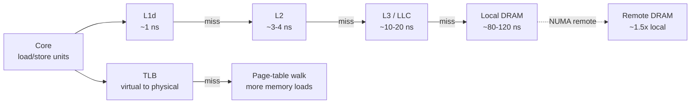
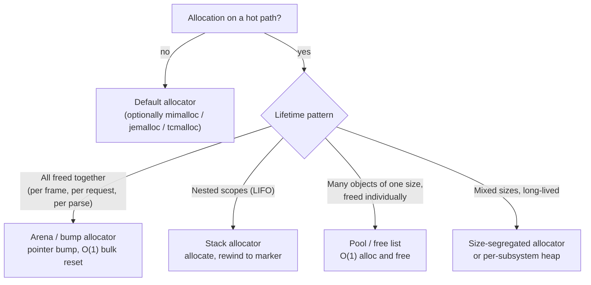
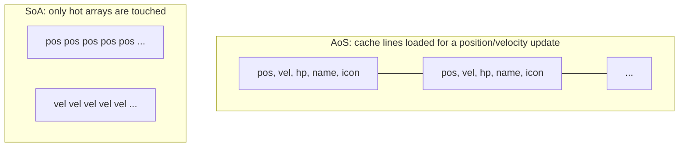
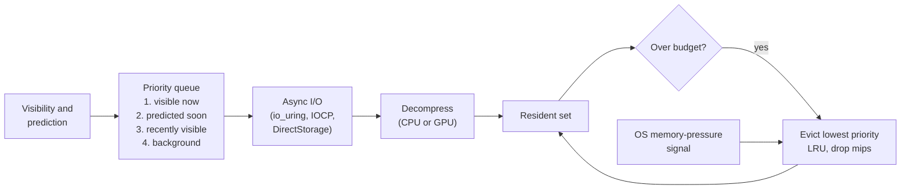

# Memory Optimization

[Performance Optimization](./) &raquo; Memory Optimization

On current hardware, memory access, not arithmetic, is usually the dominant cost. An L1 hit costs about 4-5 cycles; a load that goes all the way to DRAM costs 80-120 ns, which is **several hundred cycles** on a 4 GHz core. Because of that gap, how data is *arranged* and *allocated* often matters more than the instructions that operate on it.

Memory optimization combines two disciplines:

1. **Data layout.** Keep the working set small, contiguous, and predictable so caches, prefetchers, and the TLB serve it cheaply.
2. **Allocation and lifetime management.** Keep general-purpose `malloc`/`free` off hot paths, bound fragmentation in long-running processes, and keep the resident set within a budget.

This page covers profiling, allocator design (arenas, pools, `std::pmr`, general-purpose allocators), fragmentation, cache and TLB locality, NUMA, and asset compression and streaming. CPU-side topics like SIMD and false sharing between threads are covered in [CPU Optimization](cpu-optimization.html).

## The Memory Hierarchy

Data moves between levels in **cache lines**, 64 bytes on x86 and most Arm cores (Apple M-series reports 128 bytes). Touching one byte loads the whole line, so every line fetched should be as full of useful data as possible.

| Level | Typical size (2025-26 desktop/server cores) | Approx. latency | Scope |
|-------|---------------------------------------------|-----------------|-------|
| Registers | ~200+ physical registers | 0 cycles | Core |
| L1 data cache | 32-48 KB | 4-5 cycles (~1 ns) | Per core |
| L2 cache | 1-3 MB | 12-16 cycles (~3-4 ns) | Per core (or core cluster) |
| L3 / last-level cache | 16-128 MB (larger with stacked cache) | 40-70 cycles (~10-20 ns) | Shared by a core complex |
| DRAM (local NUMA node) | GBs to TBs | 80-120 ns (hundreds of cycles) | Socket |
| DRAM (remote NUMA node) | | 1.3-2x local | Other socket |
| NVMe SSD | TBs | 10-100 µs | Device |

These figures vary by microarchitecture; treat them as orders of magnitude and measure on the target with a tool such as Intel MLC or `lmbench`. The ratios are stable across generations: every step outward costs roughly 3-10x more than the step before.



Address translation is a second hierarchy layered on top: every access needs its virtual page translated by the TLB, and a TLB miss triggers a page-table walk that itself touches memory. Large working sets spread over many 4 KB pages can be TLB-bound even when the data would fit in cache (see [Huge Pages](#huge-pages-and-the-tlb)).

## Memory Profiling

Measure before changing a single allocation. A profiling pass should answer five questions:

| Question | What to look at |
|----------|-----------------|
| How much memory is used? | Peak and steady-state **RSS** (resident set size), not virtual size |
| What dominates? | Allocations grouped by subsystem, type, and size class |
| Where do allocations come from? | Call stacks, allocation rate, transient vs. long-lived |
| Is anything leaking? | Live bytes or live count growing monotonically with repeated work |
| How fragmented is the heap? | Committed/mapped memory vs. live bytes; largest free block |

### Tools

| Tool | Platform | Strengths |
|------|----------|-----------|
| `heaptrack` | Linux | Low-overhead allocation tracing, flame graphs of allocation sites, leak and temporary-allocation reports |
| Valgrind Massif / DHAT | Linux | Heap-over-time snapshots (Massif); per-allocation access and lifetime analysis (DHAT); slow (tens of x) |
| AddressSanitizer / LeakSanitizer | Clang, GCC, MSVC | Compiler instrumentation for leaks, overflows, use-after-free; about 2x slowdown, suitable for CI |
| Allocator statistics | jemalloc `malloc_stats_print`, mimalloc `mi_stats_print`, tcmalloc `MallocExtension` | Fragmentation, per-size-class usage, cached vs. returned memory |
| Visual Studio diagnostic tools | Windows | Heap snapshots with diffing and allocation call stacks |
| Instruments (Allocations, Leaks) | macOS / iOS | Generation analysis, live allocation graph |
| Android Studio Memory Profiler, Perfetto heapprofd | Android | Java/Kotlin and native heap sampling |
| `perf mem`, `perf c2c` | Linux | Sampled load latency, cache-line contention between cores |
| Engine and console tools | Unreal Insights / `memreport`, Unity Memory Profiler, platform SDK tools | Asset-level attribution and authoritative platform budgets |

### Snapshot Diffing

The most reliable way to find a leak is **snapshot diffing**: take a snapshot at a baseline state, perform a repeatable operation (load and unload a level, serve a batch of requests), return to the baseline state, and snapshot again. Anything still live that should have been freed is a candidate leak. Repeat the operation N times: a true leak grows linearly with N, while a one-time cache or lazy initialization stays flat.

### Tagged Allocation Tracking

Profilers identify call sites; production code often also needs cheap, always-on attribution by subsystem ("textures: 1.2 GB, audio: 180 MB"). A minimal tracking wrapper stores a small header in front of each block. The header must be padded to the maximum fundamental alignment, or the returned pointer will be misaligned for types such as `double` or SIMD vectors.

```cpp
#include <atomic>
#include <cstddef>
#include <new>

enum Tag : unsigned { Tag_Render, Tag_Audio, Tag_Gameplay, NUM_TAGS };

struct AllocStats {
    std::atomic<size_t> live_bytes{0};
    std::atomic<size_t> live_count{0};
    std::atomic<size_t> peak_bytes{0};
};
inline AllocStats g_stats[NUM_TAGS];

struct alignas(alignof(std::max_align_t)) Header {
    size_t size;
    Tag    tag;
};

void* tracked_alloc(size_t n, Tag tag) {
    auto* h = static_cast<Header*>(::operator new(sizeof(Header) + n));
    h->size = n;
    h->tag  = tag;

    AllocStats& s = g_stats[tag];
    size_t live = s.live_bytes.fetch_add(n, std::memory_order_relaxed) + n;
    s.live_count.fetch_add(1, std::memory_order_relaxed);
    size_t peak = s.peak_bytes.load(std::memory_order_relaxed);
    while (live > peak &&
           !s.peak_bytes.compare_exchange_weak(peak, live, std::memory_order_relaxed)) {}
    return h + 1;                       // user block starts after the header
}

void tracked_free(void* p) {
    if (!p) return;
    Header* h = static_cast<Header*>(p) - 1;
    AllocStats& s = g_stats[h->tag];
    s.live_bytes.fetch_sub(h->size, std::memory_order_relaxed);
    s.live_count.fetch_sub(1, std::memory_order_relaxed);
    ::operator delete(h);
}
```

### Measurement Pitfalls

- **Debug heaps distort sizes.** Debug CRTs add guard bytes and fill patterns. Measure peak memory in an optimized build.
- **Tracing perturbs the workload.** Full allocation tracing adds per-call overhead and can change timing-dependent behavior. Use sampling (heapprofd, tcmalloc sampling, `heaptrack` in its lighter modes) for steady-state characterization and full tracing for leak hunts.
- **Reserved is not resident.** A large `reserve()`, a sparse `mmap`, or an allocator's retained arenas inflate virtual size (VSZ) without consuming physical pages. Track RSS, and on Linux the `Pss`/`Rss` breakdown in `/proc/<pid>/smaps_rollup`.
- **Freed is not returned.** General-purpose allocators keep freed pages cached for reuse. RSS that stays high after a spike may be allocator retention (tunable via decay or purge settings), not a leak.

## Allocation Strategies

The general-purpose allocator handles any size, from any thread, in any order. It must be thread-safe, search size classes and free lists, split and coalesce blocks, and occasionally return memory to the OS. Modern allocators make the common case fast (tens of nanoseconds through per-thread caches), but a hot loop that allocates per item still pays for bookkeeping, cache pollution, and occasional slow paths such as page faults or OS calls. Specialized allocators win by exploiting what is known about lifetimes and sizes.



### Arena (Linear / Bump) Allocator

An arena holds a pointer into a buffer and advances it on each allocation. Allocation is an alignment round-up and an add; freeing is a single reset of the offset. There is no per-object free, so there is no fragmentation within the arena, and consecutive allocations are adjacent in memory.

```cpp
#include <cstddef>
#include <cstdint>

class Arena {
    std::byte* base_;
    size_t     capacity_;
    size_t     offset_ = 0;

public:
    Arena(void* buffer, size_t capacity)
        : base_(static_cast<std::byte*>(buffer)), capacity_(capacity) {}

    // align must be a power of two.
    void* allocate(size_t size, size_t align = alignof(std::max_align_t)) {
        size_t aligned = (offset_ + align - 1) & ~(align - 1);
        if (aligned + size > capacity_) return nullptr;   // exhausted: caller decides
        offset_ = aligned + size;
        return base_ + aligned;
    }

    // Release everything in O(1). No destructors run: use only for
    // trivially destructible data or objects whose destructors you call yourself.
    void reset() { offset_ = 0; }

    // Stack-style scopes: save a marker, rewind to it later (LIFO frees).
    size_t mark() const { return offset_; }
    void   rewind(size_t marker) { offset_ = marker; }
};
```

This is the canonical **frame allocator** in games: all per-frame scratch data comes from the arena, which is reset at the end of the frame. The same pattern fits request handling in servers, compilers (AST nodes that live until the compilation unit ends), and parsers. The `mark`/`rewind` pair turns the arena into a **stack allocator** for nested scopes. Production arenas typically chain additional blocks when full instead of returning `nullptr`.

### Pool (Free-List) Allocator

When many objects of the same size are allocated and freed individually (entities, particles, network messages, tree nodes), a pool preallocates a block of fixed-size slots and threads a free list through the unused ones. Allocate and free are both O(1), there is no fragmentation because every slot is interchangeable, and live objects stay densely packed.

```cpp
#include <cstddef>
#include <new>
#include <utility>

template <typename T, size_t N>
class Pool {
    union Slot {
        Slot* next;                           // valid while the slot is free
        alignas(T) std::byte storage[sizeof(T)];
    };
    Slot  slots_[N];
    Slot* free_ = nullptr;

public:
    Pool() {
        for (size_t i = 0; i < N; ++i) {      // build the intrusive free list
            slots_[i].next = free_;
            free_ = &slots_[i];
        }
    }

    template <typename... Args>
    T* create(Args&&... args) {
        if (!free_) return nullptr;           // pool exhausted
        Slot* s = free_;
        free_ = s->next;
        return ::new (s->storage) T(std::forward<Args>(args)...);
    }

    void destroy(T* obj) {
        obj->~T();
        Slot* s = reinterpret_cast<Slot*>(obj);
        s->next = free_;
        free_ = s;
    }
};
```

The free-list pointer lives inside each free slot (an *intrusive* list), so the pool needs no side metadata; the `union` also guarantees each slot is large enough to hold a pointer. Variants grow by chaining additional blocks, and **generational handles** (an index plus a generation counter) let callers detect use of a slot that has since been recycled, which raw pointers cannot.

### Polymorphic Allocators (`std::pmr`)

Since C++17, the standard library provides allocator plumbing that lets standard containers use arenas and pools without custom allocator template parameters. A `std::pmr::vector<T>` is the same type regardless of which memory resource backs it.

| Resource | Behavior | Use for |
|----------|----------|---------|
| `std::pmr::monotonic_buffer_resource` | Bump allocation; `deallocate` is a no-op; memory released when the resource is destroyed or `release()`d | Per-frame / per-request scratch (an arena) |
| `std::pmr::unsynchronized_pool_resource` | Pools per size class, single-threaded | Many small, individually freed objects on one thread |
| `std::pmr::synchronized_pool_resource` | Same, thread-safe | Shared pools |
| `std::pmr::new_delete_resource()` | Forwards to `operator new`/`delete` | Default upstream |
| `std::pmr::null_memory_resource()` | Throws on any allocation | Upstream that proves a buffer never overflows |

```cpp
#include <array>
#include <memory_resource>
#include <string>
#include <vector>

void handle_request(const Request& req) {
    std::array<std::byte, 64 * 1024> stack_buf;              // scratch on the stack
    std::pmr::monotonic_buffer_resource arena{
        stack_buf.data(), stack_buf.size(),
        std::pmr::new_delete_resource()};                    // spill to the heap if exceeded

    std::pmr::vector<std::pmr::string> tokens{&arena};       // strings share the arena
    tokenize(req.body, tokens);
    // ... all memory is released at scope exit, with no per-element frees.
}
```

Rust and other languages offer equivalents: `bumpalo` is a widely used Rust arena crate, and Zig passes allocators explicitly throughout its standard library.

### General-Purpose Allocators

Replacing the platform `malloc` is often the cheapest memory win for a server or tool: no code changes, frequently a double-digit percentage improvement in throughput or RSS for allocation-heavy workloads. All three leading options use per-thread caches and size-segregated slabs.

| Allocator | Maintainer | Notes (as of late 2026) |
|-----------|------------|-------------------------|
| **mimalloc** | Microsoft | Compact and fast; v3 (the current recommended line, 3.5.x) reworked cross-thread sharing, added first-class heaps usable from any thread, and can use substantially less memory on large workloads. v1 and v2 remain maintained. Used by CPython's free-threaded build. |
| **jemalloc** | Originally Jason Evans; Meta | Strong fragmentation control and extensive introspection (`mallctl`, decay-based purging). Latest release 5.4.0 (2024); development continues on the `dev` branch. Default in FreeBSD. |
| **tcmalloc** | Google | Per-CPU caches (using Linux restartable sequences), huge-page-aware backend (Temeraire). The modern version lives at `github.com/google/tcmalloc`; the older gperftools version is a separate project. |
| glibc `malloc` (ptmalloc2) | GNU | Per-thread arenas; can fragment badly with many threads. `MALLOC_ARENA_MAX` limits arena count. |

Swap them in at link time or with `LD_PRELOAD`, then compare peak RSS, p99 latency, and throughput on a realistic workload. Results are workload-dependent; measure rather than assume.

### Sizing and Alignment

- **Size for the worst case.** Pools and arenas should be large enough that the hot path never falls back to the general heap. Track high-water marks in development builds and fail loudly when a budget is exceeded.
- **Align shared, frequently written objects to cache lines** (`alignas(std::hardware_destructive_interference_size)` or 64/128 bytes) so threads writing neighboring objects do not falsely share a line.
- **Page-align large arenas** so they can be backed by huge pages and so their memory can be returned to the OS precisely (`madvise(MADV_DONTNEED)` / `VirtualFree`).

## Fragmentation

Fragmentation is the gradual failure mode of long-running processes: servers, editors, and multi-hour game sessions. A process can have far more free memory in total than a request needs and still be unable to satisfy it, or hold far more RSS than its live data justifies.

- **External fragmentation**: free memory is split into many non-adjacent holes. A 1 MB request fails, or forces the allocator to map new memory, even though several megabytes are free in total.
- **Internal fragmentation**: requests are rounded up to a size class (a 33-byte request consuming a 48-byte slot), wasting space inside each block.
- **Page-level fragmentation**: in size-segregated allocators, a page cannot be returned to the OS while even one object on it is live, so a few survivors pin whole pages. This is the most common form in practice with modern allocators.

<svg viewBox="0 0 640 150" role="img" aria-labelledby="frag-title" style="max-width:100%;height:auto;font-family:inherit">
  <title id="frag-title">External fragmentation: several free holes that together exceed a request, none of which is large enough alone</title>
  <g fill="none" stroke="currentColor" stroke-width="1.5">
    <rect x="10" y="30" width="620" height="44"/>
  </g>
  <g fill="currentColor" fill-opacity="0.35">
    <rect x="10" y="30" width="90" height="44"/>
    <rect x="160" y="30" width="110" height="44"/>
    <rect x="320" y="30" width="80" height="44"/>
    <rect x="470" y="30" width="100" height="44"/>
  </g>
  <g stroke="currentColor" stroke-width="1.5">
    <line x1="100" y1="30" x2="100" y2="74"/><line x1="160" y1="30" x2="160" y2="74"/>
    <line x1="270" y1="30" x2="270" y2="74"/><line x1="320" y1="30" x2="320" y2="74"/>
    <line x1="400" y1="30" x2="400" y2="74"/><line x1="470" y1="30" x2="470" y2="74"/>
    <line x1="570" y1="30" x2="570" y2="74"/>
  </g>
  <g fill="currentColor" font-size="13" text-anchor="middle">
    <text x="55" y="57">used</text><text x="130" y="57">free</text>
    <text x="215" y="57">used</text><text x="295" y="57">free</text>
    <text x="360" y="57">used</text><text x="435" y="57">free</text>
    <text x="520" y="57">used</text><text x="600" y="57">free</text>
    <text x="320" y="20">heap address range</text>
  </g>
  <g fill="none" stroke="currentColor" stroke-width="1.5" stroke-dasharray="5 4">
    <rect x="130" y="100" width="380" height="30"/>
  </g>
  <text x="320" y="120" fill="currentColor" font-size="13" text-anchor="middle">new request: larger than any single free hole</text>
</svg>

### Mitigations

| Strategy | How it helps | Cost |
|----------|--------------|------|
| Arenas for transient data | Transient allocations never interleave with long-lived ones | Must know lifetimes |
| Pools per object type | Every free slot fits every future request of that type | Slack if pools are oversized |
| Size-segregated allocator (mimalloc, jemalloc, tcmalloc) | Separate slabs per size class confine fragmentation | Some internal fragmentation per class |
| Separate heaps per subsystem | Long-lived and short-lived data do not share pages | More heaps to tune |
| Handle indirection plus compaction | Objects can be moved to coalesce free space | Extra indirection, compaction work |
| Periodic purge / decay tuning | Returns empty pages to the OS | Refaulting if memory is needed again |

The most effective structural fix is **segregating by lifetime**: never let a long-lived object land between two short-lived ones. Arenas for transients and dedicated pools for long-lived objects achieve this without any cleverness in the general allocator.

A **relocating allocator** removes external fragmentation entirely. Callers hold handles (indices into a table of current addresses) rather than raw pointers, and the allocator periodically slides live objects together and updates the table. Compacting garbage collectors (JVM G1/ZGC, .NET) and many console asset heaps work this way.

### Measuring Fragmentation

Two simple metrics are useful:

$$F_{\text{external}} = 1 - \frac{\text{largest free block}}{\text{total free memory}}$$

$$\text{overhead} = \frac{\text{RSS}}{\text{live allocated bytes}}$$

$F_{\text{external}}$ near 0 means free memory is essentially contiguous; near 1 means it is shattered. An RSS-to-live ratio well above about 1.2-1.3 in a steady state suggests page-level fragmentation or allocator retention. Track both over hours of runtime; a rising trend predicts an out-of-memory failure long before it happens.

## Cache Locality and Data Layout

Allocation strategy decides *where* data lives; layout and access order decide *how expensively* each access resolves.

### AoS vs. SoA

The classic data-oriented transformation is from **Array of Structures (AoS)** to **Structure of Arrays (SoA)**. When a loop touches only a few fields of a large object, AoS pulls the unused fields into cache on every line load. SoA stores each field contiguously, so the loop streams only the data it uses, and the layout is also what SIMD code wants.

```cpp
// AoS: each 64-byte line holds hot and cold fields together.
struct Entity {
    Vec3        position;   // hot: read every frame
    Vec3        velocity;   // hot
    float       health;     // hot
    std::string name;       // cold: 32 bytes on common ABIs
    Texture*    icon;       // cold
};
std::vector<Entity> entities;

// SoA: hot fields contiguous, cold fields elsewhere.
struct EntityHot {
    std::vector<Vec3>  position;
    std::vector<Vec3>  velocity;
    std::vector<float> health;
};
struct EntityCold {
    std::vector<std::string> name;
    std::vector<Texture*>    icon;
};

void integrate(EntityHot& e, float dt) {
    for (size_t i = 0; i < e.position.size(); ++i)
        e.position[i] += e.velocity[i] * dt;   // two dense, linear streams
}
```

With SoA, the integration loop reads two dense streams that the hardware prefetcher recognizes, and every byte fetched is used. Entity-component systems (EnTT, Flecs, Unity DOTS, Unreal Mass) are built around this layout. A hybrid, **AoSoA** (small fixed-width blocks of SoA, e.g. 8 or 16 entities per block), keeps SIMD-friendly lanes while localizing all fields of a group to a few lines.



### Locality Principles

| Principle | Practice |
|-----------|----------|
| Spatial locality | Store data that is read together, together. Prefer contiguous arrays (`std::vector`, flat hash maps) over node-based containers (`std::list`, `std::map`), where each hop is a likely miss. |
| Temporal locality | Reuse data while it is still cached. Tile or block loops so the working set fits in L1/L2 before moving on (see matrix blocking in [CPU Optimization](cpu-optimization.html)). |
| Avoid pointer chasing | 32-bit indices into a flat array are half the size of pointers, relocatable, and serializable. |
| Hot/cold splitting | Move rarely used fields out of the hot struct so hot lines carry only hot data. |
| Shrink the data | Smaller types (`uint16_t` indices, quantized floats, bitsets) put more elements in each line; `-Wpadded` and `pahole` reveal padding holes. |
| Predictable access | Sequential and constant-stride access lets the prefetcher hide latency; random access through a large table cannot be prefetched. |
| Sort before processing | Sorting work by the data it touches (material, spatial cell, key) turns random access into near-sequential access. |

### Huge Pages and the TLB

A TLB caches a few thousand virtual-to-physical translations. With 4 KB pages, a second-level TLB with about 2,000-3,000 entries covers only roughly 8-12 MB, so random access across a multi-gigabyte heap misses the TLB constantly and pays for page-table walks. **Huge pages** (2 MB on x86-64, with 1 GB also available; Arm64 supports 64 KB base pages and 2 MB/32 MB/512 MB block sizes depending on configuration) extend TLB reach by orders of magnitude.

| Mechanism | How to use | Notes |
|-----------|------------|-------|
| Transparent Huge Pages (Linux) | `madvise(ptr, len, MADV_HUGEPAGE)` with THP in `madvise` mode | Kernel promotes aligned 2 MB regions; `khugepaged` collapses in the background. `enabled=always` can add latency spikes and memory bloat, so many databases recommend `madvise` or `never`. |
| Explicit huge pages | `mmap(..., MAP_HUGETLB)` from a preallocated `hugetlbfs` pool | Deterministic; memory is reserved up front |
| Allocator support | tcmalloc Temeraire, jemalloc/mimalloc options | Huge-page-aware packing reduces fragmentation of huge pages |
| Windows large pages | `VirtualAlloc(MEM_LARGE_PAGES)` | Requires the "Lock pages in memory" privilege |

Huge pages help most for large, randomly accessed structures: hash tables, graph data, in-memory databases, JIT code heaps. They do little for small or sequentially streamed data, which the TLB and prefetcher already handle well.

### NUMA

On multi-socket servers (and on single-socket parts with multiple memory domains), memory is attached to specific nodes, and remote accesses cost substantially more than local ones. Linux allocates physical pages on the node of the thread that **first touches** them, so a single-threaded initialization loop can place an entire dataset on one node and leave every other socket accessing it remotely.

- Initialize data on the threads (or nodes) that will use it, or use `numactl --interleave=all` for data shared by everyone.
- Pin worker threads and their memory together (`numactl --cpunodebind=N --membind=N`, `libnuma`, or thread-pool affinity).
- Watch `numastat` and hardware counters for remote-access ratios.

## Managed Runtimes

In garbage-collected languages (Java, C#, Go, JavaScript, Python), the same principles apply, but the dominant cost is usually **allocation rate**, because every allocated byte eventually costs collector work.

- Reduce allocations on hot paths: reuse buffers, use value types (`struct`, `Span<T>`/`stackalloc` in .NET; escape analysis in Go and the JVM keeps non-escaping objects on the stack).
- Pool large or expensive objects (`ArrayPool<T>` in .NET, `sync.Pool` in Go), but not small ones, which modern generational collectors handle cheaply.
- Choose the collector for the latency target: low-pause collectors such as ZGC (generational by default since JDK 23) and Shenandoah on the JVM trade some throughput and memory for sub-millisecond pauses.
- Prefer primitive arrays and flat layouts over graphs of boxed objects, for the same cache reasons as native code.

## Asset Memory and Compression

In games and media applications most memory is content (textures, meshes, audio), not program state. The largest wins come from keeping that content in GPU- or hardware-native compressed formats.

### Texture Compression

Block-compressed formats are decoded by the GPU's texture units on every sample, so they reduce both resident memory and sampling bandwidth with no CPU decode step.

| Format | Bits per pixel | Use |
|--------|----------------|-----|
| RGBA8 (uncompressed) | 32 | Reference; render targets |
| BC1 | 4 | Opaque color, 1-bit alpha |
| BC3 | 8 | Color with smooth alpha (largely superseded by BC7) |
| BC4 / BC5 | 4 / 8 | One / two channels (masks, tangent-space normal maps) |
| BC6H | 8 | HDR color (half-float) |
| BC7 | 8 | High-quality color and alpha on desktop and console |
| ASTC | 0.89-8 (block size 12x12 to 4x4) | Mobile and Apple GPUs; LDR and HDR; tunable quality |
| ETC2 / EAC | 4-8 | OpenGL ES 3.0 baseline on older Android devices |

A 4096 x 4096 RGBA8 texture is 64 MB before mipmaps; in BC1 it is 8 MB, and in BC7 16 MB. A full **mip chain** adds one third (a factor of 4/3) but lets the GPU sample only the resolution appropriate to the object's screen size, which reduces bandwidth and enables mip streaming. Transcodable intermediate formats (Basis Universal / KTX2) let one asset ship for both BCn and ASTC hardware.

### Mesh Data

- Deduplicate vertices and remove degenerate triangles.
- Reorder indices for the post-transform vertex cache and vertices for fetch locality; the open-source **meshoptimizer** library implements these passes and mesh simplification, and is used by many engines.
- Use 16-bit indices for meshes under 65,536 vertices.
- Quantize attributes: octahedral-encoded normals and tangents, 16-bit UVs and positions (with a per-mesh scale and offset). This commonly halves vertex memory with no visible difference.
- Provide LODs, or use cluster-based virtualized geometry (Unreal Nanite, mesh shaders), so distant objects cost less memory and bandwidth.

### Disk vs. Runtime Compression

| Regime | Examples | Saves |
|--------|----------|-------|
| **Runtime (in-memory)** | BCn/ASTC textures, quantized vertices, ADPCM/Opus/Vorbis audio | Resident RAM/VRAM and bandwidth; decoded by hardware or on demand |
| **Disk / transport** | LZ4, Zstandard, Oodle Kraken/Leviathan, GDeflate | Install size and I/O time; decoded once at load |

The typical pipeline uses both: a GPU-native format (BC7), optionally rate-distortion-optimized so it compresses better (Oodle Texture, Basis RDO), wrapped in a fast lossless codec for storage. With DirectStorage on Windows (GDeflate decoded on the GPU) and the dedicated decompression hardware in current consoles, the final decode can bypass the CPU entirely.

## Streaming and Budgets

When the full content set cannot be resident, the resident set must be managed dynamically: load what is visible or about to be, evict what is not, and never block the main thread.



### Loading Strategies

- **Asynchronous I/O.** Never block the main or render thread on storage. Issue reads from worker threads or asynchronous APIs and integrate results when ready.
- **Prioritized, cancellable queues.** Order pending loads by visibility and distance; cancel requests for assets that left view before they arrived.
- **Compressed on disk.** A fast decompressor is almost always cheaper than the extra I/O time of uncompressed data.
- **Memory-mapped files.** For very large, randomly accessed, read-mostly data, `mmap` lets the OS page data in on demand and share it between processes, at the cost of page-fault latency on first touch and less control over eviction.
- **Mip and texture streaming.** Keep only the mip levels currently needed resident; stream finer mips in as objects approach. Hardware sampler feedback and virtual (tiled/sparse) textures refine this to the individual texture tile.

### Budgeting and Eviction

Set a hard total budget with per-category sub-budgets (textures, meshes, audio, gameplay), then drive eviction with a priority policy: typically LRU weighted by visibility and distance. When usage approaches the budget, evict from the lowest-priority tier first. When the OS signals memory pressure (`onTrimMemory` on Android, `didReceiveMemoryWarning` on iOS, a pressure notification on consoles), cross an **emergency threshold**: drop to lower mips and unload off-screen content rather than risk termination.

```cpp
// Budget-driven eviction: called after each batch of completed loads.
void enforce_budget(AssetCache& cache, size_t budget_bytes) {
    while (cache.resident_bytes() > budget_bytes) {
        Asset* victim = cache.lowest_priority_lru();   // off-screen, least recently used
        if (!victim) break;                            // everything left is required
        if (victim->can_drop_mip()) victim->drop_top_mip();
        else                        cache.evict(victim);
    }
}
```

## Summary

| Problem | First tool | Typical fix |
|---------|------------|-------------|
| High peak memory | Heap snapshot grouped by subsystem | Compress assets, stream, shrink data types |
| Growing memory | Snapshot diffing over N iterations | Fix ownership leak, bound caches |
| Allocation-heavy hot path | Allocation profiler (`heaptrack`, Instruments) | Arena, pool, `std::pmr`, buffer reuse |
| RSS far above live data | Allocator stats | Lifetime segregation, allocator swap, purge tuning |
| Memory-bound loop | `perf stat` cache-miss counters, `perf mem` | SoA, hot/cold split, sequential access |
| Random access over large heap | TLB-miss counters | Huge pages |
| Poor multi-socket scaling | `numastat`, remote-access counters | First-touch placement, pinning |

## See Also

- [Performance Optimization](./) - section hub and the profile-fix-verify loop
- [CPU Optimization](cpu-optimization.html) - cache-aware loops, SIMD, false sharing, and multithreading
- [GPU Optimization](gpu-optimization.html) - VRAM bandwidth, render-target formats, and GPU-side memory
- [Network & I/O Optimization](network-io-optimization.html) - page cache, `mmap`, and asynchronous storage I/O
- [Platform-Specific Tuning](platform-tuning.html) - mobile memory limits and console unified memory
- [3D Graphics & Rendering](../graphics/3d-rendering.html) - textures, meshes, and GPU resources that dominate asset budgets
- [Game Development](../gamedev/) - asset pipelines and streaming in an engine context
- [Unreal Engine](../technology/unreal.html) - engine memory profiling and streaming tools
