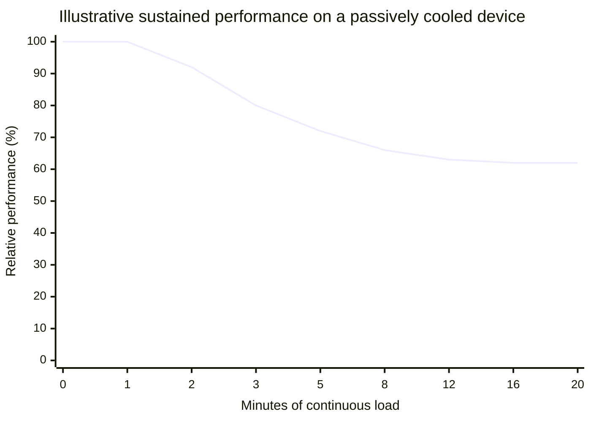
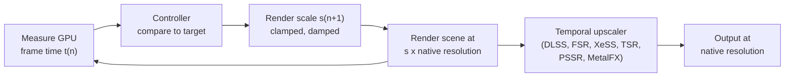
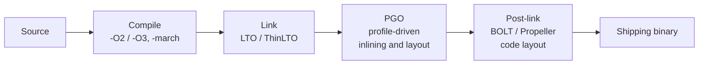
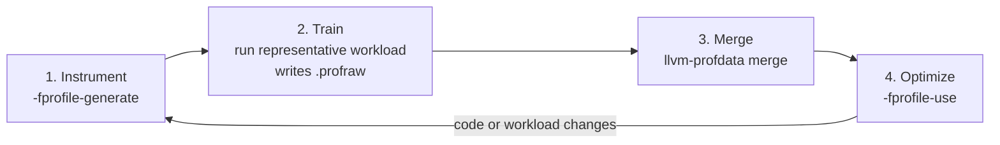

# Platform-Specific Tuning

[Performance Optimization](./) &raquo; Platform-Specific Tuning

The same frame-time budget means different things on different hardware. A 16.67 ms frame that is easy on a desktop GPU can overheat a phone within minutes, is a precisely known quantity on a console, and must hold across a wide range of PC configurations. This page covers tuning for each class: **power and thermal** limits on mobile, **fixed hardware** on consoles, **scalability** on PC and handheld PCs, **dynamic resolution and upscaling** as the common tool for holding a frame rate, and the **compiler and linker** optimizations (LTO, PGO, post-link optimization) that apply everywhere.

## Why Platform Matters

Each platform class has a different binding constraint, and therefore a different question to ask of every frame.

| Platform | Binding constraint | Question to ask | Optimization posture |
|----------|--------------------|-----------------|----------------------|
| **Mobile** (phones, tablets, standalone VR) | Sustained power and heat | Does the thousandth consecutive frame, on a warm device, still hit the target? | Minimize energy per frame; degrade gradually |
| **Console** | Fixed, known hardware; shared memory bandwidth | Does the worst frame fit, given exact specs? | Tune to the silicon; count bytes per frame |
| **PC** | Unknown hardware spanning more than an order of magnitude in performance | Does the minimum spec run acceptably, and does high-end hardware scale up? | Presets, auto-detection, dynamic resolution |
| **Handheld PC** (Steam Deck and similar) | PC software on a mobile-class power budget | Does it hold its target within a 15-30 W envelope? | Treat as a fixed-ish console target with mobile thermals |

## Mobile

Phones and tablets have no fan, or only a small one, so nearly all power drawn becomes heat that the chassis must dissipate passively. The SoC can run at peak clocks for a short time; then the thermal governor lowers clocks to protect the silicon and keep the surface temperature tolerable. Mobile optimization is therefore about **sustained** performance, not peak.

### The Thermal Curve



The shape is typical: a burst at boost clocks, a drop as the chassis heats, then a sustained floor that is often 50-70% of the initial burst. The exact figures vary by device, ambient temperature, case, and whether the device is charging. **Benchmarks that capture only the first minute measure performance players do not experience.** Measure after 10-20 minutes of continuous load, on a device in its case, at a realistic room temperature, and on the lowest-tier device you support.

### Energy per Frame

Battery drain and heat are driven by energy, not instantaneous power:

$$E = \int_{0}^{T} P(t)\, dt \approx \sum_{i=1}^{N} P_i \, \Delta t_i$$

Two consequences follow:

- **Race to idle.** A core that finishes quickly and enters a deep sleep state often uses less total energy than one running longer at a lower clock, because leakage and the fixed cost of being awake dominate. This holds on most mobile CPUs, though not at the very top of the voltage-frequency curve, where power rises steeply with clock speed.
- **Do not render frames nobody sees.** Cap the frame rate at the display refresh rate or an exact divisor of it. An uncapped 45 FPS on a 60 Hz display costs energy for frames that are discarded or cause judder. Variable-refresh (LTPO) displays on current phones let the panel itself drop to match content.

A first-order model of battery life $L$ for battery energy $Q$, baseline power $P_0$ (display, radios, OS), energy per frame $e$, and frame rate $f$:

$$L = \frac{Q}{P_0 + e f}$$

Halving $f$ does not double battery life, because $P_0$ is unchanged, but for GPU-heavy games where $e f \gg P_0$ it comes close. A 30 FPS "battery saver" mode is one of the highest-value options a mobile game can offer.

### Tile-Based GPUs

Most mobile GPUs (Apple, Arm Mali and Immortalis, Qualcomm Adreno, Imagination PowerVR) are **tile-based**. The screen is divided into small tiles; geometry is first binned per tile, then each tile is shaded entirely in fast on-chip memory and written to DRAM once. External memory bandwidth is the largest energy cost in rendering, so the rules differ from desktop GPUs:

| Practice | Why |
|----------|-----|
| Avoid reading a render target in the same frame it is written | Forces the tile to be flushed to DRAM and reloaded |
| Use load and store actions correctly (`DONT_CARE` / `CLEAR` on load, `DONT_CARE` on store for transient attachments) | Avoids reading or writing attachments to DRAM needlessly; depth is rarely needed after the pass |
| Use memoryless / lazily allocated attachments (Metal `.memoryless`, Vulkan `LAZILY_ALLOCATED`) | Transient depth and MSAA buffers never occupy DRAM |
| Keep post-processing inside one render pass (Vulkan subpasses or dynamic rendering local read, Metal tile shaders / programmable blending) | Data stays in tile memory |
| Prefer MSAA over post-process AA when possible | The MSAA resolve happens on-chip, so 4x MSAA is comparatively cheap |
| Prefer forward or forward+ shading over fat G-buffers | Large G-buffers spill out of tile memory |

### Reacting to Thermal State

Mobile operating systems expose thermal pressure so applications can reduce load **before** the governor imposes a sudden, large clock cut.

| Platform | API | Notes |
|----------|-----|-------|
| Android | `PowerManager.getThermalHeadroom()` (Android 11+), `getCurrentThermalStatus()` | Headroom forecasts how close the device is to severe throttling, so the app can act early |
| Android | Performance Hint API: `PerformanceHintManager.createHintSession()` (Android 12+) | Reports target and actual work durations per frame so the scheduler picks appropriate clocks and cores; part of the Android Dynamic Performance Framework (ADPF) |
| Android | Game Mode API, `setPreferPowerEfficiency` (Android 15+) | User- and OS-selected performance vs. battery preference |
| iOS / iPadOS | `ProcessInfo.thermalState` and its change notification | States: nominal, fair, serious, critical |
| iOS / iPadOS | Low Power Mode (`isLowPowerModeEnabled`) | Signal to reduce frame rate and background work |

A thermal governor in the engine maps these signals to quality tiers:

```cpp
// Engine-side governor. Feed it from getThermalHeadroom()/getCurrentThermalStatus()
// on Android, or ProcessInfo.thermalState on iOS.
enum class ThermalState { Nominal, Fair, Serious, Critical };

struct QualityTier {
    int   target_fps;
    float render_scale;
    int   shadow_quality;   // 0 = off .. 3 = high
    bool  post_effects;
};

constexpr QualityTier kTiers[] = {
    /* Nominal  */ {60, 1.00f, 3, true},
    /* Fair     */ {60, 0.85f, 2, true},
    /* Serious  */ {30, 0.70f, 1, true},
    /* Critical */ {30, 0.60f, 0, false},
};

QualityTier select_tier(ThermalState s) {
    return kTiers[static_cast<int>(s)];
}
```

Change tiers with hysteresis (require the state to persist for several seconds before stepping back up), so the game does not oscillate between tiers. The goal is gradual, barely noticeable degradation instead of an abrupt drop in frame rate.

### Memory Limits

Mobile memory is shared among the OS, the GPU, and every background app, and the OS terminates the process that exceeds its allowance, usually without warning (the Android low-memory killer, iOS jetsam).

- Compress all textures: ASTC on current hardware, with ETC2 only for older OpenGL ES devices. Never ship uncompressed RGBA8 color textures.
- Stream content rather than loading entire levels; unload assets as soon as they leave use.
- Treat memory warnings (`onTrimMemory` on Android, `didReceiveMemoryWarning` on iOS) as commands to release caches immediately.
- On iOS, query `os_proc_available_memory()` for the remaining allowance instead of guessing from device RAM.
- Budget well below physical RAM: the OS, compositor, and other apps claim a large, invisible share. Profile on the cheapest supported device, not the flagship.

See [Memory Optimization](memory-optimization.html) for texture formats and streaming.

## Consoles

A console generation is a fixed hardware specification shared by every unit for years. That makes profiling results transferable: a frame that fits the budget on a development kit fits it for every player.

### Current Hardware (2026)

| Console | CPU | GPU | Memory | Notes |
|---------|-----|-----|--------|-------|
| PlayStation 5 | 8-core Zen 2, up to 3.5 GHz | 36 CUs RDNA 2, up to 2.23 GHz | 16 GB GDDR6, 448 GB/s | Variable-frequency (power-budget) clocking; hardware Kraken decompression |
| PlayStation 5 Pro | Same CPU family | 60 CUs, upgraded ray tracing | 16 GB GDDR6, 576 GB/s | ML upscaler (PSSR) |
| Xbox Series X | 8-core Zen 2, 3.8 GHz (3.66 GHz with SMT) | 52 CUs RDNA 2, 1.825 GHz | 16 GB GDDR6: 10 GB at 560 GB/s + 6 GB at 336 GB/s | Split-bandwidth memory; hardware decompression |
| Xbox Series S | 8-core Zen 2, 3.6 GHz (3.4 GHz with SMT) | 20 CUs RDNA 2, 1.565 GHz | 10 GB GDDR6: 8 GB at 224 GB/s + 2 GB at 56 GB/s | Must be supported by every Series title; usually the memory-limited target |
| Nintendo Switch 2 | Arm, custom NVIDIA SoC | NVIDIA Ampere-class, with tensor cores | 12 GB LPDDR5X | Different clocks docked vs. handheld; supports DLSS |

The PS5's clocks vary with a deterministic power budget: the frequency depends on the workload, not on the temperature of the individual unit, so every console behaves identically for the same content. The Xbox Series S is the reason "fixed hardware" on Xbox actually means two specifications; its smaller, slower memory is the common bottleneck for cross-generation titles.

### What Fixed Hardware Enables

- **Exact budgets.** Core count, cache sizes, GPU compute units, memory bandwidth, and storage throughput are known. There is no minimum spec to estimate.
- **No driver variance.** Graphics drivers and shader compilers ship with the SDK, so shaders can be precompiled for the exact GPU and behave identically on every unit. PC games, by contrast, must manage runtime shader compilation and pipeline caches.
- **Low-level APIs.** Consoles expose thinner graphics APIs than portable abstractions (Sony's proprietary PlayStation graphics APIs, the Xbox variant of Direct3D 12 with console-specific extensions), recovering CPU time and allowing explicit control of memory and synchronization.
- **Unconditional feature use.** Hardware decompression, ray-tracing units, and specific GPU features can be relied on without fallbacks.
- **Chasing the last millisecond.** Because a win on one unit is a win on all, teams can profitably optimize individual passes by fractions of a millisecond.

### Unified Memory and the Bandwidth Budget

Current consoles use **unified memory**: the CPU and GPU share one physical pool. There is no PCIe copy between system and video memory, but both processors contend for the same bus. The per-frame bandwidth budget is:

$$B_{\text{frame}} = \frac{B}{f}$$

At 448 GB/s and 60 FPS this is about 7.5 GB of memory traffic per frame, and in practice less, because achievable bandwidth is below the theoretical peak and CPU traffic reduces what remains for the GPU. Every G-buffer write, texture fetch, and resolve counts against it. Profiling bytes moved per pass, not only shader time, is a large part of console optimization.

### Offloading Work

Parallel CPU work such as culling, particle simulation, skinning, and animation blending often moves to GPU **compute shaders**, and asynchronous compute queues can overlap it with graphics work that leaves shader units idle (shadow-map rendering, depth-only passes). Fixed hardware makes this overlap predictable enough to schedule deliberately. (The PlayStation 3's SPUs were the earlier incarnation of the same idea.)

### Fixed-Spec Constants

On a console, values that would be reckless assumptions on PC are simply facts of the platform:

```cpp
// Example values for an 8-core console where the OS reserves part of the CPU.
// Real reservations come from the platform SDK documentation.
constexpr int kHardwareThreads   = 16;  // 8 cores x 2 SMT
constexpr int kReservedForSystem = 2;
constexpr int kGameWorkerThreads = kHardwareThreads - kReservedForSystem;
constexpr int kCacheLineBytes    = 64;

// Hot per-entity data sized to exactly one cache line.
struct alignas(kCacheLineBytes) HotEntityData {
    float position[3];
    float velocity[3];
    float health;
    std::uint32_t flags;
    std::uint8_t  padding[kCacheLineBytes - 8 * sizeof(float)];
};
static_assert(sizeof(HotEntityData) == kCacheLineBytes);
```

## PC and Handheld PC

PC performance spans integrated laptop graphics to flagship desktop GPUs, a range of well over 10x, and the same binary must run on all of it. The strategy is to **scale**: expose settings, choose good defaults automatically, and adjust resolution dynamically.

### Quality Settings and Presets

Presets (Low, Medium, High, Ultra) are curated bundles of individual settings. Each setting stresses a different part of the hardware, which is why per-setting controls matter: a player with ample VRAM but a slow GPU can raise texture quality at almost no cost.

| Setting | Low | High / Ultra | Primary cost |
|---------|-----|--------------|--------------|
| Texture quality | Lower-resolution mips | Full-resolution textures | VRAM capacity (little GPU time if it fits) |
| Shadow quality | Low-resolution, short-range cascades | High-resolution cascades, more casters, ray-traced shadows | Rasterization, fill rate, draw calls |
| Anti-aliasing / upscaling | Upscaler performance mode | Native-resolution AA (DLAA, FSR Native AA) | Shader time, bandwidth |
| Draw distance / LOD | Aggressive culling and LOD | Far distances, detailed LODs | Geometry, draw calls, CPU submission |
| Global illumination / reflections | Screen-space or baked | Ray-traced or path-traced | GPU ray-tracing throughput |
| Effects and post-processing | Half-resolution, fewer samples | Full resolution, more samples | Fill rate, shader ALU |

Preset design guidelines:

- **Spend budget in order of visual return per millisecond.** Texture resolution and shadow resolution usually give more visible improvement per cost than full-resolution volumetrics or reflections.
- **Low must actually run** at playable frame rates on the minimum-spec GPU, validated on real hardware.
- **Ultra may exceed current hardware**, as headroom for future GPUs.
- **Auto-detect on first launch** (GPU model, VRAM, CPU core count, display resolution) and choose a preset so players do not start in an unplayable configuration.
- **Show the cost.** A VRAM usage estimate in the settings menu prevents the stutter that follows from exceeding VRAM.
- **Precompile shaders** (a pipeline-cache warm-up at first launch or load time) so shader compilation does not cause hitches during play; this remains one of the most common PC-specific performance complaints.

### Handheld PCs

Devices such as the Steam Deck run PC builds on a 15-30 W mobile-class APU. They combine PC software with mobile constraints: a fixed, known configuration per model (so a dedicated preset is worthwhile), limited memory bandwidth shared by CPU and GPU, and battery life that responds to frame caps exactly as on phones. A dedicated handheld preset with a 30 or 40 FPS cap (the Steam Deck OLED's display supports refresh rates up to 90 Hz, making 45 FPS a clean divisor) and aggressive upscaling is typical.

### Dynamic Resolution

A fixed preset cannot guarantee a frame rate, because the heaviest scene is always heavier than the average. **Dynamic resolution scaling** adjusts the internal render resolution each frame to hold a GPU time target, then upscales to the output resolution.



GPU cost scales roughly with pixel count, which is the square of the linear scale factor $s$. To bring frame time $t_n$ to the target $t^{\ast}$, the linear scale must change by the square root of the time ratio:

$$s_{n+1} = \mathrm{clamp}\left( s_n \sqrt{\frac{t^{\ast}}{t_n}},\; s_{\min},\; s_{\max} \right)$$

In practice the update is damped to avoid visible "resolution pumping", and fixed per-frame costs that do not scale with resolution (geometry, shadow maps, UI) make the square-root rule an approximation that the damping absorbs.

```cpp
#include <algorithm>
#include <cmath>

// Run once per frame with the GPU time of the previous frame.
float update_render_scale(float gpu_ms, float target_ms, float scale,
                          float min_s = 0.5f, float max_s = 1.0f) {
    float proposed = scale * std::sqrt(target_ms / std::max(gpu_ms, 0.01f));
    float damped   = scale + 0.25f * (proposed - scale);   // ease toward target
    return std::clamp(damped, min_s, max_s);
}
```

Use a target somewhat below the frame budget (for example 15 ms for a 16.67 ms budget) so the controller has headroom, and react faster to over-budget frames than to under-budget ones: a dropped frame is visible, while a slightly lower resolution usually is not.

### Upscaling and Frame Generation

Temporal upscalers reconstruct a high-resolution image from a lower-resolution render plus motion vectors and previous frames. Since 2025 the leading ones are machine-learned:

| Technology | Vendor | Hardware | Notes |
|------------|--------|----------|-------|
| DLSS 4 | NVIDIA | GeForce RTX (tensor cores) | Transformer-based super resolution and ray reconstruction on all RTX GPUs; Multi Frame Generation on RTX 50-series |
| FSR 4 | AMD | Radeon RX 9000 (RDNA 4) for the ML upscaler | FSR 3.1 remains the open-source, vendor-agnostic option for other GPUs |
| XeSS 2 | Intel | ML path on Intel Arc; fallback path on other GPUs | Adds frame generation (XeFG) and latency reduction (XeLL) |
| TSR | Epic (Unreal Engine) | Any GPU | Engine-integrated, non-ML |
| PSSR | Sony | PS5 Pro | ML upscaler |
| MetalFX | Apple | Apple silicon | Spatial and temporal upscaling; frame interpolation in newer releases |

**Frame generation** synthesizes intermediate frames between rendered ones. It raises the displayed frame rate and smoothness, but it does not reduce input latency (it adds some, which is why it ships alongside latency-reduction features such as NVIDIA Reflex, AMD Anti-Lag, and Intel XeLL) and it does not speed up simulation. Vendors recommend a base frame rate of roughly 60 FPS before enabling it. It is a presentation-layer improvement, not a substitute for meeting the frame budget.

## Compiler and Build Optimizations

A significant, often overlooked share of performance is determined by how the binary is built. The same source can run noticeably faster through build settings alone, and those gains stack with every algorithmic and data-layout improvement.



### Optimization Levels

| GCC / Clang | MSVC | Meaning | Use |
|-------------|------|---------|-----|
| `-O0` | `/Od` | No optimization | Debugging only |
| `-O1` | (no direct equivalent) | Light optimization | Rare |
| `-O2` | `/O2` | Full optimization without large size increases | Default for release builds |
| `-O3` | (no direct equivalent) | More aggressive inlining, unrolling, and vectorization | Hot numeric code; measure, since it can regress through code growth |
| `-Os` / `-Oz` | `/O1` | Optimize for size | Constrained or instruction-cache-bound code |
| `-Ofast` | `/fp:fast` (floating-point part) | `-O3` plus non-IEEE-conforming floating-point math | Only where strict floating-point semantics are not required |

**Never profile or ship an unoptimized build.** A debug build can be several to tens of times slower, and its hotspots differ from those of the release build, which misleads every decision made from its profile. Profile an optimized build with debug symbols (`-O2 -g`, or MSVC `/O2 /Zi`) and, on x86-64, frame pointers (`-fno-omit-frame-pointer`) for reliable stack traces; several Linux distributions now build their packages with frame pointers for this reason.

### Link-Time Optimization

Normal compilation optimizes one translation unit at a time. **LTO** (`-flto`; MSVC `/GL` with `/LTCG`) defers optimization to link time, when the whole program is visible, enabling inlining across files, whole-program dead-code elimination, and better devirtualization. **ThinLTO** (`-flto=thin`, Clang) keeps most of the benefit with parallel, incremental builds and is the practical choice for large codebases.

### Targeting the CPU

| Target | Instruction sets | Use |
|--------|------------------|-----|
| `-march=x86-64` (baseline) | SSE2 | Maximum compatibility |
| `-march=x86-64-v2` | Up to SSE4.2, POPCNT | Nearly all x86-64 PCs still in use; baseline for RHEL 9 |
| `-march=x86-64-v3` | AVX2, FMA, BMI1/2 | Most PCs from about 2015 onward; baseline for RHEL 10 |
| `-march=x86-64-v4` | AVX-512 subsets | Servers and some desktop CPUs; not safe as a PC baseline |
| `-march=native` | Everything on the build machine | Local builds and fixed-hardware targets only |
| `-mcpu=<core>` (Arm) | Exact Arm core features and tuning | Mobile and Apple silicon, where the target is known |

On consoles, targeting the exact CPU is free. On PC, either choose a baseline your minimum spec supports or ship multiple code paths selected at runtime: GCC and Clang **function multiversioning** (`__attribute__((target_clones("avx2", "default")))`) generates and dispatches variants automatically.

### Profile-Guided Optimization

Many of the compiler's most consequential decisions (which branch is likely, which calls are worth inlining, how to order code so the hot path is contiguous) are heuristic guesses without runtime information. **PGO** replaces those guesses with measurements from a representative run.



```bash
# Clang instrumentation-based PGO
clang++ -O2 -fprofile-generate -o app.inst app.cpp
./app.inst --run-representative-workload     # writes default_*.profraw
llvm-profdata merge -output=app.profdata *.profraw
clang++ -O2 -fprofile-use=app.profdata -o app app.cpp
```

GCC uses the same `-fprofile-generate` / `-fprofile-use` flags with its own `.gcda` profile files. MSVC uses `/GENPROFILE` and `/USEPROFILE` together with `/LTCG`.

What PGO improves:

- **Branch layout.** The likely side of each branch becomes the fall-through path.
- **Inlining.** Frequently called functions are inlined even when large; rarely called ones stay out of line, keeping hot code compact.
- **Code placement.** Hot blocks and functions are grouped, and cold paths (error handling) are moved to separate sections, improving instruction-cache and branch-predictor behavior.
- **Indirect-call promotion and switch lowering.** A dominant virtual-call target or `switch` case is checked directly first.

Gains of roughly 5-20% are common for branch-heavy code such as interpreters, compilers, databases, and game logic, with no source changes. Large projects including Chromium, Firefox, and CPython release builds use PGO.

**The profile must be representative.** Training on an unrepresentative workload can make the real one slower. Train on realistic gameplay or production-like traffic, not a main menu or a unit test suite; regenerate profiles when code or workload changes substantially; and automate the instrument-train-rebuild cycle in CI.

**Sampling-based PGO** (AutoFDO, and Clang's CSSPGO) builds the profile from hardware samples collected with `perf` on an ordinary optimized binary, including in production. It is somewhat less precise than instrumentation but far easier to keep current.

PGO is also available beyond C and C++: Rust (`-Cprofile-generate` / `-Cprofile-use`, or `cargo-pgo`), Go (a `default.pgo` CPU profile in the main package, generally available since Go 1.21), and .NET, where dynamic PGO in the JIT is enabled by default since .NET 8.

### Post-Link Optimization

**BOLT** (part of the LLVM project) and **Propeller** rewrite or relink an already optimized binary using a sampled profile, reordering functions and basic blocks for instruction-cache and TLB locality. They matter most for very large binaries whose hot code exceeds the instruction cache, such as servers, databases, compilers, and browsers, and they stack on top of LTO and PGO.

## Summary

| Platform | Measure first | First levers | Build configuration |
|----------|---------------|--------------|---------------------|
| **Mobile** | Sustained frame time on a thermally soaked, low-tier device | Frame cap, ADPF/thermal-state governor, stay in tile memory, ASTC | `-O2` (or `-Os` for cold code), LTO, PGO; `-mcpu` for the target cores |
| **Console** | Bytes moved per frame; worst-case frame on the weakest SKU (Series S) | Async compute, low-level APIs, precompiled shaders | Exact CPU target, LTO, PGO |
| **PC** | Worst-case frame on minimum spec; shader-compilation hitches | Presets with auto-detection, dynamic resolution, upscalers | `-O2`, ThinLTO, PGO, `x86-64-v2`/`v3` baseline with multiversioned hot paths |
| **Handheld PC** | Sustained frame time and battery drain at the device's power limit | Dedicated preset, frame cap at a refresh divisor, upscaling | Same as PC |

Across all of them the method is the same: **profile on the real target, optimize the binding constraint, and verify the result.** The platform determines which constraint binds: energy on mobile, shared bandwidth on console, and hardware diversity on PC. The build pipeline adds a final, nearly free increment on every platform.

## See Also

- [Performance Optimization](./) - section hub and the optimization loop
- [GPU Optimization](gpu-optimization.html) - bottleneck classes, draw calls, and shader cost
- [CPU Optimization](cpu-optimization.html) - profiling, caches, SIMD, and threading
- [Memory Optimization](memory-optimization.html) - texture compression, streaming, and memory budgets
- [3D Graphics & Rendering](../graphics/3d-rendering.html) - rendering pipelines that platform tuning targets
- [VR/AR Development](../vr-ar/) - standalone headsets share mobile's thermal and power limits
- [Unreal Engine](../technology/unreal.html) - engine scalability settings and platform profiling tools
- [Game Development](../gamedev/) - frame budgets and production workflows
