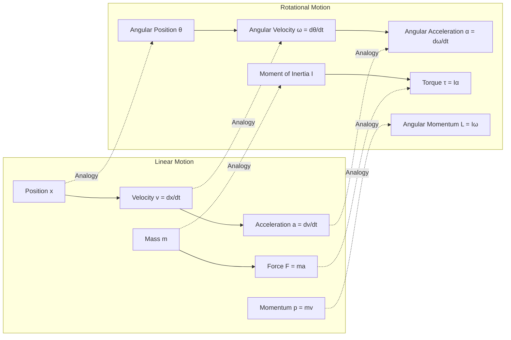
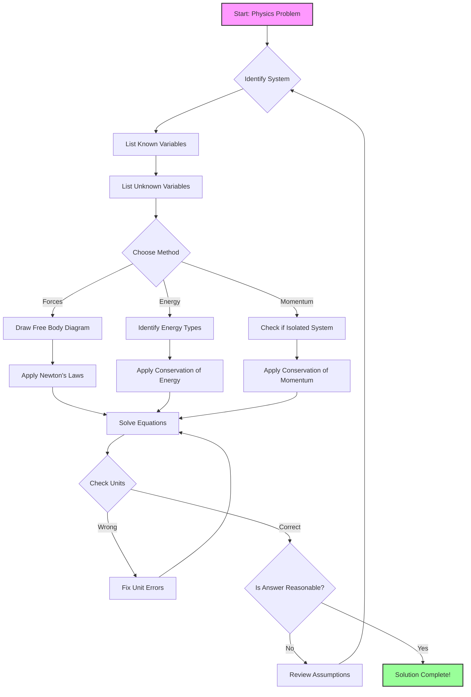

# Classical Mechanics

<html><header><link rel="stylesheet" href="https://andrewaltimit.github.io/Documentation/style.css"></header></html>

---

**The Foundation of Physics: Understanding Motion and Forces**

*Explore the fundamental principles that govern the motion of everyday objects*

Classical mechanics is the branch of physics that deals with the motion of macroscopic objects from projectiles to parts of machinery, as well as astronomical objects such as spacecraft, planets, stars, and galaxies. It provides extremely accurate results when studying large objects that are not extremely massive and speeds that are not approaching the speed of light.

---

## Overview

**Core Principles**
- [Newton's Laws of Motion](#newtons-laws-of-motion)
- [Conservation Laws](#conservation-laws)
- [Work and Energy](#work-and-energy)

**Motion Analysis**
- [Kinematics](#kinematics)
- [Projectile Motion](#projectile-motion)
- [Simple Harmonic Motion](#simple-harmonic-motion)

**Advanced Topics**
- [Rotational Motion](#rotational-motion)
- [Gravitation](#gravitation)
- [Oscillations and Waves](#oscillations-and-waves)

**Applications and Context**
- [Engineering Applications](#engineering-applications)
- [Problem-Solving Strategies](#problem-solving-strategies)
- [Historical Context](#historical-context)

---

## Fundamental Concepts

### Newton's Laws of Motion
<p class="referenceBoxes type3"><a href="https://www.newton.ac.uk/files/preprints/ni16002.pdf"> Paper: <b><i>Philosophiæ Naturalis Principia Mathematica</i></b> - Isaac Newton</a></p>
<p class="referenceBoxes type3"><a href="https://www.youtube.com/watch?v=kKKM8Y-u7ds"> Video: <b><i>Newton's Laws of Motion Explained</i></b></a></p>

The foundation of classical mechanics is built upon Newton's three laws of motion:

<center>
<a href="https://andrewaltimit.github.io/Documentation/images/physics/newtons-laws-diagram.png">

</a>
<br>
<p class="referenceBoxes type2">
<a href="https://en.wikipedia.org/wiki/Newton%27s_laws_of_motion">
 Article: <b><i>Newton's Laws Visual Summary</i></b></a>
</p>
</center>

#### First Law (Law of Inertia)
An object at rest stays at rest and an object in motion stays in motion with the same speed and in the same direction unless acted upon by an unbalanced force.

**Mathematical Expression:**
```
If ΣF = 0, then v = constant
```

#### Second Law (Law of Acceleration)

<a href="https://andrewaltimit.github.io/Documentation/images/physics/f-equals-ma.gif">

</a>

The acceleration of an object is directly proportional to the net force acting on it and inversely proportional to its mass.

**Mathematical Expression:**
```
F = ma
```
Where:
- F = net force (N)
- m = mass (kg)
- a = acceleration (m/s²)

#### Third Law (Action-Reaction)
For every action, there is an equal and opposite reaction.

**Mathematical Expression:**
```
F₁₂ = -F₂₁
```

### Conservation Laws
<p class="referenceBoxes type3"><a href="https://www.feynmanlectures.caltech.edu/I_04.html"> Lecture: <b><i>Conservation of Energy - Feynman Lectures</i></b></a></p>

Classical mechanics is governed by several fundamental conservation laws:

<details>
<summary><b>Click to expand: Interactive Conservation Laws Demonstration</b></summary>
<br>
<div style="background-color: #f0f0f0; padding: 20px; border-radius: 5px;">
<p>Conservation laws are fundamental principles that remain constant in isolated systems:</p>
<ul>
<li><b>Energy Conservation:</b> Total energy (kinetic + potential) remains constant</li>
<li><b>Momentum Conservation:</b> Total momentum is conserved in collisions</li>
<li><b>Angular Momentum Conservation:</b> Rotational momentum is preserved</li>
</ul>
<p class="referenceBoxes type3"><a href="https://phet.colorado.edu/en/simulation/energy-skate-park"> Interactive: <b><i>Energy Skate Park Simulation</i></b></a></p>
</div>
</details>

#### Conservation of Energy
The total energy of an isolated system remains constant over time.

**Types of Energy:**
- **Kinetic Energy**: KE = ½mv²
- **Potential Energy**: PE = mgh (gravitational)
- **Elastic Potential Energy**: PE = ½kx²

**Conservation Equation:**
```
E_initial = E_final
KE_i + PE_i = KE_f + PE_f
```

#### Conservation of Momentum

<center>
<a href="https://andrewaltimit.github.io/Documentation/images/physics/momentum-conservation.gif">

</a>
<br>
<p class="referenceBoxes type2">
<a href="https://www.physicsclassroom.com/class/momentum/Lesson-2/Momentum-Conservation-Principle">
 Tutorial: <b><i>Momentum Conservation in Collisions</i></b></a>
</p>
</center>

The total momentum of an isolated system remains constant.

**Linear Momentum:**
```
p = mv
```

**Conservation Equation:**
```
Σp_initial = Σp_final
```

#### Conservation of Angular Momentum
The total angular momentum of an isolated system remains constant.

**Angular Momentum:**
```
L = Iω = r × p
```

Where:
- I = moment of inertia
- ω = angular velocity
- r = position vector
- p = linear momentum

## Kinematics

Kinematics describes the motion of objects without considering the forces that cause the motion.

### One-Dimensional Motion

**Position:** x(t)

**Velocity:** v = dx/dt

**Acceleration:** a = dv/dt = d²x/dt²

### Equations of Motion (Constant Acceleration)
1. v = v₀ + at
2. x = x₀ + v₀t + ½at²
3. v² = v₀² + 2a(x - x₀)
4. x = x₀ + ½(v + v₀)t

### Projectile Motion

<center>
<a href="https://andrewaltimit.github.io/Documentation/images/physics/projectile-motion.png">

</a>
<br>
<p class="referenceBoxes type2">
<a href="https://www.geogebra.org/m/nJY8AYyY">
 Interactive: <b><i>Projectile Motion Simulator</i></b></a>
</p>
</center>

For projectile motion under constant gravitational acceleration:

**Horizontal Motion:**
```
x = v₀ₓt
vₓ = v₀ₓ (constant)
```

**Vertical Motion:**
```
y = v₀ᵧt - ½gt²
vᵧ = v₀ᵧ - gt
```

**Range Formula:**
```
R = (v₀²sin(2θ))/g
```

**Maximum Height:**
```
H = (v₀²sin²(θ))/(2g)
```

## Dynamics

Dynamics studies the forces and their effects on motion.

### Work and Energy

**Work:** The energy transferred to or from an object via the application of force along a displacement.

```
W = F·d = Fd cos(θ)
```

For variable force:
```
W = ∫F·dr
```

### Power

Power is the rate at which work is done:

```
P = dW/dt = F·v
```

### Simple Harmonic Motion
<p class="referenceBoxes type3"><a href="https://github.com/matplotlib/matplotlib/blob/main/galleries/examples/animation/simple_anim.py"> Code: <b><i>SHM Animation with Matplotlib</i></b></a></p>

<a href="https://andrewaltimit.github.io/Documentation/images/physics/shm-animation.gif">

</a>

Objects that experience a restoring force proportional to displacement exhibit simple harmonic motion.

**Hooke's Law:**
```
F = -kx
```

**Equation of Motion:**
```
x(t) = A cos(ωt + φ)
```

Where:
- A = amplitude
- ω = angular frequency = √(k/m)
- φ = phase constant

**Period:**
```
T = 2π/ω = 2π√(m/k)
```

## Rotational Motion

<details>
<summary><b>Mermaid Diagram: Linear vs Rotational Motion Analogy</b></summary>
<br>



</details>

### Rotational Kinematics

Analogous to linear motion:
- Angular position: θ
- Angular velocity: ω = dθ/dt
- Angular acceleration: α = dω/dt

### Moment of Inertia

<center>
<a href="https://andrewaltimit.github.io/Documentation/images/physics/moment-of-inertia-shapes.png">

</a>
<br>
<p class="referenceBoxes type2">
<a href="https://hyperphysics.phy-astr.gsu.edu/hbase/mi.html">
 Reference: <b><i>Moment of Inertia Tables</i></b></a>
</p>
</center>

The rotational equivalent of mass:

**Point Mass:**
```
I = mr²
```

**Common Shapes:**
- Solid sphere: I = (2/5)MR²
- Solid cylinder: I = (1/2)MR²
- Thin rod (center): I = (1/12)ML²

### Torque

The rotational equivalent of force:

```
τ = r × F = rF sin(θ)
```

**Rotational Newton's Second Law:**
```
τ = Iα
```

## Gravitation

### Newton's Law of Universal Gravitation
<p class="referenceBoxes type3"><a href="https://www.wilbourhall.org/pdfs/NewtonPrincipia.pdf"> Paper: <b><i>Principia - Book III: The System of the World</i></b></a></p>

<center>
<a href="https://andrewaltimit.github.io/Documentation/images/physics/universal-gravitation.png">

</a>
<br>
<p class="referenceBoxes type2">
<a href="https://www.physicsclassroom.com/class/circles/Lesson-3/Newton-s-Law-of-Universal-Gravitation">
 Tutorial: <b><i>Understanding Universal Gravitation</i></b></a>
</p>
</center>

Every particle attracts every other particle with a force:

```
F = G(m₁m₂)/r²
```

Where:
- G = 6.674 × 10⁻¹¹ N·m²/kg² (gravitational constant)
- m₁, m₂ = masses of the objects
- r = distance between centers

### Orbital Motion

For circular orbits:

**Orbital Velocity:**
```
v = √(GM/r)
```

**Orbital Period:**
```
T = 2π√(r³/GM)
```

This is Kepler's Third Law for circular orbits.

## Oscillations and Waves

### Damped Oscillations

When friction is present:

```
mẍ + bẋ + kx = 0
```

Solutions depend on the damping coefficient b:
- **Underdamped:** Oscillates with decreasing amplitude
- **Critically damped:** Returns to equilibrium fastest
- **Overdamped:** Returns to equilibrium without oscillating

### Wave Motion

**Wave Equation:**
```
∂²y/∂t² = v²(∂²y/∂x²)
```

**Wave Speed:**
```
v = fλ
```

Where:
- f = frequency
- λ = wavelength

## Lagrangian Mechanics

### The Principle of Least Action

Nature minimizes the action integral:

```
S = ∫_{t₁}^{t₂} L(q, q̇, t) dt
```

Where L = T - V is the Lagrangian (kinetic minus potential energy).

**Euler-Lagrange Equations:**
```
d/dt(∂L/∂q̇ᵢ) - ∂L/∂qᵢ = 0
```

These equations provide a powerful alternative to Newton's laws.

### Generalized Coordinates

For a system with n degrees of freedom:
- **Configuration space:** Q = {q₁, q₂, ..., qₙ}
- **Phase space:** Γ = {q₁, ..., qₙ, p₁, ..., pₙ}
- **Generalized momentum:** pᵢ = ∂L/∂q̇ᵢ

### Constraints and Lagrange Multipliers

**Holonomic constraints:** f(q₁, ..., qₙ, t) = 0

**Modified Lagrangian with constraints:**
```
L' = L + Σᵢ λᵢfᵢ(q, t)
```

### Noether's Theorem

Every continuous symmetry corresponds to a conserved quantity:

| Symmetry | Conservation Law |
|----------|------------------|
| Time translation | Energy |
| Space translation | Linear momentum |
| Rotation | Angular momentum |
| Gauge invariance | Charge |

**Mathematical Statement:**
If the action is invariant under qᵢ → qᵢ + εξᵢ(q), then:
```
Q = Σᵢ (∂L/∂q̇ᵢ)ξᵢ = constant
```

### Example: Double Pendulum

```python
def double_pendulum_lagrangian(theta1, theta2, theta1_dot, theta2_dot, 
                                m1, m2, l1, l2, g):
    """Lagrangian for double pendulum"""
    # Kinetic energy
    T = 0.5*m1*(l1*theta1_dot)**2 + 0.5*m2*((l1*theta1_dot)**2 + 
        (l2*theta2_dot)**2 + 2*l1*l2*theta1_dot*theta2_dot*
        np.cos(theta1-theta2))
    
    # Potential energy
    V = -m1*g*l1*np.cos(theta1) - m2*g*(l1*np.cos(theta1) + 
        l2*np.cos(theta2))
    
    return T - V
```

## Hamiltonian Mechanics

### Hamilton's Equations

The Hamiltonian represents total energy:
```
H(q, p, t) = Σᵢ pᵢq̇ᵢ - L(q, q̇, t)
```

**Hamilton's Canonical Equations:**
```
q̇ᵢ = ∂H/∂pᵢ
ṗᵢ = -∂H/∂qᵢ
```

### Phase Space and Liouville's Theorem

**Liouville's Theorem:** Phase space volume is conserved:
```
dρ/dt + {ρ, H} = 0
```

Where {·,·} denotes the Poisson bracket.

### Poisson Brackets

Fundamental algebraic structure of classical mechanics:

```
{f, g} = Σᵢ (∂f/∂qᵢ ∂g/∂pᵢ - ∂f/∂pᵢ ∂g/∂qᵢ)
```

**Properties:**
- Antisymmetry: {f, g} = -{g, f}
- Linearity: {af + bg, h} = a{f, h} + b{g, h}
- Jacobi identity: {f, {g, h}} + {g, {h, f}} + {h, {f, g}} = 0

**Time evolution:** df/dt = {f, H} + ∂f/∂t

### Canonical Transformations

Transformations preserving Hamilton's equations:
```
Q = Q(q, p, t)
P = P(q, p, t)
```

**Generating functions:**
- Type 1: F₁(q, Q, t) → p = ∂F₁/∂q, P = -∂F₁/∂Q
- Type 2: F₂(q, P, t) → p = ∂F₂/∂q, Q = ∂F₂/∂P
- Type 3: F₃(p, Q, t) → q = -∂F₃/∂p, P = -∂F₃/∂Q
- Type 4: F₄(p, P, t) → q = -∂F₄/∂p, Q = ∂F₄/∂P

**Symplectic structure:** Canonical transformations preserve:
```
Σᵢ dpᵢ ∧ dqᵢ = Σᵢ dPᵢ ∧ dQᵢ
```

### Action-Angle Variables

For integrable systems, transform to (I, θ) where:
- **Action variables:** Iᵢ = ∮ pᵢ dqᵢ/(2π)
- **Angle variables:** θᵢ with period 2π
- **Hamilton's equations:** İᵢ = 0, θ̇ᵢ = ωᵢ(I) = ∂H/∂Iᵢ

## Hamilton-Jacobi Theory

### Hamilton-Jacobi Equation

The action S(q, t) satisfies:
```
∂S/∂t + H(q, ∂S/∂q, t) = 0
```

**Complete solution:** S = S(q, α, t) + const

Where α are n constants of integration.

**New momenta:** Pᵢ = αᵢ = constant
**New coordinates:** Qᵢ = ∂S/∂αᵢ = βᵢ + ωᵢt

### Separation of Variables

For separable systems:
```
S = W(q) - Et
```

**Time-independent HJ equation:**
```
H(q, ∂W/∂q) = E
```

### Connection to Quantum Mechanics

In the limit ℏ → 0:
```
ψ = exp(iS/ℏ)
```

Leads to the Schrödinger equation from Hamilton-Jacobi theory.

## Chaos Theory and Nonlinear Dynamics

### Lyapunov Exponents

Measure of sensitivity to initial conditions:
```
λ = lim_{t→∞} (1/t) ln(|δZ(t)|/|δZ₀|)
```

**Chaotic system:** At least one positive Lyapunov exponent.

### Poincaré Sections

Reduce continuous dynamics to discrete map:
- Choose surface of section Σ
- Record intersections of trajectory with Σ
- Study resulting discrete map

### KAM Theory

**Kolmogorov-Arnold-Moser theorem:** Under small perturbations, most invariant tori survive if:
- System is nearly integrable
- Frequencies satisfy diophantine condition
- Perturbation is sufficiently smooth

**Arnold diffusion:** In systems with n ≥ 3, trajectories can diffuse through destroyed tori.

### Strange Attractors

**Lorenz system:**
```
ẋ = σ(y - x)
ẏ = x(ρ - z) - y
ż = xy - βz
```

**Properties:**
- Fractal dimension
- Sensitive dependence on initial conditions
- Bounded but non-periodic

## Geometric Mechanics

### Symplectic Geometry

**Symplectic manifold:** (M, ω) where ω is a closed, non-degenerate 2-form.

**Canonical coordinates:** ω = Σᵢ dpᵢ ∧ dqᵢ

**Darboux's theorem:** All symplectic manifolds locally look the same.

### Fiber Bundles and Gauge Theory

**Configuration space:** Q (base manifold)
**Phase space:** T*Q (cotangent bundle)
**Lagrangian mechanics:** On TQ (tangent bundle)

**Connection 1-form:** Describes parallel transport
**Curvature 2-form:** F = dA + A ∧ A

### Geometric Phases

**Berry phase:** For cyclic evolution:
```
γ = i∮ ⟨ψ|∇_R|ψ⟩ · dR
```

**Hannay angle:** Classical analog of Berry phase
**Foucault pendulum:** Example of geometric phase

## Modern Applications

### Molecular Dynamics

```python
def verlet_integration(positions, velocities, forces, dt, mass):
    """Velocity Verlet algorithm for MD simulation"""
    # Update positions
    positions += velocities * dt + 0.5 * forces/mass * dt**2
    
    # Calculate new forces
    forces_new = calculate_forces(positions)
    
    # Update velocities
    velocities += 0.5 * (forces + forces_new)/mass * dt
    
    return positions, velocities, forces_new
```

### Celestial Mechanics

**N-body problem:** No general analytical solution for N ≥ 3

**Restricted three-body problem:**
- Lagrange points (L1-L5)
- Stable (L4, L5) and unstable (L1-L3) equilibria
- Applications: space mission design

### Plasma Physics

**Vlasov equation:**
```
∂f/∂t + v·∇_x f + (q/m)(E + v×B)·∇_v f = 0
```

**Kinetic theory:** Bridge between particle and fluid descriptions

## Computational Methods

### Symplectic Integrators

Preserve phase space structure:

```python
def symplectic_euler(q, p, H, dt):
    """First-order symplectic integrator"""
    p_new = p - dt * grad_q(H, q, p)
    q_new = q + dt * grad_p(H, q, p_new)
    return q_new, p_new

def stormer_verlet(q, p, H, dt):
    """Second-order symplectic integrator"""
    p_half = p - 0.5*dt * grad_q(H, q, p)
    q_new = q + dt * grad_p(H, q, p_half)
    p_new = p_half - 0.5*dt * grad_q(H, q_new, p_half)
    return q_new, p_new
```

### Variational Integrators

Discretize the action principle:
```
S_d = Σₖ L_d(qₖ, qₖ₊₁, h)
```

**Discrete Euler-Lagrange equations:**
```
D₂L_d(qₖ₋₁, qₖ) + D₁L_d(qₖ, qₖ₊₁) = 0
```

## Research Frontiers

### Quantum-Classical Correspondence

**Ehrenfest theorem:** ⟨x⟩ satisfies classical equations
**WKB approximation:** Semi-classical limit
**Coherent states:** Minimal uncertainty wave packets

### Integrability and Solitons

**Lax pairs:** L̇ = [L, M]
**Inverse scattering:** Solve nonlinear PDEs
**Toda lattice:** Exactly solvable many-body system

### Topological Mechanics

**Topological invariants:** Chern numbers, winding numbers
**Edge states:** Protected by topology
**Applications:** Mechanical metamaterials

### Machine Learning in Classical Mechanics

**Neural ODEs:** Learn dynamics from data
**Hamiltonian neural networks:** Preserve conservation laws
**Physics-informed neural networks:** Incorporate physical constraints

## Advanced Mathematical Tools

### Differential Geometry

**Tangent bundle:** TM = ∪ₓ TₓM
**Cotangent bundle:** T*M = ∪ₓ T*ₓM
**Lie derivatives:** ℒ_X Y = [X, Y]

### Lie Groups and Algebras

**Momentum map:** J: M → g*
**Coadjoint orbits:** Symplectic manifolds
**Reduction:** Quotient by symmetry group

### Category Theory

**Classical mechanics as functor:**
- Objects: Configuration spaces
- Morphisms: Canonical transformations
- Composition: Sequential transformations

## References and Further Reading

### Graduate Textbooks
1. **Goldstein, Poole & Safko** - *Classical Mechanics* (3rd Edition)
2. **Arnold** - *Mathematical Methods of Classical Mechanics*
3. **Landau & Lifshitz** - *Mechanics* (Course of Theoretical Physics Vol. 1)
4. **José & Saletan** - *Classical Dynamics: A Contemporary Approach*

### Research Monographs
1. **Marsden & Ratiu** - *Introduction to Mechanics and Symmetry*
2. **Abraham & Marsden** - *Foundations of Mechanics*
3. **Ott** - *Chaos in Dynamical Systems*
4. **Tabor** - *Chaos and Integrability in Nonlinear Dynamics*

### Recent Research Directions
1. **Geometric Mechanics:** Port-Hamiltonian systems, discrete mechanics
2. **Quantum-Classical Hybrid Systems:** Decoherence, measurement
3. **Machine Learning:** Data-driven discovery of conservation laws
4. **Topological Mechanics:** Mechanical metamaterials, protected states
5. **Stochastic Mechanics:** Noise-induced phenomena, large deviations

## Applications

### Engineering Applications
- **Bridge Design:** Using statics to calculate load distributions
- **Vehicle Dynamics:** Analyzing forces during acceleration and turning
- **Machinery:** Designing gears, pulleys, and mechanical systems

### Everyday Examples
- **Sports:** Trajectory of a basketball, golf ball, or baseball
- **Transportation:** Car acceleration, braking distances
- **Amusement Parks:** Forces experienced on roller coasters

### Astronomical Applications
- **Satellite Orbits:** Calculating orbital parameters
- **Planetary Motion:** Predicting positions of planets
- **Space Missions:** Trajectory planning for spacecraft

## Limitations of Classical Mechanics

Classical mechanics breaks down in several regimes:

1. **High Speeds:** When velocities approach the speed of light, relativistic effects become important
2. **Small Scales:** At atomic and subatomic scales, quantum mechanical effects dominate
3. **Strong Gravitational Fields:** Near massive objects like black holes, general relativity is needed
4. **Extreme Precision:** GPS satellites require relativistic corrections for accurate positioning

## Advanced Code Examples

### Double Pendulum Chaos Visualization

```python
import numpy as np
from scipy.integrate import solve_ivp
import matplotlib.pyplot as plt
from matplotlib.animation import FuncAnimation

def double_pendulum_derivatives(t, state, m1, m2, l1, l2, g):
    """Compute derivatives for double pendulum using Lagrangian mechanics"""
    theta1, z1, theta2, z2 = state
    
    c, s = np.cos(theta1 - theta2), np.sin(theta1 - theta2)
    
    den1 = (m1 + m2)*l1 - m2*l1*c*c
    den2 = (l2/l1)*den1
    
    dydt = np.zeros_like(state)
    
    dydt[0] = z1  # dtheta1/dt
    dydt[2] = z2  # dtheta2/dt
    
    # Lagrangian dynamics
    num1 = -m2*l1*z1*z1*s*c + m2*g*np.sin(theta2)*c + \
           m2*l2*z2*z2*s - (m1 + m2)*g*np.sin(theta1)
    dydt[1] = num1/den1
    
    num2 = -m2*l2*z2*z2*s*c + (m1 + m2)*g*np.sin(theta1)*c - \
           (m1 + m2)*l1*z1*z1*s - (m1 + m2)*g*np.sin(theta2)
    dydt[3] = num2/den2
    
    return dydt

# Parameters
m1 = m2 = 1.0
l1 = l2 = 1.0
g = 9.81

# Initial conditions - small perturbation shows chaos
theta1_0 = np.pi/2
theta2_0 = np.pi/2
z1_0 = 0
z2_0 = 0

# Solve for two slightly different initial conditions
state0_1 = [theta1_0, z1_0, theta2_0, z2_0]
state0_2 = [theta1_0 + 0.001, z1_0, theta2_0, z2_0]  # Small perturbation

t_span = (0, 20)
t_eval = np.linspace(*t_span, 2000)

sol1 = solve_ivp(double_pendulum_derivatives, t_span, state0_1, 
                 args=(m1, m2, l1, l2, g), t_eval=t_eval, 
                 method='DOP853', rtol=1e-10)

sol2 = solve_ivp(double_pendulum_derivatives, t_span, state0_2, 
                 args=(m1, m2, l1, l2, g), t_eval=t_eval, 
                 method='DOP853', rtol=1e-10)

# Plot phase space and divergence
fig, axes = plt.subplots(2, 2, figsize=(12, 10))

# Phase space trajectories
ax = axes[0, 0]
ax.plot(sol1.y[0], sol1.y[1], 'b-', alpha=0.7, label='Original')
ax.plot(sol2.y[0], sol2.y[1], 'r-', alpha=0.7, label='Perturbed')
ax.set_xlabel(r'$\theta_1$')
ax.set_ylabel(r'$\dot{\theta}_1$')
ax.set_title('Phase Space: Pendulum 1')
ax.legend()
ax.grid(True, alpha=0.3)

# Poincaré section
ax = axes[0, 1]
# Sample when theta2 crosses zero with positive velocity
crossings = np.where(np.diff(np.sign(sol1.y[2])) > 0)[0]
ax.scatter(sol1.y[0][crossings], sol1.y[1][crossings], c='b', s=10, alpha=0.5)
ax.set_xlabel(r'$\theta_1$')
ax.set_ylabel(r'$\dot{\theta}_1$')
ax.set_title('Poincaré Section')
ax.grid(True, alpha=0.3)

# Lyapunov exponent estimation
ax = axes[1, 0]
divergence = np.sqrt((sol1.y[0] - sol2.y[0])**2 + 
                    (sol1.y[1] - sol2.y[1])**2)
log_divergence = np.log(divergence + 1e-15)
ax.semilogy(sol1.t, divergence)
ax.set_xlabel('Time (s)')
ax.set_ylabel('Phase Space Distance')
ax.set_title('Sensitive Dependence on Initial Conditions')
ax.grid(True, alpha=0.3)

# Energy conservation check
ax = axes[1, 1]
# Calculate total energy
theta1, z1, theta2, z2 = sol1.y
c = np.cos(theta1 - theta2)
T = 0.5*m1*(l1*z1)**2 + 0.5*m2*((l1*z1)**2 + (l2*z2)**2 + 
    2*l1*l2*z1*z2*c)
V = -m1*g*l1*np.cos(theta1) - m2*g*(l1*np.cos(theta1) + 
    l2*np.cos(theta2))
E = T + V

ax.plot(sol1.t, E - E[0], 'g-')
ax.set_xlabel('Time (s)')
ax.set_ylabel('Energy Error')
ax.set_title('Energy Conservation')
ax.grid(True, alpha=0.3)

plt.tight_layout()
plt.show()

# Estimate Lyapunov exponent
from scipy import stats
# Linear fit to log divergence in growth region
t_fit = sol1.t[100:500]  # Avoid initial transient and saturation
log_div_fit = log_divergence[100:500]
slope, intercept, r_value, p_value, std_err = stats.linregress(t_fit, log_div_fit)
print(f"Estimated Lyapunov exponent: {slope:.4f} s^-1")
print(f"R-squared: {r_value**2:.4f}")
```

### Symplectic Integration Comparison

```python
def hamiltonian_pendulum(q, p, m=1, l=1, g=9.81):
    """Hamiltonian for simple pendulum"""
    return p**2/(2*m*l**2) + m*g*l*(1 - np.cos(q))

def euler_step(q, p, H, dt):
    """Standard Euler method (not symplectic)"""
    dH_dq = (H(q + 1e-8, p) - H(q, p))/1e-8
    dH_dp = (H(q, p + 1e-8) - H(q, p))/1e-8
    
    q_new = q + dt * dH_dp
    p_new = p - dt * dH_dq
    return q_new, p_new

def symplectic_euler_step(q, p, H, dt):
    """Symplectic Euler method"""
    dH_dq = (H(q + 1e-8, p) - H(q, p))/1e-8
    p_new = p - dt * dH_dq
    
    dH_dp = (H(q, p_new + 1e-8) - H(q, p_new))/1e-8
    q_new = q + dt * dH_dp
    return q_new, p_new

def leapfrog_step(q, p, H, dt):
    """Leapfrog/Störmer-Verlet method"""
    dH_dq = (H(q + 1e-8, p) - H(q, p))/1e-8
    p_half = p - 0.5*dt * dH_dq
    
    dH_dp = (H(q, p_half + 1e-8) - H(q, p_half))/1e-8
    q_new = q + dt * dH_dp
    
    dH_dq_new = (H(q_new + 1e-8, p_half) - H(q_new, p_half))/1e-8
    p_new = p_half - 0.5*dt * dH_dq_new
    return q_new, p_new

# Compare integrators
q0, p0 = 3.0, 0.0  # Large amplitude
dt = 0.1
n_steps = 10000

# Storage for trajectories
trajectories = {
    'Euler': {'q': [q0], 'p': [p0], 'E': []},
    'Symplectic Euler': {'q': [q0], 'p': [p0], 'E': []},
    'Leapfrog': {'q': [q0], 'p': [p0], 'E': []}
}

# Run simulations
for method, integrator in [('Euler', euler_step), 
                           ('Symplectic Euler', symplectic_euler_step),
                           ('Leapfrog', leapfrog_step)]:
    q, p = q0, p0
    for _ in range(n_steps):
        q, p = integrator(q, p, hamiltonian_pendulum, dt)
        trajectories[method]['q'].append(q)
        trajectories[method]['p'].append(p)
        trajectories[method]['E'].append(hamiltonian_pendulum(q, p))

# Plot results
fig, axes = plt.subplots(1, 3, figsize=(15, 5))

# Phase space
ax = axes[0]
for method, style in [('Euler', 'r-'), ('Symplectic Euler', 'g-'), 
                     ('Leapfrog', 'b-')]:
    traj = trajectories[method]
    ax.plot(traj['q'], traj['p'], style, alpha=0.7, label=method)
ax.set_xlabel(r'$\theta$')
ax.set_ylabel(r'$p_\theta$')
ax.set_title('Phase Space Trajectories')
ax.legend()
ax.grid(True, alpha=0.3)

# Energy conservation
ax = axes[1]
t = np.arange(n_steps + 1) * dt
E0 = hamiltonian_pendulum(q0, p0)
for method, style in [('Euler', 'r-'), ('Symplectic Euler', 'g-'), 
                     ('Leapfrog', 'b-')]:
    E = np.array([E0] + trajectories[method]['E'])
    ax.semilogy(t, np.abs(E - E0) + 1e-16, style, label=method)
ax.set_xlabel('Time')
ax.set_ylabel('Energy Error')
ax.set_title('Energy Conservation')
ax.legend()
ax.grid(True, alpha=0.3)

# Phase space area preservation
ax = axes[2]
for method, color in [('Euler', 'red'), ('Symplectic Euler', 'green'), 
                     ('Leapfrog', 'blue')]:
    traj = trajectories[method]
    # Sample points in phase space
    q_vals = np.array(traj['q'][::100])
    p_vals = np.array(traj['p'][::100])
    ax.scatter(q_vals[:50], p_vals[:50], c=color, alpha=0.6, 
              label=f'{method} (early)', s=30)
    ax.scatter(q_vals[-50:], p_vals[-50:], c=color, alpha=0.6, 
              marker='x', label=f'{method} (late)', s=30)
ax.set_xlabel(r'$\theta$')
ax.set_ylabel(r'$p_\theta$')
ax.set_title('Phase Space Volume Preservation')
ax.legend(bbox_to_anchor=(1.05, 1), loc='upper left')
ax.grid(True, alpha=0.3)

plt.tight_layout()
plt.show()
```

### Simulating Projectile Motion with Python

```python
import numpy as np
import matplotlib.pyplot as plt
from matplotlib.animation import FuncAnimation

def projectile_motion(v0, angle, g=9.81, dt=0.01):
    """Simulate projectile motion"""
    # Convert angle to radians
    theta = np.radians(angle)
    
    # Initial conditions
    vx = v0 * np.cos(theta)
    vy = v0 * np.sin(theta)
    
    # Lists to store trajectory
    x_vals = [0]
    y_vals = [0]
    t_vals = [0]
    
    # Simulate until projectile hits ground
    x, y, t = 0, 0, 0
    while True:
        t += dt
        x += vx * dt
        y += vy * dt
        vy -= g * dt
        
        if y < 0:
            break
            
        x_vals.append(x)
        y_vals.append(y)
        t_vals.append(t)
    
    return np.array(x_vals), np.array(y_vals), np.array(t_vals)

# Create visualization
fig, (ax1, ax2) = plt.subplots(1, 2, figsize=(12, 5))

# Plot trajectory for different angles
angles = [30, 45, 60, 75]
v0 = 20  # Initial velocity (m/s)

for angle in angles:
    x, y, t = projectile_motion(v0, angle)
    ax1.plot(x, y, label=f'{angle}°')
    
    # Calculate range and max height
    range_val = x[-1]
    max_height = np.max(y)
    print(f"Angle: {angle}°, Range: {range_val:.2f}m, Max Height: {max_height:.2f}m")

ax1.set_xlabel('Distance (m)')
ax1.set_ylabel('Height (m)')
ax1.set_title('Projectile Motion for Different Launch Angles')
ax1.legend()
ax1.grid(True, alpha=0.3)

# Energy conservation demonstration
x, y, t = projectile_motion(v0, 45)
vx = v0 * np.cos(np.radians(45))
vy_initial = v0 * np.sin(np.radians(45))
vy = vy_initial - 9.81 * t

# Calculate energies
mass = 1  # kg
KE = 0.5 * mass * (vx**2 + vy**2)
PE = mass * 9.81 * y
TE = KE + PE

ax2.plot(t, KE, label='Kinetic Energy')
ax2.plot(t, PE, label='Potential Energy')
ax2.plot(t, TE, label='Total Energy', linestyle='--')
ax2.set_xlabel('Time (s)')
ax2.set_ylabel('Energy (J)')
ax2.set_title('Energy Conservation in Projectile Motion')
ax2.legend()
ax2.grid(True, alpha=0.3)

plt.tight_layout()
plt.show()
```

<details>
<summary><b>Expected Output</b></summary>
<br>
The code produces two plots:
<ol>
<li>Left plot shows parabolic trajectories for different launch angles (30°, 45°, 60°, 75°)</li>
<li>Right plot demonstrates energy conservation with constant total energy throughout the motion</li>
</ol>
Console output shows range and maximum height for each angle.
</details>

<p class="referenceBoxes type3"><a href="https://github.com/jakevdp/PythonDataScienceHandbook/blob/master/notebooks/04.08-Multiple-Subplots.ipynb"> Tutorial: <b><i>Advanced Matplotlib Plotting Techniques</i></b></a></p>

## Problem-Solving Strategies

<details>
<summary><b>Interactive Problem-Solving Flowchart</b></summary>
<br>



</details>

1. **Identify the System:** Clearly define what objects are involved
2. **Draw Diagrams:** Free body diagrams for forces, motion diagrams for kinematics
3. **Choose Coordinate System:** Select axes that simplify the problem
4. **List Known/Unknown:** Organize given information and what needs to be found
5. **Select Appropriate Equations:** Use conservation laws when applicable
6. **Check Units:** Ensure dimensional consistency
7. **Verify Reasonableness:** Does the answer make physical sense?

## Historical Context

Classical mechanics was developed over centuries:
- **Galileo Galilei (1564-1642):** Studied motion and inertia
- **Isaac Newton (1643-1727):** Formulated the laws of motion and gravitation
- **Leonhard Euler (1707-1783):** Developed analytical mechanics
- **Joseph-Louis Lagrange (1736-1813):** Created Lagrangian mechanics
- **William Rowan Hamilton (1805-1865):** Developed Hamiltonian mechanics

These developments laid the foundation for modern physics and engineering.

---

## Essential Resources

<p class="referenceBoxes type3"><a href="https://www.feynmanlectures.caltech.edu/I_toc.html"> Book: <b><i>The Feynman Lectures on Physics, Volume I</i></b></a></p>
<p class="referenceBoxes type3"><a href="https://ocw.mit.edu/courses/physics/8-01sc-classical-mechanics-fall-2016/"> Course: <b><i>MIT 8.01 Classical Mechanics</i></b></a></p>
<p class="referenceBoxes type3"><a href="https://www.youtube.com/playlist?list=PLyQSN7X0ro203puVhQsmCj9qhlFQ-As8e"> Video Series: <b><i>Classical Mechanics - Walter Lewin</i></b></a></p>
<p class="referenceBoxes type3"><a href="https://github.com/sympy/sympy"> Library: <b><i>SymPy - Symbolic Mathematics in Python</i></b></a></p>

---

## See Also
- [Thermodynamics](thermodynamics.html) - Energy and heat in mechanical systems
- [Statistical Mechanics](statistical-mechanics.html) - From microscopic to macroscopic
- [Relativity](relativity.html) - Extensions at high velocities
- [Quantum Mechanics](quantum-mechanics.html) - Behavior at small scales
- [Condensed Matter Physics](condensed-matter.html) - Applications to materials