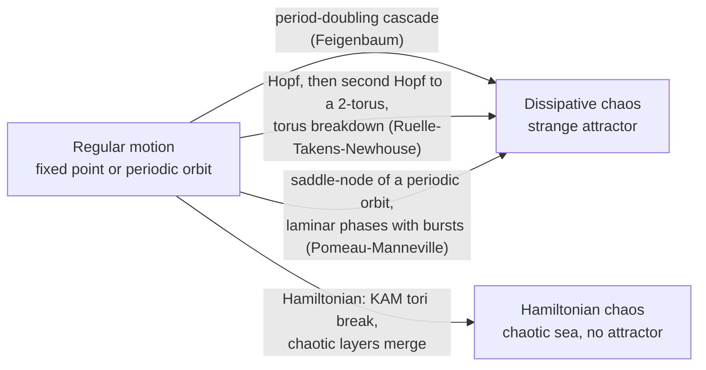

[Classical Mechanics](./) &raquo; Chaos &amp; Nonlinear Dynamics

**Deterministic chaos** is irregular, effectively unpredictable motion produced by equations with no randomness in them. This page covers how chaos is defined and measured (Lyapunov exponents, Poincaré sections), how it appears in conservative systems (KAM theory, the standard map, Arnold diffusion) and in dissipative ones (strange attractors), the bifurcation routes by which regular motion turns chaotic, the diagnostics used on real data, and recent data-driven forecasting methods. The symplectic geometry that underlies Hamiltonian chaos is developed in [Geometric Formalism](geometric-mechanics.html); the integrators needed to simulate chaotic systems faithfully are in [Computational Methods](computational-classical-mechanics.html).

## Determinism without predictability

Laplace's demon expressed the eighteenth-century view that exact knowledge of the present fixes the entire future. Poincaré's work on the gravitational three-body problem in the 1890s showed where this breaks down in practice: near certain unstable orbits the three-body dynamics produces a tangle of trajectories "so complicated that I cannot even attempt to draw it." The equations remain deterministic, but any error in the initial state, however small, is amplified until it dominates the prediction.

Two ingredients are needed:

- **Nonlinearity.** In a linear system, the difference between two solutions is itself a solution of the same linear equation, so errors can grow at most at the rate of the fastest normal mode, and there is no mechanism for folding a growing error back into a bounded region. Linear systems cannot be chaotic.
- **Enough dimensions.** For a continuous-time autonomous flow, the Poincaré–Bendixson theorem rules out chaos in a two-dimensional phase space: bounded trajectories must approach a fixed point or a periodic orbit. Chaos needs a phase space of at least three dimensions. A periodically driven one-degree-of-freedom oscillator qualifies, because the drive phase acts as a third coordinate. Discrete-time maps have no such restriction: the one-dimensional logistic map is chaotic.

### Sensitive dependence and the predictability horizon

Two trajectories that start a small distance $\delta_0$ apart in a chaotic system separate, on average, exponentially:

$$
|\delta(t)| \approx |\delta_0|\, e^{\lambda t}, \qquad \lambda > 0 .
$$

If a forecast is useful only while the error stays below a tolerance $\Delta$, the **predictability horizon** is

$$
t_{\text{pred}} \approx \frac{1}{\lambda} \ln\frac{\Delta}{\delta_0} .
$$

The horizon grows only logarithmically with the precision of the initial data: a tenfold better measurement buys a fixed extra $\lambda^{-1}\ln 10$ of forecast time, never a proportional one. This is why midlatitude weather has an intrinsic predictability limit of roughly two weeks regardless of instrument quality.

Exponential separation alone is not chaos: trajectories in a linear saddle also diverge exponentially, but they simply run off to infinity. Chaos combines **stretching** (local divergence) with **folding** that keeps the motion bounded, so nearby trajectories are repeatedly separated and re-mixed within a finite region. Stretching and folding are what build the fractal structure of strange attractors and the chaotic seas of Hamiltonian systems.

## Lyapunov exponents

The **maximal Lyapunov exponent** makes exponential divergence precise. For a trajectory $Z(t)$ and an infinitesimal perturbation $\delta Z(t)$ evolved by the linearized equations,

$$
\lambda_1 = \lim_{t \to \infty} \frac{1}{t} \ln\frac{|\delta Z(t)|}{|\delta Z(0)|} .
$$

| Sign of $\lambda_1$ | Behavior |
|---|---|
| $\lambda_1 > 0$ | Chaotic: nearby trajectories diverge exponentially |
| $\lambda_1 = 0$ | Marginal: periodic or quasi-periodic motion (separation grows at most polynomially) |
| $\lambda_1 < 0$ | Stable: perturbations decay onto a fixed point or limit cycle |

An $n$-dimensional system has a full **Lyapunov spectrum** $\lambda_1 \geq \lambda_2 \geq \cdots \geq \lambda_n$, one exponent per independent direction in which a small ball of initial conditions is stretched or squeezed. Phase-space volume evolves as $e^{(\sum_i \lambda_i)t}$, which constrains the spectrum:

- **Hamiltonian systems** preserve phase-space volume (Liouville's theorem), so $\sum_i \lambda_i = 0$. More strongly, symplecticity forces the exponents to come in pairs $\pm\lambda_i$. For an autonomous Hamiltonian flow, the direction along the trajectory and the direction across energy surfaces together contribute one pair of zero exponents, and each additional independent conserved quantity contributes another pair.
- **Dissipative systems** contract volume, so $\sum_i \lambda_i < 0$, yet $\lambda_1$ can still be positive. Contraction in some directions combined with stretching in another is the signature of a strange attractor.
- Every bounded trajectory of an autonomous flow that does not settle to a fixed point has at least one zero exponent, for perturbations along the trajectory itself.

The reciprocal $1/\lambda_1$ is the **Lyapunov time**. Representative values:

| System | Lyapunov time or exponent |
|---|---|
| Lorenz system ($\sigma=10$, $\rho=28$, $\beta=8/3$) | spectrum $\approx (0.906,\ 0,\ -14.57)$ per time unit |
| Inner Solar System (Laskar's secular integrations) | about 5 million years |
| Double pendulum released from horizontal ($m = l = 1$) | $\lambda_1 \approx 0.85\ \text{s}^{-1}$ (computed below) |

### Computing the spectrum

Direct integration of two nearby trajectories fails after a few Lyapunov times because their separation saturates at the size of the attractor. The standard fix is the **Benettin algorithm**: integrate the reference trajectory together with a perturbation (either a second nearby trajectory or, better, the tangent-space variational equations), and every interval $\tau$ record $\ln(|\delta_k|/|\delta_0|)$ and rescale the perturbation back to size $\delta_0$ along its current direction. The average of the logged growth rates converges to $\lambda_1$. For the full spectrum, evolve $n$ tangent vectors and re-orthonormalize them with a QR decomposition at each step; the logarithms of the diagonal of $R$ give the individual exponents.

Finite-time Lyapunov exponents (FTLEs), computed over a fixed window rather than in the long-time limit, are also useful on their own. Their ridges in a fluid flow mark **Lagrangian coherent structures**, the moving barriers that organize transport in ocean currents and atmospheric flows.

## Poincaré sections

A continuous flow in a high-dimensional phase space is hard to visualize. A **Poincaré section** reduces it to a discrete map in one fewer dimension:

1. Choose a **surface of section** $\Sigma$ that the flow crosses transversally. For a periodically driven oscillator, sample once per drive period (a stroboscopic map). For an autonomous system, use a hyperplane such as $q_2 = 0$ with $\dot q_2 > 0$.
2. Record each successive intersection $x_0, x_1, x_2, \ldots$ with $\Sigma$.
3. Study the **return map** $x_{k+1} = P(x_k)$.

For a two-degree-of-freedom Hamiltonian system, fixing the energy leaves a three-dimensional energy surface, and the section is a two-dimensional plane that can be plotted directly. The pattern on it diagnoses the motion:

| Pattern on $\Sigma$ | Motion |
|---|---|
| A single point | Periodic orbit |
| A finite set of points | Periodic orbit of higher period |
| A smooth closed curve | Quasi-periodic motion on an invariant torus |
| A chain of small closed curves | Motion on an island around a stable resonant orbit |
| A scattered cloud filling an area | Chaotic motion |

For Hamiltonian flows the return map is **area-preserving**, a consequence of the symplectic structure. It therefore has no attractors: regular islands and chaotic regions coexist indefinitely, which is the picture KAM theory explains.

## Hamiltonian chaos and KAM theory

### Integrable systems and invariant tori

A Hamiltonian system with $n$ degrees of freedom is **integrable** if it has $n$ independent conserved quantities in involution (mutually Poisson-commuting). By the Arnold–Liouville theorem, bounded motion then lies on $n$-dimensional invariant tori, and **action–angle variables** $(I, \theta)$ exist in which $H = H_0(I)$ and each angle advances uniformly at frequency $\omega(I) = \partial H_0/\partial I$. Motion on a torus is periodic when the frequencies are commensurate and quasi-periodic otherwise. The Kepler problem, the free rigid body, and any one-degree-of-freedom conservative system are integrable. Generic systems are not.

### The KAM theorem

The **Kolmogorov–Arnold–Moser theorem** (Kolmogorov 1954; proofs by Arnold 1963 and Moser 1962) answers what happens to the tori under a small non-integrable perturbation

$$
H(I, \theta) = H_0(I) + \varepsilon H_1(I, \theta) .
$$

**Theorem (informal).** Suppose

1. the unperturbed system is **non-degenerate**, $\det\left(\partial^2 H_0 / \partial I^2\right) \neq 0$, so that the frequencies genuinely vary with the actions;
2. the perturbation is small enough, $\varepsilon < \varepsilon_0$; and
3. the torus frequencies satisfy a **Diophantine condition** $|k \cdot \omega| \geq \gamma\, |k|^{-\tau}$ for every nonzero integer vector $k$.

Then the Diophantine tori survive, slightly deformed, and carry quasi-periodic motion. They fill a set whose relative measure tends to 1 as $\varepsilon \to 0$ (the excluded fraction shrinks roughly like $\sqrt{\varepsilon}$).

The resonant tori, where $k \cdot \omega = 0$ for some integer $k$, are the fragile ones. Perturbation theory for them produces **small denominators** $1/(k \cdot \omega)$ that make the series diverge. KAM circumvents this with a rapidly converging Newton-type iteration that works only on sufficiently irrational tori. What happens at the resonances is described by the **Poincaré–Birkhoff theorem**: a resonant torus breaks into an alternating chain of stable (elliptic) and unstable (hyperbolic) periodic orbits. The elliptic orbits are surrounded by small islands, and the stable and unstable manifolds of the hyperbolic orbits intersect transversally in a **homoclinic tangle**, which generates a thin chaotic layer. As $\varepsilon$ grows, these layers widen and merge.

### The standard map

The **Chirikov standard map** is the simplest model of this whole story. It is the stroboscopic map of a rotor kicked periodically with strength $K$:

$$
I_{n+1} = I_n + K \sin\theta_n, \qquad \theta_{n+1} = \theta_n + I_{n+1} \pmod{2\pi} .
$$

<figure class="diagram">
<svg viewBox="0 0 440 440" role="img" aria-labelledby="sm-title" style="max-width:460px;width:100%;height:auto">
<title id="sm-title">Phase portrait of the Chirikov standard map at K = 0.9716: a large central island of invariant curves, chains of smaller islands, and a chaotic sea between them</title>
<image href="{{ '/images/chaos-and-computational-standard-map.png' | relative_url }}" x="40" y="10" width="390" height="390"/>
<rect x="40" y="10" width="390" height="390" fill="none" stroke="currentColor" stroke-width="1.2"/>
<text x="40" y="416" font-size="11" font-family="inherit" fill="currentColor" text-anchor="middle">0</text>
<text x="430" y="416" font-size="11" font-family="inherit" fill="currentColor" text-anchor="middle">2&#960;</text>
<text x="235" y="432" font-size="12" font-family="inherit" fill="currentColor" text-anchor="middle">&#952; (angle)</text>
<text x="34" y="404" font-size="11" font-family="inherit" fill="currentColor" text-anchor="end">&#8722;&#960;</text>
<text x="34" y="18" font-size="11" font-family="inherit" fill="currentColor" text-anchor="end">&#960;</text>
<text x="16" y="205" font-size="12" font-family="inherit" fill="currentColor" text-anchor="middle" transform="rotate(-90 16 205)">I (action)</text>
</svg>
<figcaption>Standard map at $K \approx K_c = 0.9716$, 160 orbits of 1500 iterations each. Closed curves are surviving KAM tori and island chains around stable resonances; the speckled region is a single connected chaotic sea. At this value the last rotational invariant circle is just breaking.</figcaption>
</figure>

- For $K = 0$ the map is integrable: every horizontal line $I = \text{const}$ is an invariant circle.
- For small $K$, most circles survive (KAM), with island chains at rational rotation numbers and thin chaotic layers around them.
- Rotational invariant circles span the full angle range and act as barriers: while any survive, $I$ cannot grow without bound. Greene's residue method places the breakup of the last one, the circle with golden-mean rotation number, at $K_c \approx 0.9716$.
- For $K > K_c$ the chaotic layers connect, and $I$ diffuses without bound. The **Chirikov resonance-overlap criterion** gives a quick estimate of this transition: global chaos sets in roughly when neighboring resonance widths exceed their spacing.

Chirikov's criterion and the standard map are used as working models in accelerator physics, plasma confinement, and comet dynamics.

### Arnold diffusion

With two degrees of freedom, the two-dimensional KAM tori divide each three-dimensional energy surface into separate regions. Chaotic orbits trapped between two surviving tori cannot escape. With three or more degrees of freedom the tori no longer divide the energy surface, and the resonance layers form a connected web. Orbits can drift along this web arbitrarily far in action space, however small $\varepsilon$ is. This is **Arnold diffusion**. It is extremely slow (typically exponentially slow in $1/\varepsilon$), so KAM gives practical but not absolute stability for systems with many degrees of freedom.

### Consequences in physical systems

- **Solar System stability.** The planetary orbits are chaotic, with a Lyapunov time of about 5 million years for the inner planets, so their precise positions cannot be computed beyond roughly 50 million years into the past or future. The chaos is nonetheless confined: in Laskar and Gastineau's 2009 ensemble of 2,501 integrations, only about 1% led to Mercury's eccentricity growing large enough for close encounters or collisions within the Sun's remaining 5-billion-year main-sequence lifetime.
- **Kirkwood gaps.** The main asteroid belt is depleted at mean-motion resonances with Jupiter (3:1, 5:2, 7:3, 2:1). Chaotic transport in these resonances pumps asteroids onto planet-crossing orbits, which is also the main delivery route for meteorites.
- **Chaotic rotation.** Saturn's moon Hyperion, irregularly shaped and on an eccentric orbit, tumbles chaotically. Spin–orbit resonance overlap predicted this, and Voyager and Cassini imaging confirmed it.
- **Particle accelerators.** The *dynamic aperture* of a storage ring, the region of transverse phase space where particles survive for millions of turns, is set by where KAM tori break down under the nonlinear fields of the magnets.
- **Magnetic confinement fusion.** Magnetic field lines in a tokamak or stellarator form a Hamiltonian system. Nested flux surfaces are its KAM tori, and resonant perturbations create magnetic islands and stochastic regions through which heat leaks out.

## Dissipative chaos: strange attractors

In a dissipative system phase-space volume contracts, so long-term motion settles onto an **attractor** of lower dimension. A fixed point (a damped pendulum at rest) and a limit cycle (a clock's steady tick) are regular attractors. When the dynamics on the attractor is chaotic, the attractor is **strange**: bounded, aperiodic, sensitive to initial conditions ($\lambda_1 > 0$), and of **fractal** (non-integer) dimension.

The fractal geometry resolves an apparent contradiction. Dissipation drives the attractor's volume to zero, but stretching prevents it from being a smooth lower-dimensional surface. The flow repeatedly stretches the attracting set in the unstable direction and folds it back onto itself, producing an infinitely layered, Cantor-set-like cross-section.

The canonical example is the **Lorenz system** (1963), a three-mode truncation of convection in a fluid layer heated from below:

$$
\dot{x} = \sigma(y - x), \qquad \dot{y} = x(\rho - z) - y, \qquad \dot{z} = xy - \beta z .
$$

At the classic parameters $\sigma = 10$, $\rho = 28$, $\beta = 8/3$, trajectories trace the two-lobed "butterfly," circling one lobe an irregular number of times before switching to the other. The phase-space contraction rate is constant, $\nabla \cdot \dot{\mathbf{x}} = -(\sigma + 1 + \beta) \approx -13.67$, which matches the sum of the Lyapunov spectrum. In 2002 Warwick Tucker gave a computer-assisted proof that the Lorenz attractor exists and is genuinely strange, resolving Smale's 14th problem.

The **Kaplan–Yorke dimension** links fractal geometry to the Lyapunov spectrum. With $k$ the largest index for which $\lambda_1 + \cdots + \lambda_k \geq 0$,

$$
D_{KY} = k + \frac{\sum_{i=1}^{k} \lambda_i}{|\lambda_{k+1}|} .
$$

For Lorenz, $D_{KY} \approx 2 + 0.906/14.57 \approx 2.06$: slightly more than a surface, far less than a volume.

| Attractor | Type | Notes |
|---|---|---|
| Lorenz | 3D flow | Two-lobed butterfly, $D \approx 2.06$ |
| Rössler | 3D flow | A single stretch-and-fold band, the simplest continuous-time strange attractor |
| Hénon map | 2D map | $x_{n+1} = 1 - a x_n^2 + y_n$, $y_{n+1} = b x_n$; fractal layering visible directly, $D \approx 1.26$ at $a = 1.4$, $b = 0.3$ |
| Duffing oscillator | Driven 2D (3D extended) | Forced nonlinear spring $\ddot x + \delta \dot x + \alpha x + \beta x^3 = \gamma\cos\omega t$ |
| Chua circuit | Electronic | First strange attractor observed in a physical circuit built for the purpose |

## Bifurcations and routes to chaos

Chaos rarely appears all at once. As a control parameter $\mu$ is varied, a system passes through **bifurcations**, parameter values where the number or stability of its fixed points and periodic orbits changes.

| Bifurcation | What happens as $\mu$ crosses the critical value | Normal form |
|---|---|---|
| Saddle-node (fold) | A stable and an unstable fixed point collide and annihilate | $\dot x = \mu - x^2$ |
| Transcritical | Two fixed points pass through each other and exchange stability | $\dot x = \mu x - x^2$ |
| Pitchfork (supercritical) | A symmetric fixed point goes unstable and two stable ones branch off | $\dot x = \mu x - x^3$ |
| Hopf (supercritical) | A stable focus goes unstable and a small limit cycle is born | $\dot r = \mu r - r^3$, $\dot\phi = \omega$ |
| Period-doubling (flip) | A periodic orbit of period $T$ goes unstable and one of period $2T$ appears | $x_{n+1} = -(1+\mu)x_n + x_n^3$ |

Subcritical versions of the pitchfork and Hopf bifurcations produce sudden jumps and hysteresis instead of gradual onset.

### Universality: the logistic map and Feigenbaum constants

The **logistic map** $x_{n+1} = r x_n (1 - x_n)$ on $[0, 1]$ is the standard example of a period-doubling cascade:

<figure class="diagram">
<svg viewBox="0 0 640 360" role="img" aria-labelledby="bif-title" style="max-width:700px;width:100%;height:auto">
<title id="bif-title">Bifurcation diagram of the logistic map for r from 2.8 to 4: a single branch splits at r = 3, again near 3.449, cascades to chaos at about 3.5699, with a period-3 window near 3.83</title>
<image href="{{ '/images/chaos-and-computational-logistic-bifurcation.png' | relative_url }}" x="60" y="20" width="560" height="280" preserveAspectRatio="none"/>
<line x1="60" y1="300" x2="620" y2="300" stroke="currentColor" stroke-width="1.2"/>
<line x1="60" y1="20" x2="60" y2="300" stroke="currentColor" stroke-width="1.2"/>
<line x1="60" y1="300" x2="60" y2="305" stroke="currentColor"/><text x="60" y="318" font-size="11" font-family="inherit" fill="currentColor" text-anchor="middle">2.8</text>
<line x1="153" y1="300" x2="153" y2="305" stroke="currentColor"/><text x="153" y="318" font-size="11" font-family="inherit" fill="currentColor" text-anchor="middle">3.0</text>
<line x1="247" y1="300" x2="247" y2="305" stroke="currentColor"/><text x="247" y="318" font-size="11" font-family="inherit" fill="currentColor" text-anchor="middle">3.2</text>
<line x1="340" y1="300" x2="340" y2="305" stroke="currentColor"/><text x="340" y="318" font-size="11" font-family="inherit" fill="currentColor" text-anchor="middle">3.4</text>
<line x1="433" y1="300" x2="433" y2="305" stroke="currentColor"/><text x="433" y="318" font-size="11" font-family="inherit" fill="currentColor" text-anchor="middle">3.6</text>
<line x1="527" y1="300" x2="527" y2="305" stroke="currentColor"/><text x="527" y="318" font-size="11" font-family="inherit" fill="currentColor" text-anchor="middle">3.8</text>
<line x1="620" y1="300" x2="620" y2="305" stroke="currentColor"/><text x="620" y="318" font-size="11" font-family="inherit" fill="currentColor" text-anchor="middle">4.0</text>
<text x="52" y="304" font-size="11" font-family="inherit" fill="currentColor" text-anchor="end">0</text>
<text x="52" y="24" font-size="11" font-family="inherit" fill="currentColor" text-anchor="end">1</text>
<text x="340" y="345" font-size="12" font-family="inherit" fill="currentColor" text-anchor="middle">control parameter r</text>
<text x="30" y="160" font-size="12" font-family="inherit" fill="currentColor" text-anchor="middle" transform="rotate(-90 30 160)">long-run x</text>
<line x1="419" y1="20" x2="419" y2="300" stroke="currentColor" stroke-dasharray="4 4" opacity="0.6"/>
<text x="415" y="292" font-size="11" font-family="inherit" fill="currentColor" text-anchor="end">r&#8734; &#8776; 3.5699</text>
<text x="541" y="14" font-size="11" font-family="inherit" fill="currentColor" text-anchor="middle">period-3 window</text>
</svg>
<figcaption>Logistic map $x_{n+1} = r x_n (1 - x_n)$: each vertical slice shows the values visited after transients die out. Period doubling accumulates at $r_\infty$; beyond it, chaotic bands are punctuated by periodic windows.</figcaption>
</figure>

The fixed point is stable for $1 < r < 3$. At $r = 3$ it gives way to a 2-cycle, at $r = 1 + \sqrt{6} \approx 3.449$ to a 4-cycle, then an 8-cycle, and so on. The doublings accumulate at $r_\infty \approx 3.5699$, beyond which the motion is chaotic for most $r$, interrupted by periodic windows such as the period-3 window starting at $r = 1 + \sqrt{8} \approx 3.828$. At $r = 4$ the map is conjugate to a shift and has $\lambda = \ln 2$ exactly.

Feigenbaum (1978) discovered that the cascade is **universal**. The spacing of successive doubling thresholds shrinks geometrically with ratio

$$
\delta = \lim_{n \to \infty} \frac{r_n - r_{n-1}}{r_{n+1} - r_n} = 4.669201\ldots,
$$

and the branch widths scale by $\alpha = 2.502907\ldots$. The same constants hold for any smooth one-dimensional map with a single quadratic maximum. Experiments in Rayleigh–Bénard convection, nonlinear electronic circuits, and driven lasers measure the same values. The explanation is a renormalization-group fixed point in the space of maps, the same idea that explains universality at continuous phase transitions.

### The principal routes



1. **Period doubling.** An infinite sequence of period-doublings accumulating at a finite parameter value, governed by the Feigenbaum constants.
2. **Quasi-periodicity (Ruelle–Takens–Newhouse).** Successive Hopf bifurcations add incommensurate frequencies, and after two or three of them the motion on the torus typically breaks up into a strange attractor. This replaced Landau's older picture of turbulence as the superposition of ever more independent frequencies.
3. **Intermittency (Pomeau–Manneville).** Just past a saddle-node bifurcation of a periodic orbit, long nearly periodic ("laminar") phases are interrupted by irregular bursts. The mean laminar duration scales as $(\mu - \mu_c)^{-1/2}$ for the type-I case.
4. **Crises.** A chaotic attractor collides with an unstable periodic orbit or its basin boundary and suddenly expands, merges with another attractor, or disappears, leaving long chaotic transients.

In Hamiltonian systems there are no attractors. The analogous route is the progressive breakup of KAM tori described above.

## Diagnosing chaos in practice

Real data rarely comes with equations. The standard toolkit:

| Diagnostic | What it measures | Notes |
|---|---|---|
| Largest Lyapunov exponent | Rate of divergence of nearby states | From equations (Benettin) or from data (Rosenstein and Kantz algorithms); noise biases it upward |
| Poincaré section or return map | Geometry of the recurrent dynamics | Needs a good choice of section |
| Power spectrum | Frequency content | Periodic: sharp lines. Quasi-periodic: lines at combination frequencies. Chaotic: broadband continuum. Noise is also broadband, so this is not conclusive alone |
| Correlation dimension (Grassberger–Procaccia) | Fractal dimension of the attractor | Needs long, clean time series; easily fooled by noise and short records |
| Delay embedding (Takens 1981) | Reconstructs the attractor from a single observable using the vectors $(s(t), s(t-\tau), \ldots)$ | Embedding dimension $m > 2D$ suffices generically |
| 0–1 test (Gottwald–Melbourne 2004) | Growth of a derived 2D random-walk-like process | Returns about 0 for regular and about 1 for chaotic data; no embedding needed |
| Surrogate-data tests | Whether apparent structure exceeds that of a matched linear stochastic process | Guards against mistaking colored noise for chaos |

**Chaos control.** An unstable periodic orbit embedded in a strange attractor can be stabilized with tiny, well-timed parameter adjustments each time the trajectory passes near it (the Ott–Grebogi–Yorke method, 1990). Because a strange attractor contains infinitely many such orbits, a chaotic system can be switched among many behaviors with little control effort. The idea has been demonstrated in lasers, electronic circuits, chemical reactions, and cardiac tissue.

## Data-driven modeling and forecasting

Machine learning now plays a large role in modeling chaotic systems. None of these methods escapes the Lyapunov horizon. What they can do is approach it more cheaply, or produce calibrated ensembles instead of a single forecast.

- **Reservoir computing.** A fixed random recurrent network with only a trained linear readout. Pathak, Ott and collaborators (2018) used it to forecast the spatiotemporally chaotic Kuramoto–Sivashinsky equation for several Lyapunov times and to reproduce the system's long-term statistics and Lyapunov spectrum.
- **Sparse identification of nonlinear dynamics (SINDy).** Brunton, Proctor and Kutz (2016) fit $\dot x = \Theta(x)\,\Xi$ by sparse regression over a library of candidate terms $\Theta(x)$. The result is an interpretable model, and it recovers the Lorenz equations from simulated trajectories.
- **Koopman and dynamic mode decomposition.** These methods represent nonlinear dynamics by a linear operator acting on observables. They work well for quasi-periodic dynamics and less well once the spectrum becomes continuous, as it does under chaos.
- **Machine-learned weather prediction.** Weather is the most important chaotic forecasting problem. Google DeepMind's GraphCast (*Science*, 2023) matched or beat the ECMWF deterministic forecast on most verification targets. Its ensemble successor GenCast (*Nature*, 2024) produces 15-day probabilistic forecasts that beat ECMWF's operational ensemble on 97% of 1,320 evaluated targets. Operational centers now run such models alongside physics-based ones. They still show the familiar growth of forecast spread with lead time, because the atmosphere's predictability limit belongs to the system, not to the model.

Structure-preserving networks for conservative dynamics, such as Hamiltonian and Lagrangian neural networks, are covered in [Computational Methods](computational-classical-mechanics.html#structure-preserving-machine-learning).

## Worked example: the double pendulum

The double pendulum is the simplest everyday mechanical system that becomes chaotic. At small amplitude it is nearly linear: two coupled normal modes with quasi-periodic motion. Released from horizontal, it has a positive Lyapunov exponent. The script below computes three diagnostics from this page for both regimes: the largest Lyapunov exponent (Benettin renormalization), a Poincaré section, and an energy-conservation check. The energy check confirms that the divergence comes from the dynamics and not from integration error.

```python
import numpy as np
from scipy.integrate import solve_ivp
import matplotlib.pyplot as plt

M1 = M2 = 1.0          # masses (kg)
L1 = L2 = 1.0          # rod lengths (m)
G = 9.81               # gravity (m/s^2)
TOL = dict(method="DOP853", rtol=1e-10, atol=1e-12)

def rhs(t, s):
    """Equations of motion; state s = (theta1, omega1, theta2, omega2)."""
    th1, w1, th2, w2 = s
    d = th2 - th1
    c, sn = np.cos(d), np.sin(d)
    den1 = (M1 + M2) * L1 - M2 * L1 * c * c
    den2 = (L2 / L1) * den1
    dw1 = (M2 * L1 * w1**2 * sn * c + M2 * G * np.sin(th2) * c
           + M2 * L2 * w2**2 * sn - (M1 + M2) * G * np.sin(th1)) / den1
    dw2 = (-M2 * L2 * w2**2 * sn * c
           + (M1 + M2) * (G * np.sin(th1) * c - L1 * w1**2 * sn - G * np.sin(th2))) / den2
    return [w1, dw1, w2, dw2]

def energy(s):
    th1, w1, th2, w2 = s
    T = (0.5 * (M1 + M2) * (L1 * w1)**2 + 0.5 * M2 * (L2 * w2)**2
         + M2 * L1 * L2 * w1 * w2 * np.cos(th1 - th2))
    V = -(M1 + M2) * G * L1 * np.cos(th1) - M2 * G * L2 * np.cos(th2)
    return T + V

def max_lyapunov(s0, d0=1e-8, tau=0.5, n_renorm=400, seed=0):
    """Benettin two-trajectory estimate of the largest Lyapunov exponent (1/s)."""
    s = np.asarray(s0, float)
    v = np.random.default_rng(seed).normal(size=4)
    v *= d0 / np.linalg.norm(v)
    log_sum = 0.0
    for _ in range(n_renorm):
        a = solve_ivp(rhs, (0, tau), s, **TOL).y[:, -1]
        b = solve_ivp(rhs, (0, tau), s + v, **TOL).y[:, -1]
        sep = b - a
        dist = np.linalg.norm(sep)
        log_sum += np.log(dist / d0)
        s, v = a, sep * (d0 / dist)      # renormalize along the stretched direction
    return log_sum / (n_renorm * tau)

def poincare_section(s0, t_max=2000.0):
    """Record (theta2, omega2) each time theta1 passes 0 with omega1 > 0."""
    def cross(t, s):
        return np.sin(s[0])
    cross.direction = 1
    sol = solve_ivp(rhs, (0, t_max), s0, events=cross, **TOL)
    pts = sol.y_events[0]
    pts = pts[np.cos(pts[:, 0]) > 0]                  # keep theta1 = 0, not pi
    return np.mod(pts[:, 2] + np.pi, 2 * np.pi) - np.pi, pts[:, 3]

cases = {"low energy (10 deg, 10 deg)": [np.radians(10), 0, np.radians(10), 0],
         "high energy (90 deg, 90 deg)": [np.pi / 2, 0, np.pi / 2, 0]}

fig, axes = plt.subplots(1, 2, figsize=(11, 4.5))
for ax, (label, s0) in zip(axes, cases.items()):
    lam = max_lyapunov(s0)
    sol = solve_ivp(rhs, (0, 200), s0, **TOL)
    drift = np.max(np.abs(energy(sol.y) - energy(np.array(s0))))
    th2, w2 = poincare_section(s0)
    print(f"{label}: lambda_max = {lam:.3f} 1/s, max |dE| = {drift:.1e} J")
    ax.plot(th2, w2, ".", ms=2)
    ax.set(title=f"{label}\nlambda_max = {lam:.2f} 1/s",
           xlabel=r"$\theta_2$ (rad)", ylabel=r"$\dot\theta_2$ (rad/s)")
plt.tight_layout()
plt.show()
```

<details>
<summary><b>Expected output</b></summary>
<br>
Printed values from a reference run (SciPy 1.18):
<pre>
low energy (10 deg, 10 deg): lambda_max = 0.006 1/s, max |dE| = 1.0e-10 J
high energy (90 deg, 90 deg): lambda_max = 0.848 1/s, max |dE| = 2.3e-07 J
</pre>
The low-energy exponent is zero within the accuracy of a finite run, and its Poincaré section traces a closed curve (quasi-periodic motion on a torus). The high-energy case gives a clearly positive exponent, a Lyapunov time of about 1.2 s, and a section that scatters over an area (a chaotic sea). The energy error is many orders of magnitude smaller than the energy scale $mgl \approx 10$ J in both cases, so the divergence is not a numerical artifact.
</details>

The script uses a high-order adaptive Runge–Kutta method at tight tolerance, which is appropriate for runs of a few thousand oscillations. For much longer integrations of conservative systems, a symplectic method keeps the energy error bounded instead of slowly drifting; see [Computational Methods](computational-classical-mechanics.html).

## Where chaos matters

| Field | Examples |
|---|---|
| Celestial mechanics | Three-body problem, chaotic zones around resonances, long-term planetary stability, chaotic transport of asteroids and comets |
| Atmosphere and climate | Two-week weather predictability limit, ensemble forecasting, Lorenz-type low-order models |
| Fluid dynamics | Transition to turbulence, chaotic advection and mixing in laminar flows (stretch-and-fold at small scales) |
| Engineering | Nonlinear vibration and buckling, rattling in gear trains, chaotic Chua and Colpitts circuits, chaos control |
| Plasma and accelerator physics | Magnetic islands and stochastic field lines, dynamic aperture of storage rings |
| Biology and medicine | Cardiac arrhythmias, neuronal bursting, population dynamics (logistic and Ricker maps) |
| Statistical mechanics | Chaos as the microscopic justification for ergodicity and mixing; see [Statistical Mechanics](../statistical-mechanics/) |

## See also

- [Geometric Formalism](geometric-mechanics.html): symplectic structure, Liouville's theorem, and the Arnold–Liouville theorem behind invariant tori and area-preserving maps.
- [Computational Methods](computational-classical-mechanics.html): symplectic and variational integrators for long simulations of chaotic Hamiltonian systems.
- [Lagrangian &amp; Hamiltonian Mechanics](lagrangian-hamiltonian.html): phase space, canonical transformations, and action–angle variables.
- [Oscillations &amp; Waves](waves.html): the linear and weakly nonlinear oscillators that chaos theory generalizes.
- [Statistical Mechanics](../statistical-mechanics/): how chaotic microscopic dynamics underpins ergodicity and the approach to equilibrium.
- [Classical Mechanics Hub](./): back to the overview.
