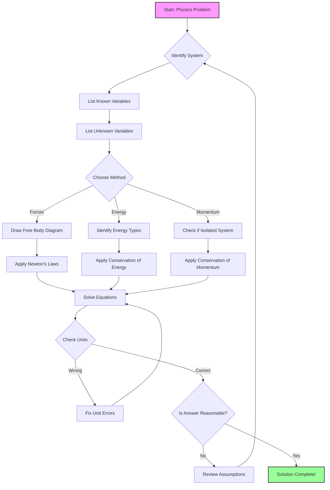

<!-- Custom styles are now loaded via main.scss -->

<div class="hero-section" style="background: linear-gradient(135deg, #11998e 0%, #38ef7d 100%); color: white; padding: 3rem 2rem; margin: -2rem -3rem 2rem -3rem; text-align: center;">
  <h1 style="color: white; margin: 0; font-size: 2.5rem;">Chaos, Modern Topics &amp; Computation</h1>
  <p style="font-size: 1.25rem; margin-top: 1rem; opacity: 0.9;">Nonlinear dynamics, KAM theory, symplectic geometry, numerical integrators, and the frontiers of classical mechanics.</p>
</div>

[Classical Mechanics](./)

## When Predictability Breaks Down: Chaos and Nonlinear Dynamics

### The End of the Clockwork Universe

For centuries after Newton, physicists believed the universe was deterministic—if you knew initial conditions perfectly, you could predict the future forever. Then came a shocking discovery: even simple classical systems can be unpredictable. Chaos theory studies exactly these systems—fully deterministic, yet so sensitive to initial conditions that long-term prediction becomes impossible.

### Lyapunov Exponents

Measure of sensitivity to initial conditions:
$$
\lambda = \lim_{t \to \infty} \frac{1}{t} \ln\left(\frac{|\delta Z(t)|}{|\delta Z_0|}\right)
$$

**Chaotic system:** At least one positive Lyapunov exponent.

### Poincaré Sections

Reduce continuous dynamics to discrete map:
- Choose surface of section Σ
- Record intersections of trajectory with Σ
- Study resulting discrete map

### KAM Theory: Order in Chaos

Just when chaos seems to destroy all hope of understanding, KAM theory provides comfort. Even in chaotic systems, islands of regularity persist.

**Kolmogorov-Arnold-Moser theorem:** Small perturbations can't destroy everything
- Most quasi-periodic orbits survive (slightly deformed)
- Chaos is confined to specific regions
- Regular and chaotic motion coexist

**The surprising result:** The solar system is mostly stable despite being chaotic! KAM theory explains why planets haven't collided after billions of years.

**Mathematical Statement:**
For an integrable Hamiltonian H₀(I) perturbed by εH₁(I,θ), if:
1. The frequency map ω(I) = ∂H₀/∂I is non-degenerate: det(∂²H₀/∂I²) ≠ 0
2. The perturbation ε is sufficiently small
3. The frequencies satisfy a Diophantine condition: |ω·k| ≥ γ/|k|^τ for all k ∈ ℤⁿ\{0}

Then most invariant tori with irrational frequency ratios persist.

**Applications:**
- **Asteroid Belt Stability**: Kirkwood gaps where resonances destroy orbits
- **Particle Accelerators**: Beam stability in storage rings
- **Plasma Confinement**: Magnetic surfaces in fusion reactors

### Strange Attractors

**Lorenz system:**
$$
\dot{x} = \sigma(y - x), \quad \dot{y} = x(\rho - z) - y, \quad \dot{z} = xy - \beta z
$$

**Properties:**
- Fractal dimension
- Sensitive dependence on initial conditions
- Bounded but non-periodic

## Modern Perspectives: Geometry Rules

### Why Geometry?

As we've climbed from Newton to Lagrange to Hamilton, we've increasingly seen that mechanics is really about geometry. Forces are vectors, energy is a scalar, but phase space has rich geometric structure. Modern physics embraces this geometric viewpoint.

### Symplectic Geometry: The Natural Language

**Symplectic manifold:** (M, ω) where ω is a closed, non-degenerate 2-form.

**Canonical coordinates:** ω = Σᵢ dpᵢ ∧ dqᵢ

**Darboux's theorem:** All symplectic manifolds locally look the same.

### Fiber Bundles and Gauge Theory

**Configuration space:** Q (base manifold)
**Phase space:** T*Q (cotangent bundle)
**Lagrangian mechanics:** On TQ (tangent bundle)

**Connection 1-form:** Describes parallel transport
**Curvature 2-form:** F = dA + A ∧ A

### Geometric Phases

**Berry phase:** For cyclic evolution:
$$
\gamma = i\oint \langle\psi|\nabla_R|\psi\rangle \cdot dR
$$

**Hannay angle:** Classical analog of Berry phase
**Foucault pendulum:** Example of geometric phase

## From Theory to Practice: Modern Applications

The abstract frameworks developed in the earlier sections aren't just mathematical elegance—they're essential for modern technology and science:

### Molecular Dynamics

```python
def verlet_integration(positions, velocities, forces, dt, mass):
    """Velocity Verlet algorithm for MD simulation"""
    # Update positions
    positions += velocities * dt + 0.5 * forces/mass * dt**2
    
    # Calculate new forces
    forces_new = calculate_forces(positions)
    
    # Update velocities
    velocities += 0.5 * (forces + forces_new)/mass * dt
    
    return positions, velocities, forces_new
```

### Celestial Mechanics

**N-body problem:** No general analytical solution for N ≥ 3

**Restricted three-body problem:**
- Lagrange points (L1-L5)
- Stable (L4, L5) and unstable (L1-L3) equilibria
- Applications: space mission design

### Plasma Physics

**Vlasov equation:**
$$
\frac{\partial f}{\partial t} + \mathbf{v} \cdot \nabla_x f + \frac{q}{m}(\mathbf{E} + \mathbf{v} \times \mathbf{B}) \cdot \nabla_v f = 0
$$

**Kinetic theory:** Bridge between particle and fluid descriptions

## Computational Methods: Respecting the Physics

### The Numerical Challenge

Computers can't solve differential equations exactly—they take small steps. But naive methods gradually violate conservation laws, leading to unphysical results. The solution? Use the geometric structure!

### Symplectic Integrators: Preserving What Matters

Preserve phase space structure:

```python
def symplectic_euler(q, p, H, dt):
    """First-order symplectic integrator"""
    p_new = p - dt * grad_q(H, q, p)
    q_new = q + dt * grad_p(H, q, p_new)
    return q_new, p_new

def stormer_verlet(q, p, H, dt):
    """Second-order symplectic integrator"""
    p_half = p - 0.5*dt * grad_q(H, q, p)
    q_new = q + dt * grad_p(H, q, p_half)
    p_new = p_half - 0.5*dt * grad_q(H, q_new, p_half)
    return q_new, p_new
```

### Variational Integrators: Discrete Mechanics Done Right

Remember how Lagrangian mechanics came from minimizing action? Variational integrators apply this principle directly to discrete time steps. Instead of discretizing differential equations (which can introduce errors), we discretize the action principle itself.

The result: excellent long-term conservation of discrete momentum and energy, even for very long simulations. This is how we can accurately simulate the solar system for millions of years!
$$
S_d = \sum_k L_d(q_k, q_{k+1}, h)
$$

**Discrete Euler-Lagrange equations:**
$$
D_2 L_d(q_{k-1}, q_k) + D_1 L_d(q_k, q_{k+1}) = 0
$$

## The Living Edge of Classical Mechanics

You might think classical mechanics is a "finished" subject, but research continues at the frontiers:

### Quantum-Classical Correspondence

**Ehrenfest theorem:** ⟨x⟩ satisfies classical equations (exactly only for potentials at most quadratic; approximately otherwise)
**WKB approximation:** Semi-classical limit
**Coherent states:** Minimal uncertainty wave packets

### Integrability and Solitons

**Lax pairs:** L̇ = [L, M]
**Inverse scattering:** Solve nonlinear PDEs
**Toda lattice:** Exactly solvable many-body system

### Topological Mechanics

**Topological invariants:** Chern numbers, winding numbers
**Edge states:** Protected by topology
**Applications:** Mechanical metamaterials

### Machine Learning Meets Mechanics

The newest frontier: using AI to discover physical laws from data. But there's a catch—naive neural networks don't respect physics. The solution? Build physical principles into the architecture:

**Neural ODEs:** Learn dynamics from data while guaranteeing smooth evolution
**Hamiltonian neural networks:** Neural nets that automatically conserve energy
**Physics-informed neural networks:** Incorporate PDEs as constraints

These approaches let us discover governing equations from observations—essentially automating what took humans centuries to develop!

**Recent Breakthroughs (2023-2024):**
- **Lagrangian Neural Networks**: Directly learn Lagrangian L(q,q̇) from data, guaranteeing energy conservation
- **Geometric Deep Learning**: Neural networks on manifolds preserving symplectic structure
- **AI Feynman 2.0**: Symbolic regression discovering analytical physics equations
- **Graph Neural Networks**: Learning many-body interactions from particle trajectories

**Example: Learning Unknown Forces**
```python
import torch
import torch.nn as nn

class LagrangianNN(nn.Module):
    """Neural network that learns the Lagrangian from data"""
    def __init__(self, q_dim):
        super().__init__()
        self.net = nn.Sequential(
            nn.Linear(2*q_dim, 128),
            nn.Softplus(),
            nn.Linear(128, 128),
            nn.Softplus(),
            nn.Linear(128, 1)
        )
    
    def forward(self, q, q_dot):
        """Returns learned Lagrangian L(q, q̇)"""
        return self.net(torch.cat([q, q_dot], dim=-1))
    
    def get_accelerations(self, q, q_dot):
        """Derive accelerations using Euler-Lagrange equations"""
        L = self.forward(q, q_dot)
        
        # Compute ∂L/∂q and ∂L/∂q̇
        dL_dq = torch.autograd.grad(L.sum(), q, create_graph=True)[0]
        dL_dq_dot = torch.autograd.grad(L.sum(), q_dot, create_graph=True)[0]
        
        # Time derivative of ∂L/∂q̇
        d_dt_dL_dq_dot = torch.autograd.grad(
            (dL_dq_dot * q_dot).sum(), q, create_graph=True
        )[0]
        
        # Euler-Lagrange: q̈ = (∂L/∂q - d/dt(∂L/∂q̇)) / (∂²L/∂q̇²)
        return dL_dq - d_dt_dL_dq_dot
```

## Advanced Mathematical Tools

### Differential Geometry

**Tangent bundle:** TM = ∪ₓ TₓM
**Cotangent bundle:** T*M = ∪ₓ T*ₓM
**Lie derivatives:** ℒ_X Y = [X, Y]

### Lie Groups and Algebras

**Momentum map:** J: M → g*
**Coadjoint orbits:** Symplectic manifolds
**Reduction:** Quotient by symmetry group

### Category Theory

**Classical mechanics as functor:**
- Objects: Configuration spaces
- Morphisms: Canonical transformations
- Composition: Sequential transformations

## References and Further Reading

### Graduate Textbooks
1. **Goldstein, Poole & Safko** - *Classical Mechanics* (3rd Edition)
2. **Arnold** - *Mathematical Methods of Classical Mechanics*
3. **Landau & Lifshitz** - *Mechanics* (Course of Theoretical Physics Vol. 1)
4. **José & Saletan** - *Classical Dynamics: A Contemporary Approach*

### Research Monographs
1. **Marsden & Ratiu** - *Introduction to Mechanics and Symmetry*
2. **Abraham & Marsden** - *Foundations of Mechanics*
3. **Ott** - *Chaos in Dynamical Systems*
4. **Tabor** - *Chaos and Integrability in Nonlinear Dynamics*

### Recent Research Directions
1. **Geometric Mechanics:** Port-Hamiltonian systems, discrete mechanics
2. **Quantum-Classical Hybrid Systems:** Decoherence, measurement
3. **Machine Learning:** Data-driven discovery of conservation laws
4. **Topological Mechanics:** Mechanical metamaterials, protected states
5. **Stochastic Mechanics:** Noise-induced phenomena, large deviations

## Applications

### Engineering Applications
- **Bridge Design:** Using statics to calculate load distributions
- **Vehicle Dynamics:** Analyzing forces during acceleration and turning
- **Machinery:** Designing gears, pulleys, and mechanical systems

### Everyday Examples
- **Sports:** Trajectory of a basketball, golf ball, or baseball
- **Transportation:** Car acceleration, braking distances
- **Amusement Parks:** Forces experienced on roller coasters

### Astronomical Applications
- **Satellite Orbits:** Calculating orbital parameters
- **Planetary Motion:** Predicting positions of planets
- **Space Missions:** Trajectory planning for spacecraft

## When Classical Mechanics Fails

### The Boundaries of the Classical World

As powerful as classical mechanics is, nature has surprises that require new physics:

Classical mechanics breaks down in several regimes:

1. **High Speeds:** When velocities approach the speed of light, time dilates and momentum grows without bound (the energy diverges as $v \to c$)—enter special relativity
2. **Small Scales:** At atomic scales, particles exhibit wave-like behavior—enter quantum mechanics
3. **Strong Gravitational Fields:** Near black holes, space and time curve—enter general relativity
4. **Many Particles:** With 10²³ particles, statistical mechanics becomes necessary

But here's the beautiful part: the mathematical structures developed in the earlier sections—Lagrangians, Hamiltonians, symmetries—carry over to these new theories. Classical mechanics isn't wrong; it's the limiting case of deeper theories.

## Advanced Code Examples

### Double Pendulum Chaos Visualization

```python
import numpy as np
from scipy.integrate import solve_ivp
import matplotlib.pyplot as plt
from matplotlib.animation import FuncAnimation

def double_pendulum_derivatives(t, state, m1, m2, l1, l2, g):
    """Compute derivatives for the double pendulum.

    State convention: [theta1, z1, theta2, z2], where z_i = d(theta_i)/dt.
    The explicit equations of motion below follow the canonical
    double-pendulum Lagrangian derivation (see, e.g., the standard
    Matplotlib double-pendulum example / Wikipedia formulas).
    """
    theta1, z1, theta2, z2 = state

    # Angle difference: theta2 - theta1
    delta = theta2 - theta1
    c, s = np.cos(delta), np.sin(delta)

    dydt = np.zeros_like(state)
    dydt[0] = z1  # dtheta1/dt
    dydt[2] = z2  # dtheta2/dt

    # dz1/dt
    den1 = (m1 + m2)*l1 - m2*l1*c*c
    dydt[1] = (m2*l1*z1*z1*s*c
               + m2*g*np.sin(theta2)*c
               + m2*l2*z2*z2*s
               - (m1 + m2)*g*np.sin(theta1)) / den1

    # dz2/dt
    den2 = (l2/l1)*den1
    dydt[3] = (-m2*l2*z2*z2*s*c
               + (m1 + m2)*g*np.sin(theta1)*c
               - (m1 + m2)*l1*z1*z1*s
               - (m1 + m2)*g*np.sin(theta2)) / den2

    return dydt

# Parameters
m1 = m2 = 1.0
l1 = l2 = 1.0
g = 9.81

# Initial conditions - small perturbation shows chaos
theta1_0 = np.pi/2
theta2_0 = np.pi/2
z1_0 = 0
z2_0 = 0

# Solve for two slightly different initial conditions
state0_1 = [theta1_0, z1_0, theta2_0, z2_0]
state0_2 = [theta1_0 + 0.001, z1_0, theta2_0, z2_0]  # Small perturbation

t_span = (0, 20)
t_eval = np.linspace(*t_span, 2000)

sol1 = solve_ivp(double_pendulum_derivatives, t_span, state0_1, 
                 args=(m1, m2, l1, l2, g), t_eval=t_eval, 
                 method='DOP853', rtol=1e-10)

sol2 = solve_ivp(double_pendulum_derivatives, t_span, state0_2, 
                 args=(m1, m2, l1, l2, g), t_eval=t_eval, 
                 method='DOP853', rtol=1e-10)

# Plot phase space and divergence
fig, axes = plt.subplots(2, 2, figsize=(12, 10))

# Phase space trajectories
ax = axes[0, 0]
ax.plot(sol1.y[0], sol1.y[1], 'b-', alpha=0.7, label='Original')
ax.plot(sol2.y[0], sol2.y[1], 'r-', alpha=0.7, label='Perturbed')
ax.set_xlabel(r'$\theta_1$')
ax.set_ylabel(r'$\dot{\theta}_1$')
ax.set_title('Phase Space: Pendulum 1')
ax.legend()
ax.grid(True, alpha=0.3)

# Poincaré section
ax = axes[0, 1]
# Sample when theta2 crosses zero with positive velocity
crossings = np.where(np.diff(np.sign(sol1.y[2])) > 0)[0]
ax.scatter(sol1.y[0][crossings], sol1.y[1][crossings], c='b', s=10, alpha=0.5)
ax.set_xlabel(r'$\theta_1$')
ax.set_ylabel(r'$\dot{\theta}_1$')
ax.set_title('Poincaré Section')
ax.grid(True, alpha=0.3)

# Lyapunov exponent estimation
ax = axes[1, 0]
divergence = np.sqrt((sol1.y[0] - sol2.y[0])**2 + 
                    (sol1.y[1] - sol2.y[1])**2)
log_divergence = np.log(divergence + 1e-15)
ax.semilogy(sol1.t, divergence)
ax.set_xlabel('Time (s)')
ax.set_ylabel('Phase Space Distance')
ax.set_title('Sensitive Dependence on Initial Conditions')
ax.grid(True, alpha=0.3)

# Energy conservation check
ax = axes[1, 1]
# Calculate total energy
theta1, z1, theta2, z2 = sol1.y
c = np.cos(theta1 - theta2)
T = 0.5*m1*(l1*z1)**2 + 0.5*m2*((l1*z1)**2 + (l2*z2)**2 + 
    2*l1*l2*z1*z2*c)
V = -m1*g*l1*np.cos(theta1) - m2*g*(l1*np.cos(theta1) + 
    l2*np.cos(theta2))
E = T + V

ax.plot(sol1.t, E - E[0], 'g-')
ax.set_xlabel('Time (s)')
ax.set_ylabel('Energy Error')
ax.set_title('Energy Conservation')
ax.grid(True, alpha=0.3)

plt.tight_layout()
plt.show()

# Estimate Lyapunov exponent
from scipy import stats
# Linear fit to log divergence in growth region
t_fit = sol1.t[100:500]  # Avoid initial transient and saturation
log_div_fit = log_divergence[100:500]
slope, intercept, r_value, p_value, std_err = stats.linregress(t_fit, log_div_fit)
print(f"Estimated Lyapunov exponent: {slope:.4f} s^-1")
print(f"R-squared: {r_value**2:.4f}")
```

### Symplectic Integration Comparison

```python
def hamiltonian_pendulum(q, p, m=1, l=1, g=9.81):
    """Hamiltonian for simple pendulum"""
    return p**2/(2*m*l**2) + m*g*l*(1 - np.cos(q))

def euler_step(q, p, H, dt):
    """Standard Euler method (not symplectic)"""
    dH_dq = (H(q + 1e-8, p) - H(q, p))/1e-8
    dH_dp = (H(q, p + 1e-8) - H(q, p))/1e-8
    
    q_new = q + dt * dH_dp
    p_new = p - dt * dH_dq
    return q_new, p_new

def symplectic_euler_step(q, p, H, dt):
    """Symplectic Euler method"""
    dH_dq = (H(q + 1e-8, p) - H(q, p))/1e-8
    p_new = p - dt * dH_dq
    
    dH_dp = (H(q, p_new + 1e-8) - H(q, p_new))/1e-8
    q_new = q + dt * dH_dp
    return q_new, p_new

def leapfrog_step(q, p, H, dt):
    """Leapfrog/Störmer-Verlet method"""
    dH_dq = (H(q + 1e-8, p) - H(q, p))/1e-8
    p_half = p - 0.5*dt * dH_dq
    
    dH_dp = (H(q, p_half + 1e-8) - H(q, p_half))/1e-8
    q_new = q + dt * dH_dp
    
    dH_dq_new = (H(q_new + 1e-8, p_half) - H(q_new, p_half))/1e-8
    p_new = p_half - 0.5*dt * dH_dq_new
    return q_new, p_new

# Compare integrators
q0, p0 = 3.0, 0.0  # Large amplitude
dt = 0.1
n_steps = 10000

# Storage for trajectories
trajectories = {
    'Euler': {'q': [q0], 'p': [p0], 'E': []},
    'Symplectic Euler': {'q': [q0], 'p': [p0], 'E': []},
    'Leapfrog': {'q': [q0], 'p': [p0], 'E': []}
}

# Run simulations
for method, integrator in [('Euler', euler_step), 
                           ('Symplectic Euler', symplectic_euler_step),
                           ('Leapfrog', leapfrog_step)]:
    q, p = q0, p0
    for _ in range(n_steps):
        q, p = integrator(q, p, hamiltonian_pendulum, dt)
        trajectories[method]['q'].append(q)
        trajectories[method]['p'].append(p)
        trajectories[method]['E'].append(hamiltonian_pendulum(q, p))

# Plot results
fig, axes = plt.subplots(1, 3, figsize=(15, 5))

# Phase space
ax = axes[0]
for method, style in [('Euler', 'r-'), ('Symplectic Euler', 'g-'), 
                     ('Leapfrog', 'b-')]:
    traj = trajectories[method]
    ax.plot(traj['q'], traj['p'], style, alpha=0.7, label=method)
ax.set_xlabel(r'$\theta$')
ax.set_ylabel(r'$p_\theta$')
ax.set_title('Phase Space Trajectories')
ax.legend()
ax.grid(True, alpha=0.3)

# Energy conservation
ax = axes[1]
t = np.arange(n_steps + 1) * dt
E0 = hamiltonian_pendulum(q0, p0)
for method, style in [('Euler', 'r-'), ('Symplectic Euler', 'g-'), 
                     ('Leapfrog', 'b-')]:
    E = np.array([E0] + trajectories[method]['E'])
    ax.semilogy(t, np.abs(E - E0) + 1e-16, style, label=method)
ax.set_xlabel('Time')
ax.set_ylabel('Energy Error')
ax.set_title('Energy Conservation')
ax.legend()
ax.grid(True, alpha=0.3)

# Phase space area preservation
ax = axes[2]
for method, color in [('Euler', 'red'), ('Symplectic Euler', 'green'), 
                     ('Leapfrog', 'blue')]:
    traj = trajectories[method]
    # Sample points in phase space
    q_vals = np.array(traj['q'][::100])
    p_vals = np.array(traj['p'][::100])
    ax.scatter(q_vals[:50], p_vals[:50], c=color, alpha=0.6, 
              label=f'{method} (early)', s=30)
    ax.scatter(q_vals[-50:], p_vals[-50:], c=color, alpha=0.6, 
              marker='x', label=f'{method} (late)', s=30)
ax.set_xlabel(r'$\theta$')
ax.set_ylabel(r'$p_\theta$')
ax.set_title('Phase Space Volume Preservation')
ax.legend(bbox_to_anchor=(1.05, 1), loc='upper left')
ax.grid(True, alpha=0.3)

plt.tight_layout()
plt.show()
```

### Simulating Projectile Motion with Python

```python
import numpy as np
import matplotlib.pyplot as plt
from matplotlib.animation import FuncAnimation

def projectile_motion(v0, angle, g=9.81, dt=0.01):
    """Simulate projectile motion"""
    # Convert angle to radians
    theta = np.radians(angle)
    
    # Initial conditions
    vx = v0 * np.cos(theta)
    vy = v0 * np.sin(theta)
    
    # Lists to store trajectory
    x_vals = [0]
    y_vals = [0]
    t_vals = [0]
    
    # Simulate until projectile hits ground
    x, y, t = 0, 0, 0
    while True:
        t += dt
        x += vx * dt
        y += vy * dt
        vy -= g * dt
        
        if y < 0:
            break
            
        x_vals.append(x)
        y_vals.append(y)
        t_vals.append(t)
    
    return np.array(x_vals), np.array(y_vals), np.array(t_vals)

# Create visualization
fig, (ax1, ax2) = plt.subplots(1, 2, figsize=(12, 5))

# Plot trajectory for different angles
angles = [30, 45, 60, 75]
v0 = 20  # Initial velocity (m/s)

for angle in angles:
    x, y, t = projectile_motion(v0, angle)
    ax1.plot(x, y, label=f'{angle}°')
    
    # Calculate range and max height
    range_val = x[-1]
    max_height = np.max(y)
    print(f"Angle: {angle}°, Range: {range_val:.2f}m, Max Height: {max_height:.2f}m")

ax1.set_xlabel('Distance (m)')
ax1.set_ylabel('Height (m)')
ax1.set_title('Projectile Motion for Different Launch Angles')
ax1.legend()
ax1.grid(True, alpha=0.3)

# Energy conservation demonstration
x, y, t = projectile_motion(v0, 45)
vx = v0 * np.cos(np.radians(45))
vy_initial = v0 * np.sin(np.radians(45))
vy = vy_initial - 9.81 * t

# Calculate energies
mass = 1  # kg
KE = 0.5 * mass * (vx**2 + vy**2)
PE = mass * 9.81 * y
TE = KE + PE

ax2.plot(t, KE, label='Kinetic Energy')
ax2.plot(t, PE, label='Potential Energy')
ax2.plot(t, TE, label='Total Energy', linestyle='--')
ax2.set_xlabel('Time (s)')
ax2.set_ylabel('Energy (J)')
ax2.set_title('Energy Conservation in Projectile Motion')
ax2.legend()
ax2.grid(True, alpha=0.3)

plt.tight_layout()
plt.show()
```

<details>
<summary><b>Expected Output</b></summary>
<br>
The code produces two plots:
<ol>
<li>Left plot shows parabolic trajectories for different launch angles (30°, 45°, 60°, 75°)</li>
<li>Right plot demonstrates energy conservation with constant total energy throughout the motion</li>
</ol>
Console output shows range and maximum height for each angle.
</details>

<p class="referenceBoxes type3"><a href="https://github.com/jakevdp/PythonDataScienceHandbook/blob/master/notebooks/04.08-Multiple-Subplots.ipynb"> Tutorial: <b><i>Advanced Matplotlib Plotting Techniques</i></b></a></p>

## Problem-Solving Strategies

<details>
<summary><b>Interactive Problem-Solving Flowchart</b></summary>
<br>



</details>

1. **Identify the System:** Clearly define what objects are involved
2. **Draw Diagrams:** Free body diagrams for forces, motion diagrams for kinematics
3. **Choose Coordinate System:** Select axes that simplify the problem
4. **List Known/Unknown:** Organize given information and what needs to be found
5. **Select Appropriate Equations:** Use conservation laws when applicable
6. **Check Units:** Ensure dimensional consistency
7. **Verify Reasonableness:** Does the answer make physical sense?

## Historical Context

Classical mechanics was developed over centuries:
- **Galileo Galilei (1564-1642):** Studied motion and inertia
- **Isaac Newton (1643-1727):** Formulated the laws of motion and gravitation
- **Leonhard Euler (1707-1783):** Developed analytical mechanics
- **Joseph-Louis Lagrange (1736-1813):** Created Lagrangian mechanics
- **William Rowan Hamilton (1805-1865):** Developed Hamiltonian mechanics

These developments laid the foundation for modern physics and engineering.

## Essential Resources

<p class="referenceBoxes type3"><a href="https://www.feynmanlectures.caltech.edu/I_toc.html"> Book: <b><i>The Feynman Lectures on Physics, Volume I</i></b></a></p>
<p class="referenceBoxes type3"><a href="https://ocw.mit.edu/courses/physics/8-01sc-classical-mechanics-fall-2016/"> Course: <b><i>MIT 8.01 Classical Mechanics</i></b></a></p>
<p class="referenceBoxes type3"><a href="https://www.youtube.com/playlist?list=PLyQSN7X0ro203puVhQsmCj9qhlFQ-As8e"> Video Series: <b><i>Classical Mechanics - Walter Lewin</i></b></a></p>
<p class="referenceBoxes type3"><a href="https://github.com/sympy/sympy"> Library: <b><i>SymPy - Symbolic Mathematics in Python</i></b></a></p>

---

## Continue

| Previous | Next |
|----------|------|
| [← Lagrangian &amp; Hamiltonian Mechanics](lagrangian-hamiltonian.html) | [Classical Mechanics Hub](./) |

### See Also

<div class="see-also-card">
  <h4>Where to go next</h4>
  <ul>
    <li><a href="../quantum-mechanics/">Quantum Mechanics</a> — where classical mechanics meets the microscopic world and emerges as the $\hbar \to 0$ limit.</li>
    <li><a href="../relativity/">Relativity</a> — what replaces Newtonian mechanics when speeds approach $c$ or gravity gets strong.</li>
    <li><a href="../statistical-mechanics/">Statistical Mechanics</a> — bridging Newton's laws for many particles to thermodynamics.</li>
    <li><a href="../thermodynamics.html">Thermodynamics</a> — energy, work, and heat in mechanical systems.</li>
    <li><a href="../computational-physics/">Computational Physics</a> — symplectic integrators and numerical methods for complex mechanical systems.</li>
    <li><a href="../">Classical Mechanics Hub</a> — back to the overview.</li>
  </ul>
</div>
