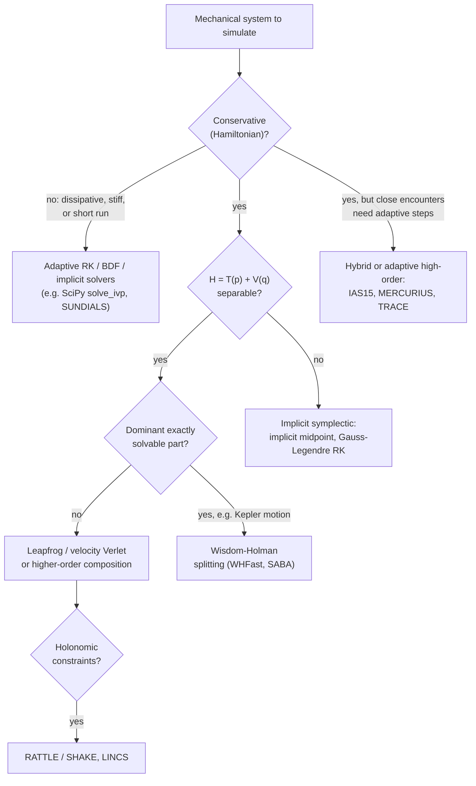
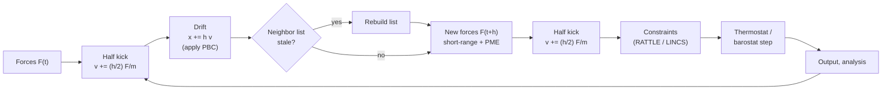

[Classical Mechanics](./) &raquo; Computational Methods

**Geometric numerical integration** is the design of time-stepping methods that keep the qualitative structure of the equations of motion: the symplectic form, time-reversibility, conservation laws, and constraints. This page covers symplectic splitting and composition methods and the backward error analysis that explains their long-time accuracy, variational integrators, and the two biggest users of these methods: molecular dynamics and gravitational N-body simulation. It closes with neural-network models that build Hamiltonian structure in. The underlying geometry is developed in [Geometric Formalism](geometric-mechanics.html). General-purpose numerical methods (ODE and PDE solvers, Monte Carlo) are covered in [Computational Physics](../computational-physics/).

## Why structure matters

A numerical integrator advances the state by a discrete step $h$ and makes a small local error at each step. In a generic mechanical simulation these errors are not random. They consistently push the solution in one direction, violating the conservation laws that define the dynamics: energy drifts, orbits spiral inward or outward, and after enough steps the simulated system no longer resembles the physical one.

Hamilton's equations are a special class of ODE. Their flow preserves the symplectic 2-form, and hence phase-space volume. Integrators that preserve the same structure, called **symplectic integrators**, are often *less* accurate per step than a high-order Runge–Kutta method. Over long runs they are far more faithful, because their energy error stays bounded instead of growing. The figure below shows the effect for a Kepler orbit.

<figure class="diagram">
<svg viewBox="0 0 640 300" role="img" aria-labelledby="ee-title" style="max-width:680px;width:100%;height:auto">
<title id="ee-title">Relative energy error versus number of orbits for an e = 0.5 Kepler orbit at 100 steps per orbit: RK4 grows linearly, leapfrog and fourth-order Yoshida stay flat</title>
<line x1="66" y1="250" x2="610" y2="250" stroke="currentColor" stroke-width="0.5" opacity="0.2"/><text x="60" y="254" font-size="11" font-family="inherit" fill="currentColor" text-anchor="end">10<tspan dy="-5" font-size="8">-7</tspan></text>
<line x1="66" y1="218.6" x2="610" y2="218.6" stroke="currentColor" stroke-width="0.5" opacity="0.2"/><text x="60" y="222.6" font-size="11" font-family="inherit" fill="currentColor" text-anchor="end">10<tspan dy="-5" font-size="8">-6</tspan></text>
<line x1="66" y1="187.1" x2="610" y2="187.1" stroke="currentColor" stroke-width="0.5" opacity="0.2"/><text x="60" y="191.1" font-size="11" font-family="inherit" fill="currentColor" text-anchor="end">10<tspan dy="-5" font-size="8">-5</tspan></text>
<line x1="66" y1="155.7" x2="610" y2="155.7" stroke="currentColor" stroke-width="0.5" opacity="0.2"/><text x="60" y="159.7" font-size="11" font-family="inherit" fill="currentColor" text-anchor="end">10<tspan dy="-5" font-size="8">-4</tspan></text>
<line x1="66" y1="124.3" x2="610" y2="124.3" stroke="currentColor" stroke-width="0.5" opacity="0.2"/><text x="60" y="128.3" font-size="11" font-family="inherit" fill="currentColor" text-anchor="end">10<tspan dy="-5" font-size="8">-3</tspan></text>
<line x1="66" y1="92.9" x2="610" y2="92.9" stroke="currentColor" stroke-width="0.5" opacity="0.2"/><text x="60" y="96.9" font-size="11" font-family="inherit" fill="currentColor" text-anchor="end">10<tspan dy="-5" font-size="8">-2</tspan></text>
<line x1="66" y1="61.4" x2="610" y2="61.4" stroke="currentColor" stroke-width="0.5" opacity="0.2"/><text x="60" y="65.4" font-size="11" font-family="inherit" fill="currentColor" text-anchor="end">10<tspan dy="-5" font-size="8">-1</tspan></text>
<line x1="66" y1="30" x2="610" y2="30" stroke="currentColor" stroke-width="0.5" opacity="0.2"/><text x="60" y="34" font-size="11" font-family="inherit" fill="currentColor" text-anchor="end">10<tspan dy="-5" font-size="8">0</tspan></text>
<line x1="70" y1="30" x2="70" y2="254" stroke="currentColor" stroke-width="0.5" opacity="0.2"/><text x="70" y="268" font-size="11" font-family="inherit" fill="currentColor" text-anchor="middle">1</text>
<line x1="250" y1="30" x2="250" y2="254" stroke="currentColor" stroke-width="0.5" opacity="0.2"/><text x="250" y="268" font-size="11" font-family="inherit" fill="currentColor" text-anchor="middle">10</text>
<line x1="430" y1="30" x2="430" y2="254" stroke="currentColor" stroke-width="0.5" opacity="0.2"/><text x="430" y="268" font-size="11" font-family="inherit" fill="currentColor" text-anchor="middle">100</text>
<line x1="610" y1="30" x2="610" y2="254" stroke="currentColor" stroke-width="0.5" opacity="0.2"/><text x="610" y="268" font-size="11" font-family="inherit" fill="currentColor" text-anchor="middle">1000</text>
<line x1="70" y1="250" x2="610" y2="250" stroke="currentColor" stroke-width="1.2"/>
<line x1="70" y1="30" x2="70" y2="250" stroke="currentColor" stroke-width="1.2"/>
<text x="340" y="290" font-size="12" font-family="inherit" fill="currentColor" text-anchor="middle">orbits integrated (log scale)</text>
<text x="18" y="140" font-size="12" font-family="inherit" fill="currentColor" text-anchor="middle" transform="rotate(-90 18 140)">max |&#916;E/E| per orbit</text>
<path d="M70,170.6 L124,162.0 L178,153.0 L222,145.6 L250,140.8 L304,131.4 L350,123.2 L405,113.6 L430,109.0 L480,100.7 L535,91.1 L583,82.7 L610,77.9" fill="none" stroke="#d9622b" stroke-width="2.5"/>
<path d="M70,91.8 L610,91.8" fill="none" stroke="#3a86c8" stroke-width="2.5" stroke-dasharray="9 5"/>
<path d="M70,140.1 L610,140.1" fill="none" stroke="#2e9e6a" stroke-width="2.5" stroke-dasharray="3 4"/>
<text x="600" y="70" font-size="12" fill="#d9622b" text-anchor="end" font-weight="bold">RK4 (4 force evals/step): secular drift</text>
<text x="80" y="84" font-size="12" fill="#3a86c8" font-weight="bold">Leapfrog (1 eval/step): bounded</text>
<text x="80" y="156" font-size="12" fill="#2e9e6a" font-weight="bold">Yoshida-4 (3 evals/step): bounded</text>
</svg>
<figcaption>Kepler orbit with eccentricity 0.5, fixed step $h = T/100$. RK4 is more accurate at first but its energy error grows linearly and overtakes leapfrog after roughly 350 orbits; the symplectic methods oscillate in a fixed band forever. Forward Euler (not shown) exceeds 70% error within the first orbit.</figcaption>
</figure>

The choice of method follows from the problem's structure:



## Symplectic integrators

### What is preserved

For a system with coordinates $q$ and conjugate momenta $p$,

$$
\dot{q} = \frac{\partial H}{\partial p}, \qquad \dot{p} = -\frac{\partial H}{\partial q} .
$$

The exact time-$t$ flow $\varphi_t$ is a **symplectic map**: it preserves the canonical 2-form $\omega = \sum_i dq^i \wedge dp_i$. A one-step numerical map $\Phi_h : (q_n, p_n) \mapsto (q_{n+1}, p_{n+1})$ is called symplectic if it does the same, $\Phi_h^{*}\omega = \omega$. Equivalently, its Jacobian $M = \partial(q_{n+1}, p_{n+1})/\partial(q_n, p_n)$ satisfies

$$
M^{\top} J M = J, \qquad J = \begin{pmatrix} 0 & I \\ -I & 0 \end{pmatrix} .
$$

Symplectic maps preserve phase-space volume ($\det M = 1$), so they cannot create the spurious sinks and sources that non-symplectic schemes produce. For a single degree of freedom, symplectic and area-preserving are the same condition. In higher dimensions symplecticity is strictly stronger than volume preservation.

### Splitting: kick and drift

Most practical symplectic methods come from **splitting**. For a separable Hamiltonian $H = T(p) + V(q)$, each piece on its own generates a flow that can be solved exactly:

- the **drift** generated by $T$: $q \leftarrow q + h\, \nabla T(p)$, with $p$ fixed;
- the **kick** generated by $V$: $p \leftarrow p - h\, \nabla V(q)$, with $q$ fixed.

Each is the exact flow of a Hamiltonian, hence symplectic, and any composition of symplectic maps is symplectic. The approximation lies only in the order in which the pieces are applied, since $e^{h(A+B)} \neq e^{hA} e^{hB}$ when the flows do not commute. Composing one kick and one drift gives **symplectic Euler**:

$$
p_{n+1} = p_n - h\, \nabla V(q_n), \qquad q_{n+1} = q_n + h\, \nabla T(p_{n+1}) .
$$

The symmetric **Strang splitting** (half kick, full drift, half kick) gives the second-order, time-reversible **Störmer–Verlet** or **leapfrog** method:

$$
\begin{aligned}
p_{n+1/2} &= p_n - \tfrac{h}{2}\, \nabla V(q_n), \\
q_{n+1} &= q_n + h\, \nabla T(p_{n+1/2}), \\
p_{n+1} &= p_{n+1/2} - \tfrac{h}{2}\, \nabla V(q_{n+1}) .
\end{aligned}
$$

For $T = p^2/2m$ this is exactly **velocity Verlet**, the workhorse of molecular dynamics. It needs one force evaluation per step, because the closing half-kick's force is reused for the next step's opening half-kick.

```python
import numpy as np

def symplectic_euler(q, p, h, force, mass=1.0):
    p = p + h * force(q)            # kick with the old position
    q = q + h * p / mass            # drift with the new momentum
    return q, p

def leapfrog(q, p, h, force, mass=1.0):
    """Kick-drift-kick Stormer-Verlet: 2nd order, symplectic, time-reversible."""
    p = p + 0.5 * h * force(q)
    q = q + h * p / mass
    p = p + 0.5 * h * force(q)      # in a loop, cache this force for the next step
    return q, p
```

### Backward error analysis: the shadow Hamiltonian

A symplectic integrator does not conserve $H$ exactly. **Backward error analysis** shows that a symplectic method of order $r$ is, to all orders in $h$, the exact time-$h$ flow of a nearby **modified (shadow) Hamiltonian**

$$
\tilde{H} = H + h^{r} H_{r+1} + h^{r+1} H_{r+2} + \cdots
$$

where the corrections $H_k$ are built from iterated Poisson brackets of $T$ and $V$. For the symmetric leapfrog only even powers of $h$ appear. The series generally diverges, but truncating it optimally leaves an error of order $e^{-c/h}$. The consequences, established rigorously by Benettin–Giorgilli and Hairer–Lubich, are:

- $\tilde H$ is conserved to within exponentially small error for exponentially long times, $t \lesssim e^{c/h}$;
- since $\tilde H - H = O(h^r)$, the true energy oscillates in a band of width $O(h^r)$ with **no secular drift**;
- for integrable and near-integrable systems, errors in angles grow only linearly with time, compared with quadratically for a generic method.

This is why leapfrog, with modest step size, can follow a planetary system for billions of orbits without its energy wandering off. A non-symplectic method has no shadow Hamiltonian; its energy error typically grows linearly in time, as RK4 does in the figure above.

Two caveats matter in practice. The guarantee holds only for a **fixed** step size, since a naively adaptive $h$ changes the shadow Hamiltonian at every step and destroys it. It also holds only in exact arithmetic; floating-point roundoff adds a separate random-walk error, discussed below.

### Higher-order composition

Higher order comes from composing a symmetric second-order method $\Phi_h$ with carefully chosen sub-steps. The Forest–Ruth / **Yoshida** fourth-order triple jump is

$$
\Psi_h = \Phi_{w_1 h} \circ \Phi_{w_0 h} \circ \Phi_{w_1 h}, \qquad
w_1 = \frac{1}{2 - 2^{1/3}}, \quad w_0 = -\frac{2^{1/3}}{2 - 2^{1/3}} .
$$

The middle step runs backward in time ($w_0 \approx -1.70$). This is unavoidable: splitting methods of order greater than two with real coefficients must include negative steps (Sheng 1989, Suzuki 1991). Applying the construction recursively gives orders 6, 8, and higher. The triple jump has relatively large error constants, and optimized schemes with more stages, such as those of Blanes and Moan (2002), are usually more efficient at the same order.

```python
CBRT2 = 2.0 ** (1.0 / 3.0)
YOSHIDA4 = (1.0 / (2.0 - CBRT2), -CBRT2 / (2.0 - CBRT2), 1.0 / (2.0 - CBRT2))

def yoshida4(q, p, h, force, mass=1.0):
    """4th-order symplectic step: three leapfrog sub-steps with weights w1, w0, w1."""
    for w in YOSHIDA4:
        q, p = leapfrog(q, p, w * h, force, mass)
    return q, p
```

### Non-separable Hamiltonians and constraints

When $H(q, p)$ does not split into solvable pieces, as in charged particles in magnetic fields or rigid bodies in some coordinates, explicit splitting may not be available. The options are:

- **Implicit midpoint rule**, $z_{n+1} = z_n + h\, J\nabla H\big((z_n + z_{n+1})/2\big)$ with $z = (q, p)$. It is symplectic, second-order, and preserves all quadratic invariants such as angular momentum.
- **Gauss–Legendre Runge–Kutta** methods, which are symplectic implicit RK methods of order $2s$ with $s$ stages.
- For magnetized charged particles, the explicit, volume-preserving **Boris pusher** is the standard in plasma codes. It is not symplectic, but it has excellent long-time behavior.

Holonomic constraints $g(q) = 0$, such as fixed bond lengths, are handled by adding Lagrange multipliers to leapfrog and solving for them each step. **SHAKE** enforces the position constraints. **RATTLE** also enforces the velocity constraints $\nabla g \cdot \dot q = 0$ and is symplectic on the constraint manifold. LINCS is a faster, parallel alternative used in GROMACS.

## Variational integrators

Instead of discretizing the equations of motion, **variational integrators** discretize the action principle itself (Marsden and West, 2001). The action over one step is replaced by a **discrete Lagrangian**

$$
L_d(q_k, q_{k+1}) \approx \int_{t_k}^{t_{k+1}} L\big(q(t), \dot q(t)\big)\, dt ,
$$

and the discrete action $S_d = \sum_k L_d(q_k, q_{k+1})$ is made stationary with respect to the interior points. This gives the **discrete Euler–Lagrange equations**

$$
D_2 L_d(q_{k-1}, q_k) + D_1 L_d(q_k, q_{k+1}) = 0 ,
$$

where $D_1$ and $D_2$ are derivatives with respect to the first and second arguments. Given $(q_{k-1}, q_k)$, this equation determines $q_{k+1}$. Defining discrete momenta

$$
p_k = -D_1 L_d(q_k, q_{k+1}) = D_2 L_d(q_{k-1}, q_k)
$$

turns it into a one-step map $(q_k, p_k) \mapsto (q_{k+1}, p_{k+1})$ with two structural guarantees:

- **Symplecticity.** The map is symplectic for *any* choice of $L_d$, because it is generated by $L_d$ acting as a type-1 generating function.
- **Discrete Noether theorem.** Each symmetry of $L_d$ yields an exactly conserved discrete momentum. A rotation-invariant $L_d$ conserves discrete angular momentum to machine precision.

Different quadratures give familiar schemes:

| Discrete Lagrangian | Resulting method |
|---|---|
| $h\, L\!\left(\frac{q_k + q_{k+1}}{2}, \frac{q_{k+1} - q_k}{h}\right)$ (midpoint) | Implicit midpoint rule |
| $\frac{h}{2}\left[L\!\left(q_k, \frac{q_{k+1} - q_k}{h}\right) + L\!\left(q_{k+1}, \frac{q_{k+1} - q_k}{h}\right)\right]$ (trapezoidal) | Störmer–Verlet, for $L = \tfrac12 \dot q^{\top} M \dot q - V(q)$ |
| Gauss quadrature on polynomial trajectories | Symplectic partitioned Runge–Kutta methods of high order |

The framework extends naturally to holonomic constraints (discrete Lagrange multipliers), forcing and dissipation (a discrete Lagrange–d'Alembert principle), and asynchronous time steps in different parts of a system (AVIs). It is widely used in robotics, structural dynamics, and computer graphics, where discrete Noether conservation keeps simulations stable at large step sizes.

## Molecular dynamics

**Molecular dynamics (MD)** integrates Newton's equations for thousands to billions of interacting atoms and computes thermodynamic and transport properties from the trajectories. Almost every production code uses velocity Verlet or its equivalent leapfrog form. The reason is the backward-error argument above: symplecticity bounds energy drift over the $10^6$ to $10^{9}$ steps a simulation needs.



### Interaction potentials

The physics lives in the force calculation. The canonical pairwise model is the **Lennard-Jones** potential, with a steep repulsive core (Pauli exclusion) and an attractive dispersion tail:

$$
U(r) = 4\varepsilon\left[\left(\frac{\sigma}{r}\right)^{12} - \left(\frac{\sigma}{r}\right)^{6}\right],
\qquad
\mathbf{F}_{ij} = \frac{24\varepsilon}{r}\left[2\left(\frac{\sigma}{r}\right)^{12} - \left(\frac{\sigma}{r}\right)^{6}\right]\hat{\mathbf{r}}_{ij} ,
$$

where $\hat{\mathbf{r}}_{ij}$ points from $j$ to $i$ and $\mathbf{F}_{ij}$ is the force on $i$. Biomolecular **force fields** (AMBER, CHARMM, OPLS) add bonded terms for bonds, angles, and dihedrals, and partial-charge electrostatics. The long-range Coulomb sum is evaluated with **particle-mesh Ewald (PME)**, which splits it into a short-range real-space part and a smooth long-range part solved on a grid with FFTs.

```python
import numpy as np

def lj_forces(pos, box, eps=1.0, sigma=1.0, r_cut=2.5):
    """Lennard-Jones forces with minimum-image periodic boundaries (O(N^2), vectorized)."""
    d = pos[:, None, :] - pos[None, :, :]            # d[i, j] = r_i - r_j
    d -= box * np.round(d / box)                     # minimum-image convention
    r2 = np.sum(d**2, axis=-1)
    np.fill_diagonal(r2, np.inf)
    mask = r2 < r_cut**2
    inv_r2 = np.where(mask, 1.0 / r2, 0.0)
    sr6 = (sigma**2 * inv_r2) ** 3
    f_over_r = 24.0 * eps * (2.0 * sr6**2 - sr6) * inv_r2   # |F| / r
    return np.sum(f_over_r[..., None] * d, axis=1)
```

**Periodic boundary conditions** with the **minimum-image convention** model bulk matter without surfaces. The all-pairs form above costs $O(N^2)$. Production codes reach $O(N)$ with **cell lists**, which bin atoms into cells of side at least $r_{\text{cut}}$, and **Verlet neighbor lists**, which cache all pairs within $r_{\text{cut}} + r_{\text{skin}}$ and rebuild when any atom has moved more than half the skin.

### Time step and constraints

Leapfrog is stable only if $h\omega_{\max} < 2$ (derived below), and accuracy needs a margin well inside that. The fastest motions in biomolecules are bond vibrations involving hydrogen, with periods near 10 fs, which sets the characteristic time steps:

| Setup | Typical $h$ |
|---|---|
| All-atom, fully flexible bonds | 0.5 to 1 fs |
| Bonds to hydrogen constrained (SHAKE, RATTLE, LINCS) | 2 fs |
| Constraints plus hydrogen mass repartitioning (heavy-atom mass shifted onto H) | 4 fs |
| Coarse-grained models (e.g. Martini) | 20 to 30 fs |

**Multiple-time-stepping** schemes such as r-RESPA go further: they evaluate cheap, fast-varying forces every small step and expensive, slowly varying forces (such as long-range electrostatics) every few steps, and remain symplectic because they are still splittings. Their step ratio is limited by resonance instabilities.

### Thermostats and barostats

Plain velocity Verlet samples the **microcanonical (NVE)** ensemble. Simulations at fixed temperature (NVT) or pressure (NPT) couple the system to a bath. The instantaneous temperature comes from equipartition, $\tfrac{1}{2} N_{\text{dof}} k_B T_{\text{inst}} = \sum_i \tfrac{1}{2} m_i |\mathbf{v}_i|^2$, where $N_{\text{dof}}$ is the number of unconstrained degrees of freedom.

| Method | Ensemble | Remarks |
|---|---|---|
| Berendsen weak coupling | Not canonical | Rescales velocities by $\lambda = \sqrt{1 + \frac{\Delta t}{\tau}\left(\frac{T_0}{T_{\text{inst}}} - 1\right)}$. Suppresses kinetic-energy fluctuations and can cause the "flying ice cube" artifact. The GROMACS manual strongly recommends against it for new simulations |
| Stochastic velocity rescaling (Bussi–Donadio–Parrinello, `v-rescale`) | Canonical | Berendsen plus a correctly chosen stochastic term; fast first-order relaxation. A good default |
| Nosé–Hoover (chains) | Canonical, if ergodic | Deterministic extended Lagrangian. A single thermostat is not ergodic for small or stiff systems; chains fix this. Oscillatory relaxation |
| Langevin (e.g. BAOAB splitting) | Canonical | Friction plus noise obeying fluctuation–dissipation. BAOAB (Leimkuhler–Matthews) gives very accurate configurational sampling. Strong friction slows diffusion |
| Barostats: Parrinello–Rahman, MTTK, stochastic cell rescaling (C-rescale) | NPT | Berendsen pressure coupling has the same ensemble defect as its thermostat; C-rescale is its correct stochastic counterpart |

Thermostat choice affects results. A tightly coupled thermostat reproduces the average temperature but distorts dynamical properties such as diffusion coefficients and viscosities. Transport properties are best computed from NVE segments or with weak coupling.

### Machine-learned interatomic potentials

The largest recent change in MD is in how forces are computed, not how they are integrated. **Machine-learned interatomic potentials (MLIPs)** are trained on density-functional-theory energies and forces and reach near-DFT accuracy at a small fraction of the cost. Examples include Behler–Parrinello networks and equivariant message-passing models such as NequIP, Allegro, and MACE. Since 2023, **universal** or foundation MLIPs trained on large multi-element datasets cover most of the periodic table out of the box. Examples are MACE-MP-0 and Meta's UMA family (2025), trained on its Open Molecules 2025 and Open Materials datasets. These models are usually fine-tuned for production work. They plug into the same velocity-Verlet loop through interfaces such as ASE, LAMMPS, and OpenMM. Their forces are gradients of a learned energy, so they remain conservative and the symplectic machinery applies unchanged. Models that predict forces directly, without an energy, lose this guarantee and can drift. See [Computational Physics: Monte Carlo &amp; MD](../computational-physics/monte-carlo-and-md.html) and [Machine Learning for Physics](../computational-physics/ml-for-physics.html) for more.

## Gravitational N-body methods

The gravitational N-body problem,

$$
\ddot{\mathbf{r}}_i = G \sum_{j \neq i} m_j \frac{\mathbf{r}_j - \mathbf{r}_i}{|\mathbf{r}_j - \mathbf{r}_i|^{3}} ,
$$

has no general closed-form solution for $N \geq 3$. Numerical methods split into two regimes. **Collisional** systems (planetary systems, star clusters) need individual close encounters resolved accurately. **Collisionless** systems (galaxies, cosmological dark matter) treat the particles as samples of a smooth distribution.

### Wisdom–Holman mapping

In a planetary system the Sun dominates. Wisdom and Holman (1991) split the Hamiltonian as

$$
H = H_{\text{Kepler}} + H_{\text{interaction}}, \qquad |H_{\text{interaction}}| \sim \varepsilon\, |H_{\text{Kepler}}|, \quad \varepsilon \sim 10^{-3} ,
$$

using Jacobi or democratic heliocentric coordinates. The Kepler part is solved *exactly*, with a universal-variable Kepler solver, and the planet–planet interactions are applied as kicks. The energy error then scales as $\varepsilon h^2$ rather than $h^2$, allowing steps of about 1/20 of the shortest orbital period. This made gigayear integrations of the Solar System practical, and it underlies the Lyapunov-time results on the [chaos page](chaos-and-computational.html#consequences-in-physical-systems). Higher-order variants (SABA, symplectic correctors) push the error to $O(\varepsilon h^4 + \varepsilon^2 h^2)$ or better.

### Close encounters

Fixed-step symplectic methods lose accuracy when two bodies approach closely and the relevant timescale collapses. The options are:

- **Softening** (collisionless systems): replace $r^2$ by $r^2 + \epsilon^2$ (Plummer softening), bounding the force at small separations. This is appropriate when the particles are samples of a smooth distribution and real two-body encounters are not physical.
- **High-order adaptive integration**: IAS15, a 15th-order Gauss–Radau integrator with adaptive step control, keeps the energy error at machine precision. Its roundoff error grows as a random walk ($\propto \sqrt{t}$, **Brouwer's law**), which is the best achievable in floating point. It is not symplectic, but it is accurate enough that this does not matter.
- **Hybrid integrators**: MERCURIUS uses Wisdom–Holman far from encounters and switches smoothly to an adaptive integrator inside a critical radius. TRACE (2024) is a time-reversible hybrid that handles arbitrary close encounters.
- **Regularization**: the Kustaanheimo–Stiefel transformation and algorithmic regularization change variables and time to remove the $1/r$ singularity. They are standard in star-cluster codes.

The open-source [REBOUND](https://rebound.hanno-rein.de/) package implements all of these (WHFast, WHFast512 with AVX-512, SABA, IAS15, MERCURIUS, TRACE, Bulirsch–Stoer) behind a common Python interface and is a standard tool in planetary dynamics.

### Fast force evaluation

Direct summation costs $O(N^2)$ per step, which is practical up to roughly $10^5$ to $10^6$ bodies with GPU acceleration. Larger simulations approximate the far field:

| Method | Cost | Idea | Typical use |
|---|---|---|---|
| Direct summation | $O(N^2)$ | Exact pairwise sum | Star clusters, planetary systems, GPU codes |
| Barnes–Hut tree | $O(N \log N)$ | Octree; distant cells replaced by multipoles when their angular size is below $\theta$ | Galaxy simulations |
| Fast multipole method (FMM) | $O(N)$ | Multipole expansions plus local (Taylor) expansions for groups of targets; rigorous error bounds | Gravity and electrostatics |
| Particle–mesh (PM) | $O(N + N_g \log N_g)$ | Deposit mass on a grid, solve Poisson's equation with FFTs | Cosmology (long-range part) |
| TreePM, P³M | between | Mesh for long range plus tree or direct sum for short range | Cosmological codes (e.g. GADGET-4); PME is the MD analogue |

The following vectorized direct-summation code evolves a Sun–planet–moon system with leapfrog and checks energy conservation:

```python
import numpy as np

def accelerations(pos, masses, G=1.0, eps=0.0):
    """Direct O(N^2) gravitational accelerations, vectorized; eps = Plummer softening."""
    d = pos[None, :, :] - pos[:, None, :]            # d[i, j] = r_j - r_i
    r2 = np.sum(d**2, axis=-1) + eps**2
    np.fill_diagonal(r2, np.inf)                     # no self-force
    return G * np.sum(masses[None, :, None] * d / r2[..., None]**1.5, axis=1)

def energy(pos, vel, masses, G=1.0, eps=0.0):
    ke = 0.5 * np.sum(masses * np.sum(vel**2, axis=1))
    i, j = np.triu_indices(len(masses), k=1)
    r = np.sqrt(np.sum((pos[i] - pos[j])**2, axis=1) + eps**2)
    return ke - G * np.sum(masses[i] * masses[j] / r)

def leapfrog(pos, vel, masses, h, n_steps, **kw):
    """Kick-drift-kick leapfrog; returns final state and the energy history."""
    acc = accelerations(pos, masses, **kw)
    E = [energy(pos, vel, masses, **kw)]
    for _ in range(n_steps):
        vel = vel + 0.5 * h * acc
        pos = pos + h * vel
        acc = accelerations(pos, masses, **kw)
        vel = vel + 0.5 * h * acc
        E.append(energy(pos, vel, masses, **kw))
    return pos, vel, np.array(E)

# Sun - planet - moon, G = 1. The moon orbits the planet at distance 0.01,
# well inside the planet's Hill radius (1e-3/3)**(1/3) ~ 0.07.
masses = np.array([1.0, 1e-3, 1e-6])
pos = np.array([[0.0, 0.0], [1.0, 0.0], [1.01, 0.0]])
v_moon = np.sqrt(1e-3 / 0.01)                        # circular speed about the planet
vel = np.array([[0.0, 0.0], [0.0, 1.0], [0.0, 1.0 + v_moon]])
vel -= np.sum(masses[:, None] * vel, axis=0) / masses.sum()   # zero total momentum

h = 2 * np.pi * 0.01 / v_moon / 200                  # 200 steps per lunar orbit
pos, vel, E = leapfrog(pos, vel, masses, h, n_steps=40_000)
r_moon = np.linalg.norm(pos[2] - pos[1])
print(f"{len(E) - 1} steps, max |dE/E| = {np.max(np.abs(E / E[0] - 1)):.1e}, "
      f"final moon-planet distance = {r_moon:.4f}")
```

This prints `40000 steps, max |dE/E| = 6.8e-10, final moon-planet distance = 0.0100`. The step size is set by the fastest orbit (the moon's), which is exactly the multi-scale problem that Wisdom–Holman splitting and hybrid integrators address.

### The restricted three-body problem

A tractable special case fixes two massive *primaries* on circular orbits and follows a massless test particle. In the co-rotating frame the **Jacobi integral** $C_J = 2\Phi_{\text{eff}} - v^2$ is conserved, and its zero-velocity surfaces bound the regions the particle can reach. There are five equilibria, the **Lagrange points**. $L_1$, $L_2$ and $L_3$ are collinear saddles. $L_4$ and $L_5$ form equilateral triangles with the primaries and are linearly stable when the mass ratio $\mu = m_2/(m_1 + m_2)$ is below the Routh value $\mu_c = \tfrac{1}{2}\left(1 - \sqrt{23/27}\right) \approx 0.0385$. Sun–Jupiter ($\mu \approx 10^{-3}$) therefore holds thousands of Trojan asteroids at $L_4$ and $L_5$. JWST, Gaia, and Euclid fly on halo or Lissajous orbits around the unstable Sun–Earth $L_2$ point, which need small periodic station-keeping burns.

## Stability and error analysis

### Order is not the whole story

A method of **order $r$** has local error $O(h^{r+1})$ and global error $O(h^{r})$ over a *fixed* time interval. Long mechanical runs raise a different question: how the error grows as the interval lengthens.

| Method | Order | Force evaluations per step | Symplectic | Time-reversible | Long-run energy error |
|---|:-:|:-:|:-:|:-:|---|
| Forward Euler | 1 | 1 | No | No | Grows without bound; orbits spiral outward |
| Symplectic Euler | 1 | 1 | Yes | No | Bounded, $O(h)$ |
| Leapfrog / velocity Verlet | 2 | 1 | Yes | Yes | Bounded, $O(h^2)$ |
| Implicit midpoint | 2 | implicit solve | Yes | Yes | Bounded; quadratic invariants exact |
| Classical RK4 | 4 | 4 | No | No | Small at first, grows linearly |
| Yoshida composition | 4, 6, 8 | 3, 7, 15 | Yes | Yes | Bounded, $O(h^{r})$ |
| Wisdom–Holman | 2 (in $h$) | 1 + Kepler solve | Yes | Yes | Bounded, $O(\varepsilon h^2)$ |
| IAS15 | 15 | adaptive | No | No | Machine precision, then $\sqrt{t}$ roundoff |

### Linear stability on the harmonic oscillator

Stability is analyzed on the harmonic oscillator $H = \tfrac12\left(p^2 + \omega^2 q^2\right)$, whose exact flow is a rotation in phase space. Every linear integrator becomes a matrix map $(q, p) \mapsto M (q, p)$. For kick–drift–kick leapfrog,

$$
M = \begin{pmatrix} 1 - \tfrac{1}{2}h^2\omega^2 & h \\ -h\omega^2\left(1 - \tfrac{1}{4}h^2\omega^2\right) & 1 - \tfrac{1}{2}h^2\omega^2 \end{pmatrix},
\qquad \det M = 1, \qquad \operatorname{tr} M = 2 - h^2\omega^2 .
$$

Because $\det M = 1$, the eigenvalues are $e^{\pm i\theta}$ (stable, on the unit circle) when $|\operatorname{tr} M| < 2$, and real and reciprocal (unstable) otherwise. Stability therefore requires

$$
h\,\omega < 2 .
$$

Leapfrog is *conditionally stable*: the step must resolve the fastest oscillation in the system. Within the stable range it rotates phase space at a slightly wrong frequency, a phase error that is the price of exact area preservation. Forward Euler, by contrast, has $\det M = 1 + h^2\omega^2 > 1$ for every $h$. Its map expands phase space at every step, which is the geometric origin of its energy growth.

### Roundoff

Beyond truncation error, each floating-point operation adds a rounding error. With careful implementation these errors behave like a random walk, so the energy error grows as $\sqrt{t}$ (Brouwer's law). Careless implementations show linear growth. Remedies include compensated (Kahan) summation of positions, writing updates in increment form so small displacements are not lost against large coordinates, and exploiting time-reversibility, which prevents first-order systematic drift.

### Demonstration: area and energy

The script below evolves a small loop of initial conditions for a pendulum under three methods and measures how the enclosed phase-space area and the energy change. The loop stretches into a filament, so its area is measured with many points.

```python
import numpy as np

G_OVER_L = 9.81          # pendulum with m = l = 1: H = p^2/2 + g(1 - cos q)

def force(q):            # -dV/dq
    return -G_OVER_L * np.sin(q)

def energy(q, p):
    return 0.5 * p**2 + G_OVER_L * (1 - np.cos(q))

def explicit_euler(q, p, h):
    return q + h * p, p + h * force(q)

def symplectic_euler(q, p, h):
    p = p + h * force(q)
    return q + h * p, p

def leapfrog(q, p, h):
    p = p + 0.5 * h * force(q)
    q = q + h * p
    p = p + 0.5 * h * force(q)
    return q, p

def polygon_area(q, p):
    """Shoelace formula for the area enclosed by an ordered loop of points."""
    return 0.5 * abs(np.dot(q, np.roll(p, -1)) - np.dot(p, np.roll(q, -1)))

# A small loop of initial conditions around (q, p) = (1, 0)
phi = np.linspace(0, 2 * np.pi, 2000, endpoint=False)
q0, p0 = 1.0 + 0.1 * np.cos(phi), 0.1 * np.sin(phi)
h, n_steps = 0.05, 2000

for name, step in [("explicit Euler", explicit_euler),
                   ("symplectic Euler", symplectic_euler),
                   ("leapfrog", leapfrog)]:
    q, p = q0.copy(), p0.copy()
    E_start = energy(q[0], p[0])
    for _ in range(n_steps):
        q, p = step(q, p, h)
    area_ratio = polygon_area(q, p) / polygon_area(q0, p0)
    rel_dE = (energy(q[0], p[0]) - E_start) / E_start
    print(f"{name:17s} area ratio = {area_ratio:10.4g}   relative energy change = {rel_dE:+.2e}")
```

<details>
<summary><b>Expected output</b></summary>
<br>
<pre>
explicit Euler    area ratio =  1.242e+04   relative energy change = +4.21e+01
symplectic Euler  area ratio =     0.9999   relative energy change = -6.80e-02
leapfrog          area ratio =     0.9999   relative energy change = -2.39e-03
</pre>
After 2,000 steps, explicit Euler has inflated the phase-space area by four orders of magnitude and multiplied the energy by about 40. Both symplectic methods preserve the area; the remaining 0.01% is the error in measuring the area of a stretched polygon. Their energy errors are bounded, and leapfrog's is smaller because it is second-order.
</details>

## Structure-preserving machine learning

Neural networks trained to predict the next state of a mechanical system generally conserve nothing, and their rollouts drift. Building the mechanical structure into the architecture fixes this:

| Model | Learns | Guarantee |
|---|---|---|
| Hamiltonian neural network (Greydanus et al., 2019) | Scalar $H_\theta(q, p)$; dynamics from Hamilton's equations via automatic differentiation | The continuous-time model conserves $H_\theta$ exactly; integrate it with a symplectic method to keep that in discrete time |
| Lagrangian neural network (Cranmer et al., 2020) | Scalar $L_\theta(q, \dot q)$; accelerations from the Euler–Lagrange equations | Works in arbitrary coordinates, no canonical momenta needed |
| SympNets, symplectic recurrent networks | The one-step map itself, as a composition of symplectic layers | Each learned step is exactly symplectic |
| Equivariant graph networks | Forces or energies invariant under rotations and translations | Momentum and angular-momentum conservation; the basis of modern MLIPs |

For an LNN the accelerations follow from expanding $\frac{d}{dt}\nabla_{\dot q} L = \nabla_q L$:

$$
\ddot q = \left(\nabla_{\dot q}\nabla_{\dot q}^{\top} L\right)^{-1}\left[\nabla_q L - \left(\nabla_{\dot q}\nabla_{q}^{\top} L\right)\dot q\right] ,
$$

where the second term's matrix has entries $\partial^2 L / \partial \dot q_i\, \partial q_j$. It requires the learned Hessian with respect to velocity (the mass matrix) to be invertible. A minimal PyTorch implementation of both models using `torch.func`:

```python
import torch
import torch.nn as nn
from torch.func import grad, hessian, jacrev, vmap

class HamiltonianNN(nn.Module):
    """H_theta(q, p); dynamics from Hamilton's equations, so H_theta is conserved exactly."""
    def __init__(self, dim, width=128):
        super().__init__()
        self.net = nn.Sequential(nn.Linear(2 * dim, width), nn.Tanh(),
                                 nn.Linear(width, width), nn.Tanh(),
                                 nn.Linear(width, 1))

    def H(self, q, p):                                   # single sample -> scalar
        return self.net(torch.cat([q, p], dim=-1)).squeeze(-1)

    def vector_field(self, q, p):                        # batched (B, dim) inputs
        dHdq, dHdp = vmap(grad(self.H, argnums=(0, 1)))(q, p)
        return dHdp, -dHdq                               # (dq/dt, dp/dt)

class LagrangianNN(nn.Module):
    """L_theta(q, qdot); accelerations from the Euler-Lagrange equations."""
    def __init__(self, dim, width=128):
        super().__init__()
        self.net = nn.Sequential(nn.Linear(2 * dim, width), nn.Softplus(),
                                 nn.Linear(width, width), nn.Softplus(),
                                 nn.Linear(width, 1))

    def L(self, q, qd):                                  # single sample -> scalar
        return self.net(torch.cat([q, qd], dim=-1)).squeeze(-1)

    def _accel(self, q, qd):
        # d/dt (dL/dqd) = dL/dq  expands to  M qdd = dL/dq - (d2L/dqd dq) qd,
        # with mass matrix M = d2L/dqd2 (must be invertible).
        M = hessian(self.L, argnums=1)(q, qd)
        dLdq = grad(self.L, argnums=0)(q, qd)
        mixed = jacrev(grad(self.L, argnums=1), argnums=0)(q, qd)
        return torch.linalg.solve(M, dLdq - mixed @ qd)

    def acceleration(self, q, qd):                       # batched (B, dim) inputs
        return vmap(self._accel)(q, qd)
```

Both are trained by regressing the predicted time derivatives (or short integrated rollouts) against observed trajectories. Replacing the network in `LagrangianNN.L` with the analytic $L = \tfrac12\dot q^2 - \tfrac12 q^2$ returns $\ddot q = -q$ exactly, which is a useful unit test.

## Practical guidance

- **Default to symplectic for conservative dynamics.** Use velocity Verlet for MD-like problems, a Wisdom–Holman variant for planetary systems, and higher-order compositions when you need accuracy at a fixed step. Reserve adaptive non-symplectic solvers for dissipative, stiff, or short runs, or use one accurate enough (IAS15) that structure preservation stops mattering.
- **Keep the step fixed, or change it carefully.** A symplectic method with a naively adaptive step loses its shadow Hamiltonian. Use time-transformation (Sundman) techniques or hybrid schemes instead.
- **Set $h$ from the fastest mode.** Stability requires $h\,\omega_{\max} < 2$, and accuracy typically needs $h\,\omega_{\max} \lesssim 0.3$ or smaller. Remove or slow the fastest modes (constraints, mass repartitioning, multiple time stepping) rather than shrinking the step for the entire system.
- **Monitor conserved quantities.** Track energy, and momentum and angular momentum where applicable. A bounded oscillation is healthy. A steady trend means a bug, too large a step, non-conservative forces (cutoffs without smoothing, direct-force ML models), or a thermostat artifact.
- **Match the force solver to the regime.** Use direct sums for small collisional systems, tree or FMM for large ones, and PM, TreePM, or PME for periodic long-range forces. Soften only when particles represent a smooth distribution.

## See also

- [Geometric Formalism](geometric-mechanics.html): symplectic forms, Liouville's theorem, and generating functions, the structure these integrators preserve.
- [Lagrangian &amp; Hamiltonian Mechanics](lagrangian-hamiltonian.html): the action principle and Hamilton's equations being discretized.
- [Chaos &amp; Nonlinear Dynamics](chaos-and-computational.html): the long-time behavior that makes structure preservation necessary.
- [Computational Physics](../computational-physics/): ODE and PDE solvers, Monte Carlo, and HPC across physics.
- [Statistical Mechanics](../statistical-mechanics/): the ensemble theory behind thermostats and barostats.
- [Classical Mechanics Hub](./): back to the overview.
