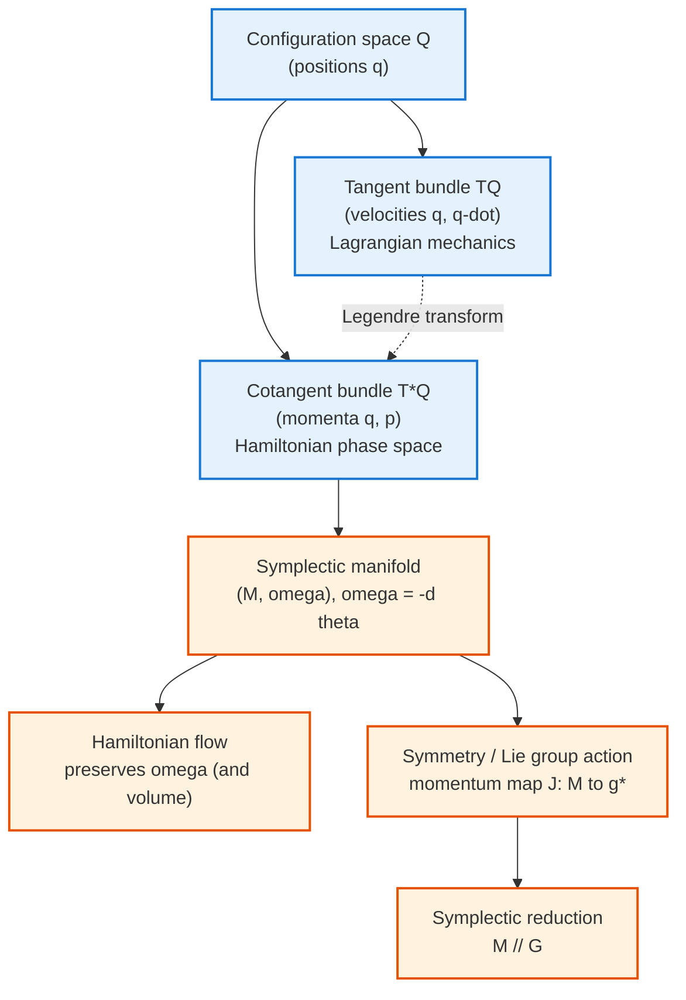

[Classical Mechanics](./) &raquo; Geometric Formalism

Symplectic geometry, phase-space flow, fiber bundles, geometric phases, and the differential-forms language of mechanics.

## Modern Perspectives: Geometry Rules

### Why Geometry?

Climbing from Newton to Lagrange to Hamilton reveals that mechanics is really about *geometry*. Forces are vectors and energy a scalar, but phase space carries a rich geometric structure invariant under canonical transformations. The modern viewpoint identifies the coordinate-independent geometric objects (manifolds, forms, flows, bundles) and lets the dynamics fall out of that structure.

The payoff is conceptual unity and practical power. Conservation laws become statements about invariant geometric quantities; constraints become submanifolds; symmetries become group actions; and the qualitative theory of chaos (KAM tori, Poincaré sections, area preservation) becomes a study of how a flow deforms geometric structure. The same language carries over almost verbatim into quantum mechanics, field theory, and the design of structure-preserving numerical integrators.

## Symplectic Geometry: The Natural Language

### The Symplectic Form

A **symplectic manifold** is a pair $(M, \omega)$ where $\omega$ is a 2-form that is

- **closed**: $d\omega = 0$, and
- **non-degenerate**: for every nonzero tangent vector $v$ there exists $w$ with $\omega(v, w) \neq 0$.

Non-degeneracy forces $M$ to be even-dimensional, $\dim M = 2n$, matching the $n$ generalized coordinates and $n$ conjugate momenta of a mechanical system. In canonical coordinates $(q^1, \dots, q^n, p_1, \dots, p_n)$ the symplectic form is

$$
\omega = \sum_{i=1}^{n} dp_i \wedge dq^i .
$$

For phase space $M = T^*Q$ (the cotangent bundle of configuration space), $\omega$ arises canonically as $\omega = -d\theta$, where $\theta = \sum_i p_i\, dq^i$ is the **tautological (Liouville) 1-form**. Because $\omega$ is *exact* on a cotangent bundle, it is automatically closed.

### Darboux's Theorem

**Darboux's theorem** states that every symplectic manifold looks locally identical: around any point there exist coordinates $(q^i, p_i)$ in which $\omega = \sum_i dp_i \wedge dq^i$. Unlike Riemannian geometry, where curvature is a genuine local invariant, symplectic geometry has *no local invariants* beyond the dimension. All the interesting structure is global (topological) — for example, the cohomology class $[\omega]$ on a compact manifold, or the way a Hamiltonian flow wraps around the manifold over long times.

This is why "the dynamics is really geometry" is more than a slogan: locally there is nothing to choose, so the equations of motion are determined entirely by the Hamiltonian function once the symplectic structure is fixed.

### The Musical Isomorphism and Hamiltonian Vector Fields

Non-degeneracy of $\omega$ means it defines an isomorphism between tangent and cotangent spaces, sometimes called the *musical* isomorphism. Given a smooth function $H: M \to \mathbb{R}$ (the Hamiltonian), its differential $dH$ is a 1-form, and there is a unique vector field $X_H$ — the **Hamiltonian vector field** — defined by

$$
\iota_{X_H}\, \omega = dH ,
$$

where $\iota$ denotes interior product (contraction). In canonical coordinates this single coordinate-free equation unpacks into Hamilton's equations:

$$
X_H = \sum_{i=1}^{n} \left( \frac{\partial H}{\partial p_i}\, \frac{\partial}{\partial q^i} - \frac{\partial H}{\partial q^i}\, \frac{\partial}{\partial p_i} \right), \qquad \dot{q}^i = \frac{\partial H}{\partial p_i}, \quad \dot{p}_i = -\frac{\partial H}{\partial q^i}.
$$

### The Poisson Bracket

The symplectic form induces the **Poisson bracket** on functions,

$$
\{f, g\} = \omega(X_f, X_g) = \sum_{i=1}^{n} \left( \frac{\partial f}{\partial q^i}\, \frac{\partial g}{\partial p_i} - \frac{\partial f}{\partial p_i}\, \frac{\partial g}{\partial q^i} \right).
$$

The bracket is bilinear, antisymmetric, satisfies the Leibniz rule, and (because $\omega$ is closed) the **Jacobi identity** $\{f, \{g, h\}\} + \{g, \{h, f\}\} + \{h, \{f, g\}\} = 0$. The time evolution of any observable is then

$$
\frac{df}{dt} = \{f, H\} + \frac{\partial f}{\partial t},
$$

so a quantity is conserved exactly when it Poisson-commutes with $H$. This bracket is the classical shadow of the quantum commutator: Dirac's correspondence $\{f, g\} \leftrightarrow \tfrac{1}{i\hbar}[\hat{f}, \hat{g}]$ is the doorway from symplectic mechanics to quantum mechanics.

## Phase-Space Flow and Liouville's Theorem

### The Flow Preserves the Symplectic Form

The map $\phi_t$ that advances every point of phase space along the Hamiltonian vector field for time $t$ is the **Hamiltonian flow**. Its defining geometric property is that it is a **symplectomorphism** — it preserves $\omega$:

$$
\phi_t^{*}\, \omega = \omega .
$$

The proof is one line of Cartan calculus. The Lie derivative of $\omega$ along $X_H$ is, by **Cartan's magic formula** $\mathcal{L}_X = d\,\iota_X + \iota_X\, d$,

$$
\mathcal{L}_{X_H}\, \omega = d(\iota_{X_H}\, \omega) + \iota_{X_H}(d\omega) = d(dH) + 0 = 0 .
$$

The two terms vanish because $d^2 = 0$ and because $\omega$ is closed. A vanishing Lie derivative means the flow drags $\omega$ to itself, i.e. it is symplectic. This is the geometric heart of Hamiltonian mechanics: *the flow is a one-parameter family of canonical transformations.*

### Liouville's Theorem

Because the flow preserves $\omega$, it also preserves its top wedge power, the **Liouville volume form**

$$
\Omega = \frac{(-1)^{n(n-1)/2}}{n!}\, \omega^{\wedge n} = dq^1 \wedge \dots \wedge dq^n \wedge dp_1 \wedge \dots \wedge dp_n .
$$

Hence $\phi_t^{*}\Omega = \Omega$: **phase-space volume is conserved**. This is **Liouville's theorem**, the foundation of classical statistical mechanics. A swarm of initial conditions filling a region of phase space evolves like an incompressible fluid — the region may stretch, fold, and filament wildly (as it does in chaotic systems), but its total volume never changes. Equivalently, the phase-space density $\rho$ obeys the **Liouville equation** $\partial_t \rho + \{\rho, H\} = 0$, so $\rho$ is constant along trajectories.

**Why naive integrators drift.** A generic numerical method (forward Euler, RK4) does *not* preserve $\omega$, so it slowly violates Liouville's theorem and lets energy drift. **Symplectic integrators** are designed so each step is exactly a symplectomorphism of a nearby "shadow" Hamiltonian, which is why their energy error stays bounded for astronomically long times — the practical payoff of phase-space geometry.

### Poincaré Invariants

Beyond the top-dimensional volume, the flow preserves an entire hierarchy of **Poincaré integral invariants**: for each $k = 1, \dots, n$ the integral of $\omega^{\wedge k}$ over any $2k$-dimensional surface carried by the flow is constant. The $k = 1$ case,

$$
I_1 = \oint_\gamma \sum_i p_i\, dq^i ,
$$

is the line integral of the tautological 1-form around any loop $\gamma$ transported by the flow — the quantity at the root of action-angle variables and adiabatic invariance.

## Fiber Bundles and Gauge Structure

### Configuration Space, Tangent and Cotangent Bundles

Mechanics naturally lives on bundles built over the **configuration space** $Q$ (the base manifold whose points are the possible positions of the system):

- **Tangent bundle** $TQ = \bigcup_{x \in Q} T_x Q$ — the home of Lagrangian mechanics, with coordinates $(q^i, \dot{q}^i)$ (position and velocity). The Lagrangian is a function $L: TQ \to \mathbb{R}$.
- **Cotangent bundle** $T^*Q = \bigcup_{x \in Q} T^*_x Q$ — the home of Hamiltonian mechanics (phase space), with coordinates $(q^i, p_i)$ (position and momentum). It carries the canonical symplectic form automatically.

The **Legendre transform** $\mathbb{F}L: TQ \to T^*Q$, $(q, \dot{q}) \mapsto (q, \partial L/\partial \dot{q})$, is the geometric bridge between the two. When it is a diffeomorphism (the regular case), Lagrangian and Hamiltonian descriptions are equivalent.

### Connections, Curvature, and Mechanical Gauge Theory

When the configuration space fibers over a *shape space* — for instance, the orientation of a body fibering over its internal shape — mechanics acquires a genuine **gauge structure**. A **connection 1-form** $A$ specifies how to split motion into "vertical" (along the fiber, e.g. rigid rotation) and "horizontal" (changes of shape) parts, defining parallel transport. Its **curvature 2-form** is

$$
F = dA + A \wedge A .
$$

A nonzero curvature means that a closed loop in shape space produces a net displacement in the fiber even though the body started and ended with the same shape. This is exactly how a falling cat reorients without external torque, and how a microorganism swims at low Reynolds number: by executing a cyclic deformation in shape space, it accumulates a holonomy in orientation space. The same connection-and-curvature language underlies Yang-Mills gauge theory, making this one of the cleanest classical illustrations of a deep idea.

## Geometric Phases: Holonomy in Mechanics

### The Berry Phase

When a system is transported slowly (adiabatically) around a closed loop in some parameter space, it can return with a phase that depends only on the *geometry of the loop*, not on how fast it was traversed. For a quantum state $|\psi(R)\rangle$ depending on external parameters $R$ carried around a closed circuit $C$, the **Berry phase** is

$$
\gamma = i \oint_C \langle \psi |\, \nabla_R\, |\psi \rangle \cdot dR = -\oint_C \mathbf{A}(R) \cdot dR ,
$$

where $\mathbf{A}(R) = -i\langle \psi | \nabla_R | \psi \rangle$ is the **Berry connection**. By Stokes' theorem the phase equals the flux of the **Berry curvature** $\mathbf{F} = \nabla_R \times \mathbf{A}$ through a surface bounded by $C$:

$$
\gamma = -\iint_S \mathbf{F} \cdot d\mathbf{S} .
$$

This is holonomy in the geometric sense: parallel transport around a loop in a curved (parameter) space returns the state rotated by an amount fixed by the enclosed curvature.

### The Hannay Angle

The Berry phase has a purely **classical** counterpart discovered by Hannay. For an integrable system whose Hamiltonian depends on slowly varying parameters $R(t)$, the action variables $I$ are adiabatic invariants, but the conjugate **angle variables** $\theta$ accumulate an extra shift beyond the naive dynamical phase $\oint \omega(I, R)\, dt$. This extra shift,

$$
\Delta\theta^{\text{geom}}_i = -\frac{\partial}{\partial I_i} \oint_C \mathbf{A}^{\text{cl}}(I, R) \cdot dR ,
$$

is the **Hannay angle**. The Berry phase and Hannay angle are related precisely by the semiclassical correspondence: the derivative of the Berry phase with respect to the quantum number reproduces the Hannay angle as $\hbar \to 0$.

### The Foucault Pendulum

The cleanest everyday example of a classical geometric phase is the **Foucault pendulum**. As the Earth turns, the pendulum's plane of oscillation is parallel-transported around a circle of constant latitude $\phi$ on the (curved) surface of the sphere. After one sidereal day the plane has rotated not by a full $2\pi$ but by the **solid angle** enclosed by that latitude circle:

$$
\Delta\theta = 2\pi(1 - \sin\phi) .
$$

No torque acts on the swing plane; the rotation is pure holonomy — the geometric phase of parallel transport on the sphere. The same mathematics governs spin precession in slowly varying magnetic fields and polarization rotation in a coiled optical fiber, underscoring how universal the geometric-phase concept is.

## The Differential-Forms Formulation

### From Vector Calculus to Forms

Casting mechanics in the language of **differential forms** makes its structure coordinate-free and dimension-independent. The essential objects:

- **0-forms**: functions (the Hamiltonian $H$, observables $f$).
- **1-forms**: the tautological form $\theta = \sum_i p_i\, dq^i$, differentials $dH$.
- **2-forms**: the symplectic form $\omega = -d\theta = \sum_i dp_i \wedge dq^i$.
- **Top form**: the Liouville volume $\Omega = \omega^{\wedge n}/n!$.

The operations are the **exterior derivative** $d$ (with $d^2 = 0$), the **wedge product** $\wedge$, the **interior product** $\iota_X$ (contraction with a vector field), and the **Lie derivative** $\mathcal{L}_X = d\,\iota_X + \iota_X\, d$ (Cartan's magic formula). The entire scaffolding of Hamiltonian mechanics then collapses into a handful of identities:

$$
\omega = -d\theta, \qquad \iota_{X_H}\,\omega = dH, \qquad \mathcal{L}_{X_H}\,\omega = 0, \qquad \frac{df}{dt} = \{f, H\}.
$$

### Differential Geometry Toolkit

| Object | Definition | Role in mechanics |
|--------|-----------|-------------------|
| Tangent bundle $TQ$ | $\bigcup_x T_x Q$ | State space of Lagrangian mechanics $(q, \dot{q})$ |
| Cotangent bundle $T^*Q$ | $\bigcup_x T^*_x Q$ | Phase space of Hamiltonian mechanics $(q, p)$ |
| Tautological 1-form $\theta$ | $\sum_i p_i\, dq^i$ | Potential for $\omega$; generates action invariant |
| Symplectic 2-form $\omega$ | $-d\theta$ | Defines $X_H$, Poisson bracket, area preservation |
| Lie derivative $\mathcal{L}_X Y$ | $[X, Y]$ | How tensors change along a flow |
| Interior product $\iota_X$ | contraction | Builds $X_H$ from $dH$ |

### Why Closedness Equals Consistency

The two algebraic facts $d^2 = 0$ and $d\omega = 0$ are not bookkeeping — they encode physics. Closedness of $\omega$ is exactly what makes the Poisson bracket satisfy the Jacobi identity, what makes the flow volume-preserving (Liouville), and what guarantees that locally there exists a generating function for every canonical transformation. The differential-forms formulation makes these connections transparent, which is why it is the standard language of modern geometric mechanics and the bridge to symplectic topology, geometric quantization, and field theory.

## Symmetry, Momentum Maps, and Reduction

### Lie Groups Acting on Phase Space

When a **Lie group** $G$ acts on phase space preserving $\omega$, Noether's theorem acquires its sharpest geometric form. Each generator $\xi$ in the Lie algebra $\mathfrak{g}$ produces a Hamiltonian vector field, and these are assembled into a single **momentum map**

$$
J : M \to \mathfrak{g}^{*},
$$

whose components are the conserved quantities associated with the symmetry. For translations $J$ gives linear momentum; for rotations, angular momentum; for time translation, energy. The momentum map packages all of Noether's conserved charges into one geometric object valued in the dual of the symmetry algebra.

### Coadjoint Orbits and Reduction

The level sets of $J$ are invariant under the flow, and the **coadjoint orbits** of $G$ in $\mathfrak{g}^*$ are themselves symplectic manifolds (the Kirillov-Kostant-Souriau structure). **Marsden-Weinstein reduction** quotients a level set $J^{-1}(\mu)$ by the residual symmetry to produce a smaller symplectic manifold $M_\mu = J^{-1}(\mu)/G_\mu$ — literally removing the degrees of freedom that the symmetry renders redundant. This is the modern, coordinate-free version of "using conserved quantities to reduce the order of the equations of motion," and it is indispensable for rigid-body dynamics, the restricted three-body problem, and gauge field theories.

## See Also

- [Lagrangian &amp; Hamiltonian Mechanics](lagrangian-hamiltonian.html) — phase space, Poisson brackets, and canonical transformations that this page recasts geometrically.
- [Chaos &amp; Nonlinear Dynamics](chaos-and-computational.html) — KAM theory, strange attractors, and the symplectic integrators that exploit this geometry.
- [Newtonian Mechanics](newtonian.html) — the force-based starting point of the climb toward geometry.
- [Quantum Mechanics](../quantum-mechanics/) — where the Poisson bracket becomes the commutator and the Berry phase appears.
- [Computational Physics](../computational-physics/) — structure-preserving numerical methods built on symplectic geometry.
- [Classical Mechanics Hub](./) — back to the overview.
