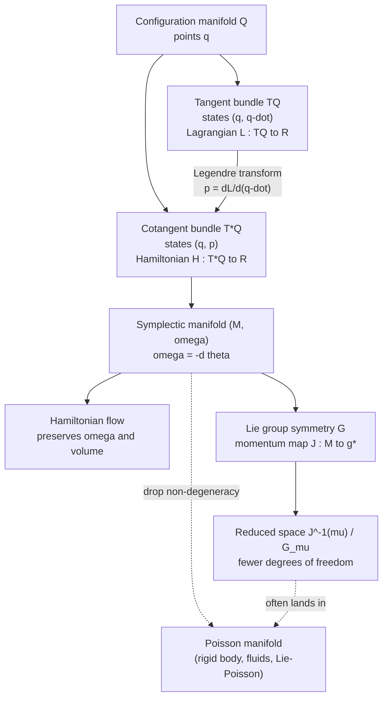
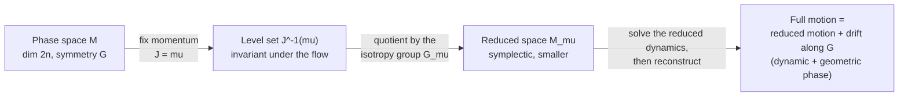

[Classical Mechanics](./) &raquo; Geometric Formalism

**Geometric mechanics** reformulates Lagrangian and Hamiltonian mechanics in coordinate-free terms: configuration spaces are manifolds, phase space is a symplectic manifold, dynamics is the flow of a vector field built from the Hamiltonian, and symmetries are Lie group actions. This page develops that language (symplectic forms, Poisson brackets, Liouville's theorem, Lagrangian submanifolds, integrable systems, momentum maps and reduction, connections and geometric phases) and shows where each idea pays off in physics and computation. It assumes the coordinate treatment in [Lagrangian &amp; Hamiltonian Mechanics](lagrangian-hamiltonian.html) and basic familiarity with manifolds and differential forms.

## Why geometry

Newton's equations are written in a particular coordinate system. Lagrange's and Hamilton's work in *any* coordinates, which suggests that the physics lives in structures that do not depend on coordinates at all. Identifying those structures pays off in several ways:

- **Conservation laws** become invariance of geometric objects under a flow.
- **Constraints** become submanifolds, and **symmetries** become group actions that can be quotiented out.
- The qualitative theory of dynamics (invariant tori, area-preserving maps, KAM theory, chaos) is a study of how a flow deforms geometric structure.
- **Numerical methods** that preserve the geometry ([symplectic integrators](computational-classical-mechanics.html)) outperform those that do not over long times.
- The same structures carry over to **quantum mechanics** (Poisson bracket to commutator, Berry phase) and **field theory** (gauge connections, multisymplectic geometry).

## Symplectic manifolds

### The symplectic form

A **symplectic manifold** is a pair $(M, \omega)$, where $\omega$ is a 2-form that is

- **closed**, $d\omega = 0$, and
- **non-degenerate**: if $\omega(v, w) = 0$ for all $w$, then $v = 0$.

Non-degeneracy forces $\dim M = 2n$ to be even, matching $n$ coordinates and $n$ momenta. The basic example is the phase space $M = T^*Q$ of a configuration manifold $Q$. It carries a canonical **tautological (Liouville) 1-form** $\theta$, which in any cotangent coordinates $(q^i, p_i)$ reads $\theta = \sum_i p_i\, dq^i$, and the canonical symplectic form

$$
\omega = -d\theta = \sum_{i=1}^{n} dq^i \wedge dp_i .
$$

Because $\omega$ is exact, it is automatically closed.

**Sign conventions.** Authors differ. Marsden–Ratiu and Abraham–Marsden use $\omega = dq \wedge dp$ together with $\iota_{X_H}\omega = dH$, as this page does. Arnold uses $\omega = dp \wedge dq$ together with $\iota_{X_H}\omega = -dH$. Both give the same Hamilton's equations. Mixing the two conventions flips the sign of the equations of motion, a common source of errors.

### Darboux's theorem

**Darboux's theorem** states that every symplectic manifold is locally standard: around every point there are coordinates in which $\omega = \sum_i dq^i \wedge dp_i$. Riemannian geometry has a local invariant, curvature, that distinguishes one metric from another; symplectic geometry has none beyond the dimension. All interesting symplectic structure is global: topology, the cohomology class of $\omega$ on a closed manifold, and rigidity phenomena such as non-squeezing (below). For mechanics this means that once canonical coordinates are chosen, all the physics is contained in the Hamiltonian function.

### Hamiltonian vector fields

Non-degeneracy makes $\omega$ an isomorphism between tangent vectors and 1-forms, $v \mapsto \iota_v \omega = \omega(v, \cdot)$. A function $H : M \to \mathbb{R}$ therefore determines a unique **Hamiltonian vector field** $X_H$ through

$$
\iota_{X_H}\, \omega = dH .
$$

Writing $X_H = a^i \partial_{q^i} + b_i \partial_{p_i}$ gives $\iota_{X_H}\omega = a^i\, dp_i - b_i\, dq^i$. Matching this with $dH = \frac{\partial H}{\partial q^i} dq^i + \frac{\partial H}{\partial p_i} dp_i$ yields Hamilton's equations:

$$
X_H = \sum_{i=1}^{n} \left( \frac{\partial H}{\partial p_i}\, \frac{\partial}{\partial q^i} - \frac{\partial H}{\partial q^i}\, \frac{\partial}{\partial p_i} \right), \qquad \dot{q}^i = \frac{\partial H}{\partial p_i}, \quad \dot{p}_i = -\frac{\partial H}{\partial q^i} .
$$

### Poisson brackets

The symplectic form induces the **Poisson bracket** of functions,

$$
\{f, g\} = \omega(X_f, X_g) = \sum_{i=1}^{n} \left( \frac{\partial f}{\partial q^i}\, \frac{\partial g}{\partial p_i} - \frac{\partial f}{\partial p_i}\, \frac{\partial g}{\partial q^i} \right) .
$$

It is bilinear, antisymmetric, and a derivation in each argument (Leibniz rule). Because $d\omega = 0$, it also satisfies the **Jacobi identity** $\{f, \{g, h\}\} + \{g, \{h, f\}\} + \{h, \{f, g\}\} = 0$. The evolution of any observable is

$$
\frac{df}{dt} = \{f, H\} + \frac{\partial f}{\partial t} ,
$$

so a time-independent $f$ is conserved exactly when $\{f, H\} = 0$. By the Jacobi identity, the bracket of two conserved quantities is also conserved (Poisson's theorem). Dirac's correspondence $\{f, g\} \to \frac{1}{i\hbar}[\hat f, \hat g]$ is the starting point of canonical quantization. Groenewold–van Hove shows it cannot hold exactly for all observables, which is why deformation and geometric quantization exist.

### Poisson manifolds

Many important systems have a Poisson bracket but no symplectic form. A **Poisson manifold** is a manifold with a bracket obeying all the properties above, which may be *degenerate*. Degenerate brackets have **Casimir functions** $C$ with $\{C, f\} = 0$ for every $f$. Casimirs are conserved by every Hamiltonian flow, and their level sets foliate the manifold into **symplectic leaves**, on each of which the dynamics is ordinary symplectic mechanics.

The standard example is the free rigid body in body-frame angular momentum $\Pi \in \mathbb{R}^3 \cong \mathfrak{so}(3)^*$, with the **Lie–Poisson bracket**

$$
\{F, G\}(\Pi) = -\,\Pi \cdot \left(\nabla F \times \nabla G\right), \qquad H = \frac{1}{2}\left(\frac{\Pi_1^2}{I_1} + \frac{\Pi_2^2}{I_2} + \frac{\Pi_3^2}{I_3}\right) .
$$

The equation $\dot F = \{F, H\}$ reproduces **Euler's equations** $\dot\Pi = \Pi \times \Omega$ with $\Omega_i = \Pi_i/I_i$. The Casimir $|\Pi|^2$ confines motion to spheres, which are the symplectic leaves. Intersecting these spheres with energy ellipsoids gives the familiar rigid-body orbits and explains the instability of rotation about the intermediate axis ([Rigid Body Dynamics](rigid-body-dynamics.html)). Ideal fluids, plasmas, and many reduced models have the same Lie–Poisson structure.

## Phase-space flow

### The flow is symplectic

The flow $\varphi_t$ of $X_H$ preserves $\omega$:

$$
\varphi_t^{*}\, \omega = \omega .
$$

The proof is one line using **Cartan's formula** $\mathcal{L}_X = d\,\iota_X + \iota_X\, d$:

$$
\mathcal{L}_{X_H}\, \omega = d(\iota_{X_H}\, \omega) + \iota_{X_H}(d\omega) = d(dH) + 0 = 0 .
$$

The first term vanishes because $d^2 = 0$ and the second because $\omega$ is closed. A Hamiltonian flow is therefore a one-parameter family of **symplectomorphisms**, which is the coordinate-free meaning of "canonical transformation." The converse holds locally: any vector field whose flow preserves $\omega$ is locally Hamiltonian, because $\mathcal{L}_X \omega = d(\iota_X \omega) = 0$ means $\iota_X\omega$ is closed, and closed forms are locally exact.

The figure shows the flow for the simplest nonlinear example, the pendulum. Each curve is a level set of $H$. The flow carries phase-space regions along these curves, shearing them (inner librations have shorter periods than outer ones) without changing their area.

<figure class="diagram">
<svg viewBox="0 0 600 290" role="img" aria-labelledby="pp-title" style="max-width:640px;width:100%;height:auto;color:inherit">
<title id="pp-title">Phase portrait of the simple pendulum: closed librations around the origin, the separatrix through the unstable points at plus and minus pi, and open rotations above and below</title>
<defs><marker id="pp-arr" markerWidth="8" markerHeight="8" refX="6" refY="3" orient="auto"><path d="M0,0 L0,6 L7,3 z" fill="currentColor"/></marker></defs>
<line x1="50" y1="140" x2="555" y2="140" stroke="currentColor" stroke-width="1" opacity="0.5" marker-end="url(#pp-arr)"/>
<line x1="300" y1="255" x2="300" y2="22" stroke="currentColor" stroke-width="1" opacity="0.5" marker-end="url(#pp-arr)"/>
<text x="560" y="145" font-size="14" font-family="inherit" fill="currentColor">q</text>
<text x="307" y="24" font-size="14" font-family="inherit" fill="currentColor">p</text>
<text x="60" y="158" font-size="12" font-family="inherit" fill="currentColor" text-anchor="middle">&#8722;&#960;</text>
<text x="540" y="158" font-size="12" font-family="inherit" fill="currentColor" text-anchor="middle">&#960;</text>
<path d="M60,140 L72,134 L85,129 L97,124 L109,118 L122,113 L134,108 L146,103 L158,99 L171,94 L183,90 L195,87 L208,83 L220,80 L232,78 L245,76 L257,74 L269,73 L282,72 L294,71 L306,71 L318,72 L331,73 L343,74 L355,76 L368,78 L380,80 L392,83 L405,87 L417,90 L429,94 L442,99 L454,103 L466,108 L478,113 L491,118 L503,124 L515,129 L528,134 L540,140" fill="none" stroke="currentColor" stroke-width="2.4" stroke-dasharray="7 4"/>
<path d="M60,140 L72,146 L85,151 L97,156 L109,162 L122,167 L134,172 L146,177 L158,181 L171,186 L183,190 L195,193 L208,197 L220,200 L232,202 L245,204 L257,206 L269,207 L282,208 L294,209 L306,209 L318,208 L331,207 L343,206 L355,204 L368,202 L380,200 L392,197 L405,193 L417,190 L429,186 L442,181 L454,177 L466,172 L478,167 L491,162 L503,156 L515,151 L528,146 L540,140" fill="none" stroke="currentColor" stroke-width="2.4" stroke-dasharray="7 4"/>
<path d="M229,140 L234,129 L240,124 L245,121 L250,119 L255,116 L261,115 L266,113 L271,112 L276,111 L282,110 L287,110 L292,109 L297,109 L303,109 L308,109 L313,110 L318,110 L324,111 L329,112 L334,113 L339,115 L345,116 L350,119 L355,121 L360,124 L366,129 L371,140 L371,140 L366,151 L360,156 L355,159 L350,161 L345,164 L339,165 L334,167 L329,168 L324,169 L318,170 L313,170 L308,171 L303,171 L297,171 L292,171 L287,170 L282,170 L276,169 L271,168 L266,167 L261,165 L255,164 L250,161 L245,159 L240,156 L234,151 L229,140 Z" fill="none" stroke="currentColor" stroke-width="1.6"/>
<path d="M180,140 L189,123 L198,117 L207,112 L216,107 L224,104 L233,101 L242,99 L251,96 L260,95 L269,93 L278,92 L287,92 L296,91 L304,91 L313,92 L322,92 L331,93 L340,95 L349,96 L358,99 L367,101 L376,104 L384,107 L393,112 L402,117 L411,123 L420,140 L420,140 L411,157 L402,163 L393,168 L384,173 L376,176 L367,179 L358,181 L349,184 L340,185 L331,187 L322,188 L313,188 L304,189 L296,189 L287,188 L278,188 L269,187 L260,185 L251,184 L242,181 L233,179 L224,176 L216,173 L207,168 L198,163 L189,157 L180,140 Z" fill="none" stroke="currentColor" stroke-width="1.6"/>
<path d="M131,140 L143,122 L156,114 L168,107 L181,102 L193,97 L206,93 L219,89 L231,86 L244,84 L256,82 L269,80 L281,79 L294,79 L306,79 L319,79 L331,80 L344,82 L356,84 L369,86 L381,89 L394,93 L407,97 L419,102 L432,107 L444,114 L457,122 L469,140 L469,140 L457,158 L444,166 L432,173 L419,178 L407,183 L394,187 L381,191 L369,194 L356,196 L344,198 L331,200 L319,201 L306,201 L294,201 L281,201 L269,200 L256,198 L244,196 L231,194 L219,191 L206,187 L193,183 L181,178 L168,173 L156,166 L143,158 L131,140 Z" fill="none" stroke="currentColor" stroke-width="1.6"/>
<path d="M60,102 L72,102 L85,101 L97,99 L109,97 L122,94 L134,91 L146,87 L158,84 L171,81 L183,78 L195,75 L208,72 L220,70 L232,67 L245,66 L257,64 L269,63 L282,62 L294,62 L306,62 L318,62 L331,63 L343,64 L355,66 L368,67 L380,70 L392,72 L405,75 L417,78 L429,81 L442,84 L454,87 L466,91 L478,94 L491,97 L503,99 L515,101 L528,102 L540,102" fill="none" stroke="currentColor" stroke-width="1.6" opacity="0.75"/>
<path d="M60,178 L72,178 L85,179 L97,181 L109,183 L122,186 L134,189 L146,193 L158,196 L171,199 L183,202 L195,205 L208,208 L220,210 L232,213 L245,214 L257,216 L269,217 L282,218 L294,218 L306,218 L318,218 L331,217 L343,216 L355,214 L368,213 L380,210 L392,208 L405,205 L417,202 L429,199 L442,196 L454,193 L466,189 L478,186 L491,183 L503,181 L515,179 L528,178 L540,178" fill="none" stroke="currentColor" stroke-width="1.6" opacity="0.75"/>
<path d="M60,79 L72,78 L85,78 L97,76 L109,75 L122,73 L134,71 L146,68 L158,66 L171,63 L183,61 L195,59 L208,56 L220,54 L232,53 L245,51 L257,50 L269,49 L282,48 L294,48 L306,48 L318,48 L331,49 L343,50 L355,51 L368,53 L380,54 L392,56 L405,59 L417,61 L429,63 L442,66 L454,68 L466,71 L478,73 L491,75 L503,76 L515,78 L528,78 L540,79" fill="none" stroke="currentColor" stroke-width="1.6" opacity="0.75"/>
<path d="M60,201 L72,202 L85,202 L97,204 L109,205 L122,207 L134,209 L146,212 L158,214 L171,217 L183,219 L195,221 L208,224 L220,226 L232,227 L245,229 L257,230 L269,231 L282,232 L294,232 L306,232 L318,232 L331,231 L343,230 L355,229 L368,227 L380,226 L392,224 L405,221 L417,219 L429,217 L442,214 L454,212 L466,209 L478,207 L491,205 L503,204 L515,202 L528,202 L540,201" fill="none" stroke="currentColor" stroke-width="1.6" opacity="0.75"/>
<path d="M292,48 L312,48" stroke="currentColor" stroke-width="2" marker-end="url(#pp-arr)"/>
<path d="M312,232 L292,232" stroke="currentColor" stroke-width="2" marker-end="url(#pp-arr)"/>
<circle cx="300" cy="140" r="4" fill="currentColor"/>
<circle cx="60" cy="140" r="4.5" fill="none" stroke="currentColor" stroke-width="2"/>
<circle cx="540" cy="140" r="4.5" fill="none" stroke="currentColor" stroke-width="2"/>
<text x="395" y="36" font-size="12" font-family="inherit" fill="currentColor">rotation (E &gt; 2mgl)</text>
<text x="415" y="112" font-size="12" font-family="inherit" fill="currentColor">separatrix (E = 2mgl)</text>
<text x="318" y="160" font-size="12" font-family="inherit" fill="currentColor">libration</text>
<text x="300" y="280" font-size="12" font-family="inherit" fill="currentColor" text-anchor="middle">filled dot: stable equilibrium (center) &#183; open dots: unstable equilibrium (saddle), the same point q = &#177;&#960;</text>
</svg>
<figcaption>Level sets of the pendulum Hamiltonian $H = p^2/2ml^2 + mgl(1 - \cos q)$. The flow moves clockwise around the center; the dashed separatrix divides oscillation from full rotation.</figcaption>
</figure>

### Liouville's theorem

Because the flow preserves $\omega$, it also preserves the top exterior power, the **Liouville volume form**

$$
\Omega = \frac{(-1)^{n(n-1)/2}}{n!}\, \omega^{\wedge n} = dq^1 \wedge \cdots \wedge dq^n \wedge dp_1 \wedge \cdots \wedge dp_n .
$$

Hence $\varphi_t^{*}\Omega = \Omega$: **phase-space volume is conserved** (Liouville's theorem). An ensemble of initial conditions moves like an incompressible fluid. It may stretch and filament, drastically so in chaotic systems, but its volume never changes. The density $\rho$ obeys the **Liouville equation**

$$
\frac{\partial \rho}{\partial t} + \{\rho, H\} = 0 ,
$$

so $\rho$ is constant along trajectories. This is the foundation of classical statistical mechanics: any function of $H$ (and of other conserved quantities) is a stationary density, which leads to the microcanonical and canonical ensembles ([Statistical Mechanics](../statistical-mechanics/)).

### Poincaré integral invariants

The flow also preserves a hierarchy of lower-dimensional invariants. For each $k = 1, \ldots, n$, the integral of $\omega^{\wedge k}$ over any $2k$-dimensional surface carried along by the flow is constant. For $k = 1$, Stokes' theorem turns this into a loop integral,

$$
\oint_{\gamma_t} \sum_i p_i\, dq^i = \text{const}
$$

for any closed loop $\gamma_t$ transported by the flow. This is the **Poincaré–Cartan invariant**. It is the origin of action variables $I = \frac{1}{2\pi}\oint p\, dq$ and of adiabatic invariance.

### Symplectic rigidity: non-squeezing

Symplectic maps preserve more than volume. **Gromov's non-squeezing theorem** (1985) states that a ball of radius $r$ in $\mathbb{R}^{2n}$ can be symplectically embedded in a cylinder $\{q_1^2 + p_1^2 < R^2\}$ only if $r \leq R$. A volume-preserving map could squeeze the ball into the cylinder by stretching it along the other directions; a symplectic map cannot. Physically, no Hamiltonian evolution can shrink the spread of an ensemble in any single conjugate pair $(q_i, p_i)$ below its initial projected area. This is a classical analogue of the uncertainty principle. Non-squeezing started modern **symplectic topology**. It also shows that "symplectic" is strictly stronger than "volume-preserving" when $n \geq 2$.

## Lagrangian submanifolds and generating functions

A submanifold $L \subset M$ of dimension $n$ (half the phase-space dimension) is **Lagrangian** if $\omega$ vanishes on it, $\omega|_L = 0$. Examples:

- The **zero section** $\{p = 0\}$ and each **fiber** $\{q = q_0\}$ of $T^*Q$.
- The **graph of an exact 1-form**, $L = \{(q, \nabla S(q))\}$. Here $\theta|_L = dS$, so $\omega|_L = -d(dS) = 0$. Locally, every Lagrangian submanifold that projects nicely onto $Q$ has this form for some **generating function** $S$.
- The **graph of a symplectomorphism** $\phi : M \to M$, viewed as a Lagrangian submanifold of $M \times M$ with the form $\omega \ominus \omega$. This is why every canonical transformation has a generating function (of types $F_1$ to $F_4$) locally.

**Hamilton–Jacobi theory** is the study of Lagrangian submanifolds that are invariant under the flow. If $L = \operatorname{graph}(\nabla S)$ lies in an energy surface $H = E$, then

$$
H\!\left(q, \frac{\partial S}{\partial q}\right) = E ,
$$

and trajectories on $L$ are the characteristics of this PDE. Where the projection of $L$ to $Q$ folds over, $S$ becomes multivalued and the projected trajectories focus on **caustics**. In the semiclassical wavefunction $\psi \approx A\, e^{iS/\hbar}$, these folds produce the Maslov phase corrections that turn Bohr–Sommerfeld quantization into $\oint p\, dq = 2\pi\hbar\,(n + \tfrac{1}{2})$.

## Integrable systems

A Hamiltonian system on a $2n$-dimensional symplectic manifold is **Liouville integrable** if it has $n$ conserved quantities $F_1 = H, F_2, \ldots, F_n$ that are functionally independent and **in involution**, $\{F_i, F_j\} = 0$.

**Arnold–Liouville theorem.** If a level set $M_f = \{F_i = f_i\}$ of an integrable system is compact and connected, then:

1. $M_f$ is diffeomorphic to an $n$-torus $T^n$, and it is a Lagrangian submanifold;
2. a neighborhood of it has **action–angle coordinates** $(I, \theta)$, with $\omega = \sum_i d\theta^i \wedge dI_i$, in which $H = H(I)$;
3. the motion is linear on each torus, $\theta(t) = \theta(0) + \omega(I)\, t$ with $\omega(I) = \partial H/\partial I$.

The actions are computed as loop integrals of the tautological form over a basis of cycles $\gamma_i$ on the torus:

$$
I_i = \frac{1}{2\pi} \oint_{\gamma_i} \sum_j p_j\, dq^j .
$$

Examples include the harmonic oscillator, the Kepler problem, the Euler and Lagrange tops, geodesic flow on an ellipsoid, and infinite-dimensional systems such as the KdV equation. Integrability is exceptional: a generic perturbation destroys it. What survives is described by **KAM theory**, and what breaks becomes chaos; see [Chaos &amp; Nonlinear Dynamics](chaos-and-computational.html#hamiltonian-chaos-and-kam-theory).

## Symmetry, momentum maps, and reduction

### Momentum maps

Let a Lie group $G$ act on $(M, \omega)$ by symplectomorphisms. Each element $\xi$ of the Lie algebra $\mathfrak{g}$ generates a vector field $\xi_M$. The action has a **momentum map** $J : M \to \mathfrak{g}^*$ if each $\xi_M$ is Hamiltonian, with Hamiltonian function $\langle J, \xi \rangle$:

$$
\iota_{\xi_M}\, \omega = d\langle J, \xi \rangle .
$$

**Noether's theorem** in this language: if $H$ is $G$-invariant, then $\{ \langle J, \xi\rangle, H\} = -\,dH(\xi_M) = 0$, so $J$ is conserved by the flow. The momentum map collects all of the symmetry's conserved charges into one object.

| Symmetry group acting on $T^*\mathbb{R}^3$ (or $T^*\mathbb{R}^{3N}$) | Momentum map $J$ | Conserved quantity |
|---|---|---|
| Translations $\mathbb{R}^3$ | $\sum_a \mathbf{p}_a$ | Linear momentum |
| Rotations $SO(3)$ | $\sum_a \mathbf{q}_a \times \mathbf{p}_a$ | Angular momentum |
| Galilean boosts (with time) | $\sum_a (m_a \mathbf{q}_a - t\,\mathbf{p}_a)$ | Center-of-mass motion |
| Phase rotation $U(1)$ of an oscillator | $\tfrac{1}{2}(q^2 + p^2)$ | Action (particle number after quantization) |
| Time translation (extended phase space) | $H$ | Energy |

### Reduction

Conserved momenta allow the symmetric degrees of freedom to be eliminated. **Marsden–Weinstein (symplectic) reduction** fixes the momentum at a value $\mu$ and quotients by the subgroup $G_\mu$ that preserves it:

$$
M_\mu = J^{-1}(\mu) / G_\mu .
$$

Under regularity conditions $M_\mu$ is a symplectic manifold of dimension $\dim M - \dim G - \dim G_\mu$, and the dynamics of $H$ descends to it.

Reduction is the geometric form of the textbook practice of using conserved quantities to lower the order of the equations:

- **Central-force motion.** Reducing by rotations at fixed angular momentum $\ell$ leaves one-dimensional radial motion in the effective potential $V(r) + \ell^2/2mr^2$.
- **Rigid body.** Reducing $T^*SO(3)$ by $SO(3)$ leaves $\mathfrak{so}(3)^*$ with its Lie–Poisson bracket. The reduced symplectic spaces are the **coadjoint orbits**, spheres $|\Pi| = \text{const}$, which carry the Kirillov–Kostant–Souriau symplectic form.
- **Restricted three-body problem.** Moving to the rotating frame removes the uniform rotation and leaves the Jacobi integral.
- **Gauge theories.** Gauss's law is the momentum-map constraint $J = 0$ of the gauge group, and the physical phase space is the reduced space.

When a reduced solution is lifted back to the full space, the motion along the group orbit contains a *dynamic* part and a *geometric* part. The geometric part depends only on the path in the reduced space. This is the mechanical origin of geometric phases, discussed next.

## Connections and mechanical gauge theory

When the configuration space is a bundle over a **shape space**, for example the orientation of a deformable body over its internal shape, mechanics acquires a gauge structure. A **connection 1-form** $A$ splits every motion into a *vertical* part (a rigid motion along the fiber) and a *horizontal* part (a change of shape). For a free body with zero angular momentum, conservation of momentum is exactly the statement that the motion is horizontal, and $A$ is the **mechanical connection** determined by the inertia tensor. Its **curvature**

$$
F = dA + A \wedge A
$$

measures the failure of horizontal loops to close. A closed loop in shape space generally produces a net displacement along the fiber, the **holonomy**, equal to the integral of the curvature over the enclosed region of shape space (to leading order for small loops).

This is how a falling cat rights itself with zero angular momentum: it executes a cyclic change of shape, and the curvature of the mechanical connection converts that loop into a net rotation. Astronauts and divers use the same mechanism to reorient in flight. Microorganisms swimming at low Reynolds number exploit the analogous connection defined by viscous drag (Shapere and Wilczek, 1989): only the geometry of the stroke matters, not its speed. The mathematics is that of Yang–Mills gauge theory, with the shape-space loop playing the role of a Wilson loop.

## Geometric phases

### Berry phase

A quantum eigenstate $|n(R)\rangle$ of a Hamiltonian that depends on slowly varying parameters $R$, carried adiabatically around a closed loop $C$ in parameter space, returns to itself up to a phase. Besides the dynamical phase $-\frac{1}{\hbar}\int E_n\, dt$, it acquires the **Berry phase**

$$
\gamma_n = \oint_C \mathbf{A}_n \cdot d\mathbf{R}, \qquad \mathbf{A}_n(\mathbf{R}) = i\,\langle n(\mathbf{R}) | \nabla_{\mathbf{R}}\, n(\mathbf{R}) \rangle ,
$$

where $\mathbf{A}_n$ is the (real) **Berry connection**. By Stokes' theorem the phase is the flux of the **Berry curvature** $\mathbf{F}_n = \nabla_{\mathbf{R}} \times \mathbf{A}_n$ through any surface $S$ bounded by $C$:

$$
\gamma_n = \iint_S \mathbf{F}_n \cdot d\mathbf{S} .
$$

The phase depends only on the geometry of the loop, not on how fast it is traversed, provided the traversal is adiabatic. A spin-$s$ particle in a magnetic field whose direction traces a loop gets $\gamma = -m_s\, \Omega_C$, where $\Omega_C$ is the solid angle the loop subtends and $m_s$ is the spin component along the field. Berry curvature is central in modern condensed matter physics: it underlies the anomalous and quantum Hall effects and the topological invariants (Chern numbers) of band structures ([Condensed Matter](../condensed-matter/)).

### Hannay angle

The classical counterpart, found by Hannay (1985), concerns integrable systems with slowly varying parameters. The actions $I$ are adiabatic invariants. After a closed loop in parameter space, the angle variables have advanced by the dynamical amount $\int \omega(I, R)\, dt$ plus an extra geometric shift, the **Hannay angle**:

$$
\Delta\theta_{\text{H}} = -\frac{\partial}{\partial I} \oint_C \mathbf{A}^{\text{cl}}(I, \mathbf{R}) \cdot d\mathbf{R}, \qquad \mathbf{A}^{\text{cl}} = \left\langle p\, \nabla_{\mathbf{R}}\, q \right\rangle_{\theta} ,
$$

where $\langle \cdot \rangle_\theta$ denotes the average over the torus with fixed $I$. Berry showed that the two are related semiclassically, $\Delta\theta_{\text{H}} = -\partial \gamma_n / \partial n$ with $I = (n + \tfrac12)\hbar$: the classical angle shift is the rate of change of the quantum phase with quantum number.

### Foucault pendulum

The best-known classical geometric phase is the **Foucault pendulum**. As the Earth rotates, the pendulum's swing plane is parallel-transported around the circle of latitude $\phi$. Relative to the ground, the swing plane rotates clockwise in the Northern Hemisphere by

$$
\Delta\theta = 2\pi \sin\phi
$$

per sidereal day. Equivalently, parallel transport around the latitude circle rotates a tangent vector by the solid angle enclosed by the circle, $2\pi(1 - \sin\phi)$, which differs from the rotation above by exactly $2\pi$. No torque acts on the swing plane; the rotation is pure holonomy of the sphere's curvature. The same geometry explains the rotation of light's polarization along a helically coiled optical fiber (Tomita–Chiao) and the spin precession of particles in slowly rotating fields.

## Beyond symplectic mechanics

Several extensions handle systems that ordinary symplectic mechanics does not:

| Structure | Handles | Key idea |
|---|---|---|
| Poisson and Lie–Poisson manifolds | Rigid bodies, ideal fluids, plasmas, reduced systems | Degenerate brackets with Casimirs; dynamics on symplectic leaves |
| Contact geometry | Time-dependent Hamiltonians, certain dissipative systems, equilibrium thermodynamics | Odd-dimensional manifolds with a maximally non-integrable 1-form, e.g. $dS - p\, dq$ |
| Nonholonomic mechanics | Rolling without slipping, skates, wheeled robots | Velocity constraints imposed by the Lagrange–d'Alembert principle; the flow is generally not symplectic and not variational |
| Port-Hamiltonian and Dirac structures | Interconnected, controlled, and dissipative engineering systems | Energy flow through ports; widely used in control theory and robotics |
| Multisymplectic geometry | Classical field theories | A form of degree $n+1$ on a jet bundle; covariant Hamiltonian field theory and multisymplectic integrators |
| Presymplectic geometry (Dirac–Bergmann) | Gauge theories and singular Lagrangians | Degenerate $\omega$; constraint algorithm and reduction by gauge orbits |

## Summary of objects

| Object | Local expression | Role |
|---|---|---|
| Configuration manifold $Q$ | coordinates $q^i$ | Possible positions |
| Tangent bundle $TQ$ | $(q^i, \dot q^i)$ | Domain of the Lagrangian |
| Cotangent bundle $T^*Q$ | $(q^i, p_i)$ | Hamiltonian phase space |
| Tautological 1-form $\theta$ | $\sum_i p_i\, dq^i$ | Action integrand; Poincaré–Cartan invariant |
| Symplectic form $\omega$ | $-d\theta = \sum_i dq^i \wedge dp_i$ | Turns $dH$ into $X_H$; defines Poisson brackets and area |
| Hamiltonian vector field $X_H$ | $\iota_{X_H}\omega = dH$ | The dynamics |
| Poisson bracket | $\{f, g\} = \omega(X_f, X_g)$ | Evolution $\dot f = \{f, H\}$; classical limit of commutators |
| Liouville volume $\Omega$ | $dq^1 \wedge \cdots \wedge dp_n$ | Conserved phase-space measure |
| Lie derivative $\mathcal{L}_X$ | $d\,\iota_X + \iota_X\, d$ on forms | Rate of change along a flow |
| Momentum map $J$ | $\iota_{\xi_M}\omega = d\langle J, \xi\rangle$ | Noether charges |
| Connection $A$, curvature $F$ | $F = dA + A \wedge A$ | Holonomy, geometric phases |

## See also

- [Lagrangian &amp; Hamiltonian Mechanics](lagrangian-hamiltonian.html): phase space, canonical transformations, and Hamilton–Jacobi theory in coordinates.
- [Chaos &amp; Nonlinear Dynamics](chaos-and-computational.html): KAM theory, area-preserving maps, and the breakdown of integrability.
- [Computational Methods](computational-classical-mechanics.html): symplectic and variational integrators that preserve the structures on this page.
- [Rigid Body Dynamics](rigid-body-dynamics.html): Euler's equations, which are the Lie–Poisson dynamics on $\mathfrak{so}(3)^*$.
- [Quantum Mechanics](../quantum-mechanics/): where Poisson brackets become commutators and Berry phases appear.
- [Classical Mechanics Hub](./): back to the overview.
