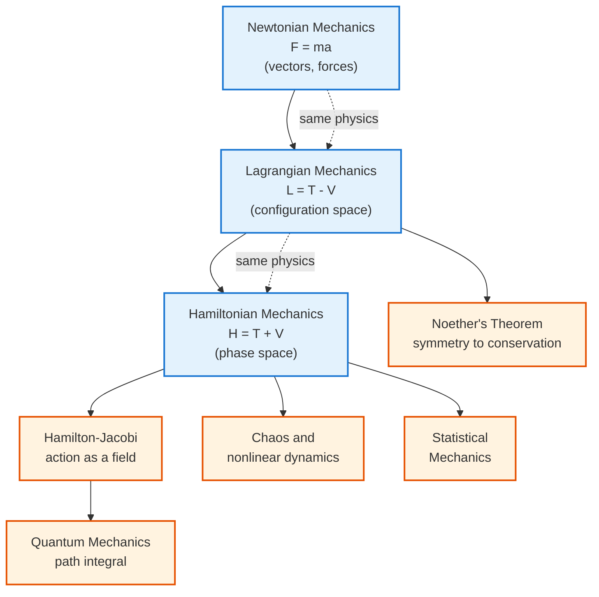

<!-- Custom styles are now loaded via main.scss -->

  <h1 style="color: white; margin: 0; font-size: 2.5rem;">Classical Mechanics</h1>
  
The foundation of physics describing motion and forces, from Newton's laws to the elegant formulations of Lagrange and Hamilton.

  
Classical mechanics is the physics of everyday motion — how forces, energy, and momentum dictate the paths of everything from thrown balls to orbiting planets. This topic is built in three layers: first Newton's force-based picture, then the deeper energy-based formulations of Lagrange and Hamilton, and finally the modern, geometric view that connects mechanics to chaos, quantum theory, and computation. Use the cards below to jump to a layer, or read them in order for a guided arc — intuition before formalism.

  

    <i class="fas fa-rocket"></i>
    <h4>Force changes motion</h4>
    
Newton's $F = ma$ — objects keep their velocity unless a net force acts.

  

  

    <i class="fas fa-recycle"></i>
    <h4>Symmetry conserves quantities</h4>
    
Energy, momentum, and angular momentum are conserved because of underlying symmetries (Noether).

  

  

    <i class="fas fa-route"></i>
    <h4>Action is extremized</h4>
    
The Lagrangian view: a system follows the path that extremizes $S = \int L\,dt$.

  

  

    <i class="fas fa-random"></i>
    <h4>Determinism has limits</h4>
    
Nonlinear systems can be chaotic — perfectly deterministic yet practically unpredictable.

  

## Explore Classical Mechanics

The pages below build from the core force-based picture, through the energy-based and geometric formalisms, into the modern computational and nonlinear frontier, and finally to the applied subjects that classical mechanics feeds. Read them in order for a guided arc, or jump straight to the layer you need.

### Core

  <a href="newtonian.html" class="nav-card">
    <h4><i class="fas fa-rocket"></i> Newtonian Mechanics &amp; Conservation Laws</h4>
    
Newton's three laws, kinematics and dynamics, work and energy, conservation laws and Noether's theorem, rotational motion, and gravitation.

  </a>
  <a href="waves.html" class="nav-card">
    <h4><i class="fas fa-wave-square"></i> Oscillations &amp; Waves</h4>
    
The simple and damped harmonic oscillator, coupled oscillators and normal modes, the wave equation, dispersion, and the first hints of nonlinearity.

  </a>

### Formalism

  <a href="lagrangian-hamiltonian.html" class="nav-card">
    <h4><i class="fas fa-route"></i> Lagrangian &amp; Hamiltonian Mechanics</h4>
    
The principle of least action, Euler-Lagrange equations, generalized coordinates, Hamilton's equations, phase space, Poisson brackets, canonical transformations, and Hamilton-Jacobi theory.

  </a>
  <a href="geometric-mechanics.html" class="nav-card">
    <h4><i class="fas fa-draw-polygon"></i> Geometric Formalism</h4>
    
Symplectic geometry, phase-space flow, fiber bundles, geometric (Berry) phases, and the differential-forms language that unifies the formalisms.

  </a>

### Modern &amp; Computational

  <a href="chaos-and-computational.html" class="nav-card">
    <h4><i class="fas fa-random"></i> Chaos &amp; Nonlinear Dynamics</h4>
    
Nonlinear dynamics, sensitive dependence and Lyapunov exponents, KAM theory, the transition to chaos, and the frontiers of deterministic unpredictability.

  </a>
  <a href="computational-classical-mechanics.html" class="nav-card">
    <h4><i class="fas fa-microchip"></i> Computational Methods</h4>
    
Symplectic and variational integrators, molecular dynamics, N-body methods, and the numerical analysis that keeps long simulations physically faithful.

  </a>

### Applications

  <a href="rigid-body-dynamics.html" class="nav-card">
    <h4><i class="fas fa-cube"></i> Rigid Body Dynamics</h4>
    
The inertia tensor and principal axes, Euler's equations and Euler angles, the symmetric and asymmetric top, gyroscopic precession and nutation, and the tennis-racket theorem.

  </a>
  <a href="../thermodynamics.html" class="nav-card">
    <h4><i class="fas fa-temperature-high"></i> Thermodynamics</h4>
    
Where mechanical energy, work, and heat meet — the macroscopic laws that classical many-body motion ultimately obeys.

  </a>
  <a href="../fluid-mechanics.html" class="nav-card">
    <h4><i class="fas fa-water"></i> Fluid Mechanics</h4>
    
Continuum mechanics: Newton's laws applied to deformable matter, from the Euler and Navier-Stokes equations to turbulence.

  </a>
  <a href="../statistical-mechanics/" class="nav-card">
    <h4><i class="fas fa-dice"></i> Statistical Mechanics</h4>
    
Bridging Hamiltonian dynamics for enormous numbers of particles to the emergent laws of thermodynamics.

  </a>

## The Landscape of Classical Mechanics

Classical mechanics is not a single recipe but a family of equivalent viewpoints that grew more abstract and more powerful over three centuries. The map below shows how the three great formulations relate, what mathematical home each lives in, and where each one ultimately points — toward chaos, statistical mechanics, and quantum theory. Keep it in mind as a guide while reading: every section is a stop on this route.

## The Three Formulations at a Glance

All three describe the *same physics* — they predict identical motion — but each takes a different starting point and excels at different problems.

| Aspect | Newtonian | Lagrangian | Hamiltonian |
|--------|-----------|------------|-------------|
| Central quantity | Force $\vec{F}$ | Lagrangian $L = T - V$ | Hamiltonian $H = T + V$ |
| Variables | Positions, accelerations | Generalized coordinates $q_i, \dot{q}_i$ | Coordinates and momenta $q_i, p_i$ |
| Core equation | $\vec{F} = m\vec{a}$ | $\frac{d}{dt}\frac{\partial L}{\partial \dot{q}_i} - \frac{\partial L}{\partial q_i} = 0$ | $\dot{q}_i = \frac{\partial H}{\partial p_i},\ \dot{p}_i = -\frac{\partial H}{\partial q_i}$ |
| Handles constraints | Awkwardly (constraint forces) | Naturally (pick smart coordinates) | Naturally |
| Best for | Direct force problems, intuition | Complex/constrained systems, symmetries | Phase-space geometry, chaos, the bridge to QM |
| Mathematical home | Vectors in space | Configuration space (tangent bundle) | Phase space (cotangent bundle) |

  <h4>Which one should you reach for?</h4>
  
Use <strong>Newton</strong> when forces are simple and you want physical intuition. Switch to <strong>Lagrange</strong> the moment constraints appear (a bead on a wire, a double pendulum) — choosing the right generalized coordinates makes constraint forces vanish. Move to <strong>Hamilton</strong> when you care about the <em>structure</em> of all possible motions, conserved quantities, statistical mechanics, or the route to quantum theory.

## Key Takeaways

  

    <h4>Three formulations, one physics</h4>
    
Newtonian, Lagrangian, and Hamiltonian mechanics are equivalent — but each makes different problems easy and reveals different structure.

  

  

    <h4>Conservation laws come from symmetry</h4>
    
Noether's theorem ties time-translation to energy, space-translation to momentum, and rotation to angular momentum.

  

  

    <h4>Phase space is the natural arena</h4>
    
Hamiltonian dynamics lives in $(q,p)$ phase space, where the geometry (symplectic structure) is preserved by the flow.

  

  

    <h4>Action is fundamental</h4>
    
The principle of least action underlies all of physics and is the bridge to quantum mechanics via the path integral.

  

  

    <h4>Determinism is not predictability</h4>
    
Chaotic systems obey exact laws yet diverge exponentially, limiting long-term prediction (the butterfly effect).

  

  

    <h4>It is a limiting case</h4>
    
Classical mechanics emerges from quantum mechanics ($\hbar \to 0$) and relativity ($v \ll c$); know where it breaks down.

  

## See Also

  <h4>Where to go next</h4>
  <ul>
    <li><a href="../quantum-mechanics/">Quantum Mechanics</a> — where classical mechanics meets the microscopic world and emerges as the $\hbar \to 0$ limit.</li>
    <li><a href="../relativity/">Relativity</a> — what replaces Newtonian mechanics when speeds approach $c$ or gravity gets strong.</li>
    <li><a href="../statistical-mechanics/">Statistical Mechanics</a> — bridging Newton's laws for many particles to thermodynamics.</li>
    <li><a href="../thermodynamics.html">Thermodynamics</a> — energy, work, and heat in mechanical systems.</li>
    <li><a href="../computational-physics/">Computational Physics</a> — symplectic integrators and numerical methods for complex mechanical systems.</li>
    <li><a href="../">Physics Hub</a> — browse all physics topics.</li>
  </ul>

