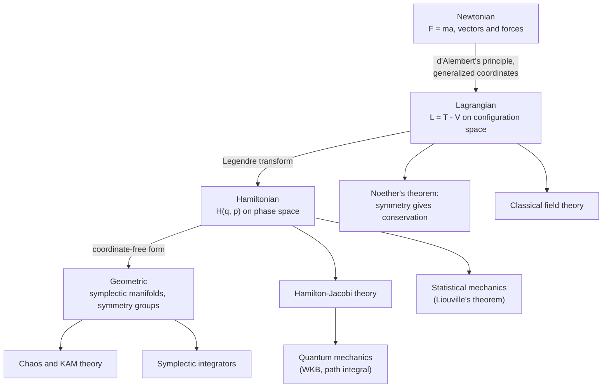

  <h1 style="color: white; margin: 0; font-size: 2.5rem;">Classical Mechanics</h1>
  
The physics of motion and forces, from Newton's laws through the Lagrangian, Hamiltonian, and geometric formulations to chaos and computation.

**Classical mechanics** describes the motion of bodies under forces when speeds are small compared with light and actions are large compared with Planck's constant. It predicts everything from projectile trajectories and planetary orbits to spacecraft navigation, molecular dynamics, and structural vibration. It also provides the mathematical framework (action principles, phase space, symmetries, and conservation laws) on which quantum mechanics, statistical mechanics, and field theory are built. This section is organized in layers: the force-based Newtonian picture, the equivalent energy-based formulations of Lagrange and Hamilton, their geometric foundation, and the modern topics of chaos and computation.

## Pages in this section

| Layer | Page | Covers |
|---|---|---|
| Core | [Newtonian Mechanics &amp; Conservation Laws](newtonian.html) | Newton's laws, kinematics, work and energy, momentum and angular momentum, central forces and gravitation |
| Core | [Oscillations &amp; Waves](waves.html) | Simple, damped, and driven oscillators; normal modes; the wave equation; dispersion; first nonlinear effects |
| Formalism | [Lagrangian &amp; Hamiltonian Mechanics](lagrangian-hamiltonian.html) | Least action, Euler–Lagrange equations, Noether's theorem, Hamilton's equations, Poisson brackets, canonical transformations, Hamilton–Jacobi theory |
| Formalism | [Geometric Formalism](geometric-mechanics.html) | Symplectic and Poisson manifolds, Liouville's theorem, Lagrangian submanifolds, integrable systems, momentum maps and reduction, geometric phases |
| Modern | [Chaos &amp; Nonlinear Dynamics](chaos-and-computational.html) | Lyapunov exponents, Poincaré sections, KAM theory and the standard map, strange attractors, bifurcations, diagnostics, data-driven forecasting |
| Modern | [Computational Methods](computational-classical-mechanics.html) | Symplectic and variational integrators, backward error analysis, molecular dynamics, N-body methods, structure-preserving machine learning |
| Applications | [Rigid Body Dynamics](rigid-body-dynamics.html) | Inertia tensor, Euler's equations and angles, tops and gyroscopes, the tennis-racket theorem |

Related subjects that build directly on classical mechanics:

| Subject | Connection |
|---|---|
| [Fluid Mechanics](../fluid-mechanics.html) | Newton's laws for continuous, deformable media: Euler and Navier–Stokes equations, turbulence |
| [Thermodynamics](../thermodynamics.html) | Energy, work, and heat at the macroscopic level |
| [Statistical Mechanics](../statistical-mechanics/) | Hamiltonian dynamics of very many particles, Liouville's theorem, and the ensembles of thermodynamics |
| [Relativity](../relativity/) | What replaces Newtonian mechanics at speeds near $c$ or in strong gravity |
| [Quantum Mechanics](../quantum-mechanics/) | The theory that classical mechanics approximates as $\hbar \to 0$ |

## How the formulations fit together

Newtonian, Lagrangian, and Hamiltonian mechanics predict identical motion for systems where all three apply. They differ in their variables, in which problems they make easy, and in which generalizations they lead to. The diagram maps the formulations onto the pages of this section and shows where each leads.

| Aspect | Newtonian | Lagrangian | Hamiltonian |
|---|---|---|---|
| Central quantity | Force $\vec{F}$ | Lagrangian $L = T - V$ | Hamiltonian $H$ (equal to $T + V$ for natural systems) |
| Variables | Cartesian positions and velocities | Generalized coordinates $q_i, \dot{q}_i$ | Coordinates and momenta $q_i, p_i$ |
| Equations of motion | $\vec{F} = m\vec{a}$ ($3N$ second-order) | $\frac{d}{dt}\frac{\partial L}{\partial \dot{q}_i} - \frac{\partial L}{\partial q_i} = 0$ ($n$ second-order) | $\dot{q}_i = \frac{\partial H}{\partial p_i}$, $\dot{p}_i = -\frac{\partial H}{\partial q_i}$ ($2n$ first-order) |
| Constraints | Explicit constraint forces | Eliminated by the choice of coordinates, or Lagrange multipliers | As Lagrangian, or Dirac's constraint theory |
| Space | Physical space $\mathbb{R}^3$ | Configuration space and its tangent bundle | Phase space (cotangent bundle) |
| Best for | Direct force problems, friction, intuition | Constrained systems, symmetries, field theory | Conserved quantities, phase-space geometry, perturbation theory, statistical and quantum mechanics |

**Choosing a formulation.** Newton is the most direct choice when the forces are known and include friction or other non-conservative effects. Lagrange is preferable once constraints appear (a bead on a wire, a double pendulum, a rolling disc), since suitable generalized coordinates remove constraint forces from the problem. Hamilton is the natural setting for questions about the structure of all possible motions: conserved quantities, adiabatic invariants, stability, chaos, statistical ensembles, and the transition to quantum mechanics. For long numerical simulations, the Hamiltonian structure also determines which integrators remain accurate.

## Unifying principles

- **Symmetry and conservation.** Noether's theorem ties each continuous symmetry to a conserved quantity: time translation to energy, space translation to momentum, rotation to angular momentum.
- **Stationary action.** Physical paths make the action $S = \int L\, dt$ stationary (not always minimal). The same principle, with a different Lagrangian, underlies electromagnetism, general relativity, and quantum field theory, and the path integral explains why it works.
- **Phase-space geometry.** Hamiltonian flow preserves the symplectic structure and hence phase-space volume (Liouville's theorem). This is the basis of statistical mechanics and of symplectic integrators.
- **Determinism is not predictability.** Nonlinear systems with as few as three phase-space dimensions can be chaotic: exactly deterministic, yet with prediction errors that grow exponentially.

## Domain of validity

Classical mechanics is a limit of more complete theories. The table gives the conditions under which it applies and the theory that takes over when they fail.

| Condition for classical mechanics | Fails when | Replaced by |
|---|---|---|
| $v \ll c$ | Particle accelerators, cosmic rays, GPS clock corrections | [Special relativity](../relativity/special-relativity.html) |
| $GM/(rc^2) \ll 1$ | Near neutron stars and black holes; precision orbital work (Mercury's perihelion) | [General relativity](../relativity/general-relativity.html) |
| Action $\gg \hbar$; de Broglie wavelength much smaller than the system | Atoms, molecules, electrons in solids, low-temperature matter | [Quantum mechanics](../quantum-mechanics/) |
| Few enough degrees of freedom to track individually | Gases, liquids, and solids with around $10^{23}$ particles | [Statistical mechanics](../statistical-mechanics/) (built on classical or quantum dynamics) |

Inside its domain, classical mechanics remains the working theory for aerospace and orbital engineering, robotics, structural and mechanical engineering, biomolecular and materials simulation, and celestial mechanics.

## See also

- [Physics Hub](../): all physics topics.
- [Computational Physics](../computational-physics/): numerical methods across physics, including ODE and PDE solvers, Monte Carlo, and molecular dynamics.
- [Quantum Mechanics](../quantum-mechanics/): the $\hbar \to 0$ limit and semiclassical methods.
- [Relativity](../relativity/): mechanics at high speed and in strong gravity.
