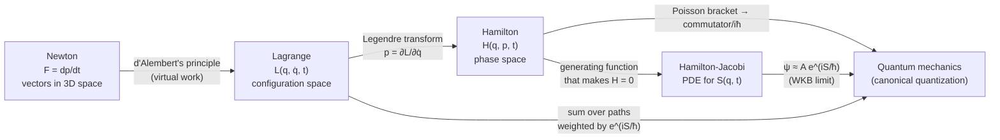

[Classical Mechanics](./) &raquo; Lagrangian &amp; Hamiltonian Mechanics

**Analytical mechanics** reformulates Newton's laws in terms of scalar energy functions instead of vector forces. The **Lagrangian** formulation derives equations of motion from a single variational principle in any convenient coordinates, eliminating constraint forces and exposing the link between symmetries and conservation laws. The **Hamiltonian** formulation recasts the same dynamics as a flow in phase space, which is the natural setting for statistical mechanics, chaos theory, perturbation theory, and quantization. This page covers both, ending with Hamilton-Jacobi theory and the route to quantum mechanics. The deeper geometric structure (symplectic forms, bundles, geometric phases) is treated in [Geometric Formalism](geometric-mechanics.html).

## Three Formulations of One Theory

Newtonian, Lagrangian, and Hamiltonian mechanics make identical predictions for classical systems; they differ in what they take as fundamental and in which problems they make easy.



| Aspect | Newtonian | Lagrangian | Hamiltonian |
|--------|-----------|------------|-------------|
| Fundamental object | Force $\vec{F}$ | Lagrangian $L(q, \dot{q}, t)$ | Hamiltonian $H(q, p, t)$ |
| State variables | $\vec{r}, \vec{v}$ | $q_i, \dot{q}_i$ | $q_i, p_i$ |
| Equations of motion | $3N$ second-order ODEs | $n$ second-order ODEs | $2n$ first-order ODEs |
| Constraints | Explicit constraint forces | Eliminated by choice of coordinates | Eliminated by choice of coordinates |
| Symmetries | Found by inspection | Noether's theorem; cyclic coordinates | Poisson brackets; canonical transformations |
| Arena | Physical space $\mathbb{R}^3$ | Configuration space $Q$ (velocity phase space $TQ$) | Phase space $T^*Q$ |
| Best for | Direct force problems, dissipation | Constrained systems, field theory | Phase-space geometry, chaos, perturbation theory, quantization |

Here $n$ is the number of **degrees of freedom**: the number of independent coordinates needed to specify the configuration after constraints are imposed. $N$ free particles have $3N$; a rigid body has 6; a double pendulum in a plane has 2.

## Lagrangian Mechanics

### Hamilton's Principle

The Lagrangian of a system with kinetic energy $T$ and potential energy $V$ is

$$
L(q, \dot{q}, t) = T - V,
$$

and the **action** of a path $q(t)$ between fixed times $t_1$ and $t_2$ is

$$
S[q] = \int_{t_1}^{t_2} L(q, \dot{q}, t)\, dt.
$$

**Hamilton's principle** states that the physical path makes the action *stationary*: $\delta S = 0$ for every variation $\delta q(t)$ that vanishes at the endpoints. The traditional name "principle of least action" is slightly inaccurate. The action is a minimum only for sufficiently short paths; in general the true path can be a saddle point of $S$ (for example, a harmonic oscillator followed for longer than half a period).

<figure style="text-align:center;margin:1.5em 0">
<svg viewBox="0 0 560 250" role="img" aria-label="The true path between fixed endpoints and a varied path differing by delta q, which vanishes at the endpoints" style="max-width:560px;width:100%;height:auto" xmlns="http://www.w3.org/2000/svg" font-family="sans-serif" font-size="13">
<defs><marker id="arr-var" markerWidth="8" markerHeight="8" refX="7" refY="3" orient="auto"><path d="M0,0 L0,6 L8,3 z" fill="currentColor"/></marker></defs>
<line x1="50" y1="215" x2="540" y2="215" stroke="currentColor" stroke-width="1.2" marker-end="url(#arr-var)"/>
<line x1="50" y1="215" x2="50" y2="15" stroke="currentColor" stroke-width="1.2" marker-end="url(#arr-var)"/>
<text x="535" y="233" text-anchor="end" fill="currentColor">t</text>
<text x="58" y="22" fill="currentColor">q</text>
<path d="M90.0,170.0 L94.9,166.2 L99.9,162.4 L104.8,158.7 L109.7,154.9 L114.7,151.2 L119.6,147.5 L124.6,143.9 L129.5,140.3 L134.4,136.7 L139.4,133.2 L144.3,129.8 L149.2,126.5 L154.2,123.2 L159.1,120.0 L164.1,116.9 L169.0,113.9 L173.9,111.0 L178.9,108.2 L183.8,105.6 L188.7,103.0 L193.7,100.6 L198.6,98.3 L203.5,96.1 L208.5,94.0 L213.4,92.1 L218.4,90.4 L223.3,88.7 L228.2,87.3 L233.2,86.0 L238.1,84.8 L243.0,83.8 L248.0,83.0 L252.9,82.3 L257.8,81.8 L262.8,81.4 L267.7,81.3 L272.7,81.3 L277.6,81.4 L282.5,81.8 L287.5,82.3 L292.4,83.0 L297.3,83.8 L302.3,84.8 L307.2,86.0 L312.2,87.4 L317.1,88.9 L322.0,90.6 L327.0,92.4 L331.9,94.4 L336.8,96.6 L341.8,98.9 L346.7,101.4 L351.6,104.0 L356.6,106.8 L361.5,109.7 L366.5,112.8 L371.4,116.0 L376.3,119.3 L381.3,122.8 L386.2,126.3 L391.1,130.0 L396.1,133.8 L401.0,137.7 L405.9,141.7 L410.9,145.8 L415.8,150.0 L420.8,154.3 L425.7,158.7 L430.6,163.1 L435.6,167.6 L440.5,172.2 L445.4,176.8 L450.4,181.4 L455.3,186.1 L460.3,190.9 L465.2,195.6 L470.1,200.4 L475.1,205.2 L480.0,210.0" fill="none" stroke="#2f7fd8" stroke-width="3"/>
<path d="M90.0,170.0 L94.9,166.2 L99.9,162.6 L104.8,159.0 L109.7,155.5 L114.7,152.3 L119.6,149.1 L124.6,146.2 L129.5,143.5 L134.4,140.9 L139.4,138.5 L144.3,136.3 L149.2,134.3 L154.2,132.4 L159.1,130.6 L164.1,128.9 L169.0,127.3 L173.9,125.7 L178.9,124.1 L183.8,122.4 L188.7,120.7 L193.7,118.9 L198.6,117.0 L203.5,114.9 L208.5,112.7 L213.4,110.4 L218.4,107.9 L223.3,105.2 L228.2,102.3 L233.2,99.3 L238.1,96.2 L243.0,93.0 L248.0,89.7 L252.9,86.4 L257.8,83.1 L262.8,79.9 L267.7,76.8 L272.7,73.7 L277.6,70.9 L282.5,68.4 L287.5,66.1 L292.4,64.2 L297.3,62.6 L302.3,61.4 L307.2,60.7 L312.2,60.5 L317.1,60.7 L322.0,61.4 L327.0,62.6 L331.9,64.4 L336.8,66.6 L341.8,69.3 L346.7,72.5 L351.6,76.1 L356.6,80.1 L361.5,84.5 L366.5,89.2 L371.4,94.1 L376.3,99.3 L381.3,104.8 L386.2,110.3 L391.1,116.0 L396.1,121.7 L401.0,127.4 L405.9,133.2 L410.9,138.9 L415.8,144.5 L420.8,150.1 L425.7,155.6 L430.6,160.9 L435.6,166.2 L440.5,171.3 L445.4,176.3 L450.4,181.3 L455.3,186.1 L460.3,190.9 L465.2,195.7 L470.1,200.5 L475.1,205.2 L480.0,210.0" fill="none" stroke="currentColor" stroke-width="1.6" stroke-dasharray="6 4"/>
<line x1="208.5" y1="94.0" x2="208.5" y2="112.7" stroke="currentColor" stroke-width="1.2"/>
<text x="214.5" y="107.4" fill="currentColor">δq(t)</text>
<circle cx="90" cy="170.0" r="5" fill="currentColor"/>
<text x="90" y="192.0" text-anchor="middle" fill="currentColor">q(t₁)</text>
<circle cx="480" cy="210.0" r="5" fill="currentColor"/>
<text x="480" y="232.0" text-anchor="middle" fill="currentColor">q(t₂)</text>
<text x="307.2" y="72.0" fill="#2f7fd8">true path: δS = 0</text>
<text x="396.2" y="134.3" fill="currentColor">varied path q + δq</text>
</svg>
<figcaption>Hamilton's principle compares the true path with every nearby path sharing the same endpoints. To first order in <i>δq</i>, the action does not change.</figcaption>
</figure>

### The Euler-Lagrange Equations

Varying the path and integrating the $\delta\dot{q}$ term by parts gives

$$
\delta S = \int_{t_1}^{t_2} \sum_i \left[\frac{\partial L}{\partial q_i} - \frac{d}{dt}\frac{\partial L}{\partial \dot{q}_i}\right]\delta q_i\, dt + \left[\sum_i \frac{\partial L}{\partial \dot{q}_i}\,\delta q_i\right]_{t_1}^{t_2}.
$$

The boundary term vanishes because $\delta q_i(t_1) = \delta q_i(t_2) = 0$. For $\delta S = 0$ to hold for arbitrary independent $\delta q_i$, each bracket must vanish separately. This gives the **Euler-Lagrange equations**:

$$
\frac{d}{dt}\left(\frac{\partial L}{\partial \dot{q}_i}\right) - \frac{\partial L}{\partial q_i} = 0, \qquad i = 1, \ldots, n.
$$

Two quantities appear often enough to have names:

| Quantity | Definition | Notes |
|----------|------------|-------|
| Generalized (canonical) momentum | $p_i = \partial L / \partial \dot{q}_i$ | Equals $m\dot{x}$ only in Cartesian coordinates with velocity-independent $V$. For an angle it is an angular momentum. |
| Generalized force | $\partial L / \partial q_i$ | With it, the Euler-Lagrange equation reads $\dot{p}_i = \partial L/\partial q_i$. |
| Cyclic (ignorable) coordinate | $q_k$ absent from $L$ | Then $\dot{p}_k = 0$: its conjugate momentum is conserved. |

The Lagrangian is not unique. Adding a total time derivative, $L \to L + \frac{d}{dt}F(q, t)$, changes $S$ only by boundary terms and leaves the equations of motion unchanged.

### Worked Example: The Simple Pendulum

A mass $m$ on a rigid, massless rod of length $\ell$ has one degree of freedom, the angle $\theta$ from the vertical. Measuring height from the lowest point,

$$
L = \tfrac{1}{2}m\ell^2\dot{\theta}^2 - mg\ell(1 - \cos\theta).
$$

The two partial derivatives are $\partial L/\partial\dot\theta = m\ell^2\dot\theta$ and $\partial L/\partial\theta = -mg\ell\sin\theta$, so the Euler-Lagrange equation is

$$
\ddot{\theta} + \frac{g}{\ell}\sin\theta = 0.
$$

The rod tension never appears: choosing $\theta$ as the coordinate builds the constraint in. For small swings, $\sin\theta \approx \theta$ gives simple harmonic motion at $\omega_0 = \sqrt{g/\ell}$ (see [Oscillations &amp; Waves](waves.html)).

### Constraints and Lagrange Multipliers

Constraints are classified by whether they can be written as relations among coordinates:

| Type | Form | Example | Treatment |
|------|------|---------|-----------|
| Holonomic | $f(q_1, \ldots, q_n, t) = 0$ | Pendulum rod: $x^2 + y^2 - \ell^2 = 0$ | Eliminate a coordinate, or use a multiplier |
| Nonholonomic (velocity) | $\sum_i a_i(q)\,\dot{q}_i + a_0(q) = 0$, not integrable | Rolling ball or ice skate that can steer | Multipliers required |
| Scleronomic / rheonomic | Constraint without / with explicit $t$ | Fixed wire / wire moved by a motor | Rheonomic constraints generally break energy conservation |

When it is inconvenient to eliminate coordinates, or when the constraint force itself is wanted, keep all coordinates and add one multiplier $\lambda_k$ per holonomic constraint $f_k(q, t) = 0$:

$$
\frac{d}{dt}\left(\frac{\partial L}{\partial \dot{q}_i}\right) - \frac{\partial L}{\partial q_i} = \sum_k \lambda_k \frac{\partial f_k}{\partial q_i}.
$$

These $n$ equations plus the constraint equations determine both the motion and the $\lambda_k$. The right-hand side is the **generalized constraint force**. For the pendulum in Cartesian coordinates with $f = x^2 + y^2 - \ell^2$, it works out to $\lambda = -T/(2\ell)$, where $T$ is the rod tension, so the tension that the angle coordinate hid is recovered.

For nonholonomic constraints the same right-hand side is used with $\partial f_k/\partial q_i$ replaced by the coefficients $a_{ki}$ (the Lagrange-d'Alembert principle). Nonholonomic dynamics does *not* follow from a stationary-action principle with the constraint imposed on the varied paths; that "vakonomic" approach gives different and physically incorrect equations for rolling bodies.

### Non-Conservative and Velocity-Dependent Forces

Forces that are not derived from a potential enter as **generalized forces** $Q_i = \sum_j \vec{F}_j \cdot \partial\vec{r}_j/\partial q_i$ on the right-hand side:

$$
\frac{d}{dt}\left(\frac{\partial L}{\partial \dot{q}_i}\right) - \frac{\partial L}{\partial q_i} = Q_i.
$$

Linear viscous drag can be packaged in the **Rayleigh dissipation function** $\mathcal{F} = \tfrac{1}{2}\sum_i b_i \dot{q}_i^2$, with $Q_i = -\partial\mathcal{F}/\partial\dot{q}_i$.

Some forces are velocity dependent yet still fit into a Lagrangian. The most important is the Lorentz force on a charge $q$ in electromagnetic potentials $\phi$ and $\vec{A}$:

$$
L = \tfrac{1}{2}m\dot{\vec{r}}^{\,2} - q\phi(\vec{r}, t) + q\,\dot{\vec{r}}\cdot\vec{A}(\vec{r}, t).
$$

The Euler-Lagrange equations reproduce $m\ddot{\vec{r}} = q(\vec{E} + \dot{\vec{r}}\times\vec{B})$, while the canonical momentum becomes $\vec{p} = m\dot{\vec{r}} + q\vec{A}$, which is not the mechanical momentum. This distinction is the starting point for minimal coupling in quantum mechanics and gauge theory.

### Noether's Theorem

Emmy Noether's first theorem (1918) states that every continuous symmetry of the action yields a conserved quantity. In its simplest form: if $L$ is unchanged, to first order, under $q_i \to q_i + \varepsilon\,\xi_i(q)$, then

$$
Q = \sum_i \frac{\partial L}{\partial \dot{q}_i}\,\xi_i(q)
$$

is constant along every solution. If $L$ changes by a total derivative, $\delta L = \varepsilon\, dF/dt$, the conserved charge is $Q - F$ instead; this case covers Galilean boosts, whose conserved quantity is the center-of-mass motion. For time translation, when $\partial L/\partial t = 0$, the conserved quantity is the **energy function**

$$
h = \sum_i \dot{q}_i \frac{\partial L}{\partial \dot{q}_i} - L,
$$

which equals $T + V$ when the constraints are time-independent and $V$ does not depend on velocity.

| Symmetry of the action | Conserved quantity |
|------------------------|--------------------|
| Time translation ($\partial L/\partial t = 0$) | Energy $h$ |
| Spatial translation | Linear momentum |
| Rotation | Angular momentum |
| Galilean boost | Center-of-mass motion ($M\vec{R} - \vec{P}t$) |
| Global phase rotation of a complex field | Electric charge (particle number) |

A cyclic coordinate is the simplest case: shifting $q_k$ is a symmetry, and the Noether charge is $p_k$. *Local* (gauge) symmetries fall under Noether's second theorem, which gives identities among the equations of motion rather than new conserved quantities; charge conservation follows from the global part of the gauge group.

### Worked Example: The Double Pendulum

For a planar double pendulum (two point masses on rigid rods), a Newtonian treatment requires both rod tensions, which change direction continuously. A Lagrangian treatment needs only the two angles. The derivation can be automated with SymPy:

```python
import sympy as sp
from sympy.calculus.euler import euler_equations
from scipy.integrate import solve_ivp

t = sp.symbols("t")
m1, m2, l1, l2, g = sp.symbols("m1 m2 l1 l2 g", positive=True)
th1, th2 = sp.Function("theta1")(t), sp.Function("theta2")(t)

# Cartesian positions written in terms of the two generalized coordinates
x1, y1 = l1 * sp.sin(th1), -l1 * sp.cos(th1)
x2, y2 = x1 + l2 * sp.sin(th2), y1 - l2 * sp.cos(th2)

T = m1 * (x1.diff(t)**2 + y1.diff(t)**2) / 2 + m2 * (x2.diff(t)**2 + y2.diff(t)**2) / 2
V = m1 * g * y1 + m2 * g * y2
L = sp.simplify(T - V)

# Euler-Lagrange equations: no rod tensions anywhere
eqs = euler_equations(L, [th1, th2], t)
acc = sp.solve([e.lhs for e in eqs], [th1.diff(t, 2), th2.diff(t, 2)], dict=True)[0]

# Convert the symbolic accelerations into a numerical right-hand side
w1, w2 = sp.symbols("w1 w2")
subs = {th1.diff(t): w1, th2.diff(t): w2}
state, params = (th1, th2, w1, w2), (m1, m2, l1, l2, g)
a1 = sp.lambdify(state + params, acc[th1.diff(t, 2)].subs(subs))
a2 = sp.lambdify(state + params, acc[th2.diff(t, 2)].subs(subs))

p = (1.0, 1.0, 1.0, 1.0, 9.81)
def rhs(_, y):
    return [y[2], y[3], a1(*y, *p), a2(*y, *p)]

sol = solve_ivp(rhs, (0, 20), [2.0, 2.5, 0.0, 0.0], rtol=1e-10, atol=1e-10)
```

At large amplitudes the double pendulum is chaotic; see [Chaos &amp; Nonlinear Dynamics](chaos-and-computational.html). For long integrations, prefer a symplectic integrator over a general-purpose one (see [Computational Methods](computational-classical-mechanics.html)).

### Small Oscillations

Expanding $L$ to second order about a stable equilibrium $q_0$ gives $L \approx \tfrac{1}{2}\dot{\eta}^{\mathsf{T}}\mathbf{M}\,\dot{\eta} - \tfrac{1}{2}\eta^{\mathsf{T}}\mathbf{K}\,\eta$ with $\eta = q - q_0$. The Euler-Lagrange equations are then linear, and the normal-mode frequencies solve $\det(\mathbf{K} - \omega^2\mathbf{M}) = 0$. This is how coupled oscillators, molecular vibrations, and lattice phonons are analyzed; see [Coupled Oscillators and Normal Modes](waves.html#coupled-oscillators-and-normal-modes).

## Hamiltonian Mechanics

### The Legendre Transform

Hamilton's formulation replaces the velocities $\dot{q}_i$ by the momenta $p_i = \partial L/\partial\dot{q}_i$ as independent variables. The function that accomplishes this change of variables is the **Legendre transform** of $L$ with respect to the velocities:

$$
H(q, p, t) = \sum_i p_i\,\dot{q}_i - L(q, \dot{q}, t), \qquad \text{with } \dot{q} \text{ expressed in terms of } (q, p).
$$

The transform is well defined when the Hessian $\partial^2 L/\partial\dot{q}_i\partial\dot{q}_j$ is invertible, which holds for ordinary mechanical systems. (Gauge theories violate this condition and require Dirac's theory of constrained Hamiltonian systems.)

When $T$ is quadratic in the velocities and $V$ is velocity-independent, $H = T + V$ is the total energy. In general $H$ is conserved exactly when it has no explicit time dependence, since $dH/dt = \partial H/\partial t = -\partial L/\partial t$. For a charged particle, $H = (\vec{p} - q\vec{A})^2/2m + q\phi$.

### Hamilton's Equations

Taking the differential of $H$ and using the Euler-Lagrange equations gives **Hamilton's canonical equations**:

$$
\dot{q}_i = \frac{\partial H}{\partial p_i}, \qquad \dot{p}_i = -\frac{\partial H}{\partial q_i}.
$$

These are $2n$ first-order equations in place of $n$ second-order ones. They also follow from a phase-space action principle, $\delta\int\left(\sum_i p_i\dot{q}_i - H\right)dt = 0$, with $q$ and $p$ varied independently.

For the pendulum, $p_\theta = m\ell^2\dot\theta$ and $H = p_\theta^2/(2m\ell^2) + mg\ell(1 - \cos\theta)$, so $\dot\theta = p_\theta/(m\ell^2)$ and $\dot{p}_\theta = -mg\ell\sin\theta$.

### Phase Space and Liouville's Theorem

The state of the system is a single point $(q, p)$ in the $2n$-dimensional **phase space**, and Hamilton's equations define a velocity field on it. Solutions are the flow lines of that field. Because the system is deterministic, flow lines of a time-independent Hamiltonian never cross, and each lies on a surface of constant $H$.

<figure style="text-align:center;margin:1.5em 0">
<svg viewBox="0 0 640 330" role="img" aria-label="Phase portrait of the simple pendulum showing closed libration orbits, the separatrix, and open rotation orbits" style="max-width:640px;width:100%;height:auto" xmlns="http://www.w3.org/2000/svg" font-family="sans-serif" font-size="13">
<defs><marker id="arr-pp" markerWidth="8" markerHeight="8" refX="7" refY="3" orient="auto"><path d="M0,0 L0,6 L8,3 z" fill="currentColor"/></marker></defs>
<line x1="40" y1="160.0" x2="620" y2="160.0" stroke="currentColor" stroke-width="1.2" marker-end="url(#arr-pp)"/>
<line x1="330.0" y1="300" x2="330.0" y2="12" stroke="currentColor" stroke-width="1.2" marker-end="url(#arr-pp)"/>
<text x="616" y="152.0" text-anchor="end" fill="currentColor">θ</text>
<text x="338.0" y="26" fill="currentColor">p_θ</text>
<text x="136.7" y="176.0" text-anchor="middle" fill="currentColor" font-size="11">−π</text>
<text x="523.3" y="176.0" text-anchor="middle" fill="currentColor" font-size="11">π</text>
<path d="M285.5,160.0 L287.8,150.4 L290.1,146.6 L292.4,143.8 L294.6,141.5 L296.9,139.6 L299.2,137.9 L301.5,136.5 L303.8,135.2 L306.1,134.1 L308.3,133.1 L310.6,132.3 L312.9,131.5 L315.2,130.9 L317.5,130.4 L319.7,129.9 L322.0,129.6 L324.3,129.3 L326.6,129.2 L328.9,129.1 L331.1,129.1 L333.4,129.2 L335.7,129.3 L338.0,129.6 L340.3,129.9 L342.5,130.4 L344.8,130.9 L347.1,131.5 L349.4,132.3 L351.7,133.1 L353.9,134.1 L356.2,135.2 L358.5,136.5 L360.8,137.9 L363.1,139.6 L365.4,141.5 L367.6,143.8 L369.9,146.6 L372.2,150.4 L374.5,160.0 L374.5,160.0 L372.2,169.6 L369.9,173.4 L367.6,176.2 L365.4,178.5 L363.1,180.4 L360.8,182.1 L358.5,183.5 L356.2,184.8 L353.9,185.9 L351.7,186.9 L349.4,187.7 L347.1,188.5 L344.8,189.1 L342.5,189.6 L340.3,190.1 L338.0,190.4 L335.7,190.7 L333.4,190.8 L331.1,190.9 L328.9,190.9 L326.6,190.8 L324.3,190.7 L322.0,190.4 L319.7,190.1 L317.5,189.6 L315.2,189.1 L312.9,188.5 L310.6,187.7 L308.3,186.9 L306.1,185.9 L303.8,184.8 L301.5,183.5 L299.2,182.1 L296.9,180.4 L294.6,178.5 L292.4,176.2 L290.1,173.4 L287.8,169.6 L285.5,160.0 Z" fill="none" stroke="currentColor" stroke-width="1.3" opacity="0.85"/>
<path d="M245.7,160.0 L250.0,143.8 L254.4,137.3 L258.7,132.3 L263.0,128.2 L267.3,124.7 L271.7,121.7 L276.0,119.0 L280.3,116.6 L284.6,114.5 L288.9,112.7 L293.3,111.0 L297.6,109.6 L301.9,108.3 L306.2,107.3 L310.6,106.4 L314.9,105.7 L319.2,105.2 L323.5,104.9 L327.8,104.7 L332.2,104.7 L336.5,104.9 L340.8,105.2 L345.1,105.7 L349.4,106.4 L353.8,107.3 L358.1,108.3 L362.4,109.6 L366.7,111.0 L371.1,112.7 L375.4,114.5 L379.7,116.6 L384.0,119.0 L388.3,121.7 L392.7,124.7 L397.0,128.2 L401.3,132.3 L405.6,137.3 L410.0,143.8 L414.3,160.0 L414.3,160.0 L410.0,176.2 L405.6,182.7 L401.3,187.7 L397.0,191.8 L392.7,195.3 L388.3,198.3 L384.0,201.0 L379.7,203.4 L375.4,205.5 L371.1,207.3 L366.7,209.0 L362.4,210.4 L358.1,211.7 L353.8,212.7 L349.4,213.6 L345.1,214.3 L340.8,214.8 L336.5,215.1 L332.2,215.3 L327.8,215.3 L323.5,215.1 L319.2,214.8 L314.9,214.3 L310.6,213.6 L306.2,212.7 L301.9,211.7 L297.6,210.4 L293.3,209.0 L288.9,207.3 L284.6,205.5 L280.3,203.4 L276.0,201.0 L271.7,198.3 L267.3,195.3 L263.0,191.8 L258.7,187.7 L254.4,182.7 L250.0,176.2 L245.7,160.0 Z" fill="none" stroke="currentColor" stroke-width="1.3" opacity="0.85"/>
<path d="M40.3,121.1 L46.6,126.5 L52.8,132.8 L59.1,140.9 L65.3,160.0" fill="none" stroke="currentColor" stroke-width="1.3" opacity="0.85"/>
<path d="M40.3,198.9 L46.6,193.5 L52.8,187.2 L59.1,179.1 L65.3,160.0" fill="none" stroke="currentColor" stroke-width="1.3" opacity="0.85"/>
<path d="M208.0,160.0 L214.3,140.9 L220.5,132.8 L226.8,126.5 L233.0,121.1 L239.3,116.4 L245.5,112.2 L251.8,108.4 L258.1,105.0 L264.3,101.9 L270.6,99.1 L276.8,96.6 L283.1,94.4 L289.3,92.5 L295.6,90.9 L301.8,89.5 L308.1,88.4 L314.4,87.6 L320.6,87.1 L326.9,86.8 L333.1,86.8 L339.4,87.1 L345.6,87.6 L351.9,88.4 L358.2,89.5 L364.4,90.9 L370.7,92.5 L376.9,94.4 L383.2,96.6 L389.4,99.1 L395.7,101.9 L401.9,105.0 L408.2,108.4 L414.5,112.2 L420.7,116.4 L427.0,121.1 L433.2,126.5 L439.5,132.8 L445.7,140.9 L452.0,160.0 L452.0,160.0 L445.7,179.1 L439.5,187.2 L433.2,193.5 L427.0,198.9 L420.7,203.6 L414.5,207.8 L408.2,211.6 L401.9,215.0 L395.7,218.1 L389.4,220.9 L383.2,223.4 L376.9,225.6 L370.7,227.5 L364.4,229.1 L358.2,230.5 L351.9,231.6 L345.6,232.4 L339.4,232.9 L333.1,233.2 L326.9,233.2 L320.6,232.9 L314.4,232.4 L308.1,231.6 L301.8,230.5 L295.6,229.1 L289.3,227.5 L283.1,225.6 L276.8,223.4 L270.6,220.9 L264.3,218.1 L258.1,215.0 L251.8,211.6 L245.5,207.8 L239.3,203.6 L233.0,198.9 L226.8,193.5 L220.5,187.2 L214.3,179.1 L208.0,160.0 Z" fill="none" stroke="currentColor" stroke-width="1.3" opacity="0.85"/>
<path d="M594.7,160.0 L600.9,140.9 L607.2,132.8 L613.4,126.5 L619.7,121.1" fill="none" stroke="currentColor" stroke-width="1.3" opacity="0.85"/>
<path d="M594.7,160.0 L600.9,179.1 L607.2,187.2 L613.4,193.5 L619.7,198.9" fill="none" stroke="currentColor" stroke-width="1.3" opacity="0.85"/>
<path d="M45.4,106.0 L53.5,110.8 L61.7,116.1 L69.9,121.7 L78.0,127.8 L86.2,134.7 L94.4,142.8 L102.5,160.0" fill="none" stroke="currentColor" stroke-width="1.3" opacity="0.85"/>
<path d="M45.4,214.0 L53.5,209.2 L61.7,203.9 L69.9,198.3 L78.0,192.2 L86.2,185.3 L94.4,177.2 L102.5,160.0" fill="none" stroke="currentColor" stroke-width="1.3" opacity="0.85"/>
<path d="M170.8,160.0 L179.0,142.8 L187.1,134.7 L195.3,127.8 L203.5,121.7 L211.6,116.1 L219.8,110.8 L228.0,106.0 L236.1,101.5 L244.3,97.3 L252.4,93.5 L260.6,90.0 L268.8,86.9 L276.9,84.2 L285.1,81.8 L293.3,79.9 L301.4,78.3 L309.6,77.1 L317.8,76.3 L325.9,75.9 L334.1,75.9 L342.2,76.3 L350.4,77.1 L358.6,78.3 L366.7,79.9 L374.9,81.8 L383.1,84.2 L391.2,86.9 L399.4,90.0 L407.6,93.5 L415.7,97.3 L423.9,101.5 L432.0,106.0 L440.2,110.8 L448.4,116.1 L456.5,121.7 L464.7,127.8 L472.9,134.7 L481.0,142.8 L489.2,160.0 L489.2,160.0 L481.0,177.2 L472.9,185.3 L464.7,192.2 L456.5,198.3 L448.4,203.9 L440.2,209.2 L432.0,214.0 L423.9,218.5 L415.7,222.7 L407.6,226.5 L399.4,230.0 L391.2,233.1 L383.1,235.8 L374.9,238.2 L366.7,240.1 L358.6,241.7 L350.4,242.9 L342.2,243.7 L334.1,244.1 L325.9,244.1 L317.8,243.7 L309.6,242.9 L301.4,241.7 L293.3,240.1 L285.1,238.2 L276.9,235.8 L268.8,233.1 L260.6,230.0 L252.4,226.5 L244.3,222.7 L236.1,218.5 L228.0,214.0 L219.8,209.2 L211.6,203.9 L203.5,198.3 L195.3,192.2 L187.1,185.3 L179.0,177.2 L170.8,160.0 Z" fill="none" stroke="currentColor" stroke-width="1.3" opacity="0.85"/>
<path d="M557.5,160.0 L565.6,142.8 L573.8,134.7 L582.0,127.8 L590.1,121.7 L598.3,116.1 L606.5,110.8 L614.6,106.0" fill="none" stroke="currentColor" stroke-width="1.3" opacity="0.85"/>
<path d="M557.5,160.0 L565.6,177.2 L573.8,185.3 L582.0,192.2 L590.1,198.3 L598.3,203.9 L606.5,209.2 L614.6,214.0" fill="none" stroke="currentColor" stroke-width="1.3" opacity="0.85"/>
<path d="M40.0,81.7 L43.2,83.0 L46.4,84.3 L49.7,85.7 L52.9,87.0 L56.1,88.3 L59.3,89.7 L62.6,91.1 L65.8,92.4 L69.0,93.8 L72.2,95.1 L75.4,96.4 L78.7,97.8 L81.9,99.0 L85.1,100.3 L88.3,101.5 L91.6,102.7 L94.8,103.9 L98.0,105.0 L101.2,106.0 L104.4,107.0 L107.7,107.9 L110.9,108.7 L114.1,109.5 L117.3,110.2 L120.6,110.7 L123.8,111.2 L127.0,111.6 L130.2,111.9 L133.4,112.0 L136.7,112.1 L139.9,112.0 L143.1,111.9 L146.3,111.6 L149.6,111.2 L152.8,110.7 L156.0,110.2 L159.2,109.5 L162.4,108.7 L165.7,107.9 L168.9,107.0 L172.1,106.0 L175.3,105.0 L178.6,103.9 L181.8,102.7 L185.0,101.5 L188.2,100.3 L191.4,99.0 L194.7,97.8 L197.9,96.4 L201.1,95.1 L204.3,93.8 L207.6,92.4 L210.8,91.1 L214.0,89.7 L217.2,88.3 L220.4,87.0 L223.7,85.7 L226.9,84.3 L230.1,83.0 L233.3,81.7 L236.6,80.5 L239.8,79.2 L243.0,78.0 L246.2,76.8 L249.4,75.6 L252.7,74.5 L255.9,73.4 L259.1,72.4 L262.3,71.3 L265.6,70.3 L268.8,69.4 L272.0,68.5 L275.2,67.6 L278.4,66.8 L281.7,66.0 L284.9,65.3 L288.1,64.6 L291.3,64.0 L294.6,63.4 L297.8,62.8 L301.0,62.3 L304.2,61.9 L307.4,61.5 L310.7,61.2 L313.9,60.9 L317.1,60.7 L320.3,60.5 L323.6,60.3 L326.8,60.3 L330.0,60.2 L333.2,60.3 L336.4,60.3 L339.7,60.5 L342.9,60.7 L346.1,60.9 L349.3,61.2 L352.6,61.5 L355.8,61.9 L359.0,62.3 L362.2,62.8 L365.4,63.4 L368.7,64.0 L371.9,64.6 L375.1,65.3 L378.3,66.0 L381.6,66.8 L384.8,67.6 L388.0,68.5 L391.2,69.4 L394.4,70.3 L397.7,71.3 L400.9,72.4 L404.1,73.4 L407.3,74.5 L410.6,75.6 L413.8,76.8 L417.0,78.0 L420.2,79.2 L423.4,80.5 L426.7,81.7 L429.9,83.0 L433.1,84.3 L436.3,85.7 L439.6,87.0 L442.8,88.3 L446.0,89.7 L449.2,91.1 L452.4,92.4 L455.7,93.8 L458.9,95.1 L462.1,96.4 L465.3,97.8 L468.6,99.0 L471.8,100.3 L475.0,101.5 L478.2,102.7 L481.4,103.9 L484.7,105.0 L487.9,106.0 L491.1,107.0 L494.3,107.9 L497.6,108.7 L500.8,109.5 L504.0,110.2 L507.2,110.7 L510.4,111.2 L513.7,111.6 L516.9,111.9 L520.1,112.0 L523.3,112.1 L526.6,112.0 L529.8,111.9 L533.0,111.6 L536.2,111.2 L539.4,110.7 L542.7,110.2 L545.9,109.5 L549.1,108.7 L552.3,107.9 L555.6,107.0 L558.8,106.0 L562.0,105.0 L565.2,103.9 L568.4,102.7 L571.7,101.5 L574.9,100.3 L578.1,99.0 L581.3,97.8 L584.6,96.4 L587.8,95.1 L591.0,93.8 L594.2,92.4 L597.4,91.1 L600.7,89.7 L603.9,88.3 L607.1,87.0 L610.3,85.7 L613.6,84.3 L616.8,83.0 L620.0,81.7" fill="none" stroke="currentColor" stroke-width="1.3" opacity="0.85"/>
<path d="M40.0,238.3 L43.2,237.0 L46.4,235.7 L49.7,234.3 L52.9,233.0 L56.1,231.7 L59.3,230.3 L62.6,228.9 L65.8,227.6 L69.0,226.2 L72.2,224.9 L75.4,223.6 L78.7,222.2 L81.9,221.0 L85.1,219.7 L88.3,218.5 L91.6,217.3 L94.8,216.1 L98.0,215.0 L101.2,214.0 L104.4,213.0 L107.7,212.1 L110.9,211.3 L114.1,210.5 L117.3,209.8 L120.6,209.3 L123.8,208.8 L127.0,208.4 L130.2,208.1 L133.4,208.0 L136.7,207.9 L139.9,208.0 L143.1,208.1 L146.3,208.4 L149.6,208.8 L152.8,209.3 L156.0,209.8 L159.2,210.5 L162.4,211.3 L165.7,212.1 L168.9,213.0 L172.1,214.0 L175.3,215.0 L178.6,216.1 L181.8,217.3 L185.0,218.5 L188.2,219.7 L191.4,221.0 L194.7,222.2 L197.9,223.6 L201.1,224.9 L204.3,226.2 L207.6,227.6 L210.8,228.9 L214.0,230.3 L217.2,231.7 L220.4,233.0 L223.7,234.3 L226.9,235.7 L230.1,237.0 L233.3,238.3 L236.6,239.5 L239.8,240.8 L243.0,242.0 L246.2,243.2 L249.4,244.4 L252.7,245.5 L255.9,246.6 L259.1,247.6 L262.3,248.7 L265.6,249.7 L268.8,250.6 L272.0,251.5 L275.2,252.4 L278.4,253.2 L281.7,254.0 L284.9,254.7 L288.1,255.4 L291.3,256.0 L294.6,256.6 L297.8,257.2 L301.0,257.7 L304.2,258.1 L307.4,258.5 L310.7,258.8 L313.9,259.1 L317.1,259.3 L320.3,259.5 L323.6,259.7 L326.8,259.7 L330.0,259.8 L333.2,259.7 L336.4,259.7 L339.7,259.5 L342.9,259.3 L346.1,259.1 L349.3,258.8 L352.6,258.5 L355.8,258.1 L359.0,257.7 L362.2,257.2 L365.4,256.6 L368.7,256.0 L371.9,255.4 L375.1,254.7 L378.3,254.0 L381.6,253.2 L384.8,252.4 L388.0,251.5 L391.2,250.6 L394.4,249.7 L397.7,248.7 L400.9,247.6 L404.1,246.6 L407.3,245.5 L410.6,244.4 L413.8,243.2 L417.0,242.0 L420.2,240.8 L423.4,239.5 L426.7,238.3 L429.9,237.0 L433.1,235.7 L436.3,234.3 L439.6,233.0 L442.8,231.7 L446.0,230.3 L449.2,228.9 L452.4,227.6 L455.7,226.2 L458.9,224.9 L462.1,223.6 L465.3,222.2 L468.6,221.0 L471.8,219.7 L475.0,218.5 L478.2,217.3 L481.4,216.1 L484.7,215.0 L487.9,214.0 L491.1,213.0 L494.3,212.1 L497.6,211.3 L500.8,210.5 L504.0,209.8 L507.2,209.3 L510.4,208.8 L513.7,208.4 L516.9,208.1 L520.1,208.0 L523.3,207.9 L526.6,208.0 L529.8,208.1 L533.0,208.4 L536.2,208.8 L539.4,209.3 L542.7,209.8 L545.9,210.5 L549.1,211.3 L552.3,212.1 L555.6,213.0 L558.8,214.0 L562.0,215.0 L565.2,216.1 L568.4,217.3 L571.7,218.5 L574.9,219.7 L578.1,221.0 L581.3,222.2 L584.6,223.6 L587.8,224.9 L591.0,226.2 L594.2,227.6 L597.4,228.9 L600.7,230.3 L603.9,231.7 L607.1,233.0 L610.3,234.3 L613.6,235.7 L616.8,237.0 L620.0,238.3" fill="none" stroke="currentColor" stroke-width="1.3" opacity="0.85"/>
<path d="M40.0,60.2 L43.2,61.2 L46.4,62.3 L49.7,63.3 L52.9,64.3 L56.1,65.3 L59.3,66.4 L62.6,67.4 L65.8,68.4 L69.0,69.4 L72.2,70.3 L75.4,71.3 L78.7,72.2 L81.9,73.1 L85.1,74.0 L88.3,74.9 L91.6,75.7 L94.8,76.5 L98.0,77.2 L101.2,77.9 L104.4,78.5 L107.7,79.1 L110.9,79.7 L114.1,80.1 L117.3,80.5 L120.6,80.9 L123.8,81.2 L127.0,81.4 L130.2,81.6 L133.4,81.7 L136.7,81.7 L139.9,81.7 L143.1,81.6 L146.3,81.4 L149.6,81.2 L152.8,80.9 L156.0,80.5 L159.2,80.1 L162.4,79.7 L165.7,79.1 L168.9,78.5 L172.1,77.9 L175.3,77.2 L178.6,76.5 L181.8,75.7 L185.0,74.9 L188.2,74.0 L191.4,73.1 L194.7,72.2 L197.9,71.3 L201.1,70.3 L204.3,69.4 L207.6,68.4 L210.8,67.4 L214.0,66.4 L217.2,65.3 L220.4,64.3 L223.7,63.3 L226.9,62.3 L230.1,61.2 L233.3,60.2 L236.6,59.2 L239.8,58.2 L243.0,57.3 L246.2,56.3 L249.4,55.4 L252.7,54.5 L255.9,53.6 L259.1,52.7 L262.3,51.9 L265.6,51.1 L268.8,50.3 L272.0,49.5 L275.2,48.8 L278.4,48.1 L281.7,47.5 L284.9,46.9 L288.1,46.3 L291.3,45.8 L294.6,45.3 L297.8,44.8 L301.0,44.4 L304.2,44.0 L307.4,43.7 L310.7,43.4 L313.9,43.2 L317.1,43.0 L320.3,42.8 L323.6,42.7 L326.8,42.6 L330.0,42.6 L333.2,42.6 L336.4,42.7 L339.7,42.8 L342.9,43.0 L346.1,43.2 L349.3,43.4 L352.6,43.7 L355.8,44.0 L359.0,44.4 L362.2,44.8 L365.4,45.3 L368.7,45.8 L371.9,46.3 L375.1,46.9 L378.3,47.5 L381.6,48.1 L384.8,48.8 L388.0,49.5 L391.2,50.3 L394.4,51.1 L397.7,51.9 L400.9,52.7 L404.1,53.6 L407.3,54.5 L410.6,55.4 L413.8,56.3 L417.0,57.3 L420.2,58.2 L423.4,59.2 L426.7,60.2 L429.9,61.2 L433.1,62.3 L436.3,63.3 L439.6,64.3 L442.8,65.3 L446.0,66.4 L449.2,67.4 L452.4,68.4 L455.7,69.4 L458.9,70.3 L462.1,71.3 L465.3,72.2 L468.6,73.1 L471.8,74.0 L475.0,74.9 L478.2,75.7 L481.4,76.5 L484.7,77.2 L487.9,77.9 L491.1,78.5 L494.3,79.1 L497.6,79.7 L500.8,80.1 L504.0,80.5 L507.2,80.9 L510.4,81.2 L513.7,81.4 L516.9,81.6 L520.1,81.7 L523.3,81.7 L526.6,81.7 L529.8,81.6 L533.0,81.4 L536.2,81.2 L539.4,80.9 L542.7,80.5 L545.9,80.1 L549.1,79.7 L552.3,79.1 L555.6,78.5 L558.8,77.9 L562.0,77.2 L565.2,76.5 L568.4,75.7 L571.7,74.9 L574.9,74.0 L578.1,73.1 L581.3,72.2 L584.6,71.3 L587.8,70.3 L591.0,69.4 L594.2,68.4 L597.4,67.4 L600.7,66.4 L603.9,65.3 L607.1,64.3 L610.3,63.3 L613.6,62.3 L616.8,61.2 L620.0,60.2" fill="none" stroke="currentColor" stroke-width="1.3" opacity="0.85"/>
<path d="M40.0,259.8 L43.2,258.8 L46.4,257.7 L49.7,256.7 L52.9,255.7 L56.1,254.7 L59.3,253.6 L62.6,252.6 L65.8,251.6 L69.0,250.6 L72.2,249.7 L75.4,248.7 L78.7,247.8 L81.9,246.9 L85.1,246.0 L88.3,245.1 L91.6,244.3 L94.8,243.5 L98.0,242.8 L101.2,242.1 L104.4,241.5 L107.7,240.9 L110.9,240.3 L114.1,239.9 L117.3,239.5 L120.6,239.1 L123.8,238.8 L127.0,238.6 L130.2,238.4 L133.4,238.3 L136.7,238.3 L139.9,238.3 L143.1,238.4 L146.3,238.6 L149.6,238.8 L152.8,239.1 L156.0,239.5 L159.2,239.9 L162.4,240.3 L165.7,240.9 L168.9,241.5 L172.1,242.1 L175.3,242.8 L178.6,243.5 L181.8,244.3 L185.0,245.1 L188.2,246.0 L191.4,246.9 L194.7,247.8 L197.9,248.7 L201.1,249.7 L204.3,250.6 L207.6,251.6 L210.8,252.6 L214.0,253.6 L217.2,254.7 L220.4,255.7 L223.7,256.7 L226.9,257.7 L230.1,258.8 L233.3,259.8 L236.6,260.8 L239.8,261.8 L243.0,262.7 L246.2,263.7 L249.4,264.6 L252.7,265.5 L255.9,266.4 L259.1,267.3 L262.3,268.1 L265.6,268.9 L268.8,269.7 L272.0,270.5 L275.2,271.2 L278.4,271.9 L281.7,272.5 L284.9,273.1 L288.1,273.7 L291.3,274.2 L294.6,274.7 L297.8,275.2 L301.0,275.6 L304.2,276.0 L307.4,276.3 L310.7,276.6 L313.9,276.8 L317.1,277.0 L320.3,277.2 L323.6,277.3 L326.8,277.4 L330.0,277.4 L333.2,277.4 L336.4,277.3 L339.7,277.2 L342.9,277.0 L346.1,276.8 L349.3,276.6 L352.6,276.3 L355.8,276.0 L359.0,275.6 L362.2,275.2 L365.4,274.7 L368.7,274.2 L371.9,273.7 L375.1,273.1 L378.3,272.5 L381.6,271.9 L384.8,271.2 L388.0,270.5 L391.2,269.7 L394.4,268.9 L397.7,268.1 L400.9,267.3 L404.1,266.4 L407.3,265.5 L410.6,264.6 L413.8,263.7 L417.0,262.7 L420.2,261.8 L423.4,260.8 L426.7,259.8 L429.9,258.8 L433.1,257.7 L436.3,256.7 L439.6,255.7 L442.8,254.7 L446.0,253.6 L449.2,252.6 L452.4,251.6 L455.7,250.6 L458.9,249.7 L462.1,248.7 L465.3,247.8 L468.6,246.9 L471.8,246.0 L475.0,245.1 L478.2,244.3 L481.4,243.5 L484.7,242.8 L487.9,242.1 L491.1,241.5 L494.3,240.9 L497.6,240.3 L500.8,239.9 L504.0,239.5 L507.2,239.1 L510.4,238.8 L513.7,238.6 L516.9,238.4 L520.1,238.3 L523.3,238.3 L526.6,238.3 L529.8,238.4 L533.0,238.6 L536.2,238.8 L539.4,239.1 L542.7,239.5 L545.9,239.9 L549.1,240.3 L552.3,240.9 L555.6,241.5 L558.8,242.1 L562.0,242.8 L565.2,243.5 L568.4,244.3 L571.7,245.1 L574.9,246.0 L578.1,246.9 L581.3,247.8 L584.6,248.7 L587.8,249.7 L591.0,250.6 L594.2,251.6 L597.4,252.6 L600.7,253.6 L603.9,254.7 L607.1,255.7 L610.3,256.7 L613.6,257.7 L616.8,258.8 L620.0,259.8" fill="none" stroke="currentColor" stroke-width="1.3" opacity="0.85"/>
<path d="M40.0,98.1 L43.2,99.8 L46.4,101.5 L49.7,103.2 L52.9,104.9 L56.1,106.7 L59.3,108.6 L62.6,110.4 L65.8,112.3 L69.0,114.3 L72.2,116.3 L75.4,118.2 L78.7,120.3 L81.9,122.3 L85.1,124.4 L88.3,126.5 L91.6,128.6 L94.8,130.8 L98.0,133.0 L101.2,135.1 L104.4,137.4 L107.7,139.6 L110.9,141.8 L114.1,144.1 L117.3,146.3 L120.6,148.6 L123.8,150.9 L127.0,153.1 L130.2,155.4 L133.4,157.7 L136.7,160.0 L139.9,157.7 L143.1,155.4 L146.3,153.1 L149.6,150.9 L152.8,148.6 L156.0,146.3 L159.2,144.1 L162.4,141.8 L165.7,139.6 L168.9,137.4 L172.1,135.1 L175.3,133.0 L178.6,130.8 L181.8,128.6 L185.0,126.5 L188.2,124.4 L191.4,122.3 L194.7,120.3 L197.9,118.2 L201.1,116.3 L204.3,114.3 L207.6,112.3 L210.8,110.4 L214.0,108.6 L217.2,106.7 L220.4,104.9 L223.7,103.2 L226.9,101.5 L230.1,99.8 L233.3,98.1 L236.6,96.5 L239.8,95.0 L243.0,93.5 L246.2,92.0 L249.4,90.6 L252.7,89.2 L255.9,87.9 L259.1,86.6 L262.3,85.4 L265.6,84.2 L268.8,83.1 L272.0,82.0 L275.2,81.0 L278.4,80.1 L281.7,79.2 L284.9,78.3 L288.1,77.5 L291.3,76.8 L294.6,76.1 L297.8,75.5 L301.0,74.9 L304.2,74.4 L307.4,74.0 L310.7,73.6 L313.9,73.2 L317.1,73.0 L320.3,72.8 L323.6,72.6 L326.8,72.5 L330.0,72.5 L333.2,72.5 L336.4,72.6 L339.7,72.8 L342.9,73.0 L346.1,73.2 L349.3,73.6 L352.6,74.0 L355.8,74.4 L359.0,74.9 L362.2,75.5 L365.4,76.1 L368.7,76.8 L371.9,77.5 L375.1,78.3 L378.3,79.2 L381.6,80.1 L384.8,81.0 L388.0,82.0 L391.2,83.1 L394.4,84.2 L397.7,85.4 L400.9,86.6 L404.1,87.9 L407.3,89.2 L410.6,90.6 L413.8,92.0 L417.0,93.5 L420.2,95.0 L423.4,96.5 L426.7,98.1 L429.9,99.8 L433.1,101.5 L436.3,103.2 L439.6,104.9 L442.8,106.7 L446.0,108.6 L449.2,110.4 L452.4,112.3 L455.7,114.3 L458.9,116.2 L462.1,118.2 L465.3,120.3 L468.6,122.3 L471.8,124.4 L475.0,126.5 L478.2,128.6 L481.4,130.8 L484.7,133.0 L487.9,135.1 L491.1,137.4 L494.3,139.6 L497.6,141.8 L500.8,144.1 L504.0,146.3 L507.2,148.6 L510.4,150.9 L513.7,153.1 L516.9,155.4 L520.1,157.7 L523.3,160.0 L526.6,157.7 L529.8,155.4 L533.0,153.1 L536.2,150.9 L539.4,148.6 L542.7,146.3 L545.9,144.1 L549.1,141.8 L552.3,139.6 L555.6,137.4 L558.8,135.1 L562.0,133.0 L565.2,130.8 L568.4,128.6 L571.7,126.5 L574.9,124.4 L578.1,122.3 L581.3,120.3 L584.6,118.2 L587.8,116.3 L591.0,114.3 L594.2,112.3 L597.4,110.4 L600.7,108.6 L603.9,106.7 L607.1,104.9 L610.3,103.2 L613.6,101.5 L616.8,99.8 L620.0,98.1" fill="none" stroke="#2f7fd8" stroke-width="2.6"/>
<path d="M40.0,221.9 L43.2,220.2 L46.4,218.5 L49.7,216.8 L52.9,215.1 L56.1,213.3 L59.3,211.4 L62.6,209.6 L65.8,207.7 L69.0,205.7 L72.2,203.7 L75.4,201.8 L78.7,199.7 L81.9,197.7 L85.1,195.6 L88.3,193.5 L91.6,191.4 L94.8,189.2 L98.0,187.0 L101.2,184.9 L104.4,182.6 L107.7,180.4 L110.9,178.2 L114.1,175.9 L117.3,173.7 L120.6,171.4 L123.8,169.1 L127.0,166.9 L130.2,164.6 L133.4,162.3 L136.7,160.0 L139.9,162.3 L143.1,164.6 L146.3,166.9 L149.6,169.1 L152.8,171.4 L156.0,173.7 L159.2,175.9 L162.4,178.2 L165.7,180.4 L168.9,182.6 L172.1,184.9 L175.3,187.0 L178.6,189.2 L181.8,191.4 L185.0,193.5 L188.2,195.6 L191.4,197.7 L194.7,199.7 L197.9,201.8 L201.1,203.8 L204.3,205.7 L207.6,207.7 L210.8,209.6 L214.0,211.4 L217.2,213.3 L220.4,215.1 L223.7,216.8 L226.9,218.5 L230.1,220.2 L233.3,221.9 L236.6,223.5 L239.8,225.0 L243.0,226.5 L246.2,228.0 L249.4,229.4 L252.7,230.8 L255.9,232.1 L259.1,233.4 L262.3,234.6 L265.6,235.8 L268.8,236.9 L272.0,238.0 L275.2,239.0 L278.4,239.9 L281.7,240.8 L284.9,241.7 L288.1,242.5 L291.3,243.2 L294.6,243.9 L297.8,244.5 L301.0,245.1 L304.2,245.6 L307.4,246.0 L310.7,246.4 L313.9,246.8 L317.1,247.0 L320.3,247.2 L323.6,247.4 L326.8,247.5 L330.0,247.5 L333.2,247.5 L336.4,247.4 L339.7,247.2 L342.9,247.0 L346.1,246.8 L349.3,246.4 L352.6,246.0 L355.8,245.6 L359.0,245.1 L362.2,244.5 L365.4,243.9 L368.7,243.2 L371.9,242.5 L375.1,241.7 L378.3,240.8 L381.6,239.9 L384.8,239.0 L388.0,238.0 L391.2,236.9 L394.4,235.8 L397.7,234.6 L400.9,233.4 L404.1,232.1 L407.3,230.8 L410.6,229.4 L413.8,228.0 L417.0,226.5 L420.2,225.0 L423.4,223.5 L426.7,221.9 L429.9,220.2 L433.1,218.5 L436.3,216.8 L439.6,215.1 L442.8,213.3 L446.0,211.4 L449.2,209.6 L452.4,207.7 L455.7,205.7 L458.9,203.8 L462.1,201.8 L465.3,199.7 L468.6,197.7 L471.8,195.6 L475.0,193.5 L478.2,191.4 L481.4,189.2 L484.7,187.0 L487.9,184.9 L491.1,182.6 L494.3,180.4 L497.6,178.2 L500.8,175.9 L504.0,173.7 L507.2,171.4 L510.4,169.1 L513.7,166.9 L516.9,164.6 L520.1,162.3 L523.3,160.0 L526.6,162.3 L529.8,164.6 L533.0,166.9 L536.2,169.1 L539.4,171.4 L542.7,173.7 L545.9,175.9 L549.1,178.2 L552.3,180.4 L555.6,182.6 L558.8,184.9 L562.0,187.0 L565.2,189.2 L568.4,191.4 L571.7,193.5 L574.9,195.6 L578.1,197.7 L581.3,199.7 L584.6,201.8 L587.8,203.7 L591.0,205.7 L594.2,207.7 L597.4,209.6 L600.7,211.4 L603.9,213.3 L607.1,215.1 L610.3,216.8 L613.6,218.5 L616.8,220.2 L620.0,221.9" fill="none" stroke="#2f7fd8" stroke-width="2.6"/>
<circle cx="330.0" cy="160.0" r="4" fill="#d9534f"/>
<circle cx="136.7" cy="160.0" r="4" fill="none" stroke="#d9534f" stroke-width="2"/>
<circle cx="523.3" cy="160.0" r="4" fill="none" stroke="#d9534f" stroke-width="2"/>
<text x="337.4" y="140.3" fill="currentColor" font-size="12">libration (swinging)</text>
<text x="274.6" y="30.9" fill="currentColor" font-size="12">rotation (going over the top)</text>
<text x="533.0" y="135.9" fill="#2f7fd8" font-size="12">separatrix</text>
<text x="529.3" y="190.0" fill="currentColor" font-size="11">unstable (inverted)</text>
</svg>
<figcaption>Phase portrait of the pendulum, drawn as level curves of <i>H</i>. Closed orbits around the stable equilibrium are oscillations (libration); open curves are continuous rotation; the separatrix through the inverted position divides them and has an infinite period.</figcaption>
</figure>

The Hamiltonian flow has zero divergence in phase space:

$$
\sum_i\left(\frac{\partial \dot{q}_i}{\partial q_i} + \frac{\partial \dot{p}_i}{\partial p_i}\right) = \sum_i\left(\frac{\partial^2 H}{\partial q_i\,\partial p_i} - \frac{\partial^2 H}{\partial p_i\,\partial q_i}\right) = 0.
$$

This is **Liouville's theorem**: phase-space volume is preserved by the flow. A region of initial conditions may stretch and fold, but its volume never changes. Equivalently, a phase-space density $\rho(q, p, t)$ is constant along trajectories:

$$
\frac{d\rho}{dt} = \frac{\partial \rho}{\partial t} + \{\rho, H\} = 0.
$$

Liouville's theorem underlies equilibrium statistical mechanics (it is why the microcanonical ensemble is stationary) and rules out attractors in Hamiltonian systems, which is why dissipative and Hamiltonian chaos look so different.

### Poisson Brackets

For two phase-space functions $f$ and $g$, the **Poisson bracket** is

$$
\{f, g\} = \sum_i \left(\frac{\partial f}{\partial q_i}\frac{\partial g}{\partial p_i} - \frac{\partial f}{\partial p_i}\frac{\partial g}{\partial q_i}\right).
$$

It is antisymmetric, bilinear, obeys the Leibniz rule $\{f, gh\} = \{f, g\}h + g\{f, h\}$, and satisfies the Jacobi identity $\{f, \{g, h\}\} + \{g, \{h, f\}\} + \{h, \{f, g\}\} = 0$. The canonical coordinates satisfy

$$
\{q_i, q_j\} = 0, \qquad \{p_i, p_j\} = 0, \qquad \{q_i, p_j\} = \delta_{ij}.
$$

The time evolution of *any* observable is

$$
\frac{df}{dt} = \{f, H\} + \frac{\partial f}{\partial t},
$$

so $f$ is conserved if and only if $\{f, H\} = 0$ (for $f$ without explicit time dependence). By the Jacobi identity, the bracket of two conserved quantities is also conserved (Poisson's theorem). For angular momentum, $\{L_x, L_y\} = L_z$ and cyclic permutations, which is the classical form of the rotation algebra.

The bracket structure carries over to quantum mechanics almost unchanged, which Dirac recognized in 1925:

| Concept | Classical | Quantum |
|---------|-----------|---------|
| Canonical relation | $\{q, p\} = 1$ | $[\hat{q}, \hat{p}] = i\hbar$ |
| Time evolution | $\dfrac{df}{dt} = \{f, H\}$ | $\dfrac{d\hat{A}}{dt} = \dfrac{i}{\hbar}[\hat{H}, \hat{A}]$ (Heisenberg picture) |
| Conserved quantity | $\{f, H\} = 0$ | $[\hat{f}, \hat{H}] = 0$ |
| Correspondence | $\{f, g\}$ | $\dfrac{1}{i\hbar}[\hat{f}, \hat{g}]$ |

The correspondence is exact for $q$, $p$, and quadratic functions of them, but it cannot be extended consistently to all phase-space functions (the Groenewold-van Hove theorem). Quantization therefore involves ordering choices; deformation quantization makes the $\hbar$ corrections systematic.

### Canonical Transformations

A change of phase-space variables $(q, p) \to (Q, P)$ is **canonical** if it preserves the form of Hamilton's equations, with some new Hamiltonian $K(Q, P, t)$. Equivalently, it preserves the fundamental brackets, $\{Q_i, P_j\} = \delta_{ij}$, or the symplectic form $\omega = \sum_i dp_i \wedge dq_i$. In matrix form, the Jacobian $\mathbf{M} = \partial(Q, P)/\partial(q, p)$ satisfies $\mathbf{M}^{\mathsf{T}}\mathbf{J}\mathbf{M} = \mathbf{J}$, where $\mathbf{J} = \begin{pmatrix} 0 & \mathbf{1} \\ -\mathbf{1} & 0 \end{pmatrix}$.

Canonical transformations are conveniently produced by a **generating function** of one old and one new variable. In every case $K = H + \partial F/\partial t$.

| Type | Generating function | Transformation equations |
|------|---------------------|--------------------------|
| 1 | $F_1(q, Q, t)$ | $p_i = \partial F_1/\partial q_i$, $\quad P_i = -\partial F_1/\partial Q_i$ |
| 2 | $F_2(q, P, t)$ | $p_i = \partial F_2/\partial q_i$, $\quad Q_i = \partial F_2/\partial P_i$ |
| 3 | $F_3(p, Q, t)$ | $q_i = -\partial F_3/\partial p_i$, $\quad P_i = -\partial F_3/\partial Q_i$ |
| 4 | $F_4(p, P, t)$ | $q_i = -\partial F_4/\partial p_i$, $\quad Q_i = \partial F_4/\partial P_i$ |

Examples: $F_2 = \sum_i q_i P_i$ is the identity; $F_1 = \sum_i q_i Q_i$ exchanges coordinates and momenta ($Q = p$, $P = -q$), showing that the labels "coordinate" and "momentum" have no intrinsic meaning in Hamiltonian mechanics. The time evolution of a Hamiltonian system is itself a one-parameter family of canonical transformations, which is why [symplectic integrators](computational-classical-mechanics.html) that preserve this property have superior long-time behavior.

### Action-Angle Variables

For an **integrable** system (one with $n$ independent conserved quantities in involution, $\{F_i, F_j\} = 0$), the Liouville-Arnold theorem guarantees that bounded motion lies on $n$-dimensional invariant tori and that there are canonical **action-angle variables** $(I, \theta)$ in which $H = H(I)$ alone:

$$
I_i = \frac{1}{2\pi}\oint_{\gamma_i} \sum_j p_j\, dq_j, \qquad \dot{I}_i = 0, \qquad \dot{\theta}_i = \omega_i(I) = \frac{\partial H}{\partial I_i}.
$$

Each $\theta_i$ increases uniformly with $2\pi$ period, and the frequencies of the motion follow from $H(I)$ without solving for the trajectory. For the harmonic oscillator the phase-space orbit is an ellipse of area $2\pi E/\omega$, so $I = E/\omega$ and $H = \omega I$.

Actions are **adiabatic invariants**: if a parameter of the system (a pendulum's length, a magnetic field strength) changes slowly compared with the orbital period, $I$ stays nearly constant even though the energy does not. For a slowly shortened pendulum, $E/\omega$ is preserved. Adiabatic invariance underlies magnetic-mirror confinement of plasmas and the Bohr-Sommerfeld rule $I = n\hbar$ of the old quantum theory.

What happens to the invariant tori under a small non-integrable perturbation is the subject of KAM theory; see the KAM theory section of [Chaos &amp; Nonlinear Dynamics](chaos-and-computational.html).

## Hamilton-Jacobi Theory

### The Hamilton-Jacobi Equation

The most radical simplification is a canonical transformation to variables in which the new Hamiltonian vanishes, $K = 0$, so that all new coordinates and momenta are constant. With a type-2 generating function $S(q, P, t)$, this requires $H + \partial S/\partial t = 0$ with $p_i = \partial S/\partial q_i$, which gives the **Hamilton-Jacobi equation**:

$$
\frac{\partial S}{\partial t} + H\left(q_1, \ldots, q_n, \frac{\partial S}{\partial q_1}, \ldots, \frac{\partial S}{\partial q_n}, t\right) = 0.
$$

A **complete integral** $S(q, \alpha, t)$ contains $n$ independent constants $\alpha_i$, which serve as the new momenta $P_i = \alpha_i$. The new coordinates are also constant:

$$
Q_i = \frac{\partial S}{\partial \alpha_i} = \beta_i.
$$

Solving these $n$ algebraic equations for $q_i(t; \alpha, \beta)$ gives the full motion. The solution $S$ is **Hamilton's principal function**; along a physical trajectory $dS/dt = \sum_i p_i\dot{q}_i - H = L$, so $S$ is the action accumulated along the path.

**Example: free particle.** For $H = p^2/2m$, try $S = \alpha x - \alpha^2 t/(2m)$, which satisfies the equation. Then $\beta = \partial S/\partial\alpha = x - \alpha t/m$, so $x(t) = \beta + (\alpha/m)\,t$: uniform motion with momentum $p = \partial S/\partial x = \alpha$.

### Separation of Variables

When $H$ does not depend explicitly on time, the substitution $S(q, \alpha, t) = W(q, \alpha) - Et$ gives the time-independent equation

$$
H\left(q, \frac{\partial W}{\partial q}\right) = E,
$$

where $W$ is **Hamilton's characteristic function**. If $W$ further splits into a sum $W = \sum_i W_i(q_i)$, the problem reduces to $n$ one-dimensional quadratures. Separability in some coordinate system is closely tied to integrability; the Kepler problem, for example, separates in spherical and in parabolic coordinates, reflecting its hidden (Laplace-Runge-Lenz) symmetry.

### The Route to Quantum Mechanics

Surfaces of constant $S$ in configuration space move like wavefronts, and particle trajectories are their normals ($\vec{p} = \nabla S$), just as light rays are normals to wavefronts in geometrical optics. Hamilton developed this optical-mechanical analogy in the 1830s; Schrödinger used it in 1926 to guess a wave equation whose short-wavelength limit is classical mechanics.

The connection is precise. Writing the wavefunction in polar form, $\psi = A\,e^{iS/\hbar}$, and substituting into the Schrödinger equation gives, at leading order in $\hbar$, exactly the Hamilton-Jacobi equation for $S$, plus a continuity equation for the probability density $A^2$. The first correction is the WKB approximation; the exact equation adds a "quantum potential" term proportional to $\hbar^2$.

Feynman's path-integral formulation (1948) closes the loop with Hamilton's principle. The quantum amplitude to go from $q_1$ to $q_2$ is a sum over *all* paths, each weighted by $e^{iS[q]/\hbar}$. When $S \gg \hbar$, contributions from neighboring paths cancel by rapid phase oscillation except near paths where $S$ is stationary. The classical path is selected because $\delta S = 0$ there: the principle of stationary action is the classical limit of quantum interference.

---

## Continue

| Previous | Next |
|----------|------|
| [&larr; Oscillations &amp; Waves](waves.html) | [Geometric Formalism &rarr;](geometric-mechanics.html) |

## See Also

- [Newtonian Mechanics &amp; Conservation Laws](newtonian.html): the force-based foundation these formulations reorganize.
- [Geometric Formalism](geometric-mechanics.html): symplectic forms, Hamiltonian vector fields, and geometric phases.
- [Rigid Body Dynamics](rigid-body-dynamics.html): Euler angles and cyclic coordinates applied to the heavy symmetric top.
- [Chaos &amp; Nonlinear Dynamics](chaos-and-computational.html): phase-space geometry, KAM theory, and the breakdown of integrability.
- [Computational Methods](computational-classical-mechanics.html): symplectic and variational integrators built on the Hamiltonian and Lagrangian structures.
- [Quantum Mechanics](../quantum-mechanics/): where Poisson brackets become commutators.
