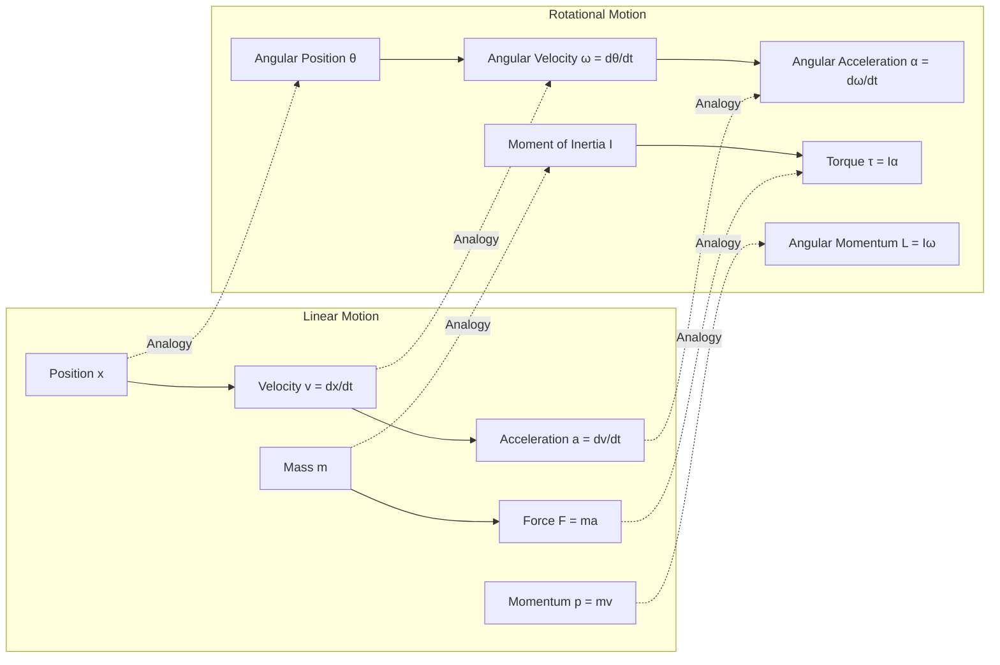

<!-- Custom styles are now loaded via main.scss -->

  <h1 style="color: white; margin: 0; font-size: 2.5rem;">Newtonian Mechanics &amp; Conservation Laws</h1>
  
Newton's three laws, kinematics and dynamics, work and energy, conservation laws, rotational motion, gravitation and central forces, and a first look at oscillations.

[Classical Mechanics](./) &raquo; Newtonian Mechanics &amp; Conservation Laws

## The Foundation: Newton's Revolution

Before Newton, motion was a mystery. Objects moved, but why? Newton's genius was recognizing that motion follows precise mathematical laws. This section builds the force-based picture from the ground up, in the order it is most naturally learned: first the three laws that define force and inertia, then the kinematics and dynamics they govern, then the conservation laws that act as shortcuts, then the extension from point particles to spinning bodies, and finally gravitation and the central-force problem that crowned Newton's program — with a closing glimpse of oscillations.

## Newton's Laws of Motion

<a href="https://www.gutenberg.org/files/33229/33229-pdf.pdf"> Paper: <b><i>Philosophiæ Naturalis Principia Mathematica</i></b> - Isaac Newton</a>

<a href="https://www.youtube.com/watch?v=kKKM8Y-u7ds"> Video: <b><i>Newton's Laws of Motion Explained</i></b></a>

The foundation of classical mechanics is built upon Newton's three laws of motion:

<a href="https://en.wikipedia.org/wiki/Newton%27s_laws_of_motion"> Article: <b><i>Newton's Laws of Motion - Wikipedia</i></b></a>

### First Law (Law of Inertia)
An object at rest stays at rest and an object in motion stays in motion with the same speed and in the same direction unless acted upon by an unbalanced force.

**Mathematical Expression:**
$$\text{If } \sum \vec{F} = 0, \text{ then } \vec{v} = \text{constant}$$

The first law is more than a special case of the second — it asserts the existence of **inertial reference frames** in which it holds, the privileged frames against which all of Newtonian mechanics is written.

### Second Law (Law of Acceleration)

The acceleration of an object is directly proportional to the net force acting on it and inversely proportional to its mass.

**Mathematical Expression:**
$$\vec{F} = m\vec{a}$$
Where:
- $\vec{F}$ = net force (N)
- $m$ = mass (kg)
- $\vec{a}$ = acceleration (m/s²)

In its more fundamental form the second law equates force with the rate of change of momentum, $\vec{F} = d\vec{p}/dt$, which reduces to $m\vec{a}$ for constant mass and remains correct for systems that gain or lose mass (rockets).

### Third Law (Action-Reaction)
For every action, there is an equal and opposite reaction.

**Mathematical Expression:**
$$\vec{F}_{12} = -\vec{F}_{21}$$

The third law is exactly what makes the *total* momentum of an isolated system conserved: internal force pairs cancel, so only external forces can change the system's momentum.

### Why Newton's Laws Matter

These three simple laws explain an incredible range of phenomena:
- Why you lurch forward when a car brakes suddenly (First Law)
- How rockets work in the vacuum of space (Third Law)
- Why heavier objects don't fall faster (Second Law with gravity)

But as powerful as Newton's laws are, they have a limitation: you need to know all the forces. What if the forces are complicated? What if you don't care about forces at all, just motion? That question motivates the energy methods and conservation laws below, and ultimately the analytical [Lagrangian and Hamiltonian](lagrangian-hamiltonian.html) reformulations.

## Kinematics: Describing Motion

### From Observation to Mathematics

Now that we have defined force through Newton's laws, let's look at motion itself. How do we describe where things are and how fast they're moving? This is kinematics — the language of motion.

Kinematics describes motion without asking "why?" — that's dynamics. It's like studying the choreography of a dance without worrying about the muscles involved.

### One-Dimensional Motion

**Position:** $x(t)$

**Velocity:** $v = \dfrac{dx}{dt}$

**Acceleration:** $a = \dfrac{dv}{dt} = \dfrac{d^2x}{dt^2}$

### Equations of Motion (Constant Acceleration)
1. $v = v_0 + at$
2. $x = x_0 + v_0 t + \tfrac{1}{2}at^2$
3. $v^2 = v_0^2 + 2a(x - x_0)$
4. $x = x_0 + \tfrac{1}{2}(v + v_0)t$

### Projectile Motion

<a href="https://phet.colorado.edu/en/simulations/projectile-motion"> Interactive: <b><i>Projectile Motion Simulator</i></b> - PhET</a>

For projectile motion under constant gravitational acceleration:

**Horizontal Motion:**
$$\begin{aligned}
x &= v_{0x}\,t \\
v_x &= v_{0x} \quad (\text{constant})
\end{aligned}$$

**Vertical Motion:**
$$\begin{aligned}
y &= v_{0y}\,t - \tfrac{1}{2}gt^2 \\
v_y &= v_{0y} - gt
\end{aligned}$$

**Range Formula:**
$$R = \frac{v_0^2 \sin(2\theta)}{g}$$

**Maximum Height:**
$$H = \frac{v_0^2 \sin^2\theta}{2g}$$

## Dynamics: Forces in Action

### Connecting Force to Motion

While kinematics describes motion, dynamics explains it. This is where Newton's second law ($F = ma$) becomes our primary tool. But as we'll see, thinking in terms of energy often provides a more elegant approach — and leads directly to the conservation laws of the next section.

### Work and Energy

**Work:** The energy transferred to or from an object via the application of force along a displacement.

$$W = \vec{F}\cdot\vec{d} = Fd\cos\theta$$

For variable force:
$$W = \int \vec{F}\cdot d\vec{r}$$

The **work–energy theorem** ties this directly back to kinematics: the net work done on a particle equals its change in kinetic energy,

$$W_{\text{net}} = \Delta KE = \tfrac{1}{2}mv_f^2 - \tfrac{1}{2}mv_i^2.$$

### Power

Power is the rate at which work is done:

$$P = \frac{dW}{dt} = \vec{F}\cdot\vec{v}$$

### Conservative Forces and Potential Energy

A force is **conservative** if the work it does is independent of the path — equivalently, if it can be written as the gradient of a potential energy, $\vec{F} = -\nabla U$. Gravity near the surface ($U = mgh$) and an ideal spring ($U = \tfrac{1}{2}kx^2$) are the archetypes. For conservative forces the work–energy theorem becomes the statement that mechanical energy is conserved, the bridge to the next section.

## Conservation Laws: Nature's Hidden Symmetries

<a href="https://www.feynmanlectures.caltech.edu/I_04.html"> Lecture: <b><i>Conservation of Energy - Feynman Lectures</i></b></a>

Here's where physics gets elegant. Instead of tracking forces at every instant, we can use conservation laws — quantities that remain constant throughout motion. It's like having a bank account that never changes its total balance, even as money moves between checking and savings.

These conservation laws aren't arbitrary; they reflect deep symmetries in nature:

<b>Click to expand: Interactive Conservation Laws Demonstration</b>

 

Conservation laws are fundamental principles that remain constant in isolated systems:

<ul>
<li><b>Energy Conservation:</b> Total energy (kinetic + potential) remains constant</li>
<li><b>Momentum Conservation:</b> Total momentum is conserved in collisions</li>
<li><b>Angular Momentum Conservation:</b> Rotational momentum is preserved</li>
</ul>

<a href="https://phet.colorado.edu/en/simulation/energy-skate-park"> Interactive: <b><i>Energy Skate Park Simulation</i></b></a>

### Conservation of Energy
The total energy of an isolated system remains constant over time.

**Types of Energy:**
- **Kinetic Energy**: $KE = \tfrac{1}{2}mv^2$
- **Potential Energy**: $PE = mgh$ (gravitational)
- **Elastic Potential Energy**: $PE = \tfrac{1}{2}kx^2$

**Conservation Equation:**
$$\begin{aligned}
E_{\text{initial}} &= E_{\text{final}} \\
KE_i + PE_i &= KE_f + PE_f
\end{aligned}$$

### Conservation of Momentum

<a href="https://www.physicsclassroom.com/class/momentum/Lesson-2/Momentum-Conservation-Principle"> Tutorial: <b><i>Momentum Conservation in Collisions</i></b></a>

The total momentum of an isolated system remains constant.

**Linear Momentum:**
$$\vec{p} = m\vec{v}$$

**Conservation Equation:**
$$\sum \vec{p}_{\text{initial}} = \sum \vec{p}_{\text{final}}$$

This follows directly from Newton's third law: internal forces cancel in pairs, so in the absence of external forces the system's total momentum cannot change. Momentum conservation is the master tool for analyzing collisions, recoil, and rocket propulsion.

### Conservation of Angular Momentum
The total angular momentum of an isolated system remains constant.

**Angular Momentum:**
$$\vec{L} = I\vec{\omega} = \vec{r} \times \vec{p}$$

Where:
- $I$ = moment of inertia
- $\vec{\omega}$ = angular velocity
- $\vec{r}$ = position vector
- $\vec{p}$ = linear momentum

(The rotational quantities $I$ and $\vec{\omega}$ are developed in the next section; we list angular momentum here to keep the three conservation laws together.)

These conservation laws are not coincidences; each reflects a symmetry of nature — a connection made precise by Noether's theorem in the [Lagrangian and Hamiltonian](lagrangian-hamiltonian.html) formulation. Energy conservation reflects symmetry under translation in *time*, linear momentum reflects symmetry under translation in *space*, and angular momentum reflects symmetry under *rotation*.

### The Power of Conservation

Conservation laws often provide shortcuts to solving problems. Consider a figure skater spinning: when she pulls her arms in, she spins faster. Why? Angular momentum ($L = I\omega$) must stay constant. Decreasing $I$ (moment of inertia) means $\omega$ (angular velocity) must increase. No forces needed — just conservation!

But even conservation laws have limitations when dealing with constraints and complex systems. This motivates the analytical formulations of Lagrange and Hamilton.

## Rotational Motion: Beyond Point Particles

### Why Rotation Matters

So far, we've treated objects as point particles. But real objects have size and shape. They can spin, roll, and tumble. This adds richness to mechanics — and complexity.

The beautiful discovery: rotational motion follows the same patterns as linear motion, just with different quantities:

<b>Mermaid Diagram: Linear vs Rotational Motion Analogy</b>

 

### Rotational Kinematics

Analogous to linear motion:
- Angular position: θ
- Angular velocity: ω = dθ/dt
- Angular acceleration: α = dω/dt

### Moment of Inertia

<a href="https://hyperphysics.phy-astr.gsu.edu/hbase/mi.html"> Reference: <b><i>Moment of Inertia Tables</i></b></a>

The rotational equivalent of mass:

**Point Mass:**
$$I = mr^2$$

**Common Shapes:**
- Solid sphere: $I = \tfrac{2}{5}MR^2$
- Solid cylinder: $I = \tfrac{1}{2}MR^2$
- Thin rod (about center): $I = \tfrac{1}{12}ML^2$

### Torque

The rotational equivalent of force:

$$
\tau = r \times F = rF \sin(\theta)
$$

**Rotational Newton's Second Law:**
$$
\tau = I\alpha
$$

Just as $\vec{F} = d\vec{p}/dt$ for translation, the rotational law in its general form is $\vec{\tau} = d\vec{L}/dt$: a torque is the rate of change of angular momentum, and zero net torque means angular momentum is conserved — the spinning-skater result above.

For a full treatment of three-dimensional rotation — the inertia tensor, Euler's equations, gyroscopic precession, and rigid bodies — see [Rigid Body Dynamics](rigid-body-dynamics.html).

## Gravitation and Central Forces: The First Unified Theory

### From Falling Apples to Orbiting Planets

Newton's greatest triumph wasn't just explaining how things move — it was recognizing that the force pulling an apple to Earth is the same force keeping the Moon in orbit. This was humanity's first "unified theory," connecting terrestrial and celestial mechanics. Because gravitation is a *central* force, the rotational machinery just developed — angular momentum and torque — is exactly what makes it tractable.

### Newton's Law of Universal Gravitation

<a href="https://www.wilbourhall.org/pdfs/NewtonPrincipia.pdf"> Paper: <b><i>Principia - Book III: The System of the World</i></b></a>

<a href="https://www.physicsclassroom.com/class/circles/Lesson-3/Newton-s-Law-of-Universal-Gravitation"> Tutorial: <b><i>Understanding Universal Gravitation</i></b></a>

Every particle attracts every other particle with a force:

$$
F = \frac{Gm_1m_2}{r^2}
$$

Where:
- G = 6.674 × 10⁻¹¹ N·m²/kg² (gravitational constant)
- m₁, m₂ = masses of the objects
- r = distance between centers

### Orbital Motion

For circular orbits:

**Orbital Velocity:**
$$
v = \sqrt{\frac{GM}{r}}
$$

**Orbital Period:**
$$
T = 2\pi\sqrt{\frac{r^3}{GM}}
$$

This is Kepler's Third Law for circular orbits.

### The Effective Potential: Reducing Orbits to One Dimension

Real orbits are rarely circular. The deeper insight is that any motion in a central force $-\dfrac{GMm}{r^2}\hat{r}$ conserves angular momentum $L = mr^2\dot{\phi}$ — the conservation law from the previous section, applied to a torque-free central force — and that single fact lets us collapse a two-dimensional orbit into an equivalent one-dimensional problem in the radius alone. Substituting $\dot{\phi} = L/(mr^2)$ into the energy gives:

$$E = \tfrac{1}{2}m\dot{r}^2 + V_{\text{eff}}(r), \qquad V_{\text{eff}}(r) = -\frac{GMm}{r} + \frac{L^2}{2mr^2}$$

The first term is the genuine gravitational attraction; the second is the **centrifugal barrier** — a repulsive contribution that arises purely from angular momentum and keeps the orbit from collapsing to the center. A particle now behaves like a bead rolling in the one-dimensional landscape $V_{\text{eff}}(r)$:

| Total energy $E$ | Shape of orbit |
|------------------|----------------|
| $E < 0$, at minimum of $V_{\text{eff}}$ | Circular |
| $E < 0$, above minimum | Ellipse (bound) |
| $E = 0$ | Parabola (escape, marginally unbound) |
| $E > 0$ | Hyperbola (unbound flyby) |

This single picture unifies planets, comets, and interstellar flybys, and it reproduces all of Kepler's laws. It is also the template for the radial Schrödinger equation of the hydrogen atom, where the same $-1/r$ attraction and $L^2/2mr^2$ barrier reappear — a preview of how classical structure carries into quantum mechanics.

## A First Look at Oscillations

Whenever a system sits near a stable equilibrium, a small displacement produces a restoring force, and the system oscillates. The simplest case is **Hooke's law**, $F = -kx$, which gives **simple harmonic motion**:

$$x(t) = A\cos(\omega t + \varphi), \qquad \omega = \sqrt{\frac{k}{m}}, \qquad T = \frac{2\pi}{\omega} = 2\pi\sqrt{\frac{m}{k}}.$$

Here $A$ is the amplitude and $\varphi$ the phase. Because *any* smooth potential looks quadratic near a minimum, the harmonic oscillator is the universal lowest-order description of small motions — which is why it reappears throughout physics, from molecular vibrations to quantum field theory.

This is only the entry point. The full development — energy in oscillation, damped and driven (resonant) oscillators, coupled oscillators and normal modes, the chain-to-continuum limit, the wave equation, standing versus traveling waves, dispersion and group velocity, Fourier decomposition, and nonlinear waves and solitons — now lives on its own page:

➡️ **[Oscillations &amp; Waves](waves.html)** — the complete treatment, from one mass on a spring all the way to solitons.

---

## Continue

| Previous | Next |
|----------|------|
| [Classical Mechanics Hub](./) | [Oscillations &amp; Waves &rarr;](waves.html) |

## See Also

- [Oscillations &amp; Waves](waves.html) — the full development of harmonic motion, normal modes, the wave equation, and nonlinear waves that this page only introduces.
- [Rigid Body Dynamics](rigid-body-dynamics.html) — three-dimensional rotation: the inertia tensor, Euler's equations, and gyroscopic motion.
- [Lagrangian &amp; Hamiltonian Mechanics](lagrangian-hamiltonian.html) — the energy-based reformulation that handles constraints and reveals symmetries via Noether's theorem.
- [Chaos, Modern Topics &amp; Computation](chaos-and-computational.html) — where deterministic Newtonian systems become unpredictable.
- [Computational Physics](../computational-physics/) — numerical integration of equations of motion.
