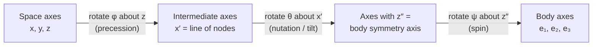

[Classical Mechanics](./) &raquo; Rigid Body Dynamics

A **rigid body** is a system of particles whose mutual distances are fixed. Its configuration is specified by six numbers: three for the position of a reference point (usually the center of mass) and three for the orientation. The center of mass obeys $\vec{F}_{\text{ext}} = M\ddot{\vec{R}}_{\text{cm}}$, as in [Newtonian mechanics](newtonian.html#linear-momentum-and-the-center-of-mass); this page is about the other three, the rotational degrees of freedom. It covers the inertia tensor and principal axes, Euler's equations, orientation coordinates (Euler angles and quaternions), the free and heavy symmetric tops, the stability of free rotation, and rolling constraints.

The key fact is that for a rotating body the angular velocity $\vec{\omega}$ and the angular momentum $\vec{L}$ are in general **not parallel**. They are related by a $3\times3$ matrix, the inertia tensor. The wobble of a thrown book, the precession of a gyroscope, and the tumbling of a satellite all follow from this.

<p class="referenceBoxes type3"><a href="https://en.wikipedia.org/wiki/Rigid_body_dynamics"> Article: <b><i>Rigid Body Dynamics - Wikipedia</i></b></a></p>
<p class="referenceBoxes type3"><a href="https://www.youtube.com/watch?v=1VPfZ_XzisU"> Video: <b><i>The Bizarre Behavior of Rotating Bodies (Dzhanibekov Effect)</i></b></a></p>

## Space and Body Frames

Every rigid-body problem juggles two reference frames sharing the same origin (taken at the center of mass or a fixed pivot):

- The **space frame** (inertial, lab fixed): where Newton's laws hold and where $d\vec{L}/dt = \vec{\tau}$ is true.
- The **body frame** (rotating, glued to the object): where the mass distribution — and therefore the inertia tensor — is *constant in time*.

A vector $\vec{A}$ has time derivatives in the two frames related by the kinematic transport equation, the foundation for everything that follows:

$$\left(\frac{d\vec{A}}{dt}\right)_{\text{space}} = \left(\frac{d\vec{A}}{dt}\right)_{\text{body}} + \vec{\omega} \times \vec{A}$$

The strategy throughout is: write the *physics* (torque = rate of change of $\vec{L}$) in the space frame, but evaluate the *inertia* in the body frame where it is constant, and bridge the two with this equation.

## The Moment-of-Inertia Tensor

### Why a Single Number Is Not Enough

For rotation about a *fixed axis*, the elementary $L = I\omega$ of the Newtonian chapter is all you need: $I = \sum_i m_i r_{\perp i}^2$ is a single scalar. But a freely tumbling body has no fixed axis. The angular momentum of a collection of particles is

$$\vec{L} = \sum_i m_i\, \vec{r}_i \times \vec{v}_i = \sum_i m_i\, \vec{r}_i \times (\vec{\omega} \times \vec{r}_i).$$

Expanding the double cross product with $\vec{a}\times(\vec{b}\times\vec{c}) = \vec{b}(\vec{a}\cdot\vec{c}) - \vec{c}(\vec{a}\cdot\vec{b})$ gives $\vec{L} = \sum_i m_i\left[ r_i^2\,\vec{\omega} - \vec{r}_i(\vec{r}_i\cdot\vec{\omega})\right]$. This is **linear** in $\vec{\omega}$, but the second term mixes the components: $L_x$ depends not only on $\omega_x$ but on $\omega_y$ and $\omega_z$ too. The proportionality "constant" is therefore a $3\times 3$ matrix, the **inertia tensor** $\mathbf{I}$:

$$\vec{L} = \mathbf{I}\,\vec{\omega}, \qquad \mathbf{I} = \begin{pmatrix} I_{xx} & I_{xy} & I_{xz} \\ I_{yx} & I_{yy} & I_{yz} \\ I_{zx} & I_{zy} & I_{zz} \end{pmatrix}.$$

### Components of the Tensor

For a continuous body of density $\rho(\vec{r})$, the diagonal **moments of inertia** and off-diagonal **products of inertia** are

$$I_{xx} = \int \rho\,(y^2 + z^2)\,dV, \qquad I_{xy} = I_{yx} = -\int \rho\,xy\,dV,$$

with the other components following by cyclic permutation. Compactly, with $\delta_{jk}$ the Kronecker delta and indices running over $x, y, z$,

$$I_{jk} = \int \rho\,\bigl(r^2\delta_{jk} - x_j x_k\bigr)\,dV.$$

The tensor is **real and symmetric** ($I_{jk} = I_{kj}$), so it can be diagonalized by a rotation and its eigenvalues are real. It is also positive semi-definite, and its eigenvalues satisfy the triangle inequalities $I_1 + I_2 \ge I_3$ (and permutations), with equality only for a flat lamina.

### Rotational Kinetic Energy

The same tensor governs energy. Summing $\tfrac{1}{2}m_i v_i^2$ with $\vec{v}_i = \vec{\omega}\times\vec{r}_i$ yields a clean quadratic form:

$$T_{\text{rot}} = \tfrac{1}{2}\,\vec{\omega}^{\mathsf{T}}\,\mathbf{I}\,\vec{\omega} = \tfrac{1}{2}\,\vec{\omega}\cdot\vec{L}.$$

Note that $T_{\text{rot}} = \tfrac{1}{2}\vec{\omega}\cdot\vec{L}$ is *not* $\tfrac{1}{2}L^2/I$ in general, precisely because $\vec{L}$ and $\vec{\omega}$ are not parallel.

### Two Indispensable Theorems

**Parallel-axis (Steiner) theorem.** The inertia tensor about any point $P$ displaced by $\vec{d}$ from the center of mass is

$$I^{(P)}_{jk} = I^{(\text{cm})}_{jk} + M\bigl(d^2\delta_{jk} - d_j d_k\bigr).$$

This lets you tabulate inertia about the center of mass once, then shift to any pivot.

**Perpendicular-axis theorem (for flat laminae in the $xy$-plane):** $I_{zz} = I_{xx} + I_{yy}$, because every mass element has $z = 0$.

Principal moments of some uniform bodies of mass $M$ about their centers of mass:

| Body | Principal moments | Classification |
|------|-------------------|----------------|
| Solid sphere, radius $R$ | $I_1 = I_2 = I_3 = \tfrac{2}{5}MR^2$ | Spherical top |
| Solid cube, side $a$ | $I_1 = I_2 = I_3 = \tfrac{1}{6}Ma^2$ | Spherical top |
| Solid cylinder, radius $R$, length $h$ | $I_3 = \tfrac{1}{2}MR^2$ (axis); $I_1 = I_2 = \tfrac{1}{4}MR^2 + \tfrac{1}{12}Mh^2$ | Symmetric top |
| Thin disk, radius $R$ | $I_3 = \tfrac{1}{2}MR^2$; $I_1 = I_2 = \tfrac{1}{4}MR^2$ | Symmetric top (oblate) |
| Rectangular box, sides $a, b, c$ | $\tfrac{1}{12}M(b^2 + c^2)$, $\tfrac{1}{12}M(a^2 + c^2)$, $\tfrac{1}{12}M(a^2 + b^2)$ | Asymmetric top if $a, b, c$ distinct |

## Principal Axes

### Diagonalizing the Tensor

Because $\mathbf{I}$ is real and symmetric, there exists an orthonormal set of body-fixed axes — the **principal axes** $\hat{e}_1, \hat{e}_2, \hat{e}_3$ — in which the tensor is diagonal:

$$\mathbf{I} = \begin{pmatrix} I_1 & 0 & 0 \\ 0 & I_2 & 0 \\ 0 & 0 & I_3 \end{pmatrix}.$$

The eigenvalues $I_1, I_2, I_3$ are the **principal moments of inertia**, and the eigenvectors are the principal axes. In this frame the messy vector relation collapses to three decoupled scalar equations:

$$L_1 = I_1\omega_1, \qquad L_2 = I_2\omega_2, \qquad L_3 = I_3\omega_3.$$

The geometric meaning is sharp: **$\vec{L}$ is parallel to $\vec{\omega}$ if and only if the body spins about a principal axis.** Spin about any other direction and the two vectors splay apart, which is the seed of every wobble and precession.

### Symmetry Finds the Axes for You

You rarely diagonalize a matrix by hand. Any axis of geometric symmetry is automatically a principal axis, and any plane of symmetry contains two of them. A cube about its center has $I_1 = I_2 = I_3$ (a "spherical top"); a cylinder or any body of revolution has $I_1 = I_2 \neq I_3$ (a "symmetric top"); a generic brick has all three distinct (an "asymmetric top"). This classification drives the rest of the chapter.

**The inertia ellipsoid.** Plotting $\vec{\omega}^{\mathsf{T}}\mathbf{I}\,\vec{\omega} = 1$ traces an ellipsoid whose semi-axes lie along the principal axes with lengths $1/\sqrt{I_k}$. Poinsot showed that torque-free motion is exactly this ellipsoid rolling without slipping on a fixed plane (the "invariable plane" perpendicular to the conserved $\vec{L}$) — a purely geometric picture of free rotation.

## Euler's Equations of Motion

### Torque in the Rotating Frame

The physical law is $\vec{\tau} = (d\vec{L}/dt)_{\text{space}}$. But $\mathbf{I}$ is only constant in the body frame, so we apply the transport equation to $\vec{L}$:

$$\vec{\tau} = \left(\frac{d\vec{L}}{dt}\right)_{\text{body}} + \vec{\omega}\times\vec{L}.$$

Resolving along the principal axes (where $L_k = I_k\omega_k$ and the $I_k$ are constants) gives **Euler's equations**, the rotational analogue of $\vec{F}=m\vec{a}$ for a rigid body:

$$\begin{aligned}
I_1\dot{\omega}_1 + (I_3 - I_2)\,\omega_2\omega_3 &= \tau_1, \\
I_2\dot{\omega}_2 + (I_1 - I_3)\,\omega_3\omega_1 &= \tau_2, \\
I_3\dot{\omega}_3 + (I_2 - I_1)\,\omega_1\omega_2 &= \tau_3.
\end{aligned}$$

The nonlinear cross terms — present even with zero torque — are the entire source of the rich, sometimes counterintuitive, dynamics. Notice they vanish when two of the moments are equal or when motion is purely about one principal axis.

<p class="referenceBoxes type3"><a href="https://en.wikipedia.org/wiki/Euler%27s_equations_(rigid_body_dynamics)"> Article: <b><i>Euler's Equations (Rigid Body Dynamics) - Wikipedia</i></b></a></p>

### The Two Conserved Quantities of Free Motion

For torque-free motion ($\vec{\tau}=0$) two scalars are conserved and tightly constrain the dynamics:

$$L^2 = I_1^2\omega_1^2 + I_2^2\omega_2^2 + I_3^2\omega_3^2 = \text{const}, \qquad 2T = I_1\omega_1^2 + I_2\omega_2^2 + I_3\omega_3^2 = \text{const}.$$

Viewed in body coordinates, the angular-momentum vector $\vec{L} = (I_1\omega_1, I_2\omega_2, I_3\omega_3)$ must therefore lie on both a sphere of radius $L$ and the energy ellipsoid $L_1^2/I_1 + L_2^2/I_2 + L_3^2/I_3 = 2T$. Its tip moves along their intersection curves. (The corresponding curves traced by $\vec{\omega}$ on the inertia ellipsoid are Poinsot's **polhodes**.) The shape of these curves near each principal axis decides which rotations are stable, as shown in the tennis-racket theorem below.

## Euler Angles: Parametrizing Orientation

### Three Angles, Three Rotations

Orientation needs three independent numbers. The classical choice in physics is the **Euler angles** $(\phi, \theta, \psi)$ in the $z$-$x$-$z$ convention, built from three successive rotations:



1. Rotate by $\phi$ about the space $z$-axis (**precession**).
2. Rotate by $\theta$ about the new $x$-axis, the *line of nodes* (**nutation**).
3. Rotate by $\psi$ about the new $z$-axis, the body symmetry axis (**spin**).

There are twelve possible axis sequences. Aerospace and robotics usually use the $z$-$y$-$x$ sequence of **yaw, pitch, and roll** (Tait-Bryan angles), so always check which convention a formula or library assumes.

<p class="referenceBoxes type3"><a href="https://en.wikipedia.org/wiki/Euler_angles"> Article: <b><i>Euler Angles - Wikipedia</i></b></a></p>

### Angular Velocity in Euler Angles

The three angular rates $\dot\phi, \dot\theta, \dot\psi$ are about axes that are not mutually orthogonal. Resolving $\vec{\omega}$ onto the body axes gives, for any rigid body,

$$\begin{aligned}
\omega_1 &= \dot\phi\sin\theta\sin\psi + \dot\theta\cos\psi, \\
\omega_2 &= \dot\phi\sin\theta\cos\psi - \dot\theta\sin\psi, \\
\omega_3 &= \dot\phi\cos\theta + \dot\psi.
\end{aligned}$$

These plug into the Lagrangian $L = T_{\text{rot}} - V$ and make heavy-top problems tractable in the [Lagrangian formulation](lagrangian-hamiltonian.html), where the cyclic coordinates $\phi$ and $\psi$ immediately hand you two conserved momenta.

**Gimbal lock.** When $\theta = 0$, the precession and spin axes coincide and only the sum $\phi + \psi$ is defined, so the parametrization is singular. Every three-parameter description of orientation has such a singularity somewhere, because the rotation group $SO(3)$ cannot be covered by a single chart of three coordinates. Euler angles remain the best choice for analytic work on tops.

### Quaternions and Rotation Matrices

Numerical code in aerospace, robotics, and graphics represents orientation without singularities, either as a $3\times3$ rotation matrix $\mathbf{R}$ (nine numbers with six orthonormality constraints) or as a **unit quaternion** $q = (\cos\tfrac{\alpha}{2},\ \hat{n}\sin\tfrac{\alpha}{2})$ for a rotation by angle $\alpha$ about axis $\hat{n}$. Quaternions use four numbers with one constraint, compose by quaternion multiplication, and interpolate smoothly (spherical linear interpolation, "slerp"). Both $q$ and $-q$ represent the same rotation. With $\vec{\omega}$ expressed in the body frame, the orientation evolves as

$$
\dot{\mathbf{R}} = \mathbf{R}\,[\vec{\omega}]_\times, \qquad \dot{q} = \tfrac{1}{2}\,q \otimes (0, \vec{\omega}),
$$

where $[\vec{\omega}]_\times$ is the antisymmetric matrix with $[\vec{\omega}]_\times\vec{v} = \vec{\omega}\times\vec{v}$. Numerical integrators renormalize $q$ (or re-orthogonalize $\mathbf{R}$) periodically to remove drift, or use Lie-group integrators that stay on the rotation group exactly. SciPy's `scipy.spatial.transform.Rotation` converts between all of these representations.

## The Symmetric Top

### Free Symmetric Top: Steady Precession

Take a torque-free symmetric body, $I_1 = I_2 \equiv I_\perp$ and $I_3$ the symmetry axis. The third Euler equation gives $I_3\dot\omega_3 = 0$, so the spin component $\omega_3$ along the symmetry axis is *constant*. The remaining two equations become a simple linear oscillator:

$$\dot\omega_1 = -\Omega\,\omega_2, \qquad \dot\omega_2 = +\Omega\,\omega_1, \qquad \Omega \equiv \frac{(I_3 - I_\perp)}{I_\perp}\,\omega_3.$$

So $(\omega_1, \omega_2)$ rotates in a circle at angular rate $\Omega$: **in the body frame, $\vec\omega$ traces a cone about the symmetry axis** (the *body cone*). Viewed from space, the symmetry axis and $\vec\omega$ both precess around the fixed $\vec{L}$ (the *space cone*) at rate $L/I_\perp$. This **free precession** is the wobble of a badly thrown frisbee or American football.

For Earth, which is slightly oblate with $(I_3 - I_\perp)/I_\perp \approx 1/305$, the rigid-body formula predicts a free wobble of the rotation axis with a period of about 305 days (the Euler period). The observed wobble, discovered by S. C. Chandler in 1891, has a period of about 433 days; the difference comes from the elasticity of the Earth and the response of its oceans and fluid core. The **Chandler wobble** moves the pole by several meters at the surface and needs continual excitation by atmospheric and oceanic fluctuations to persist. Its amplitude has dropped sharply since about 2015, to the point that recent polar-motion analyses (Yamaguchi and Furuya, 2024; Jeon and colleagues, 2025) find it nearly absent, with the annual wobble now dominating. The cause is still being investigated.

### Heavy Symmetric Top: Precession and Nutation

Now stand the top on a fixed pivot under gravity — the classic spinning top or gyroscope. Gravity exerts torque $\vec\tau = \vec{r}_{\text{cm}}\times M\vec{g}$, perpendicular to both the symmetry axis and the vertical. Using the Lagrangian in Euler angles, $\phi$ and $\psi$ are cyclic, yielding two conserved momenta $p_\phi$ and $p_\psi$ plus energy. The tilt angle $\theta$ then obeys a one-dimensional effective-potential problem identical in spirit to the orbital problem of the [Newtonian chapter](newtonian.html):

$$E' = \tfrac{1}{2}I_\perp\dot\theta^2 + V_{\text{eff}}(\theta), \qquad V_{\text{eff}}(\theta) = \frac{(p_\phi - p_\psi\cos\theta)^2}{2 I_\perp\sin^2\theta} + Mg\ell\cos\theta.$$

The motion splits into two pieces:

- **Precession** — the slow circling of the symmetry axis about the vertical at rate $\dot\phi$. For a *fast* top, the steady precession rate is approximately $\dot\phi \approx Mg\ell/(I_3\omega_3)$: spin faster and the top precesses *slower*.
- **Nutation** — a superimposed nodding of $\theta$ between two turning points where $\dot\theta = 0$, as the axis bobs up and down while precessing.

Whether you see a smooth precession, a cusped trochoidal path, or looping nutation depends entirely on the initial release conditions, all encoded in $V_{\text{eff}}(\theta)$.

<p class="referenceBoxes type3"><a href="https://en.wikipedia.org/wiki/Precession"> Article: <b><i>Precession - Wikipedia</i></b></a></p>
<p class="referenceBoxes type3"><a href="https://www.youtube.com/watch?v=ty9QSiVC2g0"> Video: <b><i>Gyroscopic Precession Explained</i></b></a></p>

### The Intuition Behind Gyroscopic Precession

Why does a gyroscope defy gravity and circle instead of toppling? Because $\vec\tau = d\vec{L}/dt$ is a *vector* equation. Gravity's torque is horizontal and perpendicular to $\vec{L}$, so it does not change $\vec L$'s magnitude — it only swings its direction sideways. The tip of $\vec L$ chases the torque around a circle. The faster the spin (larger $\vec L$), the smaller the *fractional* change $d\vec L/L$ a given torque produces, hence the slower precession. This is the same physics that keeps a bicycle upright and makes the equinoxes precess over 26,000 years as the Sun and Moon torque Earth's equatorial bulge.

## The Asymmetric Top and the Tennis-Racket Theorem

### Stability of Free Rotation

When all three moments differ ($I_1 < I_2 < I_3$), the cross terms in Euler's equations never vanish and the dynamics is genuinely nonlinear. The key question: spin the body about a principal axis and give it a tiny nudge — does it keep spinning steadily or tumble? Linearizing Euler's torque-free equations about steady rotation $\vec\omega = \omega\hat{e}_k$ gives the small-perturbation growth rate. The algebra delivers a clean verdict:

| Spin axis | Moment | Stability |
|-----------|--------|-----------|
| Smallest moment $I_1$ | minimum | **Stable** (oscillatory) |
| Largest moment $I_3$ | maximum | **Stable** (oscillatory) |
| Intermediate moment $I_2$ | middle | **Unstable** (exponential growth) |

### The Tennis-Racket (Intermediate Axis) Theorem

Rotation about the axis of **largest or smallest** moment of inertia is stable; rotation about the **intermediate** axis is unstable. A tennis racket, book, or phone tossed with spin about its intermediate axis makes a half-turn flip about another axis on each cycle. The result was known to Poinsot (1834) and appears in standard textbooks. It is also called the **Dzhanibekov effect** after the cosmonaut who filmed a wing nut flipping periodically in orbit in 1985.

The geometric explanation is the polhode picture from earlier: on the intersection of the energy ellipsoid and the angular-momentum sphere, the curves near the intermediate axis are *hyperbolic* (saddle-like), so the tip of $\vec\omega$ races away along the unstable manifold and back, producing the periodic flips. Near the extreme axes the curves are small closed loops, so the spin merely jitters.

**Worked example — stability of the spinning book.** Consider a thin rectangular book with principal moments $I_1 < I_2 < I_3$, thrown with zero external torque so Euler's equations are homogeneous. Spin it primarily about axis 1 with a small wobble: $\omega_1 \approx \omega_0$ (large, nearly constant) and $\omega_2, \omega_3$ tiny. Drop the products of the small quantities and use $\dot\omega_1 \approx 0$:

$$I_2\dot\omega_2 = (I_3 - I_1)\,\omega_3\omega_0, \qquad I_3\dot\omega_3 = (I_1 - I_2)\,\omega_2\omega_0.$$

Differentiate the first and substitute the second to decouple them:

$$\ddot\omega_2 = \frac{(I_3 - I_1)(I_1 - I_2)}{I_2 I_3}\,\omega_0^2\,\omega_2 \equiv -\lambda\,\omega_2.$$

With $I_1$ the *smallest* moment, $(I_3 - I_1) > 0$ and $(I_1 - I_2) < 0$, so $\lambda > 0$: solutions are $\omega_2 \propto \cos(\sqrt{\lambda}\,t)$ — bounded oscillation, hence **stable**. The largest axis $I_3$ gives the same stable sign. But about the *intermediate* axis $I_2$, both factors $(I_2 - I_3)$ and $(I_1 - I_2)$ are negative, their product positive, and the coefficient flips sign to give $\ddot\omega \propto +\,\omega$ — exponential growth $\omega \propto e^{\sqrt{|\lambda|}\,t}$. The wobble blows up until the book flips. That sign flip, and nothing more, is the tennis-racket theorem.

### Energy Dissipation and the Major-Axis Rule

The stability of the minimum-moment axis holds only for a perfectly rigid body. Real bodies flex and contain fluids, which dissipate energy while conserving angular momentum. For fixed $L$, the kinetic energy $T = L^2/(2I)$ is lowest for rotation about the axis of **maximum** moment, so dissipation drives any spinning body toward rotation about its major axis. Rotation about the minor axis is only marginally stable, and slowly turns into a tumble.

| Axis | Rigid body | With internal dissipation |
|------|------------|---------------------------|
| Largest moment $I_3$ | Stable | Stable (energy minimum for given $L$) |
| Intermediate moment $I_2$ | Unstable | Unstable |
| Smallest moment $I_1$ | Stable | Unstable (energy maximum for given $L$) |

The first U.S. satellite, **Explorer 1** (1958), demonstrated this. It was designed to spin about its long axis, the axis of minimum moment, but energy dissipation in its flexible wire antennas turned the spin into a precession that grew until the satellite was rotating end over end about its axis of maximum moment. Spin-stabilized spacecraft have since been designed to spin about the major axis, or to use active nutation damping. Some asteroids are still observed tumbling (non-principal-axis rotation), because for small, slowly rotating bodies the damping time can be longer than the time since their spin was last disturbed.
## Rolling Constraints

### Rolling Without Slipping

Many rigid-body problems — a wheel, a ball on a table, a coin spinning to rest — add a **constraint** linking translation and rotation at the contact point. Rolling without slipping demands that the contact point have zero instantaneous velocity:

$$\vec{v}_{\text{contact}} = \vec{v}_{\text{cm}} + \vec\omega\times\vec{r}_{\text{contact}} = 0.$$

For a wheel of radius $R$ this reduces to the familiar $v_{\text{cm}} = R\omega$, with acceleration $a_{\text{cm}} = R\alpha$. The constraint is what lets a ball convert translational into rotational kinetic energy as it rolls down an incline.

### Holonomic vs Nonholonomic Constraints

The distinction matters for which machinery from the [Lagrangian chapter](lagrangian-hamiltonian.html) applies:

- A wheel rolling in a **straight line** has a holonomic constraint — $x = R\phi$ integrates to a relation among coordinates alone, so you can eliminate a coordinate outright.
- A ball or a coin **free to steer** has a *nonholonomic* constraint: the rolling condition links velocities in a way that cannot be integrated to a relation among coordinates. The accessible configuration space is larger than the instantaneous freedom — which is exactly why you can parallel-park a ball into any position and orientation by rolling, and why a coin traces beautiful curves as it spins down. Nonholonomic systems require Lagrange multipliers or the Euler-Lagrange equations with constraint forces, not naive coordinate elimination.

**Worked example — race down the incline.** A solid sphere ($I = \tfrac{2}{5}MR^2$) and a hoop ($I = MR^2$) roll without slipping from rest down a ramp of height $h$. Which wins? Energy conservation splits the released potential energy between translation and rotation, and the rolling constraint $v = R\omega$ ties them together:

$$Mgh = \tfrac{1}{2}Mv^2 + \tfrac{1}{2}I\omega^2 = \tfrac{1}{2}Mv^2\!\left(1 + \frac{I}{MR^2}\right).$$

Solving for the bottom speed, $v = \sqrt{\dfrac{2gh}{1 + I/MR^2}}$. The factor $I/MR^2$ is $\tfrac{2}{5}$ for the sphere and $1$ for the hoop, so the sphere arrives at $v = \sqrt{10gh/7}$ and the hoop at the slower $v = \sqrt{gh}$. The sphere wins, and the answer is independent of mass and radius — only the *shape* (how mass is distributed relative to the axis) decides the race. The hoop loses because it must invest a larger fraction of its energy in spinning its rim.

## Numerical Example: The Free Asymmetric Top

Euler's equations are a clean nonlinear ODE system, well suited to numerical integration (see [Computational Methods](computational-classical-mechanics.html)). The free asymmetric top is a good test bed for watching the tennis-racket flips emerge from the equations themselves:

```python
import numpy as np
from scipy.integrate import solve_ivp

# Principal moments: I1 < I2 < I3  (axis 2 is the unstable intermediate axis)
I1, I2, I3 = 1.0, 2.0, 3.0

def euler_eqs(t, w):
    """Torque-free Euler equations in the principal-axis (body) frame."""
    w1, w2, w3 = w
    dw1 = (I2 - I3) * w2 * w3 / I1
    dw2 = (I3 - I1) * w3 * w1 / I2
    dw3 = (I1 - I2) * w1 * w2 / I3
    return [dw1, dw2, dw3]

# Spin almost purely about the INTERMEDIATE axis, with a tiny perturbation
w0 = [0.01, 1.0, 0.01]
sol = solve_ivp(euler_eqs, [0, 60], w0, rtol=1e-9, atol=1e-12, dense_output=True)

# w2 periodically collapses and reverses sign: the Dzhanibekov flips.
# Conserved checks (should stay constant to integrator tolerance):
w = sol.y
L2 = (I1*w[0])**2 + (I2*w[1])**2 + (I3*w[2])**2   # |L|^2
E  = I1*w[0]**2 + I2*w[1]**2 + I3*w[2]**2          # 2T
print("spread in |L|^2:", L2.max() - L2.min())
print("spread in 2T:   ", E.max() - E.min())
```

Both $|\vec{L}|^2$ and $2T$ stay constant to integrator tolerance, confirming the two conservation laws, while $\omega_2$ periodically reverses sign: each reversal is one flip of the body. A general-purpose integrator conserves these quantities only approximately; over very long runs, a structure-preserving (Lie-Poisson) integrator keeps $|\vec{L}|^2$ exact up to roundoff and the energy error bounded.

## Summary of Results

| Topic | Central result |
|-------|----------------|
| Inertia | $\vec{L} = \mathbf{I}\vec{\omega}$; $\vec{L} \parallel \vec{\omega}$ only about a principal axis |
| Dynamics | Euler's equations $I_1\dot\omega_1 + (I_3 - I_2)\omega_2\omega_3 = \tau_1$ (and cyclic) |
| Free symmetric top | Body-frame precession of $\vec{\omega}$ at $\Omega = (I_3 - I_\perp)\omega_3/I_\perp$ |
| Heavy fast top | Precession rate $\dot\phi \approx Mg\ell/(I_3\omega_3)$, plus nutation |
| Free asymmetric top | Intermediate axis unstable; with dissipation only the major axis is stable |
| Rolling | $\vec{v}_{\text{contact}} = 0$; often nonholonomic |

---

## Continue

| Previous | Next |
|----------|------|
| [&larr; Computational Methods](computational-classical-mechanics.html) | [Thermodynamics &rarr;](../thermodynamics.html) |

## See Also

- [Newtonian Mechanics &amp; Conservation Laws](newtonian.html) — the force-based foundation, fixed-axis $L = I\omega$, torque, and the conservation of angular momentum this chapter generalizes.
- [Lagrangian &amp; Hamiltonian Mechanics](lagrangian-hamiltonian.html) — the energy method that tames the heavy top via Euler angles and cyclic coordinates, and handles rolling constraints with Lagrange multipliers.
- [Chaos &amp; Nonlinear Dynamics](chaos-and-computational.html) — nonlinear dynamics and chaos, including the chaotic tumbling of irregular moons such as Hyperion.
- [Geometric Formalism](geometric-mechanics.html) — symplectic geometry, symmetry and momentum maps, and geometric phases.
- [Classical Mechanics Hub](./) — browse all classical mechanics topics.
