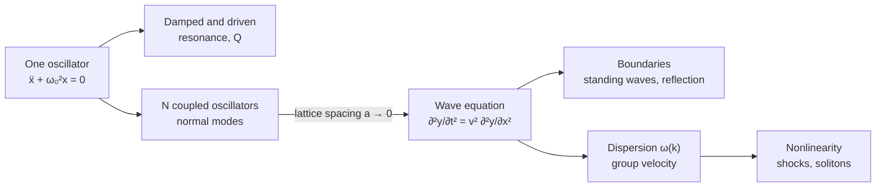

[Classical Mechanics](./) &raquo; Oscillations &amp; Waves

An **oscillation** is periodic motion about a stable equilibrium; a **wave** is a disturbance that propagates through a medium made of many coupled oscillating elements. This page develops both from a single chain of ideas: the harmonic oscillator and its damped and driven forms, coupled oscillators and normal modes, the continuum limit that yields the wave equation, and the phenomena the wave equation supports (standing waves, reflection, dispersion, energy transport, Fourier decomposition). It ends where the small-amplitude approximation fails, with shocks and solitons.



## Why Oscillations Are Universal

Expand any smooth potential $V(x)$ about a stable minimum $x_0$:

$$
V(x) \approx V(x_0) + \tfrac{1}{2}V''(x_0)\,(x - x_0)^2 + \cdots
$$

The linear term vanishes at a minimum, so to lowest order every system near stable equilibrium behaves like a spring with stiffness $k = V''(x_0)$. This is why the harmonic oscillator appears in mechanics, acoustics, electrical circuits, molecular vibrations, and, once quantized, as the basic excitation of every quantum field.

## The Harmonic Oscillator

<p class="referenceBoxes type3"><a href="https://github.com/matplotlib/matplotlib/blob/main/galleries/examples/animation/simple_anim.py"> Code: <b><i>SHM Animation with Matplotlib</i></b></a></p>

A mass $m$ on a spring obeying Hooke's law, $F = -kx$, satisfies

$$
m\ddot{x} + kx = 0 \qquad\Longleftrightarrow\qquad \ddot{x} + \omega_0^2 x = 0, \qquad \omega_0 = \sqrt{\frac{k}{m}}.
$$

The general solution is

$$
x(t) = A\cos(\omega_0 t + \varphi),
$$

where the amplitude $A$ and phase $\varphi$ are fixed by the initial position and velocity, and the angular frequency $\omega_0$ is fixed by the system. The period $T = 2\pi/\omega_0$ is independent of amplitude (**isochronism**), a direct consequence of the linear restoring force. A real pendulum is isochronous only for small swings: its period grows with amplitude, by about 0.2% at $10^\circ$ and 5% at $50^\circ$.

The energy is shared between kinetic and potential forms with a constant total,

$$
E = \tfrac{1}{2}m\dot{x}^2 + \tfrac{1}{2}kx^2 = \tfrac{1}{2}kA^2,
$$

and the time averages over a cycle are equal, $\langle K\rangle = \langle V\rangle = \tfrac{1}{4}kA^2$ (the virial theorem for a quadratic potential).

### Damped Oscillations

A velocity-proportional drag force $-b\dot{x}$ gives the **damped harmonic oscillator**:

$$
\ddot{x} + 2\gamma\dot{x} + \omega_0^2 x = 0, \qquad \gamma = \frac{b}{2m}.
$$

Substituting $x = e^{\lambda t}$ gives characteristic roots $\lambda = -\gamma \pm \sqrt{\gamma^2 - \omega_0^2}$, and three regimes:

| Regime | Condition | Solution | Behavior |
|--------|-----------|----------|----------|
| Underdamped | $\gamma < \omega_0$ | $x = Ae^{-\gamma t}\cos(\omega_d t + \varphi)$, $\omega_d = \sqrt{\omega_0^2 - \gamma^2}$ | Oscillates with exponentially decaying amplitude |
| Critically damped | $\gamma = \omega_0$ | $x = (C_1 + C_2 t)\,e^{-\omega_0 t}$ | Fastest return to equilibrium without overshoot |
| Overdamped | $\gamma > \omega_0$ | Sum of two decaying exponentials | Slow, non-oscillatory return |

Critical damping is the design target for car suspensions, door closers, and analog meter needles.

The **quality factor** $Q = \omega_0/(2\gamma)$ measures how lightly damped an oscillator is. The stored energy decays as $e^{-2\gamma t}$, so $Q$ equals $2\pi$ times the energy stored divided by the energy lost per cycle. Typical values range from about 1 for a car suspension, through $10^3$ to $10^4$ for a tuning fork and $10^4$ to $10^6$ for a quartz crystal, to above $10^{10}$ for superconducting microwave cavities.

### Driven Oscillations and Resonance

A sinusoidal driving force $F_0\cos\omega t$ gives

$$
\ddot{x} + 2\gamma\dot{x} + \omega_0^2 x = \frac{F_0}{m}\cos\omega t.
$$

The general solution is a transient (the damped solution above, which dies away on a time scale $1/\gamma$) plus a steady state at the driving frequency, $x = A(\omega)\cos(\omega t - \delta)$, with

$$
A(\omega) = \frac{F_0/m}{\sqrt{(\omega_0^2 - \omega^2)^2 + 4\gamma^2\omega^2}}, \qquad \tan\delta = \frac{2\gamma\omega}{\omega_0^2 - \omega^2}.
$$

<figure style="text-align:center;margin:1.5em 0">
<svg viewBox="0 0 640 340" role="img" aria-label="Steady-state amplitude of a driven damped oscillator versus driving frequency for quality factors 1, 3 and 10" style="max-width:640px;width:100%;height:auto" xmlns="http://www.w3.org/2000/svg" font-family="sans-serif" font-size="13">
<defs><marker id="arr-res" markerWidth="8" markerHeight="8" refX="7" refY="3" orient="auto"><path d="M0,0 L0,6 L8,3 z" fill="currentColor"/></marker></defs>
<line x1="60" y1="290" x2="610" y2="290" stroke="currentColor" stroke-width="1.5" marker-end="url(#arr-res)"/>
<line x1="60" y1="290" x2="60" y2="15" stroke="currentColor" stroke-width="1.5" marker-end="url(#arr-res)"/>
<text x="605" y="324" text-anchor="end" fill="currentColor">driving frequency ω / ω₀</text>
<text x="68" y="25" fill="currentColor">amplitude × k / F₀</text>
<line x1="60.0" y1="290" x2="60.0" y2="295" stroke="currentColor"/>
<text x="60.0" y="308" text-anchor="middle" fill="currentColor" font-size="11">0</text>
<line x1="170.0" y1="290" x2="170.0" y2="295" stroke="currentColor"/>
<text x="170.0" y="308" text-anchor="middle" fill="currentColor" font-size="11">0.5</text>
<line x1="280.0" y1="290" x2="280.0" y2="295" stroke="currentColor"/>
<text x="280.0" y="308" text-anchor="middle" fill="currentColor" font-size="11">1</text>
<line x1="390.0" y1="290" x2="390.0" y2="295" stroke="currentColor"/>
<text x="390.0" y="308" text-anchor="middle" fill="currentColor" font-size="11">1.5</text>
<line x1="500.0" y1="290" x2="500.0" y2="295" stroke="currentColor"/>
<text x="500.0" y="308" text-anchor="middle" fill="currentColor" font-size="11">2</text>
<line x1="610.0" y1="290" x2="610.0" y2="295" stroke="currentColor"/>
<text x="610.0" y="308" text-anchor="middle" fill="currentColor" font-size="11">2.5</text>
<line x1="280.0" y1="290" x2="280.0" y2="25" stroke="currentColor" stroke-dasharray="2 3" opacity="0.5"/>
<path d="M60.0,264.8 L62.5,264.8 L65.0,264.8 L67.5,264.7 L70.0,264.7 L72.6,264.7 L75.1,264.7 L77.6,264.7 L80.1,264.7 L82.6,264.6 L85.1,264.6 L87.6,264.6 L90.1,264.5 L92.6,264.5 L95.2,264.4 L97.7,264.4 L100.2,264.3 L102.7,264.3 L105.2,264.2 L107.7,264.2 L110.2,264.1 L112.7,264.0 L115.3,264.0 L117.8,263.9 L120.3,263.8 L122.8,263.8 L125.3,263.7 L127.8,263.6 L130.3,263.5 L132.8,263.4 L135.3,263.3 L137.9,263.3 L140.4,263.2 L142.9,263.1 L145.4,263.0 L147.9,262.9 L150.4,262.8 L152.9,262.7 L155.4,262.6 L157.9,262.5 L160.5,262.4 L163.0,262.3 L165.5,262.2 L168.0,262.1 L170.5,262.0 L173.0,261.9 L175.5,261.8 L178.0,261.7 L180.5,261.6 L183.1,261.5 L185.6,261.4 L188.1,261.3 L190.6,261.3 L193.1,261.2 L195.6,261.1 L198.1,261.1 L200.6,261.0 L203.2,261.0 L205.7,260.9 L208.2,260.9 L210.7,260.9 L213.2,260.9 L215.7,260.9 L218.2,260.9 L220.7,260.9 L223.2,260.9 L225.8,260.9 L228.3,261.0 L230.8,261.1 L233.3,261.1 L235.8,261.2 L238.3,261.3 L240.8,261.4 L243.3,261.6 L245.8,261.7 L248.4,261.9 L250.9,262.0 L253.4,262.2 L255.9,262.4 L258.4,262.6 L260.9,262.8 L263.4,263.0 L265.9,263.3 L268.4,263.5 L271.0,263.8 L273.5,264.0 L276.0,264.3 L278.5,264.6 L281.0,264.9 L283.5,265.2 L286.0,265.5 L288.5,265.8 L291.1,266.1 L293.6,266.4 L296.1,266.7 L298.6,267.0 L301.1,267.3 L303.6,267.7 L306.1,268.0 L308.6,268.3 L311.1,268.6 L313.7,269.0 L316.2,269.3 L318.7,269.6 L321.2,269.9 L323.7,270.2 L326.2,270.5 L328.7,270.8 L331.2,271.1 L333.7,271.4 L336.3,271.7 L338.8,272.0 L341.3,272.3 L343.8,272.6 L346.3,272.9 L348.8,273.2 L351.3,273.4 L353.8,273.7 L356.3,274.0 L358.9,274.2 L361.4,274.5 L363.9,274.7 L366.4,275.0 L368.9,275.2 L371.4,275.5 L373.9,275.7 L376.4,275.9 L378.9,276.1 L381.5,276.4 L384.0,276.6 L386.5,276.8 L389.0,277.0 L391.5,277.2 L394.0,277.4 L396.5,277.6 L399.0,277.8 L401.6,278.0 L404.1,278.2 L406.6,278.3 L409.1,278.5 L411.6,278.7 L414.1,278.8 L416.6,279.0 L419.1,279.2 L421.6,279.3 L424.2,279.5 L426.7,279.6 L429.2,279.8 L431.7,279.9 L434.2,280.1 L436.7,280.2 L439.2,280.4 L441.7,280.5 L444.2,280.6 L446.8,280.8 L449.3,280.9 L451.8,281.0 L454.3,281.1 L456.8,281.3 L459.3,281.4 L461.8,281.5 L464.3,281.6 L466.8,281.7 L469.4,281.8 L471.9,281.9 L474.4,282.0 L476.9,282.1 L479.4,282.2 L481.9,282.3 L484.4,282.4 L486.9,282.5 L489.5,282.6 L492.0,282.7 L494.5,282.8 L497.0,282.9 L499.5,283.0 L502.0,283.1 L504.5,283.2 L507.0,283.2 L509.5,283.3 L512.1,283.4 L514.6,283.5 L517.1,283.6 L519.6,283.6 L522.1,283.7 L524.6,283.8 L527.1,283.8 L529.6,283.9 L532.1,284.0 L534.7,284.1 L537.2,284.1 L539.7,284.2 L542.2,284.3 L544.7,284.3 L547.2,284.4 L549.7,284.4 L552.2,284.5 L554.7,284.6 L557.3,284.6 L559.8,284.7 L562.3,284.7 L564.8,284.8 L567.3,284.8 L569.8,284.9 L572.3,285.0 L574.8,285.0 L577.4,285.1 L579.9,285.1 L582.4,285.2 L584.9,285.2 L587.4,285.3 L589.9,285.3 L592.4,285.3 L594.9,285.4 L597.4,285.4 L600.0,285.5 L602.5,285.5 L605.0,285.6 L607.5,285.6 L610.0,285.7" fill="none" stroke="currentColor" stroke-width="2.2" stroke-dasharray="2 4"/>
<path d="M60.0,264.8 L62.5,264.8 L65.0,264.7 L67.5,264.7 L70.0,264.7 L72.6,264.7 L75.1,264.6 L77.6,264.6 L80.1,264.6 L82.6,264.5 L85.1,264.4 L87.6,264.4 L90.1,264.3 L92.6,264.2 L95.2,264.1 L97.7,264.0 L100.2,263.9 L102.7,263.8 L105.2,263.7 L107.7,263.6 L110.2,263.5 L112.7,263.3 L115.3,263.2 L117.8,263.0 L120.3,262.8 L122.8,262.7 L125.3,262.5 L127.8,262.3 L130.3,262.1 L132.8,261.9 L135.3,261.6 L137.9,261.4 L140.4,261.2 L142.9,260.9 L145.4,260.6 L147.9,260.3 L150.4,260.0 L152.9,259.7 L155.4,259.4 L157.9,259.0 L160.5,258.7 L163.0,258.3 L165.5,257.9 L168.0,257.5 L170.5,257.1 L173.0,256.6 L175.5,256.1 L178.0,255.6 L180.5,255.1 L183.1,254.6 L185.6,254.0 L188.1,253.4 L190.6,252.7 L193.1,252.1 L195.6,251.4 L198.1,250.6 L200.6,249.8 L203.2,249.0 L205.7,248.2 L208.2,247.3 L210.7,246.3 L213.2,245.3 L215.7,244.3 L218.2,243.2 L220.7,242.0 L223.2,240.8 L225.8,239.5 L228.3,238.2 L230.8,236.8 L233.3,235.3 L235.8,233.8 L238.3,232.2 L240.8,230.6 L243.3,228.9 L245.8,227.2 L248.4,225.4 L250.9,223.7 L253.4,221.9 L255.9,220.3 L258.4,218.7 L260.9,217.2 L263.4,215.9 L265.9,214.8 L268.4,214.0 L271.0,213.4 L273.5,213.2 L276.0,213.3 L278.5,213.8 L281.0,214.7 L283.5,215.8 L286.0,217.3 L288.5,218.9 L291.1,220.8 L293.6,222.9 L296.1,225.0 L298.6,227.2 L301.1,229.5 L303.6,231.7 L306.1,233.9 L308.6,236.0 L311.1,238.1 L313.7,240.1 L316.2,242.1 L318.7,243.9 L321.2,245.7 L323.7,247.4 L326.2,249.0 L328.7,250.5 L331.2,251.9 L333.7,253.3 L336.3,254.6 L338.8,255.8 L341.3,257.0 L343.8,258.1 L346.3,259.1 L348.8,260.1 L351.3,261.1 L353.8,262.0 L356.3,262.9 L358.9,263.7 L361.4,264.5 L363.9,265.2 L366.4,265.9 L368.9,266.6 L371.4,267.2 L373.9,267.9 L376.4,268.5 L378.9,269.0 L381.5,269.6 L384.0,270.1 L386.5,270.6 L389.0,271.1 L391.5,271.5 L394.0,272.0 L396.5,272.4 L399.0,272.8 L401.6,273.2 L404.1,273.6 L406.6,273.9 L409.1,274.3 L411.6,274.6 L414.1,275.0 L416.6,275.3 L419.1,275.6 L421.6,275.9 L424.2,276.2 L426.7,276.4 L429.2,276.7 L431.7,277.0 L434.2,277.2 L436.7,277.5 L439.2,277.7 L441.7,277.9 L444.2,278.2 L446.8,278.4 L449.3,278.6 L451.8,278.8 L454.3,279.0 L456.8,279.2 L459.3,279.4 L461.8,279.5 L464.3,279.7 L466.8,279.9 L469.4,280.1 L471.9,280.2 L474.4,280.4 L476.9,280.5 L479.4,280.7 L481.9,280.8 L484.4,281.0 L486.9,281.1 L489.5,281.3 L492.0,281.4 L494.5,281.5 L497.0,281.6 L499.5,281.8 L502.0,281.9 L504.5,282.0 L507.0,282.1 L509.5,282.2 L512.1,282.3 L514.6,282.4 L517.1,282.6 L519.6,282.7 L522.1,282.8 L524.6,282.9 L527.1,282.9 L529.6,283.0 L532.1,283.1 L534.7,283.2 L537.2,283.3 L539.7,283.4 L542.2,283.5 L544.7,283.6 L547.2,283.6 L549.7,283.7 L552.2,283.8 L554.7,283.9 L557.3,284.0 L559.8,284.0 L562.3,284.1 L564.8,284.2 L567.3,284.2 L569.8,284.3 L572.3,284.4 L574.8,284.4 L577.4,284.5 L579.9,284.6 L582.4,284.6 L584.9,284.7 L587.4,284.8 L589.9,284.8 L592.4,284.9 L594.9,284.9 L597.4,285.0 L600.0,285.0 L602.5,285.1 L605.0,285.1 L607.5,285.2 L610.0,285.3" fill="none" stroke="currentColor" stroke-width="2.2" stroke-dasharray="8 4"/>
<path d="M60.0,264.8 L62.5,264.8 L65.0,264.7 L67.5,264.7 L70.0,264.7 L72.6,264.7 L75.1,264.6 L77.6,264.6 L80.1,264.6 L82.6,264.5 L85.1,264.4 L87.6,264.4 L90.1,264.3 L92.6,264.2 L95.2,264.1 L97.7,264.0 L100.2,263.9 L102.7,263.8 L105.2,263.7 L107.7,263.5 L110.2,263.4 L112.7,263.2 L115.3,263.1 L117.8,262.9 L120.3,262.7 L122.8,262.5 L125.3,262.3 L127.8,262.1 L130.3,261.9 L132.8,261.7 L135.3,261.4 L137.9,261.2 L140.4,260.9 L142.9,260.6 L145.4,260.3 L147.9,260.0 L150.4,259.7 L152.9,259.3 L155.4,259.0 L157.9,258.6 L160.5,258.2 L163.0,257.7 L165.5,257.3 L168.0,256.8 L170.5,256.3 L173.0,255.8 L175.5,255.2 L178.0,254.7 L180.5,254.0 L183.1,253.4 L185.6,252.7 L188.1,252.0 L190.6,251.2 L193.1,250.4 L195.6,249.5 L198.1,248.6 L200.6,247.6 L203.2,246.5 L205.7,245.4 L208.2,244.2 L210.7,242.8 L213.2,241.4 L215.7,239.9 L218.2,238.3 L220.7,236.5 L223.2,234.6 L225.8,232.5 L228.3,230.2 L230.8,227.7 L233.3,224.9 L235.8,221.8 L238.3,218.4 L240.8,214.6 L243.3,210.3 L245.8,205.5 L248.4,200.0 L250.9,193.7 L253.4,186.5 L255.9,178.1 L258.4,168.3 L260.9,156.8 L263.4,143.3 L265.9,127.4 L268.4,109.0 L271.0,88.4 L273.5,67.2 L276.0,48.8 L278.5,38.2 L281.0,39.8 L283.5,53.2 L286.0,73.9 L288.5,96.7 L291.1,118.4 L293.6,137.6 L296.1,154.0 L298.6,168.0 L301.1,179.7 L303.6,189.8 L306.1,198.3 L308.6,205.7 L311.1,212.1 L313.7,217.7 L316.2,222.6 L318.7,226.9 L321.2,230.8 L323.7,234.3 L326.2,237.4 L328.7,240.2 L331.2,242.8 L333.7,245.1 L336.3,247.2 L338.8,249.2 L341.3,251.0 L343.8,252.7 L346.3,254.2 L348.8,255.7 L351.3,257.0 L353.8,258.3 L356.3,259.4 L358.9,260.5 L361.4,261.6 L363.9,262.5 L366.4,263.4 L368.9,264.3 L371.4,265.1 L373.9,265.9 L376.4,266.6 L378.9,267.3 L381.5,267.9 L384.0,268.6 L386.5,269.2 L389.0,269.7 L391.5,270.3 L394.0,270.8 L396.5,271.3 L399.0,271.8 L401.6,272.2 L404.1,272.6 L406.6,273.1 L409.1,273.5 L411.6,273.8 L414.1,274.2 L416.6,274.6 L419.1,274.9 L421.6,275.2 L424.2,275.6 L426.7,275.9 L429.2,276.2 L431.7,276.4 L434.2,276.7 L436.7,277.0 L439.2,277.2 L441.7,277.5 L444.2,277.7 L446.8,278.0 L449.3,278.2 L451.8,278.4 L454.3,278.6 L456.8,278.8 L459.3,279.0 L461.8,279.2 L464.3,279.4 L466.8,279.6 L469.4,279.8 L471.9,280.0 L474.4,280.1 L476.9,280.3 L479.4,280.4 L481.9,280.6 L484.4,280.8 L486.9,280.9 L489.5,281.0 L492.0,281.2 L494.5,281.3 L497.0,281.5 L499.5,281.6 L502.0,281.7 L504.5,281.8 L507.0,282.0 L509.5,282.1 L512.1,282.2 L514.6,282.3 L517.1,282.4 L519.6,282.5 L522.1,282.6 L524.6,282.7 L527.1,282.8 L529.6,282.9 L532.1,283.0 L534.7,283.1 L537.2,283.2 L539.7,283.3 L542.2,283.4 L544.7,283.5 L547.2,283.5 L549.7,283.6 L552.2,283.7 L554.7,283.8 L557.3,283.9 L559.8,283.9 L562.3,284.0 L564.8,284.1 L567.3,284.2 L569.8,284.2 L572.3,284.3 L574.8,284.4 L577.4,284.4 L579.9,284.5 L582.4,284.6 L584.9,284.6 L587.4,284.7 L589.9,284.8 L592.4,284.8 L594.9,284.9 L597.4,284.9 L600.0,285.0 L602.5,285.0 L605.0,285.1 L607.5,285.1 L610.0,285.2" fill="none" stroke="#2f7fd8" stroke-width="2.2"/>
<text x="297.6" y="47.7" fill="#2f7fd8">Q = 10</text>
<text x="306.4" y="209.2" fill="currentColor">Q = 3</text>
<text x="181.0" y="250.9" fill="currentColor">Q = 1</text>
<text x="401.0" y="138.6" fill="currentColor" font-size="12">peak height ≈ Q, width ≈ ω₀/Q</text>
</svg>
<figcaption>Steady-state amplitude of a driven damped oscillator for three quality factors. Light damping produces a tall, narrow resonance peak.</figcaption>
</figure>

The main features of **resonance**:

- The amplitude peaks at $\omega_r = \sqrt{\omega_0^2 - 2\gamma^2}$, slightly below $\omega_0$. For light damping the peak amplitude is about $Q$ times the static displacement $F_0/k$.
- The absorbed power peaks exactly at $\omega_0$. Its full width at half maximum is $\Delta\omega = 2\gamma$, so $Q = \omega_0/\Delta\omega$: a high-$Q$ oscillator is a sharp frequency filter. This is the operating principle of radio tuners and quartz clocks.
- The phase lag $\delta$ rises from 0 (response in step with the drive, far below resonance) through $\pi/2$ at $\omega_0$ to $\pi$ (response opposite to the drive, far above resonance).

Resonance is the reason engineers keep structural natural frequencies away from excitation frequencies, as in the pedestrian-induced sway of London's Millennium Bridge in 2000. A related effect is **parametric resonance**: modulating a *parameter* such as the pendulum length at twice the natural frequency pumps energy into the oscillation. This is how a child on a swing builds amplitude without being pushed.

## Coupled Oscillators and Normal Modes

### Two Coupled Masses

Two equal masses $m$ are each attached to a wall by a spring of stiffness $k$ and to each other by a coupling spring $k_c$. With displacements $x_1, x_2$:

$$
\begin{aligned}
m\ddot{x}_1 &= -kx_1 - k_c(x_1 - x_2),\\
m\ddot{x}_2 &= -kx_2 - k_c(x_2 - x_1).
\end{aligned}
$$

Adding and subtracting decouples the equations:

$$
\begin{aligned}
\eta_+ &= x_1 + x_2: \qquad m\ddot{\eta}_+ = -k\,\eta_+,\\
\eta_- &= x_1 - x_2: \qquad m\ddot{\eta}_- = -(k + 2k_c)\,\eta_-.
\end{aligned}
$$

These combinations are the **normal modes**, each an independent harmonic oscillator:

| Mode | Motion | Frequency | Coupling spring |
|------|--------|-----------|-----------------|
| Symmetric ($\eta_+$) | Masses move together | $\omega_+ = \sqrt{k/m}$ | Never stretched |
| Antisymmetric ($\eta_-$) | Masses move oppositely | $\omega_- = \sqrt{(k + 2k_c)/m}$ | Maximally stretched |

Any motion is a superposition of the two modes. If only one mass is displaced initially, both modes are excited, and for weak coupling their slightly different frequencies produce **beats**: the energy passes back and forth between the masses at the difference frequency $\omega_- - \omega_+$.

### The General Eigenvalue Problem

For $N$ coupled oscillators with mass matrix $\mathbf{M}$ and stiffness matrix $\mathbf{K}$ (obtained by expanding the Lagrangian to second order about equilibrium, see [Small Oscillations](lagrangian-hamiltonian.html#small-oscillations)):

$$
\mathbf{M}\ddot{\mathbf{x}} = -\mathbf{K}\mathbf{x}.
$$

The trial solution $\mathbf{x} = \mathbf{a}\,e^{i\omega t}$ turns this into the generalized eigenvalue problem

$$
\left(\mathbf{K} - \omega^2\mathbf{M}\right)\mathbf{a} = 0, \qquad \det\left(\mathbf{K} - \omega^2\mathbf{M}\right) = 0.
$$

Because $\mathbf{M}$ and $\mathbf{K}$ are real and symmetric with $\mathbf{M}$ positive definite, there are $N$ real values of $\omega_n^2$ and $N$ mode shapes $\mathbf{a}_n$, orthogonal with respect to $\mathbf{M}$. Every motion is a superposition of these $N$ independent oscillators, so solving the coupled problem reduces to diagonalizing a matrix. This procedure underlies molecular vibrational spectroscopy and structural finite-element modal analysis.

### From a Chain to a Continuum

Line up many identical masses $m$ at spacing $a$, connected by springs $k$. The $n$-th displacement $u_n$ obeys

$$
m\ddot{u}_n = k(u_{n+1} - u_n) - k(u_n - u_{n-1}) = k(u_{n+1} - 2u_n + u_{n-1}).
$$

Traveling-wave solutions $u_n = A\,e^{i(qna - \omega t)}$ exist when

$$
\omega(q) = 2\sqrt{\frac{k}{m}}\,\left|\sin\frac{qa}{2}\right|.
$$

This **dispersion relation** has three notable features:

- **Long wavelengths** ($qa \ll 1$): $\omega \approx a\sqrt{k/m}\,|q|$, so all long waves travel at the same speed $c = a\sqrt{k/m}$. This is sound.
- **Short wavelengths**: the curve bends over and $\omega$ saturates at $2\sqrt{k/m}$. The group velocity $d\omega/dq = a\sqrt{k/m}\cos(qa/2)$ falls to zero at $q = \pi/a$, where the wave becomes a standing wave.
- **Periodicity**: $q$ and $q + 2\pi/a$ describe the same motion of the masses, so only $-\pi/a < q \le \pi/a$ (the first **Brillouin zone**) is physically distinct. There are no waves shorter than $2a$.

In the limit $a \to 0$ with the long-wavelength speed held fixed, $u_{n+1} - 2u_n + u_{n-1} \approx a^2\,\partial^2 u/\partial x^2$ and the chain becomes the continuous wave equation. The quantized normal modes of a crystal lattice are **phonons**; see [Lattice Dynamics &amp; Phonons](../condensed-matter/lattice-dynamics.html).

## The Wave Equation

The continuum limit of the chain, and the small-amplitude motion of a stretched string, an air column, or an electromagnetic field in vacuum, is governed by the **wave equation**:

$$
\frac{\partial^2 y}{\partial t^2} = v^2\,\frac{\partial^2 y}{\partial x^2}.
$$

### Derivation for a String

Consider an element of a string with tension $\mathcal{T}$ and linear mass density $\mu$ between $x$ and $x + dx$. For small slopes, the vertical component of tension at each end is $\mathcal{T}\,\partial y/\partial x$, so the net vertical force is $\mathcal{T}\,(\partial^2 y/\partial x^2)\,dx$. Newton's second law for the element gives

$$
\mu\,dx\,\frac{\partial^2 y}{\partial t^2} = \mathcal{T}\,\frac{\partial^2 y}{\partial x^2}\,dx \qquad\Longrightarrow\qquad v = \sqrt{\frac{\mathcal{T}}{\mu}}.
$$

The same structure, inertia balanced against a restoring stiffness, fixes the speed in every medium:

| Wave | Speed | Stiffness | Inertia |
|------|-------|-----------|---------|
| Transverse wave on a string | $\sqrt{\mathcal{T}/\mu}$ | Tension | Linear density |
| Sound in a fluid | $\sqrt{B/\rho}$ | Bulk modulus | Density |
| Sound in an ideal gas | $\sqrt{\gamma_{\text{ad}} P/\rho}$ (about $343\ \text{m/s}$ in air at $20^\circ\text{C}$) | Adiabatic bulk modulus $\gamma_{\text{ad}} P$ | Density |
| Longitudinal wave in a thin rod | $\sqrt{Y/\rho}$ | Young's modulus | Density |
| Light in vacuum | $1/\sqrt{\mu_0\varepsilon_0} = c$ | $1/\varepsilon_0$ | $\mu_0$ |

### d'Alembert's Solution

The general solution of the one-dimensional wave equation is

$$
y(x, t) = f(x - vt) + g(x + vt),
$$

a profile $f$ moving right and a profile $g$ moving left, each without change of shape. The initial displacement and velocity determine $f$ and $g$ uniquely. Undistorted propagation of arbitrary shapes is special to the non-dispersive wave equation; dispersion destroys it.

### Sinusoidal Waves

The sinusoidal traveling wave $y = A\cos(kx - \omega t + \phi)$ is the building block from which Fourier analysis assembles any solution.

| Symbol | Name | Relation |
|--------|------|----------|
| $\lambda$ | Wavelength | $\lambda = 2\pi/k$ |
| $k$ | Wavenumber | $k = 2\pi/\lambda$ |
| $f$ | Frequency | $f = \omega/2\pi = 1/T$ |
| $\omega$ | Angular frequency | $\omega = 2\pi f$ |
| $v_p$ | Phase speed | $v_p = f\lambda = \omega/k$ |

Substituting into the wave equation requires $\omega = vk$, a linear dispersion relation: every wavelength travels at the same speed.

## Standing Waves and Normal Modes of a String

Two equal-amplitude waves traveling in opposite directions superpose to a **standing wave**:

$$
A\cos(kx - \omega t) + A\cos(kx + \omega t) = 2A\cos(kx)\cos(\omega t).
$$

The spatial shape is fixed and the whole pattern oscillates in time. Points where $\cos kx = 0$ never move (**nodes**); points of maximum motion are **antinodes**. A standing wave transports no net energy.

A string of length $L$ fixed at both ends, $y(0, t) = y(L, t) = 0$, supports only standing waves with nodes at both ends:

$$
k_n = \frac{n\pi}{L}, \qquad \lambda_n = \frac{2L}{n}, \qquad f_n = \frac{n}{2L}\sqrt{\frac{\mathcal{T}}{\mu}}, \qquad n = 1, 2, 3, \ldots
$$

These are the normal modes of the string, the continuum counterparts of the chain's modes. The $n = 1$ mode is the **fundamental** and the rest are **harmonics** at integer multiples of it. The boundary conditions determine which harmonics exist:

| System | Boundary conditions | Allowed frequencies |
|--------|---------------------|---------------------|
| String fixed at both ends; pipe open at both ends | Same type at both ends | $f_n = nv/2L$, all harmonics |
| Pipe closed at one end | Node at one end, antinode at the other | $f_n = nv/4L$, odd $n$ only |

The integer frequency ratios are why strings and pipes produce musical pitches, and the odd-harmonic spectrum of a closed pipe gives it a distinctive timbre. Real strings have some bending stiffness, which raises the higher modes slightly above exact integer multiples; piano tuners compensate by "stretching" the octaves. Discrete frequencies arising from confinement are also the classical analog of energy quantization for a [particle in a box](../quantum-mechanics/systems-and-phenomena.html).

## Reflection, Transmission, and Impedance

When a wave meets a change of medium, part is reflected and part transmitted. For a string the relevant property is the **characteristic impedance** $Z = \sqrt{\mathcal{T}\mu} = \mu v$, the ratio of transverse driving force to transverse velocity for a traveling wave. For a wave passing from medium 1 to medium 2, continuity of displacement and of transverse force at the junction give the amplitude ratios

$$
r = \frac{Z_1 - Z_2}{Z_1 + Z_2}, \qquad t = \frac{2Z_1}{Z_1 + Z_2}.
$$

| Boundary | Reflected wave |
|----------|----------------|
| Fixed end ($Z_2 \to \infty$) | $r = -1$: fully reflected and inverted |
| Free end ($Z_2 \to 0$) | $r = +1$: fully reflected, not inverted |
| Matched ($Z_2 = Z_1$) | $r = 0$: no reflection |

The reflected and transmitted power fractions, $r^2$ and $(Z_2/Z_1)\,t^2$, add to one. Impedance matching to suppress reflections is the same idea as terminating a transmission line in its characteristic impedance, applying anti-reflection coatings to lenses, and using coupling gel in medical ultrasound.

## Waves in Three Dimensions and the Doppler Effect

In three dimensions the wave equation becomes $\partial^2\psi/\partial t^2 = v^2\nabla^2\psi$. Besides plane waves $e^{i(\vec{k}\cdot\vec{r} - \omega t)}$, it has outgoing **spherical waves** $\psi = f(r - vt)/r$. The $1/r$ amplitude factor keeps the energy flux through a sphere constant, so intensity falls as $1/r^2$.

When a source emitting frequency $f$ and an observer move along the line joining them through a medium in which sound travels at speed $v$, the observed frequency is

$$
f' = f\,\frac{v + v_o}{v - v_s},
$$

with $v_o$ the observer's speed toward the source and $v_s$ the source's speed toward the observer. The asymmetry between source and observer arises because the medium defines a preferred frame. A source moving faster than sound ($v_s > v$) produces a conical shock front, the **Mach cone**, with half-angle $\sin\theta = v/v_s$, heard as a sonic boom. For light there is no medium, and the [relativistic Doppler formula](../relativity/) depends only on the relative velocity.

## Dispersion, Phase Velocity, and Group Velocity

In most real media the dispersion relation $\omega(k)$ is nonlinear, because of bending stiffness, geometry, or an underlying lattice. Two velocities must then be distinguished.

The **phase velocity** is the speed of an individual crest:

$$
v_p = \frac{\omega}{k}.
$$

A physical signal is a **wave packet**, a superposition of nearby wavenumbers. Its envelope, which carries energy and information, moves at the **group velocity**:

$$
v_g = \frac{d\omega}{dk} = v_p + k\frac{dv_p}{dk}.
$$

Superposing two waves with wavenumbers $k \pm \Delta k$ and frequencies $\omega \pm \Delta\omega$ shows why:

$$
\cos\big((k + \Delta k)x - (\omega + \Delta\omega)t\big) + \cos\big((k - \Delta k)x - (\omega - \Delta\omega)t\big) = 2\cos(\Delta k\,x - \Delta\omega\,t)\cos(kx - \omega t).
$$

The carrier $\cos(kx - \omega t)$ moves at $\omega/k$, while the envelope moves at $\Delta\omega/\Delta k \to d\omega/dk$. In a non-dispersive medium the two speeds are equal and packets keep their shape. In a dispersive medium the component waves slip through the envelope and the packet spreads. This is why pulses broaden in optical fiber, and why fiber links operate near $1.3\ \mu\text{m}$ (where silica's chromatic dispersion vanishes) or use dispersion compensation.

When $v_g < v_p$ the medium has **normal dispersion**; when $v_g > v_p$ it has **anomalous dispersion**. Phase velocity can exceed $c$ without contradicting relativity, because no information travels at $v_p$. The group velocity can also exceed $c$ or become negative near an absorption line, where the simple packet picture fails; the front velocity of a signal never exceeds $c$.

| Medium | Dispersion relation | $v_p$ | $v_g$ |
|--------|---------------------|-------|-------|
| Ideal string, sound, light in vacuum | $\omega = vk$ | $v$ | $v$ |
| Deep-water gravity waves | $\omega = \sqrt{gk}$ | $\sqrt{g/k}$ | $\tfrac{1}{2}v_p$ |
| Capillary waves | $\omega = \sqrt{\sigma k^3/\rho}$ | $\sqrt{\sigma k/\rho}$ | $\tfrac{3}{2}v_p$ |
| Stiff beam (flexural waves) | $\omega \propto k^2$ | $\propto k$ | $2v_p$ |
| Free quantum particle | $\omega = \hbar k^2/2m$ | $\hbar k/2m$ | $\hbar k/m$ (the particle velocity) |

**Deep-water waves.** Because $v_g = \tfrac{1}{2}v_p$, the crests in a group of ocean swell appear at the back of the group, move forward through it, and disappear at the front. Long-wavelength swell also outruns short-wavelength swell, which is why waves from a distant storm arrive with the longest periods first.

## Energy Transport

A wave on a string carries energy per unit length

$$
u = \tfrac{1}{2}\mu\left(\frac{\partial y}{\partial t}\right)^2 + \tfrac{1}{2}\mathcal{T}\left(\frac{\partial y}{\partial x}\right)^2,
$$

kinetic plus potential (stretching) energy. The energy flux (power) past a point is $S = -\mathcal{T}\,(\partial y/\partial x)(\partial y/\partial t)$, and the two obey a local conservation law:

$$
\frac{\partial u}{\partial t} + \frac{\partial S}{\partial x} = 0.
$$

For a sinusoidal traveling wave $y = A\cos(kx - \omega t)$ the kinetic and potential densities are equal at every point, and the time-averaged power is

$$
\langle P\rangle = \tfrac{1}{2}\mu v\,\omega^2 A^2 = \tfrac{1}{2}Z\,\omega^2A^2.
$$

Power scales with the square of the amplitude and the square of the frequency. The amplitude-squared law is why intensity, rather than amplitude, is what detectors in optics and acoustics measure. In a dispersive medium energy travels at the group velocity.

## Fourier Decomposition

Because the wave equation is linear, any solution is a superposition of sinusoids. A function with period $L$ has a **Fourier series**

$$
y(x) = \frac{a_0}{2} + \sum_{n=1}^{\infty}\left[a_n\cos\frac{2\pi nx}{L} + b_n\sin\frac{2\pi nx}{L}\right],
$$

with coefficients

$$
a_n = \frac{2}{L}\int_0^L y(x)\cos\frac{2\pi nx}{L}\,dx, \qquad b_n = \frac{2}{L}\int_0^L y(x)\sin\frac{2\pi nx}{L}\,dx.
$$

A non-periodic function uses the **Fourier transform**:

$$
\tilde{y}(k) = \int_{-\infty}^{\infty} y(x)\,e^{-ikx}\,dx, \qquad y(x) = \frac{1}{2\pi}\int_{-\infty}^{\infty}\tilde{y}(k)\,e^{ikx}\,dk.
$$

Consequences for wave physics:

- **Solving linear wave problems.** Each Fourier component evolves independently as $e^{i(kx - \omega(k)t)}$. To propagate any initial condition, transform it, advance each component by its phase $\omega(k)t$, and transform back. Dispersion spreads a packet because different $k$ accumulate different phases.
- **Timbre.** The Fourier amplitudes of a vibrating string are the strengths of its harmonics, which distinguish instruments playing the same pitch.
- **Bandwidth-duration reciprocity.** A pulse of width $\Delta x$ contains wavenumbers spread over $\Delta k$ with $\Delta x\,\Delta k \gtrsim 1$ (for Gaussian pulses, $\sigma_x\sigma_k = \tfrac{1}{2}$ exactly). With $p = \hbar k$ this becomes the Heisenberg uncertainty relation.

Fourier methods are the basis of signal processing, spectroscopy, and pseudo-spectral numerical solvers, which use the fast Fourier transform to evaluate derivatives. Sampled signals must be sampled at more than twice their highest frequency (the Nyquist criterion) to avoid aliasing.

### Example: Building a Square Wave

A square wave of unit amplitude has only odd sine harmonics, with amplitudes $4/(\pi n)$. Truncated sums overshoot near each jump by about 9% of the jump height, and the overshoot does not shrink as more terms are added (the **Gibbs phenomenon**); it only narrows.

```python
import numpy as np

def square_wave_partial_sum(x, n_terms):
    """Sum of the first n_terms odd harmonics of a unit square wave (period 2*pi)."""
    n = np.arange(1, 2 * n_terms, 2)[:, None]          # 1, 3, 5, ...
    return (4 / (np.pi * n) * np.sin(n * x)).sum(axis=0)

x = np.linspace(0, 2 * np.pi, 20001)
for n_terms in (1, 5, 50, 500):
    print(n_terms, square_wave_partial_sum(x, n_terms).max())
# Peak approaches 1.1790, i.e. 2/pi * Si(pi): an overshoot of 0.179 on a jump of 2.
```

## Nonlinear Waves

Everything above assumes small amplitudes, so that the restoring force is linear. At larger amplitudes new behavior appears.

### Steepening and Shocks

If the wave speed depends on amplitude, taller parts of a wave travel faster and the front steepens. The simplest model is the inviscid **Burgers equation**,

$$
\frac{\partial u}{\partial t} + u\,\frac{\partial u}{\partial x} = 0,
$$

in which each value of $u$ travels at speed $u$. A smooth initial profile steepens until its slope becomes infinite in finite time, forming a **shock**. With a small viscosity added, the shock becomes a thin but smooth transition layer. Sonic booms, hydraulic jumps, and traffic jams are physical examples.

### Solitons

Dispersion spreads a pulse; nonlinear steepening sharpens it. When the two balance, a localized wave can travel without changing shape. The **Korteweg-de Vries (KdV) equation** for long, shallow-water waves,

$$
\frac{\partial u}{\partial t} + 6u\,\frac{\partial u}{\partial x} + \frac{\partial^3 u}{\partial x^3} = 0,
$$

combines a steepening term $6u\,\partial_x u$ with a dispersive term $\partial_x^3 u$. It has the solitary-wave solution

$$
u(x, t) = \frac{c}{2}\,\operatorname{sech}^2\!\left[\frac{\sqrt{c}}{2}\,(x - ct)\right],
$$

whose speed $c$ is proportional to its amplitude, so taller solitary waves travel faster. John Scott Russell first observed such a wave in a Scottish canal in 1834.

The modern theory began with a numerical experiment. In 1953-1955 Fermi, Pasta, Ulam, and Tsingou simulated a chain of masses with weakly nonlinear springs at Los Alamos, expecting the energy to spread evenly among all normal modes. Instead it returned almost entirely to the initial mode (the **FPUT recurrence**). Studying the continuum limit of this chain in 1965, Zabusky and Kruskal found that KdV pulses pass through each other and emerge with their shapes intact, and named them **solitons**. KdV turned out to be exactly solvable by the inverse scattering transform, and it is one of a family of integrable nonlinear wave equations, including the nonlinear Schrödinger and sine-Gordon equations.

Solitons are used in practice: optical solitons in fiber balance the Kerr nonlinearity against dispersion, and dissipative "soliton microcombs" in microresonators generate precise optical frequency combs on a chip. Nonlinear waves also connect to the [nonlinear dynamics and chaos](chaos-and-computational.html) of the following pages, where weak nonlinearity couples the normal modes that linear theory treats as independent.

---

## Continue

| Previous | Next |
|----------|------|
| [&larr; Newtonian Mechanics &amp; Conservation Laws](newtonian.html) | [Lagrangian &amp; Hamiltonian Mechanics &rarr;](lagrangian-hamiltonian.html) |

## See Also

- [Newtonian Mechanics &amp; Conservation Laws](newtonian.html): the force laws and energy methods used throughout this page.
- [Lagrangian &amp; Hamiltonian Mechanics](lagrangian-hamiltonian.html): small oscillations from the Lagrangian, and action-angle variables.
- [Lattice Dynamics &amp; Phonons](../condensed-matter/lattice-dynamics.html): the quantized normal modes of a crystal.
- [Fluid Mechanics](../fluid-mechanics.html): sound, water waves, and shocks in a continuous medium.
- [Chaos &amp; Nonlinear Dynamics](chaos-and-computational.html): what happens when nonlinearity dominates.
- [Quantum Mechanics](../quantum-mechanics/): standing-wave quantization, Fourier analysis, and the quantum harmonic oscillator.
