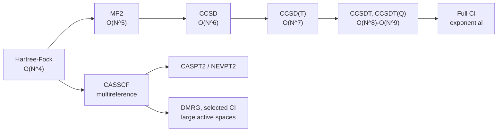
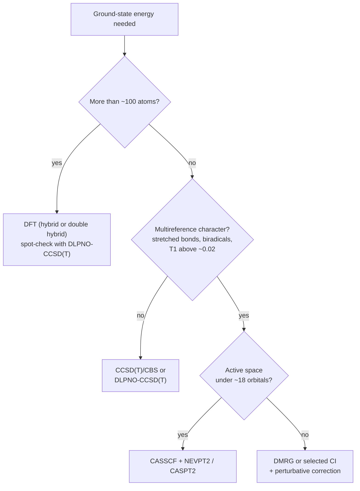

<p><a href="./">Computational Physics</a> › Electronic Structure Beyond DFT</p>

**Wavefunction (*ab initio*) methods** approximate the many-electron Schrödinger equation directly instead of through an approximate density functional. They form a **systematically improvable hierarchy** — Hartree-Fock, perturbation theory, configuration interaction, coupled cluster — in which more computation buys a controlled approach to the exact answer. This page covers that hierarchy, the multireference methods needed when a single determinant is a poor starting point, excited-state methods (TD-DFT, EOM-CC, GW/BSE), practical concerns such as basis sets and local correlation, and the GPU and machine-learning developments that are reshaping the field.

Density functional theory itself, and the Kohn-Sham self-consistent field, are covered in [Quantum Computational Methods](quantum-methods.html#density-functional-theory-dft); the two approaches are complementary and are routinely used to check one another.

## Why go beyond DFT?

Kohn-Sham DFT is the default for molecules and materials because it gives useful accuracy at roughly $O(N^3)$–$O(N^4)$ cost. Its weakness is structural: the exact exchange-correlation functional is unknown, and every practical functional (LDA, PBE, B3LYP, $\omega$B97M-V, …) has errors that cannot be reduced by spending more compute. There is no convergent path from a given functional to the exact answer.

Wavefunction methods take the opposite approach. They start from a well-defined mean-field reference and add electron correlation in a controlled way, so that — within a fixed one-electron basis — each step up the hierarchy approaches the exact (full CI) solution. The cost is steep scaling, from $O(N^5)$ to $O(N^7)$ and beyond, which restricts canonical implementations to small and medium molecules. They are used for:

- **Benchmarks** that calibrate DFT functionals and train machine-learned models.
- **Cases where DFT is known to fail**: dispersion-bound complexes, reaction barriers, conformer energies within a few kJ/mol, stretched bonds and biradicals, charge-transfer and doubly excited states.
- **Spectroscopic accuracy** for small systems, where sub-kJ/mol errors matter.



The main chain is the single-reference ladder; the CASSCF branch is the multireference route used when no single determinant dominates. In a finite basis both converge to full CI; the remaining basis-set error is removed separately by extrapolation or explicitly correlated (F12) methods.

## The electronic structure problem

Within the Born-Oppenheimer approximation the nuclei are held fixed and the electrons are solved for in their field. The non-relativistic electronic Hamiltonian in atomic units ($\hbar = m_e = e = 4\pi\varepsilon_0 = 1$) is

$$
\hat{H} = -\frac{1}{2}\sum_i \nabla_i^2 \;-\; \sum_{i,A}\frac{Z_A}{r_{iA}} \;+\; \sum_{i<j}\frac{1}{r_{ij}}
$$

The terms are the electronic kinetic energy, the electron-nucleus attraction, and the electron-electron repulsion. The last term couples every electron to every other, so the exact wavefunction $\Psi(\mathbf{x}_1, \dots, \mathbf{x}_N)$ (with $\mathbf{x}$ combining position and spin) is not a product of one-electron functions and has no closed-form solution for more than one electron.

Every method below is a strategy for approximating $\Psi$ and $E = \langle \Psi | \hat{H} | \Psi \rangle$. For variational methods the **variational principle** applies: for any normalized trial function,

$$
E[\Psi] = \langle \Psi | \hat{H} | \Psi \rangle \;\geq\; E_0
$$

so minimizing over a family of trial functions gives an upper bound to the exact ground-state energy $E_0$. Perturbative and coupled-cluster energies are *not* variational and can fall below $E_0$.

Two properties recur when comparing methods:

- **Size consistency**: the energy of two non-interacting fragments computed together equals the sum of their separate energies. A method that fails this cannot describe dissociation correctly.
- **Size extensivity**: the correlation energy scales linearly with the number of electrons. Without it, the fraction of correlation energy recovered drops as molecules grow.

## Hartree-Fock: the mean-field reference

Hartree-Fock (HF) approximates the wavefunction by a **single Slater determinant** of orthonormal spin-orbitals $\chi_i$:

$$
\Psi_{\mathrm{HF}}(\mathbf{x}_1, \dots, \mathbf{x}_N) = \frac{1}{\sqrt{N!}}
\begin{vmatrix}
\chi_1(\mathbf{x}_1) & \chi_2(\mathbf{x}_1) & \cdots & \chi_N(\mathbf{x}_1) \\
\chi_1(\mathbf{x}_2) & \chi_2(\mathbf{x}_2) & \cdots & \chi_N(\mathbf{x}_2) \\
\vdots & \vdots & \ddots & \vdots \\
\chi_1(\mathbf{x}_N) & \chi_2(\mathbf{x}_N) & \cdots & \chi_N(\mathbf{x}_N)
\end{vmatrix}
$$

The determinant is antisymmetric under exchange of any two electrons, so the Pauli principle is built in. Minimizing the energy with respect to the orbitals gives the **Hartree-Fock equations**, eigenvalue problems for the one-electron **Fock operator**:

$$
\hat{F}\,\chi_i = \varepsilon_i\,\chi_i, \qquad
\hat{F} = \hat{h} + \sum_{j}^{\mathrm{occ}} \left( \hat{J}_j - \hat{K}_j \right)
$$

$\hat{h}$ is the one-electron (kinetic plus nuclear attraction) operator, $\hat{J}_j$ the **Coulomb operator** (classical repulsion from the charge density of orbital $j$), and $\hat{K}_j$ the **exchange operator**, a non-classical term that arises from antisymmetry. Because $\hat{F}$ depends on the occupied orbitals, HF is a **self-consistent field (SCF)** problem, solved iteratively like the Kohn-Sham equations of DFT.

Expanding the orbitals in $K$ atom-centred basis functions turns the HF equations into the matrix **Roothaan-Hall equations**

$$
\mathbf{F}\,\mathbf{C} = \mathbf{S}\,\mathbf{C}\,\boldsymbol{\varepsilon}
$$

where $\mathbf{F}$ is the Fock matrix, $\mathbf{S}$ the overlap matrix (atomic basis functions are not orthogonal), $\mathbf{C}$ the orbital coefficients, and $\boldsymbol{\varepsilon}$ the diagonal matrix of orbital energies. Each SCF iteration solves this generalized eigenvalue problem; convergence is accelerated with DIIS extrapolation. Building $\mathbf{F}$ requires the two-electron integrals, formally $O(K^4)$; integral screening and density fitting reduce the practical cost substantially.

The **restricted** (RHF) form pairs $\alpha$ and $\beta$ electrons in the same spatial orbitals and suits closed-shell molecules; **unrestricted** HF (UHF) allows different spatial orbitals for each spin and is used for open shells, at the price of spin contamination.

### Correlation energy

HF treats exchange exactly but electron repulsion only on average: each electron moves in the mean field of the others and does not respond to their instantaneous positions. The energy missing from HF defines the **correlation energy**:

$$
E_{\mathrm{corr}} = E_{\mathrm{exact}} - E_{\mathrm{HF}}
$$

It is negative and typically about 1% of the total energy, but bond energies, reaction barriers, and intermolecular interactions are of the same size, so recovering it accurately is the purpose of every post-HF method. Correlation is often split into **dynamic** correlation (short-range avoidance of electrons, captured well by perturbation theory and coupled cluster) and **static** or **nondynamic** correlation (near-degeneracy of several determinants, which needs a multireference treatment).

```python
# Hartree-Fock with PySCF (tested with PySCF 2.14)
from pyscf import gto, scf

mol = gto.M(
    atom="""
        O  0.0000  0.0000  0.1173
        H  0.0000  0.7572 -0.4692
        H  0.0000 -0.7572 -0.4692
    """,                 # geometry in Angstrom
    basis="cc-pVDZ",     # correlation-consistent double-zeta basis
    verbose=0,
)

mf = scf.RHF(mol).run()  # closed-shell restricted Hartree-Fock
e_hf = mf.e_tot
homo = mol.nelectron // 2 - 1
print(f"E(HF)         = {e_hf:.6f} Eh")                       # -76.026772
print(f"HOMO-LUMO gap = {mf.mo_energy[homo + 1] - mf.mo_energy[homo]:.4f} Eh")
# mf.mo_coeff and mf.mo_energy are the reference for every post-HF method below
```

## Møller-Plesset perturbation theory (MP2)

The cheapest route to correlation is **Møller-Plesset perturbation theory**: take the sum of Fock operators as the zeroth-order Hamiltonian and treat the remainder as the perturbation. The first correction beyond HF appears at **second order (MP2)**:

$$
E^{(2)} = \sum_{i<j}^{\mathrm{occ}} \sum_{a<b}^{\mathrm{virt}}
\frac{\left| \langle ij \,\|\, ab \rangle \right|^2}{\varepsilon_i + \varepsilon_j - \varepsilon_a - \varepsilon_b}
$$

The sum runs over pairs of occupied spin-orbitals $i, j$ promoted to pairs of virtual orbitals $a, b$; $\langle ij \Vert ab \rangle$ is the antisymmetrized two-electron integral and the denominator is the orbital-energy gap of the double excitation (always negative for a well-behaved reference, so $E^{(2)} < 0$).

MP2 scales as $O(N^5)$ — the integral transformation from the atomic to the molecular basis dominates — and with density fitting (RI-MP2) it is routine for molecules with hundreds of atoms. It typically recovers 80–95% of the correlation energy of closed-shell molecules near equilibrium. Its weaknesses:

- It **overbinds dispersion** in extended $\pi$-stacked systems; spin-component-scaled variants (SCS-MP2) partly correct this.
- It **diverges** when the HOMO-LUMO gap closes, because the denominator approaches zero; metals and stretched bonds are out of reach.
- The MP series ($\mathrm{MP}n$) does not converge reliably beyond second order, so higher orders are rarely worth their cost.

MP2 also appears inside **double-hybrid functionals** (B2PLYP, DSD-PBEP86, $\omega$B97M(2)), which mix a scaled MP2 correlation term into DFT and are among the most accurate functionals for main-group thermochemistry.

```python
from pyscf import mp

mp2 = mp.MP2(mf).run()
print(f"E_corr(MP2) = {mp2.e_corr:.6f} Eh")   # -0.204004
```

## Configuration interaction

**Configuration interaction (CI)** writes the wavefunction as a linear combination of the HF determinant $\Phi_0$ and determinants obtained by exciting electrons into virtual orbitals:

$$
\Psi_{\mathrm{CI}} = c_0 \Phi_0 + \sum_{ia} c_i^a \Phi_i^a + \sum_{i<j,\,a<b} c_{ij}^{ab}\,\Phi_{ij}^{ab} + \cdots
$$

The coefficients are found by diagonalizing $\hat{H}$ in the space of determinants, so CI energies are variational upper bounds.

- **CISD** truncates at single and double excitations and scales as $O(N^6)$. It is **not size-consistent**: for $M$ non-interacting molecules the fraction of correlation energy it recovers falls towards zero as $M$ grows, because the product of two fragments' double excitations is a quadruple excitation that CISD omits. Coupled cluster fixes this and has replaced CISD in practice.
- **Full CI (FCI)** includes every excitation and is exact within the basis. The number of determinants grows combinatorially — for $n$ spatial orbitals with $N_\alpha$ and $N_\beta$ electrons it is $\binom{n}{N_\alpha}\binom{n}{N_\beta}$ — so water in cc-pVDZ (24 orbitals, 5 + 5 electrons) already needs about $1.8 \times 10^9$ determinants. FCI is used to benchmark other methods on very small systems.

**Selected CI** methods (CIPSI, heat-bath CI, adaptive sampling CI) iteratively add only determinants with large estimated contributions and then correct perturbatively, reaching near-FCI accuracy for active spaces far beyond conventional FCI. **FCI quantum Monte Carlo** (FCIQMC) samples the CI vector stochastically for the same purpose.

```python
from pyscf import fci

# Full CI is feasible only for tiny spaces: use the smaller 6-31G basis (13 orbitals)
small = gto.M(atom=mol.atom, basis="6-31g", verbose=0)
mf_small = scf.RHF(small).run()
e_fci = fci.FCI(mf_small).kernel()[0]
print(f"E_corr(FCI)/6-31G = {e_fci - mf_small.e_tot:.6f} Eh")   # -0.136900
```

## Coupled cluster

**Coupled cluster (CC)** theory uses an **exponential ansatz**:

$$
\Psi_{\mathrm{CC}} = e^{\hat{T}}\,\Phi_0, \qquad
\hat{T} = \hat{T}_1 + \hat{T}_2 + \hat{T}_3 + \cdots
$$

where $\hat{T}_n$ generates all $n$-fold excitations weighted by unknown **amplitudes**. Expanding the exponential produces products such as $\tfrac{1}{2}\hat{T}_2^2$ — simultaneous, independent pair excitations on different parts of the system — even when $\hat{T}$ is truncated. These terms make truncated CC **size-consistent and size-extensive**, which is exactly what CISD lacks.

Truncating at doubles gives **CCSD**, which scales as $O(N^6)$. The amplitudes are found by projecting the similarity-transformed Schrödinger equation onto excited determinants, giving coupled nonlinear equations solved iteratively:

$$
E_{\mathrm{CC}} = \langle \Phi_0 | e^{-\hat{T}}\,\hat{H}\,e^{\hat{T}} | \Phi_0 \rangle, \qquad
\langle \Phi_{ij}^{ab} | e^{-\hat{T}}\,\hat{H}\,e^{\hat{T}} | \Phi_0 \rangle = 0
$$

with an analogous condition for single excitations. Because $e^{-\hat{T}}\hat{H}e^{\hat{T}}$ is not Hermitian, the CC energy is not variational.

**CCSD(T)** adds a non-iterative, perturbative estimate of connected triple excitations at $O(N^7)$ cost. For single-reference molecules near equilibrium it is called the **"gold standard"** of quantum chemistry: at the complete-basis-set limit it typically reaches **chemical accuracy**, errors below 1 kcal/mol ($\approx 4.2$ kJ/mol $\approx 1.6$ mEh), for reaction energies and barrier heights. Higher levels — CCSDT, CCSDT(Q), CCSDTQ — are used in high-accuracy composite schemes (HEAT, W4) that target sub-kJ/mol accuracy for small molecules.

CCSD(T) fails when the reference is poor. For stretched bonds, biradicals, and many transition-metal compounds several determinants carry large weights; the perturbative triples then overshoot, and potential-energy curves can turn over unphysically. Two quick diagnostics from a CCSD calculation are the $T_1$ diagnostic, $T_1 = \lVert \mathbf{t}_1 \rVert / \sqrt{N_{\mathrm{el}}}$ (values above about 0.02 for closed-shell organic molecules warn of multireference character), and unusually large $\hat{T}_2$ amplitudes.

```python
import numpy as np
from pyscf import cc

mycc = cc.CCSD(mf).run()
e_t = mycc.ccsd_t()                                  # perturbative triples
print(f"E_corr(CCSD)    = {mycc.e_corr:.6f} Eh")     # -0.213327
print(f"E_corr(CCSD(T)) = {mycc.e_corr + e_t:.6f} Eh")  # -0.216386

t1_diag = np.linalg.norm(mycc.t1) / np.sqrt(mol.nelectron)
print(f"T1 diagnostic   = {t1_diag:.4f}")            # 0.0053: single-reference
```

For water near equilibrium the ladder behaves as expected. In the 6-31G basis, where FCI is affordable, CCSD(T) recovers 99.6% of the exact correlation energy:

| Method (water) | $E_{\mathrm{corr}}$, cc-pVDZ (Eh) | $E_{\mathrm{corr}}$, 6-31G (Eh) |
|---|---|---|
| MP2 | −0.2040 | — |
| CCSD | −0.2133 | — |
| CCSD(T) | −0.2164 | −0.1364 |
| Full CI | not feasible (~$10^9$ determinants) | −0.1369 |

The larger magnitude in cc-pVDZ is a basis-set effect: correlation energy grows as polarization functions are added, and even cc-pVDZ is far from the basis-set limit.

## Multireference methods

When static correlation matters, the reference itself must contain several determinants. The standard approach is the **complete active space self-consistent field (CASSCF)** method: choose an active space of $n$ electrons in $m$ orbitals — written CAS($n$e, $m$o) — perform FCI within it, and simultaneously optimize the orbitals. CASSCF captures static correlation but little dynamic correlation, so it is followed by a perturbative correction:

- **CASPT2** — second-order perturbation theory on the CASSCF reference; widely used for photochemistry. Intruder-state problems are handled with level shifts.
- **NEVPT2** — uses a partially bielectronic zeroth-order Hamiltonian that avoids intruder states and is strictly size-consistent.
- **MRCI+Q** — multireference CI with a Davidson correction; very accurate but expensive.

The main limitation is the exponential cost of the active space: conventional CASSCF tops out around 18 electrons in 18 orbitals. The **density matrix renormalization group (DMRG)**, which represents the active-space wavefunction as a matrix product state, and **selected CI** extend this to active spaces of 50–100 orbitals, enough for multinuclear transition-metal clusters such as those in nitrogenase and photosystem II. Choosing the active space remains a matter of chemical judgment, although automated schemes based on orbital entanglement or natural-orbital occupations (AVAS, autoCAS) now assist.

```python
from pyscf import mcscf

# CASSCF with 8 electrons in 6 orbitals around the HOMO/LUMO
mc = mcscf.CASSCF(mf, 6, 8).run()        # (ncas, nelecas)
print(f"E(CASSCF) = {mc.e_tot:.6f} Eh")  # -76.079745
# Dynamic correlation on top: from pyscf import mrpt; mrpt.NEVPT(mc).kernel()
```



The decision tree above is a common starting point, not a rule: large systems with strong correlation (for example, extended transition-metal materials) usually require embedding methods that treat a small region at a high level and the rest with DFT.

## Excited states

The methods above target the ground state. Absorption and emission spectra, photochemistry, and band gaps require excited states.

### Time-dependent DFT

**Linear-response time-dependent DFT (TD-DFT)** computes how the ground-state density responds to a weak oscillating field; the poles of the response function are the excitation energies. In an orbital basis this becomes the **Casida equation**:

$$
\begin{pmatrix} \mathbf{A} & \mathbf{B} \\ \mathbf{B}^{*} & \mathbf{A}^{*} \end{pmatrix}
\begin{pmatrix} \mathbf{X} \\ \mathbf{Y} \end{pmatrix}
= \omega
\begin{pmatrix} \mathbf{1} & \mathbf{0} \\ \mathbf{0} & -\mathbf{1} \end{pmatrix}
\begin{pmatrix} \mathbf{X} \\ \mathbf{Y} \end{pmatrix}
$$

The eigenvalues $\omega$ are excitation energies and the eigenvectors $(\mathbf{X}, \mathbf{Y})$ give the transition densities, hence oscillator strengths. $\mathbf{A}$ contains orbital-energy differences plus Coulomb and exchange-correlation kernel couplings; $\mathbf{B}$ couples excitations with de-excitations. Setting $\mathbf{B} = 0$ gives the **Tamm-Dancoff approximation (TDA)**, which is cheaper and often more robust, particularly for triplets and near conical intersections.

TD-DFT costs about as much as a ground-state hybrid-DFT calculation and is the default for organic chromophores and large molecules, typically with errors of 0.2–0.4 eV for valence excitations. Its known failures:

- **Charge-transfer and Rydberg states** are badly underestimated by standard hybrids; range-separated hybrids (CAM-B3LYP, $\omega$B97X-D, LC-$\omega$PBE) with long-range exact exchange correct much of this.
- **Double excitations** are absent in the adiabatic approximation (frequency-independent kernel).
- **Conical intersections** between the ground and first excited state are qualitatively wrong in linear response; spin-flip TD-DFT is a common workaround.

Real-time TD-DFT, which propagates the density under an explicit field and Fourier-transforms the dipole response, is discussed with wavefunction propagation in [Quantum Computational Methods](quantum-methods.html).

```python
from pyscf import dft, tddft

mf_dft = dft.RKS(mol, xc="cam-b3lyp").run()   # range-separated hybrid reference
td = tddft.TDDFT(mf_dft)                      # tddft.TDA(mf_dft) for Tamm-Dancoff
td.nstates = 5
td.kernel()

for n, (e, f) in enumerate(zip(td.e, td.oscillator_strength()), start=1):
    print(f"S{n}: {e * 27.211386:6.3f} eV   f = {f:.4f}")   # S1: 7.684 eV
```

The first singlet of water computed this way (7.68 eV) lies above the experimental absorption onset near 7.4 eV. Part of the gap is the basis: water's low-lying states have Rydberg character, and cc-pVDZ has no diffuse functions. For excited states, augmented sets (aug-cc-pVDZ or larger) are the minimum.

### Equation-of-motion coupled cluster

**EOM-CCSD** applies a linear excitation operator to the CCSD ground state and diagonalizes the similarity-transformed Hamiltonian $e^{-\hat{T}}\hat{H}e^{\hat{T}}$ in the space of singly and doubly excited determinants, at $O(N^6)$ cost. Variants target different states: **EE-EOM** for neutral excitations, **IP-** and **EA-EOM** for ionization and electron attachment, and **SF-EOM** (spin-flip) for biradicals. EOM-CCSD is accurate to about 0.1–0.3 eV for singly excited valence states and is the usual benchmark for TD-DFT. The cheaper **CC2** and **ADC(2)** methods scale as $O(N^5)$ and are widely used for larger chromophores. States with strong multiconfigurational character, as in transition-metal photochemistry, need **CASPT2** or **NEVPT2** instead.

### GW and the Bethe-Salpeter equation

For solids and for accurate ionization potentials and electron affinities, the standard approach is **many-body perturbation theory**. The **GW approximation** computes quasiparticle energies from a self-energy $\Sigma = iGW$, the product of the one-particle Green's function $G$ and the screened Coulomb interaction $W$. One-shot $G_0W_0$ on top of a DFT reference largely corrects the band-gap underestimate of LDA and GGA functionals, and self-consistent variants reduce the dependence on the starting point. Optical spectra, which involve electron-hole pairs (excitons), are then obtained by solving the **Bethe-Salpeter equation (BSE)** on top of GW. GW/BSE is standard in solid-state codes (BerkeleyGW, Yambo, VASP) and increasingly available in molecular codes, including PySCF.

## Cost and accuracy

| Method | Correlation treated | Formal scaling | Variational | Size-consistent | Typical use |
|---|---|---|---|---|---|
| Hartree-Fock | None (mean field) | $O(N^4)$ | Yes | Yes | Reference for post-HF methods |
| Kohn-Sham DFT | Approximate, via functional | $O(N^3)$–$O(N^4)$ | Yes (for given functional) | Yes | Default for large molecules and materials |
| MP2 | Dynamic, second order | $O(N^5)$ | No | Yes | Non-covalent interactions, double hybrids |
| CISD | Partial | $O(N^6)$ | Yes | **No** | Mostly historical |
| CCSD | Most dynamic | $O(N^6)$ | No | Yes | Correlated energies, EOM reference |
| CCSD(T) | Near-complete (single reference) | $O(N^7)$ | No | Yes | Thermochemistry benchmark |
| CASSCF + NEVPT2 | Static + dynamic | Exponential in active space | No | Yes | Bond breaking, multireference states |
| Full CI | Exact in basis | Exponential | Yes | Yes | Benchmarks for tiny systems |
| TD-DFT | Approximate | $O(N^3)$–$O(N^4)$ | — | Yes | Excited states of large molecules |
| EOM-CCSD | Most (excited states) | $O(N^6)$ | — | For excitation energies | Excited-state benchmarks |

$N$ measures system size (number of basis functions). The scaling exponents are formal; integral screening, density fitting, and local approximations reduce practical costs substantially.

### Basis-set convergence

Correlation energies converge slowly with basis size because a finite sum of smooth one-electron functions cannot reproduce the **electron-electron cusp**, the kink in the exact wavefunction where two electrons meet. For the correlation-consistent family cc-pV$X$Z with cardinal number $X$ (D = 2, T = 3, Q = 4, 5, …) the error falls roughly as $X^{-3}$, which motivates the two-point **complete-basis-set (CBS) extrapolation**

$$
E_{\mathrm{corr}}^{\mathrm{CBS}} \approx \frac{X^3 E_{\mathrm{corr}}^{(X)} - (X-1)^3 E_{\mathrm{corr}}^{(X-1)}}{X^3 - (X-1)^3}
$$

usually from triple- and quadruple-zeta results. The HF energy converges much faster and is extrapolated separately or taken from the largest basis. **Explicitly correlated F12 methods** add terms depending directly on $r_{12}$ to the wavefunction; CCSD(T)-F12 in a triple-zeta basis typically matches conventional CCSD(T) in a basis two cardinal numbers larger. Anions, Rydberg states, and weak interactions need **diffuse (augmented) functions**, and core-correlation effects need core-valence sets (cc-pCV$X$Z).

### Local correlation

Dynamic correlation is short-ranged: two electrons in localized orbitals far apart barely correlate. **Local correlation** methods exploit this by working in localized occupied orbitals and compact, pair-specific virtual spaces. The most widely used is **DLPNO-CCSD(T)** (domain-based local pair natural orbitals, implemented in ORCA), whose cost grows nearly linearly with system size and which reproduces canonical CCSD(T) relative energies to within about 1 kcal/mol with default thresholds. Related approaches include PNO-LCCSD(T) in Molpro and LNO-CCSD(T) in MRCC. These methods have made CCSD(T)-quality energies routine for systems with hundreds of atoms, such as enzyme active-site models and organometallic catalysts. The truncation thresholds introduce an error of their own, so benchmark work reports results at tightened thresholds.

## Recent developments

Several trends have changed practice in the last few years:

- **GPU acceleration.** Density fitting and integral screening map well onto GPUs. [GPU4PySCF](https://github.com/pyscf/gpu4pyscf) runs HF, DFT (including analytic gradients, Hessians, and TD-DFT) on NVIDIA GPUs, with MP2 and CCSD at an experimental stage; an existing PySCF object is moved to the GPU with `.to_gpu()`. GPU-native codes such as TeraChem and QUICK, and GPU ports of coupled cluster in several packages, bring hybrid DFT on thousand-atom systems into the range of minutes to hours.
- **Machine-learned density functionals.** Functionals trained on large sets of high-level reference energies are beginning to close the gap to wavefunction accuracy. Microsoft Research's **Skala** functional (announced June 2025), trained on about 150,000 coupled-cluster-quality reaction energies, reaches near-chemical accuracy on the W4-17 atomization-energy benchmark at a cost comparable to meta-GGA functionals for large systems.
- **Neural-network wavefunctions.** Variational Monte Carlo with neural-network ansätze (FermiNet, PauliNet, Psiformer) achieves accuracy competitive with CCSD(T) for small molecules and handles bond breaking without an active space, at high GPU cost.
- **Large reference datasets.** High-level and large-scale DFT datasets, such as Meta's OMol25 (over 100 million DFT calculations at the $\omega$B97M-V/def2-TZVPD level), are used to train machine-learned interatomic potentials that reproduce DFT accuracy at a small fraction of the cost; see [Machine Learning for Physics](ml-for-physics.html#neural-network-interatomic-potentials).
- **Quantum computing.** Quantum phase estimation and variational eigensolvers target strongly correlated active spaces, but resource estimates for chemically relevant problems (such as the FeMo cofactor) still call for fault-tolerant hardware. Current demonstrations run on small active spaces that classical methods solve exactly; see [Quantum Algorithms Research](../../advanced/quantum-algorithms-research/).

## Software

Molecular codes use **Gaussian-type orbitals (GTOs)**, which make integrals analytic and suit finite systems. Solid-state codes use **plane waves** with pseudopotentials or the projector-augmented-wave (PAW) method, which suit periodic boundary conditions.

| Package | License | Strengths |
|---|---|---|
| **PySCF** | Open source (Apache 2.0) | Python-native HF, DFT, MP2, CC, EOM-CC, CASSCF, NEVPT2, FCI, GW; periodic systems; GPU4PySCF extension |
| **Psi4** | Open source (LGPL) | CC, SAPT for interaction-energy decomposition, Python API |
| **ORCA** | Free for academic use | DLPNO-CCSD(T), multireference methods, spectroscopy; Python interface (OPI) |
| **Molpro** | Commercial | High-accuracy CC, F12, PNO-LCCSD(T), MRCI |
| **MRCC** | Free for academic use | Arbitrary-order CC, LNO-CCSD(T) |
| **Q-Chem** | Commercial | Broad DFT and excited-state (EOM, ADC) coverage |
| **Gaussian** | Commercial | Long-established general-purpose code |
| **NWChem / NWChemEx** | Open source | Massively parallel CC for HPC systems |
| **OpenMolcas** | Open source | CASSCF, CASPT2, RASSCF, multireference photochemistry |
| **Quantum ESPRESSO, VASP, CP2K** | Open / commercial / open | Plane-wave or mixed-basis DFT for condensed phases; VASP and others add GW/BSE and RPA |

## See also

- [Quantum Computational Methods](quantum-methods.html) — DFT, the Kohn-Sham SCF, and real-time wavefunction propagation.
- [Monte Carlo &amp; Molecular Dynamics](monte-carlo-and-md.html) — variational and diffusion quantum Monte Carlo, an independent route to correlation energies.
- [Parallel &amp; High-Performance Computing](hpc-and-ml.html) — the parallel linear algebra and GPU techniques behind large electronic-structure calculations.
- [Machine Learning for Physics](ml-for-physics.html) — neural-network potentials trained on electronic-structure data.
- [Quantum Mechanics](../quantum-mechanics/) — the variational principle, perturbation theory, and the many-body Schrödinger equation.
- [Condensed Matter Physics](../condensed-matter/) — electronic structure and correlation in periodic solids.
