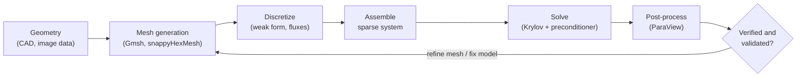
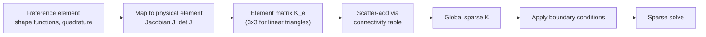

<p><a href="./">Computational Physics</a> › Finite Elements &amp; Fluid Dynamics</p>

The **finite element method (FEM)** solves partial differential equations on arbitrary geometries by approximating the solution with simple functions on a mesh of small elements. **Computational fluid dynamics (CFD)** applies FEM and related discretizations — finite differences, finite volumes, spectral methods, and the lattice Boltzmann method — to the equations of fluid flow. This page develops FEM from the weak form to a working 2D solver, then covers the incompressible Navier-Stokes equations, pressure-velocity coupling, finite-volume practice, turbulence modelling, and the lattice Boltzmann method. Each code example is a small, self-contained NumPy/SciPy implementation that has been checked against a known solution or a published benchmark.

## Discretization families

Every PDE solver replaces a continuous field with finitely many unknowns. The families differ in what those unknowns represent and in what they guarantee.

| Method | Unknowns represent | Geometry | Main strength | Typical use |
|---|---|---|---|---|
| Finite difference (FDM) | Point values on a grid | Simple (structured grids) | Easy to write, high order is cheap | Wave propagation, DNS in boxes, teaching |
| Finite volume (FVM) | Cell averages | Arbitrary unstructured meshes | Exact discrete conservation | Industrial CFD (OpenFOAM, Fluent) |
| Finite element (FEM) | Coefficients of piecewise polynomials | Arbitrary unstructured meshes | Rigorous error theory, natural boundary conditions, easy high order | Structural mechanics, electromagnetics, multiphysics |
| Spectral / spectral element | Global or high-order polynomial coefficients | Simple, or blocks of hexahedra | Exponential convergence for smooth solutions | Turbulence DNS, climate dynamical cores |
| Lattice Boltzmann (LBM) | Particle distribution functions | Voxelized, complex boundaries easy | Local, massively parallel updates | Porous media, complex geometries, GPU CFD |
| Particle (SPH, MPM) | Moving particles | Meshless | Free surfaces, large deformation | Splashing flows, astrophysics, fracture |

Whatever the method, the surrounding workflow is the same, and most of the effort in practice goes into the stages before and after the solve:



**Verification** asks whether the equations are solved correctly (convergence under mesh refinement, manufactured solutions); **validation** asks whether they are the right equations (comparison with experiment or benchmark data). Both appear in the examples below.

## The finite element method

### Weak formulation

Consider the Poisson problem on a domain $\Omega$ with $u = 0$ on the boundary $\partial\Omega$:

$$
-\nabla^2 u = f \quad \text{in } \Omega, \qquad u = 0 \quad \text{on } \partial\Omega
$$

Multiply by a **test function** $v$ that vanishes on the boundary, integrate over $\Omega$, and integrate by parts. The boundary term disappears and the result is the **weak form**: find $u \in V$ such that

$$
\int_\Omega \nabla u \cdot \nabla v \, d\Omega = \int_\Omega f\, v \, d\Omega \qquad \text{for all } v \in V
$$

where $V = H^1_0(\Omega)$ is the space of functions with square-integrable first derivatives that vanish on $\partial\Omega$. The weak form needs only first derivatives of $u$, so it admits piecewise-linear approximations that have no second derivative at all, and it is the natural setting for proving existence, uniqueness, and error bounds.

### Galerkin discretization

The **Galerkin method** replaces $V$ with a finite-dimensional subspace $V_h$ spanned by basis functions $\phi_1, \dots, \phi_n$ and uses the same functions as trial and test functions. Writing $u_h = \sum_j U_j \phi_j$ and taking $v = \phi_i$ gives a linear system:

$$
\mathbf{K}\,\mathbf{U} = \mathbf{F}, \qquad
K_{ij} = \int_\Omega \nabla\phi_i \cdot \nabla\phi_j \, d\Omega, \qquad
F_i = \int_\Omega f\,\phi_i \, d\Omega
$$

In FEM the basis functions are **piecewise polynomials with small support**: the linear "hat" function $\phi_i$ equals 1 at node $i$, 0 at every other node, and is nonzero only on elements touching node $i$. Consequently $K_{ij} \neq 0$ only when nodes $i$ and $j$ share an element, and the **stiffness matrix** $\mathbf{K}$ is sparse, symmetric, and positive definite.

**Céa's lemma** guarantees that the Galerkin solution is the best approximation to $u$ from $V_h$ in the energy norm $\lVert \nabla(u - u_h) \rVert_{L^2}$, and therefore quasi-optimal (optimal up to a constant) in the full $H^1$ norm. For polynomials of degree $p$ on elements of size $h$ and a sufficiently smooth solution, this gives

$$
\lVert u - u_h \rVert_{H^1} = O(h^{p}), \qquad \lVert u - u_h \rVert_{L^2} = O(h^{p+1})
$$

Accuracy can therefore be improved by refining the mesh (**$h$-refinement**), raising the polynomial degree (**$p$-refinement**), or both (**$hp$-FEM**, which achieves exponential convergence even for solutions with corner singularities when the mesh is graded towards them).

### Assembly

Integrals over $\Omega$ split into sums over elements. Each element contributes a small dense **element matrix**, computed on a fixed reference element and mapped to the physical element through the Jacobian of the coordinate transformation. The element matrices are then scattered into the global sparse matrix using the element's list of global node numbers (its **connectivity**).



In vectorized code the scatter-add is done by building lists of `(row, col, value)` triplets for all elements at once and letting a COO sparse matrix sum duplicate entries.

### Example: linear elements in 1D

For $-u'' = f$ on $[0, 1]$ with linear elements of length $h$, each element contributes

$$
K^e = \frac{1}{h}\begin{pmatrix} 1 & -1 \\ -1 & 1 \end{pmatrix}
$$

to the stiffness matrix. The load vector is integrated with two-point Gauss quadrature, which is exact for the cubic integrands produced by a quadratic $f$ times a linear basis function.

```python
import numpy as np
import scipy.sparse as sp
import scipy.sparse.linalg as spla

def fem_poisson_1d(f, n_el, a=0.0, b=1.0):
    """Solve -u'' = f on [a, b] with u(a) = u(b) = 0 using linear (P1) elements."""
    x = np.linspace(a, b, n_el + 1)
    h = np.diff(x)                                    # element lengths
    conn = np.column_stack([np.arange(n_el), np.arange(1, n_el + 1)])

    # Stiffness: K_e = (1/h) [[1, -1], [-1, 1]], assembled from COO triplets
    Ke = np.array([[1.0, -1.0], [-1.0, 1.0]])
    rows = np.repeat(conn, 2, axis=1).ravel()
    cols = np.tile(conn, (1, 2)).ravel()
    vals = (Ke[None, :, :] / h[:, None, None]).ravel()
    K = sp.coo_matrix((vals, (rows, cols)), shape=(n_el + 1,) * 2).tocsr()

    # Load vector: 2-point Gauss quadrature on every element (weights = 1)
    F = np.zeros(n_el + 1)
    for xi in (-1 / np.sqrt(3), 1 / np.sqrt(3)):
        N = np.array([(1 - xi) / 2, (1 + xi) / 2])    # shape functions at xi
        xq = x[:-1] + (xi + 1) * h / 2                # physical quadrature points
        np.add.at(F, conn, np.outer(f(xq) * h / 2, N))

    # Dirichlet conditions: solve for interior nodes only
    u = np.zeros(n_el + 1)
    u[1:-1] = spla.spsolve(K[1:-1, 1:-1], F[1:-1])
    return x, u

f = lambda x: np.pi**2 * np.sin(np.pi * x)            # exact solution: sin(pi x)
for n in (8, 16, 32, 64):
    x, u = fem_poisson_1d(f, n)
    xf = np.linspace(0, 1, 2001)
    err = np.sqrt(np.trapezoid((np.interp(xf, x, u) - np.sin(np.pi * xf))**2, xf))
    print(f"n = {n:3d}   L2 error = {err:.3e}")
# n =   8   L2 error = 9.910e-03
# n =  16   L2 error = 2.486e-03   <- each halving of h cuts the error by 4: O(h^2)
```

The $L^2$ error falls by a factor of four each time $h$ is halved, matching the $O(h^{p+1})$ estimate for $p = 1$.

### Example: linear triangles in 2D

On a triangle the linear shape functions are the **barycentric coordinates** $\lambda_1, \lambda_2, \lambda_3$, whose gradients are constant on the element. The gradient of $\lambda_k$ is the edge opposite vertex $k$, rotated by 90° and divided by twice the triangle's area $A$, so the element stiffness matrix is simply $K^e_{ij} = A\,\nabla\lambda_i \cdot \nabla\lambda_j$.

```python
import numpy as np
import scipy.sparse as sp
import scipy.sparse.linalg as spla

def unit_square_mesh(n):
    """Structured triangulation of the unit square: (n+1)^2 nodes, 2 n^2 triangles."""
    g = np.linspace(0.0, 1.0, n + 1)
    X, Y = np.meshgrid(g, g)
    nodes = np.column_stack([X.ravel(), Y.ravel()])
    i, j = np.meshgrid(np.arange(n), np.arange(n))
    v0 = (j * (n + 1) + i).ravel()                    # lower-left corner of each cell
    v1, v2, v3 = v0 + 1, v0 + n + 1, v0 + n + 2
    tris = np.vstack([np.column_stack([v0, v1, v3]),
                      np.column_stack([v0, v3, v2])])
    return nodes, tris

def p1_stiffness(nodes, tris):
    """Global P1 stiffness matrix K_ij = integral of grad(phi_i) . grad(phi_j)."""
    p = nodes[tris]                                   # (n_tri, 3, 2) vertex coordinates
    d1, d2 = p[:, 1] - p[:, 0], p[:, 2] - p[:, 0]
    area = 0.5 * np.abs(d1[:, 0] * d2[:, 1] - d1[:, 1] * d2[:, 0])
    # Edge opposite each vertex, rotated by 90 degrees, over 2A = grad(lambda_k)
    e = np.stack([p[:, 2] - p[:, 1], p[:, 0] - p[:, 2], p[:, 1] - p[:, 0]], axis=1)
    grads = np.stack([-e[..., 1], e[..., 0]], axis=-1) / (2 * area[:, None, None])
    Ke = area[:, None, None] * np.einsum("tid,tjd->tij", grads, grads)
    rows = np.repeat(tris, 3, axis=1).ravel()
    cols = np.tile(tris, (1, 3)).ravel()
    n = len(nodes)
    return sp.coo_matrix((Ke.ravel(), (rows, cols)), shape=(n, n)).tocsr(), area

def solve_poisson_2d(n, f):
    """-lap(u) = f on the unit square with u = 0 on the boundary."""
    nodes, tris = unit_square_mesh(n)
    K, area = p1_stiffness(nodes, tris)
    # Load vector: centroid quadrature, shared equally among the three vertices
    c = nodes[tris].mean(axis=1)
    F = np.zeros(len(nodes))
    np.add.at(F, tris, (f(c[:, 0], c[:, 1]) * area / 3)[:, None])
    x, y = nodes.T
    free = ~((x == 0) | (x == 1) | (y == 0) | (y == 1))
    u = np.zeros(len(nodes))
    u[free] = spla.spsolve(K[free][:, free], F[free])
    return nodes, u

f = lambda x, y: 2 * np.pi**2 * np.sin(np.pi * x) * np.sin(np.pi * y)
for n in (8, 16, 32, 64):
    nodes, u = solve_poisson_2d(n, f)
    exact = np.sin(np.pi * nodes[:, 0]) * np.sin(np.pi * nodes[:, 1])
    print(f"n = {n:3d}   max nodal error = {np.abs(u - exact).max():.3e}")
# 2.139e-02, 5.353e-03, 1.339e-03, 3.347e-04: second-order convergence
```

Replacing the structured mesh with one from a mesh generator such as [Gmsh](https://gmsh.info/) changes nothing else in the solver; this independence from geometry is the main practical advantage of FEM over finite differences.

### Beyond the Poisson equation

The same machinery extends to most linear PDEs, but several problem classes need more than continuous Lagrange elements:

- **Nearly incompressible elasticity and Stokes flow.** Low-order displacement elements **lock** (become artificially stiff) as Poisson's ratio approaches 1/2. Mixed formulations solve for velocity and pressure together and must satisfy the **inf-sup (LBB) condition**; the Taylor-Hood pair (quadratic velocity, linear pressure) is the standard stable choice, while equal-order pairs need stabilization.
- **Advection-dominated transport.** Standard Galerkin produces spurious oscillations when advection dominates diffusion (large element Péclet number). Streamline-upwind Petrov-Galerkin (**SUPG**) stabilization or **discontinuous Galerkin (DG)** methods, which use element-wise polynomials coupled by numerical fluxes, restore stability.
- **Electromagnetics.** Maxwell's equations need **Nédélec (edge) elements**, whose degrees of freedom are tangential components along edges, to avoid spurious modes.
- **Time-dependent problems.** Semi-discretizing in space gives $\mathbf{M}\dot{\mathbf{U}} + \mathbf{K}\mathbf{U} = \mathbf{F}$ with the **mass matrix** $M_{ij} = \int \phi_i \phi_j \, d\Omega$, which is then integrated with an implicit time stepper (backward Euler, Crank-Nicolson, BDF).
- **Error control.** A posteriori error estimators identify elements with large local error and drive **adaptive mesh refinement**, concentrating resolution where the solution varies rapidly.

### FEM in production: FEniCSx

Production FEM codes separate the mathematical description of the weak form from its implementation. In **FEniCSx** the variational problem is written in the Unified Form Language (UFL) and compiled to C kernels; the mesh is distributed with MPI and the linear algebra is delegated to PETSc. The same Poisson problem in DOLFINx (API as of the 0.10 and 0.11 releases):

```python
from mpi4py import MPI
import numpy as np
import ufl
from dolfinx import fem, mesh
from dolfinx.fem.petsc import LinearProblem

domain = mesh.create_unit_square(MPI.COMM_WORLD, 64, 64, mesh.CellType.triangle)
V = fem.functionspace(domain, ("Lagrange", 1))

# Homogeneous Dirichlet condition on the whole boundary
fdim = domain.topology.dim - 1
facets = mesh.locate_entities_boundary(
    domain, fdim, lambda x: np.full(x.shape[1], True))
dofs = fem.locate_dofs_topological(V, fdim, facets)
bc = fem.dirichletbc(np.float64(0.0), dofs, V)

# Weak form: a(u, v) = L(v)
u, v = ufl.TrialFunction(V), ufl.TestFunction(V)
x = ufl.SpatialCoordinate(domain)
f = 2 * ufl.pi**2 * ufl.sin(ufl.pi * x[0]) * ufl.sin(ufl.pi * x[1])
a = ufl.inner(ufl.grad(u), ufl.grad(v)) * ufl.dx
L = f * v * ufl.dx

problem = LinearProblem(
    a, L, bcs=[bc],
    petsc_options_prefix="poisson_",
    petsc_options={"ksp_type": "cg", "pc_type": "hypre"},  # CG + algebraic multigrid
)
uh = problem.solve()
```

Run under `mpiexec -n 8 python poisson.py`, the same script partitions the mesh across eight processes without modification. The legacy `dolfin` interface (FEniCS 2019.1) is no longer developed; new projects should use DOLFINx.

| Library | Language | Notes |
|---|---|---|
| [FEniCSx (DOLFINx)](https://fenicsproject.org/) | Python / C++ | UFL form language, PETSc backend, MPI parallel |
| [Firedrake](https://www.firedrakeproject.org/) | Python | UFL-based, strong on composable solvers and adjoints |
| [deal.II](https://www.dealii.org/) | C++ | Adaptive hexahedral meshes, $hp$-FEM, matrix-free GPU kernels |
| [MFEM](https://mfem.org/) | C++ | High-order and GPU-accelerated, used in US exascale projects |
| [NGSolve](https://ngsolve.org/) | Python / C++ | High-order, DG, electromagnetics |
| scikit-fem | Python | Lightweight, pure NumPy/SciPy assembly |
| COMSOL, Abaqus, ANSYS Mechanical | Commercial | GUI-driven multiphysics and structural analysis |

## Computational fluid dynamics

### Governing equations

For an incompressible Newtonian fluid with constant density $\rho$ and kinematic viscosity $\nu$, conservation of momentum and mass give the **Navier-Stokes equations**:

$$
\frac{\partial \mathbf{u}}{\partial t} + (\mathbf{u} \cdot \nabla)\mathbf{u} = -\frac{1}{\rho}\nabla p + \nu \nabla^2 \mathbf{u} + \mathbf{f}, \qquad \nabla \cdot \mathbf{u} = 0
$$

Non-dimensionalizing with a velocity scale $U$ and length scale $L$ leaves a single parameter, the **Reynolds number** $\mathrm{Re} = UL/\nu$, the ratio of inertial to viscous forces. Low-Re flows are smooth and laminar; above a geometry-dependent threshold (about 2300 for pipe flow) they become turbulent.

The equations are hard to solve numerically for three reasons:

1. **Nonlinearity.** The advection term $(\mathbf{u}\cdot\nabla)\mathbf{u}$ transfers energy between scales and makes the flow chaotic at high Re.
2. **Pressure-velocity coupling.** In incompressible flow pressure has no evolution equation of its own. It acts as a Lagrange multiplier that enforces $\nabla\cdot\mathbf{u} = 0$ instantaneously, so every time step requires a global elliptic solve.
3. **A wide range of scales.** In turbulence, the ratio of the largest to smallest eddies grows as $\mathrm{Re}^{3/4}$ per dimension, so a direct simulation needs about $\mathrm{Re}^{9/4}$ grid points in 3D.

Explicit time stepping is further limited by two stability conditions: the advective **CFL condition** $\Delta t \lesssim \Delta x / |\mathbf{u}|$ and the viscous limit $\Delta t \lesssim \Delta x^2 / (4\nu)$ in 2D. Semi-implicit schemes treat the viscous term implicitly to remove the second.

### The projection method

The **projection (fractional-step) method** of Chorin and Temam decouples velocity and pressure. Each step:

1. **Predict** an intermediate velocity $\mathbf{u}^{\ast}$ by advancing the momentum equation without the pressure gradient.
2. **Solve** a Poisson equation for pressure, chosen so that the corrected velocity is divergence-free:

$$
\nabla^2 p^{n+1} = \frac{\rho}{\Delta t}\,\nabla \cdot \mathbf{u}^*
$$

3. **Correct** the velocity by subtracting the pressure gradient: $\mathbf{u}^{n+1} = \mathbf{u}^{\ast} - \frac{\Delta t}{\rho}\nabla p^{n+1}$.

Step 3 is an orthogonal projection of $\mathbf{u}^{\ast}$ onto the space of divergence-free fields (the Helmholtz-Hodge decomposition). The pressure Poisson equation dominates the cost, so it is solved with the fastest available method: here a sparse LU factorization computed once and reused each step, in production codes multigrid-preconditioned Krylov solvers.

The standard test is the **lid-driven cavity**: fluid in a unit square, with the top wall sliding at unit speed. The following solver uses a collocated grid, central differences, and forward Euler time stepping (with $\rho = 1$).

```python
import numpy as np
import scipy.sparse as sp
from scipy.sparse.linalg import splu

def neumann_laplacian(n, h):
    """5-point Laplacian on an n x n node grid with dp/dn = 0 (mirror ghost nodes).
    One node is pinned to p = 0 to remove the constant null space."""
    T = sp.diags([1.0, -2.0, 1.0], [-1, 0, 1], shape=(n, n)).tolil()
    T[0, 1] = T[-1, -2] = 2.0                       # mirrored ghost node
    I = sp.identity(n)
    A = (sp.kron(I, T) + sp.kron(T, I)).tolil() / h**2
    A[0, :] = 0.0
    A[0, 0] = 1.0
    return splu(A.tocsc())                          # factor once, reuse every step

def lid_driven_cavity(n=41, re=100.0, t_end=25.0, dt=1e-3):
    """Chorin projection method; arrays are indexed [y, x], top row is the lid."""
    h, nu = 1.0 / (n - 1), 1.0 / re
    u, v = np.zeros((n, n)), np.zeros((n, n))
    u[-1, :] = 1.0                                  # moving lid
    poisson = neumann_laplacian(n, h)

    def ddx(a): return (a[1:-1, 2:] - a[1:-1, :-2]) / (2 * h)
    def ddy(a): return (a[2:, 1:-1] - a[:-2, 1:-1]) / (2 * h)
    def lap(a): return (a[1:-1, 2:] + a[1:-1, :-2] + a[2:, 1:-1] + a[:-2, 1:-1]
                        - 4 * a[1:-1, 1:-1]) / h**2

    for _ in range(int(round(t_end / dt))):
        # 1. Predictor: momentum without the pressure gradient
        us, vs = u.copy(), v.copy()
        uc, vc = u[1:-1, 1:-1], v[1:-1, 1:-1]
        us[1:-1, 1:-1] = uc + dt * (-uc * ddx(u) - vc * ddy(u) + nu * lap(u))
        vs[1:-1, 1:-1] = vc + dt * (-uc * ddx(v) - vc * ddy(v) + nu * lap(v))
        # 2. Pressure Poisson equation
        rhs = np.zeros((n, n))
        rhs[1:-1, 1:-1] = (ddx(us) + ddy(vs)) / dt
        rhs.flat[0] = 0.0                           # pinned node
        p = poisson.solve(rhs.ravel()).reshape(n, n)
        # 3. Corrector; wall values of u and v are never modified (no-slip, lid)
        u[1:-1, 1:-1] = us[1:-1, 1:-1] - dt * ddx(p)
        v[1:-1, 1:-1] = vs[1:-1, 1:-1] - dt * ddy(p)
    return u, v, p

u, v, p = lid_driven_cavity()
print("min u on the vertical centreline:", u[:, u.shape[1] // 2].min())
```

At Re = 100 the flow settles into a single primary vortex. The standard reference data are those of Ghia, Ghia and Shin (1982), whose minimum horizontal velocity on the vertical centreline is $u_{\min} \approx -0.211$. This solver gives $-0.193$ on a $41 \times 41$ grid and $-0.204$ on $81 \times 81$, converging towards the reference under refinement — an example of verification and validation in miniature.

The collocated arrangement with central differences is simple but allows a checkerboard pressure mode that the discrete Laplacian cannot see. Production codes avoid it either with a **staggered (MAC) grid**, which stores pressure at cell centres and velocity components on faces, or with **Rhie-Chow interpolation** of face velocities on collocated unstructured meshes.

### Finite volumes and pressure-velocity algorithms

Most general-purpose CFD codes use the **finite volume method**. The domain is divided into control volumes, and the integral form of each conservation law is applied to every cell: the rate of change of a cell average equals the sum of fluxes through its faces. Because the flux leaving one cell enters its neighbour, mass, momentum, and energy are conserved exactly at the discrete level, which is essential for flows with shocks.

The main design choice is how face fluxes are reconstructed from cell averages:

- **Upwind** schemes take the value from the upstream cell. First-order upwind is stable but strongly diffusive.
- **Central** and linear schemes are second order but oscillate near steep gradients.
- **TVD and limited schemes** (van Leer, MUSCL with limiters) blend the two, reverting to first order only where the solution is steep. For compressible flows with shocks, **Godunov-type** schemes with approximate Riemann solvers (Roe, HLLC) and **WENO** reconstructions are standard.

For incompressible and low-Mach flows, finite-volume codes use iterative pressure-velocity coupling algorithms rather than a single projection:

| Algorithm | Approach | Typical use |
|---|---|---|
| SIMPLE / SIMPLEC | Iterate momentum and pressure-correction equations with under-relaxation | Steady-state RANS |
| PISO | Several pressure corrections per time step, no under-relaxation | Transient flow with small time steps |
| PIMPLE | PISO within SIMPLE-style outer iterations | Transient flow with large time steps (OpenFOAM default) |
| Fractional step | Projection as above | LES and DNS on structured grids |

### Turbulence modelling

Resolving every eddy is affordable only at modest Reynolds numbers, so most engineering CFD models some or all of the turbulence.

| Approach | What is resolved | What is modelled | Relative cost | Typical use |
|---|---|---|---|---|
| **DNS** | All scales down to the Kolmogorov length | Nothing | Grid points $\sim \mathrm{Re}^{9/4}$ | Fundamental research, model calibration |
| **LES** | Large, energy-carrying eddies | Subgrid scales (Smagorinsky, dynamic, WALE) | High | Combustion, acoustics, separated flows |
| **Hybrid RANS-LES** (DES, DDES) | Separated regions as LES | Attached boundary layers as RANS | Medium-high | Aerospace, bluff bodies |
| **RANS** | Mean flow only | All turbulent fluctuations ($k$-$\varepsilon$, $k$-$\omega$ SST, Spalart-Allmaras) | Low | Industrial design, steady flows |

RANS models average the equations in time, producing the unclosed **Reynolds stress** tensor $-\overline{u_i' u_j'}$. Eddy-viscosity models close it with the Boussinesq hypothesis, $-\overline{u_i'u_j'} = \nu_t\left(\partial_j \bar{u}_i + \partial_i \bar{u}_j\right) - \tfrac{2}{3}k\,\delta_{ij}$, and solve transport equations for the turbulence quantities that set $\nu_t$. RANS remains the industrial workhorse, but it is least reliable exactly where engineers most need it: separation, strong curvature, and transition. Wall-modelled LES on GPUs is increasingly replacing it for such cases.

## The lattice Boltzmann method

The **lattice Boltzmann method (LBM)** does not discretize the Navier-Stokes equations directly. It evolves **particle distribution functions** $f_i(\mathbf{x}, t)$ — the density of fictitious particles moving with one of a small set of discrete velocities $\mathbf{c}_i$ — on a regular lattice. In two dimensions the standard **D2Q9** lattice has nine velocities: rest, four axis-aligned, and four diagonal.

<figure style="text-align:center; margin: 1.5rem auto; max-width: 260px;">
<svg viewBox="0 0 200 200" width="100%" role="img" aria-label="D2Q9 lattice velocity set: a rest particle at the centre, four axis-aligned velocities with weight 1/9, and four diagonal velocities with weight 1/36">
  <defs>
    <marker id="d2q9-arrow" viewBox="0 0 10 10" refX="9" refY="5" markerWidth="6" markerHeight="6" orient="auto-start-reverse">
      <path d="M0,0 L10,5 L0,10 z" fill="currentColor"/>
    </marker>
  </defs>
  <g stroke="currentColor" stroke-opacity="0.25" stroke-width="1" fill="none">
    <rect x="30" y="30" width="140" height="140"/>
    <line x1="100" y1="30" x2="100" y2="170"/>
    <line x1="30" y1="100" x2="170" y2="100"/>
  </g>
  <g stroke="currentColor" stroke-width="2" marker-end="url(#d2q9-arrow)">
    <line x1="100" y1="100" x2="162" y2="100"/>
    <line x1="100" y1="100" x2="100" y2="38"/>
    <line x1="100" y1="100" x2="38" y2="100"/>
    <line x1="100" y1="100" x2="100" y2="162"/>
    <line x1="100" y1="100" x2="160" y2="40" stroke-dasharray="4 3"/>
    <line x1="100" y1="100" x2="40" y2="40" stroke-dasharray="4 3"/>
    <line x1="100" y1="100" x2="40" y2="160" stroke-dasharray="4 3"/>
    <line x1="100" y1="100" x2="160" y2="160" stroke-dasharray="4 3"/>
  </g>
  <circle cx="100" cy="100" r="5" fill="currentColor"/>
  <g fill="currentColor" font-size="12" font-family="sans-serif" text-anchor="middle">
    <text x="112" y="116">0</text>
    <text x="182" y="104">1</text>
    <text x="100" y="22">2</text>
    <text x="18" y="104">3</text>
    <text x="100" y="190">4</text>
    <text x="178" y="26">5</text>
    <text x="22" y="26">6</text>
    <text x="22" y="186">7</text>
    <text x="178" y="186">8</text>
  </g>
</svg>
<figcaption>D2Q9 velocity set. Rest particle (0): weight 4/9. Axis directions 1–4 (solid): weight 1/9. Diagonals 5–8 (dashed): weight 1/36. Numbering matches the code below.</figcaption>
</figure>

Each time step has two stages. **Collision** relaxes the distributions at each node towards a local equilibrium (the Bhatnagar-Gross-Krook, or BGK, operator); **streaming** moves each $f_i$ one lattice site along $\mathbf{c}_i$:

$$
f_i(\mathbf{x} + \mathbf{c}_i \Delta t,\; t + \Delta t) = f_i(\mathbf{x}, t) - \frac{1}{\tau}\left[ f_i(\mathbf{x}, t) - f_i^{\mathrm{eq}}(\mathbf{x}, t) \right]
$$

The equilibrium is a second-order expansion of the Maxwell-Boltzmann distribution, with lattice sound speed $c_s^2 = 1/3$ in lattice units:

$$
f_i^{\mathrm{eq}} = w_i\,\rho \left[ 1 + \frac{\mathbf{c}_i \cdot \mathbf{u}}{c_s^2} + \frac{(\mathbf{c}_i \cdot \mathbf{u})^2}{2 c_s^4} - \frac{\mathbf{u} \cdot \mathbf{u}}{2 c_s^2} \right]
$$

Density and momentum are moments of the distributions, $\rho = \sum_i f_i$ and $\rho\mathbf{u} = \sum_i f_i \mathbf{c}_i$. A Chapman-Enskog expansion shows that, for small Mach number, these moments obey the Navier-Stokes equations with kinematic viscosity

$$
\nu = c_s^2 \left( \tau - \tfrac{1}{2} \right) \Delta t
$$

so $\tau$ must exceed $1/2$, and small viscosities (high Re) push $\tau$ towards the stability limit. The method is weakly compressible: incompressible behaviour requires the lattice Mach number $|\mathbf{u}|/c_s$ to stay well below 1, typically $|\mathbf{u}| \lesssim 0.1$ in lattice units.

Collision is purely local and streaming touches only nearest neighbours, so LBM parallelizes almost perfectly and runs close to memory-bandwidth limits on GPUs. Complex boundaries are handled by **bounce-back**: a population that would stream into a solid node is reflected back along its incoming direction, which places a no-slip wall halfway between lattice nodes. A moving wall adds a momentum correction proportional to $w_i \rho\, \mathbf{c}_i \cdot \mathbf{u}_{\mathrm{wall}}$.

```python
import numpy as np

# D2Q9 lattice: velocities, weights, and the index of the opposite direction
C = np.array([[0, 0], [1, 0], [0, 1], [-1, 0], [0, -1],
              [1, 1], [-1, 1], [-1, -1], [1, -1]])
W = np.array([4/9] + [1/9] * 4 + [1/36] * 4)
OPP = np.array([0, 3, 4, 1, 2, 7, 8, 5, 6])

def equilibrium(rho, ux, uy):
    cu = C[:, 0, None, None] * ux + C[:, 1, None, None] * uy
    return W[:, None, None] * rho * (1 + 3 * cu + 4.5 * cu**2 - 1.5 * (ux**2 + uy**2))

def lbm_cavity(n=64, re=100.0, u_lid=0.1, n_steps=20000):
    """Lid-driven cavity: BGK collisions, half-way bounce-back walls.
    Arrays are indexed f[i, y, x]; the row y = n - 1 is the moving lid."""
    nu = u_lid * n / re                      # lattice viscosity from Re = U L / nu
    tau = 3 * nu + 0.5                       # nu = c_s^2 (tau - 1/2), c_s^2 = 1/3
    f = equilibrium(np.ones((n, n)), np.zeros((n, n)), np.zeros((n, n)))

    for _ in range(n_steps):
        rho = f.sum(axis=0)
        ux = (f * C[:, 0, None, None]).sum(axis=0) / rho
        uy = (f * C[:, 1, None, None]).sum(axis=0) / rho

        f_post = f - (f - equilibrium(rho, ux, uy)) / tau          # collide
        for i, (cx, cy) in enumerate(C):                           # stream
            f[i] = np.roll(f_post[i], shift=(cy, cx), axis=(0, 1))

        # np.roll wraps populations around the domain edges; those entries are
        # exactly the ones that came "from a wall", so overwrite them by bounce-back.
        for i, (cx, cy) in enumerate(C):
            if cx == 1:  f[i][:, 0] = f_post[OPP[i]][:, 0]         # left wall
            if cx == -1: f[i][:, -1] = f_post[OPP[i]][:, -1]       # right wall
            if cy == 1:  f[i][0, :] = f_post[OPP[i]][0, :]         # bottom wall
            if cy == -1:                                           # moving lid
                f[i][-1, :] = f_post[OPP[i]][-1, :] + 6 * W[i] * rho[-1, :] * cx * u_lid
    return rho, ux / u_lid, uy / u_lid

rho, ux, uy = lbm_cavity()
print("min u/U on the vertical centreline:", ux[:, ux.shape[1] // 2].min())  # -0.2104
```

On a $64 \times 64$ lattice this gives $u_{\min}/U = -0.2104$, within 0.3% of the Ghia et al. value and closer than the simple finite-difference projection solver achieves on a finer grid. The single-relaxation-time BGK operator becomes unstable at high Re; production codes use **multiple-relaxation-time (MRT)**, cumulant, or regularized collision operators.

## CFD software

| Code | Method | Notes |
|---|---|---|
| [OpenFOAM](https://www.openfoam.com/) | Finite volume, unstructured | Two open-source lines: ESI-OpenCFD (twice-yearly vYYMM releases, v2606 in June 2026) and the OpenFOAM Foundation (numbered releases); large solver library |
| [SU2](https://su2code.github.io/) | Finite volume / FEM | Compressible aerodynamics, adjoint-based shape optimization |
| [NekRS](https://github.com/Nek5000/nekRS) | Spectral element | GPU-native successor to Nek5000 for DNS and LES |
| [Basilisk](http://basilisk.fr/) | Finite volume, adaptive quadtree/octree | Multiphase flow, surface tension, geophysical flows |
| [waLBerla](https://www.walberla.net/), [Palabos](https://palabos.unige.ch/), [OpenLB](https://www.openlb.net/) | Lattice Boltzmann | Massively parallel, GPU support |
| [JAX-Fluids](https://github.com/tumaer/JAXFLUIDS) | Finite volume, differentiable | End-to-end differentiable compressible solver in JAX |
| ANSYS Fluent, Siemens STAR-CCM+ | Finite volume | Commercial industrial standards, increasingly GPU-accelerated |

Machine-learned surrogates — neural operators and graph networks trained on solver output — can predict flow fields orders of magnitude faster than the solvers that generated their training data, but they do not yet replace solvers for design-critical work; see [Machine Learning for Physics](ml-for-physics.html#fourier-neural-operator-fno).

---

*Previous: [Quantum Computational Methods](quantum-methods.html) · Next: [Electronic Structure Beyond DFT](electronic-structure-beyond-dft.html)*

## See also

- [Parallel &amp; High-Performance Computing](hpc-and-ml.html) — domain decomposition, sparse Krylov solvers, and multigrid preconditioners for the systems assembled here.
- [Visualization, Libraries &amp; Best Practices](tools-and-practices.html) — visualizing flow fields and the scientific Python stack.
- [Classical Mechanics](../classical-mechanics/) — the continuum mechanics underlying elasticity and fluid dynamics.
- [Machine Learning for Physics](ml-for-physics.html) — physics-informed networks and neural-operator surrogates for PDEs.
